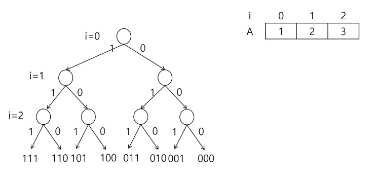
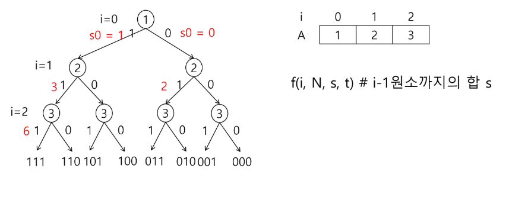
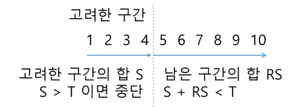
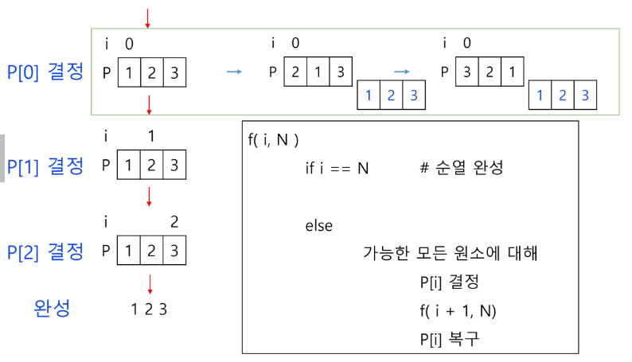
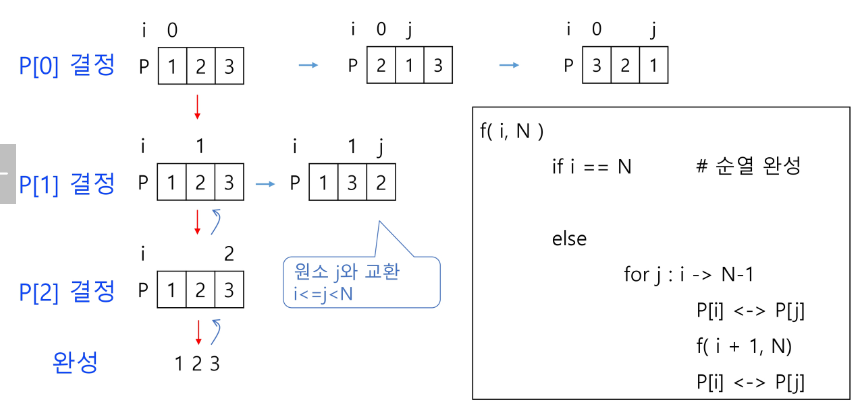

# Stack
## 부분집합 / 순열
### 연습문제2
- {1, 2, 3, 4, 5, 6, 7, 8, 9, 10}의 부분집합 중 합이 10인 부분집합의 개수
```python
def f(i, k, t):        # k개의 원소를 가진 배열 A, 부분집합 합이 t인 경우
    if i == k:      # 모든 원소에 대해 결정하면
        ss = 0      # 부분집합 원소의 합
        for j in range(k):
            if bit[i]:      # A[j]가 포함된 경우
                ss += A[j]
        if ss == t:
            for j in range(k):
                if bit[j]:  # A[j]가 포함된 경우
                print(A[j], end = ' ')
            print()
        else:
            for j in range(1, -1, -1):
                bit[i] = j
                f(i + 1, k, t)
            # bit[i] = 1  # for문과 동일
            # f(i + 1, k)
            # bit[i] = 0
            # f(i + 1, k)

N = 10
A = [1, 2, 3, 4, 5, 6, 7, 8, 9, 10]
bit = [0] * N
f(0, N, 10)
```

### 부분집합의 합
- 집합 {1, 2, 3} 의 원소에 대해 각 부분집합에서의 포함 여부를 트리로 표현

- i 원소의 포함 여부를 결정하면 i까지의 부분 집합의 합 Si를 결정할 수 있음
- S(i-1) 이 찾고자 하는 부분집합의 합보다 크면 남은 원소를 고려할 필요가 없음

- A[i] 원소를 부분집합의 원소로 고려하는 재귀함수 (A는 서로 다른 자연수의 집합)
```python
# i - 1 원소까지 고려한 합 s, 찾으려는 합 t
f(i, N, s, t)
    if s == t:      # i - 1 원소까지의 합이 찾는 값인 경우
        ...
    elif i == N:    # 모든 원소에 대한 고려가 끝난 경우
        ...
    elif s > t:     # 남은 원소를 고려할 필요가 없는 경우
        ...
    else:           # 남은 원소가 있고, s < t 인 경우
        subset[i] = 1
        f(i + 1, N, s + A[i], t)    # i 원소 포함
        subset[i] = 0
        f(i + 1, N, s, t)           # i 원소 미포함
```
```python
def f(i, k, s, t):
    global cnt
    cnt += 1
    if s == t:
        for j in range(k):
            if bit[j]:
                print(A[j], end = ' ')
    elif i == k:
        return
    elif s > t:
        return
    else:
        # for j in range(1, -1, -1):
        #     bit[i] = j
        #     f(i + 1, k, t)
        bit[i] = 1
        f(i + 1, k, s + A[i], t)
        bit[i] = 0
        f(i + 1, k, s, t)

N = 10
A = [1, 2, 3, 4, 5, 6, 7, 8, 9, 10]
bit = [0] * N
f(0, N, 0, 10)
print(cnt)
```
- 추가 고려 사항

- 남은 원소의 합을 다 더해도 찾는 값 T 미만인 경우 중단

### 순열
- A[1, 2, 3]의 모든 원소를 사용한 순열
    - 123, 132, 213, 231, 312, 321
    - 총 6가지 경우
```python
f(i, N)
    if i == N       # 순열 완성
        
    else:
        가능한 모든 원소에 대해
            P[i] 결정
            f(i + 1, N)
            P[i] 복구
```


```python
def f(i, k):
    if i == k:
        print(*P)
    else:
        for j in range(i, k):       # P[i] 자리에 올 원소 P[j]
            P[i], P[j] = P[j], P[i]
            f(i + 1, k)
            P[i], P[j] = P[j], P[i]

N = 3
P = [1, 2, 3]
f(0, N)
```
- 연습문제
```python
def f(i, k, s):     # s: i - 1까지 선택한 원소의 합
    global min_v
    global cnt
    cnt += 1
    if i == k:
        # print(*P)
        # s = 0       # 선택한 원소의 합
        # for j in range(k):
        #     s += arr[j][P[j]]   # j행에서 P[j] 열을 고른 경우의 합 구하기
        if min_v > s:
            min_v = s
    elif s >= min_v:
        return
    else:
        for j in range(i, k):       # P[i] 자리에 올 원소 P[j]
            P[i], P[j] = P[j], P[i]
            f(i + 1, k, s + arr[i][P[i]])
            P[i], P[j] = P[j], P[i]

N = int(input())
arr = [list(map(int, input().split())) for _ in range(N)]
P = [i for i in range(N)]
min_v = 100
cnt = 0
f(0, N, 0)
print(min_v, cnt)
```