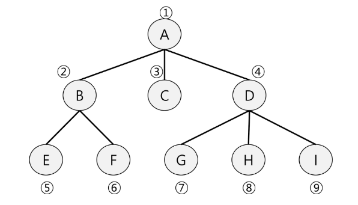
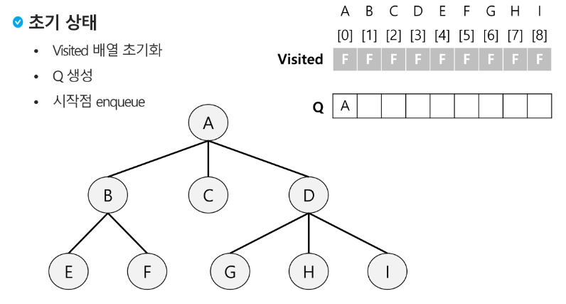
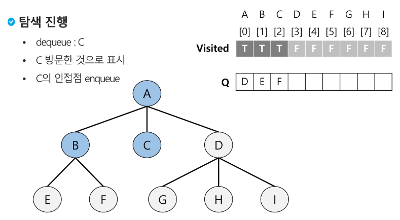
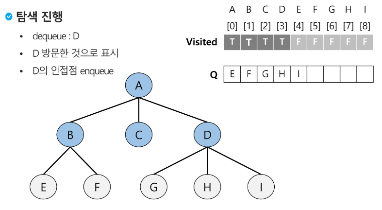
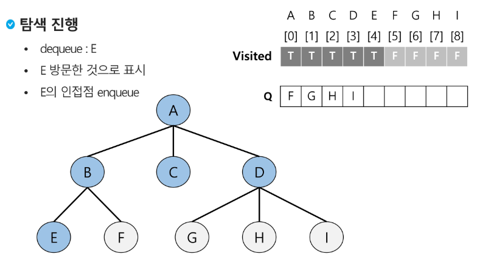
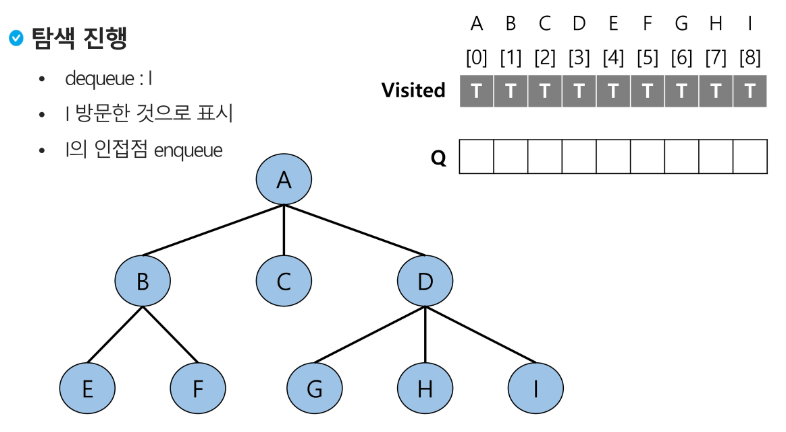
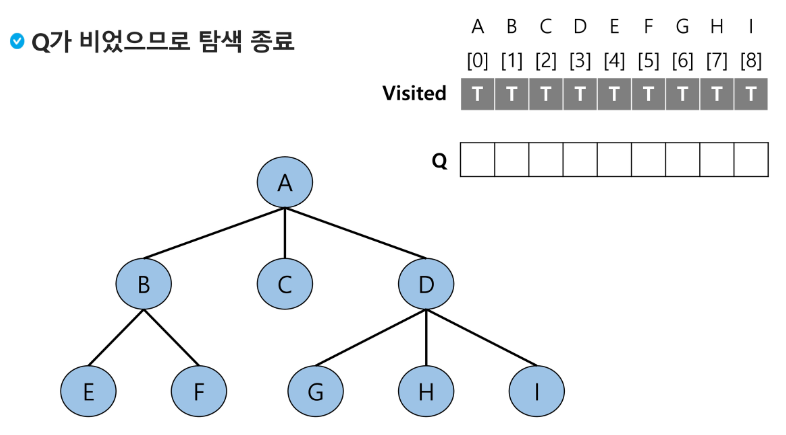
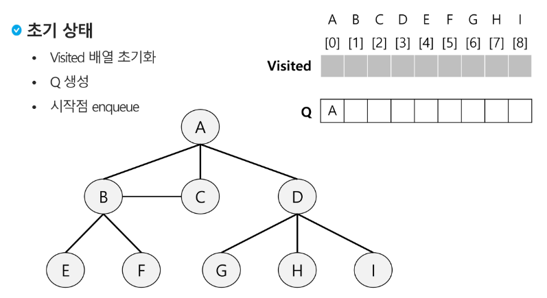

# Queue
## BFS(Breadth First Search)
- 그래프를 탐색하는 방법에는 크게 두 가지가 있음
    - 깊이 우선 탐색(Depth First Search, DFS)
    - 너비 우선 탐색(Breadth First Search, BFS)
- 너비 우선 탐색은 탐색 시작점의 인접한 정점들을 먼저 모두 차례로 방문한 후에, 방문했던 정점을 시작점으로 하여 다시 인접한 정점들을 차례로 방문하는 방식
- 인접한 정점들에 대해 탐색을 한 후, 차례로 다시 너비 우선 탐색을 진행해야 하므로, 선입선출 형태의 자료구조인 큐를 활용
- BFS는 예제 그래프를 아래와 같은 순서로 탐색함


### BFS 알고리즘
- 입력 파라미터: 그래프 G와 탐색 시작점 v
```python
def BFS(G, v):                          # 그래프 G, 시작점 ㅍ
    visited = [0] * (n + 1)             # n: 정점의 개수
    queue = []                          # 큐 생성
    queue.append(v)                     # 시작점 v를 큐에 삽입
    while queue:                        # 큐가 비어있지 않은 경우
        t = queue.pop(0)                # 큐의 첫번째 원소 반환
        if not visited[t]:              # 방문되지 않은 곳이라면
            visited[t] = True           # 방문한 것으로 표시
            visit(t)                    # 정점 t에서 할 일
            for i in G[t]:              # t와 연결된 모든 정점에 대해
            if not visited[i]:          # 방문되지 않은 곳이라면
                    queue.append(i)     # 큐에 넣기
```

#### BFS 예제
- 초기 상태     

- A 점부터 시작     

- 탐색 진행     





- Q가 비었으므로 탐색 종료      


 #### [참고] BFS 예제
- 초기 상태     

- 입력 파라미터: 그래프 G와 탐색 시작점 v
```python
def BFS(G, v, n):                           # 그래프 G, 탐색 시작점 v
    visited = [0] * (n + 1)                 # n: 정점의 개수
    queue = []                              # 큐 생성
    queue.append(v)                         # 시작점 v를 큐에 삽입
    visited[v] = 1
    while queue:                            # 큐가 비어있지 않은 경우
        t = queue.pop(0)                    # 큐의 첫번째 원소 반환
        visit(t)
        for i in G[t]:                      # t와 연결된 모든 정점에 대해
            if not visited[i]:              # 방문되지 않은 곳이라면
                queue.append(i)             # 큐에 넣기
                visited[i] = visited[t] + 1 # n으로부터 1만큼 이동
```