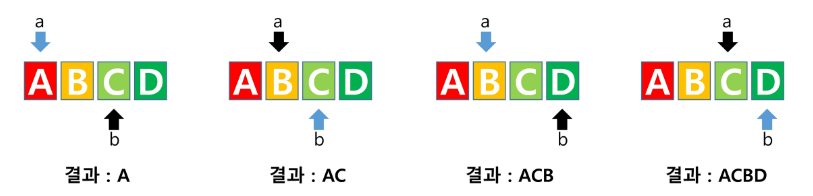
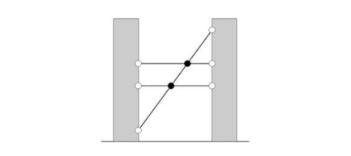

# Solution
## 문제 해결 능력 훈련 문제를 풀기 위한 절차
1. 문제 이해
    - 한 글자도 놓치지 않고, 문제가 요구하는 바를 명확하게 이해함
    - 예제가 손으로 검증할 수 있는 범위일 때, 손으로 검증해봄 (문제 이해를 확실히 했는지 알 수 있음)
    - N의 최소, 최댓값을 확인
2. 설계
    - 어떻게 구현할 것인지 종이와 펜을 준비하여 자유롭게 계획을 세워봄 (설계 = 계획)
    - 설계대로 구현을 했다면, 예제 데이터가 예상하는 정답이 나오는지 시뮬레이션 해봄 (**설계 검증**)
    - **설계가 완료되기 전까지, 구현을 시작하지 않음**
3. 구현 & 디버깅

## 6019. 기차 사이의 파리
### 문제
- 궁금증이 많은 한 소녀는 존 폰 노이만(John von Neumann) 에게 다음과 같은 문제를 질문함
- '두 기차 A, B가 서로를 향해 달리고 있다. 두 기차의 전면부는 250마일 떨어져 있고, 기차 A는 시속 10마일, B는 시속 15마일로 달리고 있다.
- 파리가 기차 A의 전면부에서 기차 B로 시속 20마일의 속력으로 날아간다. 파리가 기차 B의 전면부에 닿으면 바로 방향을 바꿔 기차 A를 향해 같은 속력으로 날아간다.
- 그러다 기차 A와 B가 충돌하면 파리는 죽을 것이다. 파리는 죽기 전까지 몇 마일의 거리를 이동했을까?'
- 폰 노이만은 소녀의 질문에 대해 즉시 무한 급수를 이용해 답이 200마일이라는 것을 계산해냈다.
- 소녀가 질문한 문제의 조금 더 일반화된 버전을 해결해 보자

#### 입력
- 첫번째 줄에 테스트 케이스의 수 T가 주어짐
- 각 테스트 케이스의 첫번째 줄에는 네 정수 D, A, B, F (1 <= D <= 10^3, 1 <= A <= B < F <= 10^2) 가 주어짐
- D는 두 기차의 전면부 사이의 거리, A는 기차 A의 속력, B는 기차 B의 속력, F는 파리의 속력
```python
'''
1
250 10 15 20
'''
```

#### 출력
- 각 테스트 케이스마다 '#t'(t는 테스트 케이스 번호를 의미하며 1부터 시작함) 를 출력하고 한 칸을 띄운 후, 각 테스트 케이스마다 파리가 이동한 거리를 출력함. 정답과의 절대오차나 상대오차가 10^-6 이하이면 정답으로 인정함
```python
'''
#1 200.0000000000
'''
```

### 풀이
```python
testcase = int(input())
for tc in range(1, testcase + 1):
    D, A, B, F = map(int, input().split())
    T = D * F / (A + B)
    print(f'#{tc} {T}')
```

## 16910. 원 안의 점
### 문제
- N이 주어질 때, 원점을 중심으로 반지름이 N인 원 안에 포함되는 격자점(x, y 좌표가 모두 정수인 점)의 개수를 구하는 프로그램을 작성하라
- 다시 말하자면, x2 + y2 <= N2인 격자점의 개수를 구하는 프로그램을 작성하라

#### 입력
- 첫번째 줄에 테스트 케이스의수 T가 주어짐
- 각 테스트 케이스의 첫번째 줄에는 하나의 정수 N(1 <= N <= 200)이 주어짐
```python
'''
3
1
10
100
'''
```

#### 출력
- 각 테스트 케이스마다 반지름이 N인 원 안에 포함되는 격자점의 개수를 출력함
```python
'''
#1 5
#2 317
#3 31417
'''
```

### 풀이
```python
def get_count(N):
    cnt = 0
    for y in range(-N, N + 1):
        for x in range(-N, N + 1):
            ans = x ** 2 + y ** 2
            if ans <= N ** 2:
                cnt += 1
    return cnt

T = int(input())
for tc in range(1, T + 1):
    N = int(input())
    result = get_count(N)
    print(f'#{tc} {result}')
```

## 3499. 퍼펙트 셔플
### 문제
- 카드를 퍼펙트 셔플한다는 것은, 카드 덱을 정확히 절반으로 나누고 나눈 것들에서 교대로 카드를 뽑아 새로운 덱을 만드는 것을 의미함
- 정확한 방식은 그림과 같음     

- N개의 카드가 있는 덱이 주어질 때 이를 퍼펙트 셔플하면 어떤 순서가 되는지 출력하는 프로그램을 작성하라
- 만약 N이 홀수이면, 교대로 놓을 때 먼저 놓는 쪽에 한 장이 더 들어가게 하면 됨

#### 입력
- 첫번째 줄에 테스트 케이스의 수 T가 주어짐
- 각 테스트 케이스의 첫번째 줄에는 자연수 N(1 <= N <= 1000)이 주어짐
- 두번째 줄에는 덱에 카드가 놓인 순서대로 N개의 카드 이름이 공백으로 구분되어 주어짐
- 카드의 이름은 알파벳 대문자와 '-'만으로 이루어져 있으며, 길이는 80 이하
```python
'''
3
6
A B C D E F
4
JACK QUEEN KING ACE
5
ALAKIR ALEXSTRASZA DR-BOOM LORD-JARAXXUS AVIANA
'''
```

#### 출력
- 각 테스트 케이스마다 주어진 덱을 퍼펙트 셔플한 결과를 한 줄에 카드 이름을 공백으로 구분하여 출력
```python
'''
#1 A D B E C F
#2 JACK KING QUEEN ACE
#3 ALAKIR LORD-JARAXXUS ALEXSTRASZA AVIANA DR-BOOM
```

### 풀이
```python
T = int(input())
N = 0
arr = []

def get_result():
    a = 0
    b = (len(arr) + 1) // 2

    for turn in range(len(arr)):
        if turn % 2 == 0:
            print(arr[a], end = ' ')
            a += 1
        else:
            print(arr[b], end = ' ')
            b += 1

for tc in range(1, T + 1):
    N = int(input())
    arr = list(map(str, input().split()))
    print(f'#{tc}', end = ' ')
    get_result()
    print()
```

#### [참고] 투포인트 알고리즘
- a = 맨 처음
- b = 중간 + 1
```python
for i in range(a, a + b):
         range(b, a + b):
# 위 같은 방식으로 말그대로 투포인터
```         


## 10580. 전봇대
### 문제
- 현우는 길을 가다가 전선들이 복잡하게 꼬여 있는 전봇대 두 개를 보았다. 두 전봇대는 높이가 매우 높으며, N개의 팽팽한 전선으로 연결되어 있었다. 두 전선이 끝점이 같은 경우는 없으나, 교차하는 경우는 있다. 이를 그림으로 하면 아래와 같다. (전선 3개가 있으며, 교차점 2개가 검은색으로 칠해졌다.)        

- 세 개 이상의 전선이 하나의 점에서 만나지 않는다고 가정할 때, 이 전봇대에는 총 몇 개의 교차점이 있는가

#### 입력
- 첫번째 줄에 테스트 케이스의 수 TC가 주어짐. 이후 TC개의 테스트 케이스가 새 줄로 구분되어 주어짐. 각 테스트 케이스는 다음과 같이 구성됨
- 첫번째 줄에 주어지는 전선의 개수 N이 주어짐 (1 <= N <= 1000)
- 이후 N개의 줄에 두 양의 정수 Ai, Bi가 주어짐 (1 <= Ai, Bi <= 10000)
- 이는 i번째 전선이 첫번째 전봇대의 Aicm 고도에 걸려있고, 두번째 전봇대의 Bicm 고도에 걸려 있음을 뜻함
- 모든 Ai는 서로 다르고, Bi도 서로 다름 (두 전서의 끝점이 같은 경우가 없기 때문)
- 세 전선이 한 점에서 만나지 않게 입력이 주어짐
```python
'''
2
3
1 10
5 5
7 7
2
1 1
2 2
'''
```

#### 출력
- 각 테스트 케이스마다 한 줄씩 교차점의 개수를 출력하라
```python
'''
#1 2
#2 0
'''
```

### 풀이
```python
def get_result():
    # 리스트 arr: 튜플 형태로 a 전봇대와 b 전봇대를 저장할 리스트
    size = len(arr)
    cnt = 0
    for i in range(size):
        for tar in range(i):
            # a 전봇대: 튜플의 첫번째 요소, b 전봇대: 튜플의 두번째 요소
            i_a, i_b = (arr[i][0], arr[i][1])
            tar_a, tar_b = (arr[tar][0], arr[tar][1])
            if i_b < tar_b:
                cnt += 1
    return cnt

T = int(input())
for tc in range(1, T + 1):
    N = int(input())
    arr = []
    for n in range(N):
        a, b = map(int, input().split())
        # 튜플 형태로 a 전봇대와 b 전봇대를 append
        arr.append((a, b))

    arr.sort(key = lambda x: x[0])  # 첫번째 원소를 기준으로, 오름차순 정렬
    result = get_result()
    print(f'#{tc} {result}')
```

## 추가문제: 국민 셔플
### 문제
- 카드를 섞는 동작을 셔플이라고 한다
- 셔플에는 여러 방법이 있지만, 가장 사랑받는 셔플은 하위 37%의 카드 수를 위로 올리는 오버핸드 셔플과, 카드를 교차로 섞는 퍼펙트 셔플이다.
- 초기 상태의 카드 정보가 주어지면, T번의 셔플 이후 결과를 알려주는 프로그램을 작성해보자
- 한번의 셔플 set은 오버핸드 셔플 1회 이후, 퍼펙트 셔플 1회를 하는 것을 뜻함
- N장의 카드를 T번의 셔플 set 이후 결과를 출력하면 됨

#### 카드 초기 상태
- N개의 카드가 주어짐
- 1 ~ N번의 카드이고, 1번 부터 N번까지 순차적으로 쌓여져 있음
- 예) N = 9일 때, 1 2 3 4 5 6 7 8 9가 초기 상태임 (1이 가장 위에 있는 카드)

#### 오버핸드 셔플 과정
- 하위 37%의 카드를 들어, 그대로 맨 위에 올려둠
- 만약 9장의 카드라면, 37%의 정수부에 해당하는 총 3장의 카드를 상위로 올림
- 예) 1 2 3 4 5 6 **7 8 9** -> **7 8 9** 1 2 3 4 5 6

#### 퍼펙트 셔플 과정
- 50%의 하위의 카드를 상위에 있는 카드와 교차로 섞음
- 맨 위에 있는 카드는 섞이지 않도록 교차하여 섞음
- 만약 9장의 카드라면, 50%의 정수부에 해당하는 4장의 하위 카드를 교차로 섞음
- 예) 1 2 3 4 5 **6 7 8 9** -> 1 **6** 2 **7** 3 **8** 4 **9** 5

#### 입력
- 첫 줄에 N과 T가 주어짐
```python
'''
9 2
'''
```

#### 출력
- T번의 셔플 set이 끝난 후의 N장의 카드를 공백으로 구분하여 출력
```python
'''
1 8 6 4 2 9 7 5 3
'''
```