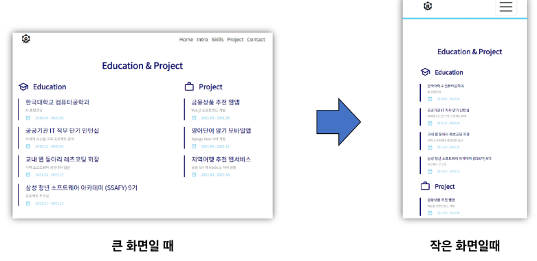

# PJT
## 반응형 Portfolio 웹사이트 구현
### 목표
- 나만의 사이트 구현하기
- 중요한 미션: 반응형으로 만들기            


### 기본 구조 만들기
- 파일 생성
- 전체 구조 만들기
- 구글 폰트 추가하기
- 네비게이션 바 추가하기

#### 1. 파일 생성
- index.html과 style.css를 생성함
- emmet을 활용해 html 기본 템플릿을 자동완성 함
- style.css를 사용할 수 있도록 link 요소를 추가
```html
<!DOCTYPE html>
<html lang="en">
<head>
    <meta charset="UTF-8">
    <meta name="viewport" content="width=device-width, initial-scale=1.0">
    <link rel="stylesheet" href="./style.css">
    <title>SSAFY인의 포트폴리오</title>
</head>
<body>
    
</body>
</html>
```

#### 2. 전체 구조 만들기
- 시맨틱 태그를 적절히 활용하여 영역을 구분함
- 자주 사용하는 시맨틱 태그는 다음과 같음

|태그|설명|
|:---:|:---:|
|header|문서의 머리말, 제목이나 로고 등의 정보를 포함|
|nav|페이지 메뉴를 만들 때 사용|
|main|주요 콘텐츠를 나타냄|
|section|주제 별로 문서의 콘텐츠 영역을 구성하는 요소|
|article|개별 콘텐츠를 나타내는 요소. 뉴스 기사, 포스트 등의 내용을 포함|
|footer|문서의 꼬리말, 저작권 정보, 연락처 등을 포함|

- 다음과 같이 작성 가능
```html
<body>
  <header class="header">
    <nav>네비게이션바</nav>
  </header>
  <main id="frontpage" class="frontpage">frontpage</main>
  <section id="my-intro" class="my-intro">my-intro</section>
  <section id="skills" class="skills">skills</section>
  <section id="project" class="project">project</section>
  <section id="contact" class="contact">contact</section>
  <footer class="footer">footer</footer>
</body>
```

- 각 부분 영역을 조금 더 명확하게 구분하기 위해 높이와 배경색을 적용
```css
.frontpage {
    height: 100px;
    background-color: lightgray;
}

.my-intro {
    height: 100px;
}

.skills {
    height: 100px;
    background-color: lightgray;
}

.project {
    height: 100px;
}

.contact {
    height: 100px;
    margin-bottom: 50px;
    background-color: lightgray;
}
```

#### 3. 구글 폰트 추가하기
- 구글 폰트 사이트에서 원하는 폰트를 검색
-우측 하단 `<link>` 부분의 링크를 복사하여 head 태그에 추가
```css
@import url('https://fonts.googleapis.com/css2?family=Madimi+One&display=swap');
```
- style.css에 font-family 적용
```css
* {
    font-family: "Madimi One", system-ui;
    font-weight: 400;
    font-style: normal;
}
```

#### 4. 네비게이션 바 추가하기
- 네비게이션 바는 Bootstrap에서 가져옴
- 공식 문서에 Navbar를 검색하여 복사
- nav 영역을 복사한 코드로 대체
- 하나의 Link를 제외한 다른 부분을 모두 제거
```html
<nav class="navbar navbar-expand-lg bg-body-tertiary">
    <div class="container-fluid">
    <a class="navbar-brand" href="#">Navbar</a>
    <button class="navbar-toggler" type="button" data-bs-toggle="collapse" data-bs-target="#navbarSupportedContent" aria-controls="navbarSupportedContent" aria-expanded="false" aria-label="Toggle navigation">
        <span class="navbar-toggler-icon"></span>
    </button>
    <div class="collapse navbar-collapse" id="navbarSupportedContent">
        <ul class="navbar-nav me-auto mb-2 mb-lg-0">
        <li class="nav-item">
            <a class="nav-link active" aria-current="page" href="#">Frontpage</a>
        </li>
        <li class="nav-item">
            <a class="nav-link active" aria-current="page" href="#">My Intro</a>
        </li>
        <li class="nav-item">
            <a class="nav-link active" aria-current="page" href="#">Skills</a>
        </li>
        <li class="nav-item">
            <a class="nav-link active" aria-current="page" href="#">Project</a>
        </li>
        <li class="nav-item">
            <a class="nav-link active" aria-current="page" href="#">Contact</a>
        </li>
        </ul>
    </div>
    </div>
</nav>
```

- 스크롤을 내려도 상단에 고정하기 위해 `fixed-top` 클래스를 추가
- 이 때 `position: fixed` 속성 추가 시 화면이 잘리는 현상이 발생
- 이를 해결하기 위해 각 구역에 `padding-top`을 적절하게 추가