# APS
## 그래프
### 학습 목표
- 실 세계 문제를 그래프로 추상화해서 해결하는 방법을 학습
- 그래프 탐색 기법인 BFS와 DFS에 대해 학습
- 그래프 알고리즘에 활용되는 상호배타 집함(Disjoint-Sets)의 자료구조에 대해 학습

### 문제: 친구관계
- A의 친구는 B
- C의 친구는 E, F
- (D-E), (F-G), (N-B, I, L), (I-J, H), (B-D, K, L), (M-I, J), (E-A, H), (C-B, I, L), (B-I), (J-A, G)
- A의 친구 중 친구가 가장 많은 친구는?

### 그래프
- 그래프는 아이템(사물 또는 추상적 개념)들과 이들 사이의 연결 관계를 표현
- 그래프는 정점(Vertex)들의 집합과 이들을 연결하는 간선(Edge)들의 집합으로 구성된 자료구조
- |V|: 정점의 개수, |E|: 그래프에 포함된 간선의 개수
- |V|개의 정점을 가지는 그래프는 최대 |V|(|V| - 1)/2 간선이 가능
- 선형 자료구조나 트리 자료구조로 표현하기 어려운 N : N의 관계를 가지는 원소들을 표현하기에 용이

### 그래프 유형
- 무향 그래프(Undirected Graph)
- 유향 그래프(Directed Graph)
- 가중치 그래프(Weighted Graph)
- 사이클 없는 방향 그래프(DAG, Directed Acyclic Graph)          
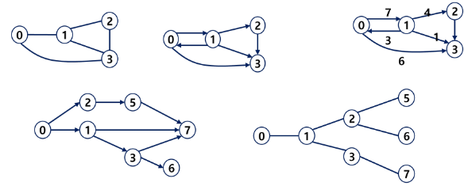
- 완전 그래프
    - 정점들에 대해 가능한 모든 간선들을 가진 그래프
    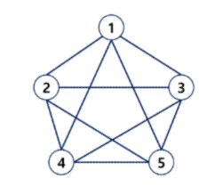
- 부분 그래프
    - 원래 그래프에서 일부의 정점이나 간선을 제외한 그래프

### 인접 정점
- 인접(Adjacency)
    - 두 개의 정점에 간선이 존재(연결됨)하면 서로 인접해 있다고 함
    - 완전 그래프에 속한 임의의 두 정점들은 모두 인접해 있음
    

### 그래프 경로
- 경로란 간선들을 순서대로 나열한 것
    - 간선들: (0, 2), (2, 4), (4, 6)
    - 정점들: 0 - 2 - 4 - 6
- 경로 중 한 정점을 최대한 한번만 지나는 경로를 단순경로 라고 함
    - 0 - 2 - 4 - 6, 0 - 1 -6
- 시작한 정점에서 끝나는 경로를 사이클(Cycle)이라고 함
    - 1 - 3 - 5 - 1             
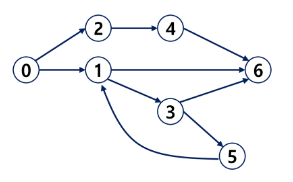

### 그래프 표현
- 간선의 정보를 저장하는 방식, 메모리나 성능을 고려해서 결정
- 인접 행렬(Adjacent matrix)
    - |V| x |V| 크기의 2차원 배열을 이용해서 간선 정보를 저장
    - 배열의 배열(포인터 배열)
- 인접 리스트(Adjacent List)
    - 각 정점마다 해당 정점으로 나가는 간선의 정보를 저장
- 간선의 배열
    - 간선(시작 정점, 끝 정점)을 배열에 연속적으로 저장

### 인접 행렬
- 두 정점을 연결하는 간선의 유무를 행렬로 표현
    - |V| x |V| 정방 행렬
    - 행 번호와 열 번호는 그래프의 정점에 대응
    - 두 정점이 인접되어 있으면 1, 그렇지 않다면 0으로 표현
    - 무향 그래프
        - i번째 행의 합 = i번쨰 열의 합 = Vi의 차수
    - 유향 그래프
        - 행 i의 합 = Vi의 진출 차수
        - 열 i의 합 = Vi의 진입 차수

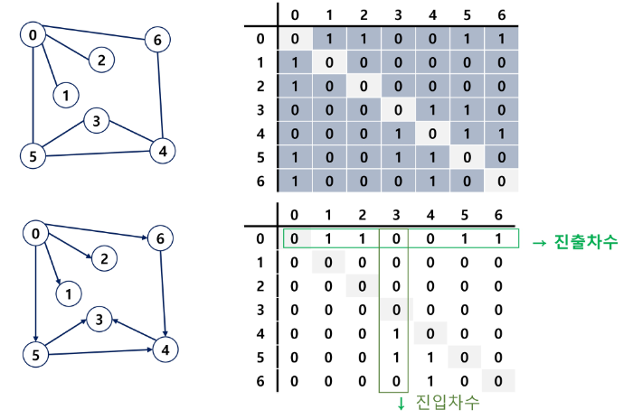
- 인접 행렬의 단점?         
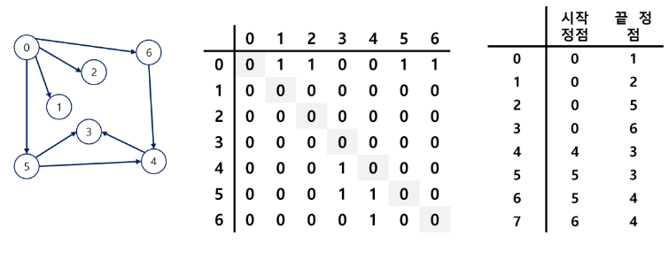
- 각 정점에 대한 인접 정점들을 순차적으로 표현
- 하나의 정점에 대한 인접 정점들을 각각 노드로 하는 연결 리스트로 저장   
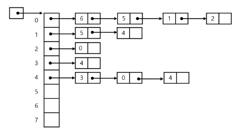


### 연습 문제
- 5명의 인원 모두가 한 팀이 되어야 함
- 0부터 시작해서 팀을 만들 수 있도록 순서대로 영입을 해보자
- 단 호감이 있는 상대만 영입할 수 있음
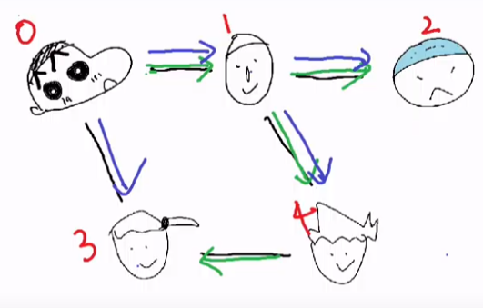
```python
# 인접 행렬
# V x V 배열을 활용해 표현
# 갈수 없다면 0, 있다면 1을 저장
# 장점
    # 노드간의 연결 정보를 한방에 확인 가능
    # 행렬곱을 이용해서 탐색이 쉽게 가능
    # 간선이 많을수록 유리
# 단점
    # 노드 수가 커지면 메모리가 낭비됨
    # 연결이 안된 것도 저장
# 양방향 그래프는 중앙 우하단 대각선 기준으로 대칭
graph = [
    [0, 1, 0, 1, 0],
    [1, 0, 1, 0, 1],
    [0, 1, 0, 0, 0],
    [1, 0, 0, 0, 1],
    [0, 1, 0, 1, 0]
]
visited = [0] * 5
path = []

def dfs(now):
    for to in range(5):
        if graph[now][to] == 0:
            continue
        
        if visited[to]:
            continue

        visited[to] = 1
        path.append(to)
        dfs(to)

def bfs(start):
    queue = [start]
    visited[start] = 1

    while queue:
        now = queue.pop(0)
        print(now, end=' ')

        for to in range(5):
            if graph[now][to] == 0:
                continue
            
            if visited[to]:
                continue
            
            visited[to] = 1
            queue.append(to)

dfs(0)
bfs(0)

# 인접 리스트
# V개의 노드가 갈 수 있는 정보만 저장
# 장점
    # 메모리 사용량 적음
    # 탐색할 때 갈 수 있는 곳만 확인하기 때문에 시간적으로 효율적
# 단점
    # 특정 노드 간 연결 여부 확인에 시간이 걸림
graph = [
    [1, 3],
    [0, 2, 4],
    [1],
    [0, 4],
    [1, 3]
]

def dfs(now):
    print(now, end=' ')
    for to in graph[now]:
        if visited[to]:
            continue

        visited[to] = 1
        path.append(to)
        dfs(to)

def bfs(start):
    queue = [start]
    visited[start] = 1

    while queue:
        now = queue.pop(0)
        print(now, end=' ')

        for to in graph[now]:
            if visited[to]:
                continue
            
            visited[to] = 1
            queue.append(to)
dfs(0)
bfs(0)
```

## DFS
### 문제: 친구관계
- 다음과 같이 친구 관계를 그래프로 표현
- A로부터 시작해서 한 명의 친구에게만 소식을 전달, 전달할 수 있다면 최대 몇 명의 친구가 소식을 전달받을 수 있을까
- 단 소식을 전달 받은 친구한테는 소식을 재 전달 할 수 없음
- A로부터 시작해서 친구들에게 동시에 소식을 전달할 수 있다고 할 때, 가장 늦게 전달 받는 사람은 누구인가
- 단 친구에게 소식을 전달하는 속도는 동일
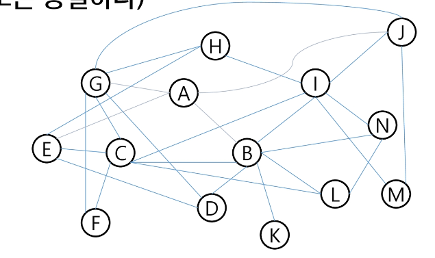

### 그래프 순회(탐색)
- 그래프 순회는 비선형 구조인 그래프로 표현된 모든 자료(정점)를 빠짐없이 탐색하는 것을 의미함
- 두가지 방법
    - 깊이 우선 탐색 (DFS, Depth First Search)
    - 너비 우선 탐색 (BFS, Breadth First Search)

### DFS
- 시작 정점의 한 방향으로 갈 수 있는 경로가 있는 곳까지 깊이 탐색해 가다가 더 이상 갈 곳이 없게 되면, 가장 마지막에 만났던 갈림길 간선이 있는 정점으로 되돌아와서 다른 방향의 정점으로 탐색을 계속 반복하여 결국 모든 정점을 방문하는 순회 방법
- 가장 마지막에 만났던 갈림길의 정점으로 되돌아가서 다시 깊이 우선 탐색을 반복해야 하므로 후입선출 구조의 스택 사용

#### DFS 알고리즘 - 재귀
```python
DFS_Recursive(G, v)
    visited[v] <- True # v 방문 설정

    for each all w in adjacency(G, v)
        if visited[w] != True
            DFS_Recursive(G, w)
```

#### DFS 알고리즘 - 반복
```python
Stack s = visited[]

DFS(v)
    push(s, v)
    visited[v] = True
    while s:
        v <- pop(s)
        if not visited[v]
            visit(v)
            for each w in adjacency(v)
                if not visited[w]
                    push(s, w)
                    visited[v] = True
```


### 연습 문제
- 다음은 연결되어 있는 두 개의 정점 사이의 간선을 순서대로 나열한 것
- 모든 정점을 깊이 우선 탐색하여 화면에 깇이 우선 탐색 경로를 출력하자
- 시작 정점은 1
- 1, 2, 1, 3, 2, 4, 2, 5, 4, 6, 5, 6, 6, 7, 3, 7

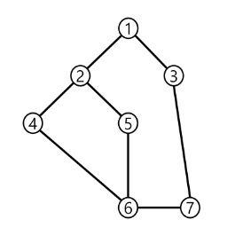

## BFS
- 너비 우선 탐색은 탐색 시작점의 인접한 정점들을 먼저 모두 차례로 방문한 후에, 방문했던 정점을 시작점으로 하여 다시 인접한 정점들을 차례로 방문하는 방식
- 인접한 정점들에 대해 탐색을 한 후, 차례로 다시 너비 우선 탐색을 진행해야 하므로, 선입선출 형태의 자료구조인 큐를 활용
- BFS는  예제 그래프를 붙여진 번호 순서로 탐색함
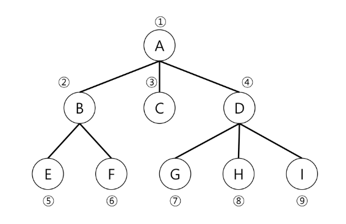

### BFS 알고리즘
```python
BFS(G, v)
    큐 생성
    시작점 v를 큐에 삽입
    점 v를 방문한 것으로 표시
    while 큐가 비어있지 않은 경우
        t <- 큐의 첫번째 원소 반환
        for t와 연결된 모든 선에 대해
            u <- t의 이웃점
            u가 방문되지 않은 곳이면
            u를 큐에 넣고, 방문한 것으로 표시
```
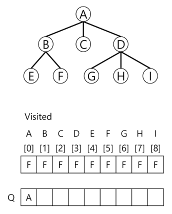

## Union-Find (Disjoint set)
### 서로소 집합(Disjoint set)
- 서로소 또는 상호배타 집합들은 서로 중복 포함된 원소가 없는 집합들임
- 다시 말해 교집합이 없음
- 집합에 속한 하나의 특정 멤버를 통해 각 집합들을 구분함
- 이를 대표자(representative)라 함
- 상호배타 집합을 표현하는 방법
    - 연결 리스트
    - 트리
- 상호배타 집합 연산
    - Make-Set(x)
    - Find-Set(x)
    - Union(x, y)

#### 상호배타 집합 예
- Make-Set(x), Make-Set(y), Make-Set(a), Make-Set(b)
- Union(x, y), Union(a, b)
- Find-Set(y), Find-Set(b)
- Union(x, a)


### 상호 배타 집합 표현 - 연결 리스트
- 같은 집합의 원소들은 하나의 연결 리스트로 관리
- 연결 리스트의 맨 앞의 원소를 집합의 대표 원소로 삼음
- 각 원소는 집합의 대표 원소를 가리키는 링크를 가짐


#### 연산 예시
- Find-Set(e) :       return a
- Find-Set(f) :       return b
- Union(a, b)


### 상호 배타 집합 표현 - 트리
- 하나의 집합 (a disjoint set)을 하나의 트리로 표현
- 자식 노드가 부모 노드를 가리키며 루트 노드가 대표자가 됨
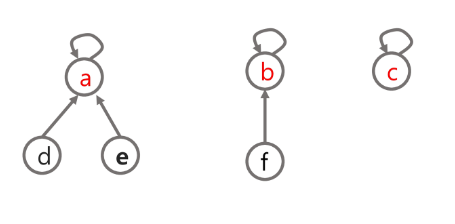

#### 연산 예시
- Make-Set(a) ~ Make-Set(f)

- Union(c, d), Union(e, f)

- Union(d, f)

- Find-Set(d) :       return c
- Find-Set(e) :       return c

#### 상호 배타 집합을 표현한 트리의 배열을 이용한 저장된 모습
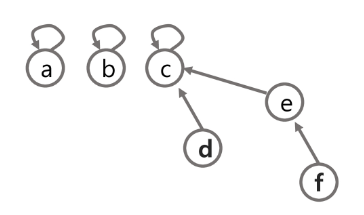

|첨자|0|1|2|3|4|5|
|:---:|:---:|:---:|:---:|:---:|:---:|:---:|
|정점|a|b|c|d|e|f|
|부모|0|1|2|2|2|4

### 상호 배타 집합에 대한 연산
#### Make-Set(x)
- 유일한 멤버 x를 포함하는 새로운 집합을 생성하는 연산
```python
# p[x]: 노드 x의 부모 저장
# rank[x]: 루트 노드가 x인 트리의 랭크 값 저장

Make-Set(x)
    p[x] <- x
```

#### Find-Set(x)
- x를 포함하는 집합을 찾는 연산
- Find-Set 연산은 특정 노드에서 루트까지의 경로를 찾아 가면서 노드의 부모 정보를 갱신
```python
# 재귀
Find-Set(x)
    if x == p[x]
        return x
    else
        return Find-Set(p[x])

# 반복
Find-Set(x)
    while x!= p[x]
        x = p[x]
    return x
```

#### Union(x, y)
- x, y를 포함하는 두 집합을 통합하는 연산
```python
Union(x, y)
    p[Find-Set(y)] <- Find-Set(x)
```

#### 예시
```python
# 1~ 6번까지 노드가 존재
def make_set(n):
    return [i for i in range(n)]

parents = make_set(7)

# find-set: 대표자를 찾아보자
# 부모 노드를 보고, 부모 노드도 연결이 되어 있다면 다시 반복
# 자기 자신이 대표인 데이터를 찾을 때까지
def find_set(x):
    # 자기 자신이 대표이면 끝
    if parents[x] == x:
        return x
    # 대표자가 따로 있다면
    return find_set(parents[x])

# union
def union(x, y):
    x = find_set(x)
    y = find_set(y)

    # 이미 같은 집합에 속해 있다면 continue
    if x == y:
        return

    # 다른 집합이라면 합침
    if x < y:
        parents[y] = x
    else:
        parents[x] = y

union(1, 3)
union(2, 3)
union(5, 6)
```

- 문제점
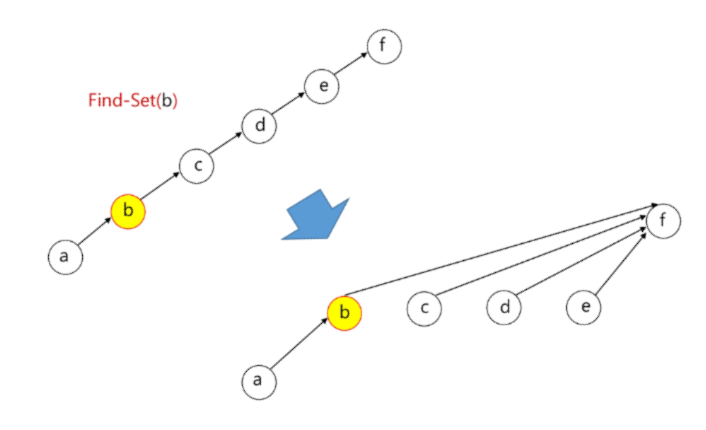

#### 연산의 효율을 높이는 방법
- Rank를 이용한 Union
    - 각 노드는 자신을 루트로 하는 subtree의 높이를 랭크(Rank)라는 이름으로 저장함
    - 두 집합을 합칠 때 rank가 낮은 집합을 rank가 높은 집합에 붙임
- Path compression
    - Find-Set을 행하는 과정에서 만나는 모든 노드들이 직접 root를 가리키도록 포인터를 바꿔줌
- 랭크를 이용한 Union의 예시
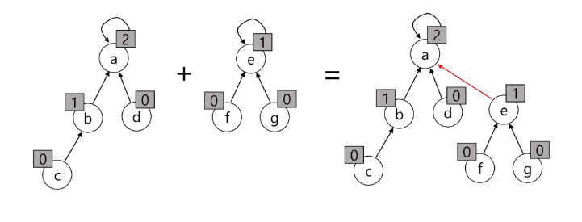
- 랭크를 이용한 Union에서 랭크가 증가하는 예시
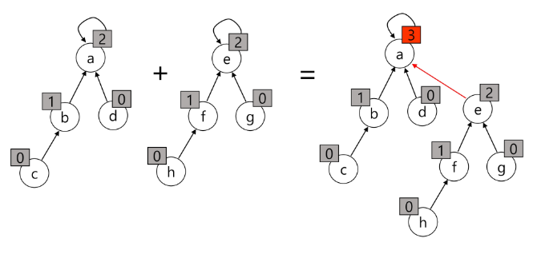
- Path Compression의 예시
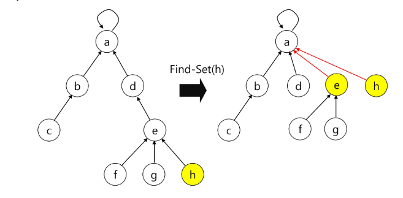