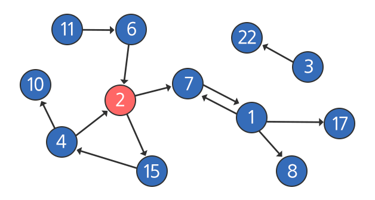
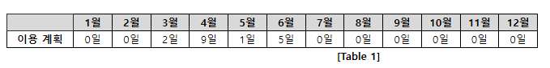
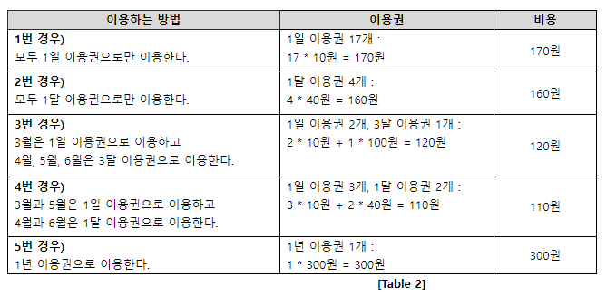

# Solution
## 1238. Contact
### 문제
- 아래는 비상연락망을 나타낸 그림이다.

- 각 원은 개개인을 의미하며, 원 안의 숫자는 그사람의 번호를 나타내고 빨간원은 연락을 시작하는 당번을 의미한다.
- 화살표는 연락이 가능한 방향을 의미한다.
- 위의 예시에서는 7번과 1번은 서로 연락이 가능하다,
- 하지만 2번과 7번의 경우 2번은 7번에게 연락할 수 있지만 7번은 2번에게 연락할 수 없다.
- 비상연락망이 가동되면 아래 그림과 같이 연락을 시작하는 당번인 2번은 - 연락 가능한 7번과 15번에 동시에 연락을 취한다 (다자 간 통화를 사용한다고 가정).
- 마지막에 동시에 연락 받은 사람은 8번, 10번, 17번의 세 명이다.
- 이 중에서 가장 숫자가 큰 사람은 17번이므로 17을 반환하면 된다.

### 제약 사항
- 연락 인원은 최대 100명이며, 부여될 수 있는 번호는 1이상, 100이하이다.
- 단, 예시에서 5번이 존재하지 않듯이 중간 중간에 비어있는 번호가 있을 수 있다.
- 한 명의 사람이 다수의 사람에게 연락이 가능한 경우 항상 다자 간 통화를 통해 동시에 전달한다.
- 연락이 퍼지는 속도는 항상 일정하다 (전화를 받은 사람이 다음사람에게 전화를 거는 속도는 동일).
- 비상연락망 정보는 사전에 공유되며 한 번 연락을 받은 사람에게 다시 연락을 하는 일은 없다.
- 예시에서의 3, 6, 11, 22번과 같이 연락을 받을 수 없는 사람도 존재할 수 있다.

### 입력
- 10개의 테스트 케이스가 주어진다.
- 각 테스트 케이스의 첫 번째 줄에는 입력 받는 데이터의 길이와 시작점이 주어진다.
- 그 다음 줄에 입력받는 데이터는 {from, to, from, to, …} 의 순서로 해석되며 예시의 경우는 {2, 7, 11, 6, 6, 2, 2, 15, 15, 4, 4, 2, 4, 10, 7, 1, 1, 7, 1, 8, 1, 17, 3, 22}와 같다.
- 그런데 순서에는 상관이 없으므로 다음과 같이 주어진 인풋도 동일한 비상연락망을 나타낸다 (같은 비상연락망을 표현하는 다양한 인풋이 존재 가능하다).
- {1, 17, 3, 22, 1, 8, 1, 7, 7, 1, 2, 7, 2, 15, 15, 4, 6, 2, 11, 6, 4, 10, 4, 2}
- 다음과 같이 동일한 {from, to}쌍이 여러 번 반복되는 경우도 있으며, 한 번 기록된 경우와 여러 번 기록된 경우의 차이는 없다.
- {1, 17, 1, 17, 1, 17, 3, 22, 1, 8, 1, 7, 7, 1, 2, 7, 2, 15, 15, 4, 6, 2, 11, 6, 4, 10, 11, 6, 4, 2}

### 출력
- #부호와 함께 테스트 케이스의 번호를 출력하고, 공백 문자 후 테스트 케이스에 대한 답을 출력한다.

### 풀이
```python
def bfs(start):
    q = [start]
    visited = [0] * 101
    visited[start] = 1

    # 가장 깊은 depth 의 가장 큰 수
    max_number = start
    # 가장 깊은 depth 를 저장
    max_depth = 1

    while q:
        now = q.pop(0)

        # 갈 수 있는 곳들
        for to in graph[now]:
            # 이미 방문했다면 pass
            if visited[to]:
                continue

            # 현재 방문 = 이전 방문 + 1 번 만에 왔다!
            visited[to] = visited[now] + 1

            # depth 가 더 깊어졌네 ? ==> max_number 초기화
            # depth 는 같은데 숫자가 더 크네 ? => 초기화
            if max_depth < visited[to] or \
                (max_depth == visited[to] and max_number < to):
                max_depth = visited[to]
                max_number = to

            q.append(to)

    return max_number

for tc in range(1, 2):
    N, start = map(int, input().split())
    input_graph = list(map(int, input().split()))
    # 인접 리스트
    graph = [[] for _ in range(101)]
    for i in range(0, N, 2):
        s = input_graph[i]
        e = input_graph[i + 1]
        graph[s].append(e)

    r = bfs(start)
    print(f'#{tc} {r}')
```

## 1486. 장훈이의 높은 선반
### 문제
- 장훈이는 서점을 운영하고 있다.
- 서점에는 높이가 B인 선반이 하나 있는데 장훈이는 키가 매우 크기 때문에, 선반 위의 물건을 자유롭게 사용할 수 있다.
- 어느 날 장훈이는 자리를 비웠고, 이 서점에 있는 N명의 점원들이 장훈이가 선반 위에 올려놓은 물건을 사용해야 하는 일이 생겼다.
- 각 점원의 키는 Hi로 나타나는데, 점원들은 탑을 쌓아서 선반 위의 물건을 사용하기로 하였다.
- 점원들이 쌓는 탑은 점원 1명 이상으로 이루어져 있다.
- 탑의 높이는 점원이 1명일 경우 그 점원의 키와 같고, 2명 이상일 경우 탑을 만든 모든 점원의 키의 합과 같다.
- 탑의 높이가 B 이상인 경우 선반 위의 물건을 사용할 수 있는데 탑의 높이가 높을수록 더 위험하므로 높이가 B 이상인 탑 중에서 높이가 가장 낮은 탑을 알아내려고 한다.

### 입력
- 첫 번째 줄에 테스트 케이스의 수 T가 주어진다.
- 각 테스트 케이스의 첫 번째 줄에는 두 정수 N, B(1 ≤ N ≤ 20, 1 ≤ B ≤ S)가 공백으로 구분되어 주어진다.
- S는 두 번째 줄에서 주어지는 점원들 키의 합이다.
- 두 번째 줄에는 N개의 정수가 공백으로 구분되어 주어지며, 각 정수는 각 점원의 키 Hi (1 ≤ Hi ≤ 10,000)을 나타낸다.

### 출력
- 각 테스트 케이스마다 첫 번째 줄에는 ‘#t’(t는 테스트 케이스 번호를 의미하며 1부터 시작한다)를 출력하고, 만들 수 있는 높이가 B 이상인 탑 중에서 탑의 높이와 B의 차이가 가장 작은 것을 출력한다.

### 풀이
```python
def dfs(cnt, sum_height):
    global ans
    # 기저조건
    # 1. 키의 합이 B 이상이면 종료
    #   -> 현재까지 쌓은 탑의 높이
    if sum_height >= B:
        # 제일 높이가 낮은 탑이 정답
        # - 최소 탑의 높이는 재귀호출함수들이 "동시에" 사용함 -> 전역변수로 사용
        ans = min(ans, sum_height)
        return

    # 2. 모든 점원이 탑을 쌓는데 고려가 되었다면
    #   -> 현재까지 쌓은 점원의 수
    if cnt == N:
        return

    # 재귀호출파트
    # 쌓는다
    dfs(cnt + 1, sum_height + arr[cnt])
    # 안쌓는다
    dfs(cnt + 1, sum_height)

T = int(input())

for tc in range(1, T + 1):
    N, B = map(int, input().split())
    arr = list(map(int, input().split()))
    ans = int(1e9)
    dfs(0, 0)
    print(f'#{tc} {abs(ans - B)}')
```

## 2819. 격자판의 숫자 이어 붙이기
### 문제
- 4×4 크기의 격자판이 있다. 격자판의 각 격자칸에는 0부터 9 사이의 숫자가 적혀 있다.
- 격자판의 임의의 위치에서 시작해서, 동서남북 네 방향으로 인접한 격자로 총 여섯 번 이동하면서, 각 칸에 적혀있는 숫자를 차례대로 이어 붙이면 7자리의 수가 된다.
- 이동을 할 때에는 한 번 거쳤던 격자칸을 다시 거쳐도 되며, 0으로 시작하는 0102001과 같은 수를 만들 수도 있다.
- 단, 격자판을 벗어나는 이동은 가능하지 않다고 가정한다.
- 격자판이 주어졌을 때, 만들 수 있는 서로 다른 일곱 자리 수들의 개수를 구하는 프로그램을 작성하시오.

### 입력
- 첫 번째 줄에 테스트 케이스의 수 T가 주어진다.
- 각 테스트 케이스마다 4개의 줄에 걸쳐서, 각 줄마다 4개의 정수로 격자판의 정보가 주어진다.

### 출력
- 각 테스트 케이스마다 ‘#x ’(x는 테스트케이스 번호를 의미하며 1부터 시작한다)를 출력하고, 격자판을 이동하며 만들 수 있는 서로 다른 일곱 자리 수들의 개수를 출력한다.

### 풀이
```python
dy = [-1, 1, 0, 0]
dx = [0, 0, -1, 1]


def dfs(y, x, path):
    # 기저조건: 7자리면 끝
    if len(path) == 7:
        # 현재까지의 경로를 저장
        result.add(path)
        return

    for i in range(4):
        new_y = y + dy[i]
        new_x = x + dx[i]

        # 범위 밖으로 넘어가면 pass
        if new_y < 0 or new_y >= 4 or new_x < 0 or new_x >= 4:
            continue

        dfs(new_y, new_x, path + maps[new_y][new_x])

T = int(input())

for tc in range(1, T + 1):
    # 격자판 저장
    # maps = [list(map(int, input().split())) for _ in range(4)]
    # 갈 때 마다 경로를 더하기 위해서 문자열로 저장
    maps = [input().split() for _ in range(4)]
    # 중복을 제거하기 위해 set 사용
    result = set()

    # 시작 지점
    for i in range(4):
        for j in range(4):
            dfs(i, j, maps[i][j])
    print(f'#{tc} {len(result)}')
```

## 1952 수영장
### 문제
- 김 프로는 지출이 너무 많아 내년 1년 동안 각 달의 이용 계획을 수립하고 가장 적은 비용으로 수영장을 이용할 수 있는 방법을 찾고 있다.
- 수영장에서 판매하고 있는 이용권은 아래와 같이 4 종류이다.
    1. 1일 이용권 : 1일 이용이 가능하다.
    2. 1달 이용권 : 1달 동안 이용이 가능하다. 1달 이용권은 매달 1일부터 시작한다.
    3. 3달 이용권 : 연속된 3달 동안 이용이 가능하다. 3달 이용권은 매달 1일부터 시작한다.
    - (11월, 12월에도 3달 이용권을 사용할 수 있다 / 다음 해의 이용권만을 구매할 수 있기 때문에 3달 이용권은 11월, 12월, 1윌 이나 12월, 1월, 2월 동안 사용하도록 구매할 수는 없다.)
    4. 1년 이용권 : 1년 동안 이용이 가능하다. 1년 이용권은 매년 1월 1일부터 시작한다.
- 각 달의 이용 계획은 [Table 1]의 형태로 수립된다.

- 이용 계획에 나타나는 숫자는 해당 달에 수영장을 이용할 날의 수를 의미한다.
- 각 이용권의 요금과 각 달의 이용 계획이 입력으로 주어질 때,
- 가장 적은 비용으로 수영장을 이용할 수 있는 방법을 찾고 그 비용을 정답으로 출력하는 프로그램을 작성하라.

### 예시
- 수영장에서 판매하는 1일 이용권, 1달 이용권, 3달 이용권, 1년 이용권의 요금은 각각 10원, 40원, 100원, 300원이다.
- 이 때 수영장을 이용할 수 있는 방법은 [Table 2]와 같이 다양한 경우를 생각할 수 있다.

- 다른 경우도 가능하지만, 가장 적은 비용으로 수영장을 이용한 경우는 4번 경우이다.
- 따라서, 정답은 110이 된다.

### 제약 사항
- 시간 제한 : 최대 50개 테스트 케이스를 모두 통과하는 데 C/C++/Java 모두 3초
- 모든 종류의 이용권 요금은 10 이상 3,000 이하의 정수이다.
- 각 달의 이용 계획은 각 달의 마지막 일자보다 크지 않다.

### 입력
- 입력의 맨 첫 줄에는 총 테스트 케이스의 개수 T가 주어지고, 그 다음 줄부터 T개의 테스트 케이스가 주어진다.
- 각 테스트 케이스의 첫 번째 줄에는 1일 이용권의 요금, 1달 이용권의 요금, 3달 이용권의 요금, 1년 이용권의 요금이 순서대로 한 칸씩 띄고 주어진다.
- 그 다음 줄에는 1월부터 12월까지의 이용 계획이 주어진다.

### 출력
- 테스트 케이스 개수만큼 T개의 줄에 각각의 테스트 케이스에 대한 답을 출력한다.
- 각 줄은 "#t"로 시작하고 공백을 하나 둔 다음 정답을 출력한다. (t는 1부터 시작하는 테스트 케이스의 번호이다)
- 출력해야 할 정답은 이용 계획대로 수영장을 이용하는 경우 중 가장 적게 지출하는 비용이다.

### 풀이 1
```python
def dfs(month, sum_cost):
    global ans

    # 기저조건
    # 1. 12월까지 다 봤네? 종료
    if month > 12:
        # 최소 비용
        ans = min(ans, sum_cost)
        return

    # 2. 이미 최소값을 넘어갔네? 종료
    if sum_cost > ans:
        return

    # 모두 1일권으로 구매
    dfs(month + 1, sum_cost + (days[month] * cost[0]))

    # 1달권 구매
    dfs(month + 1, sum_cost + cost[1])

    # 3달권 구매
    dfs(month + 3, sum_cost + cost[2])

    # 1년권 구매
    dfs(month + 12, sum_cost + cost[3])

T = int(input())

for tc in range(1, T + 1):
    cost = list(map(int, input().split()))
    # 아 인덱스 너무 머리아파!
    # 1부터 쓸래 (맨 앞에 0 쓰레기값 넣을래 )
    days = [0] + list(map(int, input().split()))
    ans = int(1e9)
    dfs(1, 0)
    print(f'#{tc} {ans}')
```

### 풀이 2(DP)
```python
import sys
sys.stdin = open("input.txt", "r")

# 이 문제가 왜 DP로도 해결이 가능할까 ?
# 1. 작은 문제로 분할할 수 있어야 한다.
#   - 전체의 합 = 각 달까지의 최소들이 쌓여서 완성
#   - 각 달까지의 최소 비용 문제로 분할
# 2. 뒤의 결과를 구할 때, 앞에서 구했던 결과가 바뀌면 안된다.


T = int(input())

for tc in range(1, T + 1):
    cost = list(map(int, input().split()))
    days = [0] + list(map(int, input().split()))
    # DP 배열
    plans = [0] * 13

    # 1~12월까지 반복
    for i in range(1, 13):
        # 현재 달의 최소 비용 계산
        # 이전 달 + 1일권 구입 / 이전 달 + 1달권 구입 / 3달 전 + 3달권 구입 그 중에서 최소
        plans[i] = min(plans[i - 1] + (days[i] * cost[0]), plans[i - 1] + cost[1])

        if i >= 3:
            plans[i] = min(plans[i], plans[i - 3] + cost[2])

    # 12월까지의 계산 결과 or 1년권
    min_cost = min(plans[12], cost[3])
    print(f'#{tc} {min_cost}')
```