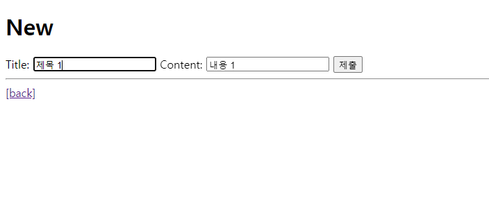
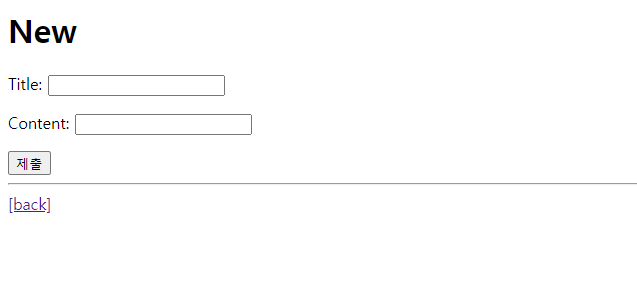
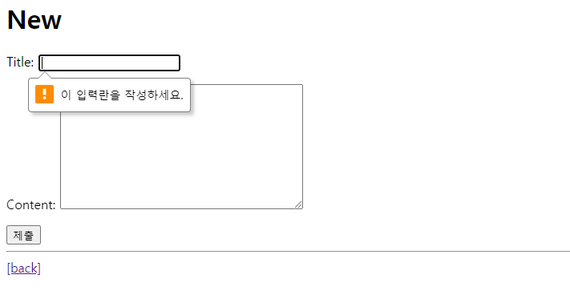
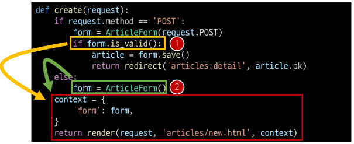
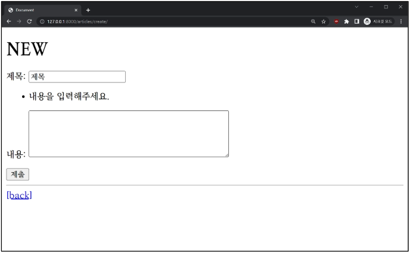

# Django
## Django Form
### HTML 'form'
- 지금까지 사용자로부터 데이터를 받기 위해 활용한 방법
- 비정상적 혹은 악의적인 요청을 필터링 할 수 없음
- 유효한 데이터인지에 대한 확인이 필요

### 유효성 검사
- 수집한 데이터가 정확하고 유효한지 확인하는 과정
- 유효성 검사를 구현하기 위해서는 입력 값, 형식, 중복, 범위, 보안 등 많은 것들을 고려해야 함
- 이런 과정과 기능을 직접 개발하는 것이 아닌 Django가 제공하는 Form을 사용

### Form Class
- Django form: 사용자 입력 데이터를 수집하고, 처리 및 유효성 검사를 수행하기 위한 도구
- 유효성 검사를 단순화하고 자동화 할 수 있는 기능을 제공

#### Form class 정의
```python
# articles/forms.py

from django import forms

class ArticleForm(forms.Form):
    title = forms.CharField(max_length=10)
    content = forms.CharField()
```

#### Form class를 적용한 new 과정 변화
```python
# articles/views.py

from .forms import ArticleForm

def new(request):
    form = ArticleForm()
    context = {
        'form': form,
    }
    return render(request, 'articles/new.html', context)
```
```html
<!-- articles/new.html -->

<body>
  <h1>New</h1>
  <form action="" method="POST">
    
    {{ form }}
    <input type="submit">
  </form>
  <hr>
  <a href="">[back]</a>
</body>
```


#### Form rendering options
- label, input 쌍을 특정 HTML 태그로 감싸는 옵션
- `form.as_p`, `form.as_div`, `form.as_table`, `form.as_ul`
```html
<!-- articles/new.html -->

<body>
  <h1>New</h1>
  <form action="" method="POST">
    
    {{ form.as_p }}
    <input type="submit">
  </form>
  <hr>
  <a href="">[back]</a>
</body>
```


### Widgets
- HTML 'input' element의 표현을 담당

#### Widget 사용
- Widget은 단순히 input 요소의 속성 및 출력되는 부분을 변경하는 것
```python
# articles/forms.py

from django import forms

class ArticleForm(forms.Form):
    title = forms.CharField(max_length=10)
    content = forms.CharField(widget=forms.Textarea)
```


## Django ModelForm
- Form: 사용자 입력 데이터를 DB에 저장하지 않을 때 (ex 로그인)
- ModelForm: 사용자 입력 데이터를 DB에 저장해야 할 때 (ex 게시글 작성, 회원 가입)

### ModelForm
- Model과 연결된 Form을 자동으로 생성해주는 기능을 제공
- Form + Model

#### ModelForm class 정의
- 기존 ArticleForm 클래스 수정
```python
# articles/forms.py

from django import forms
from .models import Article

class ArticleForm(forms.ModelForm):
    class Meta:
        model = Article
        fields = '__all__'
```


### Meta class
- ModelForm의 정보를 작성하는 곳

#### `fields` 및 `exclude` 속성
- `exclude` 속성을 사용하여 모델에서 포함하지 않을 필드를 지정할 수도 있음
```python
# articles/forms.py

from django import forms
from .models import Article

class ArticleForm(forms.ModelForm):
    class Meta:
        model = Article
        fields = ('title',)
```
```python
# articles/forms.py

from django import forms
from .models import Article

class ArticleForm(forms.ModelForm):
    class Meta:
        model = Article
        exclude = ('title',)
```

#### ModelForm을 적용한 create 로직
```python
# articles/views.py

from .forms import ArticleForm

def create(request):
    form = ArticleForm(request.POST)
    if form.is_valid():
        article = form.save()
        return redirect('articles:detail', article.pk)
    context = {
        'form': form,
    }
    return render(request, 'articles/new.html', context)
```


### `is_valid()`
- 여러 유효성 검사를 실행하고, 데이터가 유효한지 여부를 Boolean으로 반환

#### 공백 데이터가 유효하지 않은 이유와 에러 메시지가 출력되는 과정
- 별도로 명시하지 않았지만 모델 필드에는 기본적으로 빈 값은 허용하지 않는 제약조건이 설정되어 있음
- 빈 값은 `is_valid()`에 의해 False로 평가되고 form 객체에는 그에 맞는 에러 메시지가 포함되어 다음 코드로 진행됨

### ModelForm을 적용한 edit 로직
```python
# articles/views.py

def edit(request, pk):
    article = Article.objects.get(pk=pk)
    form = ArticleForm(instance=article)
    context = {
        'article': article,
        'form': form
    }
    return render(request, 'articles/edit.html', context)
```
```html
<!-- articles/edit.html -->

<body>
  <h1>Edit</h1>
  <form action="" method="POST">
    
    {{ form.as_p }}
    <input type="submit">
  </form>
  <hr>
  <a href="">[back]</a>
</body>
```

### ModelForm을 적용한 update 로직
```python
# articles/views.py

def update(request, pk):
    article = Article.objects.get(pk=pk)
    form = ArticleForm(request.POST, instance=article)
    if form.is_valid():
        form.save()
        return redirect('articles:detail', article.pk)
    context = {
        'form': form,
        'article': article,
    }
    return render(request, 'articles/edit.html', context)
```

### `save()`
- 데이터베이스 객체를 만들고 저장
  
#### `save()` 메서드가 생성과 수정을 구분하는 법
- 키워드 인자 `instance` 여부를 통해 생성할 지, 수정할 지를 결정
```python
# create()

form = ArticleForm(request.POST)
form.save()
```
```python
# update()

form = ArticleForm(request.POST, instance=article)
form.save()
```

### Django Form 정리
- 사용자로부터 데이터를 수집하고 처리하기 위한 강력하고 유연한 도구
- HTML form의 생성, 데이터 유효성 검사 및 처리를 쉽게 할 수 있도록 도움

## Handling HTTP requests
### view 함수 구조 변화
- HTTP request method 차이점을 활용해 동일한 목적을 가지는 2개의 view 함수를 하나로 구조화

#### new & create view 함수간 공통점, 차이점
- 공통점
    - 데이터 생성을 구현하기 위함
- 차이점
    - new는 GET method 요청만을, create는 POST method 요청만을 처리

#### new & create 함수 결합
- 기존 구성
```python
# articles/views.py

def new(request):
    form = ArticleForm()
    context = {
        'form': form
    }
    return render(request, 'articles/new.html', context)

def create(request):
    form = ArticleForm(request.POST)
    if form.is_valid():
        article = form.save()
        return redirect('articles:detail', article.pk)
    context = {
        'form': form,
    }
    return render(request, 'articles/new.html', context)
```
- 수정 후
```python
# articles/views.py

def create(request):
    form = ArticleForm(request.POST)
    if request.method == 'POST':
        if form.is_valid():
            article = form.save()
            return redirect('articles:detail', article.pk)
        else:
            form = ArticleForm()
        context = {
            'form': form,
        }
        return render(request, 'articles/new.html', context)
```

#### 새로운 create view 함수
- new와 create view 함수의 공통점과 차이점을 기반으로 하나의 함수로 결합
- 두 함수의 유일한 차이점이었던 request method에 따른 분기
- POST일 때는 과거 create 함수 구조였던 객체 생성 및 저장 로직 처리
- POST가 아닐 때는 과거 단순히 form 인스턴스 생성
- form은 아래 2가지 중 하나로 context에 넘겨짐
    1. `is_valid()`를 통과하지 못해 에러 메시지를 담은 form 인스턴스
    2. else 문의 form 인스턴스



#### 기존 new 관련 코드 수정
- 사용하지 않는 new url 제거
```python
# articles/urls.py

from django.urls import path
from . import views

app_name = 'articles'
urlpatterns = [
    path('', views.index, name='index'),
    path('<int:pk>/', views.detail, name='detail'),
    # path('new/', views.new, name='new'),
    path('create/', views.create, name='create'),
    path('<int:pk>/delete/', views.delete, name='delete'),
    path('<int:pk>/edit/', views.edit, name='edit'),
    path('<int:pk>/update/', views.update, name='update'),
]
```
- new url을 create url로 변경
```html
<!-- articles/index.html -->

<body>
  <h1>Articles</h1>
  <a href="">CREATE</a>
  <hr>
  
    <p>글 번호: {{ article.pk }}</p>
    <a href="">
      <p>글 제목: {{ article.title }}</p>
    </a>
    <p>글 내용: {{ article.content }}</p>
    <hr>
  
</body>
```
```html
<!-- articles/create.html -->

<body>
  <h1>Create</h1>
  <form action="" method="POST">
    
    {{ form.as_p }}
    <input type="submit">
  </form>
  <hr>
  <a href="">[back]</a>
</body>
```
- new 템플릿을 create 템플릿으로 변경
```python
# articles/views.py

def create(request):
    form = ArticleForm(request.POST)
    if request.method == 'POST':
        if form.is_valid():
            article = form.save()
            return redirect('articles:detail', article.pk)
        else:
            form = ArticleForm()
        context = {
            'form': form,
        }
        return render(request, 'articles/create.html', context)
```

### request method에 따른 요청의 변화
- `GET`: articles/create/ : 게시글 생성 문서를 줘!
- `POST`: articles/create/ : 게시글을 생성해줘!

#### 새로운 update view 함수
- 기존 edit과 update view 함수 결합
```python
# articles/views.py

def update(request, pk):
    article = Article.objects.get(pk=pk)
    if request.method == 'POST':
        form = ArticleForm(request.POST, instance=article)
        if form.is_valid():
            form.save()
            return redirect('articles:detail', article.pk)
    else:
        form = ArticleForm(instance=article)
    context = {
        'form': form,
        'article': article,
    }
    return render(request, 'articles/update.html', context)
```

#### 기존 edit 관련 코드 수정
- 사용하지 않는 edit url 제거
```python
# articles/urls.py

from django.urls import path
from . import views

app_name = 'articles'
urlpatterns = [
    path('', views.index, name='index'),
    path('<int:pk>/', views.detail, name='detail'),
    # path('new/', views.new, name='new'),
    path('create/', views.create, name='create'),
    path('<int:pk>/delete/', views.delete, name='delete'),
    # path('<int:pk>/edit/', views.edit, name='edit'),
    path('<int:pk>/update/', views.update, name='update'),
]
```
- edit 템플릿을 update 템플릿으로 변경
```html
<!-- articles/detail.html -->

<body>
  <h1>Detail</h1>
  <h2>{{ article.pk }} 번째 글</h2>
  <hr>
  <p>제목: {{ article.title }}</p>
  <p>내용: {{ article.content }}</p>
  <p>작성일: {{ article.created_at }}</p>
  <p>수정일: {{ article.updated_at }}</p>
  <hr>
  <a href="">UPDATE</a>
  <form action="" method="POST">
    
    <input type="submit" value="DELETE">
  </form>
  <a href="">[back]</a>
</body>
```
```html
<!-- articles/update.html -->

<body>
  <h1>UPDATE</h1>
  <form action="" method="POST">
    
    {{ form.as_p }}
     <div>
      <label for="title">Title: </label>
      <input type="text" name="title" id="title" value="{{ article.title }}">
    </div>
    <div>
      <label for="content">Content: </label>
      <textarea name="content" id="content">{{ article.content }}</textarea>
    </div> 
    <input type="submit">
  </form>
  <hr>
  <a href="">[back]</a>
</body>
```

### 참고
#### ModelForm 키워드 인자 data와 instance 살펴보기
- ModelForm의 부모 클래스인 BaseModelForm의 생성자 함수 예시
```python
class BaseModelForm(BaseForm):
    def __init__(self, data=None, files=None, auto_id='id_%s', prefix=None, initial=None, error_class=ErrorList, label_suffix=none, empty_permitted=False, instance=None, use_required_attribute=None, renderer=None):
```

#### Widget 응용
```python
# articles/forms.py

class ArticleForm(forms.ModelForm):
    title = forms.CharField(
        label='제목',
        widget=forms.TextInput(
            attrs={
                'calss': 'my-title',
                'placeholder': 'Enter the title',
                'maxlength': 10,
            }
        )
    )
    content = forms.CharField(
        label='내용',
        widget=forms.Textarea(
            attrs={
                'calss': 'my-title',
                'placeholder': 'Enter the title',
                'rows': 5,
                'cols': 50
            }
        )
        error_messages={'required': '내용을 입력해주세요.'}
    )

    class Meta:
        model = Article
        fields = '__all__'
```


#### 필드를 수동으로 렌더링 하기
```html
{{ form.non_field_errors }}
<form action="..." method="POST">
    
    <div>
        {{ form.title.errors }}
        <label for="{{ form.title.id_for_label }}">Title:</label>
        {{ form.title }}
    </div>
    <div>
        {{ form.content.errors }}
        <label for="{{ form.content.id_for_label }}">Content:</label>
        {{ form.content }}
    </div>
    <input type="submit">
</form>
```