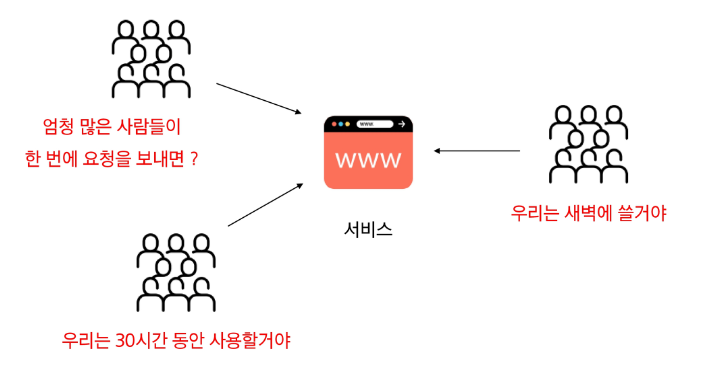
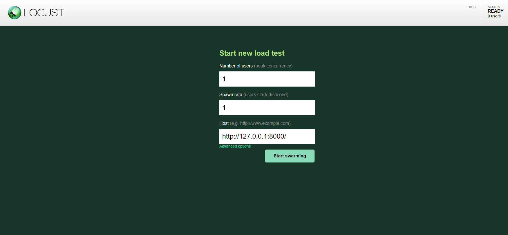
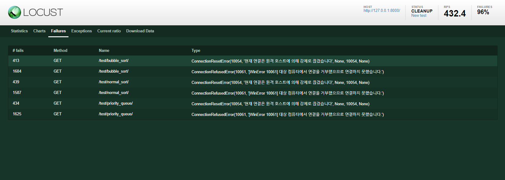
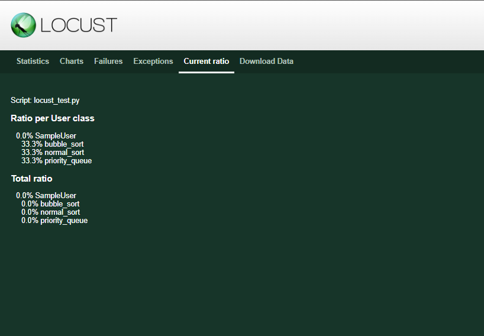
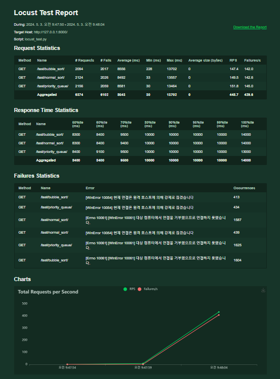
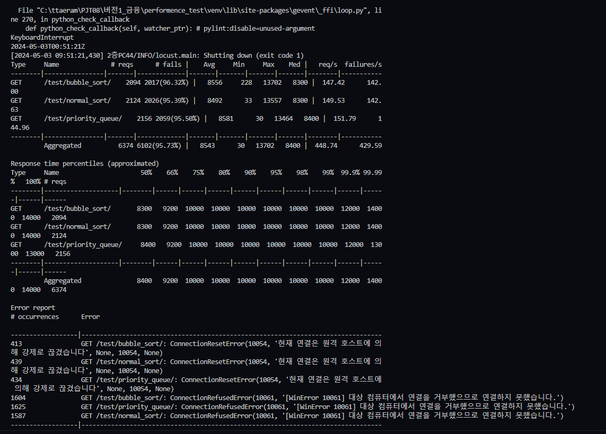

# PJT

## Django에서 알고리즘 구현 및 성능 측정

### 목표

- 이번 프로젝트에서는 Django에서 요구사항에 따라 알고리즘을 구현해보고 구현한 알고리즘의 성능을 측정
- Locust라는 툴을 이용하면 사진과 같이 성능 테스트를 할 수 있음
  

### 순서

1. 테스트 & 성능 테스트 개념
2. Locust 세팅
3. 정렬 알고리즘 성능 측정 실습

#### 테스트

- 원하는 기능이 모두 구현되었는지 확인, 숨겨져 있는 결함 찾기
- 여러가지 도구들을 활용하여 버그를 찾아내고 신뢰성, 보안, 성능 등을 검증하는 중요한 단계
- 상황에 맞게 필요한 테스트 진행
- 외우지 말고 검색으로 필요한 것만 찾아서 사용

#### 성능 테스트

- 핵심적인 테스트 중 하나
- 특정 상황에서 시스템이 어느 정도 수준을 보이는가 혹은 어떻게 대처하는 가를 테스트하는 과정
- 목적:
  - 여러 테스트를 통해 성능 저하가 발생하는 요인을 발견하고 제거
  - 시장에 출시되기 전에 발생할 수 있는 위험과 개선사항을 파악
  - 안정적이고 신뢰할 수 있는 제품을 빠르게 만들기 위함
    
- 프로젝트에서는 핵심인 부하테스트와 스트레스 테스트를 배움

### 부하 테스트(Load Testing)

- 시스템에 임계점의 부하가 계속될 때 문제가 없는가
- 목적: 시스템의 신뢰도와 성능을 측정
  

### 스트레스 테스트(Stress Testing)

- 시스템에 과부하가 오면 어떻게 동작하는가
- 목적: 장애 조치와 복구 절차가 효과적이고 효율적인지 확인
  

#### 부하 스트레스 vs 스트레스 테스트

|        -         |                                   부하 테스트                                    |               스트레스 테스트               |
| :--------------: | :------------------------------------------------------------------------------: | :-----------------------------------------: |
|      도메인      |                             성능 테스트의 하위 집합                              |           성능 테스트의 하위 집합           |
|   테스트 목적    |                             전체 시스템의 성능 확인                              |     중단점에서의 동작, 복구 가능성 확인     |
|   테스트 방법    |                  임계점까지의 가상 유저 수를 유지하며 모니터링                   | 중단점 이상까지 가상 유저를 점진적으로 증가 |
|   테스트 대상    |                                   전체 시스템                                    |     식별된 트랜잭션에만 집중하여 테스트     |
| 테스트 완료 시기 |                           예상 부하가 모두 적용된 경우                           |        시스템 동작이 중단되었을 경우        |
|       결과       | 부하 분산 문제, 최대 성능, 시간 당 서버 처리량 밒 응답 시간, 최대 동시 사용자 수 |             안정성, 복구 가능성             |

## API 성능 테스트

### Locust

- 오픈 소스 부하 테스트 도구
- 번역하면 메뚜기. 테스트 중 메뚜기 떼가 웹 사이트를 공격한다는 의미로 착안된 이름
- 내가 만든 서버에 수많은 사용자들이 동시에 들어올 때 어떤 일이 벌어지는 지를 확인하는 부하 테스트를 할 수 있는 도구
- Locust를 선택한 이유
  - 파이썬 언어로 테스트 시나리오를 간편하게 작성할 수 있음
  - 결과를 웹에서 확인할 수 있는 UI를 지원함

### Locust 사용법

#### 1. 테스트 스크립트 작성([공식문서](https://docs.locust.io/en/stable/) 참조)

- `HttpUser`: HTTP 요청을 만드는 가상 유저
- `wait_time`: 작업 간 대기 시간
- `on_start()`: 가상 유저 생성 시 실행
- `@task`: 유저가 실행할 작업
- `@task(N)`: 가중치 (실행 확률), N만큼 높은 확률로 작업을 수행
- `self.client.get`: HTTP GET 요청 전송
- 공식 문서 코드

```py
import time
from locust import HttpUser, task, between

class QuickstartUser(HttpUser):
    wait_time = between(1, 5)

    @task
    def hello_world(self):
        self.client.get("/hello")
        self.client.get("/world")

    @task(3)
    def view_items(self):
        for item_id in range(10):
            self.client.get(f"/item?id={item_id}", name="/item")
            time.sleep(1)

    def on_start(self):
        self.client.post("/login", json={"username":"foo", "password":"bar"})
```

#### 2. Django 서버 실행

- 제공된 Django API 서버를 실행

```
$ cd performence_test
$ python -m venv venv
$ source venv/Scripts/activate
(venv) $ pip install -r requirements.txt
(venv) $ python manage.py makemigration
(venv) $ python manage.py migrate
(venv) $ python manage.py runserver
```

#### 3. vscode 터미널 추가 & Locust 설치 및 실행

```
(venv) $ pip install locust
(venv) $ locust -f ./locust_test.py
```

#### 4. Locust 정상 실행시 URL 출력


- http://localhost:8089 로 접속하면 Web 화면을 볼 수 있음
- 콘솔에서 출력하는 url로 접속하면 에러 발생

#### 5. 웹 실행 화면



- http://localhost:8089 접속
- Number of users: 생성할 총 가상유저 수
- Spawn rate: 동시에 접속하는 유저 수
- Host: 서버 주소(Django 서버)

#### 6. Statistics 탭


- status: 접속 유저 수 (edit - 유저 수 설정 수정 가능)
- 각 URL에 대한 요청 수, 실패 수, 각 기준에 대한 응답 시간, 평균 응답 크기, RPS 등 다양한 통계 내용을 확인할 수 있음
- 전체 분석은 터미널에서 터미널 종료(Ctrl + C) 입력 또는 Download Data 탭의 Download Report 클릭 시 확인 가능

#### 7. Charts 탭


- 가로는 모두 시간을 의미함
- Total Requests per Second
  - 초록선: 초당 요청 수 (RPS)
  - 빨간선: 초당 실패한 요청 수
- Response Times(ms)
  - 각 응답에 대한 평균 응답 시간
  - 노란선: (95% Percentile) - 95% 응답이 해당 시간 내에 처리됨
  - 초록선: (Median) - 응답 시간의 중앙값
- Number of Users
  - 동시에 요청을 보내는 유저 수

#### 8. Failures 탭



- 실패한 요청에 대한 정보와 실패 원인이 출력됨
- ex) 대상 컴퓨터에서 연결을 거부했으므로 연결하지 못했습니다.

#### 9. Current ratio 탭



- 현재 작업이 수행된 비율을 출력

#### 10. 결과 화면(Download Data -> Download Report)



#### 11. 콘솔 종료 화면



- 콘솔에서 Locust 종료 시 위와 같이 전체 요청에 관한 분석을 콘솔에서 확인 가능
- RPS 관련 통계, 응답 시간 관련 통계, 에러 관련 내용

## 정렬 알고리즘 테스트

### 테스트 주의사항

- 오늘 테스트는 정석적인 방법과는 거리가 있음
- 정석: 서버에 배포된 API 또는 프로그램에 부하 테스트를 해야함
- 하지만 현재는 PC에서 작동 중인 서버로 요청을 보내는 것
- PC의 성능에 따라 결과가 매우 달라짐
- 현재 서버가 작동 중인 PC에서 테스트를 진행하므로, 테스트 중 다른 조작을 하지 말아야 함

### 정렬 알고리즘 구현

1. 파이썬 내장 정렬함수: O(N logN)
2. 버블 정렬: O(n^2)
3. 우선순위 큐 - 삽입: O(logN), 삭제: (O(logN))

- 시나리오1: 랜덤 배열 크기 1000/ 랜덤 범위 5000의 배열을 만들어 가장 큰 값 찾기
- 시나리오2: (10배) 랜덤 배열 크기 10000/ 랜덤 범위 50000의 배열을 만들어 가장 큰 값 찾기
- 가상 환경 설정 및 프로젝트, 앱 생성
- 각 정렬 알고리즘에 요청을 보낼 수 있도록 코드 작성

```py
# test/views.py

from django.http import JsonResponse
from rest_framework.decorators import api_view
import random

array_length = 1000
random_range = 5000

@api_view(['GET'])
def bubble_sort(request):
    li = []
    for i in range(array_length):
        li.append(random.choice(range(1, random_range)))
    for i in range(len(li) - 1, 0, -1):
        for j in range(i):
            if li[j] < li[j + 1]:
                li[j], li[j + 1] = li[j + 1], li[j]
    context = {
      'top': li[0]
    }
    return JsonResponse(context)

@api_view(['GET'])
def normal_sort(request):
    li = []
    for i in range(array_length):
        li.append(random.choice(range(1, random_range)))
    li.sort(reverse=True)
    context = {
        'top': li[0]
    }
    return JsonResponse(context)

from queue import PriorityQueue

@api_view(['GET'])
def priority_queue(request):
    pq = PriorityQueue()
    for i in range(array_length):
        pq.put(-random.choice(range(1, random_range)))
    context = {
        'top': -pq.get()
    }
    return JsonResponse(context)
```

- 테스트 스크립트 작성하기

```py
# locust_test.py

from locust import HttpUser, task, between

class SampleUser(HttpUser):
    wait_time = between(1, 3)

    def on_start(self):
        print('test start')

    @task
    def normal_sort(self):
        self.client.get("test/normal_sort/")

    @task
    def priority_queue(self):
        self.client.get("test/priority_queue/")

    @task
    def bubble_sort(self):
        self.client.get("test/bubble_sort/")
```

#### 테스트 시나리오

1. 모든 Task를 주석 처리함

- task를 하나씩만 주석을 풀어 활성화 시킴

2. Locust를 실행

- `$ locust -f locust_test.py`

3. 결과를 웹에서 확인

- http://localhost:8089 접속

4. 테스트가 끝안 task를 주석 처리 후 다음에 테스트 할 task 주석을 풀어 활성화 시켜 줌
5. 위 과정 반복하며 결과 확인

#### 테스트 결과 예시 - Python Built-in Sort

- 랜덤 배열 크기 1000/ 랜덤 범위 5000/ 동시 사용자 500/ 동시 접속자 20
  
  
- 평균 RPS: 212.0
- 응답 시간: 모든 응답이 0.6초 이내
- 시작할 때 병목이 잠깐 발생하지만 곧 해결
- 결론: 사용자 수가 늘어날 때를 제외하고 매우 안정적

#### 테스트 결론

- 직접 구현한 우선순위 큐보다 파이썬의 내장 함수가 안정적이고 빠름
- 병목 현상이 발생하지 않음
- 응답 시간이 최고/최악 모두 빠름
- 알고리즘에 따라 서버 성능이 크게 좌우될 수 있음
- 테스트 결과가 보여주는 내용은 작성한 결론 외에도 수 많은 정보를 내포하고 있음

### 요약

- 테스트 및 성능 테스트의 개념 학습, Locust를 활용한 부하 테스트를 해보았음
- 스트레스 테스트 등의 다른 테스트는 명확한 목표를 정하고 진행해야 함
- 개선 사항의 방향을 찾기 위해 테스트 진행
- 예시) 우리 서버는 반드시 0.8초 이내에 모든 응답을 주어야 함
- 여러번 테스트를 해봐야 정확한 결과를 받을 수 있음
- 최대 부하 지점(임계점)의 부하를 지속하여 서버를 테스트 == 부하 테스트
- 과부하가 오는 시점(중단점)을 찾아 지속적 혹은 반복적으로 서버를 테스트 == 스트레스 테스트

### 도전 과제

- 프로젝트 명: 알고리즘 구현 및 성능 측정
- 목표:
  - Django Rest Framework를 홣용하여 요구사항에 맞는 결과를 반환하도록 구성
  - 요구사항에 맞는 알고리즘 구현 및 성능 측정
- 특징:
  - Pandas 라이브러리를 활용한 데이터 처리
  - Locust를 활용한 알고리즘 성능 측정
