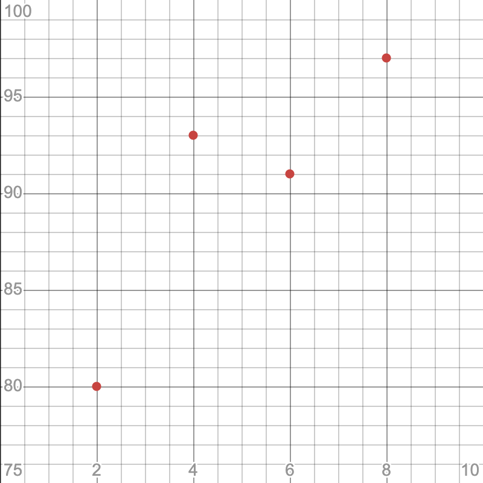
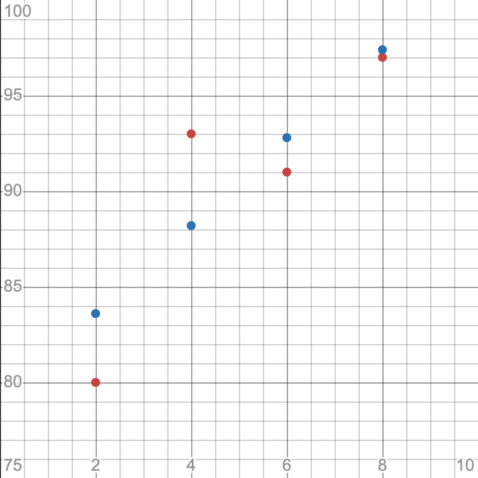
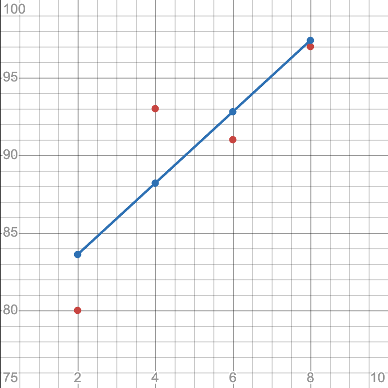

# Chapter 03: 가장 훌륭한 예측선 긋기: 선형 회귀
- 딥러닝은 자그마한 통계의 결과들이 무수히 얽히고 설켜 이루어지는 복잡한 연산의 결정체이다.
- 딥러닝을 이해하려면 가장 말단에서 이루어지는 가장 기본 적인 두 계산 원리를 알아야 한다.
- 선형 회귀와 로지스틱 회귀이다.
- 가장 훌륭한 예측선 긋기란 통계학 용어인 선형 회귀 (linear regression)을 풀어서 정의한 것이다.

## 01. 선형 회귀의 정의
- "학생들의 중간고사 성적이 다 다르다"
- 위 문장이 나타낼 수 있는 정보는 너무 제한적이다.
- 학급의 학생마다 제각각 성적이 다르다는 당연한 사실 외에는 알 수 있는게 없다.
- "학생들의 중간고사 성적이 [  ]에 따라 다 다르다"
- 이 문장은 정보가 담길 여지를 열어두고 있다.
- [  ]에 들어갈 내용을 정보라고 한다.
- 머신러닝과 딥러닝은 이 정보가 필요하다.
- 정보를 정확히 준비하면 성적을 예측하는 방정식을 만들 수도 있다.

### 수학적인 접근
- 성적을 변하게 하는 "정보" 요소를 $x$라고 하고, 이 $x$ 값에 의해 변하는 "성적"을 $y$라 하자.
- **독립 변수**: $x$ 값이 변함에 따라 $y$ 값도 변한다는 이 정의 안에서, 독립적으로 변할 수 있는 값 $x$
- **종속 변수**: 이 독립 변수에 따라 종속적으로 변하는 $y$
- **선형 회귀**: 독립 변수 $x$를 사용해 종속 변수 $y$의 움직임을 에측하고 설명하는 작업
- 독립 변수가 $x$ 하나 뿐이라 이것만으로는 정확히 설명할 수 없을 때는 $x_1, x_2, x_3$ 등 $x$ 값을 여러 개 준비해 놓을 수도 있다.
- **단순 선형 회귀**: 
    - simple linear regression
    - 하나의 $x$ 값만으로도 $y$ 값을 설명할 수 있는 경우
- **다중 선형 회귀**:
    - multiple linear regression
    - $x$ 값이 여러 개 필요한 경우

## 02. 가장 훌륭한 예측선이란?
- 독립 변수가 하나뿐인 단순 선형 회귀의 예를 공부해보자.
- 성적을 결정하는 여러 요소 중 "공부한 시간" 한가지만 놓고 생각해보자.
- 중간고사를 본 4명의 학생에게 각각 공부한 시간을 정리한 표가 아래와 같다.

|공부한 시간|2시간|4시간|6시간|8시간|
|:---:|:---:|:---:|:---:|:---:|
|성적|81점|93점|91점|97점|

- 공부한 시간을 $x$라 하고, 성적을 $y$라 할 때, 집합 $X$와 집합 $Y$를 다음과 같이 표현할 수 있다.
$$
X=\{2, 4, 6, 8\}
$$
$$
Y=\{81, 93, 91, 97\}
$$
- 이를 좌표 평면에 나타내면 아래와 같다.



- 왼쪽 아래에서 오른쪽 위로 향하는 일종의 "선형"을 보인다.
- 선은 직선이므로 일차 함수 그래프이다.
$$
y=ax+b
$$
- $a$: 직선의 기울기, 즉 $y값의 증가량\over x값의 증가량$ 이다.
- $b$: $y$ 축을 지나는 값인 "$y$ 절편"이다.
- 정확하게 계산하여면 상수 $a$와 $b$의 값을 알아야 한다.
- 직선을 훌륭하게 그으려면 직선의 기울기 $a$ 값과 $y$ 절편 $b$의 값을 정확하게 예측해 내야 하는 것이다.
- 선형 회귀는 결국 최적의 $a$ 값과 $b$의 값을 찾아내는 작업이다.

## 03. 최소 제곱법
- 최소 제곱법 (method of least squares)이라는 공식을 알고 적용한다면, 최소 제곱법을 통해 일차 함수의 기울기 $a$와 절편 $b$를 바로 구할 수 있다.
- 최소 제곱법은 회귀 분석에 사용되는 표준 방식으로, 실험이나 관찰을 통해 얻은 데이터를 분석하여 미지의 상수를 구할 때 사용되는 공식이다.
- $x$ 값과 $y$ 값을 이용해 기울기를 구하는 방법은 아래와 같다.
- 최소 제곱법 공식:
$$
a={\displaystyle\sum_{i=1}^{n}{(x-mean(x))(y-mean(y))}\over\displaystyle\sum_{i=1}^{n}{(x-mean(x))^2}}
$$
- 위 수식을 풀어 해석해 보면 아래와 같다.
$$
a={(x-x평균)(y-y평균)의\ 합\over(x-x평균)^2 의\ 합}
$$
- 위 수식에 성적과 공부한 시간 값을 대입해보자.
$$
공부한\ 시간(x)\ 평균:(2+4+6+8) \div 4=5
$$
$$
성적(y)\ 평균:(81+93+91+97) \div 4=90.5
$$
- 이를 위 식에 대입하면 아래와 같다.
$$
a={(2-5)(81-90.5)+(4-5)(93-90.5)+(6-5)(91-90.5)+(8-5)(97-90.5)\over(2-5)^2+(4-5)^2+(6-5)^2+(8-5)^2}
$$
$$
= {46\over20}
$$
$$
= 2.3
$$
- $y$ 절편인 $b$를 구하는 공식은 아래와 같다.
$$
b=mean(y)-(mean(x)*a)
$$
$$
b=y의\ 평균-(x의\ 평균 \times 기울기\ a)
$$
- 위 식에 우리가 알고 있는 것들을 대입하면 $b$를 구할 수 있게 된다.
$$
b=90.5-(2.3 \times 5)
$$
$$
=79
$$
- 이를 토대로 직선의 방정식을 구하면 아래와 같다.
$$
y=2.3x+79
$$
- 이 식에 우리가 가진 데이터를 대입해 예측 값을 구하면 아래와 같다.

|공부한 시간|2|4|6|8|
|:---:|:---:|:---:|:---:|:---:|
|성적|81|93|91|97|
|예측 값|83.6|88.2|92.8|97.4|



- 예측값을 연결해 직선을 그으면 우리가 원하는 예측 직선이 나온다.



## 04. 코딩으로 확인하는 최소 제곱
- 앞서 공부한 내용을 코딩으로 구현해 보자.
- 넘파이 라이브러리를 불러와 `np`라는 이름으로 사용할 수 있게 한다.
```py
import numpy as np

# x 값과 y값
x=[2, 4, 6, 8]
y=[81, 93, 91, 97]
```
- 최소 제곱근 공식에 의해 기울기와 $y$ 절편 값을 구한다.
```py
# x와 y의 평균값
mx = np.mean(x)
my = np.mean(y)
```
- 최소 제곱근 공식 중 분모의 값인 $x$의 평균값과 $x$의 각 원소들의 차를 제곱하라는 명령을 만든다.
```py
# 기울기 공식의 분모
divisor = sum([(mx - i)**2 for i in x])
```
- 분자에 해당하는 부분을 구한다.
```py
# 기울기 공식의 분자
def top(x, mx, y, my):
    d = 0
    for i in range(len(x)):
        d += (x[i] - mx) * (y[i] - my)
    return d
dividend = top(x, mx, y, my)
```
- 구한 분모와 분자로 기울기를 구한다.
```py
a = dividend / divisor
```
- 기울기를 구하면 $y$ 절편을 구하는 공식을 이용해 $b$를 구한다.
```py
b = my - (mx*a)
```
- 이를 하나의 파일로 만들면 아래와 같다.
```py
# deep_class/01_Linear_Regression.py

import numpy as np

# x 값과 y값
x=[2, 4, 6, 8]
y=[81, 93, 91, 97]

# x와 y의 평균값
mx = np.mean(x)
my = np.mean(y)
print("x의 평균값:", mx)
print("y의 평균값:", my)

# 기울기 공식의 분모
divisor = sum([(mx - i)**2 for i in x])

# 기울기 공식의 분자
def top(x, mx, y, my):
    d = 0
    for i in range(len(x)):
        d += (x[i] - mx) * (y[i] - my)
    return d
dividend = top(x, mx, y, my)

print("분모:", divisor)
print("분자:", dividend)

# 기울기와 y 절편 구하기
a = dividend / divisor
b = my - (mx*a)

# 출력으로 확인
print("기울기 a =", a)
print("y 절편 b =", b)

```
- 출력값은 아래와 같다.
```
y의 평균값: 90.5
분모: 20.0
분자: 46.0
기울기 a = 2.3
y 절편 b = 79.0
```

## 05. 평균 제곱근 오차
- 앞서 배운 공식만으로는 모든 상황을 해결하기는 어렵다.
- 딥러닝은 대부분 입력 값이 여러 개인 상황에서 이를 해결하기 위해 실행되기 때문에 복잡한 연산 과정이 따를 수 밖에 없다.
- 주어진 선의 오차를 평가하는 오차 평가 알고리즘이 필요하다.
- 가장 많이 사용되는 방법이 평균 제곱근 오차 (root mean square error)

## 06. 잘못 그은 선 바로잡기
- 여러 개의 입력값이 있는 경우 기울기와 $y$ 절편을 찾는 다른 방법이 필요하다.
- 가장 많이 사용하는 방법은 일단 그리고 조금씩 수정해 나가기 방법이다.
- 가설을 하나 세운 뒤 이 값이 주어진 요건을 충족하는지 판단하여 조금씩 변화를 주고 이 변화가 긍정적이면 오차가 최소화 될 때까지 반복하는 방법이다.
- 나중에 그린 선이 먼저 그린 선보다 좋은지 나쁜지 판단하는 방법이 필요하다.
- 오차를 계산하여 작은 쪽으로 바꾸는 알고리즘이 필요한 것이다.


- 해당 그래프에서 오차를 계산하려면 각 점과 그래프 사이의 거리를 재면 된다.
- 이 거리의 합이 작을수록 잘 그러진 직선이다.
$$
오차=실제\ 값-예측\ 값
$$
- 아래의 방정식으로 그린 직선과의 오차를 구해보자.
$$
y=3x+76
$$

|공부한 시간(x)|2|4|6|8|
|:---:|:---:|:---:|:---:|:---:|
|성적(y)|81|93|91|97|
|예측 값|82|88|94|100|
|오차|1|-5|3|3|

- 오차를 모두 더하면 2가 된다.
- 음수를 포한한 합이기에 정확하지 않으므로 오차의 합은 각 오차의 제곱으로 구한다.
$$
오차의\ 합=\displaystyle\sum_{i=1}^{n}{(p_i-y_i)^2}
$$
- 따라서 오차의 합을 다시 계산하면
$$
1+25+9+9=44
$$
- 오차의 합에 이어 각 $x$ 값의 평균 오차를 이용한다.
- 위에서 구한 값을 $n$으로 나누면 오차의 합의 평균을 구할 수 있다.
- 이를 평균 제곱 오차 (Mean Squared Error, MSE)라고 한다.
$$
평균\ 제곱\ 오차(MSE)={1\over{n}}{\displaystyle\sum_{i=1}^{n}{(p_i-y_i)^2}}
$$
- 앞서 구한 직선의 평균 제곱 오차는 $44/4=11$ 이 된다.
- 데이터가 많아지면 평균 제곱 오차가 너무 커서 쓰기 불편한 경우가 있다.
- 따라서 다시 제곱근을 씌워 사용한다.
- 이를 평균 제곱근 오차 (Root Mean Squared Error, RMSE)라고 한다.
$$
평균\ 제곱\ 오차(MSE)=\sqrt{{1\over{n}}{\displaystyle\sum_{i=1}^{n}{(p_i-y_i)^2}}}
$$
- 앞서 구한 직선의 평균 제곱근 오차는 $\sqrt{11}=3.3166...$ 이 된다.

## 07. 코딩으로 확인하는 평균 제곱근 오차
- 임의의 리스트 `ab`에 기울기와 $y$ 절편을 넣어 관리한다.
```py
#기울기 a와 y 절편 b
ab=[3,76]
```
- `data`라는 리스트를 만들어 공부한 시간과 이에 따른 성적을 저장한다.
- `x`와 `y` 리스트를 만들어 첫번쨰 값과 두번째 값을 저장한다.
```py
# x,y의 데이터 값
data = [[2, 81], [4, 93], [6, 91], [8, 97]]
x = [i[0] for i in data]
y = [i[1] for i in data]
```
- 함수를 통해 일차 방정식 $y=ax+b$를 구현한다.
```py
# y=ax + b에 a,b 값 대입하여 결과를 출력하는 함수
def predict(x):
   return ab[0]*x + ab[1]
```
- 평균 제곱근 공식을 함수로 구현한다.
```py
# RMSE 함수
def rmse(p, a):
   return np.sqrt(((p - a) ** 2).mean())
```
- 데이터를 입력하여 최종값을 구하는 함수를 구현한다.
```py
# RMSE 함수를 각 y값에 대입하여 최종 값을 구하는 함수
def rmse_val(predict_result,y):
   return rmse(np.array(predict_result), np.array(y))
```
- 예측 값과 실제 값을 통해 최종값을 출력하는 코드를 작성한다.
```py
# 예측값이 들어갈 빈 리스트
predict_result = []

# 모든 x값을 한 번씩 대입하여 predict_result 리스트완성.
for i in range(len(x)):
   predict_result.append(predict(x[i]))
   print("공부시간=%.f, 실제점수=%.f, 예측점수=%.f" % (x[i], y[i], predict(x[i])))
```
- 전체 코드는 아래와 같다.
```py
# deep_class/02_RMSE.py

import numpy as np

#기울기 a와 y 절편 b
ab=[3,76]

# x,y의 데이터 값
data = [[2, 81], [4, 93], [6, 91], [8, 97]]
x = [i[0] for i in data]
y = [i[1] for i in data]

# y=ax + b에 a,b 값 대입하여 결과를 출력하는 함수
def predict(x):
   return ab[0]*x + ab[1]

# RMSE 함수
def rmse(p, a):
   return np.sqrt(((p - a) ** 2).mean())

# RMSE 함수를 각 y값에 대입하여 최종 값을 구하는 함수
def rmse_val(predict_result,y):
   return rmse(np.array(predict_result), np.array(y))

# 예측값이 들어갈 빈 리스트
predict_result = []

# 모든 x값을 한 번씩 대입하여 predict_result 리스트완성.
for i in range(len(x)):
   predict_result.append(predict(x[i]))
   print("공부시간=%.f, 실제점수=%.f, 예측점수=%.f" % (x[i], y[i], predict(x[i])))

# 최종 RMSE 출력
print("rmse 최종값: " + str(rmse_val(predict_result,y)))

```
- 출력값은 아래와 같다.
```
공부시간=2, 실제점수=81, 예측점수=82
공부시간=4, 실제점수=93, 예측점수=88
공부시간=6, 실제점수=91, 예측점수=94
공부시간=8, 실제점수=97, 예측점수=100
rmse 최종값: 3.3166247903554
```