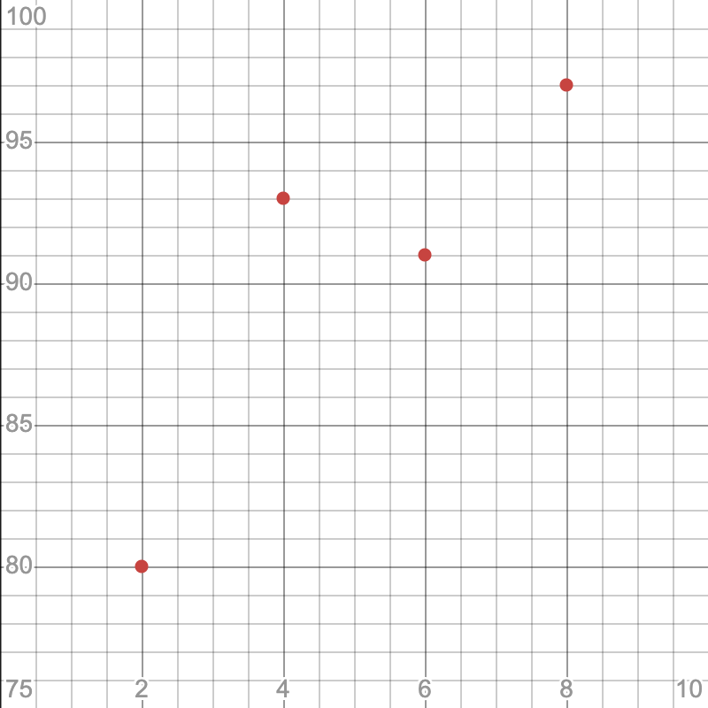

# Chapter 03: 가장 훌륭한 예측선 긋기: 선형 회귀
- 딥러닝은 자그마한 통계의 결과들이 무수히 얽히고 설켜 이루어지는 복잡한 연산의 결정체이다.
- 딥러닝을 이해하려면 가장 말단에서 이루어지는 가장 기본 적인 두 계산 원리를 알아야 한다.
- 선형 회귀와 로지스틱 회귀이다.
- 가장 훌륭한 예측선 긋기란 통계학 용어인 선형 회귀 (linear regression)을 풀어서 정의한 것이다.

## 01. 선형 회귀의 정의
- "학생들의 중간고사 성적이 다 다르다"
- 위 문장이 나타낼 수 있는 정보는 너무 제한적이다.
- 학급의 학생마다 제각각 성적이 다르다는 당연한 사실 외에는 알 수 있는게 없다.
- "학생들의 중간고사 성적이 [  ]에 따라 다 다르다"
- 이 문장은 정보가 담길 여지를 열어두고 있다.
- [  ]에 들어갈 내용을 정보라고 한다.
- 머신러닝과 딥러닝은 이 정보가 필요하다.
- 정보를 정확히 준비하면 성적을 예측하는 방정식을 만들 수도 있다.

### 수학적인 접근
- 성적을 변하게 하는 "정보" 요소를 $x$라고 하고, 이 $x$ 값에 의해 변하는 "성적"을 $y$라 하자.
- **독립 변수**: $x$ 값이 변함에 따라 $y$ 값도 변한다는 이 정의 안에서, 독립적으로 변할 수 있는 값 $x$
- **종속 변수**: 이 독립 변수에 따라 종속적으로 변하는 $y$
- **선형 회귀**: 독립 변수 $x$를 사용해 종속 변수 $y$의 움직임을 에측하고 설명하는 작업
- 독립 변수가 $x$ 하나 뿐이라 이것만으로는 정확히 설명할 수 없을 때는 $x_1, x_2, x_3$ 등 $x$ 값을 여러 개 준비해 놓을 수도 있다.
- **단순 선형 회귀**: 
    - simple linear regression
    - 하나의 $x$ 값만으로도 $y$ 값을 설명할 수 있는 경우
- **다중 선형 회귀**:
    - multiple linear regression
    - $x$ 값이 여러 개 필요한 경우

## 02. 가장 훌륭한 예측선이란?
- 독립 변수가 하나뿐인 단순 선형 회귀의 예를 공부해보자.
- 성적을 결정하는 여러 요소 중 "공부한 시간" 한가지만 놓고 생각해보자.
- 중간고사를 본 4명의 학생에게 각각 공부한 시간을 정리한 표가 아래와 같다.

|공부한 시간|2시간|4시간|6시간|8시간|
|:---:|:---:|:---:|:---:|:---:|
|성적|81점|93점|91점|97점|

- 공부한 시간을 $x$라 하고, 성적을 $y$라 할 때, 집합 $X$와 집합 $Y$를 다음과 같이 표현할 수 있다.
$$
X=\{2, 4, 6, 8\}
$$
$$
Y=\{81, 93, 91, 97\}
$$
- 이를 좌표 평면에 나타내면 아래와 같다.

- 왼쪽 아래에서 오른쪽 위로 향하는 일종의 "선형"을 보인다.
- 선은 직선이므로 일차 함수 그래프이다.
$$
y=ax+b
$$
- $a$: 직선의 기울기, 즉 $y값의 증가량\over x값의 증가량$ 이다.
- $b$: $y$ 축을 지나는 값인 "$y$ 절편"이다.
- 정확하게 계산하여면 상수 $a$와 $b$의 값을 알아야 한다.
- 직선을 훌륭하게 그으려면 직선의 기울기 $a$ 값과 $y$ 절편 $b$의 값을 정확하게 예측해 내야 하는 것이다.
- 선형 회귀는 결국 최적의 $a$ 값과 $b$의 값을 찾아내는 작업이다.

## 03. 최소 제곱법
- 최소 제곱법 (method of least squares)이라는 공식을 알고 적용한다면, 최소 제곱법을 통해 일차 함수의 기울기 $a$와 절편 $b$를 바로 구할 수 있다.
- 최소 제곱법은 회귀 분석에 사용되는 표준 방식으로, 실험이나 관찰을 통해 얻은 데이터를 분석하여 미지의 상수를 구할 때 사용되는 공식이다.
- $x$ 값과 $y$ 값을 이용해 기울기를 구하는 방법은 아래와 같다.
- 최소 제곱법 공식:
$$
a={\displaystyle\sum_{i=1}^{n}{(x-mean(x))(y-mean(y))}\over\displaystyle\sum_{i=1}^{n}{(x-mean(x))^2}}
$$
- 위 수식을 풀어 해석해 보면 아래와 같다.
$$
a={(x-x평균)(y-y평균)의\ 합\over(x-x평균)^2 의\ 합}
$$
- 위 수식에 성적과 공부한 시간 값을 대입해보자.
$$
공부한\ 시간(x)\ 평균:(2+4+6+8) \div 4=5
$$
$$
성적(y)\ 평균:(81+93+91+97) \div 4=90.5
$$
- 이를 위 식에 대입하면 아래와 같다.
$$
a={(2-5)(81-90.5)+(4-5)(93-90.5)+(6-5)(91-90.5)+(8-5)(97-90.5)\over(2-5)^2+(4-5)^2+(6-5)^2+(8-5)^2}
$$
$$
= {46\over20}
$$
$$
= 2.3
$$
- $y$ 절편인 $b$를 구하는 공식은 아래와 같다.
$$
b=mean(y)-(mean(x)*a)
$$