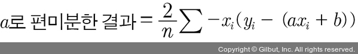

# Chapter 05: 선형 회귀 모델: 먼저 긋고 수정하기
- 앞서 기울기 a를 너무 크게 잡으면 오차가 커지는 것을 확인했다. 
- 기울기를 너무 작게 잡아도 오차가 커진다.
- 기울기 a와 오차 사이에는 이렇게 상관관계가 있다.
- 이때 기울기가 무한대로 커지거나 무한대로 작아지면 그래프는 y축과 나란한 직선이 되고, 오차도 함께 무한대로 커진다.
- 이를 다시 표현하면 기울기 a와 오차 사이에는 아래 그림의 그래프와 같은 이차 함수의 관계가 있다는 의미가 된다.


- 그래프의 가장 아래쪽 볼록한 부분에 이르렀을 때 오차가 가장 작다.
- 기울기 a가 m의 위치에 있을 때이다. 
- 최적의 기울기를 찾는 작업을 위해 a1 값보다 a2 값이 m에 더 가깝고, a3 값이 a2 값보다 m에 더 가깝다는 것을 컴퓨터가 판단해야 한다.
- 경사 하강법(gradient decent): 미분 기울기를 이용하여 판단을 하게 하는 방법

## 01. 경사 하강법의 개요
- y = x^2 그래프에서 x에 다음과 같이 a1, a2 그리고 m을 대입해 그 자리에서 미분하면 아래 그림과 같이 각 점에서의 순간 기울기가 그려진다.


- 우리가 찾는 최솟값 m에서의 순간 기울기를 보아야 한다.
- 그래프가 이차 함수 포물선이므로 꼭짓점의 기울기는 x축과 평행한 선이 되므로, 기울기가 0이다.
- 따라서 미분 값이 0인 지점을 찾아야 한다.
- 이를 위해 아래의 과정을 거친다.
    1. a1에서 미분을 구한다.
    2. 구한 기울기의 반대 방향(기울기가 +면 음의 방향, -면 양의 방향)으로 얼마간 이동시킨 a2에서 미분을 구한다.
    3. 앞에서 구한 미분 값이 0이 아니면 1과 2 과정을 반복한다.
- 그러면 아래 그림과 같이 기울기가 0인 한 점(m)으로 수렴한다.


- 경사 하강법은 이렇게 반복적으로 기울기 a를 변화시켜서 m 값을 찾아내는 방법이다.
- 여기서 학습률(learning rate)이라는 개념을 알 수 있다.
- 기울기의 부호를 바꾸어 이동시킬 때 적절한 거리를 찾지 못해 너무 멀리 이동시키면 a 값이 한 점으로 모이지 않고 아래 그림과 같이 위로 치솟아 버린다.


- 따라서 어느 만큼 이동시킬지 신중히 결정해야 하는데, 이때 이동 거리를 정해 주는 것이 바로 학습률이다.
- 딥러닝에서 학습률의 값을 적절히 바꾸면서 최적의 학습률을 찾는 것은 중요한 최적화 과정 중 하나이다.
- 경사 하강법은 오차의 변화에 따라 이차 함수 그래프를 만들고 적절한 학습률을 설정해 미분 값이 0인 지점을 구하는 것이다.
- y 절편 b의 값도 값이 너무 크면 오차도 함께 커지고, 너무 작아도 오차가 커진다.
- 따라서 최적의 b 값을 구할 때 역시 경사 하강법을 사용한다.

## 02. 파이썬 코딩으로 확인하는 선형 회귀
- 지금까지 내용을 파이썬 코드로 옮겨 본다.
- 먼저 평균 제곱 오차의 식을 다시 본다.


- 여기서 y^는 y = ax + b의 식에 xi를 집어넣었을 때 값이므로 yi = axi + b를 대입하면 아래와 같이 바뀐다.


- 이 값을 미분할 때 우리가 궁금한 것은 a와 b라는 것을 기억해야 한다.
- 식 전체를 미분하는 것이 아니라 필요한 값을 중심으로 미분해야 하기 때문이다.
- a와 b로 각각 편미분한 결과를 옮겨 보면 아래와 같다.




- 이를 각각 파이썬 코드로 바꾸면 아래와 같다.
```py
# 예측 값을 구하는 식
y_pred = a * x + b
# 실제 값과 비교한 오차를 error로 설정
error = y - y_pred

# 오차 함수를 a로 편미분한 값
a_diff = (2/n) * sum(-x * (error))
# 오차 함수를 b로 편미분한 값
b_diff = (2/n) * sum(-(error))
```
- 여기에 학습률을 곱해 기존의 a 값과 b 값을 업데이트한다.
```py
# 학습률을 설정
lr = 0.03
# 학습률을 곱해 기존의 a 값을 업데이트
a = a - lr * a_diff
# 학습률을 곱해 기존의 b 값을 업데이트
b = b - lr * b_diff
```

> #### 학습률 0.03은 어떻게 정했나
> - 여러 학습률을 적용해 보며 최적의 결과를 만드는 학습률을 찾아낸 것이다.
> - 최적의 학습률은 데이터와 딥러닝 모델에 따라 다르므로 그때그때 찾아내야 한다.
> - 앞으로 배우게 될 딥러닝 프로젝트에서는 자동으로 최적의 학습률을 찾아 주는 최적화 알고리즘들을 사용한다.

- 중간 과정을 그래프로 표현하는 코드를 넣어 모두 정리하면 아래의 코드가 완성된다.
```py
import numpy as np
import matplotlib.pyplot as plt

# 공부 시간 X와 성 y의 넘파이 배열을 만듭니다.
x = np.array([2, 4, 6, 8])
y = np.array([81, 93, 91, 97])

# 데이터의 분포를 그래프로 나타냅니다.
plt.scatter(x, y)
plt.show()

# 기울기 a의 값과 절편 b의 값을 초기화합니다.
a = 0
b = 0

# 학습률을 정합니다.
lr = 0.03

# 몇 번 반복될지 설정합니다.
epochs = 2001 

# x 값이 총 몇 개인지 셉니다.
n = len(x)

# 경사 하강법을 시작합니다.
for i in range(epochs):      # 에포크 수만큼 반복합니다.
    y_pred = a * x + b       # 예측 값을 구하는 식입니다.
    error = y - y_pred       # 실제 값과 비교한 오차를 error로 놓습니다.

    a_diff = (2/n) * sum(-x * (error))   # 오차 함수를 a로 편미분한 값입니다.
    b_diff = (2/n) * sum(-(error))       # 오차 함수를 b로 편미분한 값입니다.

    a = a - lr * a_diff   # 학습률을 곱해 기존의 a 값을 업데이트합니다.
    b = b - lr * b_diff   # 학습률을 곱해 기존의 b 값을 업데이트합니다.

    if i % 100 == 0:      # 100번 반복될 때마다 현재의 a 값, b 값을 출력합니다.
        print("epoch=%.f, 기울기=%.04f, 절편=%.04f" % (i, a, b))
        
# 앞서 구한 최종 a 값을 기울기, b 값을 y 절편에 대입해 그래프를 그립니다.
y_pred = a * x + b      

# 그래프를 출력합니다.
plt.scatter(x, y)
plt.plot(x, y_pred,'r')
plt.show()
```
- 실행 결과
```
epoch=0, 기울기=27.8400, 절편=5.4300
epoch=100, 기울기=7.0739, 절편=50.5117
epoch=200, 기울기=4.0960, 절편=68.2822
... (중략) ...
epoch=1900, 기울기=2.3000, 절편=79.0000
epoch=2000, 기울기=2.3000, 절편=79.0000
```


- 기울기 a의 값이 2.3에 수렴하는 것과 y 절편 b의 값이 79에 수렴하는 과정을 볼 수 있다.
- 기울기 2.3과 y 절편 79는 앞서 우리가 최소 제곱법을 이용해 미리 확인한 값과 같다.
- 이렇게 해서 최소 제곱법을 쓰지 않고 평균 제곱 오차와 경사 하강법을 이용해 원하는 값을 구할 수 있다.
- 이와 똑같은 방식을 x가 여러 개인 다중 선형 회귀에서도 사용한다.

## 03. 다중 선형 회귀의 개요
