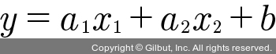

# Chapter 05: 선형 회귀 모델: 먼저 긋고 수정하기
- 앞서 기울기 a를 너무 크게 잡으면 오차가 커지는 것을 확인했다. 
- 기울기를 너무 작게 잡아도 오차가 커진다.
- 기울기 a와 오차 사이에는 이렇게 상관관계가 있다.
- 이때 기울기가 무한대로 커지거나 무한대로 작아지면 그래프는 y축과 나란한 직선이 되고, 오차도 함께 무한대로 커진다.
- 이를 다시 표현하면 기울기 a와 오차 사이에는 아래 그림의 그래프와 같은 이차 함수의 관계가 있다는 의미가 된다.


- 그래프의 가장 아래쪽 볼록한 부분에 이르렀을 때 오차가 가장 작다.
- 기울기 a가 m의 위치에 있을 때이다. 
- 최적의 기울기를 찾는 작업을 위해 a1 값보다 a2 값이 m에 더 가깝고, a3 값이 a2 값보다 m에 더 가깝다는 것을 컴퓨터가 판단해야 한다.
- 경사 하강법(gradient decent): 미분 기울기를 이용하여 판단을 하게 하는 방법

## 01. 경사 하강법의 개요
- y = x^2 그래프에서 x에 다음과 같이 a1, a2 그리고 m을 대입해 그 자리에서 미분하면 아래 그림과 같이 각 점에서의 순간 기울기가 그려진다.


- 우리가 찾는 최솟값 m에서의 순간 기울기를 보아야 한다.
- 그래프가 이차 함수 포물선이므로 꼭짓점의 기울기는 x축과 평행한 선이 되므로, 기울기가 0이다.
- 따라서 미분 값이 0인 지점을 찾아야 한다.
- 이를 위해 아래의 과정을 거친다.
    1. a1에서 미분을 구한다.
    2. 구한 기울기의 반대 방향(기울기가 +면 음의 방향, -면 양의 방향)으로 얼마간 이동시킨 a2에서 미분을 구한다.
    3. 앞에서 구한 미분 값이 0이 아니면 1과 2 과정을 반복한다.
- 그러면 아래 그림과 같이 기울기가 0인 한 점(m)으로 수렴한다.


- 경사 하강법은 이렇게 반복적으로 기울기 a를 변화시켜서 m 값을 찾아내는 방법이다.
- 여기서 학습률(learning rate)이라는 개념을 알 수 있다.
- 기울기의 부호를 바꾸어 이동시킬 때 적절한 거리를 찾지 못해 너무 멀리 이동시키면 a 값이 한 점으로 모이지 않고 아래 그림과 같이 위로 치솟아 버린다.


- 따라서 어느 만큼 이동시킬지 신중히 결정해야 하는데, 이때 이동 거리를 정해 주는 것이 바로 학습률이다.
- 딥러닝에서 학습률의 값을 적절히 바꾸면서 최적의 학습률을 찾는 것은 중요한 최적화 과정 중 하나이다.
- 경사 하강법은 오차의 변화에 따라 이차 함수 그래프를 만들고 적절한 학습률을 설정해 미분 값이 0인 지점을 구하는 것이다.
- y 절편 b의 값도 값이 너무 크면 오차도 함께 커지고, 너무 작아도 오차가 커진다.
- 따라서 최적의 b 값을 구할 때 역시 경사 하강법을 사용한다.

## 02. 파이썬 코딩으로 확인하는 선형 회귀
- 지금까지 내용을 파이썬 코드로 옮겨 본다.
- 먼저 평균 제곱 오차의 식을 다시 본다.


- 여기서 y^는 y = ax + b의 식에 xi를 집어넣었을 때 값이므로 yi = axi + b를 대입하면 아래와 같이 바뀐다.


- 이 값을 미분할 때 우리가 궁금한 것은 a와 b라는 것을 기억해야 한다.
- 식 전체를 미분하는 것이 아니라 필요한 값을 중심으로 미분해야 하기 때문이다.
- a와 b로 각각 편미분한 결과를 옮겨 보면 아래와 같다.


- 이를 각각 파이썬 코드로 바꾸면 아래와 같다.
```py
# 예측 값을 구하는 식
y_pred = a * x + b
# 실제 값과 비교한 오차를 error로 설정
error = y - y_pred

# 오차 함수를 a로 편미분한 값
a_diff = (2/n) * sum(-x * (error))
# 오차 함수를 b로 편미분한 값
b_diff = (2/n) * sum(-(error))
```
- 여기에 학습률을 곱해 기존의 a 값과 b 값을 업데이트한다.
```py
# 학습률을 설정
lr = 0.03
# 학습률을 곱해 기존의 a 값을 업데이트
a = a - lr * a_diff
# 학습률을 곱해 기존의 b 값을 업데이트
b = b - lr * b_diff
```

> #### 학습률 0.03은 어떻게 정했나
> - 여러 학습률을 적용해 보며 최적의 결과를 만드는 학습률을 찾아낸 것이다.
> - 최적의 학습률은 데이터와 딥러닝 모델에 따라 다르므로 그때그때 찾아내야 한다.
> - 앞으로 배우게 될 딥러닝 프로젝트에서는 자동으로 최적의 학습률을 찾아 주는 최적화 알고리즘들을 사용한다.

- 중간 과정을 그래프로 표현하는 코드를 넣어 모두 정리하면 아래의 코드가 완성된다.
```py
import numpy as np
import matplotlib.pyplot as plt

# 공부 시간 X와 성 y의 넘파이 배열을 만듭니다.
x = np.array([2, 4, 6, 8])
y = np.array([81, 93, 91, 97])

# 데이터의 분포를 그래프로 나타냅니다.
plt.scatter(x, y)
plt.show()

# 기울기 a의 값과 절편 b의 값을 초기화합니다.
a = 0
b = 0

# 학습률을 정합니다.
lr = 0.03

# 몇 번 반복될지 설정합니다.
epochs = 2001 

# x 값이 총 몇 개인지 셉니다.
n = len(x)

# 경사 하강법을 시작합니다.
for i in range(epochs):      # 에포크 수만큼 반복합니다.
    y_pred = a * x + b       # 예측 값을 구하는 식입니다.
    error = y - y_pred       # 실제 값과 비교한 오차를 error로 놓습니다.

    a_diff = (2/n) * sum(-x * (error))   # 오차 함수를 a로 편미분한 값입니다.
    b_diff = (2/n) * sum(-(error))       # 오차 함수를 b로 편미분한 값입니다.

    a = a - lr * a_diff   # 학습률을 곱해 기존의 a 값을 업데이트합니다.
    b = b - lr * b_diff   # 학습률을 곱해 기존의 b 값을 업데이트합니다.

    if i % 100 == 0:      # 100번 반복될 때마다 현재의 a 값, b 값을 출력합니다.
        print("epoch=%.f, 기울기=%.04f, 절편=%.04f" % (i, a, b))
        
# 앞서 구한 최종 a 값을 기울기, b 값을 y 절편에 대입해 그래프를 그립니다.
y_pred = a * x + b      

# 그래프를 출력합니다.
plt.scatter(x, y)
plt.plot(x, y_pred,'r')
plt.show()
```
- 실행 결과
```
epoch=0, 기울기=27.8400, 절편=5.4300
epoch=100, 기울기=7.0739, 절편=50.5117
epoch=200, 기울기=4.0960, 절편=68.2822
... (중략) ...
epoch=1900, 기울기=2.3000, 절편=79.0000
epoch=2000, 기울기=2.3000, 절편=79.0000
```


- 기울기 a의 값이 2.3에 수렴하는 것과 y 절편 b의 값이 79에 수렴하는 과정을 볼 수 있다.
- 기울기 2.3과 y 절편 79는 앞서 우리가 최소 제곱법을 이용해 미리 확인한 값과 같다.
- 이렇게 해서 최소 제곱법을 쓰지 않고 평균 제곱 오차와 경사 하강법을 이용해 원하는 값을 구할 수 있다.
- 이와 똑같은 방식을 x가 여러 개인 다중 선형 회귀에서도 사용한다.

## 03. 다중 선형 회귀의 개요
- 학생들이 공부한 시간에 따른 예측 직선을 그리고자 기울기 a와 y 절편 b를 구했다.
- 이 예측 직선을 이용해도 실제 성적 사이에는 약간의 오차가 있었다.
- 차이가 생기는 이유는 공부한 시간 이외의 다른 요소가 성적에 영향을 끼쳤기 때문이다.
- 더 정확한 예측을 하려면 추가 정보를 입력해야 하며, 정보를 추가해 새로운 예측 값을 구하려면 변수 개수를 늘려 다중 선형 회귀를 만들어야 한다.
- 예를 들어 일주일 동안 받는 과외 수업 횟수를 조사해서 이를 기록해 보자.

|공부한 시간 (x1)|2|4|6|8|
|:---:|:---:|:---:|:---:|:---:|
|과외 수업 횟수 (x2)|0|4|2|3|
|성적 (y)|81|93|91|97|

- 그럼 지금부터 독립 변수 x1과 x2가 두 개 생긴 것아다.
- 이를 사용해 종속 변수 y를 만들 경우 기울기를 두 개 구해야 하므로 아래 식이 나온다.



- 두 기울기 a1과 a2는 앞서 배운 경사 하강법을 그대로 적용하면 된다.
- 파이썬 코드로 확인해 보자.

## 04. 파이썬 코딩으로 확인하는 다중 선형 회귀
- 다중 선형 회귀를 만들어 보자.
- x 값이 두 개이므로 공부 시간 x1, 과외 시간 x2, 성적 y의 넘파이 배열을 만든다.
```py
x1 = np.array([2, 4, 6, 8])
x2 = np.array([0, 4, 2, 3])
y = np.array([81, 93, 91, 97])
```
- 데이터의 분포를 그래프로 표현한다.
```py
fig = plt.figure()
ax = fig.add_subplot(111, projection='3d')
ax.scatter3D(x1, x2, y);
plt.show()
```


- x와 y 두 개의 축이던 것과는 달리 x1, x2, y 이렇게 세 개의 축이 필요하다.
- 새로운 변수가 추가되면 차원이 하나씩 추가되면서 계산은 더욱 복잡해지는 것을 알 수 있다.
- 선형 회귀는 선을 긋는 작업이지만 다중 선형 회귀는 최적의 결과를 찾은 후 이를 그래프로 표현하면 그림과 같이 평면으로 표시된다.


- 직선상에서 예측하던 것이 평면으로 범위가 넓어지므로 계산이 복잡해지고 더 많은 데이터를 필요로 하게 된다.
- 코드로는 x가 두 개가 되었으므로 x1, x2 두 변수를 만들고, 기울기도 a1과 a2 이렇게 두 개를 만든다.
- 경사 하강법을 적용해 본다.
- 예측 값을 구하는 식을 세운다.
```py
# 기울기와 절편 자리에 a1, a2, b를 각각 대입
y_pred = a1 * x1 + a2 * x2 + b
# 실제 값과 비교한 오차를 error로 설정
error = y - y_pred
```
- 오차 함수를 a1, a2, b로 각각 편미분한 값을 a1_diff, a2_diff, b_diff라고 할 때 이를 구하는 식
```py
# 변수의 총 개수
n = len(x1)
# 오차 함수를 a1로 편미분한 값
a1_diff = (2/n) * sum(-x1 * (error))
# 오차 함수를 a2로 편미분한 값
a2_diff = (2/n) * sum(-x2 * (error))
# 오차 함수를 b로 편미분한 값
b_diff = (2/n) * sum(-(error))
```
- 학습률을 곱해 기존의 기울기와 절편을 업데이트한 값을 구한다.
```py
# 학습률을 곱해 기존의 a1 값을 업데이트
a1 = a1 - lr * a1_diff
# 학습률을 곱해 기존의 a2 값을 업데이트
a2 = a2 - lr * a2_diff
# 학습률을 곱해 기존의 b 값을 업데이트
b = b - lr * b_diff
```
- 실제 점수와 예측된 점수를 출력해서 예측이 잘되는지 확인한다.
```py
print("실제 점수: ", y)
print("예측 점수: ", y_pred)
```
- 전체 코드는 아래와 같다.
```py
import numpy as np
import matplotlib.pyplot as plt

# 공부 시간 x1과 과외 시간 x2, 성적 y의 넘파이 배열을 만듭니다.
x1 = np.array([2, 4, 6, 8])
x2 = np.array([0, 4, 2, 3])
y = np.array([81, 93, 91, 97])

# 데이터의 분포를 그래프로 나타냅니다.
fig = plt.figure()
ax = fig.add_subplot(111, projection='3d')
ax.scatter3D(x1, x2, y);
plt.show()

# 기울기 a의 값과 절편 b의 값을 초기화합니다.
a1 = 0
a2 = 0
b = 0

# 학습률을 정합니다.
lr = 0.01 

# 몇 번 반복될지 설정합니다.
epochs = 2001 

# x 값이 총 몇 개인지 셉니다. x1과 x2의 수가 같으므로 x1만 세겠습니다.
n = len(x1)

# 경사 하강법을 시작합니다.
for i in range(epochs):             # 에포크 수만큼 반복합니다.
    
    y_pred = a1 * x1 + a2 * x2 + b  # 예측 값을 구하는 식을 세웁니다.
    error = y - y_pred              # 실제 값과 비교한 오차를 error로 놓습니다.
    
    a1_diff = (2/n) * sum(-x1 * (error))  # 오차 함수를 a1로 편미분한 값입니다.
    a2_diff = (2/n) * sum(-x2 * (error))  # 오차 함수를 a2로 편미분한 값입니다.
    b_diff = (2/n) * sum(-(error))        # 오차 함수를 b로 편미분한 값입니다.
    
    a1 = a1 - lr * a1_diff      # 학습률을 곱해 기존의 a1 값을 업데이트합니다.
    a2 = a2 - lr * a2_diff      # 학습률을 곱해 기존의 a2 값을 업데이트합니다.
    b = b - lr * b_diff         # 학습률을 곱해 기존의 b 값을 업데이트합니다.
    
    if i % 100 == 0:   # 100번 반복될 때마다 현재의 a1, a2, b의 값을 출력합니다.
        print("epoch=%.f, 기울기1=%.04f, 기울기2=%.04f, 절편=%.04f" % (i, a1, a2, b))

# 실제 점수와 예측된 점수를 출력합니다.
print("실제 점수: ", y)
print("예측 점수: ", y_pred)
```
- 실행 결과
```
... (전략) ...
epoch=1700, 기울기1=1.5496, 기울기2=2.3028, 절편=77.5168
epoch=1800, 기울기1=1.5361, 기울기2=2.2982, 절편=77.6095
epoch=1900, 기울기1=1.5263, 기울기2=2.2948, 절편=77.6769
epoch=2000, 기울기1=1.5191, 기울기2=2.2923, 절편=77.7260
실제 점수: [81 93 91 97]
예측 점수: <[80.76387645 92.97153922 91.42520875 96.7558749]
```
- 2000번 반복했을 때 최적의 기울기 a1과 a2 및 절편을 찾아가며 실제 점수에 가까운 예측 값을 만들어 내고 있다.

## 05. 텐서플로에서 실행하는 선형 회귀, 다중 선형 회귀 모델
- 앞으로 딥러닝을 실행하기 위해 텐서플로 라이브러리의 케라스 API를 불러와 사용할 것입이다.
- 선형 회귀의 개념과 딥러닝 라이브러리들이 어떻게 연결되는지 살펴보는 것으로 텐서플로 및 케라스의 사용법을 익히는 것은 물론이고 딥러닝 자체에 대한 학습도 한걸음 더 나가게 될 것이다.
- 선형 회귀는 현상을 분석하는 방법의 하나다.
- 머신 러닝은 이러한 분석 방법을 이용해 예측 모델을 만드는 것이다.
- 따라서 두 분야에서 사용하는 용어가 약간 다르다.
- 예를 들어 함수 y = ax + b는 공부한 시간과 성적의 관계를 유추하기 위해 필요했던 식이다.
- 가설 함수(hypothesis) `H(x)`: 문제를 해결하기 위해 가정하는 식
- 가중치(weight) `w`: 기울기 a, 변수 x에 어느 정도의 가중치를 곱하는지 결정
- 편향(bias) `b`: 절편 b, 데이터의 특성에 따라 따로 부여되는 값
- y = ax + b는 머신 러닝에서 아래와 같이 표기된다.
```
H(x) = wx + b
```
- 손실 함수(loss function): 평균 제곱 오차처럼 실제 값과 예측 값 사이의 오차에 대한 식
```
평균 제곱 오차: 손실 함수 (loss function)
```
- 최적의 기울기와 절편을 찾기 위해 사용한 경사 하강법을 딥러닝에서는 옵티마이저(optimizer)라고 한다.
- 경사 하강법은 딥러닝에서 사용하는 여러 옵티마이저 중 하나다.
```
경사 하강법: 옵티마이저 (optimizer)
```
- 텐서플로에 포함된 케라스 API 중 필요한 함수들을 불러온다.
```py
from tensorflow.keras.models import Sequential
from tensorflow.keras.layers import Dense
```
- Sequential() 함수와 Dense() 함수를 불러와 선형 회귀를 실행하는 코드는 아래와 같다.
```py
# (1)
model.add(Dense(1, input_dim=1, activation='linear'))
# (2)
model.compile(optimizer='sgd', loss='mse')
# (3)
model.fit(x, y, epochs=2000)
```

> #### (1)
> - 가설 함수는 `H(x) = wx + b` 이다.
> - 출력되는 값(=성적)이 하나씩이므로 `Dense()` 함수의 첫 번째 인자에 1이라고 설정한다.
> - 입력될 변수(=학습 시간)도 하나뿐이므로 `input_dim` 역시 1이라고 설정한다.
> - 활성화 함수: 입력된 값을 다음 층으로 넘길 때 각 값을 어떻게 처리할지를 결정하는 함수
> - `activation`: 활성화 함수를 정하는 옵션
> - 선형 회귀를 다루고 있으므로 `linear` 라고 작성한다.
> - 딥러닝 목적에 따라 다른 활성화 함수를 넣을 수 있는데, 예를 들어 시그모이드 함수가 필요하다면 `sigmoid`라고 넣어 주는 식이다.
> 
> #### (2)
> - 경사 하강법을 실행하려면 옵티마이저에 `sgd` 라고 설정한다.
> - 손실 함수는 평균 제곱 오차를 사용할 것이므로 `mse`라고 설정한다.
> 
> #### (3)
> - 앞서 따로 적어 주었던 epochs 숫자를 `model.fit()` 함수에 작성한다.

- 학습 시간(x)이 입력되었을 때의 예측 점수는 `model.predict(x)`로 알 수 있다.
- 예측 점수로 그래프를 그린다.
```py
plt.scatter(x, y)
# 예측 결과를 그래프로 나타냄
plt.plot(x, model.predict(x), 'r')
plt.show()
```

- 전체 코드는 아래와 같다.
```py
import numpy as np
import matplotlib.pyplot as plt

# 텐서플로의 케라스 API에서 필요한 함수들을 불러옵니다.
from tensorflow.keras.models import Sequential
from tensorflow.keras.layers import Dense

x = np.array([2, 4, 6, 8])
y = np.array([81, 93, 91, 97])

model = Sequential()

# 출력 값, 입력 변수, 분석 방법에 맞게끔 모델을 설정합니다.
model.add(Dense(1, input_dim=1, activation='linear'))

# 오차 수정을 위해 경사 하강법(sgd)을, 오차의 정도를 판단하기 위해
# 평균 제곱 오차(mse)를 사용합니다.
model.compile(optimizer='sgd', loss='mse')

# 오차를 최소화하는 과정을 2000번 반복합니다.
model.fit(x, y, epochs=2000)

plt.scatter(x, y)
plt.plot(x, model.predict(x), 'r')    # 예측 결과를 그래프로 나타냅니다.
plt.show()

# 임의의 시간을 집어넣어 점수를 예측하는 모델을 테스트해 보겠습니다.
hour = 7
prediction = model.predict([hour])
print("%.f시간을 공부할 경우의 예상 점수는 %.02f점입니다." % (hour, prediction))
```
- 실행 결과
```
Epoch 1/2000
1/1 [==============================] - 1s 114ms/step - loss: 9241.3984
... (중략) ...
Epoch 2000/2000
1/1 [==============================] - 0s 2ms/step - loss: 8.3022

7시간을 공부할 경우의 예상 점수는 95.12점입니다.
```


- 앞서 구한 선형 회귀 결과와 같은 그래프를 구했고, 임의의 시간을 넣었을 때 예상되는 점수를 보여 준다.
- 다중 선형 회귀 역시 텐서플로를 이용해서 실행해 본다.
- 앞서 실행했던 내용과 거의 유사하지만, 입력해야 하는 변수가 한 개에서 두 개로 늘었다.
- 이 부분을 적용하려면 `input_dim` 부분을 2로 변경해 준다.
- 변수가 두 개이므로, 모델의 테스트를 위해서도 변수를 두 개 입력해야 한다.
- 임의의 학습 시간과 과외 시간을 입력했을 때의 점수는 아래와 같이 설정해서 구한다.
```py
hour = 7
private_class = 4
prediction = model.predict([[hour, private_class]])

print("%.f시간을 공부하고 %.f시간의 과외를 받을 경우, 예상 점수는 %.02f점입니다." % (hour, private_class, prediction))
```
- 전체 코드는 아래와 같다.
```py
import numpy as np
import matplotlib.pyplot as plt

# 텐서플로의 케라스 API에서 필요한 함수들을 불러옵니다.
from tensorflow.keras.models import Sequential
from tensorflow.keras.layers import Dense

x = np.array([[2, 0], [4, 4], [6, 2], [8, 3]])
y = np.array([81, 93, 91, 97])

model = Sequential()

# 입력 변수가 두 개(학습 시간, 과외 시간)이므로 input_dim에 2를 입력합니다.
model.add(Dense(1, input_dim=2, activation='linear'))
model.compile(optimizer='sgd', loss='mse')

model.fit(x, y, epochs=2000)

# 임의의 학습 시간과 과외 시간을 집어넣어 점수를 예측하는 모델을 테스트해 보겠습니다.
hour = 7
private_class = 4
prediction = model.predict([[hour, private_class]])

print("%.f시간을 공부하고 %.f시간의 과외를 받을 경우, 예상 점수는 %.02f점입니다." % (hour, private_class, prediction))
```
- 실행 결과
```
Epoch 1/2000
1/1 [==============================] - 0s 119ms/step - loss: 8184.9204
... (중략) ...
Epoch 2000/2000
1/1 [==============================] - 0s 2ms/step - loss: 0.0743

7시간을 공부하고 4시간의 과외를 받을 경우, 예상 점수는 97.53점입니다.
```