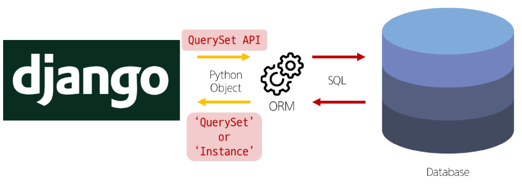
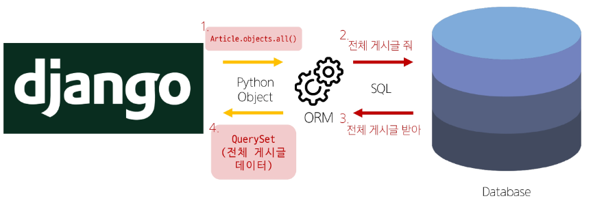
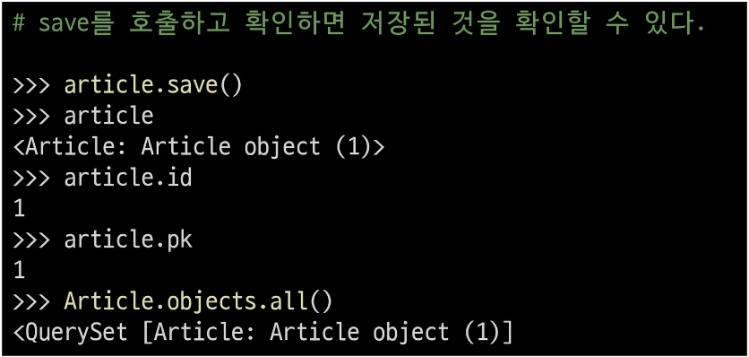
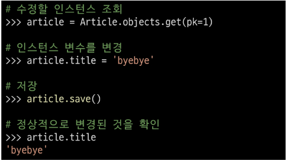
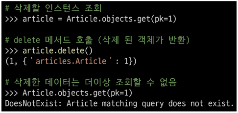

# Django
## ORM
- Object Relational Mapping
- 객체 지향 프로그래밍 언어를 사용하여 호환되지 않는 유형의 시스템 간에 데이터를 변환하는 기술

### ORM의 역할
- 사용하는 언어가 다르기 때문에 소통 불가
- Django에 내장된 ORM이 중간에서 이를 해석


## QuerySet API
- ORM에서 데이터를 검색, 필터링, 정렬 및 그룹화 하는데 사용하는 도구
- API를 사용하여 SQL이 아닌 Python 코드로 데이터를 처리

- QuerySet API 구문
    - `Article.objects.all()`
    - Model class. Manager.QuerySet API

### QuerySet API 구문 동작 예시


### Query
- 데이터베이스에 특정한 데이터를 보여 달라는 요청
- '쿼리문을 작성한다'
    - 원하는 데이터를 얻기 위해 데이터베이스에 요청을 보낼 코드를 작성함
- 파이썬으로 작성한 코드가 ORM에 의해 SQL로 변환되어 데이터베이스에 전달되며, 데이터베이스의 응답 데이터를 ORM이 QuerySet이라는자료 형태로 변환하여 우리에게 전달

### QuerySet
- 데이터베이스에게서 전달 받은 객체 목록(데이터 모음)
    - 순회가 가능한 데이터로써 1개 이상의 데이터를 불러와 사용할 수 있음
- Django ORM을 통해 만들어진 자료형
- 단, 데이터베이스가 단일한 객체를 반환할 때는 QuerySet이 아닌 모델(Class)의 인스턴스로 반환됨
- **QuerySet API는 python의 모델 클래스와 인스턴스를 활용해 DB에 데이터를 저장, 조회, 수정, 삭제하는 것**

## QuerySet API 실습
### 실습 사전 준비
- 외부 라이브러리 설치 및 설정
- `$ pip install ipython`
- `$ pip install django-extentions`
```python
# settings.py

INSTALLED_APPS = [
    'articles',
    'django_extensions',
    ...,
]
```
- `$ pip freeze > requirements.txt`

### Django shell
- Django 환경 안에서 실행되는 python shell
- 입력하는 QuerySet API 구문이 Django 프로젝트에 영향을 미침

#### Django Shell 실행
- `$ python manage.py shell_plus`

### 데이터 객체를 만드는(생성하는) 3가지 방법
#### 1. 첫번째 방법





#### 2. 두번째 방법
- save 메서드를 호출해야 비로소 DB에 데이터가 저장됨
- 테이블에 한 줄(행, 레코드)이 쓰여진 것
- `save()`: 객체를 데이터베이스에 저장하는 메서드


#### 3. 세번째 방법
- QuerySet API 중 create() 메서드 활용


### Read
#### 대표적인 조회 메서드
- Return new QuerySets
    - `all()`
    - `filter()`
- Do not return QuerySets
    - `get()`

#### `all()`
- 전체 데이터 조회


#### `filter()`
- 특정 조건 데이터 조회


#### `get()`
- 단일 데이터 조회


#### `get()` 특징
- 객체를 찾을 수 없으면 `DoesNotExist` 예외를 발생시키고 둘 이상의 객체를 찾으면 `MultipleObjectsReturned` 예외를 발생시킴
- 위와 같은 특징을 가지고 있기 때문에 primary key와 같이 고유성(uniqueness)을 보장하는 조회에서 사용해야 함

### Update
#### 데이터 수정
- 인스턴스 변수를 변경 후 `save()` 메서드 호출


### Delete
#### 데이터 삭제
- 삭제하려는 데이터 조회 후 `delete()` 메서드 호출


### 참고
#### Field lookups
- 특정 레코드에 대한 조건을 설정하는 방법
- QuerySet 메서드 `filter()`, `exclude()`, `get()`에 대한 키워드 인자로 지정


#### ORM, QuerySet API를 사용하는 이유
- 데이터베이스 쿼리를 추상화하여 Django 개발자가 데이터베이스와 직접 상호작용하지 않아도 되도록 함
- 데이터베이스와의 결합도를 낮추고 개발자가 더욱 직관적이고 생산적으로 개발할 수 있도록 도움
  
#### QuerySet API 관련 공식 문서
- [QuerySet API references](https://docs.djangoproject.com/en/5.0/ref/models/querysets/)
- [Making Queries](https://docs.djangoproject.com/en/5.0/topics/db/queries/)