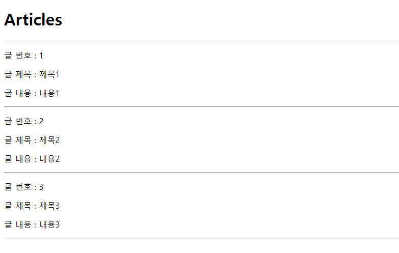
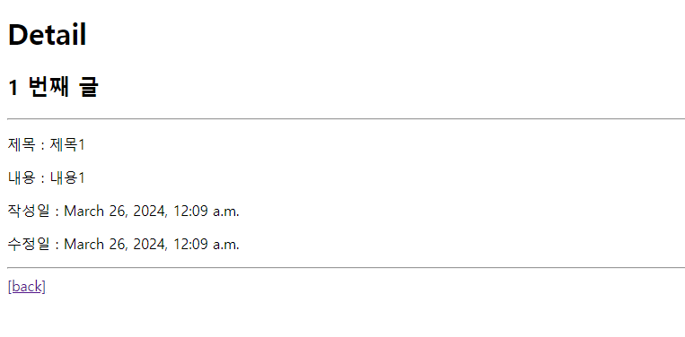
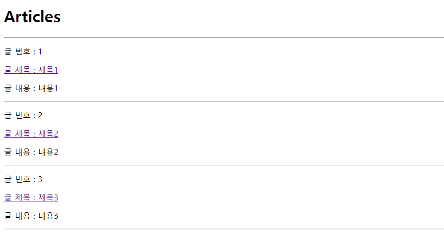
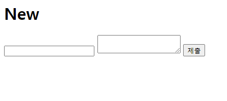
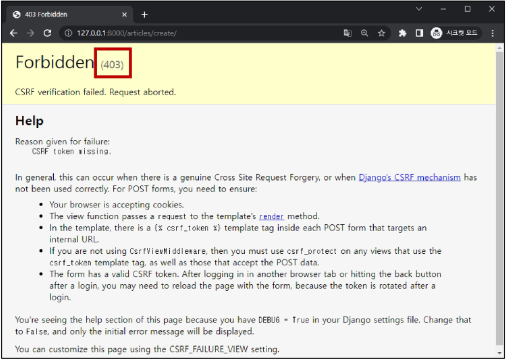
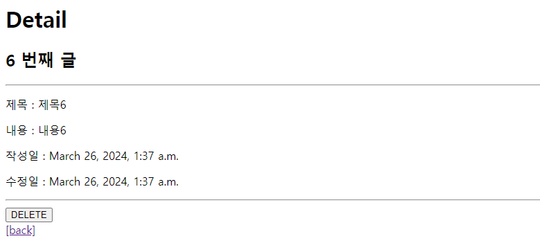

# Django
## Read
1. 전체 게시글 조회
2. 단일 게시글 조회

### 전체 게시글 조회

```python
# article/views.py

from django.shortcuts import render
from .models import Article

# Create your views here.

def index(request):
    articles = Article.objects.all()
    context = {
        'articles': articles,
    }
    return render(request, 'articles/index.html', context)
```
```html
<!-- articles/index.html -->

<body>
    <h1>Articles</h1>
    <hr>
    
        <p>글 번호 : {{ article.pk }}</p>
        <p>글 제목 : {{ article.title }}</p>
        <p>글 내용 : {{ article.content }}</p>
        <hr>
    
</body>
```

### 단일 게시글 조회

```python
# articles/urls.py

from django.urls import path
from . import views

app_name = 'articles'
urlpatterns = [
    path('', views.index, name='index'),
    path('<int:pk>/', views.detail, name='detail'),
]
```
```python
# articles/views.py

from django.shortcuts import render
from .models import Article

def index(request):
    articles = Article.objects.all()
    context = {
        'articles': articles,
    }
    return render(request, 'articles/index.html', context)

def detail(request, pk):
    article = Article.objects.get(pk=pk)
    context = {
        'article': article,
    }
    return render(request, 'articles/detail.html', context)
```
```html
<!-- articles/detail.html -->

<body>
    <h1>Detail</h1>
    <h2>{{ article.pk }} 번째 글</h2>
    <hr>
    <p>제목 : {{ article.title }}</p>
    <p>내용 : {{ article.content }}</p>
    <p>작성일 : {{ article.created_at }}</p>
    <p>수정일 : {{ article.updated_at }}</p>
    <hr>
    <a href="">[back]</a>
</body>
```

### 단일 게시글 페이지 링크 작성

```html
<!-- articles/index.html -->

<body>
    <h1>Articles</h1>
    <hr>
    
        <p>글 번호 : {{ article.pk }}</p>
        <a href="">
            <p>글 제목 : {{ article.title }}</p>
        </a>
        <p>글 내용 : {{ article.content }}</p>
        <hr>
    
</body>
```

## Create
- Create 로직을 구현하기 위해 필요한 view 함수의 개수는?
- new : 사용자 입력 데이터를 받을 페이지를 렌더링
- create : 사용자가 입력한 데이터를 받아 DB에 저장

### new 기능 구현

```python
# articles/urls.py

from django.urls import path
from . import views

app_name = 'articles'
urlpatterns = [
    path('', views.index, name='index'),
    path('<int:pk>/', views.detail, name='detail'),
    path('new/', views.new, name='new'),
]
```
```python
# articles/views.py

def new(request):
    return render(request, 'articles/new.html')
```
```html
<!-- articles/new.html -->

<body>
    <h1>New</h1>
    <form action="" method="GET">
        <input type="text" name="title">
        <textarea name="content"></textarea>
        <input type="submit">
    </form>
</body>
```
- new 페이지로 이동할 수 있는 하이퍼링크 작성
```html
<!-- articles/index.html -->

<h1>Articles</h1>
<a href="">NEW</a>
```

### create 기능 구현

```python
# articles/urls.py

from django.urls import path
from . import views

app_name = 'articles'
urlpatterns = [
    path('', views.index, name='index'),
    path('<int:pk>/', views.detail, name='detail'),
    path('new/', views.new, name='new'),
    path('create/', views.create, name='create'),
]
```
```html
<!-- articles/create.html -->

<body>
    <h1>게시글이 작성되었습니다</h1>
</body>
```
```python
# articles/views.py

def create(request):
    # request.GET
    title = request.GET.get('title')
    content = request.GET.get('content')
    # 방법 1
    # article = Article()
    # article.title = title
    # article.content = content
    # article.save()

    # 방법 2
    article = Article(title=title, content=content)
    article.save()

    # 방법 3
    # Article.objects.create(title=title, content=content)
    return render(request, 'articles/create.html')
```
```html
<!-- articles/new.html -->

<body>
    <h1>New</h1>
    <form action="" method="GET">
        <input type="text" name="title">
        <textarea name="content"></textarea>
        <input type="submit">
    </form>
</body>
```

## HTTP request methods
- HTTP: 네트워크 상에서 데이터를 주고 받기 위한 약속
- HTTP request methods: 데이터(리소스)에 어떤 요청(행동)을 원하는지를 나타내는 것
- GET & POST

### `GET` Method
- 특정 리소스를 조회하는 요청
- 데이터를 전달할 때 URL에서 Query String 형식으로 보내짐
- `https://127.0.0.1:8000/articles/create/?title=제목&content=내용`

### `POST` Method
- 특정 리소스에 변경(생성, 수정, 삭제)을 요구하는 요청
- 데이터는 전달할 때 HTTP Body에 담겨 보내짐

#### POST method 적용
```html
<!-- articles/new.html -->

<body>
    <h1>New</h1>
    <form action="" method="POST">
        <input type="text" name="title">
        <textarea name="content"></textarea>
        <input type="submit">
    </form>
</body>
```
```python
# articles/views.py

def create(request):
    title = request.POST.get('title')
    content = request.POST.get('content')

    article = Article(title=title, content=content)
    article.save()
    return render(request, 'articles/create.html')
```
- 게시글 작성 후 403 응답 확인


### HTTP response status code
- 특정 HTTP 요청이 성공적으로 완료되었는지를 3자리 숫자로 표현하기로 약속한 것
- 403 Forbidden: 서버에 요청이 전달되었지만 권한 때문에 거절되었다는 것을 의미
- 거절된 이유: CSRF token이 누락되었다는 응답

### CSRF
- Cross Site Request Forgery
- 사이트 간 요청 위조
- 사용자가 자신의 의지와 무관하게 공격자가 의도한 행동을 하여 특정 웹 페이지를 보안에 취약하게 하거나 수정, 삭제 등의 작업을 하게 만드는 공격 방법

### CSRF Token 적용
- DTL의 `csrf_token` 태그를 사용해 손쉽게 사용자에게 토큰 값 부여 가능
- 요청 시 토큰 값도 함께 서버로 전송될 수 있도록 하는 것
```html
<!-- articles/new.html -->

<body>
    <h1>New</h1>
    <form action="" method="POST">
        
        <input type="text" name="title">
        <textarea name="content"></textarea>
        <input type="submit">
    </form>
</body>
```


#### 요청 시 CSRF Token을 함께 보내야 하는 이유
- Django 서버는 해당 요청이 DB에 데이터를 하나 생성하는 (DB에 영향을 주는) 요청에 대해 **Django가 직접 제공한 페이지에서 요청을 보낸 것인지**에 대한 확인 수단이 필요한 것
- 겉모습이 똑같은 위조 사이트나 정상적이지 않은 요청에 대한 방어 수단
- 기존
    - 요청 데이터 -> 게시글 작성
- 변경
    - 요청 데이터 + **인증 토큰** -> 게시글 작성

#### POST일 때만 Token 확인하는 이유
- POST는 단순 조회를 위한 GET과 달리 특정 리소스에 변경(생성, 수정, 삭제)을 요구하는 의미와 기술적인 부분을 가지고 있기 때문
- DB에 조작을 가하는 요청은 반드시 인증 수단이 필요
- 데이터베이스에 대한 변경사항을 만드는 요청이기 때문에 토큰을 사용해 최소한의 신원 확인을 하는 것

#### 게시글 작성 결과
- 게시글 생성 후 개발자 도구를 사용해 Form Data가 전송되는 것 확인
- 더 이상 URL에 Query String 형태로 보냈던 데이터가 표기되지 않음


### redirect
- 게시글 작성 후 완료를 알리는 페이지를 응답하는 것
- 데이터 저장 후 페이지를 주는 것이 아닌 다른 페이지로 사용자를 보내야 함
- 사용자가 GET 요청을 한번 더 보내도록 해야 함
- `redirect()`: 클라이언트가 인자에 작성된 주소로 다시 요청을 보내도록 하는 함수

#### `redirect()` 함수 적용
- create view 함수 개선
```python
from django.shortcuts import render, redirect
from .models import Article

def create(request):
    # request.GET
    title = request.POST.get('title')
    content = request.POST.get('content')

    article = Article(title=title, content=content)
    article.save()

    return redirect('articles:detail', article.pk)
```

### redirect 특징
- 해당 redirect에서 클라이언트는 detail url로 요청을 다시 보내게 됨
- 결과적으로 detail view 함수가 호출되어 detail view 함수의 반환 결과인 detail 페이지를 응답 받음
- 결국 사용자는 게시글 작성 후 작성된 게시글의 detail 페이지로 이동하는 것으로 느끼게 됨

### Delete

```python
# articles/urls.py

from django.urls import path
from . import views

app_name = 'articles'
urlpatterns = [
    path('', views.index, name='index'),
    path('<int:pk>/', views.detail, name='detail'),
    path('new/', views.new, name='new'),
    path('create/', views.create, name='create'),
    path('<int:pk>/delete/', views.delete, name='delete'),
]
```
```python
# articles/views.py

def delete(request, pk):
    # 조회 먼저 진행
    article = Article.objects.get(pk=pk)
    article.delete()
    return redirect('articles:index')
```
```html
<!-- articles/detail.html -->

<body>
    <h1>Detail</h1>
    <h2>{{ article.pk }} 번째 글</h2>
    <hr>
    <p>제목 : {{ article.title }}</p>
    <p>내용 : {{ article.content }}</p>
    <p>작성일 : {{ article.created_at }}</p>
    <p>수정일 : {{ article.updated_at }}</p>
    <hr>
    <form action="", method="POST">
        
        <input type="submit" value="DELETE">
    </form>
    <a href="">[back]</a>
</body>
```

### update
- Update 로직을 구현하기 위해 필요한 view 함수의 개수?
- `edit`: 사용자 입력 데이터를 받을 페이지를 렌더링
- `update`: 사용자가 입력한 데이터를 받아 DB에 저장

#### edit 기능 구현

```python
# articles/urls.py

from django.urls import path
from . import views

app_name = 'articles'
urlpatterns = [
    path('', views.index, name='index'),
    path('<int:pk>/', views.detail, name='detail'),
    path('new/', views.new, name='new'),
    path('create/', views.create, name='create'),
    path('<int:pk>/delete/', views.delete, name='delete'),
    path('<int:pk>/edit/', views.edit, name='edit'),
]
```
```python
# articles/views.py

def edit(request, pk):
    article = Article.objects.get(pk=pk)
    context = {
        'article': article,
    }
    return render(request, 'articles/edit.html', context)
```
- 수정 시 이전 데이터가 출력 될 수 있도록 작성하기
```html
<!-- articles/edit.html -->

<body>
    <h1>Edit</h1>
    <form action="" method="POST">
        
        <input type="text" name="title" value="{{ article.title }}">
        <textarea name="content">{{ article.content }}</textarea>
        <input type="submit">
    </form>
</body>
```
- edit 페이지로 이동하기 위한 하이퍼링크 작성
```html
<!-- articles/detail.html -->

<body>
    <h1>Detail</h1>
    <h2>{{ article.pk }} 번째 글</h2>
    <hr>
    <p>제목 : {{ article.title }}</p>
    <p>내용 : {{ article.content }}</p>
    <p>작성일 : {{ article.created_at }}</p>
    <p>수정일 : {{ article.updated_at }}</p>
    <hr>
    <form action="", method="POST">
        
        <input type="submit" value="DELETE">
    </form>
    <a href="">[back]</a>
</body>
```

#### update 기능 구현
```python
# articles/urls.py

from django.urls import path
from . import views

app_name = 'articles'
urlpatterns = [
    path('', views.index, name='index'),
    path('<int:pk>/', views.detail, name='detail'),
    path('new/', views.new, name='new'),
    path('create/', views.create, name='create'),
    path('<int:pk>/delete/', views.delete, name='delete'),
    path('<int:pk>/edit/', views.edit, name='edit'),
    path('<int:pk>/update/', views.update, name='update'),
]
```
```python
# articles/views.py

def update(request, pk):
    article = Article.objects.get(pk=pk)

    title = request.POST.get('title')
    content = request.POST.get('content')

    article.title = title
    article.content = content
    article.save()

    return redirect('articles:detail', article.pk)
```
- 작성 후 게시글 수정 테스트
```html
<!-- articles/edit.html -->

<body>
    <h1>Edit</h1>
    <form action="" method="POST">
        
        <input type="text" name="title" value="{{ article.title }}">
        <textarea name="content">{{ article.content }}</textarea>
        <input type="submit">
    </form>
</body>
```

### 참고
#### GET과 POST
|-|GET|POST|
|:---:|:---:|:---:|
|데이터 전송 방식|URL의 Query string parameter|HTTP body|
|데이터 크기 제한|브라우저 제공 URL의 최대 길이|제한 없음|
|사용 목적|데이터 검색 및 조회|데이터 제출 및 조작|

#### GET 요청이 필요한 경우
- 캐싱 및 성능
    - GET 요청은 캐시(Cache)될 수 있고, 이전에 요청한 정보를 새로 요청하지 않고 사용할 수 있음
    - 특히, 동일한 검색 결과를 여러번 요청하는 경우 GET 요청은 캐시를 활용하여 더 빠르게 응답할 수 있음
- 가시성 및 공유
    - GET 요청은 URL에 데이터가 노출되어 있기 때문에 사용자가 해당 URL을 북마크하거나 다른 사람과 공유하기 용이
- RESTful API 설계
    - HTTP 메서드의 의미에 따라 동작하도록 디자인된 API의 일관성을 유지할 수 있음
  
#### 캐시(Cache)
- 데이터나 정보를 임시로 저장해두는 메모리나 디스크 공간
- 이전에 접근한 데이터를 빠르게 검색하고 접근할 수 있도록 함

#### HTTP request methods를 활용한 효율적인 URL 구성
- 동일한 URL 한 개로 method에 따라 서버에 요구하는 행동을 다르게 요구
- `GET` - articles/1/: 1번 게시글 **조회** 요청
- `POST` - articles/1/: 1번 게시글 **조작** 요청