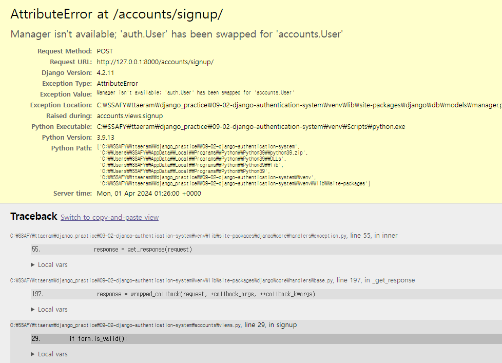
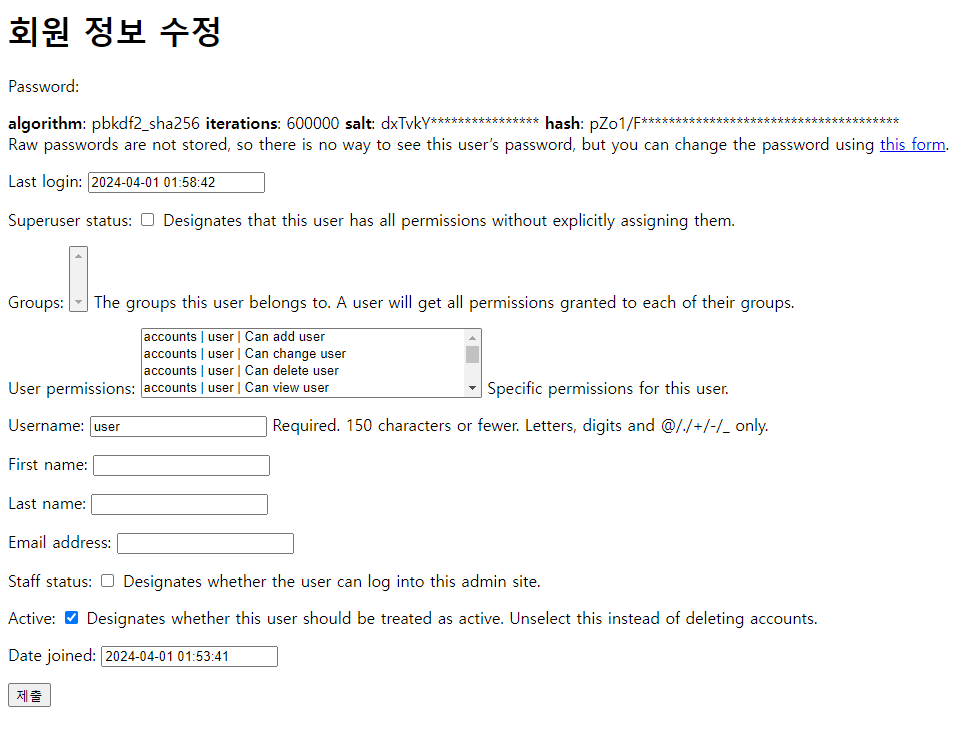
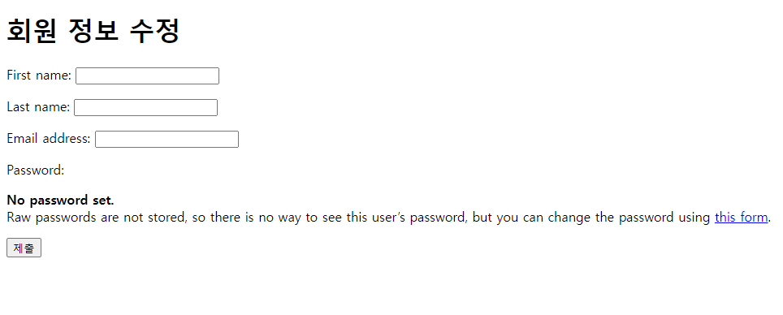
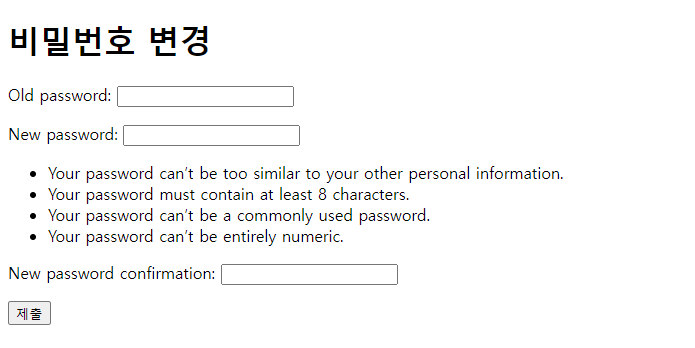

# Django
## 회원 가입
- User 객체를 Create하는 과정
- `UserCreationForm()`: 회원 가입시 사용자 입력 데이터를 받는 built-in ModelForm

### 회원 가입 페이지 작성
```python
# accounts/urls.py

from django.urls import path
from . import views

app_name = 'accounts'
urlpatterns = [
    path('login/', views.login, name='login'),
    path('logout/', views.logout, name='logout'),
    path('signup/', views.signup, name='signup'),
]
```
```html
<!-- accounts/signup.html -->

<body>
  <h1>Signup</h1>
  <form action="" method="POST">
    
    {{ form.as_p }}
    <input type="submit">
  </form>
</body>
```
```python
# accounts/views.py

def signup(request):
    if request.method == 'POST':
        pass
    else:
        form = UserCreationForm()
    context = {
        'form': form
    }
    return render(request, 'accounts/signup.html', context)
```


### 회원 가입 로직 작성
```python
# accounts/views.py

def signup(request):
    if request.method == 'POST':
        form = UserCreationForm(request.POST)
        if form.is_valid():
            form.save()
            return redirect('articles:index')
    else:
        form = UserCreationForm()
    context = {
        'form': form
    }
    return render(request, 'accounts/signup.html', context)
```

### 회원 가입 로직 에러

- 회원 가입 진행 후 에러 페이지 확인
- 회원 가입에 사용하는 `UserCreationForm`이 기존 유저 모델로 인해 작성된 클래스이기 때문
- 대체한 유저 모델로 변경 필요
```python
class Meta:
    model = User
    fields = ("username",)
    field_classes = {"username": UsernameField}
```

#### 커스텀 유저 모델로 사용하려면 다시 작성해야 하는 Form
- `UserCreationForm`, `UserChangeForm`
- 두 Form 모두 `class Meta: model = User`가 작성된 Form

### UserCreationForm과 UserChangeForm 커스텀
```python
# accounts/forms.py

from django.contrib.auth.forms import UserCreationForm, UserChangeForm
from django.contrib.auth import get_user_model

class CustomUserCreationForm(UserCreationForm):
    class Meta(UserCreationForm.Meta):
        # 현재 django 프로젝트에 활성화된 User 객체를 반환하는 함수
        model = get_user_model()

class CustomUserChangeForm(UserChangeForm):
    class Meta(UserChangeForm.Meta):
        model = get_user_model()
```

### `get_user_model()`
- 현재 프로젝트에서 활성화된 사용자 모델(active user model)을 반환하는 함수

#### User 모델을 직접 참조하지 않는 이유
- `get_user_model()`을 사용해 User 모델을 참조하면 커스텀 User 모델을 자동으로 반환해주기 때문
- Django는 필수적으로 User 클래스를 직접 참조하는 대신 `get_user_model()`을 사용해 참조해야 한다고 강조하고 있음
- User model 참조에 대한 자세한 내용은 추후 모델 관계에서 다룰 예정

### 회원 가입 로직 작성
- 커스텀 form 적용
```python
# accounts/views.py
from .forms import CustomUserCreationForm

def signup(request):
    if request.method == 'POST':
        form = CustomUserCreationForm(request.POST)
        if form.is_valid():
            form.save()
            return redirect('articles:index')
    else:
        form = CustomUserCreationForm()
    context = {
        'form': form
    }
    return render(request, 'accounts/signup.html', context)
```

## 회원 탈퇴
### 회원 탈퇴 로직 작성
```python
# accounts/urls.py

from django.urls import path
from . import views

app_name = 'accounts'
urlpatterns = [
    path('login/', views.login, name='login'),
    path('logout/', views.logout, name='logout'),
    path('signup/', views.signup, name='signup'),
    path('delete/', views.delete, name='delete'),
]
```
```html
<!-- accounts/index.html -->

<form action="" method='POST'>
    
    <input type="submit" value="회원탈퇴">
</form>
```
```python
# accounts/views.py

def delete(request):
    request.user.delete()
    return redirect('articles:index')
```

## 회원 정보 수정
- User 객체를 Update 하는 과정
- `UserChangeForm()`: 회원 정보 수정 시 사용자 입력 데이터를 받는 built-in ModelForm

### 회원 정보 수정 페이지 작성
```python
# accounts/urls.py

from django.urls import path
from . import views

app_name = 'accounts'
urlpatterns = [
    path('login/', views.login, name='login'),
    path('logout/', views.logout, name='logout'),
    path('signup/', views.signup, name='signup'),
    path('delete/', views.delete, name='delete'),
    path('update/', views.update, name='update'),
]
```
```html
<!-- accounts/update.html -->

<body>
  <h1>회원 정보 수정</h1>
  <form action="" method="POST">
    
    {{ form.as_p }}
    <input type="submit">
  </form>
</body>
```
```python
# accounts/views.py

def update(request):
    if request.method == 'POST':
        pass
    else:
        form = CustomUserChangeForm(instance=request.user)
    context = {
        'form': form
    }
    return render(request, 'accounts/update.html', context)
```


### UserChangeForm 사용 시 문제점
- User 모델의 모든 정보들(fields)까지 모두 출력되어 수정이 가능하기 때문에 일반 사용자들이 접근해서는 안되는 정보는 출력하지 않도록 해야 함
- `CustomUserChangeForm`에서 접근 가능한 필드를 다시 조정

### CustomUserChangeForm 출력 필드 재정의
- User Model의 필드 목록 확인
```python
# accounts/forms.py

class CustomUserChangeForm(UserChangeForm):
    class Meta(UserChangeForm.Meta):
        model = get_user_model()
        fields = ('first_name', 'last_name', 'email', )
```


### 회원 정보 수정 로직 작성
```python
# accounts/views.py

def update(request):
    if request.method == 'POST':
        form = CustomUserChangeForm(request.POST, instance=request.user)
        if form.is_valid():
            form.save()
            return redirect('articles:index')
    else:
        form = CustomUserChangeForm(instance=request.user)
    context = {
        'form': form
    }
    return render(request, 'accounts/update.html', context)
```

## 비밀번호 변경
- 인증된 사용자의 Session 데이터를 update하는 과정
- `PasswordChangeForm()`: 비밀번호 변경 시 사용자 입력 데이터를 받는 built-in Form

### 비밀번호 변경 페이지 작성
- django는 비밀번호 변경 페이지를 회원정보 수정 form에서 별도 주소로 안내
- `user_pk/password/`
```python
# crud/urls.py

from django.contrib import admin
from django.urls import path, include
from accounts import views


urlpatterns = [
    path('admin/', admin.site.urls),
    path('articles/', include('articles.urls')),
    path('accounts/', include('accounts.urls')),
    path('<int:user_pk>/password/', views.change_password, name='change_password'),
]
```
```html
<!-- accounts/change_password.html -->

<body>
  <h1>비밀번호 변경</h1>
  <form action="" method="POST">
    
    {{ form.as_p }}
    <input type="submit">
  </form>
</body>
```
```python
# accounts/views.py

from django.contrib.auth.forms import PasswordChangeForm

def change_password(request, user_pk):
    if request.method == 'POST':
        pass
    else:
        # PasswordChangeForm은 첫번째 인자 user가 필수
        form = PasswordChangeForm(request.user)
    context = {
        'form': form
    }
    return render(request, 'accounts/change_password.html', context)
```


### 비밀번호 변경 로직 작성
```python
# accounts/views.py

from django.contrib.auth.forms import PasswordChangeForm

def change_password(request, user_pk):
    if request.method == 'POST':
        form = PasswordChangeForm(request.user, request.POST)
        if form.is_valid():
            form.save()
            return redirect('articles:index')
    else:
        # PasswordChangeForm은 첫번째 인자 user가 필수
        form = PasswordChangeForm(request.user)
    context = {
        'form': form
    }
    return render(request, 'accounts/change_password.html', context)
```

### 세션 무효화 방지
#### 암호 변경 시 세션 무효화
- 비밀번호가 변경되면 기존 세션과의 회원 인증 정보가 일치하지 않게 되어버려 로그인 상태가 유지되지 못하고 로그아웃 처리됨
- 비밀번호가 변경되면서 기존 세션과의 회원 인증 정보가 일치하지 않기 때문

### `update_session_auth_hash(request, user)`
- 암호 변경 시 세션 무효화를 막아주는 함수
- 암호가 변경되면 새로운 password의 Session Data로 기존 session을 자동으로 갱신

### `update_session_auth_hash` 적용
```python
# accounts/views.py

from django.contrib.auth import update_session_auth_hash
from django.contrib.auth.forms import PasswordChangeForm

def change_password(request, user_pk):
    if request.method == 'POST':
        form = PasswordChangeForm(request.user, request.POST)
        if form.is_valid():
            user = form.save()
            update_session_auth_hash(request, user)
            return redirect('articles:index')
    else:
        # PasswordChangeForm은 첫번째 인자 user가 필수
        form = PasswordChangeForm(request.user)
    context = {
        'form': form
    }
    return render(request, 'accounts/change_password.html', context)
```

## 인증된 사용자에 대한 접근 제한
### 로그인 사용자에 대해 접근을 제한하는 2가지 방법
1. `is_authenticated` 속성 (attribute)
2. `login_required` 데코레이터 (decorator)

#### `is_authenticated`
- 사용자가 인증 되었는지 여부를 알 수 있는 User model 속성
- 모든 User 인스턴스에 대해 항상 True인 읽기 전용 속성이며, 비인증 사용자에 대해서는 항상 False

### `is_authenticated` 적용하기
- 로그인과 비로그인 상태에서 화면에 출력되는 링크를 다르게 설정하기
```html
<!-- articles/index.html -->

<body>
  
    <h2>반갑습니다, {{ user.username }} 님</h2>
    <form action="" method="POST">
      
      <input type="submit" value="Logout">
    </form>
    <form action="" method='POST'>
      
      <input type="submit" value="회원탈퇴">
    </form>
    <a href="">회원 정보 수정</a>
    <a href="">CREATE</a>
  
    <a href="">Login</a>
    <a href="">SIGNUP</a>
   
  <h1>Articles</h1>
  <hr>
  
    <p>글 번호: {{ article.pk }}</p>
    <a href="">
      <p>글 제목: {{ article.title }}</p>
    </a>
    <p>글 내용: {{ article.content }}</p>
    <hr>
  
</body>
```
- 인증된 사용자라면 로그인/회원가입 로직을 수행할 수 없도록 하기
```python
# accounts/views.py

def login(request):
    if request.user.is_authenticated:
        return redirect('articles:index')
    if request.method == 'POST':
        form = AuthenticationForm(request, request.POST)
        if form.is_valid():
            auth_login(request, form.get_user())
            return redirect('articles:index')
    else:
        form = AuthenticationForm()
    context = {
        'form': form,
    }
    return render(request, 'accounts/login.html', context)

def signup(request):
    if request.user.is_authenticated:
        return redirect('articles:index')
    if request.method == 'POST':
        form = CustomUserCreationForm(request.POST)
        if form.is_valid():
            form.save()
            return redirect('articles:index')
    else:
        form = CustomUserCreationForm()
    context = {
        'form': form
    }
    return render(request, 'accounts/signup.html', context)
```

### `login_required`
- 인증된 사용자에 대해서만 view 함수를 실행시키는 데코레이터
- 비인증 사용자의 경우 `/accounts/login/` 주소로 redirect 시킴

### `login_required` 적용하기
- 인증된 사용자만 게시글을 작성/수정/삭제 할 수 있도록 수정
```python
# articles/views.py

from django.contrib.auth.decorators import login_required

@login_required
def create(request):
    if request.method == 'POST':
        form = ArticleForm(request.POST)
        if form.is_valid():
            article = form.save()
            return redirect('articles:detail', article.pk)
    else:
        form = ArticleForm()
    context = {
        'form': form,
    }
    return render(request, 'articles/create.html', context)

@login_required
def delete(request, pk):
    article = Article.objects.get(pk=pk)
    article.delete()
    return redirect('articles:index')

@login_required
def update(request, pk):
    article = Article.objects.get(pk=pk)
    if request.method == 'POST':
        form = ArticleForm(request.POST, instance=article)
        if form.is_valid():
            form.save()
            return redirect('articles:detail', article.pk)
    else:
        form = ArticleForm(instance=article)
    context = {
        'form': form,
        'article': article,
    }
    return render(request, 'articles/update.html', context)
```
- 인증된 사용자만 로그아웃/탈퇴/수정/비밀번호 변경 할 수 있도록 수정
```python
# accounts/views.py

from django.contrib.auth.decorators import login_required

@login_required
def logout(request):
    auth_logout(request)
    return redirect('articles:index')

@login_required
def delete(request):
    request.user.delete()
    return redirect('articles:index')

@login_required
def update(request):
    if request.method == 'POST':
        form = CustomUserChangeForm(request.POST, instance=request.user)
        if form.is_valid():
            form.save()
            return redirect('articles:index')
    else:
        form = CustomUserChangeForm(instance=request.user)
    context = {
        'form': form
    }
    return render(request, 'accounts/update.html', context)

@login_required
def change_password(request, user_pk):
    if request.method == 'POST':
        form = PasswordChangeForm(request.user, request.POST)
        if form.is_valid():
            user = form.save()
            update_session_auth_hash(request, user)
            return redirect('articles:index')
    else:
        # PasswordChangeForm은 첫번째 인자 user가 필수
        form = PasswordChangeForm(request.user)
    context = {
        'form': form
    }
    return render(request, 'accounts/change_password.html', context)
```

### 참고
#### `is_authenticated` 속성
[공식 문서](https://github.com/django/django/blob/main/django/contrib/auth/base_user.py#L85)
```python
@property
def is_authenticated(self):
    """
    Always return True. This is a way to tell if the user has been authenticated in templates.
    """
    return True
```

#### 회원가입 후 로그인까지 이어서 진행하려면?
```python
# accounts/views.py

def signup(request):
    if request.method == 'POST':
        form = CustomUserCreationForm(request.POST)
        if for.is_valid():
            user = form.save()
            auth_login(request, user)
            return redirect('articles:index')
    else:
        form = CustomUserCreationForm()
    context = {
        'form': form,
    }
    return render(request, 'accounts/signup.html', context)
```
- `UserCreationForm`의 save 메서드
```python
def save(self, commit=True):
    user = super().save(commit=True)
    user.set_password(self.cleaned_data["password1"])
    if commit:
        user.save()
    return user
```

#### 탈퇴와 함께 기존 사용자의 Session Data 삭제 방법
- 사용자 객체 삭제 이후 로그아웃 함수 호출
- 단, **(1)탈퇴 이후 (2)로그아웃**의 순서가 바뀌면 안됨
- 먼저 로그아웃이 진행되면 해당 요청 객체 정보가 없어지기 때문에 탈퇴에 필요한 유저 정보 또한 없어지기 때문
```python
# accounts/views.py

def delete(request):
    request.user.delete()
    auth_logout(request)
```

#### `PasswordChangeForm`의 인자 순서
- `PasswordChangeForm`이 다른 Form과 달리 user 객체를 첫번째 인자로 받는 이유
- 부모 클래스인 `SetPasswordForm`의 생성자 함수 구성을 따르기 때문

#### `auth` built-in form 코드 참고
- [`UserCreationForm()`](https://github.com/django/django/blob/4.2/django/contrib/auth/forms.py#L149)
- [`UserChangeForm()`](https://github.com/django/django/blob/4.2/django/contrib/auth/forms.py#L170)
- [`PasswordChangeForm()`](https://github.com/django/django/blob/4.2/django/contrib/auth/forms.py#L422)