# Chapter 01: LLM 훑어보기
- LLM은 인공지능의 한 분야로, 대규모 데이터로 학습한 결과를 이용해서 인간의 언어를 처리하고, 생성하며, 맥락을 이해하는데 사용된다.

## 01. LLM 개념
- ChatGPT의 등장으로 인공지능, 특히 LLM의 관심이 높아지고 있다.

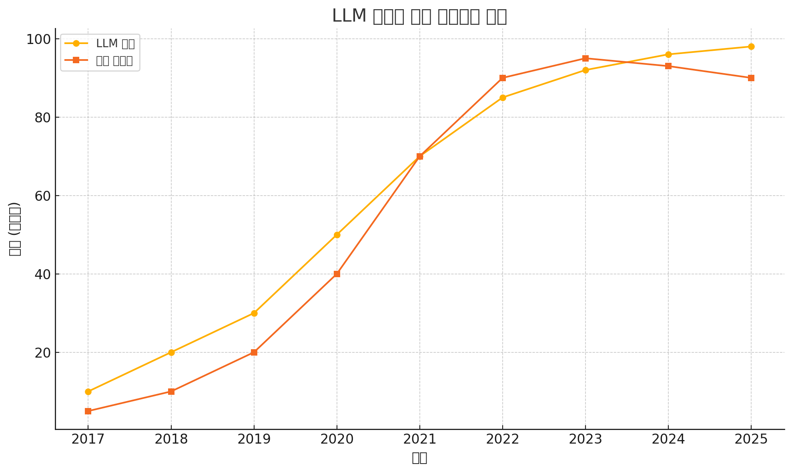

- LLM: Large Language Model의 약자로, 말 그대로 인간의 언어를 처리하는 모델

### 1-1. 언어 모델
- 언어 모델(Language Model)을 간단히 설명하면, 이제 막 글을 배우는 어린 아이에게 글을 가르치듯이 컴퓨터에게 어떻게 말을 하고 글을 쓰는지 가르치는 것과 같다.
- 컴퓨터가 인간의 언어를 이해하고 생성하는 것이 얼마나 자연스럽고 정확한지에 초점을 맞춰 발전해왔다.
- 이에는 몇가지 변곡점이라고 할 만한 단계가 있다.

#### 통계적 언어 모델
- 초기의 언어 모델은 통계적인 방법에 기반했다.
- 통계적 방법은 컴퓨터가 문장이나 단어를 얼마나 자연스럽게 표현할지를 수학적으로 계산하는 방법이다.
- ex) "나는 오늘 점심에" 라는 말을 했을 때, 컴퓨터가 이후 문장을 완성해야 하는 상황을 가정하자.
- 컴퓨터는 "피자를 먹었다." 혹은 "샐러드를 먹었다."와 같은 문장을 완성할 수 있다.
- 이는 과거에 "점심에" 뒤에 "피자"나 "샐러드"가 많이 나왔기 때문이다.
- 언어 모델에서 활용하는 확률/통계적 방법으로 'n-gram'이 있다.
- n-gram은 일련의 단어나 문자가 얼마나 자주 함께 나타나는지를 살펴보는 방법이다.
- 이 떄 'n'은 연속적으로 고려되는 단어의 수를 의미한다.
- n-gram은 몇 개의 단어로 나누는지에 따라 1-gram, 2-gram, 3-gram이라고 한다.
  - 1-gram(유니그램):
    - 전체 문장을 각각의 한 단어로 나눈다.
    - 따라서 유니그램(unigram)은 'The', 'cat', 'sat', 'on', 'the', 'mat'이 된다.
  - 2-gram(바이그램):
    - 전체 문장을 각각의 두 단어씩 나눈다.
    - 따라서 바이그램(bigram)은 'The cat', 'cat sat', 'sat on', 'on the', 'the mat'가 된다.
    - 참고로 단어가 겹쳐야 한다.
  - 3-gram(트라이그램):
    - 전체 문장을 세 단어씩 나눈다.
    - 따라서 트라이그램(trigram)은 'The cat sat', 'cat sat on', 'sat on the', 'on the mat'이 된다.
    - 트라이그램 역시 단어가 중복되어 분할된다.
  

- n-gram은 다음 단어를 예측할 때 앞의 'n-1'개 단어를 고려하기 때문이다.
- 예를 들어 바이그램을 사용하는 경우, "The cat sat on" 다음에 올 단어를 예측하려면 'sat on' 다음에 자주 등장하는 단어를 찾아볼 것이다.
- 이때 'mat'이라는 단어가 데이터베이스에서 가장 많이 등장했다면 모델은 'mat' 를 다음 단어로 예측할 것이다.
- 이렇게 n-gram 모델은 언어의 통계적 패턴을 학습해서 문장을 이해하고 새로운 문장을 만들어내는 데 도움을 준다.
- 하지만 이 방법은 가능한 모든 n-gram을 데이터베이스에 저장하고 있어야 하므로 데이터베이스를 사전에 만들어 두어야 하는 번거로운 작업이 수반된다.
- 또, 'n'이 커질수록 문맥을 제대로 이해하지 못하는 경우가 많기 때문에 언어 모델로 활용하기에는 한계가 있다.
- 그래서 등장한 것이 신경망을 이용한 언어 모델이다.

#### 신경망 언어 모델
- 머신러닝의 발전과 함께 신경망을 기반으로 하는 언어 모델이 등장했다.
- 인간의 뇌에 있는 신경세포 (뉴런)가 서로 연결되어 정보를 처리하는 방식을 본 따서 만들어진 신경망은 데이터에서 복잡한 패턴을 학습해 문제를 해결하는 데 활용된다.
- 신경망은 일반적으로 입력층(Input layer), 하나 이상의 은닉층(Hidden layer), 출력층(Output layer)로 구성된다.
- 각 계층에는 여러 노드가 있으며, 이들은 서로 연결되어 있다.
- 입력층에서 외부로부터 데이터를 받아들이고, 은닉층에서 데이터를 처리하여 다양한 특성과 패턴을 학습한다.
- 마지막으로 출력층에서 최종 결과를 생성한다.

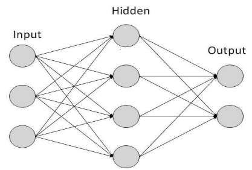

- 대표적인 신경망 언어 모델에는 다음과 같은 것들이 있다.

#### (1) RNN(Recurrent Neural Networks)
- 시퀀스 데이터 처리에 적합하며 과거의 정보가 현재의 결정에 영향을 미친다.
- RNN을 이용하면 번역은 물론 주식 가격, 날씨 변화 등 시간에 따라 변화하는 데이터를 분석하여 미래를 예측할 수 있다.
- 과거의 데이터를 저장하는 공간이 작기 때문에 매우 긴 데이터를 처리하기에는 한계가 있다.

#### (2) LSTM(Long Short-Term Memory Networks)
- RNN의 경우 긴 시퀀스 데이터 처리에 한계가 있다고 했는데, 그 한계를 극복하기 위해 고안된 모델이 LSTM이다.
- LSTM은  긴 시퀀스 정보를 기억하고 필요에 따라 이를 삭제하거나 업데이트할 수 있는 메커니즘을 가진다.

---
- 다음 그림의 RNN은 과거의 정보를 기억하기 위해 메모리라는 것을 가지고 있다.
- 하지만 메모리는 정보를 저장하기 위한 공간에 제약이 있기 때문에 긴 문장을 모두 저장해둘 수 없다.
- 이런 한계를 극복하기 위해 LSTM은 장기 기억을 위한 메모리를 하나 더 두었다.

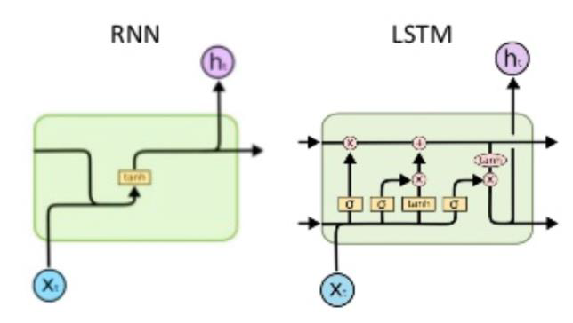

#### 트랜스포머
- 이전의 언어 모델은 각 단어를 개별적으로 이해하고 처리하는 데 중점을 두었다면 트랜스포머(Transformer)는 문장과 단락 전체를 처리할 수 있었다.
- 트랜스포머를 통해 LLM은 자연어에서 인간의 의도를 심층적이고 맥락에 맞게 이해할 수 있게 되었으며, 이를 통해 콘텐츠 생성, 문장 요약 등 활용 범위가 넓어졌다.
- 트랜스포머를 이용한 대표적인 모델에는 다음과 같은 것들이 있다.

#### (1) 버트(Bidirectional Encode Representations from Transformers, BERT)
- 텍스트를 양방향으로 분석하여 맥락을 이애하는 언어 모델이다.
- 이때 양방향으로 텍스트를 분석한다는 것은 언어 모델이 단어의 앞뒤 문맥을 모두 고려하여 그 단어의 의미를 이해하는 것을 의미한다.
- 지금까지의 언어 모델은 주로 한방향으로만 문맥을 이해하고 다음 단어를 예측했다.
- 그러나 인간의 언어는 전체 문장의 맥락을 통해 이뤄지므로 양방향으로 문맥을 이해하면 좀 더 자연스럽고 정확한 의미를 파악할 수 있다.

#### (2) GPT(Generative Pretrained Transformer)
- GPT는 오픈 AI에 의해 개발된 인간의 자연러를 처리하는 강력한 인공지능 언어 모델이다.
- 현재 GPT 모델은 다른 언어 모델에 비해 자연스러운 텍스트 생성 및 높은 수준의 대화로 각광받고 있다.

### 1-2. 거대 언어 모델
- 거대 언어 모델(Large Language Model)은 대규모 데이터로 훈련된 매우 큰 규모의 인공지능 기반 언어 모델이다.
- 대규모 데이터란? GPT-3 모델 학습에 45TB의 텍스트 데이터를 이용하여 학습했다고 한다.
- 많은 양의 데이터 뿐만 아니라 모델의 크기도 커야 한다.
- 거대 언어 모델의 크기는 주로 모델이 가지고 있는 파라미터의 수로 측정된다.
- GPT-3는 약 1,750억 개의 파라미터를 가지고 있다고 한다.
- 모델이 진화할 수록 파라미터 수가 기하급수적으로 증가했고, 이는 모델의 이해력과 텍스트 생성 능력이 크게 향상되었다는 의미기고 하다.

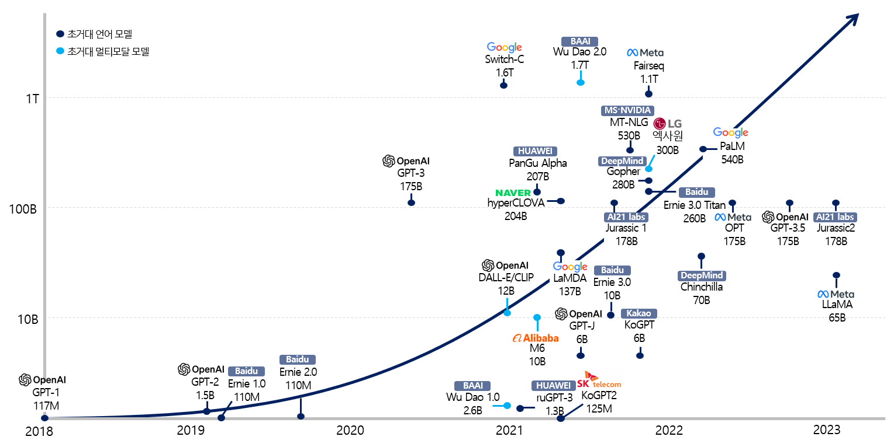

## 02. LLM 특징과 종류
### 2-1. LLM의 특징
1. LLM은 인터넷의 텍스트, 책, 논문, 기사 등 다양하고 방대한 양의 텍스트 데이터로부터 학습된다.
2. 언어를 이해하고 생성하는데 특화되어 있다.
- 언어 모델은 텍스트를 읽고 이해하는 것 뿐만 아니라 자연스러운 언어로 질문에 답변하고, 글을 작성하고, 대화를 나누는 등의 생성적 작업도 수행할 수 있다.
3. 특정 작업을 위해 파인튜닝할 수 있다.
- 파인튜닝이란 챗GPT와 같은 언어 모델을 나의 데이터로 추가 학습 시키는 과정으로, 이를 통해 특화된 분야에 더운 정교하게 사용될 수 있다.

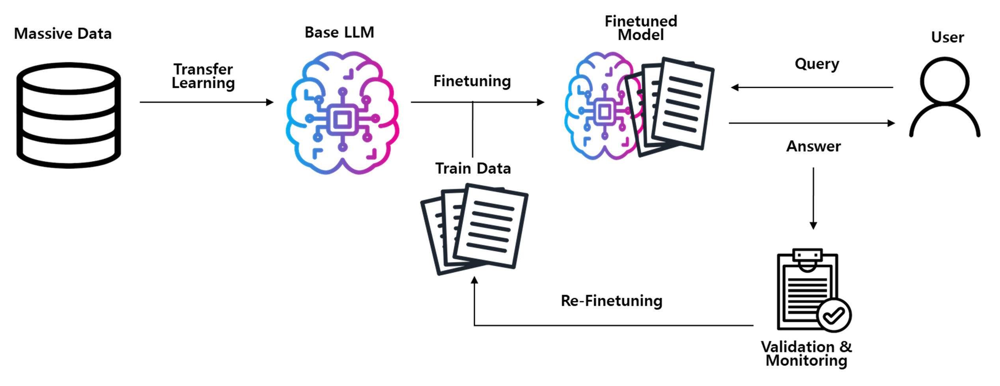

4. LLM을 훈련하고 운영하는 데는 상당한 컴퓨팅 자원이 필요하다.
- 컴퓨팅 자원이란, GPU나 TPU 같은 하드웨어를 말한다.
- GPU는 그래픽 처리를 위한 장치였으나, 최근 인공지능 관련해서는 대규모 데이터 학습과 복잡한 수학적 연산을 빠르게 처리하기 위한 용도로 사용된다.
- TPU는 구글이 개발한 머신러닝 및 딥러닝 작업에 최적화된 하드웨어이다.

- LLM의 대표적인 예로는 오픈AI의 GPT-3.5, Turbo, GPT-4, 구글의 비트, 제미나이 등이 있다.

### 2-2. LLM의 종류
- LLM 관련해서 다음과 같은 생태계가 구축되어 있다.
- '내가 잘하는 것에만 집중'하되 시장의 흐름에는 편승하고자 하는 기업이 많다.

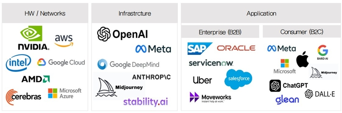

- LLM 생태계는 인프라스트럭쳐 레이어(Infrastructure Layer)와 애플리케이션 레이어(Application Layer)로 구분할 수 있다.
- 애플리케이션 레이어: 코드로 구현할 수 있는 프레임워크와 서비스로 활용할 수 있는 BI 툴 제공 회사들이 있다.
- 인프라스트럭쳐 레이어: 하드웨어 회사와 모델을 제공하는 오픈AI, 허깅페이스 등이 있다.
- 이들이 제공하는 모델을 빠르고 쉽게 구현하기 위한 클라우드 서비스를 제공하는 구글, 마이크로소프트 같은 기업이 있다.

- LLM의 변천 모델들을 나열해보면 아래와 같다.

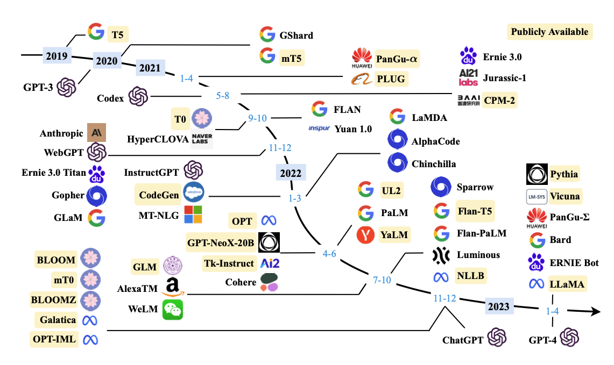

### 2-3. LLM과 GAI, SLM
- LLM의 유사한 단어가 실제로 유사한 의미를 갖는지 본다.

#### LLM vs GAI
- LLM과 같이 자주 언급되는 단어는 생성형 AI(Generative AI)이다.
- LLM은 거대 언어 모델로써, 대용량의 텍스트 데이터를 학습함으로 인간의 자연어를 이해하고 생성하는 작업에 능숙하다.
- 정리하자면, LLM은 텍스트를 기반으로 질문에 답하거나, 글을 작성하고, 대화를 진행하는 등 다양한 언어 관련 작업을 하는데 사용된다.
- 반면, GAI는 입력 데이터를 기반으로 새로운 콘텐츠를 생성하는 인공지능이다.
- 여기에는 텍스트, 이미지, 음악, 비디오 등 다양한 형태의 콘텐츠를 생성할 수 있는 모델들이 포함된다.
- LLM보다는 GAI가 더 큰 범위의 인공지능이라고 할 수 있다.

- 모든 GAI가 LLM을 기반으로 만들어진 것은 아니지만, 모든 LLM은 GAI의 한 형태이다.
- GAI는 데이터를 학습하여 텍스트, 이미지, 음악, 비디오 등 다양한 형태의 콘텐츠를 생성하는 인공지능의 한 분야이다.
- LLM은 텍스트를 전용으로 출력한다.
- 물론 이전 버전의 LLM은 입력도 텍스트만 가능했지만 이제 음성, 이미지 등을 입력으로 받아들일 수 있게 되었다.

|구분|GAI|LLM|
|:---:|:---:|:---:|
|콘텐츠 생성 범위|텍스트, 이미지, 음성 코드 등 다양|텍스트에 국한|
|학습|대규모 데이터에 의존하면서도 이미지, 오디오 등 다양한 데이터 유형을 학습|인터넷, 서적 및 기타 광범위한 텍스트 학습|
|출력|음악에서 시각적 예술 작품에 이르기까지 광범위한 출력을 생성|사용자의 질문에 일관되고 상황에 맞게 텍스트를 생성|
|신경망(혹은 모델)|이미지 생성을 위한 GAN(Generative Adversarial Networks) 또는 음악과 같은 순차적 데이터를 위한 RNN(Recurrent Neural Networks)을 포함한 다양한 신경망 사용|텍스트와 같은 순차 데이터에 매우 효과적인 RNN, 트랜스포머 사용|
|활용 분야|하나의 분야(혹은 산업)에 국한되지 않고 여러 창의적 분야에 사용 가능|언어 관련 작업에 특화|

- LLM에서는 질문과 답변을 특별한 용어로 부른다.
- 질문은 프롬프트(Prompt), 답변은 컴플리션(Complition)이라고 부른다.
- 프롬프트는 거대 언어 모델에 정보를 요청하거나 특정 작업을 수행하도록 지시하는 텍스트 메시지이다.
- 프롬프트는 질문, 명령, 또는 토론 주제 등 다양한 형태로 나타날 수 있으며, 모델은 이를 바탕으로 답변을 생성한다.

#### LLM vs SLM
- SLM은 LLM보다 휠씬 제한적인 용도에 적합하다.
- 학습으로 사용된 데이터도 훨씬 적다.
- LLM과 SLM의 차이는 주로 모델의 크기, 학습 데이터의 양, 처리 능력, 사용 사예에 있다.
- LLM은 수십 억에서 수조 개의 파라미터를 갖는 반면, SLM은 상대적으로 적은 수의 파라미터를 가진다.
- 또 하나 두드러지는 차이는, LLM은 다양한 언어 작업에 사용될 수 있다는 점이다.
- 인간의 언어인 자연어의 이해, 텍스트 생성, 번역, 요약 등 복잡한 작업을 수행할 수 있다.
- SLM은 더 단순하거나 특정 분야에 특화된 언어 작업에 적합하다.
- 과거의 기후 데이터를 분석하여 미해의 날씨를 예측하는 것과 같이 특화된 서비스에 사용될 수 있다.

|구분|SLM|LLM|
|:---:|:---:|:---:|
|모델 크기|파라미터가 1,500만 개 미만|수천억 개의 파라미터|
|컴퓨팅|모바일 디바이스에서도 동작|수백 개의 GPU 필요|
|성능|단순 작업만 동작|복잡한 작업 처리가 가능|
|배포|배포가 쉬움|배포를 위해 상당한 인프라가 필요 (그래서 대체적으로 클라우드를 사용)|
|학습|일주일 정도면 학습 가능|몇 달 간의 학습이 필요|

## 03. LLM 생성 과정
- LLM은 어떻게 만드는 것인가?
- LLM의 생성 과정은 복잡하며 여러 단계를 거쳐 진행된다.
- 대량의 데이터 수집과 처리, 모델 설계와 학습, 최종 모델의 테스트 및 배포가 필요하다.

  1. 데이터 수집 및 준비
  2. 모델 설계
  3. 모델 학습
  4. 평가 및 검증
  5. 배포 및 유지 보수

- 각 단계별로 하나씩 살펴보자.

### 3-1. 데이터 수집 및 준비
- 언어 모델을 학습시키기 위한 첫 단계는 데이터를 수집하고 준비하는 것이다.
- 모델이 학습할 수 있는 형태로 데이터를 수집하고 가공하는 일련의 작업이 이루어지는 단계이다.

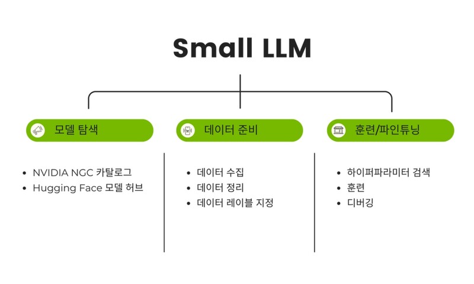

#### 데이터 수집
- 모델이 언어를 이해하고 생성하는 방식을 학습하려면 양도 많고, 종류도 다양한 텍스트 데이터가 필요하다.
- 따라서 데이터 수집 과정은 다음과 같은 단계가 포함된다.

  - 데이터 식별: 언어 모델이 다양한 언어 패턴을 학습할 수 있도록 다양한 주제와 장르, 스타일이 포함되어야 한다.
  - 데이터 수집: 수집해야 할 데이터가 식별되었다면, 이제 실제로 데이터를 수집해야 한다.
    - 데이터는 HTML 페이지, PDF 문서, 텍스트 파일, 데이터베이스 등 다양한 형식으로 존재할 수 있다.
    - 또한 데이터를 수집할 때에는 저작권, 개인정보 보호 등 법적인 문제를 고려해서 수집해야 한다.

#### 데이터 정제
- 데이터 정제는 데이터의 품질을 결정하는 핵심적인 과정이다.
- 데이터 품질이 높아야 LLM이 정확하게 학습할 수 있고, 내놓은 출력 결과를 신뢰할 수 있다.
- 잘못된 데이터로 학습된 모델은 부정확한 예측을 하거나 잘못된 결론을 내릴 위험이 있다.
- 데이터 정제에는 아래와 같은 과정이 포함된다.

  - 중복 제거: 수집된 데이터 중 중복되는 내용을 제거한다.
  - 노이즈 제거: 노이즈는 모델 개발에서 원치 않는 무작위적이고 관련 없는 정보를 말한다.
    - 노이즈를 제거한다는 의미는 오타, 잘못된 문장 부호, 비정상적인 문자 등을 정리하는 과정을 의미한다.

#### 데이터 전처리
- 데이터 전처리는 데이터를 LLM 학습에 적합한 형태로 만드는 과정이다.
- 특히 언어 모델과 같은 자연어 처리 작업은 텍스트 데이터를 다루기 때문에 전처리 과정이 모델 성능에 매우 중요하다.
- 이를 위해 아래와 같은 과정이 필요하다.

  - 토큰화(Tokenization): 토큰화는 텍스트를 작은 단위로 나누는 과정이다.
    - 예를 들어 "Hello, how are you?" 라는 문장을 토큰화 하면 아래와 같이 분리할 수 있다.
    - 'Hello'
    - ','
    - 'how'
    - 'are'
    - 'you'
    - '?'
    - 각 단어와 구두점이 개별 토큰으로 분리되었다.
    - 자연어 처리에서는 이런 토큰들을 사용하여 텍스트의 구조를 이해한다.
  - 정규화: 대소문자 통일, 어간 추출(stemming) 등을 통해 단어의 기본 형태로 변환한다.
    - 예를 들어 'run', 'runs', 'running'과 같은 단어를 기본 형태인 'run'으로 통일하는 과정을 의미한다.

#### 데이터 형식 변경
- 데이터의 형식을 일치시키는 과정이다.
- 예를 들어 모든 날짜를 "YYYY-MM-DD" 형식으로 바꾸는 것이다.

### 3-2. 모델 설계
- LLM에서 모델 설계는 매우 큰 신경망 아키텍쳐를 구축하는 것을 의미한다.
- 가장 먼저 어떤 모델로 학습할지 결정해야 하는데 LLM은 주로 트랜스포머 모델을 기반으로 한다.
- 또한 계층 수, 학습률, 배치 크기 등과 같은 모델의 학습 과정을 조절할 하이퍼파라미터를 설정한다.
- 하이퍼파라미터는  학습 과정을 제어하는 데 사용하는 설정 값이다.
- 자동차의 속도를 조절하는 것처럼, 학습 과정에서 하이퍼 파라미터를 조절하여 모델이 데이터를 얼마나 빨리, 얼마나 오래, 어떤 방식으로 학습할지 결정한다.

### 3-3. 모델 학습
- 설정된 하이퍼파라미터와 모델 아키텍쳐를 사용해 학습을 한다.
- 즉, 모델 학습은 모델이 데이터로부터 패턴을 학습하고, 이를 내부적으로 모델링하여 텍스트를 생성하거나 번역하는 등의 작업을 수행할 수 있도록 하는 과정이다.
- 모델링: 모델이 데이터로부터 중요한 특징이나 관계를 학습하고, 이를 수학적 구조로 표현하는 과정

### 3-4. 평가 및 검증
- 모델 평가 및 검증은 모델이 얼마나 잘 작동하는지를 평가하고 이것을 실제로 서비스했을 때 어느 정도의 성능을 낼 수 있는지를 확인하는 과정이다.
- 모델을 평가하기 위해 수집된 데이터를 다음과 같이 훈련, 검증, 테스트 용도로 나눠야 한다.

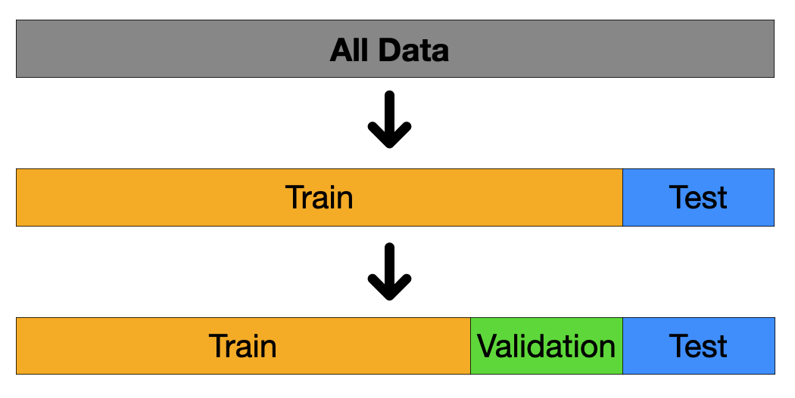

- 훈련 데이터: 모델을 훈련시킬 때 사용하고, 검증과 테스트는 모델의 성능을 평가하기 위한 용도로 사용한다.
- 검증 데이터: 모델의 하이퍼파라미터를 조정하고 모델의 성능을 중간 평가하는 데 사용한다.
- 테스트 데이터: 모델의 최종 성능을 평가하는 데 사용한다.
- 모델 평가 지표:
  - 정확도 (accuracy): 모델이 얼마나 많은 예측을 정확히 했는지 측정한다.
    - 이것은 전체적인 성능을 평가할 때 사용한다.
  - 정밀도 (precision): 양성으로 예측된 사례 중 실제 양성이인 사례의 비율이다.
  - 재현율 (reall): 실제 양성 사례 중 모델이 양성으로 예측한 사례의 비율이다.
    - 놓치는 것에 더 민감한 경우 사용한다.
  - F1 점수 (F1 score): 정밀도와 재현율의 조화 평균을 나타내는 지표
  - ROC 곡선 및 AUC: 모델의 성능을 다양한 임계값에서 평가한다.

### 3-5. 배포 및 유지보수
- 모델 배포와 유지보수는 LLM의 마지막 단계이다.
- 여기서 모델을 배포한다는 의미는 서비스를 사용자가 이용하는 것이다.
- 서비스에 문제가 있으면 수정하는 작업이 유지보수에 해당된다.

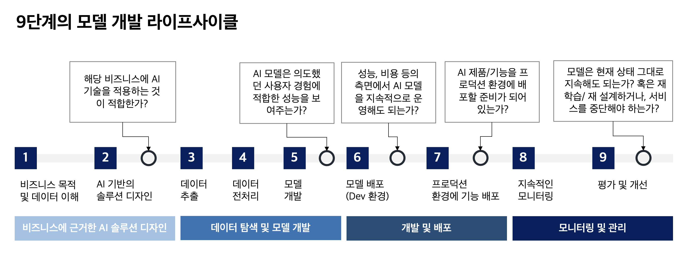

## 04. LLM 생성 후 추가 고려 사항
### 4-1. 윤리적 고려 및 보정
- LLM의 윤리적 고려와 보정은 모델이 생성한 결과의 공정성, 편향성, 투명성을 다루는 매우 중요한 과정이다.
- 이 과정은 모델이 다양한 사용자와 상황에 미치는 잠재적인 영향을 신중하게 평가하고, 부정적인 결과를 최소화하기 위해 필요하다.
- 책임감 있는 AI (Responsible AI): 인공지능을 설계, 개발, 배포할 때 윤리적, 법적, 사회적 책임을 고려하는 접근 방식
- 이 개념은 AI가 인류에 긍정적인 영향을 미치고 부정적인 결과를 최소화하는 데 중점을 두고 있다.

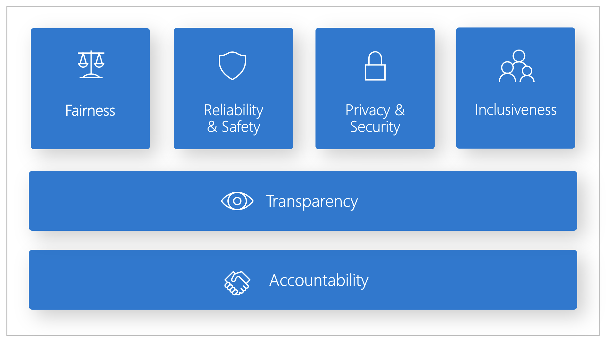

- 공정성 (fairness): AI는 성별, 인종, 나이 등에 따른 편향 없이 모든 사용자에게 공정하게 서비스를 제공해야 한다.
- 신뢰성 (reliability) & 안전성 (safety): AI는 사용자에게 안전하며 예측 가능한 위험을 관리하고 예방해야 한다.
- 프라이버시 (privacy): AI는 사용자의 개인정보를 보호하고 데이터 보안을 유지해야 한다.
- 포용성 (inclusion) & 다양성 (diversity): 모든 사람이 차별 없이 참여하고 혜택을 받을 수 있도록 환경을 조성해야 한다.
- 윤리적 사용 (ethical use): AI는 사회적, 도덕적 기준에 부합하는 방식으로 사용되어야 하며 인간의 존엄성을 존중해야 한다.
- 투명성 (transparency): AI의 의사 결정 과정이 명확하고 이해 가능해야 하며, 사용자는 AI의 작동 방식과 결정 기준을 알 권리가 있다.
- 책임성 (accountability): AI는 결정에 대한 책임을 명확히 하여 문제 발생 시 적절한 해결책을 제시할 수 있어야 한다.

### 4-2. 지속적 모니터링
- LLM은 강력한 언어 모델로서 악의적으로 사용하고자 한다며 얼마든지 그렇게 사용할 수 있다.
- 이런 경우, 기업은 이미지가 실추되는 것은 물론 법적인 책임도 감수해야 한다.
- 지속적 감시는 두가지 방법이 있는데, 이 둘을 함께 사용하는 것이 좋다.
  - AI가 스스로 악의적 문구를 탐지
  - 사람이 질문과 답변을 지속적으로 점검
