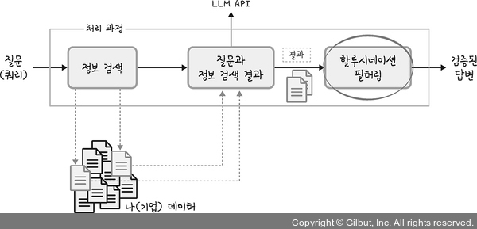

# Chapter 02: LLM 활용하기
## 01. LLM 활용 방법
- LLM을 활용하는 방법은 크게 파인튜닝과 RAG를 생각할 수 있다.

### 1-1. 파인튜닝
- 파인튜닝(Fine-Tuning): 기존의 LLM을 특정한 작업이나 상황에 맞게 조금 더 훈련시키는 과정
- 쉽게 말해 이미 많은 것을 배운 LLM을 특별한 상황에 더 잘 맞게 ‘가르치는’ 것과 같다.
- 예를 들어 언어를 처리하는 LLM이 이미 많은 책과 글을 읽어서 여러 가지 언어를 이해하는 법을 배웠다고 가정해보자.
- 이제 이 모델을 의학 분야에서 전문적으로 사용하고 싶다면 의학 관련 문서를 추가로 학습시키는데, 이러한 과정을 ‘파인튜닝’이라고 한다.
- 이렇게 하면 이미 배운 기본 지식을 유지하면서 특정 분야에 더 정확하고 효과적으로 대응할 수 있게 된다.


- 이와 같이 한 분야에서 배운 지식을 다른 분야의 문제 해결에 사용하는 방법을 전이 학습(Transfer Learning)이라고도 한다.
- 다음과 같이 이전 모델에서 학습한 내용이 그대로 다른 작업에도 적용될 수 있도록 정보가 전이되는 형태이다.


- 정리하면 전이 학습은 이미 학습된 모델을 새로운 작업에 적용하는 것으로 파인튜닝보다는 좀 더 포괄적인 의미를 갖는다.
- 반면 파인튜닝은 전이 학습의 한 형태로 모델을 특정 분야나 작업에 최적화시키기 위해 추가적인 학습을 시키는 과정을 지칭한다.
- 그러니 파인튜닝은 전이 학습의 일부로 이해할 수 있다.


#### 파인튜닝을 선호하지 않는 이유
1. 이미 만들어진 LLM에 추가 학습만 진행하면 된다고 하지만 어느 정도의 데이터로 어느 정도의 훈련을 시켜야 기대하는 성능(정확도)을 얻을 수 있을지 누구도 확신할 수 없다.
  - 예를 들어 어느 누구도 ‘1TB의 데이터로 학습을 시키면 기대하는 성능이 나온다’라고 말할 수 없는 것이다.
2. 학습을 위해 과도한 비용이 발생한다.
  - LLM은 말 그대로 거대 언어 모델이기 때문에 여기에 추가 학습을 시키기 위해서는 LLM을 만드는 회사뿐만 아니라, 이것을 파인튜닝하겠다는 회사 역시 GPU가 필요하다.
  - 하지만 이 훈련만을 위해 GPU를 구매할 수 없으니, 클라우드 자원을 활용해야하지만, 그 비용이 과도하게 높다.
3. 데이터 준비가 어렵다.
  - 파인튜닝을 위해서는 데이터를 ‘질문-답변’ 세트 형식으로 준비해야 하는데, 기존에 보유된 데이터가 이런 형식으로 정리되어 있지 않은 경우가 대부분이다.
  - 따라서 파인튜닝을 하고자 할 때에는 누군가가 데이터를 ‘질문-답변’ 세트로 변경해야 한다.
  - 예를 들어 보험 심사 데이터를 ‘질문-답변’ 세트로 구분을 한다고 가정했을 때, 질문에 대한 답변을 검증할 수 있는 사람은 심사를 담당하는 사람들이다.
  - 즉, 질문에 대한 답변 검증은 그 업무를 해본 사람만이 알 수 있다.
  - 그러니 이런 데이터를 준비하기 위해서는 IT 인력뿐만 아니라 해당 업무의 전문가도 필요하다.

### 1-2. RAG
- RAG(Retrieval-Augmented Generation)는 자연어 처리 분야에서 사용되는 기술로, 정보 검색과 생성을 결합한 인공지능 모델이다.
- RAG는 특히 복잡하고 정보가 필요한 질문에 답변하기 위해 설계되었다.
- RAG는 크게 두 단계로 구성된다.
- 정보 검색(retrieval) 단계와 텍스트 생성(generation) 단계이다.
- 이러한 결합은 모델이 질문에 대해 보다 정확하고 관련성 높은 답변을 생성할 수 있도록 한다.

#### 정보 검색 단계
1. 질문: 사용자로부터 질문이 입력된다.
2. 쿼리(문서 검색): 모델은 대규모의 문서 데이터베이스나 콘텐츠 저장소에서 질문과 관련된 문서나 정보를 검색한다.
3. 정보 검색 결과: 검색 결과 중에서 가장 관련성 높은 문서와 사용자의 질문을 결합하여 LLM에 전달한다.

#### 텍스트 생성 단계
4. 정보 전달: 선택된 문서의 내용이 모델에 전달된다.
  - 정확히는 사용자의 질문과 정보 검색 결과가 전달된다.
  - 이 단계에서 모델은 문서의 정보를 활용하여 질문에 대한 의미를 이해한다.
5. 텍스트 생성: 모델은 이제 전달받은 정보를 바탕으로 질문에 대한 답변을 생성한다.
  - 이 과정은 LLM에 의해 처리되며, 문서에서 얻은 지식과 모델이 이미 학습한 정보를 결합하여 답변을 만든다.
  - 이후 생성된 답변을 사용자에게 제공한다.


### 1-3. 퓨샷 러닝
- 퓨샷 러닝(Few Shot Learning)은 매우 적은 양의 데이터로 학습하는 능력을 가리킨다.
- 여기서 중요한 것은 모델이 기존에 학습한 지식을 바탕으로 매우 제한된 예시로부터 새로운 작업에 빠르게 적응하는 것이다.
- 퓨샷 러닝과 함께 나오는 단어로 제로샷 러닝(Zero Shot Learning), 원샷 러닝(One Shot Learning)이 있는데, 데이터의 양에 따라 제로샷, 원샷, 퓨샷으로 나뉜다.
- 다음과 같이 모델이 학습 과정에서 결코 보지 못한 데이터에 대해 예측을 수행할 수 있는 것을 제로샷 러닝이라고 한다.
- 이것이 가능하려면 거대 언어 모델과 같이 학습한 데이터가 꽤 방대하면서도 모델이 높은 수준의 추상적 사고와 일반화 능력을 갖춰야 합니다.


- 반면에 얼룩말 이미지 한 개만 학습했을 뿐인데도, 얼룩말을 잘 분류할 수 있는 것을 원샷 러닝이라고 한다.
- 이 방법은 특히 데이터가 매우 제한적인 상황에서 유용하다.


- 마지막으로 얼룩말 이미지 여러 개를 학습한 이후 모델이 얼룩말을 잘 분류하는 것을 퓨샷 러닝이라고 한다.


- 이와 같이 원샷 러닝이나 퓨샷 러닝은 특정 작업이나 분야에서 충분한 양의 학습 데이터를 확보하기 어려울 때 유용하다.
- 예를 들어 특정한 의료 이미지나 희귀 언어 데이터의 경우 충분한 학습 자료를 얻기 어려울 수 있다.
- 이때 원샷/퓨샷 러닝을 사용하면 효과적인 작업을 처리할 수 있다.
- 하지만 잘 생각해보면 ‘이 방법들이 얼룩말을 잘 분류할 수 있을까?’라는 의심이 생길 수 있다.
- 실제로 적은 수의 예제에서 학습된 모델은 종종 새롭고 다양한 데이터를 일반화하는 데 어려움을 겪을 수 있으므로 서비스로 활용할 때는 유의해야 합니다.

## 02. LLM 활용 시 주의 사항
- LLM이 강력한 언어 모델이다 보니 보안 및 규제 측면에서 제약이 많다.
- 또한 누군가에 의해 악의적으로 사용된다면 사회적 이슈가 제기될 수도 있다.
- 따라서 다음과 같은 사항을 고려하여 LLM을 사용하기를 권장한다.

### 2-1. 정보 필터링
- LLM을 이용하는 사용자의 질문은 반드시 필터링을 해야 한다.
- 기업 내부 직원들이 사용할 경우는 덜하겠지만 일반인을 상대로 서비스하는 경우, 어떤 내용이 입력될지 알 수 없다.
- 따라서 이러한 경우 반드시 입력 및 출력 텍스트를 필터링해야 한다.
- 특히 개인정보가 입력되지 않도록 필터링하는 것이 중요하다.


### 2-2. 법적인 규제
- 특히 공공기관 및 금융산업에 해당한다.
- 이런 기관들은 산업 특성상 국가에서 규정하는 법규 및 권고 사항을 지켜야 한다.
- 따라서 정부가 정의해놓은 규제가 어떤 것들이 있는지 사전에 확인하는 것이 필요하다.
- 그뿐만 아니라 기업의 보안팀에서도 정의한 규정들도 있다.
- 이것들도 잘 확인해서 준수할 수 있도록 아키텍처 디자인 단계부터 신경 써야 헌다.

### 2-3. 할루시네이션
- 할루시네이션(hallucination)은 AI 모델, 특히 언어 모델이 부정확하거나 관련 없는 정보를 생성하는 현상을 가리킨다.
- 오픈AI의 경우, 세종대왕 시기에 맥북이 등장하거나 ‘환단고기’에 대해 질문했을 때 엉뚱한 답변을 하여 이슈가 되기도 했다.


- 이와 같이 LLM이 생성한 답변의 부정확한 할루시네이션 현상을 최소화해야 한다.
- 할루시네이션은 정보 검색 결과만 정확하다면 어느 정도 해결할 수 있다.
- 또한 LLM이 정확한 답변만 할 수 있도록 temperature라는 파라미터를 0으로 설정해준다.
- 다음 코드에서 temperature가 어떻게 사용되는지만 확인한다.
```py
import openai
openai.api_key = ("sk-")  #openai 키 입력
COMPLETIONS_MODEL = "gpt-3.5-turbo"

prompt = "한국의 야구팀 3개만 알려줘?"
openai.Completion.create(
    prompt=prompt,
    temperature=0,
    max_tokens=300,
    top_p=1,
    frequency_penalty=0,
    presence_penalty=0,
    model=COMPLETIONS_MODEL
)["choices"][0]["text"].strip(" \n")
```
- 또한 다음 그림과 같이 LLM 구현 과정 중 마지막에 할루시네이션 필터링을 추가함으로써 할루시네이션을 방지할 수 있다.



### 2-4. 보안
- LLM 모델의 경우, 모든 사용자가 모델을 공유해서 사용하다 보니 ‘내가 입력한 데이터가 학습에 활용되지 않을까?’ 혹은 ‘내 데이터가 LLM까지 넘어가면서 보안에 문제는 없을까?’라는 의문을 가질 수 있다.


- 보안(특히 네트워크 측면의 보안)을 강화하기 위해서는 마이크로소프트 애저(Azure) 오픈AI를 사용하는(정확히는 프라이빗 엔드포인트(private endpoint)) 방법도 고려해볼 수 있다.
- 애저에서는 오픈AI가 PaaS1 형태로 서비스되기 때문에 SLA2뿐만 아니라 보안을 강화할 수 있는 방법들이 많이 추가되어 있다.

## 03. LLM의 한계
- LLM이 우리의 삶에 큰 변화를 가져온, 혁신적인 서비스인 것은 부정할 수 없다.
- 하지만 LLM은 이제 막 시작하는 단계이다.
- 챗GPT에 대한 관심이 뜨겁다 보니 기술 성숙도가 높아 보이지만 LLM의 기술 발전은 이제 막 시작하는 단계로 봐도 좋을 듯하다.


### 3-1. 편향과 공정성
- 만약 LLM이 주로 남성 엔지니어의 데이터를 학습했다면, ‘엔지니어’라는 단어에 대해 남성 이미지를 더 자주 연상시키는 문장을 생성할 수 있다.
- 예를 들어 엔지니어가 포함된 질문을 한다면 남성에 더 우호적인 텍스트를 생성할 가능성이 높다.
- 실제로 아마존은 직원 채용 시 ‘AI 면접’ 과정이 있었지만 남성에 더 우호적으로 채점하는 것으로 밝혀지면서 AI 면접을 폐지했다고 한다.

### 3-2. 투명성
- LLM이 어떤 질문에 대해 특정 대답을 하는 경우 왜 그런 대답을 했는지 그 이유를 사용자에게 설명하는 능력이 부족할 수 있다.
- 분명 학습한 데이터를 기반으로 답변을 한 것은 맞지만 그렇다고 LLM이 학습한 데이터를 그대로 사용자에게 보여주는 것은 아니다.
- LLM 자체적으로 어느 정도 가공을 하는데 그 가공 과정을 인간은 이해할 수 없다.
- 예를 들어 자율 주행 자동차는 복잡한 딥러닝 알고리즘을 사용하여 주변 환경을 인식하고 결정을 내린다.
- 이때 결정이란 언제 브레이크를 밟을지, 언제 우회전할지 등등 결정하는 것을 의미한다.
- 그러나 이러한 결정 과정은 종종 우리 인간이 이해할 수 없는 경우가 많은데, 이러한 문제로 차량이 특정 상황에서 어떻게 행동할지 예측하기 어렵다는 점이 있다.


### 3-3. 데이터 의존성
- LLM은 특정 언어, 특정 분야(예: 문학)에 한정되어서 데이터를 학습하지 않는다.
- 그렇기 때문에 지금과 같이 다양한 질문에도 답변할 수 있는 것이다.
- 하지만 모델이 특정 국가의 소설로만 학습을 할 경우 다른 지역의 문화적 맥락을 반영한 텍스트를 생성하는 데 한계가 있을 수 있다.
- 예를 들어 모델이 오직 프랑스 소설로만 학습된 경우를 가정해본다.
- 이 모델은 프랑스 문학, 문화, 역사 및 사회적 맥락에 대해 매우 풍부한 지식을 갖고 있다.
- 이제 모델에 한국의 문화적 배경을 가진 이야기를 생성하도록 요청했다면 어떤 상황이 발생할까.
- 모델은 우리나라에 대한 충분한 지식이 없기 때문에 우리의 전통, 관습, 역사적 배경 등을 적절히 반영하지 못할 것이다.


### 3-4. 정보의 일반화
- ‘데이터 의존성’과 반대되는 것으로 LLM이 너무 다양한 데이터를 학습했기 때문에 특정 산업(예: 여행)에 특화된 질문을 할 경우 정밀한 답변을 얻지 못할 수 있다.
- 실제로 다음 그림과 같은 질문을 할 경우, LLM은 서울시 홈페이지에서 확인하라는 답변을 준다.


### 3-5. 오류 가능성
- LLM이 잘못된 정보를 기반으로 문서를 작성할 수 있으며 이는 가짜 뉴스의 확산과 같은 문제를 야기할 수 있다.
- 대표적인 것이 앞서 말한 할루시네이션 현상이다.

### 3-6. 개인정보 보호
- 학습 데이터에 포함된 개인정보(예: 메신저 대화 내용에 포함된 이름, 위치, 개인적 선호 등)를 모델이 학습하고, 이를 생성 과정에서 노출시킬 수 있다.

### 3-7. 새로운 정보의 결여
- 모델이 2023년까지의 데이터로 훈련되었다면, 그 이후에 발생한 사건이나 정보에 대해서는 알지 못하고 과거의 정보를 기반으로 응답할 수 있다.
- 예를 들어 다음과 같이 2023년 대한민국의 대통령을 묻는다면 답변을 주지 못한다.


### 3-8. 기업 내 데이터 미활용
- 기업에서 LLM을 그대로 사용하지 못하는 이유는, 앞의 이유들보다는 LLM을 그대로 기업에서 활용할 경우 기업이 가진 데이터를 활용할 수 없기 때문이다.
- LLM이 학습한 데이터에 각 기업에서만 가지고 있는 데이터가 포함되어 있지 않기 때문이다.
- 기업에서 LLM을 이용하면서도 기업이 가지고 있는 데이터를 활용할 수 있는 방안이 필요했다.
- 그것을 충족해줄 수 있는 방법이 RAG이다.
