# Chapter 03: RAG 훑어보기
## 01. RAG 개념
- RAG(Retrieval-Augmented Generation): LLM이 텍스트를 생성할 때 관련 정보를 찾아보고(retrieval), 그 정보를 활용하여 새로운 텍스트를 만드는(generation) 기술
- 예를 들어 RAG를 사용하는 LLM은 특정 질문에 답하기 위해 인터넷에서 정보를 검색하고, 그 정보를 바탕으로 상세하고 정확한 답변을 생성할 수 있다.
- 간단히 말해, RAG는 큰 데이터베이스나 인터넷과 같은 정보의 원천에서 필요한 사실이나 데이터를 찾아내고, 그것을 기반으로 텍스트를 만드는 기술이다.
- 이 방식은 LLM이 더 정확하고 신뢰할 수 있는 내용을 생성하도록 도와준다.

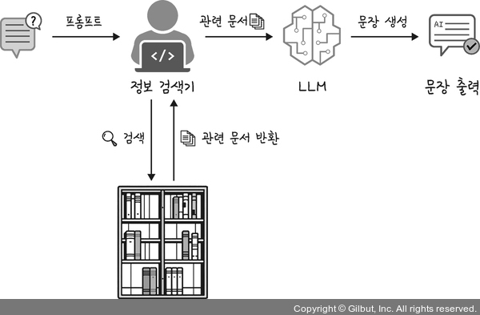

## 02. RAG 구현 과정
- 앞에서 RAG는 ‘정보 검색’과 ‘텍스트 생성’이라는 두 가지 주요 단계를 결합한 기술이라고 했다.
  - 정보 검색(retrieval): AI가 대규모 정보로부터 관련 데이터를 찾는 과정
  - 텍스트 생성(generation): 찾은 정보를 기반으로 새로운 텍스트를 만드는 과정

### 2-1. 정보 검색
- 정보 검색은 우리가 일반적으로 많이 하는 행위이다.
- 구글, 빙이나 네이버 검색 엔진에 궁금한 것을 입력하면 그에 대한 답변을 보여준다.

#### (1) 질문 입력
- 사용자는 필요한 정보를 찾기 위해 구글, 빙이나 네이버에 질문을 하거나 키워드를 입력한다.
- 이것을 ‘쿼리(query)’라고 한다.

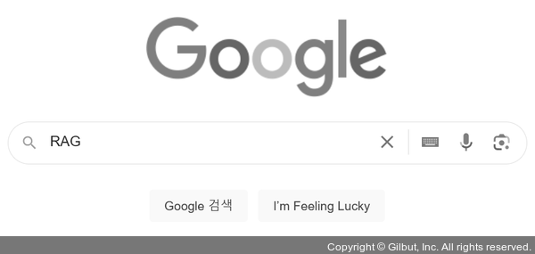

#### (2) 검색
- 검색 엔진은 해당 쿼리와 관련된 정보를 데이터베이스나 인터넷에서 찾는다.

#### (3) 유사도 검색
- 이후 검색 엔진은 쿼리와 데이터베이스(혹은 인터넷)에 있는 문서들 사이의 유사도를 계산한다.
- 이 과정은 키워드 검색과 시맨틱 검색을 모두 포함한다.
- 키워드 검색과 시맨틱 검색이 무엇인지 잠시 짚고 넘어가자.

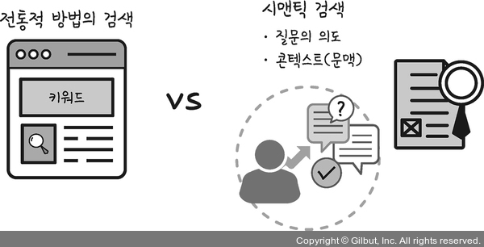

- 키워드 검색(keyword search):
  - 사용자가 입력한 단어나 구를 데이터베이스나 인터넷에서 직접 찾는 방식이다.
  - 즉, 검색 엔진은 사용자가 입력한 키워드가 문서 내에 명시적으로 나타나는 경우만 해당 문서를 결과로 반환한다.
  - 예를 들어 ‘커피숍’을 검색하면, ‘커피숍’이라는 단어가 포함된 모든 웹페이지를 찾아서 결과로 보여준다.
  - 하지만 이 방식은 사용자의 질문 의도나 문맥을 파악하지 못하고 단순히 키워드의 존재 여부만을 기준으로 하기 때문에 때때로 관련 없는 결과를 보여주기도 한다.
- 시맨틱 검색(semantic search):
  - 단어의 의미와 문맥을 이해하여 보다 관련성 높은 결과를 제공하는 기술이다.
  - 이 방식은 단어의 의미, 동의어, 주제, 사용자의 검색 의도 등을 고려하기 때문에 단어가 문서에 직접적으로 나타나지 않더라도 문맥상 관련 있는 결과를 찾아낼 수 있다.
  - 예를 들어 ‘가장 가까운 커피숍’을 검색하면, 시맨틱 검색은 ‘가까운’의 의미를 이해하고 사용자의 위치를 고려하여 주변의 커피숍을 찾아서 보여준다.
  - 하지만 시맨틱 검색은 키워드 검색보다 훨씬 복잡하며 의미를 정확히 파악하고 문맥을 이해하기 위해 고도의 알고리즘과 자연어 처리 기술이 필요하다.

#### (4) 랭킹 처리
- 검색 결과로 찾아낸 문서들 중에서 어떤 것이 질문과 가장 관련이 높은지를 결정한다.
- 가장 관련이 높다고 판단되는 문서부터 순서대로 나열한다.
- RAG 모델에서 랭킹 처리는 모델이 생성할 텍스트와 가장 관련이 높은 정보를 선택하는 과정이다.
- 따라서 이 과정의 목표는 사용자의 질문이나 요구에 가장 적합하고 유용한 정보를 찾는 것이다.
- RAG에서 랭킹을 매기는 원리:
- i) 유사도 계산:
  - 문서나 단어 사이의 관련성이나 유사성을 수치로 표현하는 방법
  - 예를 들어 우리가 ‘사과’와 ‘수박’이라는 단어를 생각해보면, 이 두 단어는 서로 관련성이 있다.
  - 검색엔진은 이러한 연관성을 이해하기 위해 유사도 계산을 한다.
  - 먼저 각 단어나 문서를 수치화된 숫자인 벡터로 변환한다.
  - 예를 들어 ‘사과’라는 단어는 [1, 0]이라는 벡터로, ‘수박’이라는 단어는 [1, 1]이라는 벡터로 표현할 수 있다.
  - 여기서 첫 번째 숫자는 ‘과일’과 관련된 정도를, 두 번째 숫자는 ‘단맛’과 관련된 정도를 나타낸다.
  - 그런 다음, 이 벡터들 사이의 거리나 각도를 계산하여 두 단어가 얼마나 유사한지 측정한다(벡터는 좌표에 표현할 수 있기 때문에 각도 계산이 가능하다).
  - 벡터가 가리키는 방향이 비슷하거나 거리가 가까울수록 두 단어가 유사하다는 의미다.

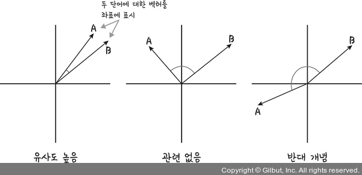

  - 더 구체적으로, ‘사과’ 벡터 [1, 0]와 ‘수박’ 벡터 [1, 1]는 첫 번째 요소가 같으므로 어느 정도 유사하다고 볼 수 있다.
  - 그러나 ‘사과’ [1, 0]와 ‘자동차’ [0, 1] 벡터는 첫 번째 숫자가 서로 다르므로 유사하지 않다고 볼 수 있다.
  - 유사도를 구하는 방식 중 가장 대표적인 것이 코사인 유사도이며 다음과 같은 수식을 사용한다.

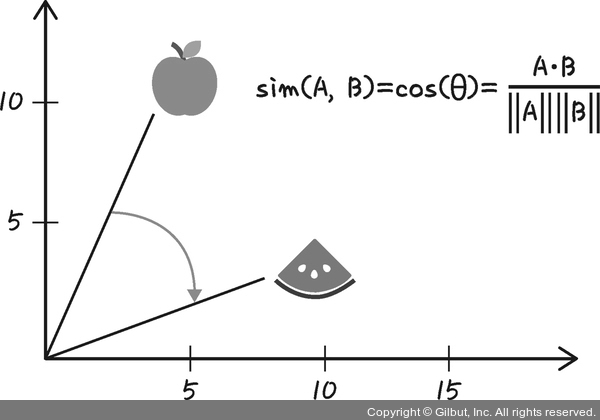

- ii) 문맥과 의도 파악: 모델은 쿼리의 문맥과 의도를 고려하여 검색된 문서가 얼마나 관련이 있는지 판단한다.
- iii) 랭킹 산출: 유사도, 문맥, 정보 품질 등 다양한 요소를 종합하여 각 문서에 최종 랭킹을 매긴다.

### 2-2. 정보 검색
#### (1) 벡터와 유사도
- 벡터(vector)는 수학에서 사용하는 용어로서 방향과 크기를 나타내는 값이다.
- 일상적인 예로, 바람을 생각해볼 수 있다.
- 단순히 바람이 분다고 하지 않고, 바람의 방향과 세기를 같이 설명하는 것처럼 수학에서도 역시 방향과 세기를 설명하기 위해 벡터를 사용한다.
- 바람이 북쪽으로 10km/h의 속도로 부는 경우, 이를 벡터로 표현하면 ‘북쪽 방향’을 나타내는 방향과 ‘10km/h’를 나타내는 크기를 같이 표현한다.

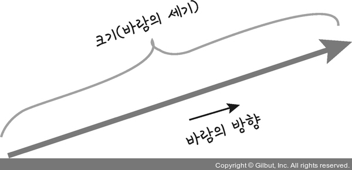

- 예를 들어 여러 가지 과일에 대한 정보를 벡터로 표현한다고 해본다.
- 각 과일은 ‘단맛’, ‘신맛’, ‘색깔’, ‘크기’ 같은 여러 특성을 가질 수 있다.
- 각 특성을 하나의 축으로 생각하고 과일의 각 특성을 이 축에 따라 점수를 매긴다면, 그 점수들을 모아서 하나의 벡터를 만들 수 있다.
- 예를 들어 사과는 다음과 같은 벡터로 표현될 수 있다.
  - 단맛: 7
  - 신맛: 5
  - 색깔: ‘빨강’이면 1, ‘초록’이면 2로 표현해보자면 빨강 사과는 1
  - 크기: 중간이면 5
- 이 정보를 모아 사과에 대한 벡터를 만들면 [7, 5, 1, 5]가 된다.
- 이 벡터는 사과의 ‘특성’을 수치로 표현한 것이다.
- 검색 엔진은 이런 벡터를 사용해서 다른 과일과 비교하거나 어떤 과일이 사용자의 선호도에 가장 잘 맞는지를 계산하는 데 사용할 수 있다.
- 예를 들어 단맛이 강한 과일을 선호하는 사용자에게는 단맛 점수가 높은 과일 벡터를 추천할 수 있다.

#### (2) 유사도 계산
- 유사도를 계산하는 방법인 코사인 유사도와 유클리드 유사도(또는 유클리드 거리)를 좀 더 자세히 알아보자.

#### (2)-1. 코사인 유사도
- 코사인 유사도는 두 벡터 간의 각도를 계산하여 그 유사성을 측정하는 방법이다.
- 진희와 은영이, 두 친구의 취미가 얼마나 비슷한지 코사인 유사도로 알아보자.
- 진희와 은영이의 취미가 얼마나 유사한지 알아보기 위해 ‘독서’와 ‘등산’이라는 두 취미를 점수로 매겨보자.
- 진희는 독서를 좋아해서 80점, 등산은 조금 좋아해서 50점을 줬다.
- 은영이는 독서도 좋아하고 등산도 꽤 좋아해서, 둘 다 60점을 줬다.
- 이제 독서와 등산을 각각의 축으로 하는 그래프에 표시한다.
- 진희의 취미에 대해 독서 방향으로 80만큼, 등산 방향으로 50만큼 그린다.
- 마찬가지로 은영이의 취미도 화살표로 그리면, 다음과 같은 그래프가 완성된다.

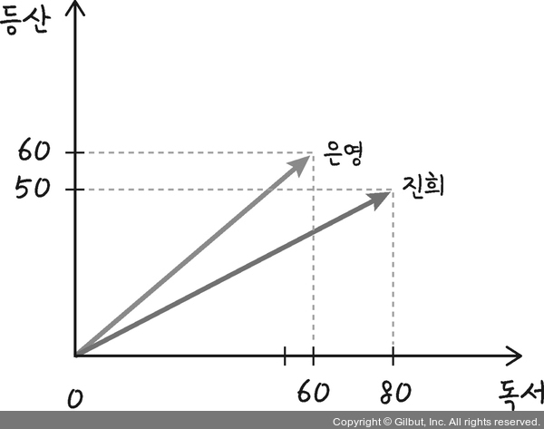

- 이제 이 두 화살표를 보면, 그 방향이 비슷한지 다른지를 볼 수 있다.
- 두 화살표가 같은 방향을 가리키면 두 친구의 취미가 유사하다는 뜻이고, 반대 방향이면 전혀 다른 취미를 가진다는 의미이다.
- 코사인 유사도는 이 두 화살표가 얼마나 같은 방향인지를 가지고 유사도를 알아보는 것이다.
- 그래프에서 두 화살표가 비슷한 방향을 가리키고 있으니 진희와 은영이의 취미가 유사하다고 볼 수 있다.

#### (2)-2. 유클리드 유사도
- 유클리드 유사도는 두 점 사이의 ‘직선 거리’를 말한다.
- 쉽게 말해 지도에서 두 장소 사이의 실제 거리를 측정하는 것과 같다.
- 예를 들어 진희가 집에서 가장 가까운 슈퍼마켓까지의 거리를 알고 싶다고 가정해 본다.
- 진희가 슈퍼마켓까지 걸어갈 때, 바로 가로질러 걷는 직선 경로가 유클리드 거리이다.
- 코사인 유사도와 유클리드 유사도를 비교하면 다음 그림과 같다.

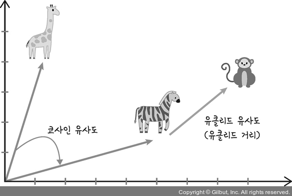

#### (3) 검색 결과 랭킹 처리
- 정보 검색에서 랭킹을 매기는 과정은 검색 엔진이 사용자의 쿼리에 가장 관련성이 높은 문서를 결정하고 이를 순서대로 나열하는 방법을 말한다.
- 이 과정을 ‘랭킹’이라고도 한다.
- 랭킹을 위한 방법에는 몇 가지가 있는데, 그중 많이 사용되는 것 위주로 알아보자.

#### (3)-1. 페이지랭크
- 페이지랭크(PageRank)는 검색 결과에 랭킹을 매기는 알고리즘으로, 일반적으로 검색 엔진에서 많이 사용된다.
- 페이지랭크를 더 쉽게 이해하기 위해 학교에서 친구들 사이의 인기도를 측정해본다고 가정한다.
- 인기 투표에 참여하는 사람은 진희와 은영이로, 둘은 같은 반 학생들의 추천으로 올라왔다.
  - 진희: 학교에서 가장 인기 있는 친구의 1표를 받았으며, 과반수 이상의 친구들로부터 추천을 받아 후보로 올라왔다.
  - 은영: 친구들 사이에서 큰 인기가 없는 10명의 투표를 받았으며, 한 명에게만 추천을 받아 후보로 올라왔다.
- 페이지랭크 관점에서 보면 진희는 많은 추천을 받았지만 1표만 받았기 때문에 추천해준 친구들 자체는 인기가 별로 없다고 판단할 수 있다.
- 즉, 그 추천의 ‘가치’가 낮다고 할 수 있다.
- 반면에 은영이는 오직 한 명에게만 추천을 받았지만 그 한 명이 학교에서 매우 인기가 많기 때문에 10명에게 투표를 받았다.
- 즉, 한 명의 추천 ‘가치’가 높은 것으로 간주할 수 있다.
- 여기서 친구들의 인기도는 웹페이지의 중요도에 비유할 수 있다.
- 특정 웹페이지가 다른 많은 웹페이지로부터 참조되는(링크를 받는다고 표현한다) 것은 학급 친구들로부터 투표를 받는 것과 같다.
- 또한, 인기 있는 친구의 추천이 투표에 더 많은 영향을 준 것처럼 ‘인기 있는’ 웹페이지로부터 링크를 받는 것이 훨씬 더 가치가 있다.
- 정리하면 다음 그림과 같이 참조를 많이 받는(링크를 많이 받는) 페이지의 랭킹이 높은 것을 확인할 수 있는데 이와 같은 방식으로 랭킹을 매기는 것이 페이지랭크이다.

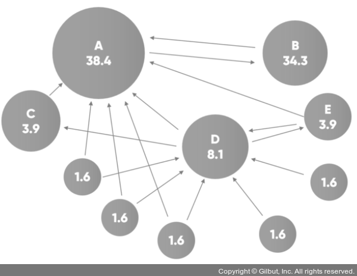

#### (3)-2. TF-IDF
- 다음으로 TF-IDF(Term Frequency-Inverse Document Frequency) 방식이 있다.
- 이 방식은 문서에서 특정 단어가 나타나는 단어 빈도(TF)와 그 단어가 전체 문서에서 얼마나 드물게 나타나는지에 대한 문서 빈도(IDF)를 계산하여 랭킹을 매긴다.

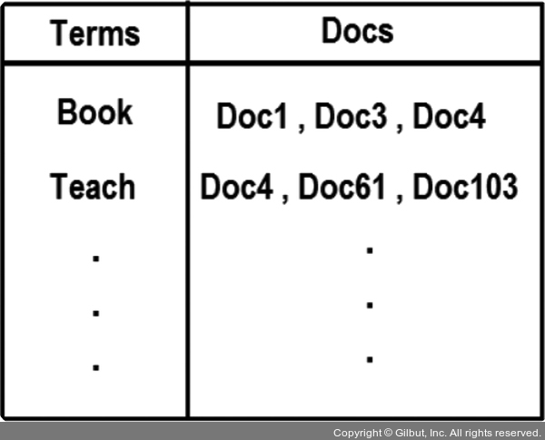

- TF-IDF 값이 높은 문서는 쿼리와 더 관련이 높다고 간주된다.
- 무슨 의미인지 이해하기 어렵다면 다음의 예시로 자세히 살펴보겠다.
- 진희는 시험을 앞두고 공부하던 중 특정 단어 ‘RAG’를 찾아야 하는 상황이 발생했다.
- 단어 빈도(Term Frequency, TF):
  - ‘RAG’라는 단어가 한 권의 책에 얼마나 자주 나오는지 세는 것이다.
  - 예를 들어 한 권의 책에서 ‘RAG’라는 단어가 10번 나왔다면 이 책에서 ‘RAG’의 TF는 10이다.
- 문서 빈도(Inverse Document Frequency, IDF):
  - 이번에는 가지고 있는 모든 도서에서 ‘RAG’라는 단어가 들어 있는 책이 얼마나 드문지를 측정한다.
  - 예를 들어 30권의 책 중에서 ‘RAG’라는 단어가 2권의 책에만 나온다면, ‘RAG’는 매우 특별한 단어이다.
  - ‘RAG’의 IDF는 30을 2로 나눈 다음, 이 값에 로그를 취하여 계산한다.
  - 이렇게 하면 드문 단어일수록 더 높은 값이 나온다.
- ‘RAG’라는 단어가 한 권의 책에서 10번 나오고, 소유하고 있는 모든 도서 중 2권에만 들어 있다면 ‘RAG’의 TF-IDF 값은 다음과 같이 계산된다.
  - TF('RAG') = 10 (한 권의 책 내 RAG의 빈도)
  - IDF('RAG') = log(30 ÷ 2) = log(15)
  - TF-IDF('RAG') = 10 × log(15)
- 이 계산 결과 값이 크면 ‘RAG’라는 단어는 그 책에서 매우 중요하다는 것을 의미한다.
- 이렇게 해서 ‘RAG’라는 단어가 얼마나 중요한지를 판단할 수 있다.

#### (3)-3. 클릭률
- 클릭률(Click-Through Rate, CTR)은 인터넷 광고나 검색 엔진 결과 등에서 어떤 링크가 얼마나 자주 클릭되는지를 측정하는 지표이다.
- 클릭률은 클릭 수를 광고나 링크가 보인 횟수(노출 수)로 나눈 값에 100을 곱한 백분율로 표현된다.
- 예를 들어 진희가 온라인에서 사과를 판매하기 위해 포스터를 만들었다.
- 이 포스터를 100명이 봤고 그 중에서 실제로 2명이 구매했다면,
  - 100명이 포스터를 봤다. (노출)
  - 2명이 구매했다. (클릭)
- 클릭률(CTR)은 다음과 같이 계산된다.
- 구매한 사람 수(2명)를 전체 본 사람 수(100명)로 나누고 그 결과에 100을 곱한다.

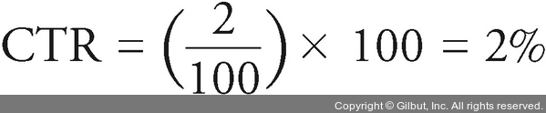

- 이는 포스터를 본 사람 중 2%가 실제로 구매했다는 것을 의미한다.
- 따라서 클릭률은 포스터가 사람들의 관심을 얼마나 잘 끄는지를 측정하는 용도로 사용된다.

### 2-3. 텍스트 생성
#### (1) (검색 엔진의 경우) 결과 반환
- 랭킹이 매겨진 문서 리스트를 사용자에게 보여준다.
- 사용자는 이 리스트를 보고 원하는 정보를 선택할 수 있다.
- 일반적으로 검색 결과를 보여주면 첫 번째부터 클릭해보다가 원하는 정보가 없으면 페이지를 넘기면서 모든 결과를 클릭해본다.
- 하지만 ‘랭킹 처리’에서 살펴봤던 것처럼 페이지를 넘길수록 원하는 정보를 찾지 못할 확률이 더 높다.

#### (2) (LLM의 경우) 텍스트 생성
- 사용자의 질문과 검색 결과로 텍스트를 생성한다.
- 정보 검색을 통해 수집된 정보를 LLM에 넘기면 LLM에서는 텍스트를 생성하는데, 이 과정을 예시를 통해 알아보자.
- 진희는 여러 식당 리뷰에 대한 정보를 가지고 있다.
- 이 정보에는 식당 이름, 위치, 가장 인기 있는 요리, 서비스 품질, 분위기 등이 포함되어 있다.
- 예를 들어
  - “레스토랑 ‘오션 뷰’는 해변가에 위치해 있으며, 신선한 해산물 요리로 유명하다. 손님들은 친절한 서비스와 탁 트인 바다 전망에 높은 점수를 줬다.”
- 라는 형식으로 정보를 가지고 있다고 가정해보자.
- 따라서 ‘오션 뷰’라고 질의하면 해당 레스토랑의 위치, 가장 인기 있는 요리, 서비스 품질, 분위기 등이 함께 검색될 것이다.
- 이제 이 정보가 LLM에 넘어가면 LLM은 자신에게 주어진 정보들을 기반으로 텍스트를 생성한다.
- 앞에서 질의했던 ‘오션 뷰’의 경우,
  - “오션 뷰 레스토랑은 방문객에게 매혹적인 해변의 전망과 함께 최상급 해산물 요리를 제공한다. 이곳의 시그니처 요리인 ‘오션 플래터’는 방문객 사이에서 필수 메뉴로 꼽히며, 서비스의 질과 친근한 분위기는 손님들로 하여금 다시 방문하고 싶은 마음을 갖게 한다.”
- 와 같이 텍스트를 생성할 수 있다.
- 좀 더 쉬운 예를 들어 보자.
- 예를 들어 사용자가 “마이클 잭슨의 가장 유명한 노래는?”이라고 물어본다면 학습을 통해 혹은 검색을 통해 정답이 ‘Billie Jean’이라는 것을 확인한다.
- 그리고 다음과 같이 답변할 것이다.
```
마이클 잭슨의 가장 유명한 노래 중 하나는 'Billie Jean'입니다.
이 노래는 그의 1982년 앨범 'Thriller'에 수록되었으며, 팝 음악 역사상 가장 중요한 곡 중 하나로 꼽힙니다.
'Billie Jean'은 그의 노래와 춤으로 인해 큰 인기를 얻었으며 그의 음악 경력을 대표하는 곡 중 하나입니다.
```
- 단순히 ‘Billie Jean’이라는 단답형 답변보다는 눈으로 읽기에도 자연스럽다.
- 사실 정답만 알고자 한다면 ‘Billie Jean’만 결과로 보여줘도 문제가 되지 않다.
- 하지만 LLM의 답변은 훨씬 인간적이라고 할 수 있다.
- 이렇게 LLM은 제공된 정보를 활용하여 구체적이고 정보에 기반한 텍스트를 생성할 수 있다.

## 03. RAG 구현 시 필요한 것
- RAG 시스템을 구현하기 위해서는 여러 구성 요소가 필요하다.
- 중요한 항목들 위주로 알아보자.

### 3-1. 데이터
- RAG에서 사용할 수 있는 데이터는 특별히 정해진 형식이 없다.
- CSV, JSON, PDF 등과 같은 파일 형식도 가능하고, 오라클과 같은 데이터베이스도 가능하다.
- 중요한 것은 데이터의 형식이 아니라 규범, 규제를 고려하는 것이다.
- 특히 사용하려는 데이터에 개인정보가 포함되어 있는지, 저작권법 침해에 해당되는지를 확인해야 한다.
- 또한 외부에서 얻은 데이터를 상업적 용도로 사용할 경우, 데이터의 소유권을 가진 개인이나 기관으로부터 적절한 사용 권한을 획득해야 한다.
- 이렇게 획득한 데이터는 크게 두 가지 방법으로 사용할 수 있다.
  - 시맨틱 검색
  - 벡터 검색
- 벡터 검색을 위해서는 임베딩이라는 개념을 먼저 이해해야 한다.

#### (1) 임베딩
- 베딩(embedding)은 복잡한 데이터를 간단한 형태로 바꾸는 것을 의미한다.

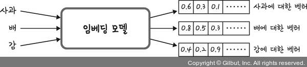

- 즉, 컴퓨터가 이해할 수 있도록 정보를 숫자(벡터)로 바꾸는 것이다.
- 예를 들어 ‘사과’, ‘바나나’, ‘컴퓨터’라는 세 단어가 있다고 가정해보자.
- 이제 이 단어들을 컴퓨터가 이해할 수 있는 숫자로 바꿔야 한다.
- 변환되는 첫 번째 숫자는 ‘과일(fruit)’을, 두 번째 숫자는 ‘기술(technology)’을 나타낸다고 하면 다음과 같이 변환될 수 있다.
  - ‘사과’는 [1.0, 0.0]으로 변환
  - ‘바나나’는 [0.9, 0.1]로 변환
  - ‘컴퓨터’는 [0.1, 0.9]로 변환
- 그럼 ‘사과’와 ‘바나나’는 과일이기 때문에 ‘과일’에 대한 숫자가 높고, ‘컴퓨터’는 기술로 분류될 수 있기 때문에 ‘기술’에 대한 숫자가 높다.
- 즉, 벡터들을 비교하여 ‘사과’와 ‘바나나’가 서로 비슷하고, ‘컴퓨터’와는 다르다는 것을 이해할 수 있다.
- 왜냐하면 ‘사과’와 ‘바나나’ 벡터는 서로 가깝고, ‘컴퓨터’ 벡터는 멀리 떨어져 있기 때문이다.

#### (2) 임베딩 모델
- 임베딩을 위해서는 임베딩 모델이라는 것이 필요하다.

#### (2)-1. Word2Vec
- Word2Vec은 단어를 컴퓨터가 이해할 수 있는 숫자인 벡터로 변환하는 모델이다.
- 이를 통해 컴퓨터는 단어 사이의 관계를 이해하고 비슷한 의미를 가진 단어들을 찾을 수 있다.
- 파이썬을 이용하여 구현하는 방법은 간단하다.
```py
from gensim.models import Word2Vec

#훈련에 사용된 데이터
training_data = [
    ['강아지', '고양이', '두', '마리', '계단', '위', '앉아', '있다']
]
#word2vec 사용하여 벡터로 변환
word2vec_model = Word2Vec(sentences=training_data, min_count=1) 

word_vector = word2vec_model.wv['강아지']  #강아지를 벡터로 변환
word_vector
```
- '강아지'를 벡터로 바꾸면 다음과 같이 숫자의 나열들이 나타난다.
```
array([ 8.1681199e-03, -4.4430327e-03, 8.9854337e-03, 8.2536647e-03, -4.4352221e-03, 3.0310510e-04, 4.2744912e-03, -3.9263200e-03, -5.5599655e-03, -6.5123225e-03, -6.7073823e-04, -2.9592158e-04, 4.4630850e-03, -2.4740540e-03, -1.7260908e-04, 2.4618758e-03, 4.8675989e-03, -3.0808449e-05, -6.3394094e-03, -9.2608072e-03, 2.6657581e-05, 6.6618943e-03, 1.4660227e-03, -8.9665223e-03, -7.9386048e-03, 6.5519023e-03, -3.7856805e-03, 6.2549924e-03, -6.6810320e-03, 8.4796622e-03, -6.5163244e-03, 3.2880199e-03, -1.0569858e-03, -6.7875278e-03, -3.2875966e-03, -1.1614120e-03, -5.4709399e-03, -1.2113475e-03, -7.5633135e-03, 2.6466595e-03, 9.0701487e-03, -2.3772502e-03, -9.7651005e-04, 3.5135616e-03, 8.6650876e-03, -5.9218528e-03, -6.8875779e-03, -2.9329848e-03, 9.1476962e-03, 8.6626766e-04, -8.6784009e-03, -1.4469790e-03, 9.4794659e-03, -7.5494875e-03, -5.3580985e-03, 9.3165627e-03, -8.9737261e-03, 3.8259076e-03, 6.6544057e-04, 6.6607012e-03, 8.3127534e-03, -2.8507852e-03, -3.9923131e-03, 8.8979173e-03, 2.0896459e-03, 6.2489416e-03, -9.4457148e-03, 9.5901238e-03, -1.3483083e-03, -6.0521150e-03, 2.9925345e-03, -4.5661093e-04, 4.7064926e-03, -2.2830211e-03, -4.1378425e-03, 2.2778988e-03, 8.3543835e-03, -4.9956059e-03, 2.6686788e-03, -7.9905549e-03, -6.7733466e-03, -4.6766878e-04, -8.7677278e-03, 2.7894378e-03, 1.5985954e-03, -2.3196924e-03, 5.0037908e-03, 9.7487867e-03, 8.4542679e-03, -1.8802249e-03, 2.0581519e-03, -4.0036892e-03, -8.2414057e-03, 6.2779556e-03, -1.9491815e-03, -6.6620467e-04, -1.7713320e-03, -4.5356657e-03, 4.0617096e-03, -4.2701806e-03], dtype=float32)
```

#### (2)-2. GloVe
- GloVe(Global Vectors for Word Representation)는 단어의 의미를 숫자 벡터로 변환하는 방법 중 하나이다.
- 이 방법은 전체 텍스트에서 단어들이 얼마나 자주 함께 나타나는지를 보고 이 정보를 사용해서 각 단어를 벡터로 표현한다.
- 이것에 대한 파이썬 사용 방법은 다음과 같다.
```py
#gensim은 자연어 처리를 위한 파이썬 라이브러리로, 문서 유사성 분석을 위해 사용됩니다.
!pip install genism 

from gensim.models import KeyedVectors
from gensim.scripts.glove2word2vec import glove2word2vec

#사전에 구글 드라이브에 'glove.6B.100d.txt' 파일을 업로드해야 합니다. 업로드 방법은 부록을 참조해주세요. 또는 https://nlp.stanford.edu/projects/glove 사이트에서 'glove.6B.zip' 파일을 내려받으면 됩니다.
glove_path = '/content/sample_data/glove.6B.100d.txt' 

with open(glove_path, 'w') as f:
    f.write("cat 0.5 0.3 0.2\n")
    f.write("dog 0.4 0.7 0.8\n")

#GloVe 파일 형식을 word2vec 형식으로 변환
word2vec_output_file = glove_path + '.word2vec'
glove2word2vec(glove_path, word2vec_output_file)

model = KeyedVectors.load_word2vec_format(word2vec_output_file, binary=False)
cat_vector = model['cat']  #'cat'에 대한 벡터
cat_vector
```
- 'cat'에 대한 벡터는 다음과 같다.
```
array([0.5, 0.3, 0.2], dtype=float32)
```

#### (2)-3. 오픈AI 임베딩 모델
- 또 다른 모델로 오픈AI에서 제공하는 임베딩 모델이 있다.
- 특히 오픈AI 임베딩은 한국어 지원은 물론, RAG에서 정보 검색과 랭크에 있어서도 우월한 성능을 자랑한다.
- 또한 다음과 같이 사용 방법도 매우 간단하다.
```py
rom openai import OpenAI

client = OpenAI(
    api_key = "sk-",  #openai 키 입력
)
document = ['제프리 힌튼','교수','토론토 대학','사임']
#'제프리 힌튼','교수','토론토 대학','사임'을 벡터로 변환
response = client.embeddings.create(
    input=document,
    #오픈AI에서 제공하는 임베딩 모델
    model="text-embedding-ada-002"  
)  
response
```
- document의 단어들은 다음과 같이 임베딩 처리된다.
```
CreateEmbeddingResponse(data=[Embedding(embedding=[-0.025099867954850197, -0.019271383062005043, -0.007503656204789877, -0.01672401651740074, -0.007787466049194336, 0.0280348788946867, -0.005880402401089668, 0.0039110383950173855, -0.00293500954285264, 0.006724909879267216,
--중간 생략--
0.006888267584145069, -0.01740266941487789], index=3, object='embedding')], model='text-embedding-ada-002-v2', object='list', usage=Usage(prompt_tokens=23, total_tokens=23))
```
- 그런데 결과에서 볼 수 있듯이 ‘중간 생략’을 할 정도로 벡터로 변환된 내용이 상당히 많다.
- 그렇다면 이것을 아무 데이터베이스에 저장할 수는 없고, 벡터 데이터베이스에 해야 한다.

### 3-2. 벡터 데이터베이스
- 벡터 데이터베이스는 말 그대로 벡터를 저장하는 저장소이다.
- 벡터는 앞에서도 살펴봤듯이 여러 숫자로 이루어진 데이터의 나열을 말한다.
- 이를테면 상품에 대한 사람의 선호도를 여러 숫자로 표현한 것이 벡터일 수 있다.
- 그리고 숫자의 나열을 저장하는 곳이 벡터 데이터베이스이다.
- 벡터 데이터베이스는 단순히 벡터를 저장하는 것 외에도 데이터를 관리하며, 검색하는 일도 한다.
- 즉, 일반 데이터베이스와 달리 벡터 데이터베이스는 데이터의 정확한 값 대신 데이터 간의 ‘유사성’을 바탕으로 검색하는 데 사용된다.
- 예를 들어 일반 데이터베이스에서 나이가 30 이상인 사람의 정보를 가져오는 쿼리는 다음과 같다.
```sql
SELECT * FROM customers WHERE age >= 30;
```
- 하지만 벡터 데이터베이스는 일반 데이터베이스와 같이 질문하지 않는다.
- 예를 들어 물류 센터 A회사는 사용자로부터 다음과 같은 질의를 받았다.
  - 사용자 질문: "배송 상태를 어떻게 확인할 수 있죠?"
- 이 질문은 먼저 임베딩 처리 과정을 거쳐 벡터로 변환된다.
- 이제서야 벡터 데이터베이스에 다음과 같이 질의를 할 수 있다.
```sql
POST /search
{
  "query_vector": [0.13, -0.24, 0.33, ..., 0.78],
  "top_k": 5
}
```
- 여기서 "query_vector"는 질문의 벡터 표현이고, "top_k"는 반환 받고자 하는 가장 유사한 문서의 수이다.
- 이후부터 벡터 데이터베이스는 가치 있는 역할을 한다.
- 바로 저장된 문서 벡터들과 질문 벡터 간의 유사성을 계산하는 것이다.
- 유사성 검사는 앞에서 배웠던 코사인 유사도나 유클리드 거리와 같은 것들을 사용한다.
- 유사성 검사 결과에 따라 점수가 가장 높은(랭크가 가장 높은) 상위 N개의 벡터들이 반환되고 사용자에게 보여준다.
- 정리하면 벡터 데이터베이스는 숫자로 변환된 복잡한 데이터를 다루는 데 특화된 도서관과 같은 것이다.
- 여기서는 단순히 책을 제목으로 찾는 대신, 책의 내용이나 주제가 찾고자 하는 정보와 얼마나 ‘유사한지’를 기준으로 책을 찾을 뿐이다.

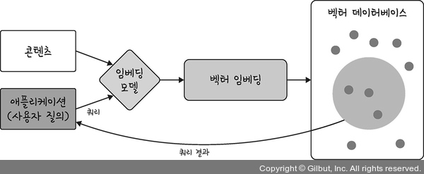

- 벡터를 저장하기 위해서는 특별한 데이터베이스만 가능하다는 것을 이해했을 것이다.
- 그럼 이제 특별한 데이터베이스에는 어떤 것들이 있는지 알아보자.

#### (1) 파인콘
- 파인콘(Pinecone)은 머신러닝과 인공지능 애플리케이션을 위해 설계된 벡터 데이터베이스이다.
- 복잡한 데이터(예: 텍스트, 이미지, 소리 등)를 숫자인 벡터로 바꾸어 저장하고 이 벡터들 사이의 유사성을 기반으로 빠르고 정확하게 검색할 수 있게 해주는 데이터베이스이다.
- 파인콘을 사용함으로 개발자는 복잡한 벡터 검색 기능을 빠르고 손쉽게 구현할 수 있다.

#### (2) 밀버스
- 밀버스(Milvus)는 클라우드에서 사용 가능한 오픈 소스 벡터 데이터베이스이다.
- 특히 밀버스는 다양한 유형의 벡터 데이터를 다루도록 최적화되어 있다.
- 예를 들어 이미지, 텍스트, 오디오 파일을 벡터 형태로 변환하여 밀버스에 저장하고 유사성 검색을 통해 관련 데이터를 빠르게 찾아낼 수 있다.
- 밀버스는 특정 클라우드 제조사(예: AWS, 마이크로소프트)에 종속적이지 않기 때문에 유연성이 높은 반면 사용자가 직접 인프라를 설정하고 관리해야 한다.

#### (3) 쿼드런트
- 쿼드런트(Qdrant)는 오픈 소스 벡터 데이터베이스로, 특히 고차원의 데이터 벡터를 효율적으로 저장하고 검색할 수 있는 기능을 제공한다.
- 여기서 ‘차원’은 벡터 내의 개별 요소의 수를 의미하며, 각 요소는 데이터의 특성을 나타낸다.
- 예를 들어 사람의 프로필 데이터에는 나이, 키, 몸무게, 취미, 선호하는 음식 등 수많은 특성이 있을 수 있는데 이러한 개별적인 것들이 하나의 차원을 나타낸다.
- 따라서 프로필에 나이, 키, 몸무게만 있다면 이것은 3차원 벡터라고 할 수 있다.
- 그리고 고차원 벡터를 다루는 데 효율적이라고 했으니 수십, 수백 차원의 데이터를 다루는 데 효과적인 것이 쿼드런트라고 할 수 있다.

#### (4) 크로마
- 크로마(Chroma)는 주로 LLM을 위해 설계된 오픈 소스 벡터 데이터베이스이다.
- 즉, 크로마는 모델이 생성하는 텍스트 데이터의 벡터를 저장하고 검색하는 데 특화되어 있다.
- 하지만 크로마는 텍스트 데이터와 언어 모델에 특화되었기 때문에 다른 유형의 데이터(예: 이미지, 오디오)를 다루는 데는 다른 벡터 데이터베이스만큼 효과적이지 않을 수 있다.

#### (5) 엘라스틱서치
- 엘라스틱서치(Elasticsearch)는 강력한 검색과 데이터 분석 기능을 제공하는 검색 엔진이다.
- 처음에는 무료로 사용할 수 있는 오픈 소스로 공개되었으나 현재는 유료로 변경되었다.
- 원래는 텍스트 기반 검색에 특화된 기능을 제공했지만 최근에는 벡터 데이터를 처리하는 기능도 추가되었다.
- 하지만 설정과 관리가 복잡할 수 있으며 대규모의 시스템에서는 전문 지식이 필요할 수 있다.

#### (6) 파이스
- 파이스(FAISS)는 Facebook AI Research(FAIR)에서 개발한 라이브러리로 이미지를 비롯해 다양한 데이터를 벡터로 바꾸고, 이 벡터들 중에서 비슷한 것들을 신속하게 찾아낼 수 있다(Find in a Set of Images).
- 즉, 일반적인 검색 엔진과 유사한 역할을 한다고 생각하면 된다.
- 검색 엔진의 경우 빠른 검색을 위해 인덱스라는 것을 사용한다.
- 파이스 역시 벡터 인덱스 기능을 제공하는데, 인덱스는 책에 있는 색인과 비슷한 역할을 한다.
- 책 뒤에 있는 색인을 통해 원하는 내용이나 단어를 빠르게 찾을 수 있듯이 벡터 인덱스도 많은 양의 데이터 중에서 원하는 정보를 신속하게 찾는 데 도움을 준다.

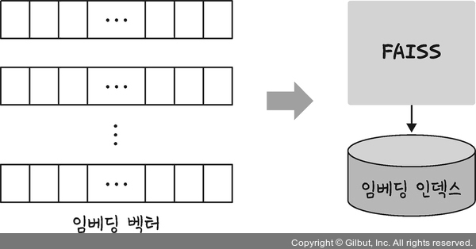

- 파이스 역시 무료로 사용할 수 있으며 GPU를 사용하여 더 빠른 검색 성능을 제공하지만 효과적인 사용을 위해서는 인덱스 구조에 대한 사전 지식이 필요하다.
- 즉, 파이스를 잘 다루기 위해서는 인덱스와 관련된 지식을 사전에 학습해두어야 한다.
- 지금까지 살펴본 벡터 데이터베이스의 특징 및 장단점을 비교하면 다음 표와 같다.

|데이터베이스|특징|장점|단점|
|:---:|:---:|:---:|:---:|
|파인콘|- 간단한 API <br> - 빠른 검색 성능|- 클라우드 기반으로 쉬운 확장성 <br> - 높은 가용성 및 보안성|- 제어에 제한이 있을 수 있음|
|밀버스|- 오픈 소스 <br> - 고성능 <br> - 광범위한 AI 애플리케이션 지원|- 무료로 사용 가능 <br> - 높은 수준의 제어가 가능|- 관리와 유지보수 필요|
|쿼드런트|- 오픈 소스 <br> - 고성능 <br> - 유연한 데이터 모델링 및 고급 필터링 기능|- 벡터 및 스칼라 데이터 모두 지원 <br> - 복잡한 검색 쿼리 가능|- 커뮤니티 지워이 밀버스나 엘라스틱서치에 비해 제한적|
|크로마|- LLM을 위한 벡터 데이터베이스|- 텍스트 데이터와 언어 모델에 특화된 기능을 제공|- 이미지나 오디오 데이터 같은 다른 유형의 벡터 데이터 처리에는 덜 최적화되어 있음|
|엘라스틱서치|- 널리 사용되는 검색 엔진 <br> - 벡터 검색과 전통적인 텍스트 검색을 모두 지원|- 다양한 플러그인 및 통합 옵션|- 벡터 검색에 대해 다른 전문 벡터 데이터베이스만큼 강력하지 않을 수 있음 <br> - 데이터 사이즈가 커지면 그에 따라 리소스 사용량이 높을 수 있음|
|파이스|- 오픈 소스 <br> - 고성능|- 무료로 사용 가능 <br> - GPU와 결합하여 빠른 검색 기능 제공|- 인덱스에 대한 사전 지식이 필요|

### 3-3. 프레임워크 (랭체인)
- 데이터도 준비되었고 벡터를 저장할 데이터베이스도 준비되었다면 마지막으로 해야 할 것은 실제로 LLM을 이용하여 서비스를 개발하는 것이다.
- 특히 LLM과 함께 부각되는 것이 랭체인이다.
- 랭체인(LangChain)은 언어 모델을 위한 프레임워크이다.
- 프레임워크는 마치 레고 블록과도 같다.
- 레고 블록에는 여러 블록들과 조립 설명서가 들어 있어서 복잡한 모형을 빠르게 만들 수 있듯이, 프레임워크도 이와 비슷하게 컴퓨터 프로그램을 만들 때 필요한 많은 기본적인 부품들이 미리 준비되어 있고 어떻게 조립해야 하는지에 대한 가이드가 제공된다.
- 그래서 개발자들은 처음부터 모든 것을 만들지 않고도 더 쉽게 프로그램을 만들 수 있다.
- 따라서 랭체인은 LLM을 활용하여 손쉽게 서비스를 개발할 수 있는 도구라고 이해하면 된다.

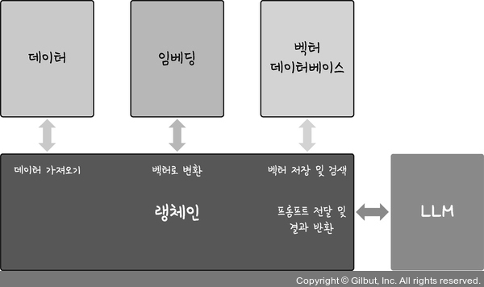
