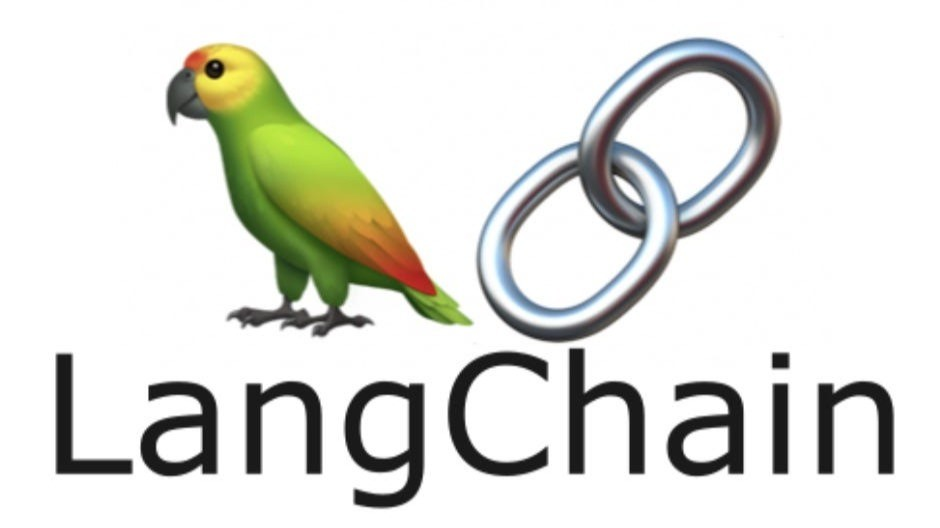
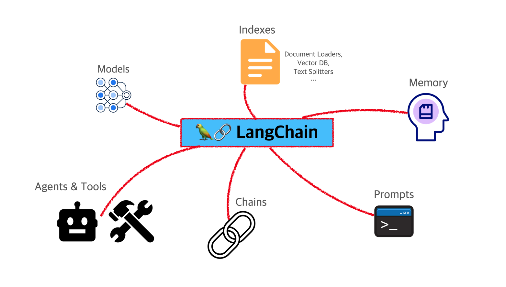

# Chapter 04: 랭체인 익숙해지기
- 랭체인은 LLM을 활용하기 위해 필요한 모듈의 모음이자 조합이다.

## 01. 랭체인 훑어보기
- 랭체인은 LLM 열풍이 일어나기 시작한 시점에 랭체인을 처음 오픈소스로 선보였으며 이후 커뮤니티 구성원들에 의해 더욱 발전하게 되었다.



- 앵무새는 언어 모델을 상징적으로 나타내는 것이다.
- 앵무새가 인간의 언어를 따라서 말할 수 있다는 점 때문에 랭체인의 상징처럼 표현된 것이다.
- 3장에서 RAG를 구현하려면 정보 검색과 텍스트 생성이 필요하다고 했는데, 여기서 텍스트 생성은 LLM의 몫이고 우리가 신경쓸 것은 정보 검색이다.
- 정보 검색은 일반적으로 데이터베이스가 아닌 벡터 데이터베이스를 사용하기 때문에 임베딩 과정이 필요하고, 이후 유사도 검색과 랭킹 처리가 필요하다.
- 정리하면 우리가 해야 할 일은 임베딩, 유사도 검색, 랭킹 처리인데 이 모든 것이 랭체인으로 가능하다.



## 02. 랭체인을 사용하기 위한 환경 구성
- 랭체인은 파이썬과 자바스크립트를 지원한다.
- 파이썬을 이용해 콛브를 작성할 수 있는 환경은 크게 두 가지가 있다.
  - 컴퓨터에 아나콘다를 설치하는 방법
  - 구글에서 제공하는 코랩을 사용하는 방법
- LLM과 랭체인으로 구현한 코드를 웹페이지에서 확인하기 위해 스트림릿을 사용할 텐데, 이것을 사용하기 위해 컴퓨터에 아나콘다를 설치해야 한다.

### 2-1. 아나콘다 환경 구성
#### (1) 아나콘다 설치하기
1. [아나콘다 사이트](https://www.anaconda.com/download#)에서 아나콘다를 내려받는다.
  - 다운로드 버튼을 눌러 컴퓨터에 맞는 버전을 내려받으면 된다.
2. 내려받은 설치 파일을 실행하면 설치 화면이 나온다.
3. 라이선스 동의 화면이 나오면 `I Agree`를 클릭한다.
4. 설치 유형 선택 화면이 나오면 `Just me`를 선택하고 넘어간다.
5. 설치 경로를 선택하는 화면이 나오면 기본값으로 두고 넘어간다.
6. 설치 시작 화면이 나오면 `Add Anoconda3 to my PATH environment variable`을 체크한다. 이는 아나콘다의 환경 변수 자동 등록 여부이다.
7. 설치가 시작된다.
8. 설치 종료 후 주피터 노트북 사용 준비 되었다는 것을 보여준다.
9. 설치 종료 후 윈도우 탐색기에서 내 PC 우클릭 후 `속성 > 고급 시스템 설정 > 환경 변수`를 선택한다.
  - 이후 `사용자 변수`에서 `Path`를 선택하고 편집을 클릭하면 아나콘다와 관련된 환경 변수가 생성되어 있는 것을 확인할 수 있다.

#### (2) 가상 환경 생성
- 아나콘다가 설치되었다면 가상 환경을 구성해본다.
1. 윈도우 시작 화면에서 `Anaconda3 > Anaconda Prompt`를 선택한다.
2. `conda create -n 환경 이름 python=3.8` 명령을 통해 가상 환경을 생성할 수 있다.
  - 다음과 같이 입력하여 'llm'이라는 이름의 가상 환경을 만든다.
  - 파이썬 3.8을 선택하고, 중간에 설치 여부는 'y'를 입력한다.
  - `conda create -n llm python=3.8`
3. 생성된 가상 환경을 확인한다.
  - 다음 명령으로 아나콘다의 가상 환경 목록을 확인할 수 있다.
```
> conda env list

# conda environments:
#
base                 * C:\Users\ryuta\anaconda3
llm                    C:\Users\ryuta\anaconda3\envs\llm
```
4. llm 가상 환경이 만들어졌으면 아래 명령어를 통해 가상 환경을 활성화 한다.
```
>  activate llm
```
  - 가상 환경을 삭제하고 싶을 때는 아래 명령으로 삭제 가능하다.
```
> conda env remove -n llm
```
5. 생성된 가상 환경에 주피터 노트북을 설치한다.
  - 다음 명령은 `activate llm` 이후에 실행한다.
```
> pip install ipykernel
```
  - 가상 환경에 커널을 연결하기 위해 다음을 실행한다.
```
> python -m ipykernel install --user --name llm --display-name "llm"
```
6. 설치가 끝났으니 주피터 노트북에 접속해본다.
```
> jupyter notebook
```
7. 웹브라우저에 주피터 노트북이 실행된다.
8. 오른쪽 `New` 메뉴에서 `llm`을 클릭한다.
9. 해당 주피터 노트북에서 예제를 진행하면 된다.
10. 실행은 `> Run` 버튼이나 `Shift + Enter` 키를 사용한다.
11. 책에서 제공한 소스 코드를 그대로 사용할 경우에는 내려받은 파일을 업로드하여 사용한다.
  - 우선 아래 URL에서 소스 코드를 내려받는다.
  - https://github.com/gilbutITbook/080413
  - 이번에는 `Upload`를 클릭한 후 내려받은 소스 코드를 선택한다.
12. 소스 코드를 불러왔다면 파일 옆에 있는 `Upload` 버튼을 클릭한다.
13. 그럼 목록에 업로드해둔 파일이 보인다.
  - 해당 파일을 클릭하면 코드가 보이는데 `> Run` 버튼으로 한 줄 씩 실행시킨다.

### 2-2. 필요한 라이브러리 설치
#### (1) 랭체인
1. 아나콘다의 주피터 노트북에 접속하여 아래와 같이 랭체인을 설치한다.
  - 버전: 0.0.350
```py
!pip install langchain==0.0.350
```
- 설치 명령을 실행하면 아래와 같이 출력된다.
```
Collecting langchain==0.0.350
  Downloading langchain-0.0.350-py3-none-any.whl.metadata (13 kB)
Requirement already satisfied: PyYAML>=5.3 in c:\users\ryuta\anaconda3\envs\llm\lib\site-packages (from langchain==0.0.350) (6.0.2)
Collecting SQLAlchemy<3,>=1.4 (from langchain==0.0.350)
  Downloading sqlalchemy-2.0.41-cp38-cp38-win_amd64.whl.metadata (9.8 kB)
Collecting aiohttp<4.0.0,>=3.8.3 (from langchain==0.0.350)
...중략...
Successfully installed SQLAlchemy-2.0.41 aiohappyeyeballs-2.4.4 aiohttp-3.10.11 aiosignal-1.3.1 annotated-types-0.7.0 async-timeout-4.0.3 dataclasses-json-0.6.7 frozenlist-1.5.0 greenlet-3.1.1 jsonpatch-1.33 jsonpointer-3.0.0 langchain-0.0.350 langchain-community-0.0.20 langchain-core-0.1.23 langsmith-0.0.87 marshmallow-3.22.0 multidict-6.1.0 mypy-extensions-1.1.0 packaging-23.2 propcache-0.2.0 pydantic-2.10.6 pydantic-core-2.27.2 tenacity-8.5.0 typing-extensions-4.13.2 typing-inspect-0.9.0 yarl-1.15.2
```
> - 랭체인이 이미 설치되어 있다면 아래 방법으로 설치된 버전을 확인할 수 있다.
> ```py
> import langchain
> 
> print('The version of langchain is {}'.format(langchain.__version__))
> ```
> - 실행 결과:
> ```
> The version of langchain is 0.0.350
> ```
> - 버전이 다르다면 버전을 지정한 설치 코드를 한 번 더 실행시켜주면 된다.

2. 다음으로 openai 라이브러리를 설치한다.
  - 아래 버전으로 설치한다.
```py
!pip install openai==1.4.0
```

3. 랭체인과 유사하게 다양한 패키지가 설치되는 것을 확인할 수 있다.
```
Collecting openai==1.4.0
  Downloading openai-1.4.0-py3-none-any.whl.metadata (17 kB)
Requirement already satisfied: anyio<5,>=3.5.0 in c:\users\ryuta\anaconda3\envs\llm\lib\site-packages (from openai==1.4.0) (4.2.0)
Collecting distro<2,>=1.7.0 (from openai==1.4.0)
  Downloading distro-1.9.0-py3-none-any.whl.metadata (6.8 kB)
...중략...
Requirement already satisfied: colorama in c:\users\ryuta\anaconda3\envs\llm\lib\site-packages (from tqdm>4->openai==1.4.0) (0.4.6)
Downloading openai-1.4.0-py3-none-any.whl (221 kB)
Downloading distro-1.9.0-py3-none-any.whl (20 kB)
Downloading tqdm-4.67.1-py3-none-any.whl (78 kB)
Installing collected packages: tqdm, distro, openai
Successfully installed distro-1.9.0 openai-1.4.0 tqdm-4.67.1
```

4. 다음으로 허깅페이스의 LLM을 사용하기 위한 라이브러리를 설치한다.
  - 허깅페이스(Hugging Face)는 인공지능 연구 및 개발을 위한 도구, 특히 자연어 처리 분야에 초점을 맞춘 회사로, 거대 언어 모델과 이를 쉽게 사용할 수 있는 API, 관련 라이브러리를 제공한다.
  - 아래 버전으로 설치한다.
```py
!pip install huggingface-hub==0.19.4
```
```
Collecting huggingface-hub==0.19.4
  Downloading huggingface_hub-0.19.4-py3-none-any.whl.metadata (14 kB)
Collecting filelock (from huggingface-hub==0.19.4)
  Downloading filelock-3.16.1-py3-none-any.whl.metadata (2.9 kB)
Collecting fsspec>=2023.5.0 (from huggingface-hub==0.19.4)
  Downloading fsspec-2025.3.0-py3-none-any.whl.metadata (11 kB)
...중략...
Requirement already satisfied: certifi>=2017.4.17 in c:\users\ryuta\anaconda3\envs\llm\lib\site-packages (from requests->huggingface-hub==0.19.4) (2024.8.30)
Downloading huggingface_hub-0.19.4-py3-none-any.whl (311 kB)
Downloading fsspec-2025.3.0-py3-none-any.whl (193 kB)
Downloading filelock-3.16.1-py3-none-any.whl (16 kB)
Installing collected packages: fsspec, filelock, huggingface-hub
Successfully installed filelock-3.16.1 fsspec-2025.3.0 huggingface-hub-0.19.4
```

### 2-3. 키 발급
- LLM API를 사용하기 위해서는 해당 LLM에 대한 키를 발급받아야 한다.
- 예제에 필요한 오픈AI와 허깅페이스 키를 발급받는다.

#### (1) 오픈AI API 키 발급
- 먼저 오픈AI 키를 발급받는다.

1. [오픈AI 웹사이트](https://openai.com/)에 접속한다.
- 오른쪽 상단에 `Log in / Sign up` 버튼을 눌러 로그인한다.

2. 로그인 후, 메뉴 중 자물쇠 그림의 `API Keys`를 클릭한다.
3. `Create new secret key`를 클릭한다.
4. 키 이름을 입력 후 `Create secret key` 버튼을 클릭한다.
5. 생성된 키를 복사하여 다른 곳에 저장한 후 `Done`을 클릭한다.
6. 파이썬 코드에서 생성된 키를 입력한다.
```py
import os
os.environ["OPENAI_API_KEY"] = "secret_key"
```

#### (2) 허깅페이스 LLM 사용 키
- 허깅페이스의 LLM 키를 받아보자.
- 언어 모델을 개발하는 측면에서 허깅페이스는 오픈AI와 유사하지만 모델을 제공하는 방식에서 차이가 있다.
- 오픈AI의 경우 LLM 모델을 상업적으로 배포하는 반면, 허깅페이스는 오픈 소스 기반으로 누구나 무료로 사용할 수 있는 생태계를 조성하는 데 중점을 두고 있다.

1. [허깅페이스 웹사이트](https://huggingface.co/settings/tokens)에 접속한다.
  - 허깅페이스 계정 생성 후 로그인한다.
2. 토큰을 생성할 수 있는 버튼이 활성화되어 있다.
  - `New token` 버튼을 클릭한다.
3. `Name`에 토큰 이름을 입력한 후 `Generate token` 버튼을 클릭한다.
4. 생성된 키를 복사하여 다른 곳에 저장한다.
5. 아나콘다에서 파이썬 코드를 실행한다.
```py
import os

os.environ['HUGGINGFACEHUB_API_TOKEN'] = 'secret_key'
```

## 03. 랭체인 주요 모듈
- 랭체인의 모듈들은 아래와 같다.
  - 모델 I/O
  - 데이터 연결
  - 체인
  - 메모리
  - 에이전트/툴

### 3-1. 모델 I/O
- 모델 I/O는 언어 모델과 상호 작용을 위한 모듈이다.
- LLM과 상호 작용한다는 것은 아래의 작업들을 의미한다.
  - LLM에 전달될 프롬프트 생성
  - 답변을 받기 위해 모델 API 호출
  - 답변에 대한 출력
- 모델 I/O는 LLM과의 상호작용을 위해 입력과 출력뿐만 아니라 LLM API 호출도 담당하기 때문에 아래의 구성 요소로 이뤄져 있다.
  - 프롬프트 -> 모델 -> 출력 파서
- 프롬프트는 입력 데이터와 검색 결과에 대한 것을 의미하며, 언어 모델은 LLM을 포함하여 채팅 모델, 임베딩 모델에 대한 API 호출 역할을 담당한다.
- LLM은 일반적으로 텍스트를 출력하는데, 보다 구조화된 정보를 얻고 싶을 때 출력 파서(Output Parsers)를 이용한다.
- 출력 파서는 모델에 출력 형식을 알려주고 원하는 형식으로 출력되도록 파싱하는 것을 담당한다.

> - 파싱은 컴퓨터가 쓰여진 코드나 데이터를 읽고 이해할 수 있게 도와주는 역할을 한다.
> - 예를 들어 컴퓨터가 웹사이트의 HTML 코드를 읽을 때 파서는 그 코드를 하나하나 살펴보며 알려주는 것이다.

#### 파이썬에서 실행해보기
- 아나콘다에서 아래 라이브러리를 설치한다.
- 한줄씩 실행해야 한다.
```py
!pip install langchain==0.0.350
!pip install openai==0.28.1
!pip install huggingface-hub==0.19.4
```

#### 프롬프트 생성
- 프롬프트 생성을 위해 `PromptTemplate`을 사용한다.
- 이는 LLM에 문장을 전달하기 전에 문장 구성을 편리하게 만들어주는 역할을 한다.
- 아래는 product 만 바뀌고 나머지 문구는 고정해서 출력하는 `PromptTemplate`에 대한 사용 예시이다.
```py
from langchain import PromptTemplate
template = '{product}를 홍보하기 위한 좋은 문구를 추천해줘?'

prompt = PromptTemplate(
    input_variables=['product'],
    template=template,
)

prompt.format(product="카메라")
```
- product 에 카메라를 입력하면 아래와 같은 결과를 보여준다.
```
'카메라를 홍보하기 위한 좋은 문구를 추천해줘?'
```

#### LLM 호출
- LLM은 오픈AI와 구글에서 제공하는 모델을 사용한다.
- 프롬프트는 
  - '진희는 강아지를 키우고 있습니다. 진희가 키우는 동물은?'
- 이며, 이에 따라 모델을 거쳐 나오는 결과인 컴플리션은 '강아지'가 되어야 한다.
- 오픈AI에서 제공하는 `gpt-3.5-turbo` 모델을 불러와서 결과를 확인해본다.
```py

```