# Chapter 01: 머신 러닝과 딥러닝
## 01. 인공지능, 머신 러닝과 딥러닝
- 인공지능 (Artificial Intelligence, AI): 인간의 지능을 모방하여 사람이 하는 일을 컴퓨터가 할 수 있도록 하는 기술이다.
- 인공지능을 구현하는 방법: 머신 러닝(machine learning), 딥러닝(deep learning)
- 인공지능 > 머신 러닝 > 딥러닝
- 머신 러닝과 딥러닝 모두 학습 모델을 제공하여 데이터를 분류할 수 있는 기술이지만, 둘은 접근 방식에 차이가 있다.
- 머신 러닝:
    - 주어진 데이터를 인간이 먼저 전처리를 한다.
    - 이미지 데이터라면 사람이 학습 데이터를 컴퓨터가 인식할 수 있도록 준비해야 한다.
    - 범용적인 목적을 위해 제작된 것으로, 데이터의 특징을 추출하지 못한다.
- 딥러닝:
    - 인간이 하던 작업을 생략한다.
    - 대량의 데이터를 신경망에 적용하면 컴퓨터가 스스로 분석한 후 답을 찾는다.

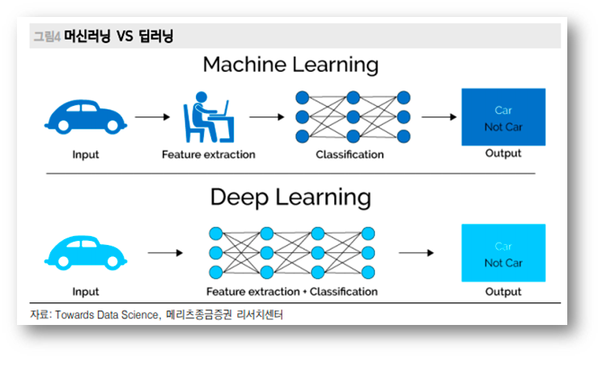

|구분|머신 러닝|딥러닝|
|:---:|:---:|:---:|
|동작 원리|입력 데이터에 알고리즘을 적용하여 예측을 수행한다.|정보를 전닳하는 신경망을 사용하여 데이터 특징 및 관계를 해석한다.|
|재사용|입력 데이터를 분석하기 위해 다양한 알고리즘을 사용하며, 동일한 유형의 데이터 분석을 위한 재사용은 불가능하다.|구현된 알고리즘은 동일한 유형의 데이터를 분석하는데 재사용된다.|
|데이터|일반적으로 수천 개의 데이터가 필요하다.|수백만 개 이상의 데이터가 필요하다.|
|훈련 시간|단시간|장시간|
|결과|일반적으로 점수 또는 분류 등 숫자 값|출력은 점수, 텍스트, 소리 등 어떤 것이든 가능|

## 02. 머신 러닝이란?
### 2-1. 머신 러닝 학습 과정
- 머신 러닝은 크게 학습 단계 (learning)와 예측 단계 (prediction)로 구분할 수 있다.
- 훈련 데이터를 머신 러닝 알고리즘에 적용하여 학습시키고, 이 학습 결과로 모형이 생성된다.
- 예측 단계에서는 학습 단계에서 생성된 모형에 새로운 데이터를 적용하여 결과를 예측한다.

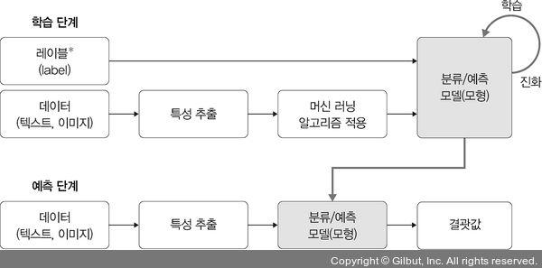

> #### 특성 추출
> - 머신 러닝에서 컴퓨터가 스스로 학습하려면, 즉 컴퓨터가 입력받은 데이터를 분석하여 일정한 패턴이나 규칙을 찾아 내려면 사람이 인지하는 데이터를 컴퓨터가 인지할 수 있는 데이터로 변환해 줘야 한다.
> - 이 때, 데이터 별로 어떤 특징을 가지고 있는지 찾아내고, 그것을 토대로 데이터를 백터로 변환하는 작업을 특성 추출 (feature extraction)이라고 한다.

- 머신 러닝의 주요 구성 요소: 데이터, 모델(모형)
- 데이터:
    - 머신 러닝이 학습 모델을 만드는데 사용하는 것
    - 훈련 데이터가 나쁘다면 실제 현상의 특성을 제대로 반영할 수 없으므로 실제 데이터의 특징이 잘 반영되고 편향되지 않는 훈련 데이터를 확보하는 것이 중요하다.
    - 학습에 필요한 데이터가 수집되었다면, "훈련 데이터셋"과 "테스트 데이터셋" 용도로 분리하여 사용한다.
    - "훈련 데이터셋"을 다시 "훈련 데이터셋"과 "검증 데이터셋"으로 분리하여 사용하기도 한다.
    - 보통 데이터의 80%는 훈련용, 20%는 테스트용으로 사용한다.
- 모델:
    - 머신 러닝의 학습 단계에서 얻은 최종 결과물로, 가설이라고도 한다.
    - 모델의 학습 절차:
    1. 모델 (또는 가설) 선택
    2. 모델 학습 및 평가
    3. 평가를 바탕으로 모델 업데이트

    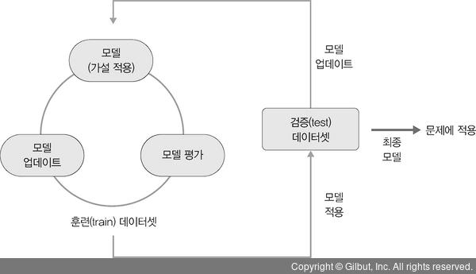

> #### 훈련과 검증, 테스트 데이터셋
> - 수집된 데이터셋은 크게 훈련 (training)과 테스트 (test) 데이터셋으로 분리하여 사용된다.
> - 종종 훈련 데이터셋을 다시 훈련과 검증 (validation) 용도로 분리해서 사용하는 경우도 있다.
> 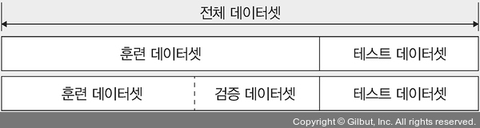

### 2-2. 머신 러닝 학습 알고리즘
- 머신 러닝의 학습 알고리즘으로는 지도 학습, 비지도 학습, 강화 학습이 있다.
- 지도 학습: 정답이 무엇인지 컴퓨터에 알려 주고 학습시키는 방법
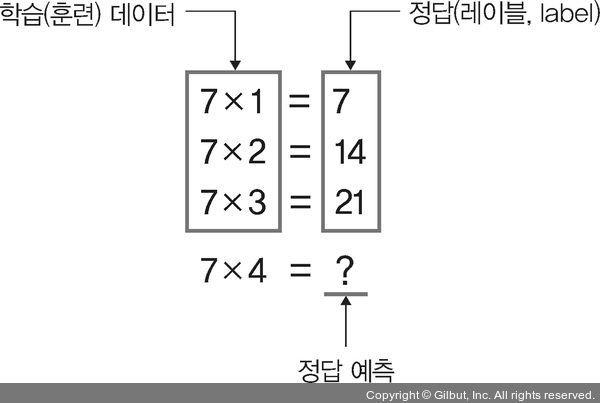

- 비지도 학습: 정답을 알려주지 않고 특징이 비슷한 데이터를 클러스터링 (범주화)하여 예측하는 학습 방법
- 지도 학습은 주어진 데이터에 대해 A 혹은 B로 명확한 분류가 가능하지만 비지도 학습은 유사도 기반 (데이터 간 거리 측정)으로 특징이 유사한 데이터끼리 클러스터링으로 묶어서 분류한다.
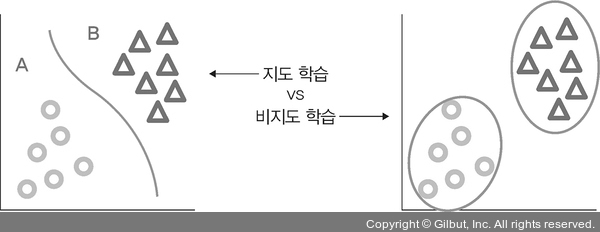

- 강화 학습:
    - 자신의 행동에 대한 보상을 받으며 학습을 진행
    - 예시로 쿠키런 게임을 보자.
    - 쿠키가 에이전트 (agent)이며, 게임 배경이 환경 (environment)이다.
    - 에이전트가 변화하는 환경에 따라 다른 행동 (action)을 취하게 된다.
    - 동전이나 젤리를 취득하는 등 행동에 따라 보상을 얻는다.
    - 강화 학습은 이러한 보상이 커지는 행동을 자주 하도록, 줄어드는 행동은 덜 하도록 하여 학습을 진행한다.
    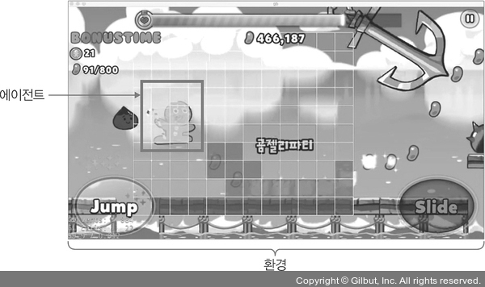

#### 머신 러닝 학습 별 알고리즘 정리

|구분|유형|알고리즘|
|:---:|:---:|:---:|
|지도 학습 (supervised learning)|분류 (classification)|K-최근접 이웃 (K-Nearest Neighbor, KNN)|
|"|"|서포트 벡터 머신 (Support Vector Machine, SVM)|
|"|"|결정 트리 (decision tree)|
|"|"|로지스틱 회귀 (logistic regression)|
|"|회귀 (regression)|선형 회귀 (linear regression)|
|비지도 학습 (unsupervised learning)|군집 (clustering)|K-평균 군집화 (K-means clustering)|
|"|"|밀도 기반 군집 분석 (DBSCAN)|
|"|차원 축소 (dimensionality reduction)|주성분 분석 (Principal Component Analysis, PCA)|
|강화 학습 (reinforcement learning)|-|마르코프 결정 과정 (Markov Decision Process, MDP)|

## 03. 딥러닝이란?
- 딥러닝: 인간의 신경망 원리를 모방한 심층 신경망 이론을 기반으로 고안된 머신 러닝 방법의 일종
- 인간의 뇌가 엄청난 수의 뉴런과 시냅스로 구성되어 있다는 것에 착안하여 적용했다.
- 각각의 뉴런은 복잡하게 연결된 수많은 뉴런을 병렬 연산하여 기존에 컴퓨터가 수행하지 못했던 음성, 영상 인식 등 처리를 가능케 했다.

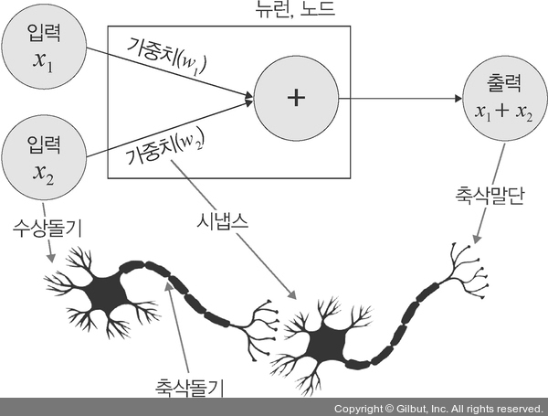

- 수상돌기: 주변이나 다른 뉴런에서 자극을 받아들이고, 이 자극들을 전기적 신호 형태로 세포체와 축삭돌기로 보내는 역할을 한다.
- 시냅스: 신경 세포들이 이루는 연결 부위로, 한 뉴런의 축삭돌기와 다음 뉴런의 수상돌기가 만나는 부분이다.
- 축삭돌기: 다른 뉴런 (수상돌기)에 신호를 전달하는 기능을 하는 뉴런의 한 부분이다. 뉴런에서 뻗어 있는 돌기 중 가장 길며, 한 개만 있다.
- 축삭말단: 전달된 전기 신호를 받아 신경 전달 물질을 시냅스 틈새로 방출한다.

### 3-1. 딥러닝 학습 과정

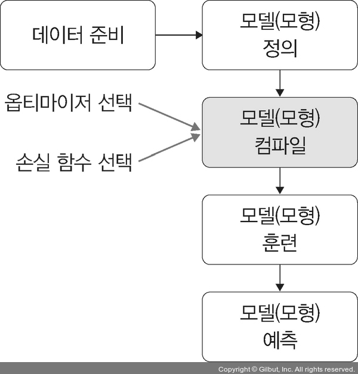

- 데이터 준비:
    - 파이토치나 케라스에서 제공하는 데이터셋을 사용할 수 있다.
    - 제공되는 데이터들은 이미 전처리를 했기에 바로 사용 가능하며, 수많은 예제 코드를 쉽게 구할 수 있다.
    - 캐글 (Kaggle) 같은 곳에 공개된 데이터를 사용할 수 있다.
    - 국내의 공개 데이터도 사용할 수 있으나, 상당히 많은 전처리를 해야 하기에 캐글 같은 플랫폼에 제공된 데이터 사용을 권장한다.
- 모델 (모형) 정의:
    - 모델 정의 단계에서는 신경망을 생성한다.
    - 은닉층 개수가 많을수록 성능이 좋아지지만 과적합이 발생할 확률이 높다.
    - 은닉충 개수에 따른 성능과 과적합은 상층 관계이다.
- 모델 (모형) 컴파일:
    - 컴파일 단계에서 활성화 함수, 손실 함수, 옵티마이저를 선택한다.
    - 데이터 형태에 따라 다양한 옵션이 가능하다.
    - 평균 제곱 오차 (Mean Squared Error, MSE): 훈련 데이터셋이 연속형이라면 사용
    - 크로스 엔트로피 (cross entropy): 이진 분류 (binary classification) 이라면 사용
    - 과적합을 피할 수 있는 활성화 함수 및 옵티마이저 선택이 중요하다.
- 모델 (모형) 훈련:
    - 한번에 처리할 데이터양을 지정한다.
    - 한번에 처리해야 할 데이터양이 많아지면 학습 속도가 느려지고, 메모리 부족 문제를 야기할 수 있다.
    - 전체 훈련 데이터셋에서 일정한 묶음으로 나누어 처리할 수 있는 배치와 훈련의 횟수인 에포크 선택이 중요하다.
    - 훈련 과정에서 값의 변화를 시각적으로 표현하여 눈으로 확인하면서 파라미터와 하이퍼파라미터에 대한 최적의 값을 찾을 수 있어야 한다.
    - 모델과 관련하여 훈련과 학습이라는 용어는 의미가 같기 때문에 책에서도 혼용하여 사용한다.
    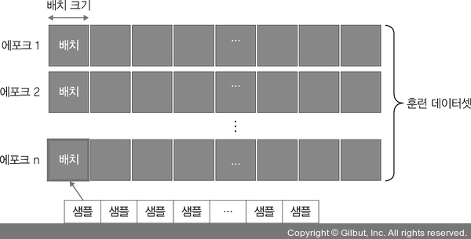
    - 훈련 데이터셋 1000개에 대한 배치 크기가 20이라면 샘플 단위 20개마다 모델 가중치를 한 번씩 업데이트시킨다는 의미
    - 총 50번의 가중치가 업데이트된다.
    - 이 때 에포크는 10이고 배치 크기가 20이라면 가중치를 50번 업데이트하는 것을 총 10번 반복한다는 의미이다.

> #### 성능이 좋다는 의미는?
> - 머신 러닝, 딥러닝에서 성능 (performance)에 대한 공식적인 정의는 없다.
> - 궁극적으로 모델 성능은 데이터가 수집된 산업 분야와 모델이 생성된 목적에 의존한다고 볼 수 있다.
> - 예측을 잘한다. (정확도가 높다.)
> - 훈련 속도가 빠르다.

- 모델 (모형) 예측:
    - 검증 데이터셋을 생성한 모델에 적용하여 실제로 예측을 진행해보는 단계이다.
    - 이 때 예측력이 낮다면 파라미터를 튜닝하거나 신경망 자체를 재설계해야 할 수 있다.
- 딥러닝 학습 과정에서 중요한 핵심 구성 요소는 신경망과 역전파이다.
- 심층 신경망에는 데이터셋의 어떤 특성들이 중요한지 스스로에게 가르쳐 줄 수 있는 기능이 있다.

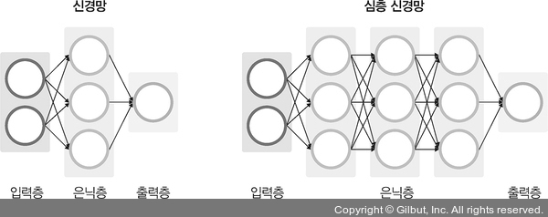

- 또한, 가중치 값을 업데이트하기 위한 역전파가 중요하다.
- 역전파 계산 과정에서 사용되는 미분이 성능에 영향을 미치는 주요한 요소이다.

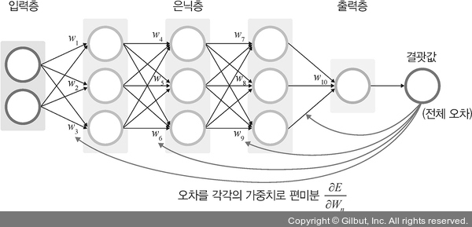

### 3-2. 딥러닝 학습 알고리즘
- 활용 분야에 따라 지도 학습, 비지도 학습, 전이 학습으로 분류된다.

#### 지도 학습
- 이미지 분류는 이미지 또는 비디오 상의 객체를 식별하는 컴퓨터 비전 기술이다.
- 컴퓨터 비전에 가장 많이 사용되는 것이 합성곱 신경망 (Convolutional Neural Network, CNN)
- 합성곱 신경망은 목적에 따라 이미지 분류, 이미지 인식, 이미지 분할로 분류할 수 있다.
    - 이미지 분류: 이미지를 알고리즘에 입력하면 그 이미지가 어떤 클래스에 속하는지 알려주기 때문에 말 그대로 이미지 데이터를 유사한 것끼리 분류할 때 사용한다.
    - 이미지 인식: 사진을 분석하여 그 안에 있는 사물의 종류를 인식하는 것으로, 의료 이미지에서 질병을 식별하거나 산업 검사 및 로봇 비전 등 다양한 분야에서 사용한다.
    - 이미지 분할: 영상에서 사물이나 배경 등 객체 간 영역을 픽셀 단위로 구분하는 기술로, X-ray, CT, MRI 등 다양한 의료 영상에서 분할된 이미지 정보를 활용하여 질병 진단 등에 사용한다.

^ 이미지 인식

- 시계열 데이터를 분류할 때 사용되는 것이 순환 신경망 (Recurrent Neural Network, RNN)이다.
- 주식 데이터처럼 시간에 따른 데이터가 있을 때 순환 신경망을 사용하지만, 역전파 과정에서 기울기 소멸 문제가 발생하는 단점이 있다.
- 이러한 문제를 개선하고자 게이트 (gate)를 세개 추가한 것이 LSTM (Long Short-Term Memory)
- 망각 게이트: 과거 정보를 잊기 위한 게이트
- 입력 게이트: 현재 정보를 기억하기 위한 게이트
- 출력 게이트: 최종 결과를 위한 게이트

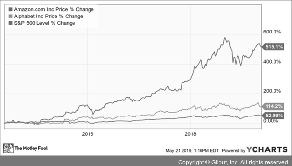
^ 주식에 대한 시계열 데이터

#### 비지도 학습
- 워드 임베딩과 군집이 있다.
- 자연어를 컴퓨터가 이해하고 효율적으로 처리하게 하려면 변환이 필요하다.
- 워드 임베딩 (word embedding) 기술로 단어를 벡터로 표현한다.
- 워드 임베딩에서는 단어 의미를 벡터화하는 워드투벡터 (Word2Vec)와 글로브 (GloVe)를 가장 많이 사용한다.
- 자연어 처리 분야의 번역이나 음성 인식 등 서비스에 사용한다.

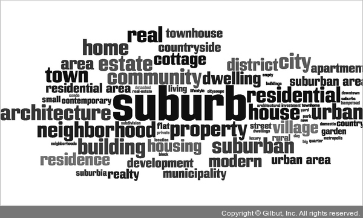
^ 워드 임베딩을 이용한 워드 클라우드

- 군집: 아무런 정보가 없는 상태에서 데이터를 분류하는 방법
- 한 클러스터 안의 데이터는 매우 비슷하게 구성하고 다른 클러스터의 데이터와 구분되도록 나누는 것이 목표
- 머신 러닝에서 군집화를 처리할 때 딥러닝과 함께 사용하면 모델 성능을 높일 수 있기에 같이 사용하면 좋다.

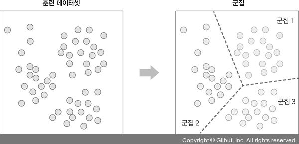

#### 전이 학습
- 사전에 학습이 완료된 모델을 가지고 우리가 원하는 학습에 미세 조정 기법을 이용하여 학습시키는 방법
- 사전에 학습이 완료된 모델이 필요하며, 어떻게 활용하는지에 대한 접근 방법이 필요하다.
- 사전 학습 모델: 풀고자 하는 문제와 비슷하면서 많은 데이터로 이미 학습이 되어 있는 모델
- VGG, 인셉션 (Inception), MobileNet 같은 사전 학습 모델을 사용하면 효율적인 학습이 가능하다.

#### 딥러닝 학습 별 알고리즘 정리

|구분|유형|알고리즘|
|:---:|:---:|:---:|
|지도 학습 (supervised learning)|이미지 분류|CNN|
|"|"|AlexNet|
|"|"|ResNet|
|"|시계열 데이터 분석|RNN|
|"|"|LSTM|
|비지도 학습 (unsupervised learnind)|군집 (clustering)|가우시안 혼합 모델 (Gaussian Mixture Model, GMM)|
|"|"|자기 조직화 지도 (Self-Organizing Map, SOM)|
|"|차원 축소|오토인코더 (AutoEncoder)|
|"|"|주성분 분석 (PCA)|
|전이 학습 (transfer learning)|전이 학습|버트 (BERT)|
|"|"|MobileNetV2|
|강화 학습 (reinforcement learning)|-|마르코프 결정 과정 (MDP)|