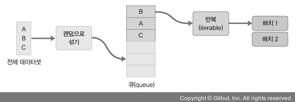

# Chapter 02: 실습 환경 설정과 파이토치 기초
## 01. 파이토치 개요
- 파이토치 (Pytorch): 2017년 초애 공개된 딥러닝 프레임워크로, 루아 (Lua) 언어로 개발되었던 토치 (Torch)를 페이스북에서 파이썬 버전으로 내놓은 것이다.
- 토치는 파이썬의 넘파이 (Numpy) 라이브러리처럼 과학 연산을 위한 라이브러리로 공개되었지만 발전하며 딥러닝 프레임워크로 변했다.
- 공식 튜토리얼에서 아래와 같이 소개한다.
    - 넘파이를 대체함면서 GPU를 이용한 연산이 필요한 경우
    - 최대한의 유연성과 속도를 제공하는 딥러닝 연구 플랫폼이 필요한 경우

### 1-1. 파이토치 특징 및 장점
- "GPU에서 텐서 조작 및 동적 신경망 구축이 가능한 프레임워크"
- GPU:
    - Graphics Processing Unit
    - 연산 속도를 빠르게 하는 역할을 한다.
    - 딥러닝에서 기울기를 계산할 때 미분을 쓰는데, GPU를 사용하면 빠른 계산이 가능
    - 내부적으로 CUDA, cuDNN이라는 API를 통해 GPU를 연산에 사용할 수 있다.
    - 병렬 연산에서 GPU의 속도는 CPU의 속도보다 훨씬 빠르므로 딥러닝 학습에서 GPU 사용은 필수이다.
- 텐서 (Tensor):
    - 텐서는 파이토치의 데이터 형태이다.
    - 텐서는 단일 데이터 형식으로 된 자료들의 다차원 행렬이다.
    - 간단한 명령어 (변수 뒤에 `.cuda()`를 추가)를 사용해서 GPU로 연산을 수행하게 할 수 있다.
- 동적 신경망:
    - 훈련을 반복할 대마다 네트워크 변경이 가능한 신경망을 의미한다.
    - ex: 학습 중에 은닉층을 추가하거나 제거하는 등 모델의 네트워크 조작이 가능하다.
    - 연산 그래프를 정의하는 것과 동시에 값도 초기화되는 "Define by Run" 방식을 사용한다.
    - 따라서 연산 그래프와 연산을 분리해서 생각할 필요가 없기 때문에 코드를 이해하기 쉽다.
    

> #### 벡터, 행렬, 텐서
> - 인공지능에서 데이터는 벡터로 표현된다.
> - 벡터는 숫자들의 리스트로, 1차원 배열 형태이다.
> - 행렬은 행과 열로 표현되는 2차원 배열 형태이다.
> - 가로줄을 행 (row), 세로줄을 열 (column)이라고 한다.
> - 텐서는 3차원 이상의 배열 형태이다.
> 
> - 행렬은 복수의 차원을 가지는 데이터 레코드의 집합이며, 하나의 데이터 레코드를 벡터 단독으로 나타낼 때는 아래와 같이 하나의 열로 표현한다.
> 
> - 반면 복수의 데이터 레코드 집합을 행렬로 나타낼 때는 아래와 같이 하나의 데이터 레코드가 하나의 행으로 표기된다.
> 
> - 즉 행렬의 일반적인 표현은 아래와 같다.
> 
> - 텐서는 행렬의 다차원 표현이라고 생각하면 쉽다. 같은 크기의 행렬이 여러 개 묶여 있는 것으로 아래와 같이 표현할 수 있다.
> 

> #### 연산 그래프
> - 연산 그래프는 방향성이 있으며, 변수를 의미하는 노드와 연산을 담당하는 엣디로 구성된다.
> - 아래와 같이 노드는 변수 (a, b) 를 가지고 있으며, 각 계산을 통해 새로운 텐서 (c, d, e) 를 구성할 수 있다.
> 
> - 신경망은 연산 그래프를 이용해 계산을 수행한다.
> - 네트워크가 학습될 때 손실 함수의 기울기가 가중치와 바이어스를 기반으로 계산되며 이후 경사 하강법을 사용하여 가중치가 업데이트된다.
> - 이 때 연산 그래프를 이용해 이 과정이 효과적으로 수행된다.

- 파이토치는 효율적인 게산, 낮은 CPU 활용, 직관적인 인터페이스와 낮은 진입 장벽 등을 장점으로 꼽는다.
- 단순함 (효율적인 계산)
    - 파이썬 환경과 쉽게 통합 가능
    - 디버깅이 직관적이고 간결
- 성능 (낮은 CPU 활용)
    - 모델 훈련을 위한 CPU 사용이 텐서플로와 비교하여 낮다.
    - 학습 및 추론 속도가 빠르고 다루기 쉽다.
- 직관적인 인터페이스
    - 텐서플로처럼 잦은 API 변경이 없어 배우기 쉽다.

### 1-2. 파이토치의 아키텍쳐
- 가장 상위 계층: 파이토치 API
- 다음 계층: 파이토치 엔진 (다차원 텐서 및 자동 미분 처리)
- 가장 아래 계층: 텐서에 대한 연산 처리. CPU/GPU를 이용하는 텐서의 실질적인 계산을 위한 C, CUDA 등 라이브러리가 위치


#### 파이토치 API
- 사용자가 이해하기 쉬운 API를 제공하여 텐서에 대한 처리와 신경망을 구축하고 훈련할 수 있도록 돕는다.
- 사용자 인터페이스를 제공하지만 실제 계산은 수행하지 않는다.
- C++로 작성된 파이토치 엔진으로 그 작업을 전달하는 역할만 한다.
- 사용자 편의성을 위해 아래 패키지들이 제공된다.

> #### `torch`: GPU를 지원하는 텐서 패키지
> - 다차원 텐서를 기반으로 다양한 수학적 연산이 가능하도롣 한다.
> - CPU 뿐만 아니라 GPU에서 연산이 가능하므로 빠른 속도로 많은 양의 계산이 가능하다.
>
> #### `torch.autograd`: 자동 미분 패키지
> - 텐서플로, 카페, CNTK 같은 다른 딥러닝 프레임워크와 가장 차별되는 패키지이다.
> - 자동 미분 기술을 채택하여 미분 계산을 효율적으로 처리한다.
> - 연산 그래프가 즉시 계산 (실시간으로 네트워크 수정이 반영된 계산)되기 때문에 사용자는 다양한 신경망을 적용해 볼 수 있다.
>
> #### `torch.nn`: 산경망 구축 및 훈련 패키지
> - 신경망을 쉽게 구축하고 사용할 수 있게 한다.
> - 합성곱 신경망, 순환 신경망, 정규화 등이 포함되어 손쉽게 신경망을 구축하고 학습시킬 수 있다.
>
> #### `torch.multiprocessing`: 파이썬 멀티 프로세싱 패키지
> - 파이토치에서 사용하는 프로세스 전반에 걸쳐 텐서의 메모리 공유가 가능하다.
> - 서로 다른 프로세스에서 동일한 데이터(텐서)에 대한 접근 및 사용이 가능하다.
>
> #### `torch.utils`: DataLoader 및 기타 유틸리티를 제공하는 패키지
> - 모델에 데이터를 제공하기 위한 `torch.utils.data.DataLoader` 모듈을 주로 사용한다.
> - 병목 현상 디버깅을 위한 `torch.utils.bottleneck`, 모델 또는 일부를 검사하기 위한 `torch.utils.checkpoint` 등의 모듈도 있다.

#### 파이토치 엔진
- Autograd C++, Aren C++, JIT C++, Python API로 구성되어 있다.
- Autograd C++: 가중치, 바이어스를 업데이트하는 과정에서 필요한 미분을 자동으로 계산해주는 역할을 한다.
- Aren C++: C++ 텐서 라이브러리를 제공한다.
- JIT C++: 계산을 최적화하기 위한 JIT(Just In-Time) 컴파일러이다.
- 파이토치 엔진 라이브러리는 C++로 감싼 후 Python API 형태로 제공되기 때문에 사용자들이 손쉽게 모델을 구축하고 텐서를 사용할 수 있다.


#### 연산 처리
- C 또는 CUDA 패키지는 상위의 API에서 할당된 거의 모든 계산을 수행한다.
- 여기서 제공되는 패키지는 CPU와 GPU(TH(토치), THC(토치 CUDA))를 이용하여 효율적인 데이터 구조, 다차원 텐서에 대한 연산을 처리한다.

> #### 텐서를 메모리에 저장하기
> - 텐서의 차원에 관계없이 메모리에 저장할 때는 1차원 배열 형태가 된다.
> - 1차원 배열 형태여야만 메모리에 저장할 수 있다.
> - 이렇게 변환된 1차원 배열을 스토리지(storage)라고 한다.
> - 오프셋(offset): 텐서에서 첫번째 요소가 스토리지에 저장된 인덱스
> - 스트라이드(stride): 각 차원에 따라 다음 요소를 얻기 위해 건너뛰기가 필요한 스토리지의 요소 개수
> - 스트라이드는 메모리에서의 텐서 레이아웃을 표현하는 것으로 이해하면 된다.
> - 요소가 연속적으로 저장되기 때문에 행 중심으로 스트라이드는 항상 1이다.
> - 전치 행렬을 간단히 설명하면, A 행렬에서 첫번째 열을 첫번째 행으로 위치시키고, 두번째 열을 두번째 행으로 위치시키며, A^T로 표현한다.
> 
> 
> #### 오프셋, 스트라이드와의 관계
> - 극적인 효과를 위해 행과 열의 수가 다른 A, A^T 준비한다.
> - 이를 1차원 배열로 바꾸어 메모리에 저장시키기 위해 텐서의 값들을 연속적으로 배치하겠다.
> 
> - 두 행렬은 다른 형태를 갖지만 스토리지의 값들은 서로 같다.
> - 두 행렬을 구분하는 용도로 오프셋과 스트라이드를 사용한다.
> - 아래 그림에서 스토리지에서 2를 얻기 위해서는 1에서 1칸을 뛰어넘어야 하고, 4를 얻기 위해서는 3을 뛰어넘어야 한다. 따라서 텐서에 대한 스토리지의 스트라이드는 (3, 1)이다.
> 
> - A의 전치 행렬은 다르다.
> - 아래 그림에서 스토리지에서 4를 얻기 위해서는 1에서 1칸을 뛰어넘어야 하고, 2를 얻기 위해서는 2를 뛰어넘어야 한다. 따라서 텐서에 대한 스토리지의 스트라이드는 (2, 1)이다.
> 

## 02. 파이토치 기초 문법
- 파이토치는 텐서를 잘 다뤄야 문제 해결이 가능하고, 신경망에서 데이터 입력과 출력도 제어할 수 있다.

### 2-1. 텐서 다루기
#### 텐서 생성 및 변환
- 텐서는 파이토치의 가장 기본이 되는 데이터 구조이다.
- 텐서 생성은 아래와 같은 코드를 사용한다.
```py
import torch

# 2차원 형태의 텐서 생성
print(torch.tensor([[1, 2], [3, 4]]))

# GPU에 텐서 생성
print(torch.tensor([[1, 2], [3, 4]], device="cuda:0"))

# dtype을 이용하여 텐서 생성
print(torch.tensor([[1, 2], [3, 4]], dtype=torch.float64))
```
- 아래는 생성된 텐서의 결과이다.
```
tensot([[1, 2],
    [3, 4]])

tensor([[1., 2.],
    [3., 4.]], dtype=torch.float64)
```
- 텐서를 `ndarray`로 변환해보자.
```py
temp = torch.tensor([[1, 2], [3, 4]])

# 텐서를 ndarray로 변환
print(temp.numpy())

temp = torch.tensor([[1, 2], [3, 4]], device="cuda:0")

# GPU 상의 텐서를 CPU의 텐서로 변환 후 ndarray로 변환
print(temp.to("cpu").numpy())
```
- 아래는 변환한 결과이다.
```
[[1 2]
[3 4]]

[[1 2]
[3 4]]
```

##### 텐서의 인덱스 조작
- 텐서는 넘파이의 `ndarray`를 조작하는 것과 유사하게 동작하기 때문에 배열처럼 인덱스를 바로 지정하거나 슬라이스 등을 사용할 수 있다.
- 텐서의 자료형:
    - `torch.FloatTensor`: 32비트의 부동 소수점
    - `torch.DoubleTensor`: 64비트의 부동 소수점
    - `torch.LongTensor`: 64비트의 부호가 있는 정수
    - 이외에도 다양하다.
- 텐서의 인덱스 조작 코드는 아래와 같이 사용한다.
```py
# 파이토치로 1차원 벡터 생성
temp = torch.FloatTensor([1, 2, 3, 4, 5, 6, 7])

# 인덱스로 접근
print(temp[0], temp[1], temp[-1])
print("-" * 30)

# 슬라이스로 접근
print(temp[2:5], temp[4:-1])
```
- 인덱스 조작 결과는 아래와 같다.
```
tensor(1.) tensor(2.) tensor(7.)
------------------------------
tensor([3., 4., 5.]) tensor([5., 6.])
```

#### 텐서의 연산
- 다양한 수학 연산이 가능하며, GPU를 사용하면 더 빠른 연산이 가능하다.
- 텐서 간의 타입이 다르면 연산이 불가하다.
- 두 벡터를 생성해 사칙 연산을 해보자.
```py
# 길이가 3인 벡터 생성
v = torch.tensor([1, 2, 3])
w = torch.tensor([3, 4, 6])

# 길이가 같은 벡터 간 뺄셈 연산
print(w - v)
```
- 위 코드의 실행 결과
```
tensor([2, 2, 3])
```

#### 텐서의 차원 조작
- 차원을 변경하는 가장 대표적인 방법은 `view`를 이용하는 것이다.
- 텐서를 결합하는 `stack`, `cat`과 차원을 교환하는 `t.transpose` 등이 있다.
- `view`는 넘파이의 `reshape`와 유사하다.
- `cat`은 다른 길이의 텐서를 하나로 병합할 때 사용한다.
- `transpose`는 행렬의 전치 외에도 차원의 순서를 변경할 때도 사용된다.
```py
# 2X2 행렬 생성
temp = torch.tensor([
    [1, 2], [3, 4]
])

print(temp.shape)
print("-" * 30)

# 2X2 행렬을 4X1로 변형
print(temp.view(4, 1))
print("-" * 30)

# 2X2 행렬을 1차원 벡터로 변형
print(temp.view(-1))
print("-" * 30)

# -1은 (1, ?)와 같은 의미로, 다른 차원으로부터 해당 값을 유추하겠다는 뜻
# temp의 원소 개수(2x2=4)를 유지한 채 (1, ?)의 형태를 만족해야 하므로 (1, 4)가 된다.
print(temp.view(1, -1))
print("-" * 30)

# 앞에서와 마찬가지로 (?, 1)의 의미로, temp의 원소 개수를 유지한 채 (?, 1)의 형태를 만족해야 하므로 (4, 1)가 된다.
print(temp.view(-1, 1))
```
- 위 코드 실행 결과
```
torch.Size([2, 2])
------------------------------
tensor([[1],
    [2],
    [3],
    [4]])
------------------------------
tensor([1, 2, 3, 4])
------------------------------
tensor([[1, 2, 3, 4]])
------------------------------
tensor([[1],
    [2],
    [3],
    [4]])
```

### 2-2. 데이터 준비
- 데이터 호출에는 파이썬 라이브러리 (판다스(pandas))를 이용하는 방법과 파이토치에서 제공하는 데이터를 이용하는 방법이 있다.
- 데이터가 이미지인 경우 분산된 파일에서 데이터를 읽은 후 전처리를 하고 배치 단위로 분할하여 처리한다.
- 데이터가 텍스트인 경우 임베딩 과정을 거쳐 서로 다른 길이의 시퀀스를 배치 단위로 분할하여 처리한다.

#### 단순하게 파일을 불러와서 사용
- 판다스 라이브러리를 이용해 JSON, PDF, CSV 등의 파일을 불러오는 방법이다.
- 먼저 필요한 라이브러리를 터미널 명령으로 설치한다.
```
pip install pandas
```
- 설치 이후 라이브러리를 호출한다.
```py
# pandas 라이브러리, torch 라이브러리 호출
import pandas as pd
import torch

# csv 파일을 불러온다.
data = pd.read_csv("../class2.csv")

# csv 파일의 x, y 칼럼의 값을 넘파이 배열로 받아 Tensor(dtype)으로 바꾼다.
x = torch.from_numpy(data['x'].values).unsqeeze(dim=1).float()
y = torch.from_numpy(data['y'].values).unsqeeze(dim=1).float()
```

#### 커스텀 데이터셋을 만들어서 사용
- 데이터를 한번에 메모리에 불러와 훈련 시키는 것은 비효율적이다.
- 따라서 조금씩 나누어 불러 사용하는 방식이 커스텀 데이터셋 (custom dataset)이다.
- 먼저 `CustomDataset` 클래스를 구현하기 위해 아래의 형태를 취해야 한다.
```py
class CustomDataset(torch.utils.data.Dataset):

    # 필요한 변수를 선언하고, 데이터셋의 전처리를 해주는 함수
    def __init__(self):
        pass

    # 데이터셋의 길이, 즉, 총 샘플의 수를 가져오는 함수
    def __len__(self):
        pass
    
    # 데이터셋에서 특정 데이터를 가져오는 함수 (index번째 데이터를 반환하는 함수이며, 텐서의 형태를 취해야 한다.)
    def __getitem__(self, index):
        pass
```
- 아래는 전체 예제 코드이다.
```py
import pandas as pd
import torch
from torch.utils.data import Dataset
from torch.utils.data import DataLoader

class CustomDataset(Dataset):

    # csv_file 파라미터를 통해 데이터셋을 불러온다.
    def __init__(self, csv_file):
        self.label = pd.read_csv(csv_file)

    # 전체 데이터셋의 크기 (size)를 반환한다.
    def __len__(self):

        return len(self.label)
    
    # 전체 x와 y 데이터 중에 해당 idx 번째 데이터를 가져온다.
    def __getitem__(self, idx):
        sample = torch.tensor(self.label.iloc[idx, 0:3]).int()
        label = torch.tensor(self.label.iloc[idx, 3]).int()

        return sample, label

# 데이터셋으로 covtype.csv를 사용한다.
tensor_dataset = CustomDataset("../covtype.csv")

# 데이터셋을 torch.utils.data.DataLoader에 파라미터로 전달한다.
dataset = DataLoader(tensor_dataset, batch_size=4, shuffle=True)
```

> #### `torch.utils.data.DataLoader`
> - 데이터로더(DataLoader) 객체는 학습에 사용될 데이터 전체를 보관했다가 모델 학습을 할 때 배치 크기만큼 데이터를 꺼내서 사용한다.
> - 이때 주의할 것은 데이터를 미리 잘라 놓는 것이 아니라 내부적으로 반복자(iterator)에 포함된 인덱스(index)를 이용하여 배치 크기만큼 데이터를 반환한다는 것이다.
> 
> - 데이터로더는 아래와 같이 `for` 문을 이용해 구문을 반복 실행하는 것과 같다.
> ```py
> for i, data in enumerate(dataset, 0):
>    print(i, end='')
>    batch=data[0]
>    print(batch.size())
> ```
> - 출력은 아래와 같다.
> ```
> 0torch.Size([4, 3])
> 1torch.Size([4, 3])
> 2torch.Size([4, 3])
> 3torch.Size([4, 3])
> 4torch.Size([3, 3])
> ```

#### 파이토치에서 제공하는 데이터셋 사용
- 토치비전(torchvision)은 파이토치에서 제공하는 데이터셋들이 모여 있는 패키지이다.
- MNIST, ImageNet을 포함한 유명한 데이터셋들을 제공하고 있다.
- 다음 URL에서 파이토치에서 제공하는 데이터셋을 확인할 수 있다.
- https://pytorch.org/vision/0.8/datasets.html
- 파이토치에서 제공하는 데이터셋을 내려받으려면 먼저 `requests` 라이브러리를 설치해야 한다.
- `requests`는 HTTP 요청에 대한 처리를 위해 사용하며, 기본 내장 모듈이 아니기 때문에 필요하다면 별도로 설치해야 한다.
```
pip install requests
```
- 아래는 MNIST 데이터셋을 내려받는 예제이다.
```py
import torchvision.transforms as transforms

# 평균이 0.5, 표준편차가 1.0이 되도록 데이터의 분포(normalize)를 조정
mnist_transform = transforms.Compose([
    transforms.ToTensor(),
    transforms.Normalize((0.5,), (1.0,))
])

from torchvision.datasets import MNIST
import requests

# 내려받을 경로 지정
download_root = '../chap02/data/MNIST_DATASET'

# 훈련(training) 데이터셋
train_dataset = MNIST(download_root, transform=mnist_transform, train=True, download=True)

# 검증(validation) 데이터셋
valid_dataset = MNIST(download_root, transform=mnist_transform, train=False, download=True)

# 테스트(test) 데이터셋
test_dataset = MNIST(download_root, transform=mnist_transform, train=False, download=True)
```
- 코드를 실행하면 데이터셋을 내려받는다.