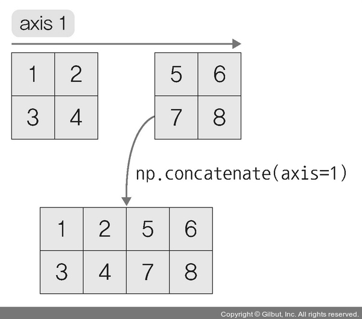
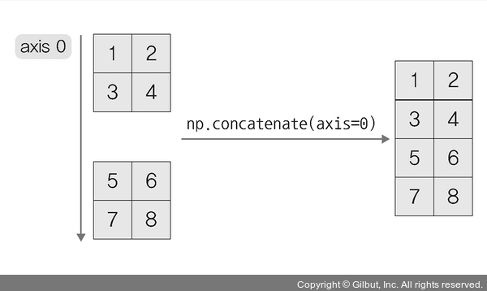
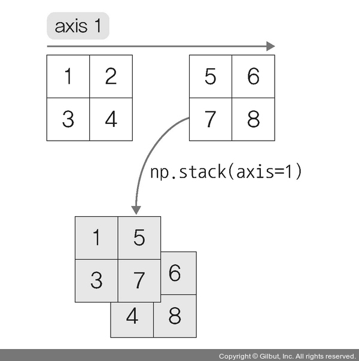
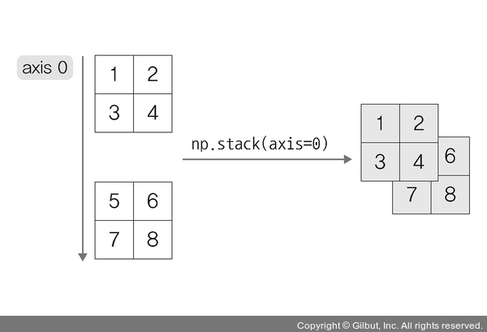
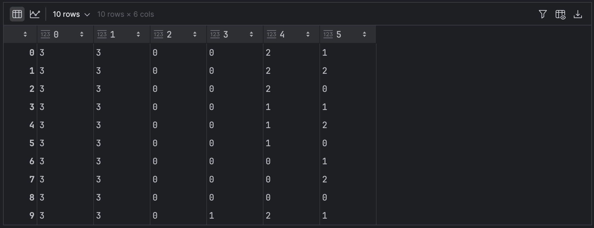
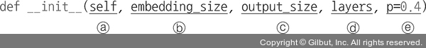
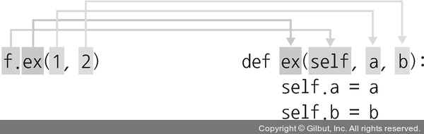
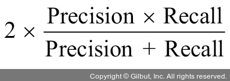

# Chapter 02: 실습 환경 설정과 파이토치 기초
## 03. 실습 환경 설정
### 3-1. 아나콘다 설치
- 아나콘다 내려받기 페이지에서 아나콘다 인스톨러 3.12버전을 내려받는다.
- [아나콘다 다운로드 페이지](https://www.anaconda.com/download)
- 내려받은 인스톨러를 통해 아나콘다를 설치한다.
- 설치가 완료되면 터미널을 열어 아래 명령을 실행하여 새로운 경로를 적용한다.
```
source .bash_profile
```

### 3-2. 가상 환경 생성 및 파이토치 설치
- 다음 명령을 실행하여 아나콘다 환경을 만든다.
```
conda create -n torch_book python=3.9
```
- 생성된 가상 환경 확인
```
conda env list

# conda environments:
#
base                  *  /opt/anaconda3
torch_book               /opt/anaconda3/envs/torch_book
tutorial                 /opt/anaconda3/envs/tutorial
```
- 가상 환경을 활성화한다.
```
source activate torch_book
```
- 가상 환경을 삭제하려면 아래 명령을 사용한다.
```
conda env remove -n torch_book
```
- 가상 환경에 커널을 설치한다.
```
pip install ipykernel
```
- 가상 환경에 커널을 연결하기 위해 아래 명령을 실행한다.
```
python -m ipykernel install --user --name torch_book --display-name "torch_book"
```

#### 파이토치 설치하기
- 아나콘다 프롬프트에서 다음 명령들을 입력하여 파이토치를 설치할 수 있다(다음과 같이 특정 버전을 지정하여 설치해도 무방합니다).
- 책에서는 현재 시점의 최신 버전인 1.9.0 버전을 설치한다.
- 사용하는 환경이 CPU라면 다음 명령으로 설치한다.
```
conda install pytorch torchvision torchaudio -c pytorch
```
- 혹은 아래의 명령으로 설치한다.
```
pip install torch==1.9.0 torchvision==0.10.0 torchaudio==0.9.0
```
- 마지막으로 주피터 노트북을 설치한다.
```
pip install jupyter notebook
```
- 가상 환경에서 아래 명령으로 주피터 노트북을 실행할 수 있다.
```
jupyter notebook
```

## 04. 파이토치 코드 맛보기
- 파이토치를 사용해 간단한 분류 및 회귀 모델을 개발하는 방법을 보자.
- 사전에 다운받은 예제 파일 `car_evaluation.csv`을 데이터셋으로 사용하며, 아래와 같이 특성 일곱 개로 구성되어 있다.
    1. price(자동차 가격)
    2. maint(자동차 유지 비용)
    3. doors(자동차 문 개수)
    4. persons(수용 인원)
    5. lug_capacity(수하물 용량)
    6. safety(안전성)
    7. output(차 상태): 이 데이터는 unacc(허용 불가능한 수준) 및 acc(허용 가능한 수준), 양호(good) 및 매우 좋은(very good, vgood) 중 하나의 값을 갖는다.
- 1~6 칼럼의 정보를 이용해 7번 칼럼을 예측하는 코드를 구현해보자.
- 필요한 라이브러리 먼저 설치한다.
```
pip install matplotlib
pip install seaborn
pip install scikit-learn
```
- 이미 설치되어 있다면 아래 명령으로 업그레이드를 진행한다.
```
pip install --upgrade matplotlib --use-feature=2020-resolver
pip install --upgrade seaborn --use-feature=2020-resolver
pip install --upgrade scikit-learn --use-feature=2020-resolver
```

> #### 설치한 라이브러리
> 1. `matplotlib`: 수많은 파이썬 라이브러리 중에서 2D, 3D 형태의 플롯(그래프)을 그릴 때 주로 사용하는 패키지(모듈)
> 2. `seaborn`: 데이터 프레임으로 다양한 통계 지표를 표현할 수 있는 시각화 차트를 제공하기 때문에 데이터 분석에 활발히 사용되는 라이브러리
> 3. `scikit-learn`: 분류(classification), 회귀(regression), 군집(clustering), 의사 결정 트리(decision tree) 등 다양한 머신 러닝 알고리즘을 적용할 수 있는 함수를 제공하는 머신 러닝 라이브러리

#### 코드 작성하기
- 필요한 라이브러리를 호출한다.
```py
# 2-1. 필요한 라이브러리 호출

import torch
import torch.nn as nn
import numpy as np
import pandas as pd
import matplotlib.pyplot as plt
import seaborn as sns
%matplotlib inline
```
- 다운받은 데이터를 불러온다.
```py
# 2-2. 데이터 호출

dataset = pd.read_csv("../080289/chap02/data/car_evaluation.csv")
dataset.head()
```
- `dataset.head()`: 데이터프레임 내의 처음 n줄을 출력하여 데이터의 내용을 확인할 수 있다.
- n의 기본값은 5이다.
- 출력 결과는 아래와 같다.


- 컴퓨터는 자연어를 인식할 수 없기 때문에 단어를 벡터로 바꿔주는 임베딩 처리가 필요하다.
- 주어진 데이터셋을 이해하기 쉽게 분포 형태로 시각화하여 표현하면 아래와 같다.
```py
# 2-3. 예제 데이터셋 분포

fig_size = plt.rcParams["figure.figsize"]
fig_size[0] = 8
fig_size[1] = 6
plt.rcParams["figure.figsize"] = fig_size
dataset.output.value_counts().plot(
    kind='pie',
    autopct='%0.05f%%',
    colors=['lightblue', 'lightgreen', 'orange', 'pink'],
    explode=(0.05, 0.05, 0.05, 0.05))
```
- 실행하면 아래처럼 출력된다.


- 딥러닝은 통계 알고리즘을 기반으로 하기 때문에 단어를 숫자(텐서)로 변환해야 한다.
- 가장 먼저 필요한 전처리는 데이터를 파악하는 것이다.
- 주어진 데이터의 형태를 파악한 후 숫자로 변환해 주어야 하는데, 예제에서 다루는 데이터의 칼럼들은 모두 범주형 데이터로 구성되어 있다.
- 아래 코드로 단어를 배열로 변환해보자.
- 분석하기 좋게 데이터를 고치는 데이터 전처리(preprocessing)를 해야 한다.
- 먼저 `astype()` 메서드를 이용하여 범주 특성을 갖는 데이터를 범주형(category) 타입으로 변환한다.
- 파이토치를 이용한 모델 학습을 해야 하므로 범주형 타입을 텐서로 변환한다.
```py
# 2-4. 데이터를 범주형 타입으로 변환

categorical_columns = ['price', 'maint', 'doors', 'persons', 'lug_capacity', 'safety']

for category in categorical_columns:
    dataset[category] = dataset[category].astype('category')

# (1)
price = dataset['price'].cat.codes.values
maint = dataset['maint'].cat.codes.values
doors = dataset['doors'].cat.codes.values
persons = dataset['persons'].cat.codes.values
lug_capacity = dataset['lug_capacity'].cat.codes.values
safety = dataset['safety'].cat.codes.values

# (2)
categorical_data = np.stack([price, maint, doors, persons, lug_capacity, safety], 1)
categorical_data[:10]
```

#### (1)번 코드 설명
- 범주형 데이터를 텐서로 변환하기 위한 절차:
    - 범주형 데이터 → dataset[category] → 넘파이 배열(NumPy array) → 텐서(Tensor)
- 파이토치로 모델을 학습시키기 위해서는 텐서 형태로 변환해야 하는데, 넘파이 배열을 통해 텐서를 생성할 수 있다.
- 범주형 데이터(단어)를 숫자(넘파이 배열)로 변환하기 위해 `cat.codes`를 사용한다.
- `cat.codes`는 어떤 클래스가 어떤 숫자로 매핑되어 있는지 확인이 어려운 단점이 있다.

#### (2)번 코드 설명
- `np.stack`은 두 개 이상의 넘파이 객체를 합칠 때 사용한다.

> #### `np.stack`과 `np.concatenate`
> - 넘파이 객체를 합칠 때 사용하는 메서드로는 `np.stack`과 `np.concatenate`가 있다.
> - 이 두 메서드는 차원의 유지 여부에 대한 차이가 있다.
> - `np.concatenate`는 아래 그림과 같이 선택한 축(axis)을 기준으로 두 개의 배열을 연결한다.
> 
> 
> - `np.stack`은 배열들을 새로운 축으로 합친다.
> - 예를 들어 1차원 배열들을 합쳐서 2차원 배열을 만들거나 2차원 배열 여러 개를 합쳐 3차원 배열을 만든다.
> - 따라서 반드시 두 배열의 차원이 동일해야 한다.
> 
> 
> - 코드를 통해서 둘의 차이를 보자.
> - 먼저 임의의 넘파이 배열 a, b, c를 정의한다.
> - 이때 c는 다른 차원으로 정의하고, 같은 차원을 갖는 a와 b에 대해 `np.concatenate`와 `np.stack`을 적용한다.
> ```py
> # a.shape=(2, 2)
> a = np.array([[1, 2], [3, 4]])
> # b.shape=(2, 2)
> b = np.array([[5, 6], [7, 8]])
> # c.shape=(3, 2)
> c = np.array([[5, 6], [7, 8], [9, 10]])
> 
> # shape=(4, 2)
> print(np.concatenate((a, b), axis=0))
> print('-------------------------------')
> # shape=(2, 2, 2)
> print(np.stack((a, b), axis=0))
> ```
> - 아래는 `np.concatenate`와 `np.stack`을 적용한 결과이다.
> - 차원이 같기 때문에 오류 없이 결과를 출력하고 있으며, `np.stack`의 경우에는 (2, 2, 2)로 차원이 변경된 것을 확인할 수 있다.
> ```
> [[1 2]
>  [3 4]
>  [5 6]
>  [7 8]]
> -------------------------------
> [[[1 2]
>  [3 4]]
> 
> [[5 6]
>  [7 8]]]
> ```
> - 이번에는 서로 다른 차원을 합쳐 보자.
> - 먼저 `np.concatenate`를 적용한다.
> ```py
> # shape=(5, 2)
> print(np.concatenate((a, c), axis=0))
> ```
> - 아래와 같이 출력된다.
> ```
> [[ 1 2]
>  [ 3 4]
>  [ 5 6]
>  [ 7 8]
>  [ 9 10]]
> ```
> - 이번에는 `np.stack`을 적용한다.
> ```py
> print(np.stack((a, c), axis=0))
> ```
> - `np.stack`은 합치려는 두 넘파이 배열의 차원이 다르기 때문에 오류가 발생한다.
> ```
> ValueError: all input arrays must have the same shape
> ```
- 출력 결과는 아래와 같다.



- 이제 torch 모듈을 이용하여 배열을 텐서로 변환한다.
```py
# 2-5. 배열을 텐서로 변환

categorical_data = torch.tensor(categorical_data, dtype=torch.int64)
categorical_data[:10]
```
- 텐서로 변환한 결과에 대한 출력은 아래와 같다.


- 마지막으로 레이블(outputs)로 사용할 칼럼에 대해서도 텐서로 변환한다.
- 이번에는 `get_dummies`를 이용하여 넘파이 배열로 변환한다.
```py
# 2-6. 레이블로 사용할 칼럼을 텐서로 변환

outputs = pd.get_dummies(dataset.output)
outputs = outputs.values
outputs = torch.tensor(outputs).flatten()

print(categorical_data.shape)
print(outputs.shape)
```
- 실행 시 텐서로 변환한 범주형 데이터와 레이블에 대한 형태가 출력된다.
```
torch.Size([1728, 6])
torch.Size([6912])
```
- `get_dummies`는 가변수(dummy variable)로 만들어 주는 함수다.
- 가변수로 만들어 준다는 의미는 문자를 숫자 (0, 1)로 바꾸어 준다는 의미다.

> #### `ravel()`, `reshape()`, `flatten()`
> - `ravel()`, `reshape()`, `flatten()`은 텐서의 차원을 바꿀 때 사용한다.
> - 이 메서드들은 아래과 같이 사용할 수 있다.
> ```py
> a = np.array([[1, 2], [3, 4]])
> print(a.ravel())
> print(a.reshape(-1))
> print(a.flatten())
> ```
> - 코드를 실행하면 다음과 같이 2차원 텐서가 1차원으로 변경되어 출력된다.
> ```
> [1 2 3 4]
> [1 2 3 4]
> [1 2 3 4]
> ```
- 워드 임베딩은 유사한 단어끼리 유사하게 인코딩되도록 표현하는 방법이다.
- 또한, 높은 차원의 임베딩일수록 단어 간의 세부적인 관계를 잘 파악할 수 있으므로, 단일 숫자로 변환된 넘파이 배열을 N차원으로 변경하여 사용한다.
- 배열을 N차원으로 변환하기 위해 먼저 모든 범주형 칼럼에 대한 임베딩 크기(벡터 차원)를 정의한다.
- 임베딩 크기에 대한 정확한 규칙은 없지만, 칼럼의 고유 값 수를 2로 나누는 것을 많이 사용한다.
- 예를 들어 price 칼럼은 네 개의 고유 값을 갖기 때문에 임베딩 크기는 4/2=2이다.
- 아래 코드를 이용하여 (모든 범주형 칼럼의 고유 값 수, 차원의 크기) 형태로 배열을 만든다.
```py
# 2-7. 범주형 칼럼을 N차원으로 변환

categorical_column_sizes = [len(dataset[column].cat.categories)
    for column in categorical_columns]
categorical_embedding_sizes = [(col_size, min(50, (col_size + 1) // 2))
    for col_size in categorical_column_sizes]
print(categorical_embedding_sizes)
```
- (모든 범주형 칼럼의 고유 값 수, 차원의 크기) 형태의 배열을 출력한 결과는 아래와 같다.
```
[(4, 2), (4, 2), (4, 2), (3, 2), (3, 2), (3, 2)]
```
- 데이터셋을 훈련과 테스트 용도로 분리한다.
```py
# 2-8. 데이터셋 분리

total_records = 1728
test_records = int(total_records * .2)

categorical_train_data = categorical_data[:total_records - test_records]
categorical_test_data = categorical_data[total_records - test_records:total_records]
train_outputs = outputs[:total_records - test_records]
test_outputs = outputs[total_records - test_records:total_records]
```
- 데이터를 훈련과 테스트 용도로 올바르게 분할했는지 확인하기 위해 레코드 개수를 출력한다.
```py
# 2-9. 데이터셋 분리 확인

print(len(categorical_train_data))
print(len(train_outputs))
print(len(categorical_test_data))
print(len(test_outputs))
```
- 출력 결과는 아래와 같다.
```
1383
1383
345
345
```
- 데이터 준비가 끝났으므로 모델의 네트워크를 생성한다.
```py
# 2-10. 모델의 네크워크 생성

class Model(nn.Module):
    def __init__(self, embedding_size, output_size, layers, p=0.4):
        super().__init__()
        self.all_embeddings = nn.ModuleList(
            [nn.Embedding(ni, nf)
             for ni, nf in embedding_size]
        )
        self.embedding_dropout = nn.Dropout(p)

        all_layers = []
        num_categorical_cols = sum((nf for ni, nf in embedding_size))
        
        # 입력층의 크기를 찾기 위해 범주형 칼럼 개수를 input_size 변수에 저장
        input_size = num_categorical_cols

        for i in layers:
            all_layers.append(nn.Linear(input_size, i))
            all_layers.append(nn.ReLU(inplace=True))
            all_layers.append(nn.BatchNorm1d(i))
            all_layers.append(nn.Dropout(p))
            input_size = i

        all_layers.append(nn.Linear(layers[-1], output_size))
        
        # 신경망의 모든 계층이 순차적으로 실행되도록 모든 계층에 대한 목록을 nn.Sequential 클래스로 전달
        self.layers = nn.Sequential(*all_layers)


    def forward(self, x_categorical):
        embeddings = []

        for i, e in enumerate(self.all_embeddings):
            embeddings.append(e(x_categorical[:, i]))
        
        # 넘파이의 concatenate와 같지만 대상이 텐서가 된다.
        x = torch.cat(embeddings, 1)
        x = self.embedding_dropout(x)
        x = self.layers(x)

        return x
```
- 클래스(class) 형태로 구현되는 모델은 `nn.Module`을 상속받는다.
- `__init__()`은 모델에서 사용될 파라미터와 신경망을 초기화하기 위한 용도로 사용하며, 객체가 생성될 때 자동으로 호출된다.
- `__init__()`에서 전달되는 매개변수는 아래와 같다.



1. `self`: 첫 번째 파라미터는 self를 지정해야 하며 자기 자신을 의미한다. 예를 들어 ex라는 함수가 있을 때 self 의미는 아래와 같다.



2. `embedding_size`: 범주형 칼럼의 임베딩 크기
3. `output_size`: 출력층의 크기
4. `layers`: 모든 계층에 대한 목록
5. `p`: 드롭아웃(기본값은 0.5)

- `super().__init__()`은 부모 클래스(Model 클래스)에 접근할 때 사용하며 super는 self를 사용하지 않는 것에 주의해야 한다.
- 모델의 네트워크 계층을 구축하기 위해 for 문을 이용하여 각 계층을 `all_layers` 목록에 추가한다.
- 추가된 계층:
    - `Linear`: 선형 계층(linear layer)은 입력 데이터에 선형 변환을 진행한 결과다. 선형 변환을 위해서는 수식을 사용합니다.
        - y = Wx + b
        - (y: 선형 계층의 출력 값, W: 가중치, x: 입력 값, b: 바이어스)
        - 선형 계층은 입력과 가중치를 곱한 후 바이어스를 더한 결과
    - `ReLU`: 활성화 함수로 사용
    - `BatchNorm1d`: 배치 정규화(batch normalization)5 용도로 사용
    - `Dropout`: 과적합 방지에 사용

- `forward()` 함수는 학습 데이터를 입력받아서 연산을 진행한다.
- `forward()` 함수는 모델 객체를 데이터와 함께 호출하면 자동으로 실행된다.
- 모델 훈련을 위해 앞에서 정의했던 `Model` 클래스의 객체를 생성한다.
- 객체를 생성하면서 (범주형 칼럼의 임베딩 크기, 출력 크기, 은닉층의 뉴런, 드롭아웃)을 전달한다.
- 여기에서는 은닉층을 [200,100,50]으로 정의했지만 다른 크기로 지정하여 테스트해 보기도 하자.
```py
# 2-11. Model 클래스의 객체 생성

model = Model(categorical_embedding_sizes, 4, [200,100,50], p=0.4)
print(model)
```
- 실행하면 모델에 대한 구조가 출력된다.
```
Model(
  (all_embeddings): ModuleList(
    (0-2): 3 x Embedding(4, 2)
    (3-5): 3 x Embedding(3, 2)
  )
  (embedding_dropout): Dropout(p=0.4, inplace=False)
  (layers): Sequential(
    (0): Linear(in_features=12, out_features=200, bias=True)
    (1): ReLU(inplace=True)
    (2): BatchNorm1d(200, eps=1e-05, momentum=0.1, affine=True, track_running_stats=True)
    (3): Dropout(p=0.4, inplace=False)
    (4): Linear(in_features=200, out_features=100, bias=True)
    (5): ReLU(inplace=True)
    (6): BatchNorm1d(100, eps=1e-05, momentum=0.1, affine=True, track_running_stats=True)
    (7): Dropout(p=0.4, inplace=False)
    (8): Linear(in_features=100, out_features=50, bias=True)
    (9): ReLU(inplace=True)
    (10): BatchNorm1d(50, eps=1e-05, momentum=0.1, affine=True, track_running_stats=True)
    (11): Dropout(p=0.4, inplace=False)
    (12): Linear(in_features=50, out_features=4, bias=True)
  )
)
```
- 모델을 훈련시키기 전에 손실 함수와 옵티마이저에 대해 정의해야 한다.
- 이번 예제는 데이터를 분류해야 하는 것으로 크로스 엔트로피(cross entropy) 손실 함수를 사용한다.
- 또한, 옵티마이저로는 아담(Adam)을 사용한다.
```py
# 2-12. 모델의 파라미터 정의

loss_function = nn.CrossEntropyLoss()
optimizer = torch.optim.Adam(model.parameters(), lr=0.001)
```
- 파이토치는 GPU에 최적화된 딥러닝 프레임워크이다.
- 하지만 GPU가 없다면 CPU를 사용할 수 있도록 지정해 주어야 한다.
- 아래는 GPU가 있다면 GPU를 사용하고, 없다면 CPU를 사용하도록 하는 코드
```py
# 2-13. CPU/GPU 사용 지정

if torch.cuda.is_available():
    device = torch.device("cuda")

else:
    device = torch.device("cpu")
```
- 아제 준비된 데이터를 이용하여 모델을 학습시킨다.
```py
# 2-14. 모델 학습

epochs = 500
aggregated_losses = []
train_outputs = train_outputs.to(device=device, dtype=torch.int64)

for i in range(epochs):
    i += 1
    y_pred = model(categorical_train_data)
    single_loss = loss_function(y_pred, train_outputs)
    aggregated_losses.append(single_loss)

    if i % 25 == 1:
        print(f'epoch: {i:3} loss: {single_loss.item():10.8f}')

    optimizer.zero_grad()
    single_loss.backward()
    optimizer.step()

print(f'epoch: {i:3} loss: {single_loss.item():10.8f}')
```
- 코드를 실행하면 25 에포크마다 출력된 오차 정보를 보여준다.
```
epoch:   1 loss: 1.65540409
epoch:  26 loss: 1.41726887
epoch:  51 loss: 1.31851375
epoch:  76 loss: 1.21656656
epoch: 101 loss: 1.09689009
epoch: 126 loss: 0.95309085
epoch: 151 loss: 0.83783662
epoch: 176 loss: 0.76972634
epoch: 201 loss: 0.70126981
epoch: 226 loss: 0.66732842
epoch: 251 loss: 0.64049876
epoch: 276 loss: 0.62464821
epoch: 301 loss: 0.63035488
epoch: 326 loss: 0.61969888
epoch: 351 loss: 0.59282243
epoch: 376 loss: 0.59227198
epoch: 401 loss: 0.58369255
epoch: 426 loss: 0.57814831
epoch: 451 loss: 0.57801098
epoch: 476 loss: 0.58299512
epoch: 500 loss: 0.57443529
```
- 학습이 끝났으므로 테스트 데이터셋으로 예측을 진행한다.
- 앞에서 준비했던 `categorical_test_data` 데이터셋을 모델에 적용한다.
```py
# 2-15. 테스트 데이터셋으로 모델 예측

test_outputs = test_outputs.to(device=device, dtype=torch.int64)
with torch.no_grad():
    y_val = model(categorical_test_data)
    loss = loss_function(y_val, test_outputs)
print(f'loss: {loss:.8f}')
```
- 실행하면 테스트 용도의 데이터셋에 대한 손실 값을 보여준다.
- 이 값은 훈련 데이터셋에서 도출된 손실 값과 비슷하므로 과적합은 발생하지 않았다고 판단할 수 있다.
```
loss: 0.56829494
```
- 테스트 데이터셋을 이용했을 때 모델이 얼마나 잘 예측하는지 살펴보자.
- 앞에서 모델 네트워크의 `output_size`에 4를 지정했다.
- 즉, 출력층에 네 개의 뉴런이 포함되도록 지정했으므로 각 예측에는 네 개의 값이 포함될 것이다.
```py
# 2-16. 모델의 예측 확인

print(y_val[:5])
```
- 출력은 아래와 같다.
```
tensor([[ 1.6013,  0.9239, -2.0961, -2.2090],
        [ 2.4263,  1.4977, -2.9096, -3.1481],
        [ 2.4725,  1.3171, -3.8377, -3.8862],
        [ 2.7302,  1.3291, -3.5217, -3.8331],
        [ 2.4850,  1.2840, -2.9475, -3.1415]])
```
- 값이 출력되었지만 어떤 의미인지 이해하기 어렵다.
- 실제 출력이 0이면 인덱스 0(예 2.7215)의 값이 인덱스 1(예 1.6601)의 값보다 높아야 한다.
- 따라서 아래 코드를 이용하여 목록에서 가장 큰 값을 갖는 인덱스를 알아본다.
- 실제 값이 아닌 인덱스를 찾는 것이다.
```py
# 2-17. 가장 큰 값을 갖는 인덱스 화인

y_val = np.argmax(y_val, axis=1)
print(y_val[:5])
```
- 출력은 아래와 같다.
```
tensor([0, 0, 0, 0, 0])
```
- 출력 결과 모두 인덱스 0이 출력되었으므로, 인덱스가 0인 값이 인덱스가 1인 값보다 크므로 처리된 출력이 0임을 확인할 수 있다.
- 마지막으로 `sklearn.metrics` 모듈의 `classification_report`, `confusion_matrix`, `accuracy_score` 클래스를 사용하여 정확도, 정밀도와 재현율을 알아본다.
```py
# 2-18. 테스트 데이터셋을 이용한 정확도 확인

from sklearn.metrics import classification_report, confusion_matrix, accuracy_score

print(confusion_matrix(test_outputs, y_val))
print(classification_report(test_outputs, y_val))
print(accuracy_score(test_outputs, y_val))
```
- 출력은 아래와 같다.
```
[[259   0]
 [ 86   0]]
              precision    recall  f1-score   support

           0       0.75      1.00      0.86       259
           1       0.00      0.00      0.00        86

    accuracy                           0.75       345
   macro avg       0.38      0.50      0.43       345
weighted avg       0.56      0.75      0.64       345

0.7507246376811594
```
- 신경망에서 필요한 모든 파라미터를 무작위로 선택했다는 것을 감안할 때 75%의 정확도는 나쁘지 않다.
- 파라미터(예 훈련/테스트 데이터셋 분할, 은닉층 개수 및 크기 등)를 변경하면서 더 나은 성능을 찾아보는 것도 학습에 도움이 될 것이다.

### 4-1. 딥러닝 분류 모델의 성는 평가 지표
- 성능 평가 지표로 정확도(accuracy), 재현율(recall), 정밀도(precision), F1-스코어(F1-score)가 있다.
- 필요한 용어:
    - True Positive: 모델(분류기)이 ‘1’이라고 예측했는데 실제 값도 ‘1’인 경우
    - True Negative: 모델(분류기)이 ‘0’이라고 예측했는데 실제 값도 ‘0’인 경우
    - False Positive: 모델(분류기)이 ‘1’이라고 예측했는데 실제 값은 ‘0’인 경우로, Type I 오류라고도 한다.
    - False Negative: 모델(분류기)이 ‘0’이라고 예측했는데 실제 값은 ‘1’인 경우로, Type II 오류라고도 한다.

#### 정확도
- 전체 예측 건수에서 정답을 맞힌 건수의 비율
- 이때 맞힌 정답이 긍정(positive)이든 부정(negative)이든 상관없다.


#### 재현율
- 실제로 정답이 1이라고 할 때 모델(분류기)도 1로 예측한 비율
- 따라서 처음부터 데이터가 1일 확률이 적을 때 사용하면 좋다.


#### 정밀도
- 모델(분류기)이 1이라고 예측한 것 중에서 실제로 정답이 1인 비율


#### F1-스코어
- 일반적으로 정밀도와 재현율은 트레이드오프(trade-off) 관계이다.
- 정밀도가 높으면 재현율이 낮고, 재현율이 높으면 정밀도가 낮다.
- 이러한 트레이드오프 문제를 해결하려고 정밀도와 재현율의 조화 평균(harmonic mean)을 이용한 것이 F1-스코어 평가
- 이때 조화 평균은 아래 공식으로 구할 수 있다.

