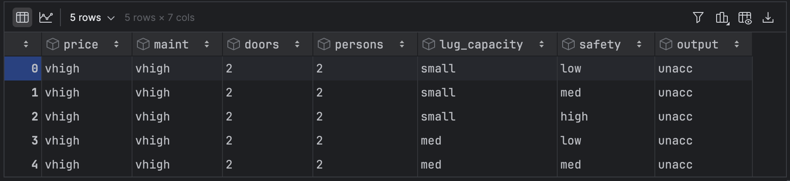

# Chapter 02: 실습 환경 설정과 파이토치 기초
## 03. 실습 환경 설정
### 3-1. 아나콘다 설치
- 아나콘다 내려받기 페이지에서 아나콘다 인스톨러 3.12버전을 내려받는다.
- [아나콘다 다운로드 페이지](https://www.anaconda.com/download)
- 내려받은 인스톨러를 통해 아나콘다를 설치한다.
- 설치가 완료되면 터미널을 열어 아래 명령을 실행하여 새로운 경로를 적용한다.
```
source .bash_profile
```

### 3-2. 가상 환경 생성 및 파이토치 설치
- 다음 명령을 실행하여 아나콘다 환경을 만든다.
```
conda create -n torch_book python=3.9
```
- 생성된 가상 환경 확인
```
conda env list

# conda environments:
#
base                  *  /opt/anaconda3
torch_book               /opt/anaconda3/envs/torch_book
tutorial                 /opt/anaconda3/envs/tutorial
```
- 가상 환경을 활성화한다.
```
source activate torch_book
```
- 가상 환경을 삭제하려면 아래 명령을 사용한다.
```
conda env remove -n torch_book
```
- 가상 환경에 커널을 설치한다.
```
pip install ipykernel
```
- 가상 환경에 커널을 연결하기 위해 아래 명령을 실행한다.
```
python -m ipykernel install --user --name torch_book --display-name "torch_book"
```

#### 파이토치 설치하기
- 아나콘다 프롬프트에서 다음 명령들을 입력하여 파이토치를 설치할 수 있다(다음과 같이 특정 버전을 지정하여 설치해도 무방합니다).
- 책에서는 현재 시점의 최신 버전인 1.9.0 버전을 설치한다.
- 사용하는 환경이 CPU라면 다음 명령으로 설치한다.
```
conda install pytorch torchvision torchaudio -c pytorch
```
- 혹은 아래의 명령으로 설치한다.
```
pip install torch==1.9.0 torchvision==0.10.0 torchaudio==0.9.0
```
- 마지막으로 주피터 노트북을 설치한다.
```
pip install jupyter notebook
```
- 가상 환경에서 아래 명령으로 주피터 노트북을 실행할 수 있다.
```
jupyter notebook
```

## 04. 파이토치 코드 맛보기
- 파이토치를 사용해 간단한 분류 및 회귀 모델을 개발하는 방법을 보자.
- 사전에 다운받은 예제 파일 `car_evaluation.csv`을 데이터셋으로 사용하며, 아래와 같이 특성 일곱 개로 구성되어 있다.
    1. price(자동차 가격)
    2. maint(자동차 유지 비용)
    3. doors(자동차 문 개수)
    4. persons(수용 인원)
    5. lug_capacity(수하물 용량)
    6. safety(안전성)
    7. output(차 상태): 이 데이터는 unacc(허용 불가능한 수준) 및 acc(허용 가능한 수준), 양호(good) 및 매우 좋은(very good, vgood) 중 하나의 값을 갖는다.
- 1~6 칼럼의 정보를 이용해 7번 칼럼을 예측하는 코드를 구현해보자.
- 필요한 라이브러리 먼저 설치한다.
```
pip install matplotlib
pip install seaborn
pip install scikit-learn
```
- 이미 설치되어 있다면 아래 명령으로 업그레이드를 진행한다.
```
pip install --upgrade matplotlib --use-feature=2020-resolver
pip install --upgrade seaborn --use-feature=2020-resolver
pip install --upgrade scikit-learn --use-feature=2020-resolver
```

> #### 설치한 라이브러리
> 1. `matplotlib`: 수많은 파이썬 라이브러리 중에서 2D, 3D 형태의 플롯(그래프)을 그릴 때 주로 사용하는 패키지(모듈)
> 2. `seaborn`: 데이터 프레임으로 다양한 통계 지표를 표현할 수 있는 시각화 차트를 제공하기 때문에 데이터 분석에 활발히 사용되는 라이브러리
> 3. `scikit-learn`: 분류(classification), 회귀(regression), 군집(clustering), 의사 결정 트리(decision tree) 등 다양한 머신 러닝 알고리즘을 적용할 수 있는 함수를 제공하는 머신 러닝 라이브러리

#### 코드 작성하기
- 필요한 라이브러리를 호출한다.
```py
import torch
import torch.nn as nn
import numpy as np
import pandas as pd
import matplotlib.pyplot as plt
import seaborn as sns
%matplotlib inline
```
- 다운받은 데이터를 불러온다.
```py
dataset = pd.read_csv("../080289/chap02/data/car_evaluation.csv")
dataset.head()
```
- `dataset.head()`: 데이터프레임 내의 처음 n줄을 출력하여 데이터의 내용을 확인할 수 있다.
- n의 기본값은 5이다.
- 출력 결과는 아래와 같다.



- 컴퓨터는 자연어를 인식할 수 없기 때문에 단어를 벡터로 바꿔주는 임베딩 처리가 필요하다.
- 주어진 데이터셋을 이해하기 쉽게 분포 형태로 시각화하여 표현하면 아래와 같다.
```py
fig_size = plt.rcParams["figure.figsize"]
fig_size[0] = 8
fig_size[1] = 6
plt.rcParams["figure.figsize"] = fig_size
dataset.output.value_counts().plot(
    kind='pie',
    autopct='%0.05f%%',
    colors=['lightblue', 'lightgreen', 'orange', 'pink'],
    explode=(0.05, 0.05, 0.05, 0.05))
```
- 실행하면 아래처럼 출력된다.


