# Chapter 03: 머신 러닝 핵심 알고리즘
## 01. 지도 학습
- 지도 학습은 정답(레이블(label))을 컴퓨터에 미리 알려 주고 데이터를 학습시키는 방법이다.
- 지도 학습에는 분류와 회귀가 있다.
- 분류(classification): 주어진 데이터를 정해진 범주에 따라 분류
- 회귀(regression): 데이터들의 특성(feature)을 기준으로 연속된 값을 그래프로 표현하여 패턴이나 트렌드를 예측할 때 사용한다.
- 분류와 회귀 차이:

|구분|분류|회귀|
|:---:|:---:|:---:|
|데이터 유형|이산형 데이터|연속형 데이터|
|결과|훈련 데이터의 레이블 중 하나를 예측|연속된 값을 예측|
|예시|학습 데이터를 A, B, C 그룹 중 하나로 매핑|결괏값이 어떤 값이든 나올 수 있음|

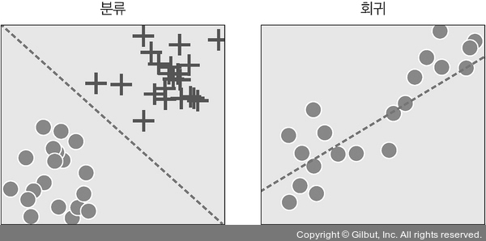

### 1-1. K-최근접 이웃
- 사용하는 이유: 주어진 데이터에 대한 분류
- 언제 사용하는 것이 좋은가?: K-최근접 이웃은 직관적이며 사용하기 쉽기 때문에 초보자가 쓰면 좋다. 훈련 데이터를 충분히 확보할 수 있는 환경에서 사용하면 좋다.
- K-최근접 이웃(K-nearest neighbor): 새로운 입력(학습에 사용하지 않은 새로운 데이터)을 받았을 때 기존 클러스터에서 모든 데이터와 인스턴스(instance) 기반 거리를 측정한 후 가장 많은 속성을 가진 클러스터에 할당하는 분류 알고리즘
- 과거 데이터를 사용하여 미리 분류 모형을 만드는 것이 아니라, 과거 데이터를 저장해 두고 필요할 때마다 비교를 수행하는 방식
- K 값의 선택에 따라 새로운 데이터에 대한 분류 결과가 달라질 수 있음에 유의해야 한다.
- 아래 그림과 같이 네모, 세모, 별 모양의 클러스터로 구성된 데이터셋이 있다고 하자.
- 신규 데이터인 동그라미가 유입되었다면 기존 데이터들과 하나씩 거리를 계산하고 거리상으로 가장 가까운 데이터 다섯 개(K=5, 임의로 지정)를 선택하여 해당 클러스터에 할당한다.

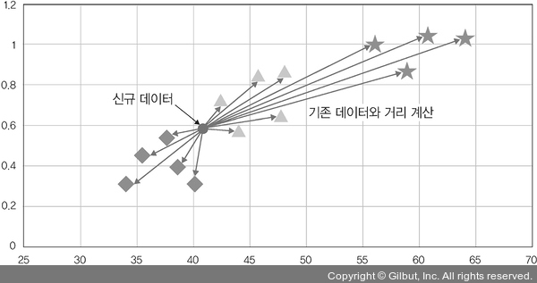

- 예를 들어 아래 그림과 같이 새로운 입력 데이터(빨간색 외각선 원)가 세 개 있을 때 새로운 입력에 대한 분류를 진행해 보자(K=3).
    - 새로운 입력 (1): 주변 범주 세 개가 주황색이므로 주황색으로 분류
    - 새로운 입력 (2): 주변 범주 두 개가 주황색, 한 개가 녹색이므로 주황색으로 분류
    - 새로운 입력 (3): 주변 범주 두 개가 녹색, 한 개가 주황색이므로 녹색으로 분류
- 좌측의 밝은 색이 주황, 우측의 어두운 색이 녹색
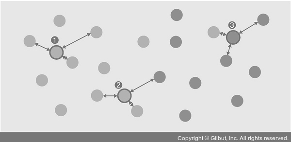

- 코드로 확인해보자.
- 예제의 목표는 붓꽃에 대한 분류이다.
- 머신 러닝 코드는 심층 신경망이 필요하지 않기 때문에 사이킷 런(scikit-run)을 이용한다.
- 아래 과정으로 K의 값을 예측한다.

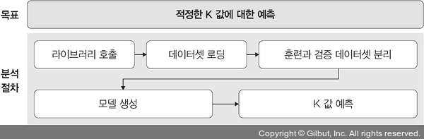

- 먼저 필요한 라이브러리를 호출하고 데이터를 준비한다.
- 데이터는 예제 폴더의 data 폴더의 iris.data 파일을 사용한다.
```py
# 3-1. 라이브러리 호출 및 데이터 준비

import numpy as np
import matplotlib.pyplot as plt
import pandas as pd
from sklearn import metrics

names = ['sepal_length', 'sepal_width', 'petal_length', 'petal_width', 'Class']

dataset = pd.read_csv('/Users/ramy/PycharmProjects/Pytorch/080289/chap03/data/iris.data', names=names)
```
- 준비한 데이터를 전처리하고 훈련과 테스트 데이터셋으로 분리한다.
```py
# 3-2. 훈련과 테스트 데이터셋 분리

X = dataset.iloc[:, :-1].values
y = dataset.iloc[:, 4].values

from sklearn.model_selection import train_test_split

# X, y를 사용하여 훈련과 테스트 데이터셋으로 분리하며, 테스트 데이터셋은 20% 사용
X_train, X_test, y_train, y_test = train_test_split(X, y, test_size=0.20)

from sklearn.preprocessing import StandardScaler

# 특성 스케일링(scaling), 평균이 0, 표준편차가 1이 되도록 변환
s = StandardScaler()

# 훈련 데이터와 테스트 데이터를 스케일링 처리
X_train = s.fit_transform(X_train)
X_test = s.transform(X_test)
```
- 모델을 생성 후 훈련시킨다.
```py
# 3-3. 모델 생성 및 훈련

from sklearn.neighbors import KNeighborsClassifier

# K=50인 K-최근접 이웃 모델 생성
knn = KNeighborsClassifier(n_neighbors=50)
knn.fit(X_train, y_train)
```
- 아래는 출력 결과이다.

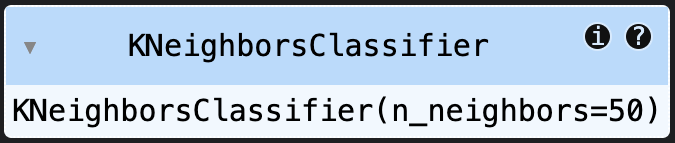

- 모델에 대한 정확도를 측정한다.
```py
# 3-4. 모델 정확도

from sklearn.metrics import accuracy_score

y_pred = knn.predict(X_test)
print("정확도: {}".format(accuracy_score(y_test, y_pred)))
```
- 출력은 아래와 같다.
```
정확도: 0.8666666666666667
```
- `train_test_split()` 메서드는 데이터를 무작위로 분배하므로 코드를 실행할 때마다 정확도에 차이가 있다.
- 여러 차례 실행 후 평균을 찾는 것이 좋다.
- 최적의 K 값을 구하고 그것에 대한 정확도를 살펴보자.
- `for` 문을 이용하여 K 값을 1부터 10까지 순환하며 최적의 K 값과 정확도를 찾는다.
```py
# 3-5. 최적의 K 찾기

k = 10
acc_array = np.zeros(k)

for k in np.arange(1, k+1):
    classifier = KNeighborsClassifier(n_neighbors=k).fit(X_train, y_train)
    y_pred = classifier.predict(X_test)
    acc = metrics.accuracy_score(y_test, y_pred)
    acc_array[k-1] = acc

max_acc = np.amax(acc_array)
acc_list = list(acc_array)
k = acc_list.index(max_acc)

print("정확도", max_acc, "으로 최적의 k는", k+1, "입니다.")
```
- K 값과 정확도는 아래와 같다.
```
정확도 0.9666666666666667 으로 최적의 k는 1 입니다.
```
- K 값이 50일 때 정확도가 87%였다면, 1일 때 정확도는 97%로 높아졌다.
- K 값에 따라 성능이 달라질 수 있으므로 초기 설정이 중요하다.

### 1-2. 서포트 벡터 머신
- 사용하는 이유: 주어진 데이터에 대한 분류
- 언제 사용하는 것이 좋은가?: 서포트 벡터 머신은 커널만 적절히 선택한다면 정확도가 상당히 좋기 때문에 정확도를 요구하는 분류 문제를 다룰 때 사용하면 좋다. 텍스트를 분류할 때 많이 사용한다.
- 서포트 벡터 머신(Support Vector Machine, SVM): 분류를 위한 기준선을 정의하는 모델
- 분류되지 않은 새로운 데이터가 나타나면 결정 경계(기준선)를 기준으로 경계의 어느 쪽에 속하는지 분류하는 모델
- 따라서 서포트 벡터 머신에서는 결정 경계를 이해하는 것이 중요하다.
- 결정 경계는 데이터를 분류하기 위한 기준선이다.
- 아래 그림과 같이 주황색 공과 녹색 공이 있을 때 이 공들을 색상별로 분류하기 위한 기준선이 결정 경계이다.

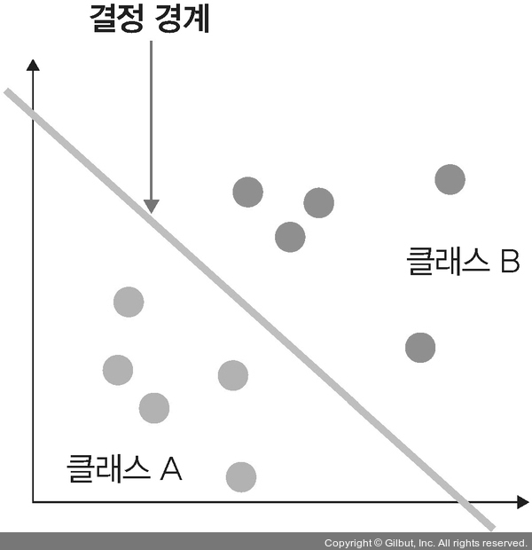

- 결정 경계의 위치는 어디가 가장 좋은가

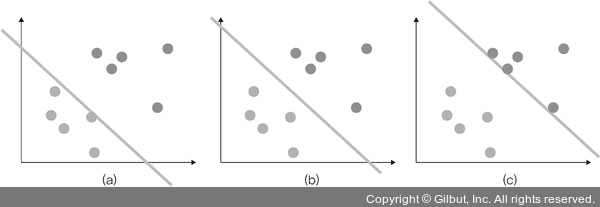

- 결정 경계는 데이터가 분류된 클래스에서 최대한 멀리 떨어져 있을 때 성능이 가장 좋다.
- 서포트 벡터 머신을 이해하려면 결정 경계 외에도 마진이라는 개념을 이해해야 한다.
- 마진(margin): 결정 경계와 서포트 벡터 사이의 거리
- 서포트 벡터(support vector): 결정 경계와 가까이 있는 데이터들
- 이 데이터들이 경계를 정의하는 결정적인 역할을 한다.
- 최적의 결정 경계는 마진을 최대로 해야 한다.

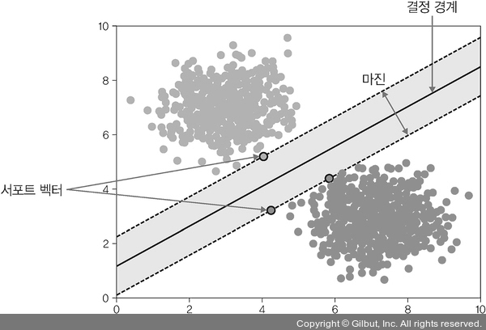
서포트 벡터 머신의 서포트 벡터

- 서포트 벡터 머신은 데이터들을 올바르게 분리하면서 마진 크기를 최대화해야 하는데, 이상치(outlier)를 잘 다루는 것이 중요하다.
- 이상치를 허용하지 않는 것을 하드 마진(hard margin)이라고 하며, 어느 정도의 이상치들이 마진 안에 포함되는 것을 허용한다면 소프트 마진(soft margin)이라고 한다.
- 위 그림이 이상치를 허용하지 않는 하드 마진, 아래 그림은 이상치를 허용하는 소프트 마진이다.

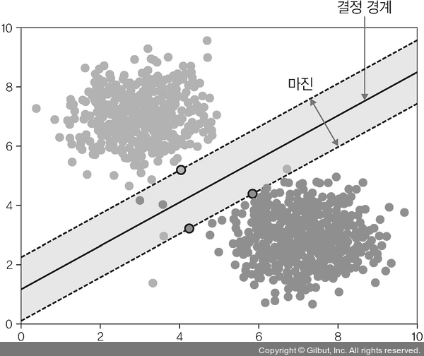
서포트 벡터 머신의 마진

- 코드로 서포트 벡터 머신을 보자.

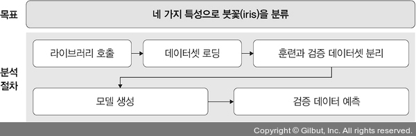

- 훈련에 필요한 데이터를 로드하고 필요한 라이브러리를 호출한다.
```py
# 3-6. 라이브러리 호출

from sklearn import svm
from sklearn import metrics
from sklearn import datasets
from sklearn import model_selection

import tensorflow as tf
import os
os.environ['TF_CPP_MIN_LOG_LEVEL'] = '3'
```
- `TF_CPP_MIN_LOG_LEVEL`이라는 환경 변수를 사용하여 로깅을 제어(기본값은 0으로 모든 로그가 표시되며, INFO 로그를 필터링하려면 1, WARNING 로그를 필터링하려면 2, ERROR 로그를 추가로 필터링하려면 3으로 설정)한다.
- 데이터셋을 불러와 훈련과 테스트 데이터셋으로 분리한다.
```py
# 3-7. iris 데이터를 준비하고 훈련과 테스트 데이터셋으로 분리

iris = datasets.load_iris()
X_train, X_test, y_train, y_test = model_selection.train_test_split(
    iris.data,
    iris.target,
    test_size=0.6,
    random_state=42
)
```
- 사이킷런으로 SVM 모델을 생성 및 훈련시킨 후 테스트 데이터셋을 이용한 예측을 수행한다.
```py
# 3-8. SVM 모델에 대한 정확도

svm = svm.SVC(kernel='linear', C=1.0, gamma=0.5)
svm.fit(X_train, y_train)
predictions = svm.predict(X_test)
score = metrics.accuracy_score(y_test, predictions)

print('정확도: {0:f}'.format(score))
```
- 정확도 출력 결과는 아래와 같다.
```
정확도: 0.988889
```
- SVM은 선형 분류와 비선형 분류를 지원한다.
- 비선형에 대한 커널은 선형으로 분류될 수 없는 데이터들 때문에 발생했다.
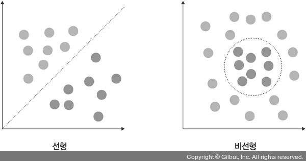

- 비선형 문제를 해결하는 가장 기본적인 방법은 저차원 데이터를 고차원으로 보내는 것인데, 이것은 많은 수학적 계산이 필요하기 때문에 성능에 문제를 줄 수 있다.
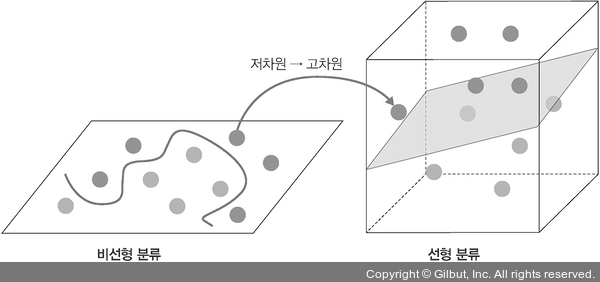

- 이러한 문제를 해결하고자 도입한 것이 바로 ‘커널 트릭(kernel trick)’이다.
- 선형 모델을 위한 커널(kernel): 선형(linear) 커널
- 비선형을 위한 커널: 가우시안 RBF 커널, 다항식 커널(poly)
- 가우시안 RBF 커널과 다항식 커널은 수학적 기교를 이용하는 것으로, 벡터 내적을 계산한 후 고차원으로 보내는 방법으로 연산량을 줄였다.

#### 선형 커널 (linear kernal)
- 선형으로 분류 가능한 데이터에 적용하며, 아래 수식을 사용한다.
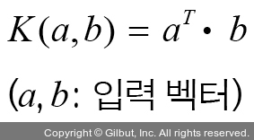
- 선형 커널은 기본 커널 트릭으로 커널 트릭을 사용하지 않겠다는 의미라고 볼 수 있다.

#### 다항식 커널 (polynomical kernal)
- 실제로는 특성을 추가하지 않지만, 다항식 특성을 많이 추가한 것과 같은 결과를 얻을 수 있는 방법
- 실제로는 특성을 추가하지 않지만, 엄청난 수의 특성 조합이 생기는 것과 같은 효과를 얻기 때문에 고차원으로 데이터 매핑이 가능하다.
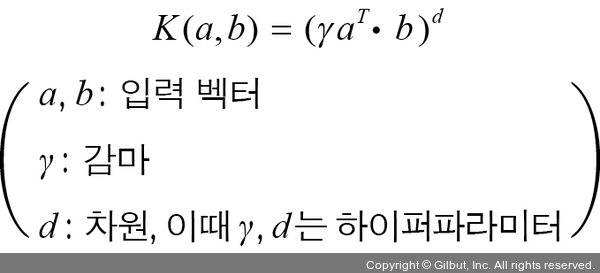

#### 가우시안 RBF 커널 (Gaussian RBF kernal)
- 다항식 커널의 확장이라고 생각할 수 있다.
- 입력 벡터를 차원이 무한한 고차원으로 매핑하는 것으로, 모든 차수의 모든 다항식을 고려한다.
- 다항식 커널은 차수에 한계가 있는데, 가우시안 RBF는 차수에 제한 없이 무한한 확장이 가능하다.
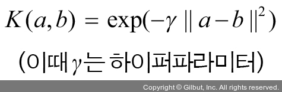

#### 다시 돌아와서...
- 코드 3-8과 같이 세 가지 커널에서 사용되는 수치 값 중 C 값은 오류를 어느 정도 허용할지 지정하는 파라미터이며, C 값이 클수록 하드 마진이고 작을수록 소프트 마진이다.
- 감마(gamma)는 결정 경계를 얼마나 유연하게 가져갈지 지정한다.
- 훈련 데이터에 얼마나 민감하게 반응할지 지정하기 때문에 C와 개념이 비슷하다.
- 감마 값이 높으면 훈련 데이터에 많이 의존하기 때문에 결정 경계가 곡선 형태를 띠며 과적합을 초래할 수 있으니 주의해야 한다.

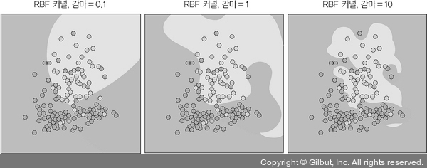

### 1-3. 결정 트리
- 사용하는 이유: 주어진 데이터에 대한 분류
- 언제 사용하는 것이 좋은가?: 결정 트리는 이상치가 많은 값으로 구성된 데이터셋을 다룰 때 사용하면 좋다. 결정 과정이 시각적으로 표현되기 때문에 머신 러닝이 어떤 방식으로 의사 결정을 하는지 알고 싶을 때 사용한다.
- 결정 트리(decision tree): 데이터를 분류하거나 결괏값을 예측하는 분석 방법
- 결과 모델이 트리 구조이기 때문에 결정 트리라고 한다.
- 아래 그림은 결정 과정을 보여 준다.

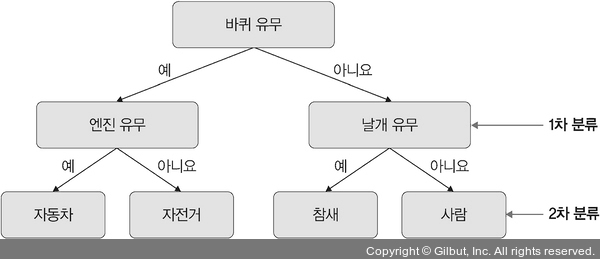

- 결정 트리는 데이터를 1차로 분류한 후 각 영역의 순도(homogeneity)는 증가하고, 불순도(impurity)와 불확실성(uncertainty)은 감소하는 방향으로 학습을 진행한다.
- 순도가 증가하고 불확실성이 감소하는 것을 정보 이론에서는 정보 획득(information gain)이라고 하며, 순도를 계산하는 방법에는 엔트로피와 지니 계수를 많이 사용한다.

> #### 순도와 불순도
> - 순도: 범주 안에서 같은 종류의 데이터만 모여 있는 상태
> - 불순도: 서로 다른 데이터가 섞여 있는 상태
> 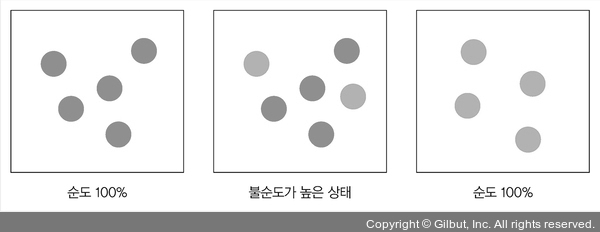

#### 엔트로피 (entropy)
- 확률 변수의 불확실성을 수치로 나타낸 것으로, 엔트로피가 높을수록 불확실성이 높다는 의미
- 엔트로피 값이 0과 0.5라고 가정할 때 아래와 같은 도출이 가능하다.
```
엔트로피 = 0 =불확실성 최소 = 순도 최대
엔트로피 = 0.5 = 불확실성 최대 = 순도 최소
```
- 레코드 m개가 A 영역에 포함되어 있다면 엔트로피는 아래 식으로 정의된다.
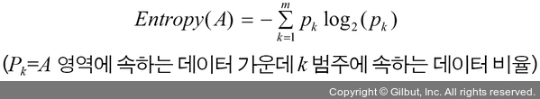

- 예를 들어 동전을 두 번 던져 앞면이 나올 확률이 1/4이고 뒷면이 나올 확률이 3/4일 때, 엔트로피는 아래과 같다.
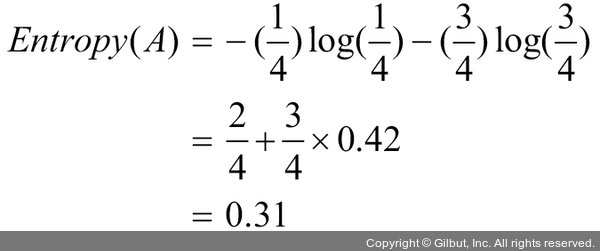

#### 지니 계수 (Gini index)
- 불순도를 측정하는 지표로, 데이터의 통계적 분산 정도를 정량화해서 표현한 값
- 지니 계수는 원소 n개 중에서 임의로 두 개를 추출했을 때, 추출된 두 개가 서로 다른 그룹에 속해 있을 확률을 의미한다.
- 지니 계수는 아래 공식으로 구할 수 있으며, 지니 계수가 높을수록 데이터가 분산되어 있음을 의미한다.
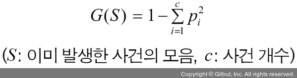

- 지니 계수는 로그를 계산할 필요가 없어 엔트로피보다 계산이 빠르기 때문에 결정 트리에서 많이 사용한다.
- 코드로 자세히 살펴보자.
- 이 예제의 목표는 타이타닉 승객의 생존 여부를 예측하는 것이다.

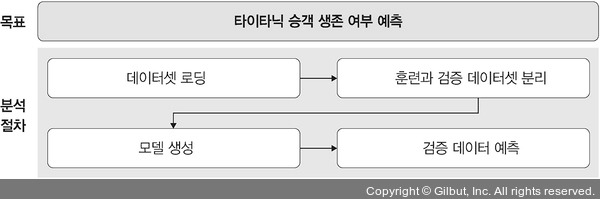

- 먼저 필요한 데이터를 불러온다.
- 데이터는 예제 폴더의 data 폴더에 있는 train.csv 파일을 사용한다.
```py
# 3-9. 라이브러리 호출 및 데이터 준비

import pandas as pd
df = pd.read_csv('/Users/ramy/PycharmProjects/Pytorch/080289/chap03/data/titanic/test.csv',
                 index_col='PassengerId')

print(df.head())
```
- 출력 결과는 아래와 같다.
```
             Survived  Pclass  \
PassengerId                     
1                   0       3   
2                   1       1   
3                   1       3   
4                   1       1   
5                   0       3   

                                                          Name     Sex   Age  \
PassengerId                                                                    
1                                      Braund, Mr. Owen Harris    male  22.0   
2            Cumings, Mrs. John Bradley (Florence Briggs Th...  female  38.0   
3                                       Heikkinen, Miss. Laina  female  26.0   
4                 Futrelle, Mrs. Jacques Heath (Lily May Peel)  female  35.0   
5                                     Allen, Mr. William Henry    male  35.0   

             SibSp  Parch            Ticket     Fare Cabin Embarked  
PassengerId                                                          
1                1      0         A/5 21171   7.2500   NaN        S  
2                1      0          PC 17599  71.2833   C85        C  
3                0      0  STON/O2. 3101282   7.9250   NaN        S  
4                1      0            113803  53.1000  C123        S  
5                0      0            373450   8.0500   NaN        S
```
- 타이타닉 전체 데이터 중 분석에 필요한 데이터만 추출하여 전처리한다.
```py
# 3-10. 데이터 전처리

df = df[['Pclass', 'Sex', 'Age', 'SibSp', 'Parch', 'Fare', 'Survived']]
df['Sex'] = df['Sex'].map({'male': 0, 'female': 1})
df = df.dropna()

X = df.drop('Survived', axis=1)
y = df['Survived']
```
- 훈련과 테스트 데이터셋으로 분리한다.
```py
# 3-11. 훈련과 테스트 데이터셋으로 분리

from sklearn.model_selection import train_test_split

X_train, X_test, y_train, y_test = train_test_split(X, y, random_state=1)
```
- 사이킷런에서 제공하는 결정 트리 라이브러리를 이용해 모델을 생성한다.
```py
# 3-12. 결정 트리 모델 생성

from sklearn import tree

model = tree.DecisionTreeClassifier()
```
- 준비된 훈련 데이터셋을 이용해 모델을 훈련한다.
```py
# 3-13. 모델 훈련

model.fit(X_train, y_train)
```
- 훈련 실행 결과는 아래와 같다.

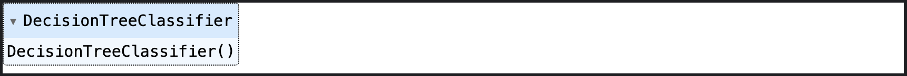

- 테스트 데이터셋을 이용해 모델에 대한 예측을 진행한다.
```py
# 3-14. 모델 예측

y_predict = model.predict(X_test)

from sklearn.metrics import accuracy_score

accuracy_score(y_test, y_predict)
```
- 모델 예측에 대한 출력 결과는 아래와 같다.
```
0.8100558659217877
```
- 혼동 행렬을 이용한 결과를 보자.
```py
# 3-15. 혼동 행렬을 이용한 성능 측정

from sklearn.metrics import confusion_matrix

pd.DataFrame(
    confusion_matrix(y_test, y_predict),
    columns=['Predicted Not Survival', 'Predicted Survival'],
    index=['True Not Survival', 'True Survival']
)
```
- 아래는 출력 결과이다.

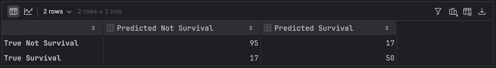

> #### 혼동 행렬
> - 혼동 행렬은 알고리즘 성능 평가에 사용된다.
> - 혼동 행렬에서 사용되는 아래 표를 보자.
> 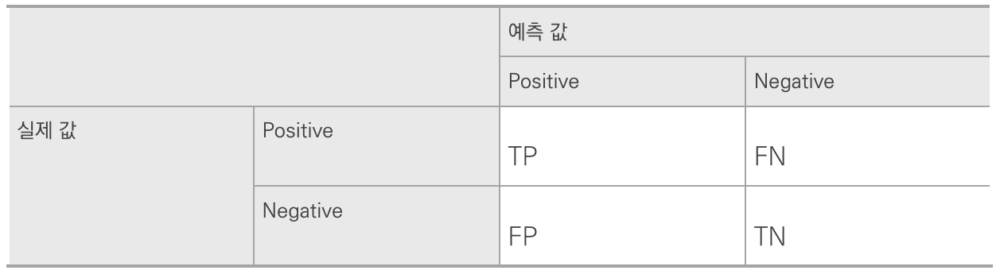
>
> - 혼동 행렬에서 사용하는 용어:
>   - True Positive: 모델(분류기)이 ‘1’이라고 예측했는데 실제 값도 ‘1’인 경우
>   - True Negative: 모델(분류기)이 ‘0’이라고 예측했는데 실제 값도 ‘0’인 경우
>   - False Positive: 모델(분류기)이 ‘1’이라고 예측했는데 실제 값은 ‘0’인 경우
>   - False Negative: 모델(분류기)이 ‘0’이라고 예측했는데 실제 값은 ‘1’인 경우
> - 혼동 행렬을 이용해 정밀도, 재현율, 정확도 등의 지표를 얻을 수 있다.

- 출력된 결과를 보면 잘못된 예측보다는 정확한 예측의 수치가 더 높으므로 잘 훈련되었다고 할 수 있다.
- 이와 같이 주어진 데이터를 사용하여 트리 형식으로 데이터를 이진 분류(0 혹은 1)해 나가는 방법이 결정 트리이다.
- 결정 트리를 좀 더 확대한 것(결정 트리를 여러 개 묶어 놓은 것)이 랜덤 포레스트(random forest)이다.

### 1-4. 로지스틱 회귀와 선형 회귀
- 회귀: 변수가 두 개 주어졌을 때 한 변수에서 다른 변수를 예측하거나 두 변수의 관계를 규명하는 데 사용하는 방법
- 변수 유형:
    - 독립 변수(예측 변수): 영향을 미칠 것으로 예상되는 변수
    - 종속 변수(기준 변수): 영향을 받을 것으로 예상되는 변수
- 이때 두 변수 간 관계에서 독립 변수와 종속 변수의 설정은 논리적인 타당성이 있어야 한다.
- 예를 들어 몸무게(종속 변수)와 키(독립 변수)는 둘 간의 관계를 규명하는 용도로 사용된다.

#### 로지스틱 회귀
- 사용하는 이유: 주어진 데이터에 대한 분류
- 언제 사용하는 것이 좋은가?: 로지스틱 회귀 분석은 주어진 데이터에 대한 확신이 없거나 향후 추가적으로 훈련 데이터셋을 수집하여 모델을 훈련시킬 수 있는 환경에서 사용하면 유용하다.
- 로지스틱 회귀(logistic regression): 분석하고자 하는 대상들이 두 집단 혹은 그 이상의 집단으로 나누어진 경우, 개별 관측치들이 어느 집단으로 분류될 수 있는지 분석하고 이를 예측하는 모형을 개발하는 데 사용되는 통계 기법
- 따라서 일반적인 회귀 분석과는 차이가 있다.

|구분|일반적인 회귀 분석|로지스틱 회귀 분석|
|:---:|:---:|:---:|
|종속 변수|연속형 변수|이산형 변수|
|모형 탐색 방법|최소제곱법|최대우도법|
|모형 검정|F-테스트, t-테스트|X^2 테스트|

> #### 최소제곱법과 최대우도법
> - 최소제곱법(mean squared)과 최대우도법(maximum likelihood)은 랜덤 표본에서 모집단 모수를 추정하는 데 사용된다.
> - 최소제곱법은 일반적인 회귀 분석에서 사용하지만, 최대우도법은 로지스틱 회귀 분석에서 사용한다.
> - 최소제곱법은 실제 값에서 예측 값을 뺀 후 제곱해서 구할 수 있다.
> 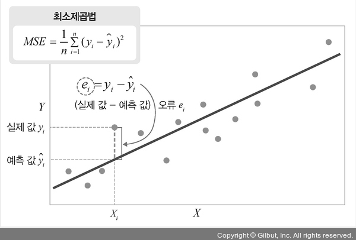
> - 우도(likelihood, 가능도): 나타난 결과에 따라 여러 가능한 가설을 평가할 수 있는 척도(measure)
> - 최대우도: 나타난 결과에 해당하는 가설마다 계산된 우도 값 중 가장 큰 값
> - 일어날 가능성(우도)이 가장 큰 것을 의미한다.
> - 이 모든 것을 종합하여 최대우도법을 정의하면 최대우도 추정치 또는 최대 가능성 추정량이라고 할 수 있다.
> - 최대우도법은 다음 수식으로 구할 수 있다.
> 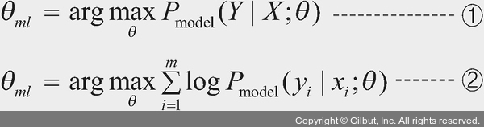
> - 수식 (1)과 같이 입력 값 X와 모델의 파라미터 θ가 주어졌을 때, Y가 나타날 확률을 최대화하는 θ를 찾는 것이 최대우도법이다.
> - X와 Y가 고정된 상태에서 모델에 X를 넣었을 때 실제 값 Y에 가장 가까운 θ를 찾는 것이 수식이다.
> - 이때 관측치 m개가 모두 서로 독립이라고 가정할 때, 언더플로8를 방지하고자 우도에 로그를 취한다면 최대우도 추정치 수식은 (2)와 같다.

- 로지스틱 회귀 분석 절차:
    1. 각 집단에 속하는 확률의 추정치를 예측한다. 이때 추정치는 이진 분류의 경우 집단 1에 속하는 확률 P(Y=1)로 구한다.
    2. 분류 기준 값(cut-off)을 설정한 후 특정 범주로 분류한다.
```
P(Y=1) ≥ 0.5 → 집단 1로 분류
P(Y=1) < 0.5 → 집단 0으로 분류
```
- 코드로 자세히 알아보자.
- 목표는 신규 데이터(숫자(digit))에 대한 정확한 예측이다.

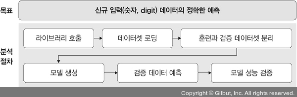
