# Chapter 03: 머신 러닝 핵심 알고리즘
## 02. 비지도 학습
- 비지도 학습: 지도 학습처럼 레이블이 필요하지 않으며 정답이 없는 상태에서 훈련시키는 방식
- 비지도 학습 유형: 군집(clustering), 차원 축소(dimensionality reduction)
- 군집: 각 데이터의 유사성(거리)을 측정한 후 유사성이 높은(거리가 짧은) 데이터끼리 집단으로 분류하는 것
- 차원 축소: 차원을 나타내는 특성을 줄여서 데이터를 줄이는 방식
- 군집과 차원 축소 차이:

|구분|군집|차원 축소|
|:---:|:---:|:---:|
|목표|데이터 그룹화|데이터 간소화|
|주요 알고리즘|K-평균 군집화 (K-means)|주성분 분석 (PCA)|
|예시|사용자의 관심사에 따라 그룹화하여 마케팅에 활용|데이터 압축, 중요한 속성 도출|

> #### 군집, 군집화, 클러스터
> - 통계학에서는 군집이라고 하며, 머신 러닝에서는 클러스터라고 한다.
> - 클러스터를 한국어로 바꾸면 군집화가 된다.
> - 군집, 군집화, 클러스터는 같은 의미의 다른 표현이다.
> - 이 책에서는 군집, 군집화, 클러스터 용어를 혼용하여 사용하지만, 모두 동일한 의미이다.

> #### 데이터 간 유사도(거리) 측정 방법
> - 데이터 간 유사도(거리)를 측정하는 방법: 유클리드 거리, 맨해튼 거리, 민코프스키 거리, 코사인 유사도, 등

### 2-1. K-평균 군집화
- 사용하는 이유: 주어진 데이터에 대한 군집화
- 언제 사용하면 좋은가?: 주어진 데이터셋을 이용하여 몇 개의 클러스터를 구성할지 사전에 알 수 있을 때 사용하면 유용하다.
- K-평균 군집화(K-means clustering): 데이터를 입력받아 소수의 그룹으로 묶는 알고리즘
- 레이블이 없는 데이터를 입력받아 각 데이터에 레이블을 할당해서 군집화를 수행한다.
- 학습 과정:
    1. 중심점 선택: 랜덤하게 초기 중심점(centroid)을 선택한다 (그림에서는 K=2로 초기화).
    2. 클러스터 할당: K개의 중심점과 각각의 개별 데이터 간의 거리(distance)를 측정한 후, 가장 가까운 중심점을 기준으로 데이터를 할당(assign)한다.
    - 이 과정을 통해 클러스터가 구성된다(이때 클러스터링은 데이터를 하나 혹은 둘 이상의 덩어리로 묶는 과정이며, 클러스터는 덩어리 자체를 의미한다).
    3. 새로운 중심점 선택: 클러스터마다 새로운 중심점을 계산한다.
    4. 범위 확인(convergence): 선택된 중심점에 더 이상의 변화가 없다면 진행을 멈춘다. 만약 계속 변화가 있다면 2~3 과정을 반복한다.

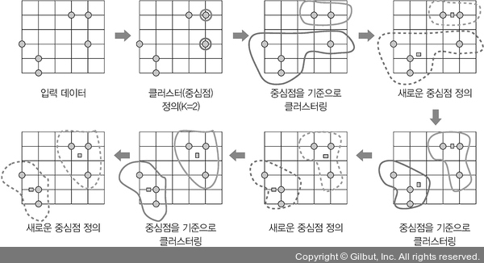

- K-평균 군집화 알고리즘은 다음 상황에서는 데이터 분류가 원하는 결과와 다르게 발생할 수 있으므로 사용하지 않는 것이 좋다.
- 데이터가 비선형일 때: 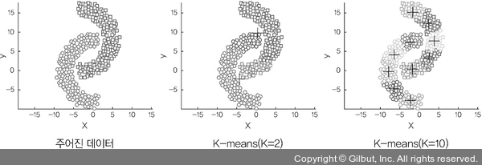

- 군집의 크기가 다를때: 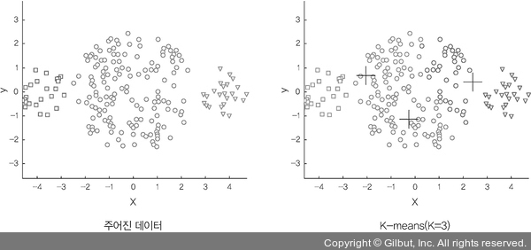

- 군집마다 밀집도(density)와 거리가 다를 때: 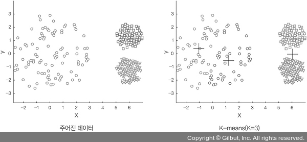

- K-평균 군집화 알고리즘의 성능은 K 값에 따라 달라진다.
- 이번 예제는 적절한 K 값을 찾는 것을 목표로 진행한다.

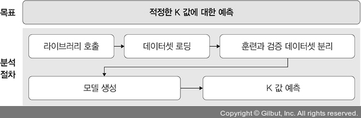

- 필요한 라이브러리를 호출한다.
```py
# 3-29. 라이브러리 호출

import pandas as pd
from sklearn.preprocessing import MinMaxScaler
from sklearn.cluster import KMeans
import matplotlib.pyplot as plt
```
- 예제 폴더의 data 폴더에서 상품에 대한 연 지출 데이터(sales data.csv) 파일을 불러온다.
```py
# 3-30. 상품에 대한 연 지출 데이터(sales data.csv) 호출

data = pd.read_csv('/Users/ramy/PycharmProjects/Pytorch/080289/chap03/data/sales data.csv')
data.head()
```
- 출력은 아래와 같다.

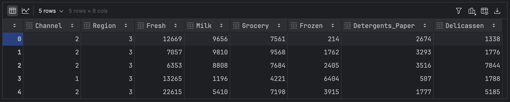

- 불러온 데이터셋은 도매 유통업체의 고객 데이터로 신선한 제품, 유제품, 식료품 등에 대한 연간 지출 정보가 포함되어 있다.
    - Channel: 고객 채널(호텔/레스토랑/카페) 또는 소매 채널(명목형 데이터)
    - Region: 고객 지역(명목형 데이터)
    - Fresh: 신선한 제품에 대한 연간 지출(연속형 데이터)
    - Milk: 유제품에 대한 연간 지출(연속형 데이터)
    - Grocery: 식료품에 대한 연간 지출(연속형 데이터)
    - Frozen: 냉동 제품에 대한 연간 지출(연속형 데이터)
    - Detergents_Paper: 세제 및 종이 제품에 대한 연간 지출(연속형 데이터)
    - Delicassen: 조제 식품에 대한 연간 지출(연속형 데이터)

> #### 자료 유형
> - 데이터 형태에 따라 아래와 같은 유형으로 구분할 수 있다.
>
> | 데이터 형태|설명|예시|
> |:---:|:---:|:---:|
> |수치형 자료|관측된 값이 수치로 측정되는 자료|키, 몸무게, 시험 성적|
> |연속형 자료|값이 연속적인 자료|키, 몸무게|
> |이산형 자료|셀 수 있는 자료|자동차 사고|
> |범주형 자료|관측 결과가 몇 개의 범주 또는 항목의 형태로 나타나는 자료|성별, 선호도|
> |순위형 자료|범주 간에 순서 의미가 있는 자료|매우 좋다, 좋다, 싫다, 매우 싫다 처럼 순서가 있음|
> |명목형 자료|범주 간에 순서 의미가 없는 자료|혈액형|

- 데이터 형태에 따라 연속형 데이터와 명목형 데이터로 분류한다.
```py
# 3-31. 연속형 데이터와 명목형 데이터로 분류

# 명목형 데이터
categorical_features = ['Channel', 'Region']

# 연속형 데이터
continuous_features = ['Fresh', 'Milk', 'Grocery', 'Frozen', 'Detergents_Paper', 'Delicassen']

for col in categorical_features:
    # 명목형 데이터는 판다스의 get_dummies() 메서드를 사용하여 숫자(0과 1)로 변환
    dummies = pd.get_dummies(data[col], prefix=col)
    data = pd.concat([data, dummies], axis=1)
    data.drop(col, axis=1, inplace=True)

data.head()
```
- 출력은 아래와 같이 연속형 데이터와 명목형 데이터로 분류된다.

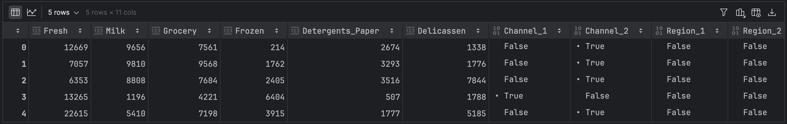

- 연속형 데이터의 모든 특성에 동일하게 중요성을 부여하기 위해 스케일링(scaling)을 적용한다.
- 이는 데이터 범위가 다르기 때문에 범위에 따라 중요도가 달라질 수 있는 것(예를 들어 1000원과 1억 원이 있을 때 1000원의 데이터는 무시)을 방지하기 위함이다.
- 일정한 범위를 유지하도록 사이킷런의 `MinMaxScaler()` 메서드를 사용한다.
```py
# 3-32. 데이터 전처리(스케일링 적용)

mms = MinMaxScaler()
mms.fit(data)
data_transformed = mms.transform(data)
```
- 데이터에 대한 전처리가 완료되었으므로 원하는 적당한 K 값을 알아보자.
```py
# 3-33. 적당한 K 값 추출

Sum_of_squared_distances = []
K = range(1, 15)

for k in K:
    km = KMeans(n_clusters=k)
    km = km.fit(data_transformed)
    Sum_of_squared_distances.append(km.inertia_)

plt.plot(K, Sum_of_squared_distances, 'bx-')
plt.xlabel('k')
plt.ylabel('Sum of square distance')
plt.title('Optimal k')
plt.show()
```
- 실행한 결과는 아래와 같다.

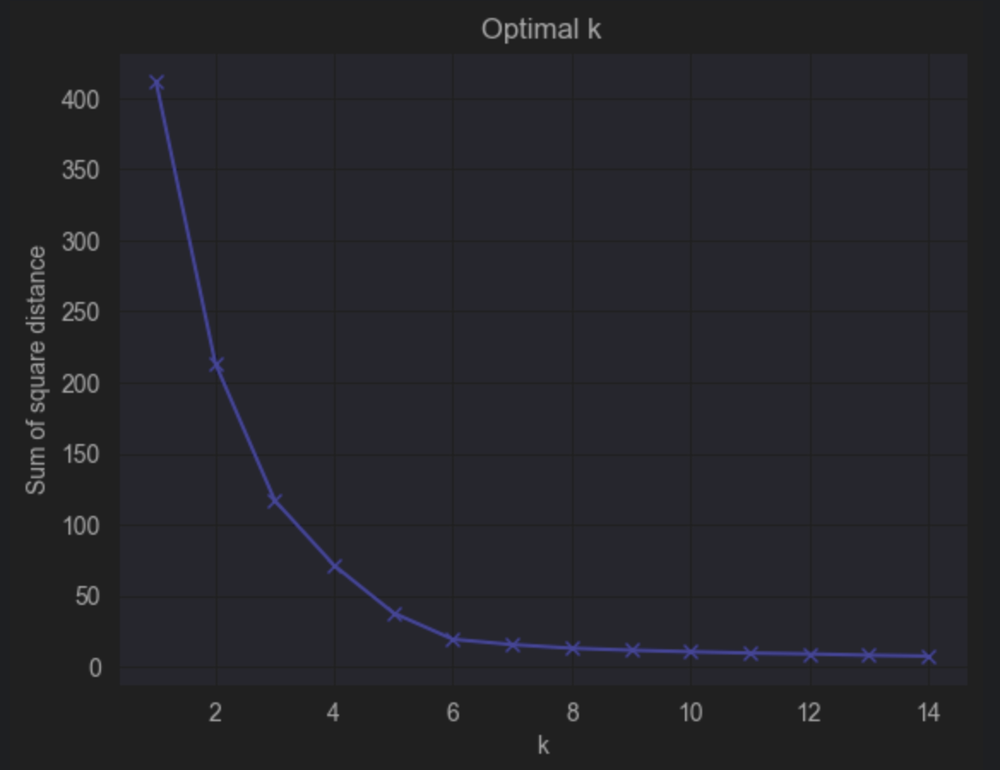

- 거리 제곱의 합(Sum of Squared Distances, SSD)은 x, y 두 데이터의 차를 구해서 제곱한 값을 모두 더한 후 유사성을 측정하는 데 사용된다.
- 즉, 가장 가까운 클러스터 중심까지 거리를 제곱한 값의 합을 구할 때 사용하며, 아래 수식을 쓴다.
- 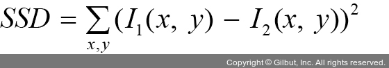
- K가 증가하면 거리 제곱의 합은 0이 되는 경향이 있다.
- K를 최댓값 n(여기에서 n은 샘플 수)으로 설정하면 각 샘플이 자체 클러스터를 형성하여 거리 제곱 합이 0과 같아지기 때문이다.
- 출력 그래프는 클러스터 개수(x축)에 따른 거리 제곱의 합(y축)을 보여 준다.
- K가 6부터 0에 가까워지고 있으므로 K=5가 적정하다.

### 2-2. 밀도 기반 군집 분석
- 사용하는 이유: 주어진 데이터에  대한 군집화
- 언제 사용하면 좋은가?: K-평균 군집화와는 다르게 사전에 클러스터의 숫자를 알지 못할 때 사용하면 유용하다. 주어진 데이터에 이상치가 많이 포함되었을 때 사용하면 좋다.
- 밀도 기반 군집 분석(Density-Based Spatial Clustering of Applications with Noise, DBSCAN): 일정 밀도 이상을 가진 데이터를 기준으로 군집을 형성하는 방법

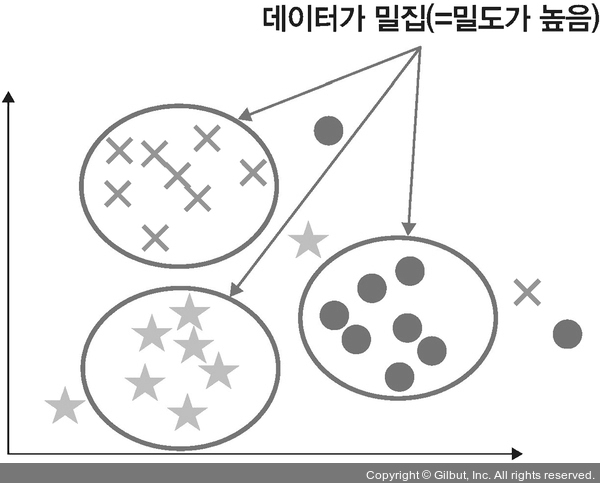

- 노이즈(noise)에 영향을 받지 않으며, K-평균 군집화에 비해 연산량은 많지만 K-평균 군집화가 잘 처리하지 못하는 오목하거나 볼록한 부분을 처리하는 데 유용하다.

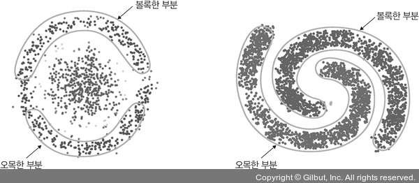

> #### 노이즈와 이상치 차이
> - 노이즈: 주어진 데이터셋과 무관하거나 무작위성 데이터로 전처리 과정에서 제거해야 할 부분
> - 이상치: 관측된 데이터 범위에서 많이 벗어난 아주 작은 값이나 아주 큰 값
> 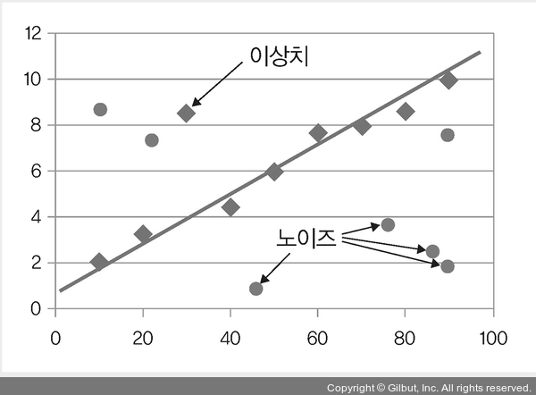

- 밀도 기반 군집 분석을 이용한 군집 방법 절차:

#### 1단계: 엡실론 내 점 개수 확인 및 중심점 결정
- 아래 그림과 같이 원 안에 점 P1이 있다고 할 때, 점 P1에서 거리 엡실론(epsilon) 내에 점이 m(minPts)개 있으면 하나의 군집으로 인식한다고 하자.
- 이때 엡실론 내에 점(데이터) m개를 가지고 있는 점 P1을 중심점(core point)이라고 한다.
- 예를 들어 minPts=3이라면 파란색 점 P1을 중심으로 반경 엡실론 내에 점이 세 개 이상 있으면 하나의 군집으로 판단할 수 있는데, 그림은 점이 네 개 있기 때문에 하나의 군집이 되고, P1은 중심점이 된다.
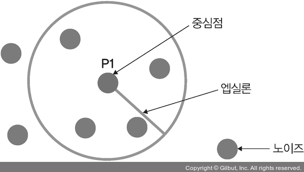

#### 2단계: 군집 확장
- 1단계에서 새로운 군집을 생성했는데, 주어진 데이터를 사용하여 두 번째 군집을 생성한다.
- 데이터의 밀도 기반으로 군집을 생성하기 때문에 밀도가 높은 지역에서 중심점을 만족하는 데이터가 있다면 그 지역을 포함하여 새로운 군집을 생성한다.
- 예를 들어 P1 옆에 있던 빨간색 점을 중심점 P2로 설정하면 minPts=3을 만족하기 때문에 새로운 군집을 생성할 수 있다.
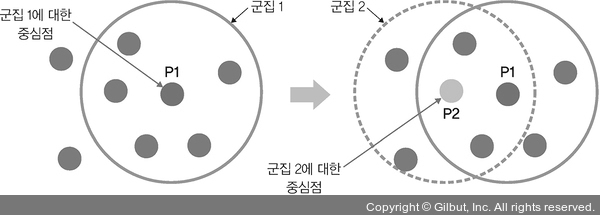
- 밀도 기반 군집 분석은 밀도 기반이기 때문에 주위의 점들을 대상으로 중심점을 설정하고 새로운 군집을 생성하는 것이 가능하다.
- 군집 두 개를 하나의 군집으로 확대한다.
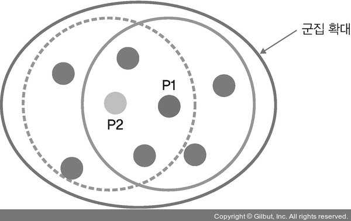

#### 3단계: 1~2단계 반복
- 데이터가 밀집된 밀도가 높은 지역에서 더 이상 중심점을 정의할 수 없을 때까지 1~2단계를 반복한다.

#### 4단계: 노이즈 정의
- 어떤 군집에도 포함되지 않은 데이터를 노이즈로 정의한다.

### 2-3. 주성분 분석 (PCA)
- 사용하는 이유: 주어진 데이터의 간소화
- 언제 사용하면 좋은가?: 현재 데이터의 특성(변수)이 너무 많을 경우에는 데이터를 하나의 플롯(plot)에 시각화해서 살펴보는 것이 어려울 때 특성 p개를 두세 개 정도로 압축해서 데이터를 시각화하여 살펴보고 싶을 때 유용한 알고리즘이다.
- 변수가 많은 고차원 데이터의 경우 중요하지 않은 변수로 처리해야 할 데이터양이 많아지고 성능 또한 나빠지는 경향이 있다.
- 이러한 문제를 해결하고자 고차원 데이터를 저차원으로 축소시켜 데이터가 가진 대표 특성만 추출한다면 성능은 좋아지고 작업도 좀 더 간편해진다.
- 이때 사용하는 대표적인 알고리즘: PCA(Principal Component Analysis)
- 즉, PCA는 고차원 데이터를 저차원(차원 축소) 데이터로 축소시키는 알고리즘이다.
- 차원 축소 방법:

#### 데이터들의 분포 특성을 잘 설명하는 벡터를 두 개 선택
- 아래 그림에서 e1과 e2 두 벡터는 데이터 분포를 잘 설명한다.
- e1의 방향과 크기, e2의 방향과 크기를 알면 데이터 분포가 어떤 형태인지 알 수 있다.

#### 벡터 두 개를 위한 적정한 가중치를 찾을 때까지 학습을 진행

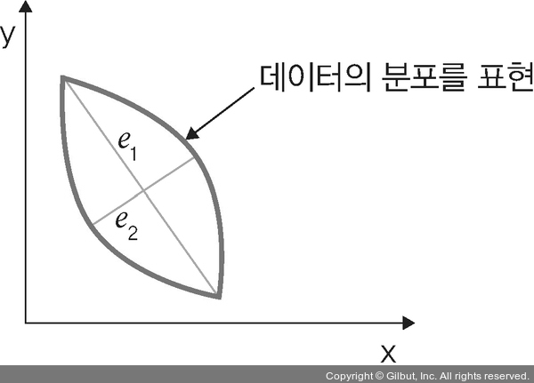

- 즉, PCA는 데이터 하나하나에 대한 성분을 분석하는 것이 아니라, 여러 데이터가 모여 하나의 분포를 이룰 때 이 분포의 주성분을 분석하는 방법이다.
- 간단히 구현한 코드:
```py
pca = decomposition.PCA(n_components=1)
pca_x = pca.fit_transform(x_std)

result = pd.DataFrame(pca_x, columns=['dog'])
result['y-axis'] = 0.0
result['label'] = Y

sns.lmplot('dog', 'y-axis', data=result, fit_reg=False,
           scatter_kws={"s":50}, hue='label')
```
- 밀도 기반 군집 분석과 PCA 예제를 묶어서 진행해 보자.
- 밀도 기반 군집 분석을 이용하여 클러스터링을 진행하겠지만, 시각화를 위해 PCA를 사용해 본다.
- 이번 예제의 목표는 훈련 데이터를 정확하게 클러스터링하는 것이다.

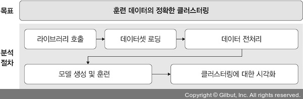

- 필요한 라이브러리를 호출한다.
```py
# 3-34. 라이브러리 호출

import numpy as np
import pandas as pd
import matplotlib.pyplot as plt

# 밀도 기반 군집 분석
from sklearn.cluster import DBSCAN
from sklearn.preprocessing import StandardScaler
from sklearn.preprocessing import normalize
# 데이터 차원 축소
from sklearn.decomposition import PCA
```
- 예제 폴더의 data 폴더의 credit_card.csv 파일을 불러온다.
```py
# 3-35. 데이터 불러오기

X = pd.read_csv('/Users/ramy/PycharmProjects/Pytorch/080289/chap03/data/credit card.csv')

# 불러온 데이터에서 ‘CUST_ID’ 열(칼럼)을 삭제
X = X.drop('CUST_ID', axis=1)
X.ffill(inplace=True)

# 데이터셋 형태 확인
print(X.head())
```
- 출력은 아래와 같다.
```
       BALANCE  BALANCE_FREQUENCY  PURCHASES  ONEOFF_PURCHASES  \
0    40.900749           0.818182      95.40              0.00   
1  3202.467416           0.909091       0.00              0.00   
2  2495.148862           1.000000     773.17            773.17   
3  1666.670542           0.636364    1499.00           1499.00   
4   817.714335           1.000000      16.00             16.00   

   INSTALLMENTS_PURCHASES  CASH_ADVANCE  PURCHASES_FREQUENCY  \
0                    95.4      0.000000             0.166667   
1                     0.0   6442.945483             0.000000   
2                     0.0      0.000000             1.000000   
3                     0.0    205.788017             0.083333   
4                     0.0      0.000000             0.083333   

   ONEOFF_PURCHASES_FREQUENCY  PURCHASES_INSTALLMENTS_FREQUENCY  \
0                    0.000000                          0.083333   
1                    0.000000                          0.000000   
2                    1.000000                          0.000000   
3                    0.083333                          0.000000   
4                    0.083333                          0.000000   

   CASH_ADVANCE_FREQUENCY  CASH_ADVANCE_TRX  PURCHASES_TRX  CREDIT_LIMIT  \
0                0.000000                 0              2        1000.0   
1                0.250000                 4              0        7000.0   
2                0.000000                 0             12        7500.0   
3                0.083333                 1              1        7500.0   
4                0.000000                 0              1        1200.0   

      PAYMENTS  MINIMUM_PAYMENTS  PRC_FULL_PAYMENT  TENURE  
0   201.802084        139.509787          0.000000      12  
1  4103.032597       1072.340217          0.222222      12  
2   622.066742        627.284787          0.000000      12  
3     0.000000        627.284787          0.000000      12  
4   678.334763        244.791237          0.000000      12
```
- `X.fillna(method='ffill', inplace=True)`는 결측 값을 앞의 값으로 채울 때 사용한다. (안내 문구로 `X.ffill(inplace=True)`로 수정함)

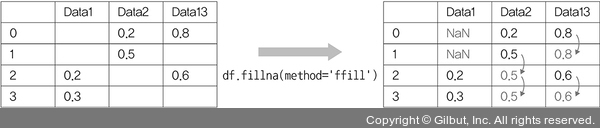

- 데이터 전처리 및 차원 축소를 진행한다.
```py
# 3-36. 데이터 전처리 및 데이터를 2차원으로 차원 축소

scaler = StandardScaler()

# 평균이 0, 표준편차가 1이 되도록 데이터 크기를 조정
X_scaled = scaler.fit_transform(X)

# 데이터가 가우스 분포를 따르도록 정규화
X_normalized = normalize(X_scaled)
# 넘파일 배열을 데이터프레임(dataframe)으로 변환
X_normalized = pd.DataFrame(X_normalized)

# 2차원으로 차원 축소 선언
pca = PCA(n_components=2)
# 차원 축소 적용
X_principal = pca.fit_transform(X_normalized)
X_principal = pd.DataFrame(X_principal)
X_principal.columns = ['P1', 'P2']

print(X_principal.head())
```
- 출력은 아래와 같다.
```
         P1        P2
0 -0.489949 -0.679977
1 -0.519099  0.544825
2  0.330633  0.268880
3 -0.481656 -0.097608
4 -0.563512 -0.482506
```
- 훈련된 모델에 대해 시각적으로 효현한다.
```py
# 3-37. DBSCAN 모델 생성 및 결과의 시각화

# 모델 생성 및 훈련
db_default = DBSCAN(eps=0.0375, min_samples=3).fit(X_principal)
# 각 데이터 포인트에 할당된 모든 클러스터 레이블의 넘파일 배열을 labels에 저장
labels = db_default.labels_

# 출력 그래프의 색상을 위한 레이블 생성
colours = {}
colours[0] = 'y'
colours[1] = 'g'
colours[2] = 'b'
colours[-1] = 'k'

# 각 데이터 포인트에 대한 색상 벡터 생성
cvec = [colours[label] for label in labels]

# 플롯(plot)의 범례(legend) 구성
r = plt.scatter(X_principal['P1'], X_principal['P2'], color='y')
g = plt.scatter(X_principal['P1'], X_principal['P2'], color='g')
b = plt.scatter(X_principal['P1'], X_principal['P2'], color='b')
k = plt.scatter(X_principal['P1'], X_principal['P2'], color='k')

plt.figure(figsize=(9, 9))

# 정의된 색상 벡터에 따라 X축에 P1, Y축에 P2 플로팅>(plotting)
plt.scatter(X_principal['P1'], X_principal['P2'], c=cvec)

# 범례 구축
plt.legend((r, g, b, k), ('Label 0', 'Label 1', 'Label 2', 'Label -1'))
plt.show()
```
- 아래는 DBSCAN 모델을 실행한 결과이다.

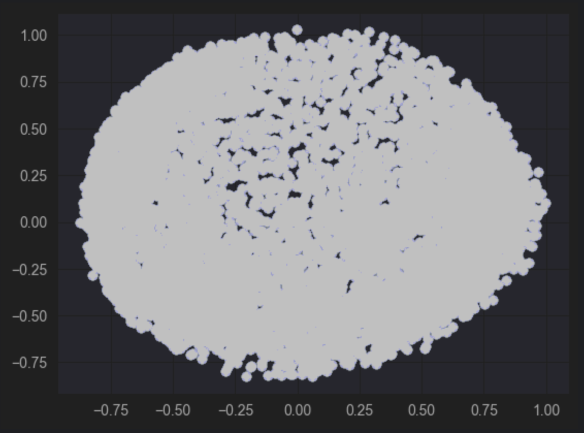
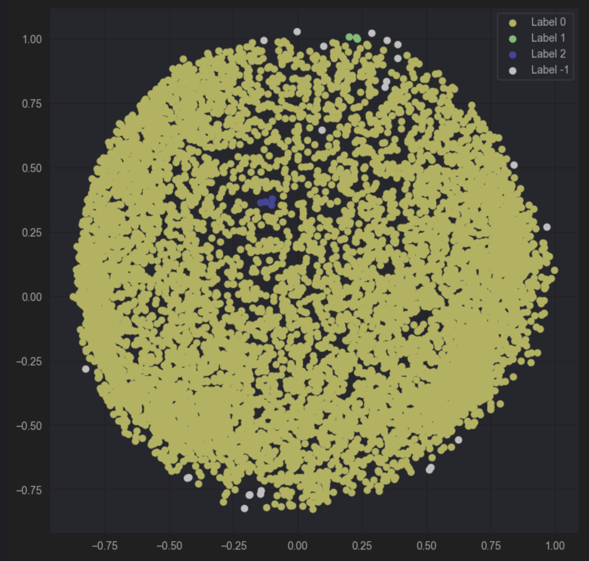

- 출력 결과를 보면 클러스터링에 대한 튜닝이 필요하다.
- 밀도 기반 군집 분석에서 사용하는 `min_samples(minPts)`의 하이퍼파라미터를 3에서 50으로 변경한 후 시각화 부분을 수정해 본다.
```py
# 3-38. 모델 튜닝

db = DBSCAN(eps=0.0375, min_samples=50).fit(X_principal)
labels1 = db.labels_

colours1 = {}
colours1[0] = 'r'
colours1[1] = 'g'
colours1[2] = 'b'
colours1[3] = 'c'
colours1[4] = 'y'
colours1[5] = 'm'
colours1[-1] = 'k'

cvec = [colours1[label] for label in labels1]
colors1 = ['r', 'g', 'b', 'c', 'y', 'm', 'k']

r = plt.scatter(
    X_principal['P1'], X_principal['P2'], marker='o', color=colors1[0])
g = plt.scatter(
    X_principal['P1'], X_principal['P2'], marker='o', color=colors1[1])
b = plt.scatter(
    X_principal['P1'], X_principal['P2'], marker='o', color=colors1[2])
c = plt.scatter(
    X_principal['P1'], X_principal['P2'], marker='o', color=colors1[3])
y = plt.scatter(
    X_principal['P1'], X_principal['P2'], marker='o', color=colors1[4])
m = plt.scatter(
    X_principal['P1'], X_principal['P2'], marker='o', color=colors1[5])
k = plt.scatter(
    X_principal['P1'], X_principal['P2'], marker='o', color=colors1[6])

plt.figure(figsize=(9,9))
plt.scatter(X_principal['P1'], X_principal['P2'], c=cvec)
plt.legend((r, g, b, c, y, m, k),
           ('Label 0', 'Label 1', 'Label 2', 'Label 3', 'Label 4', 'Label 5', 'Label -1'),
           scatterpoints=1,
           loc='upper left',
           ncol=3,
           fontsize=8)
plt.show()
```
- 출력는 아래와 같다.

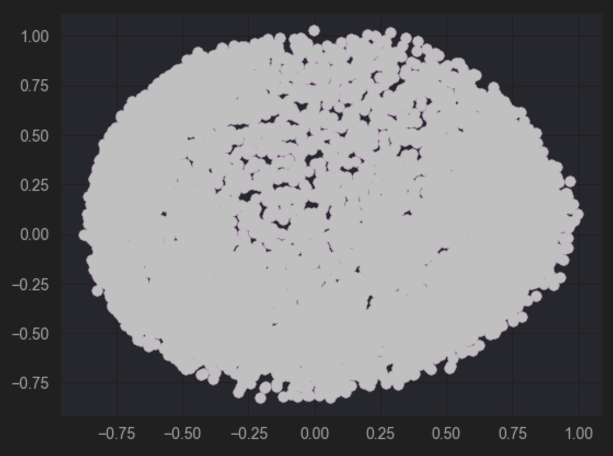
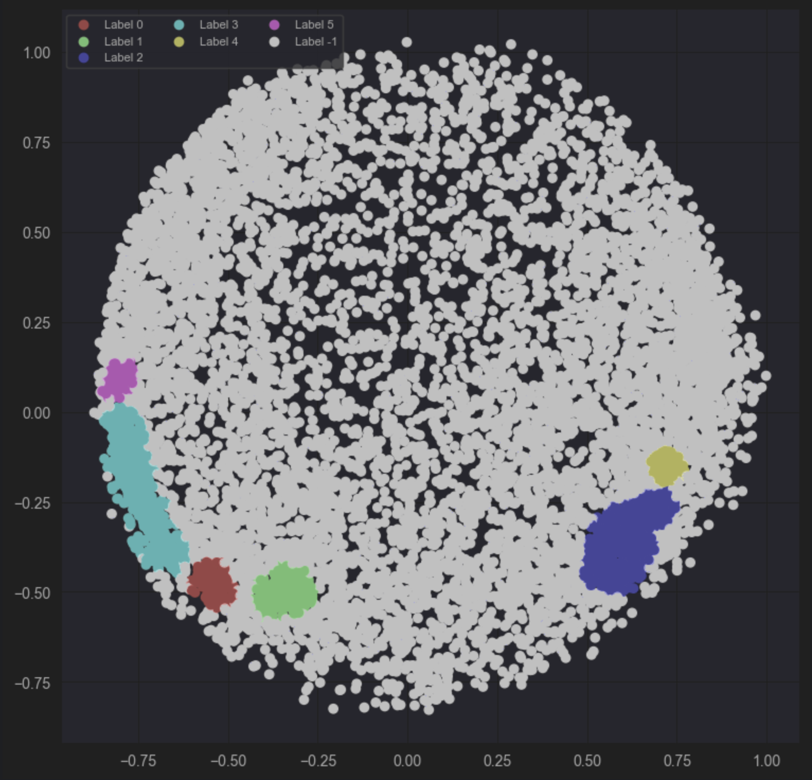

> #### matplotlib 용어
> - 아래 그림은 matplotlib 라이브러리로 출력하는 그림에서 사용되는 용어들
> 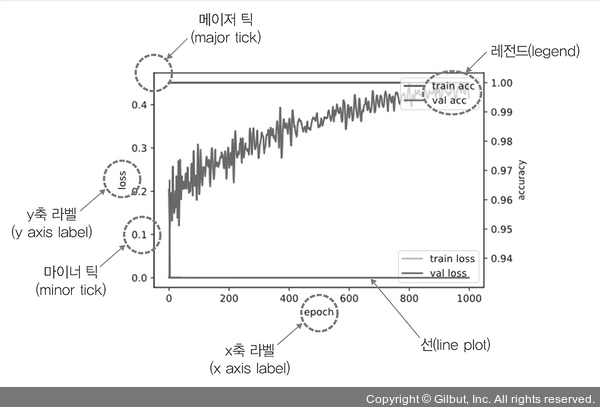

- 앞에서 진행했던 코드보다 군집이 잘 표현되었다.
- 밀도 기반 군집 분석 모델의 하이퍼파라미터 인자 `min_samples`를 50에서 100으로 변경해 보면 아래와 같은 그래프를 출력한다.
```py
# 3-39. min_samples를 50에서 100으로 변경

db = DBSCAN(eps=0.0375, min_samples=100).fit(X_principal)
...
```
- 출력은 아래와 같다.

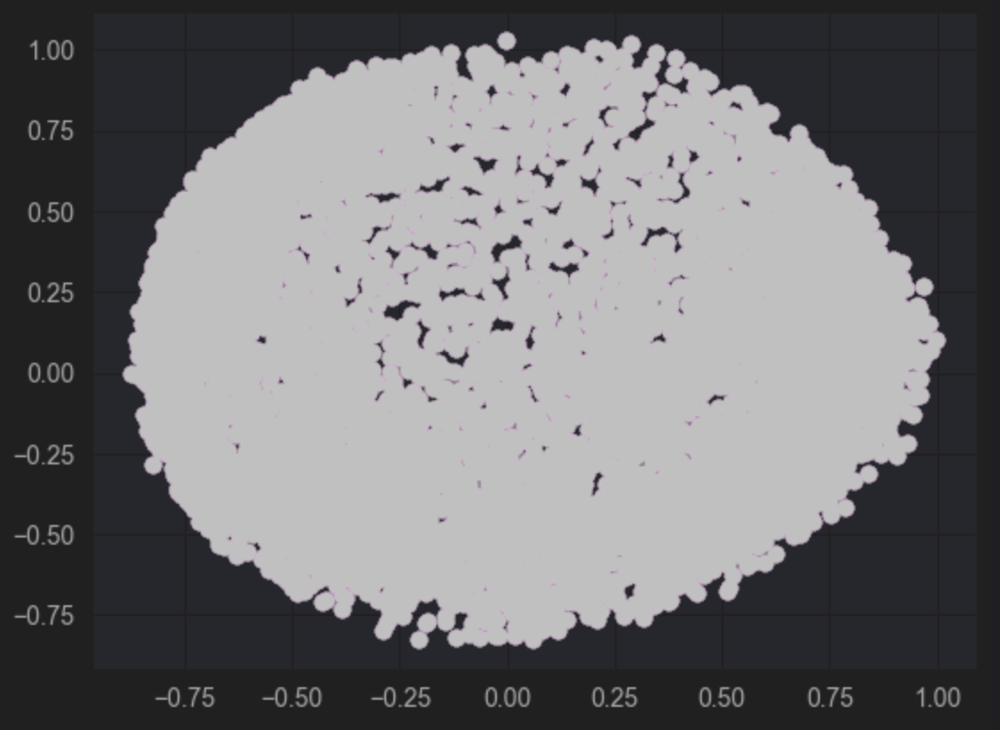
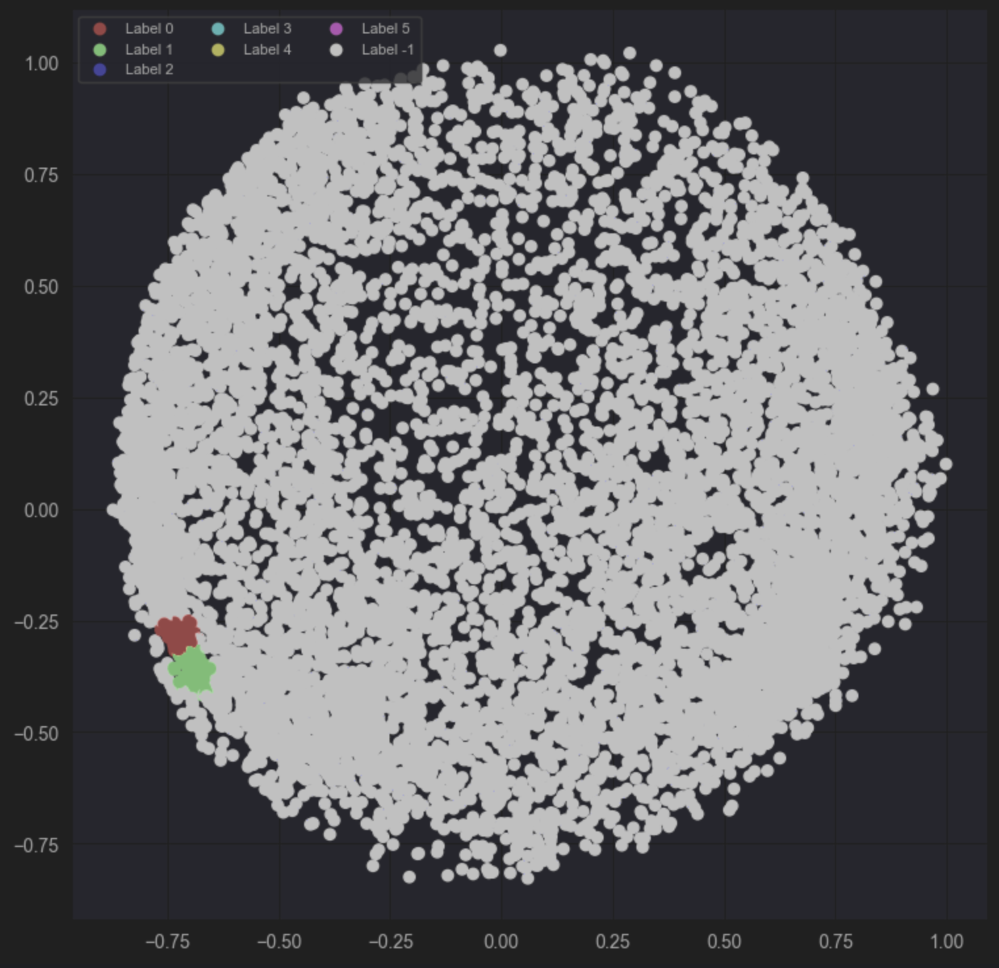

- 많은 클러스터 부분이 무시된 것을 확인할 수 있다.
- 모델에서 하이퍼파라미터 영향에 따라 클러스터 결과(성능)가 달라지므로, 최적의 성능을 내려면 하이퍼파라미터를 이용한 튜닝이 중요하다.