# Chapter 04: 딥러닝 시작
## 01. 인공 신경망의 한계와 딥러닝 출현
- 오늘날 인공 신경망에서 이용하는 구조(입력층, 출력층, 가중치로 구성된 구조)는 프랭크 로젠블라트(Frank Rosenblatt)가 1957년에 고안한 퍼셉트론이라는 선형 분류기이다.
- 이 퍼셉트론은 오늘날 신경망(딥러닝)의 기원이 되는 알고리즘이다.
- 퍼셉트론은 다수의 신호(흐름이 있는)를 입력으로 받아 하나의 신호를 출력하는데, 이 신호를 입력으로 받아 ‘흐른다/안 흐른다(1 또는 0)’는 정보를 앞으로 전달하는 원리로 작동한다.


- 그림과 같이 입력이 두 개(x1, x2) 있다고 할 때 컴퓨터가 논리적으로 인식하는 방식을 알아보기 위해 논리 게이트로 확인해 본다.

### AND 게이트
- AND 게이트는 모든 입력이 `1`일 때 작동한다.
- 입력 중 어떤 하나라도 `0`을 갖는다면 작동을 멈춘다.
- 진리표는 아래와 같다.

|x1|x2|y|
|:---:|:---:|:---:|
|0|0|0|
|1|0|0|
|0|1|0|
|1|1|1|

- AND 게이트에서 아래 그림과 같은 데이터 분류(검은색 점과 흰색 점)로 표현할 수 있다.


### OR 게이트
- OR 게이트는 입력에서 둘 중 하나만 `1`이거나 둘 다 `1`일 때 작동한다.
- 입력 모두가 `0`을 갖는 경우를 제외한 나머지가 모두 `1` 값을 갖는다.
- 진리표는 아래와 같다.

|x1|x2|y|
|:---:|:---:|:---:|
|0|0|0|
|1|0|1|
|0|1|1|
|1|1|1|

- OR 게이트에서 아래 그림과 같은 데이터 분류(검은색 점과 흰색 점)로 표현할 수 있다.


### XOR 게이트
- XOR 게이트는 배타적 논리합이라는 용어로 입력 두 개 중 한 개만 `1`일 때 작동하는 논리 연산이다.
- 진리표는 아래와 같다.

|x1|x2|y|
|:---:|:---:|:---:|
|0|0|0|
|1|0|1|
|0|1|1|
|1|1|0|

- XOR 게이트는 데이터가 비선형적으로 분리되기 때문에 제대로 된 분류가 어렵다.
- 단층 퍼셉트론에서는 AND, OR 연산에 대해서는 학습이 가능하지만, XOR에 대해서는 학습이 불가능하다.


- 이를 극복하는 방안으로 입력층과 출력층 사이에 하나 이상의 중간층(은닉층)을 두어 비선형적으로 분리되는 데이터에 대해서도 학습이 가능하도록 다층 퍼셉트론(multi-layer perceptron)을 고안했다.
- 이때 입력층과 출력층 사이에 은닉층이 여러 개 있는 신경망을 심층 신경망(Deep Neural Network, DNN)이라고 하며, 심층 신경망을 다른 이름으로 딥러닝이라고 한다.

## 02. 딥러닝 구조
### 2-1. 딥러닝 용어
- 딥러닝은 아래 그림과 같이 입력층, 출력층과 두 개 이상의 은닉층으로 구성되어 있다.
- 입력 신호를 전달하기 위해 다양한 함수도 사용하고 있는데, 신경망을 이루는 구성 요소에 대해 알아보자.


|구분|구성 요소|설명|
|:---:|:---:|:---:|
|층|입력층 (input layer)|데이터를 받아들이는 층|
|"|은닉층 (hidden layer)|모든 입력 노드부터 입력 값을 받아 가중합을 계산하고, 이 값을 활성화 함수에 적용하여 출력층에 전달하는 층|
|"|출력층 (output layer)|신경망의 최종 결괏값이 포함된 층|
|가중치 (weight)|=|노드와 노드 간 연결 강도|
|바이어스 (bias)|=|가중합에 더해 주는 상수로, 하나의 뉴런에서 활성화 함수를 거쳐 최종적으로 출력되는 값을 조절하는 역할을 함|
|가중합 (weighted sum), 전달 함수|=|가중치와 신호의 곱을 합한 것|
|함수|활성화 함수 (activation function)|신호를 입력받아 이를 적절히 처리하여 출력해주는 함수|
|"|손실 함수 (loss function)|가중치 학습을 위해 출력 함수의 결과와 실제 값 간의 오차를 측정하는 함수|

#### 가중치
- 가중치: 입력 값이 연산 결과에 미치는 영향력을 조절하는 요소
- 예를 들어 다음 그림에서 w1 값이 0 혹은 0과 가까운 0.001이라면, x1이 아무리 큰 값이라도 x1×w1 값은 0이거나 0에 가까운 값이 된다.
- 이와 같이 입력 값의 연산 결과를 조정하는 역할을 하는 것이 가중치이다.


#### 가중합 또는 전달 함수
- 가중합은 전달 함수라고도 한다.
- 가중합: 각 노드에서 들어오는 신호에 가중치를 곱해서 다음 노드로 전달되는데, 이 값들을 모두 더한 합계
- 노드의 가중합이 계산되면 이 가중합을 활성화 함수로 보내기 때문에 전달 함수(transfer function)라고도 한다.


- 가중합 구하는 공식:


#### 활성화 함수
- 활성화 함수: 전달 함수에서 전달받은 값을 출력할 때 일정 기준에 따라 출력 값을 변화시키는 비선형 함수
- 활성화 함수 종류: 시그모이드(sigmoid), 하이퍼볼릭 탄젠트(hyperbolic tangent), 렐루(ReLU) 함수 등

#### (1) 시그모이드 함수
- 시그모이드 함수는 선형 함수의 결과를 0~1 사이에서 비선형 형태로 변형해 준다.
- 주로 로지스틱 회귀와 같은 분류 문제를 확률적으로 표현하는 데 사용된다.
- 딥러닝 모델의 깊이가 깊어지면 기울기가 사라지는 ‘기울기 소멸 문제(vanishing gradient problem)’가 발생하여 딥러닝 모델에서는 잘 사용하지 않는다.
- 시그모이드 수식:


#### (2) 하이퍼볼릭 탄젠트 함수
- 하이퍼볼릭 탄젠트 함수는 선형 함수의 결과를 -1~1 사이에서 비선형 형태로 변형해 준다.
- 시그모이드에서 결괏값의 평균이 0이 아닌 양수로 편향된 문제를 해결하는 데 사용했지만, 기울기 소멸 문제는 여전히 발생한다.


#### (3) 렐루 함수
- 렐루(ReLU) 함수는 입력(x)이 음수일 때는 0을 출력하고, 양수일 때는 x를 출력한다.
- 경사 하강법(gradient descent)에 영향을 주지 않아 학습 속도가 빠르고, 기울기 소멸 문제가 발생하지 않는 장점이 있다.
- 렐루 함수는 일반적으로 은닉층에서 사용되며, 하이퍼볼릭 탄젠트 함수 대비 학습 속도가 6배 빠르다.
- 음수 값을 입력받으면 항상 0을 출력하기 때문에 학습 능력이 감소하는데, 이를 해결하려고 리키 렐루(Leaky ReLU) 함수 등을 사용한다.


#### (4) 리키 렐루 함수
- 리키 렐루(Leaky ReLU) 함수는 입력 값이 음수이면 0이 아닌 0.001처럼 매우 작은 수를 반환한다.
- 이렇게 하면 입력 값이 수렴하는 구간이 제거되어 렐루 함수를 사용할 때 생기는 문제를 해결할 수 있다.


#### (5) 소프트맥스 함수
- 소프트맥스(softmax) 함수는 입력 값을 0~1 사이에 출력되도록 정규화하여 출력 값들의 총합이 항상 1이 되도록 한다.
- 소프트맥스 함수는 보통 딥러닝에서 출력 노드의 활성화 함수로 많이 사용된다.
- 수식으로 표현하면 아래와 같다.


- exp(x)(앞의 식에서는 exp(ak)와 exp(ai)를 의미)는 지수 함수(exponential function)이다.
- n은 출력층의 뉴런 개수, yk는 그중 k번째 출력을 의미한다.
- 이 수식처럼 소프트맥스 함수의 분자는 입력 신호 ak의 지수 함수, 분모는 모든 입력 신호의 지수 함수 합으로 구성된다.

- 아래는 렐루 함수와 소프트맥스 함수를 파이토치로 구현한 코드이다.
```py
class Net(torch.nn.Module):
    def __init__(self, n_feature, n_hidden, n_output):
        super(Net, self).__init__()

        # 은닉층
        self.hidden = torch.nn.Linear(n_feature, n_hidden)
        self.relu = torch.nn.ReLu(inplace=True)

        # 출력층
        self.out = torch.nn.Linear(n_hidden, n_output)
        self.softmax = torch.nn.Softmax(dim=n_output)

    def forward(self, x):
        x = self.hidden(x)

        # 은닉층을 위한 렐루 활성화 함수
        x = self.relu(x)
        x = self.out(x)

        # 출력층을 위한 소프트맥스 활성화 함수
        x = self.softmax(x)
        return x
```

#### 손실 함수
- 경사 하강법: 학습률(learning rate)과 손실 함수의 순간 기울기를 이용하여 가중치를 업데이트하는 방법
- 미분의 기울기를 이용하여 오차를 비교하고 최소화하는 방향으로 이동시키는 방법이라고 할 수 있다.
- 이때 오차를 구하는 방법이 손실 함수다.
- 손실 함수는 학습을 통해 얻은 데이터의 추정치가 실제 데이터와 얼마나 차이가 나는지 평가하는 지표라고 할 수 있다.
- 이 값이 클수록 많이 틀렸다는 의미이고, 이 값이 ‘0’에 가까우면 완벽하게 추정할 수 있다는 의미이다.
- 대표적인 손실 함수: 평균 제곱 오차(Mean Squared Error, MSE)와 크로스 엔트로피 오차(Cross Entropy Error, CEE)

#### (1) 평균 제곱 오차
- 평균 제곱 오차(MSE): 실제 값과 예측 값의 차이(error)를 제곱하여 평균을 낸 것
- 실제 값과 예측 값의 차이가 클수록 평균 제곱 오차의 값도 커진다는 것은 반대로 생각하면 이 값이 작을수록 예측력이 좋다는 것을 의미한다.
- 평균 제곱 오차는 회귀에서 손실 함수로 주로 사용된다.
- 아래는 평균 제곱 오차를 구하는 수식이다.


- 파이토치에서의 사용법:
```py
import torch

loss_fn = torch.nn.MSELoss(reduction='sum')
y_pred = model(x)
loss = loss_fn(y_pred, y)
```

#### (2) 크로스 엔트로피 오차
- 크로스 엔트로피 오차(CEE): 분류(classification) 문제에서 원-핫 인코딩(one-hot encoding)했을 때만 사용할 수 있는 오차 계산법
- 일반적으로 분류 문제에서는 데이터의 출력을 0과 1로 구분하기 위해 시그모이드 함수를 사용하는데, 시그모이드 함수에 포함된 자연 상수 e 때문에 평균 제곱 오차를 적용하면 매끄럽지 못한 그래프(울퉁불퉁한 그래프)가 출력된다.
- 따라서 크로스 엔트로피 손실 함수를 사용하는데, 이 손실 함수를 적용할 경우 경사 하강법 과정에서 학습이 지역 최소점에서 멈출 수 있다.
- 이것을 방지하고자 자연 상수 e에 반대되는 자연 로그를 모델의 출력 값에 취한다.
- 아래는 크로스 엔트로피를 구하는 수식이다.


- 파이토치에서의 사용법:
```py
loss = nn.CrossEntropyLoss()

# torch.randn은 평균이 0이고 표준편차가 1인 가우시안 정규분포를 이용하여 숫자를 생성
input = torch.randn(5, 6, requires_grad=True)

# torch.empty는 dtype torch.float32의 랜덤한 값으로 채워진 텐서를 반환
target = torch.empty(3, dtype=torch.long).random_(5)
output = loss(input, target)
output.backward()
```

### 2-2. 딥러닝 학습
- 딥러닝 학습은 크게 순전파와 역전파라는 두 단계로 진행된다.


- 첫 번째 단계인 순전파(feedforward)는 네트워크에 훈련 데이터가 들어올 때 발생하며, 데이터를 기반으로 예측 값을 계산하기 위해 전체 신경망을 교차해 지나간다.
- 즉, 모든 뉴런이 이전 층의 뉴런에서 수신한 정보에 변환(가중합 및 활성화 함수)을 적용하여 다음 층(은닉층)의 뉴런으로 전송하는 방식이다.
- 네트워크를 통해 입력 데이터를 전달하며, 데이터가 모든 층을 통과하고 모든 뉴런이 계산을 완료하면 그 예측 값은 최종 층(출력층)에 도달하게 된다.
- 그다음 손실 함수로 네트워크의 예측 값과 실제 값의 차이(손실, 오차)를 추정한다.
- 이때 손실 함수 비용은 ‘0’이 이상적아다.
- 따라서 손실 함수 비용이 0에 가깝도록 하기 위해 모델이 훈련을 반복하면서 가중치를 조정한다.
- 손실(오차)이 계산되면 그 정보는 역으로 전파(출력층 → 은닉층 → 입력층)되기 때문에 역전파(backpropagation)라고 한다.
- 출력층에서 시작된 손실 비용은 은닉층의 모든 뉴런으로 전파되지만, 은닉층의 뉴런은 각 뉴런이 원래 출력에 기여한 상대적 기여도에 따라 값이 달라진다.
- 수학적으로 표현하면 예측 값과 실제 값 차이를 각 뉴런의 가중치로 미분한 후 기존 가중치 값에서 뺀다.
- 이 과정을 출력층 → 은닉층 → 입력층 순서로 모든 뉴런에 대해 진행하여 계산된 각 뉴런 결과를 또다시 순전파의 가중치 값으로 사용한다.

### 2-3. 딥러닝의 문제점과 해결 방안
- 딥러닝의 핵심은 활성화 함수가 적용된 여러 은닉층을 결합하여 비선형 영역을 표현하는 것이다.
- 그림과 같이 활성화 함수가 적용된 은닉층 개수가 많을수록 데이터 분류가 잘되고 있음을 볼 수 있다.


- 은닉층이 많으면 세가지 문제가 생긴다.

#### (1) 과적합 문제 발생
- 과적합(over-fitting)은 훈련 데이터를 과하게 학습해서 발생한다.
- 일반적으로 훈련 데이터는 실제 데이터의 일부분이라서 훈련 데이터를 과하게 학습했기 때문에 예측 값과 실제 값 차이인 오차가 감소하지만, 검증 데이터에 대해서는 오차가 증가할 수 있다.
- 이러한 관점에서 과적합은 훈련 데이터에 대해 과하게 학습하여 실제 데이터에 대한 오차가 증가하는 현상을 의미한다.


- 과적합을 해결하는 방법으로 드롭아웃(dropout)이 있다.
- 신경망 모델이 과적합되는 것을 피하기 위한 방법으로, 학습 과정 중 임의로 일부 노드들을 학습에서 제외시킨다.


- 아래는 파이토치에서 드롭아웃을 구현하는 코드
```py
class DropoutModel(torch.nn.Module):
    def __init__(self):
        super(DropoutModel, self).__init__()
        self.layer1 = torch.nn.Linear(784, 1200)

        # 50%의 노드를 무작위로 선택하여 사용하지 않겠다는 의미
        self.dropout1 = torch.nn.Dropout(0.5)
        self.layer2 = torch.nn.Linear(1200, 1200)
        self.dropout2 = torch.nn.Dropout(0.5)
        self.layer3 = torch.nn.Linear(1200, 10)

    def forward(self, x):
        x = F.relu(self.layer1(x))
        x = self.dropout1(x)
        x = F.relu(self.layer2(x))
        x = self.dropout2(x)
        return self.layer3(x)
```

#### (2) 기울기 소멸 문제 발생
- 기울기 소멸 문제는 은닉층이 많은 신경망에서 주로 발생하는데, 출력층에서 은닉층으로 전달되는 오차가 크게 줄어들어 학습이 되지 않는 현상이다.
- 즉, 기울기가 소멸되기 때문에 학습되는 양이 ‘0’에 가까워져 학습이 더디게 진행되다 오차를 더 줄이지 못하고 그 상태로 수렴하는 현상이다.
- 기울기 소멸 문제는 시그모이드나 하이퍼볼릭 탄젠트 대신 렐루 활성화 함수를 사용하면 해결할 수 있다.


#### (3) 성능이 나빠지는 문제 발생
- 경사 하강법은 손실 함수의 비용이 최소가 되는 지점을 찾을 때까지 기울기가 낮은 쪽으로 계속 이동시키는 과정을 반복하는데, 이때 성능이 나빠지는 문제가 발생한다.


- 이러한 문제점을 개선하고자 확률적 경사 하강법과 미니 배치 경사 하강법을 사용한다.
- 경사 하강법을 좀 더 알아보자.


#### 배치 경사 하강법
- 배치 경사 하강법(Batch Gradient Descent, BGD): 전체 데이터셋에 대한 오류를 구한 후 기울기를 한 번만 계산하여 모델의 파라미터를 업데이트하는 방법
- 즉, 전체 훈련 데이터셋(total training dataset)에 대해 가중치를 편미분하는 방법이다.
- 배치 경사 하강법은 다음 수식을 사용한다.

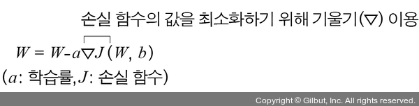

#### 확률적 경사 하강법
- 확률적 경사 하강법(Stochastic Gradient Descent, SGD)은 임의로 선택한 데이터에 대해 기울기를 계산하는 방법으로 적은 데이터를 사용하므로 빠른 계산이 가능하다.
- 아래 그림의 오른쪽과 같이 파라미터 변경 폭이 불안정하고, 때로는 배치 경사 하강법보다 정확도가 낮을 수 있지만 속도가 빠르다는 장점이 있다.

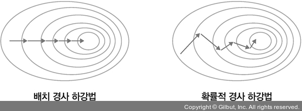

#### 미니 배치 경사 하강법
- 미니 배치 경사 하강법(mini-batch gradient descent): 전체 데이터셋을 미니 배치(mini-batch) 여러 개로 나누고, 미니 배치 한 개마다 기울기를 구한 후 그것의 평균 기울기를 이용하여 모델을 업데이트해서 학습하는 방법

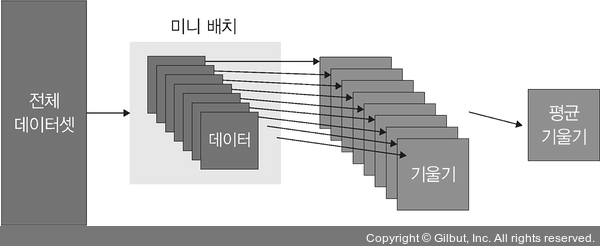

- 미니 배치 경사 하강법은 전체 데이터를 계산하는 것보다 빠르며, 확률적 경사 하강법보다 안정적이라는 장점이 있기 때문에 실제로 가장 많이 사용한다.
- 아래 그림의 오른쪽과 같이 파라미터 변경 폭이 확률적 경사 하강법에 비해 안정적이면서 속도도 빠르다.

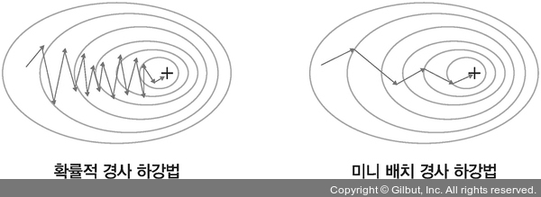

- 파이토치에서의 구현:
```py
class CustomDataset(Dataset):
    def __init__(self):
        self.x_data = [[1, 2, 3], [4, 5, 6], [7, 8, 9]]
        self.y_data = [[12], [18], [11]]

        def __len__(self):
            return len(self.x_data)

        def __getitem__(self, idx):
            x = torch.FloatTensor(self.x_data[idx])
            y = torch.FloatTensor(self.y_data[idx])
            return x, y
dataset = CustomDataset()
dataloader = DataLoader(
    # 데이터셋
    dataset,
    # 미니 배치 크기로 2의 제곱수를 사용하겠다는 의미
    batch_size=2,
    # 데이터를 불러올 때마다 랜덤으로 섞어서 가져옴
    shuffle=True,
)
```

> #### 옵티마이저
> - 확률적 경사 하강법의 파라미터 변경 폭이 불안정한 문제를 해결하기 위해 학습 속도와 운동량을 조정하는 옵티마이저(optimizer)를 적용해 볼 수 있다.
>
> 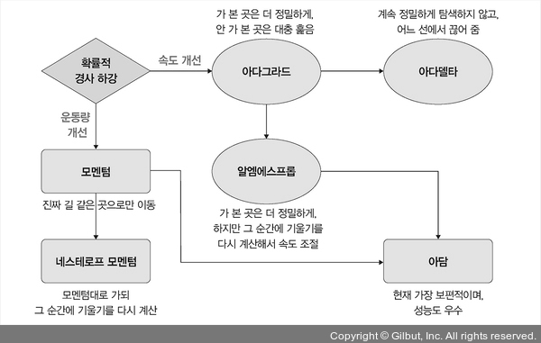
>
> #### 속도를 조정하는 방법
> #### (1) 아다그라드 (Adagrad, Adaptive gradient)
> - 아다그라드는 변수(가중치)의 업데이트 횟수에 따라 학습률을 조정하는 방법이다.
> - 아다그라드는 많이 변화하지 않는 변수들의 학습률은 크게 하고, 많이 변화하는 변수들의 학습률은 작게 한다.
> - 즉, 많이 변화한 변수는 최적 값에 근접했을 것이라는 가정하에 작은 크기로 이동하면서 세밀하게 값을 조정하고, 반대로 적게 변화한 변수들은 학습률을 크게 하여 빠르게 오차 값을 줄이고자 하는 방법이다.
>
> 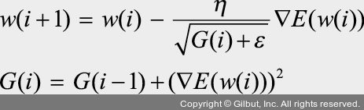
> 
> - 파이토치에서는 아다그라드를 아래와 같이 구현할 수 있다.
> ```py
> # 학습률 기본값은 1e-2
> optimizer = torch.optim.Adagrad(model.parameters(), lr=0.01)
> ```
> - 하지만 아다그라드는 기울기가 0에 수렴하는 문제가 있어 사용하지 않으며, 대신에 알엠에스프롭을 사용한다.
>
> #### (2) 아다델타 (Adadelta, Adaptive delta)
> - 아다델타는 아다그라드에서 G 값이 커짐에 따라 학습이 멈추는 문제를 해결하기 위해 등장한 방법이다.
> - 아다델타는 아다그라드의 수식에서 학습률(η)을 D 함수(가중치의 변화량(Δ) 크기를 누적한 값)로 변환했기 때문에 학습률에 대한 하이퍼파라미터가 필요하지 않다.
>
> 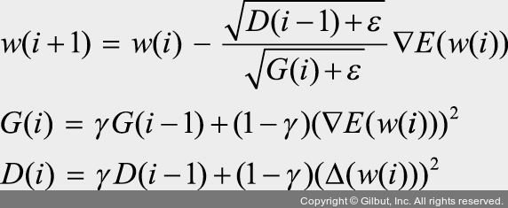
>
> 파이토치에서는 아다델타를 아래와 같이 구현할 수 있다.
> ```py
> # 학습률 기본값은 1.0
> optimizer = torch.optim.Adadelta(model.parameters(), lr=1.0)
> ```
> 
> #### (3) 알엠에스프롭 (RMSProp)
> - 알엠에스프롭은 아다그라드의 G(i) 값이 무한히 커지는 것을 방지하고자 제안된 방법이다.
> 
> 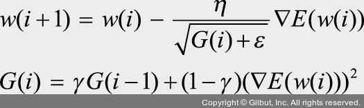
>
> - 아다그라드에서 학습이 안 되는 문제를 해결하기 위해 G 함수에서 γ(감마)만 추가되었다.
> - 즉, G 값이 너무 크면 학습률이 작아져 학습이 안 될 수 있으므로 사용자가 γ 값을 이용하여 학습률 크기를 비율로 조정할 수 있도록 했다.
> - 파이토치에서는 알엠에스프롭을 아래와 같이 구현할 수 있다.
> ```py
> # 학습률 기본값은 1e-2
> optimizer = torch.optim.RMSprop(model.parameters(), lr=0.01)
> ```
>
> #### 운동량을 조정하는 방법
> #### (1) 모멘텀 (Momentum)
> - 경사 하강법과 마찬가지로 매번 기울기를 구하지만, 가중치를 수정하기 전에 이전 수정 방향(+, -)을 참고하여 같은 방향으로 일정한 비율만 수정하는 방법이다.
> - 수정이 양(+)의 방향과 음(-)의 방향으로 순차적으로 일어나는 지그재그 현상이 줄어들고, 이전 이동 값을 고려하여 일정 비율만큼 다음 값을 결정하므로 관성 효과를 얻을 수 있는 장점이 있다.
> - 모멘텀은 SGD(확률적 경사 하강법)와 함께 사용한다.
> - 먼저 확률적 경사 하강법의 수식이 다음과 같다.
>
> 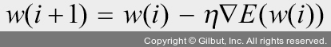
>
> - 이때  수식을 사용하여 가중치를 계산하는데, 기울기 크기와 반대 방향만큼 가중치를 업데이트한다.
> - 즉, 기울기가 크면 아래쪽(-) 방향으로 업데이트한다.
> - 또한, SGD 모멘텀(SGD with Momentum)은 확률적 경사 하강법에서 기울기를 속도(v, velocity)로 대체하여 사용하는 방식으로, 이전 속도의 일정 부분을 반영한다.
> - 즉, 이전에 학습했던 속도와 현재 기울기를 반영해서 가중치를 구한다.
>
> 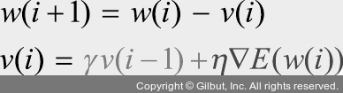
> 
> - 파이토치에서는 다음과 같이 모멘텀을 구현할 수 있다.
> ```py
> optimizer = torch.optim.SGD(model.parameters(), lr=0.01, momentum=0.9)
> ```
> - momentum 값은 0.9에서 시작하며 0.95, 0.99처럼 조금씩 증가시키면서 사용한다.
>
> #### (2) 네스테로프 모멘텀 (Nesterov Accelerated Gradient, NAG)
> - 네스테로프 모멘텀은 모멘텀 값과 기울기 값이 더해져 실제 값을 만드는 기존 모멘텀과 달리 모멘텀 값이 적용된 지점에서 기울기 값을 계산한다.
> - 모멘텀 방법은 멈추어야 할 시점에서도 관성에 의해 훨씬 멀리 갈 수 있는 단점이 있지만, 네스테로프 방법은 모멘텀으로 절반 정도 이동한 후 어떤 방식으로 이동해야 하는지 다시 계산하여 결정하기 때문에 모멘텀 방법의 단점을 극복할 수 있다.
> - 따라서 모멘텀 방법의 이점인 빠른 이동 속도는 그대로 가져가면서 멈추어야 할 적절한 시점에서 제동을 거는 데 훨씬 용이하다.
> - 수식은 아래와 같다.
>
> 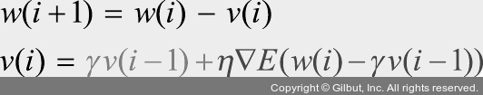
>
> - 모멘텀과 비슷하지만 속도(v)를 구하는 과정에서 조금 차이가 있다.
> - 이전에 학습했던 속도와 현재 기울기에서 이전 속도를 뺀 변화량을 반영해서(더해서) 가중치를 구한다.
>
> 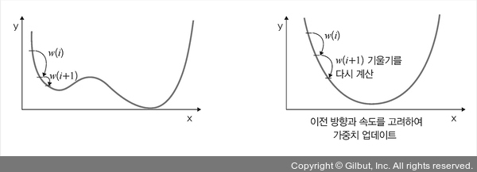
> - 파이토치에서는 아래와 같이 네스테로프 모멘텀을 구현할 수 있다.
> ```py
> # nesterov 기본값은 False
> optimizer = torch.optim.SGD(model.parameters(), lr=0.01, momentum=0.9, nesterov=True)
> ```
>
> #### 속도와 운동량에 대한 혼용 방법
> #### (1) 아담(Adam, Adaptive Moment Estimation)
> - 아담은 모멘텀과 알엠에스프롭의 장점을 결합한 경사 하강법이다.
> - 알엠에스프롭 특징인 기울기의 제곱을 지수 평균한 값과 모멘텀 특징인 v(i)를 수식에 활용한다.
> - 즉, 알엠에스프롭의 G 함수와 모멘텀의 v(i)를 사용하여 가중치를 업데이트한다.
> 
> 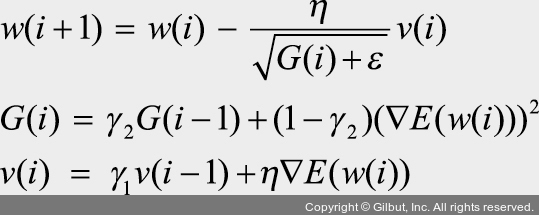
> 
> 파이토치에서는 아래와 같이 아담을 구현할 수 있다.
> ```py
> # 학습률 기본값은 1e-3
> optimizer = torch.optim.Adam(model.parameters(), lr=0.01)
> ```

### 2-4. 딥러닝을 사용할 때 이점
#### 특성 추출
- 컴퓨터가 입력받은 데이터를 분석하여 일정한 패턴이나 규칙을 찾아내려면 사람이 인지하는 데이터를 컴퓨터가 인지할 수 있는 데이터로 변환해야 한다.
- 이때 데이터별로 어떤 특징을 가지고 있는지 찾아내고, 그것을 토대로 데이터를 벡터로 변환하는 작업을 특성 추출(feature extraction)이라고 한다.
- 딥러닝에서는 특성 추출 과정을 알고리즘에 통합시켰다.
- 데이터 특성을 잘 잡아내고자 은닉층을 깊게 쌓는 방식으로 파라미터를 늘린 모델 구조 덕분이다.

#### 빅데이터의 효율적 활용
- 딥러닝에서는 특성 추출을 알고리즘에 통합시키는 것이 가능한 이유는 빅데이터 때문이다.
- 딥러닝 학습을 이용한 특성 추출은 데이터 사례가 많을수록 성능이 향상되기 때문이다.
- 확보된 데이터가 적다면 딥러닝의 성능 향상을 기대하기 힘들기 때문에 머신 러닝을 고려해 보아야 한다.

## 03. 딥러닝 알고리즘
- 딥러닝 알고리즘은 심층 신경망을 사용한다는 공통점이 있다.
- 머신 러닝 알고리즘처럼 목적에 따라 합성곱 신경망(CNN), 순환 신경망(RNN), 제한된 볼츠만 머신(RBM), 심층 신뢰 신경망(DBN)으로 분류된다.

### 3-1. 심층 신경망
- 심층 신경망(DNN): 입력층과 출력층 사이에 다수의 은닉층을 포함하는 인공 신경망
- 머신 러닝에서 비선형 분류를 하기 위해 여러 트릭(trick)을 사용했다.
- 하지만 심층 신경망은 다수의 은닉층을 추가했기 때문에 별도의 트릭 없이 비선형 분류가 가능하다.
- 다수의 은닉층을 두었기 때문에 다양한 비선형적 관계를 학습할 수 있는 장점이 있지만, 학습을 위한 연산량이 많고 기울기 소멸 문제 등이 발생할 수 있다.
- 이러한 문제를 해결하고자 앞서 설명한 드롭아웃, 렐루 함수, 배치 정규화 등을 적용해야 한다.

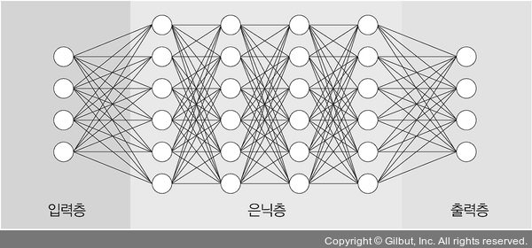

### 3-2. 합성곱 신경망
- 합성곱 신경망(Convolutional Neural Network, CNN): 합성곱층(convolutional layer)과 풀링층(pooling layer)을 포함하는 이미지 처리 성능이 좋은 인공 신경망 알고리즘
- 영상 및 사진이 포함된 이미지 데이터에서 객체를 탐색하거나 객체 위치를 찾아내는 데 유용한 신경망이다.

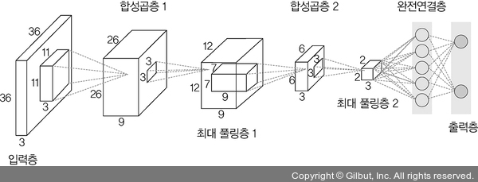

- 합성곱 신경망은 이미지에서 객체, 얼굴, 장면을 인식하기 위해 패턴을 찾는 데 특히 유용하다.
- 대표적인 합성곱 신경망으로 LeNet-5와 AlexNet이 있다.
- 또한, 층을 더 깊게 쌓은 신경망으로는 VGG, GoogLeNet, ResNet 등이 있다.
- 기존 신경망과 비교하여 아래와 같은 차별성이 있다.
    - 각 층의 입출력 형상을 유지한다.
    - 이미지의 공간 정보를 유지하면서 인접 이미지와 차이가 있는 특징을 효과적으로 인식힌다.
    - 복수 필터로 이미지의 특징을 추출하고 학습한다.
    - 추출한 이미지의 특징을 모으고 강화하는 풀링층이 있다.
    - 필터를 공유 파라미터로 사용하기 때문에 일반 인공 신경망과 비교하여 학습 파라미터가 매우 적다.

### 3-3. 순환 신경망
- 순환 신경망(Recurrent Neural Network, RNN): 시계열 데이터(음악, 영상 등) 같은 시간 흐름에 따라 변화하는 데이터를 학습하기 위한 인공 신경망
- 그림과 같이 순환 신경망의 ‘순환(recurrent)’은 자기 자신을 참조한다는 것으로, 현재 결과가 이전 결과와 연관이 있다는 의미이다.

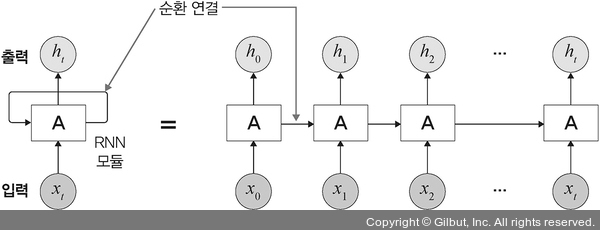

- 순환 신경망의 특징:
    - 시간성(temporal property)을 가진 데이터가 많다.
    - 시간성 정보를 이용하여 데이터의 특징을 잘 다룬다.
    - 시간에 따라 내용이 변하므로 데이터는 동적이고, 길이가 가변적이다.
    - 매우 긴 데이터를 처리하는 연구가 활발히 진행되고 있다.
- 순환 신경망은 기울기 소멸 문제(vanishing gradient problem)로 학습이 제대로 되지 않는 문제가 있다.
- 이를 해결하고자 메모리 개념을 도입한 LSTM(Long-Short Term Memory)이 순환 신경망에서 많이 사용되고 있다.
- 순환 신경망은 자연어 처리 분야와 궁합이 맞다.
- 예시: 언어 모델링, 텍스트 생성, 자동 번역(기계 번역), 음성 인식, 이미지 캡션 생성 등

### 3-4. 제한된 볼츠만 머신
- 볼츠만 머신(Boltzmann machine): 가시층(visible layer)과 은닉층(hidden layer)으로 구성된 모델
- 이 모델에서 가시층은 은닉층과만 연결되는데(가시층과 가시층, 은닉층과 은닉층 사이에 연결은 없는) 이것이 제한된 볼츠만 머신(Restricted Boltzmann Machine, RBM)이다.

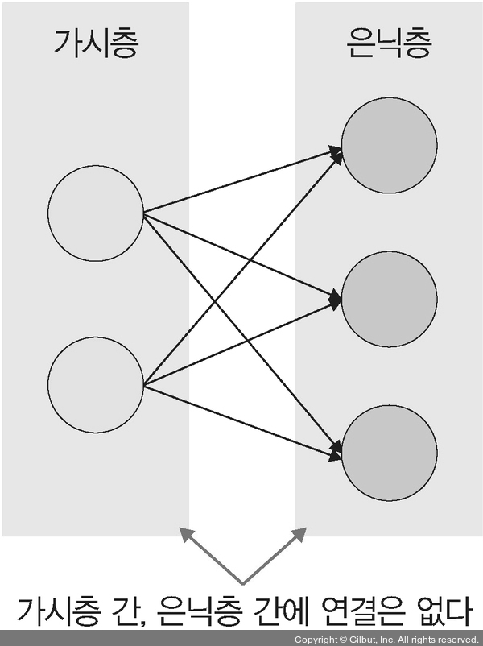

- 제한된 볼츠만 머신의 특징:
    - 차원 감소, 분류, 선형 회귀 분석, 협업 필터링(collaborative filtering), 특성 값 학습(feature learning), 주제 모델링(topic modelling)에 사용한다.
    - 기울기 소멸 문제를 해결하기 위해 사전 학습 용도로 활용 가능하다.
    - 심층 신뢰 신경망(DBN)의 요소로 활용된다.
- 딥러닝에서 많이 사용되는 알고리즘은 CNN과 RNN이다.
- 제한된 볼츠만 머신과 심층 신뢰 신경망은 상대적으로 많이 사용하지 않는다.

### 3-5. 심층 신뢰 신경망
- 심층 신뢰 신경망(Deep Belief Network, DBN): 입력층과 은닉층으로 구성된 제한된 볼츠만 머신을 블록처럼 여러 층으로 쌓은 형태로 연결된 신경망
- 사전 훈련된 제한된 볼츠만 머신을 층층이 쌓아 올린 구조로, 레이블이 없는 데이터에 대한 비지도 학습이 가능하다.
- 부분적인 이미지에서 전체를 연상하는 일반화와 추상화 과정을 구현할 때 사용하면 유용하다.
- 심층 신뢰 신경망의 학습 절차:
    1. 가시층과 은닉층 1에 제한된 볼츠만 머신을 사전 훈련한다.
    2. 첫 번째 층 입력 데이터와 파라미터를 고정하여 두 번째 층 제한된 볼츠만 머신을 사전 훈련한다.
    3. 원하는 층 개수만큼 제한된 볼츠만 머신을 쌓아 올려 전체 DBN을 완성한다.

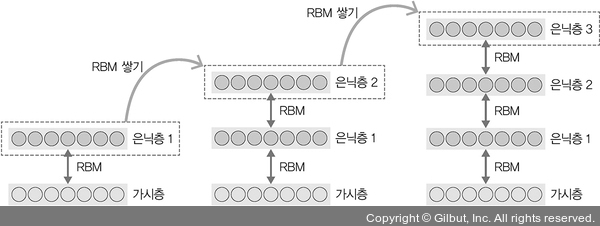

- 심층 신뢰 신경망의 특징:
    - 순차적으로 심층 신뢰 신경망을 학습시켜 가면서 계층적 구조를 생성한다.
    - 비지도 학습으로 학습한다.
    - 위로 올라갈수록 추상적 특성을 추출한다.
    - 학습된 가중치를 다층 퍼셉트론의 가중치 초깃값으로 사용한다.