# Chapter 05: 합성곱 신경망 1
## 01. 합성곱 신경망
#### 딥러닝의 역전파
- 순전파 과정에 따라 계산된 오차 정보가 신경망의 모든 노드(출력층 → 은닉층 → 입력층)로 전송된다.
- 이러한 계산 과정은 복잡하고 많은 자원(CPU 혹은 GPU, 메모리)을 요구하며, 계산하는 데도 오래 걸린다.
- 이 문제를 해결하고자 하는 것이 합성곱 신경망이다.
- 합성곱 신경망은 이미지 전체를 한 번에 계산하는 것이 아닌 이미지의 국소적 부분을 계산함으로써 시간과 자원을 절약하여 이미지의 세밀한 부분까지 분석할 수 있는 신경망이다.

### 1-1. 합성곱층의 필요성
- 합성곱 신경망은 이미지나 영상을 처리하는 데 유용하다.
- 예를 들어 아래과 같이 3×3 흑백(그레이스케일) 이미지가 있다고 가정해 본다.
- 이미지 분석은 그림의 왼쪽과 같은 3×3 배열을 오른쪽과 같이 펼쳐서(flattening) 각 픽셀에 가중치를 곱하여 은닉층으로 전달하게 된다.
- 하지만 그림에서 보이는 것처럼 이미지를 펼쳐서 분석하면 데이터의 공간적 구조를 무시하게 되는데, 이것을 방지하려고 도입된 것이 합성곱층이다.

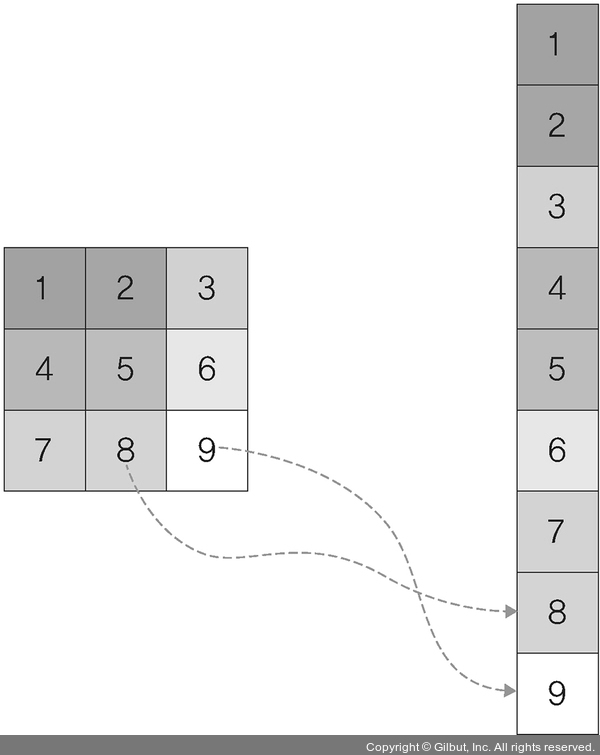

### 1-2. 합성곱 신경망 구조
- 합성곱 신경망(Convolutional Neural Network, CNN 또는 ConvNet)은 음성 인식이나 이미지/영상 인식에서 주로 사용되는 신경망이다.
- 다차원 배열 데이터를 처리하도록 구성되어 컬러 이미지 같은 다차원 배열 처리에 특화되어 있다.
- 계층:
    1. 입력층
    2. 합성곱층
    3. 풀링층
    4. 완전연결층
    5. 출력층

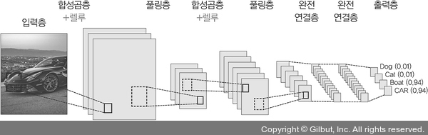

- 합성곱 신경망은 합성곱층과 풀링층을 거치면서 입력 이미지의 주요 특성 벡터(feature vector)를 추출한다.
- 그 후 추출된 주요 특성 벡터들은 완전연결층을 거치면서 1차원 벡터로 변환되며, 마지막으로 출력층에서 활성화 함수인 소프트맥스(softmax) 함수를 사용하여 최종 결과가 출력된다.

#### (1) 입력층
- 입력층(input layer)은 입력 이미지 데이터가 최초로 거치게 되는 계층이다.
- 이미지는 단순 1차원의 데이터가 아닌 높이(height), 너비(width), 채널(channel)의 값을 갖는 3차원 데이터이다.
- 이때 채널은 이미지가 그레이스케일(gray scale)이면 1 값을 가지며, 컬러(RGB)이면 3 값을 갖는다.
- 예를 들어 그림과 같은 형태는 높이 4, 너비 4, 채널은 RGB를 갖고 있으므로, 이미지 형태(shape)는 (4, 4, 3)으로 표현할 수 있다.

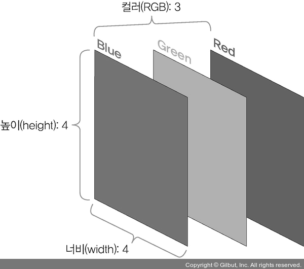

#### (2) 합성곱층
- 합성곱층(convolutional layer)은 입력 데이터에서 특성을 추출하는 역할을 수행한다.
- 특성 추출 진행 과정은 아래와 같다.
- 입력 이미지가 들어왔을 때 이미지에 대한 특성을 감지하기 위해 커널(kernel)이나 필터를 사용한다.
- 커널/필터는 이미지의 모든 영역을 훑으면서 특성을 추출하게 되는데, 이렇게 추출된 결과물이 특성 맵(feature map)이다.
- 이때 커널은 3×3, 5×5 크기로 적용되는 것이 일반적이며, 스트라이드(stride)1라는 지정된 간격에 따라 순차적으로 이동한다.
- 아래는 스트라이드가 1일 때 이동하는 과정이다.
1. 입력 이미지에 3×3 필터 적용
    - 입력 이미지와 필터를 포개 놓고 대응되는 숫자끼리 곱한 후 모두 더한다.
```
(1×1) + (0×0) + (0×1) + (0×0) + (1×1) + (0×0) + (0×1) + (0×0) + (1×1) = 3
```

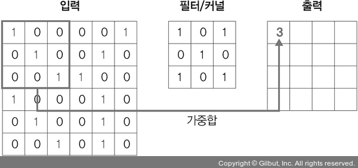

2. 필터가 1만큼 이동
```
(0×1) + (0×0) + (0×1) + (1×0) + (0×1) + (0×0) + (0×1) + (1×0) + (1×1) = 1
```

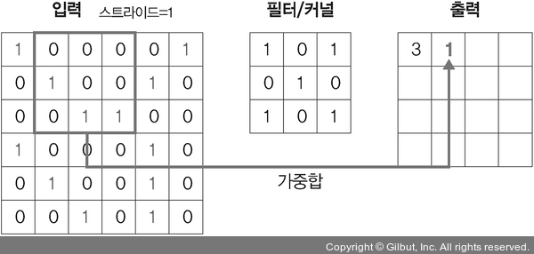

3. 필터가 1만큼 두 번째 이동
```
(0×1) + (0×0) + (0×1) + (0×0) + (0×1) + (1×0) + (1×1) + (1×0) + (0×1) = 1
```

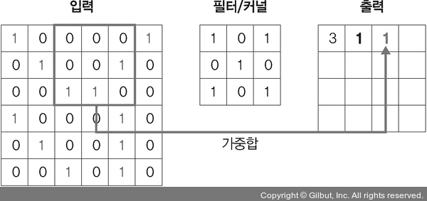

4. 필터가 1만큼 세 번째 이동
```
(0×1) + (0×0) + (1×1) + (0×0) + (1×1) + (0×0) + (1×1) + (0×0) + (0×1) = 3
```


5. 필터가 1만큼 네 번째 이동
```
(0×1) + (1×0) + (0×1) + (0×0) + (0×1) + (1×0) + (1×1) + (0×0) + (0×1) = 1
```

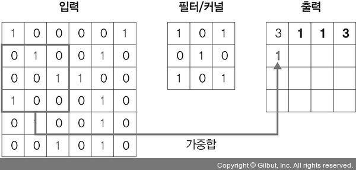

6. 필터가 1만큼 마지막으로 이동
```
(0×1) + (1×0) + (0×1) + (0×0) + (1×1) + (0×0) + (0×1) + (1×0) + (0×1) = 1
```

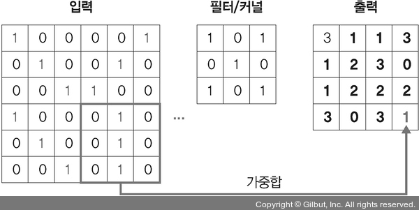

- 앞의 그림에서는 이미지 크기가 (6, 6, 1)이며, 3×3 크기의 커널/필터가 스트라이드 1 간격으로 이동하면서 합성곱 연산을 수행하는 것을 보여준다.
- 이렇게 커널은 스트라이드 간격만큼 순회하면서 모든 입력 값과의 합성곱 연산으로 새로운 특성 맵을 만들게 되며, 앞의 그림과 같이 커널과 스트라이드의 상호 작용으로 원본 (6, 6, 1) 크기가 (4, 4, 1) 크기의 특성 맵으로 줄어들었다.
- 컬러 이미지의 합성곱을 보자.
- 앞서 다룬 그레이스케일 이미지와 구분되는 특징:
    - 필터 채널이 3이라는 것
    - RGB 각각에 서로 다른 가중치로 합성곱을 적용한 후 결과를 더해 준다는 것
- 그 외 스트라이드 및 연산하는 방법은 동일하다.
- 이때 필터 채널이 3이라고 해서 필터 개수도 세 개라고 오해하기 쉬운데, 실제로는 필터 개수가 한 개라는 점에 주의해야 한다.

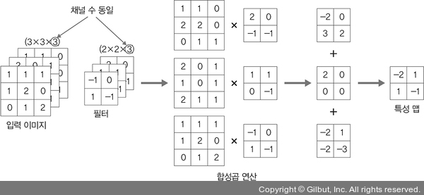

- 필터가 두 개 이상이면 아래 그림과 같이 필터 각각은 특성 추출 결과의 채널이 된다.
- 각 계산은 앞서 진행했던 방법과 동일하다.

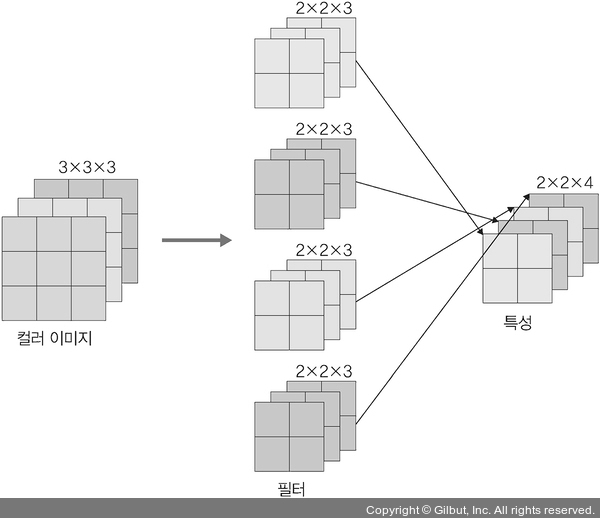

- 합성곱층 요약:
    - 입력 데이터: W1×H1×D1(W1: 가로, ×H1: 세로, ×D1: 채널 또는 깊이)
    - 하이퍼파라미터
        - 필터 개수: K
        - 필터 크기: F
        - 스트라이드: S
        - 패딩: P
    - 출력 데이터
        - W2 = (W1-F+2P)/S+1
        - H2 = (H1-F+2P)/S+1
        - D2 = K
    
#### (3) 풀링층
- 풀링층(pooling layer)은 합성곱층과 유사하게 특성 맵의 차원을 다운 샘플링하여 연산량을 감소시키고, 주요한 특성 벡터를 추출하여 학습을 효과적으로 할 수 있게 한다.
- 풀링 연산에는 두 가지가 사용된다.
    - 최대 풀링(max pooling): 대상 영역에서 최댓값을 추출
    - 평균 풀링(average pooling): 대상 영역에서 평균을 반환
- 대부분의 합성곱 신경망에서는 최대 풀링이 사용되는데, 평균 풀링은 각 커널 값을 평균화시켜 중요한 가중치를 갖는 값의 특성이 희미해질 수 있기 때문이다.
- 아래는 최대 풀링의 연산 과정이다.

1. 첫 번째 최대 풀링 과정
    - 3, -1, -3, 1 값 중에서 최댓값(3)을 선택한다.

    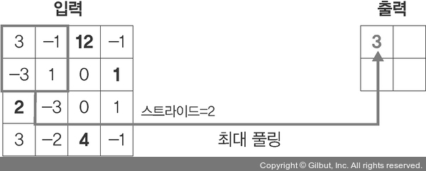

2. 두 번째 최대 풀링 과정
    - 12, -1, 0, 1 값 중에서 최댓값(12)을 선택한다.

    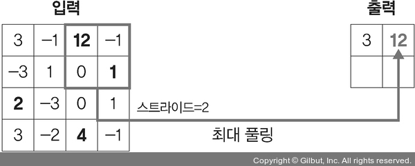

3. 세 번째 최대 풀링 과정
    - 2, -3, 3, -2 값 중에서 최댓값(3)을 선택한다.

    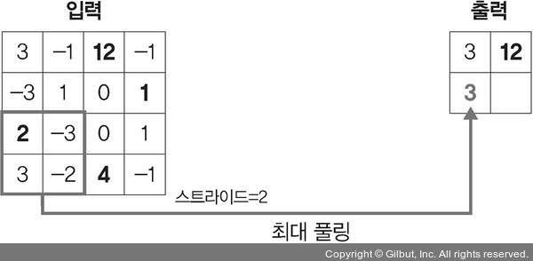

4. 네 번째 최대 풀링 과정
    - 0, 1, 4, -1 값 중에서 최댓값(4)을 선택한다.

    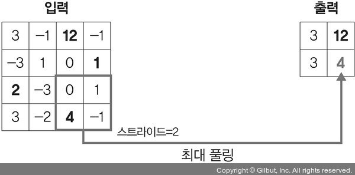

- 평균 풀링의 계산 과정은 최대 풀링과 유사한 방식으로 진행하되 아래와 같이 각 필터의 평균으로 계산한다.
    - 0=(3+(-1)+(-3)+1)/4
    - 3=(12+(-1)+0+1)/4
    - 0=(2+(-3)+3+(-2))/4
    - 1=(0+1+4+(-1))/4
- 아래 그림은 최대 풀링과 평균 풀링 결과를 비교한 것이다.

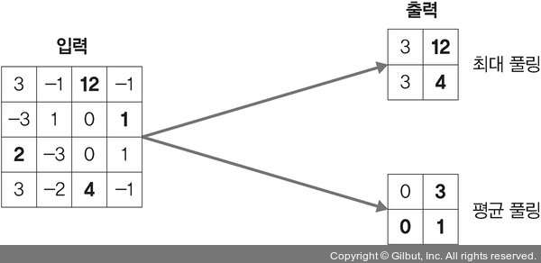

- 최대 풀링과 평균 풀링 요약(최대 풀링과 평균 풀링의 계산 과정은 다르지만 사용하는 파라미터는 동일):
    - 입력 데이터: W1×H1×D1
    - 하이퍼파라미터
        - 필터 크기: F
        - 스트라이드: S
    - 출력 데이터
        - W2 = (W1-F)/S+1
        - H2 = (H1-F)/S+1
        - D2 = D1

#### (4) 완전연결층
- 합성곱층과 풀링층을 거치면서 차원이 축소된 특성 맵은 최종적으로 완전연결층(fully connected layer)으로 전달된다.
- 이 과정에서 이미지는 3차원 벡터에서 1차원 벡터로 펼쳐지게(flatten) 된다.

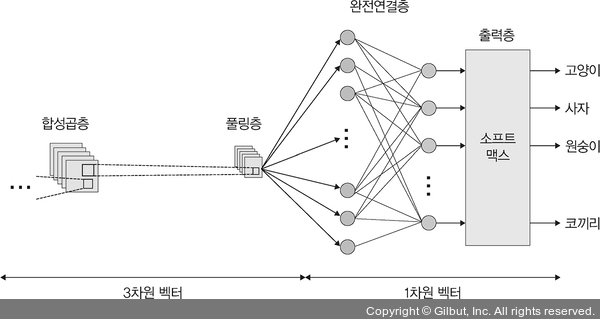

#### (5) 출력층
- 출력층(output layer)에서는 소프트맥스 활성화 함수가 사용되는데, 입력받은 값을 0~1 사이의 값으로 출력한다.
- 따라서 마지막 출력층의 소프트맥스 함수를 사용하여 이미지가 각 레이블(label)에 속할 확률 값이 출력되며, 이때 가장 높은 확률 값을 갖는 레이블이 최종 값으로 선정된다.

### 1-3. 1D, 2D, 3D 합성곱
- 합성곱은 이동하는 방향의 수와 출력 형태에 따라 1D, 2D, 3D로 분류할 수 있다.

#### (1) 1D 합성곱
- 1D 합성곱은 필터가 시간을 축으로 좌우로만 이동할 수 있는 합성곱이다.
- 따라서 입력(W)과 필터(k)에 대한 출력은 W가 된다.
- 예를 들어 입력이 [1, 1, 1, 1, 1]이고 필터가 [0.25, 0.5, 0.25]라면, 출력은 [1, 1, 1, 1, 1]이 된다.
- 즉, 아래 그림과 같이 출력 형태는 1D의 배열이 되며, 그래프 곡선을 완화할 때 많이 사용된다.

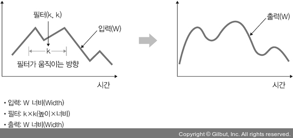

#### (2) 2D 합성곱
- 2D 합성곱은 필터가 다음 그림과 같이 방향 두 개로 움직이는 형태이다.
- 즉, 입력(W, H)과 필터(k, k)에 대한 출력은 (W, H)가 되며, 출력 형태는 2D 행렬이 된다.

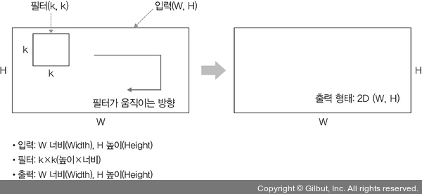

#### (3) 3D 합성곱
- 3D 합성곱은 그림과 같이 필터가 움직이는 방향이 세 개 있다.
- 입력(W, H, L)에 대해 필터(k, k, d)를 적용하면 출력으로 (W, H, L)을 갖는 형태가 3D 합성곱이다.
- 출력은 3D 형태이며, 이때 d < L을 유지하는 것이 중요하다.

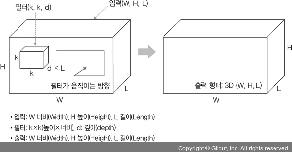

#### (4) 3D 입력을 갖는 2D 합성곱
- 입력이 (224×224×3, 112×112×32)와 같은 3D 형태임에도 출력 형태가 3D가 아닌 2D 행렬을 취하는 것이 ‘3D 입력을 갖는 2D 합성곱’이다.
- 이것은 필터에 대한 길이(L)가 입력 채널의 길이(L)와 같아야 하기 때문에 이와 같은 합성곱 형태가 만들어진다.
- 즉, 입력(W, H, L)에 필터(k, k, L)를 적용하면 출력은 (W, H)가 된다.
- 이때 필터는 그림과 같이 두 방향으로 움직이며 출력 형태는 2D 행렬이 된다.
- 3D 입력을 갖는 2D 합성곱의 대표적 사례로는 LeNet-5와 VGG가 있다.

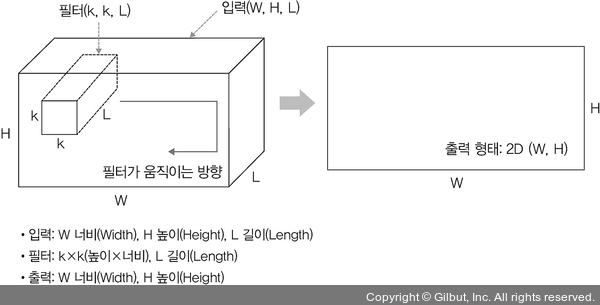

#### (5) 1×1 합성곱
- 1×1 합성곱은 3D 형태로 입력된다.
- 즉, 입력(W, H, L)에 필터(1, 1, L)를 적용하면 출력은 (W, H)가 된다.
- 1×1 합성곱에서 채널 수를 조정해서 연산량이 감소되는 효과가 있으며, 대표적 사례로는 GoogLeNet이 있다.

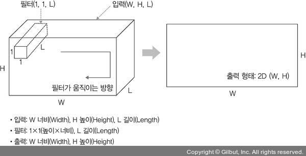

## 02. 합성곱 신경망 맛보기
- fashion_mnist 데이터셋을 사용하여 합성곱 신경망을 직접 구현해 본다.

> #### fashion_mnist 데이터셋
> - fashion_mnist 데이터셋: 토치비전(torchvision)에 내장된 예제 데이터로 운동화, 셔츠, 샌들 같은 작은 이미지의 모음이며, 기본 MNIST 데이터셋처럼 열 가지로 분류될 수 있는 28×28 픽셀의 이미지 7만 개로 구성되어 있다.
> - 데이터셋을 자세히 살펴보면 훈련 데이터(train_images)는 0에서 255 사이의 값을 갖는 28×28 크기의 넘파이(NumPy) 배열이고, 레이블(정답) 데이터(train_labels)는 0에서 9까지 정수 값을 갖는 배열이다.
> - 0에서 9까지 정수 값은 이미지(운동화, 셔츠 등)의 클래스를 나타내는 레이블이다.
> - 각 레이블과 클래스는 아래와 같다.
>     - 0 : T-Shirt
>     - 1 : Trouser
>     - 2 : Pullover
>     - 3 : Dress
>     - 4 : Coat
>     - 5 : Sandal
>     - 6 : Shirt
>     - 7 : Sneaker
>     - 8 : Bag
>     - 9 : Ankle Boot

- 필요한 라이브러리를 호출한다.
```py
# 5-1. 라이브러리 호출

import numpy as np
import matplotlib.pyplot as plt

import torch
import torch.nn as nn
from torch.autograd import Variable
import torch.nn.functional as F

import torchvision

# 데이터 전처리를 위해 사용하는 라이브러리
import torchvision.transforms as transforms
from torch.utils.data import Dataset, DataLoader
```
- CPU를 사용할 것이므로 설정한다.
```py
# 5-2. CPU 혹은 GPU 장치 확인

device = torch.device("cuda:0" if torch.cuda.is_available() else "cpu")
```
- 사용할 fashion_mnist 데이터셋을 토치비전으로 다운받는다.
```py
# 5-3. fashion_mnist 데이터셋 내려받기

train_dataset = torchvision.datasets.FashionMNIST("/Users/ramy/PycharmProjects/Pytorch/Practice/Ch05/data",
                                                  download=True,
                                                  transform=transforms.Compose([transforms.ToTensor()]))

# 테스트 데이터셋을 내려받기
test_dataset = torchvision.datasets.FashionMNIST("/Users/ramy/PycharmProjects/Pytorch/Practice/Ch05/data",
                                                 download=True,
                                                 train=False,
                                                 transform=transforms.Compose([transforms.ToTensor()]))
```
- torchvision.datasets는 torch.utils.data.Dataset의 하위 클래스로 다양한 데이터셋(CIFAR, COCO, MNIST, ImageNet 등)을 포함한다.

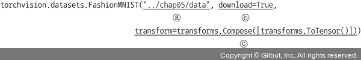

- torchvision.datasets에서 사용하는 주요한 파라미터:
    - 첫 번째 파라미터: FashionMNIST를 내려받을 위치를 지정한다.
    - download: download를 True로 변경해 주면 첫 번째 파라미터의 위치에 해당 데이터셋이 있는지 확인한 후 내려받는다.
    - transform: 이미지를 텐서(0~1)로 변경한다.

- 코드 실행 결과
```
...
Extracting /Users/ramy/PycharmProjects/Pytorch/Practice/Ch05/data/FashionMNIST/raw/t10k-images-idx3-ubyte.gz to /Users/ramy/PycharmProjects/Pytorch/Practice/Ch05/data/FashionMNIST/raw

Downloading http://fashion-mnist.s3-website.eu-central-1.amazonaws.com/t10k-labels-idx1-ubyte.gz
Downloading http://fashion-mnist.s3-website.eu-central-1.amazonaws.com/t10k-labels-idx1-ubyte.gz to /Users/ramy/PycharmProjects/Pytorch/Practice/Ch05/data/FashionMNIST/raw/t10k-labels-idx1-ubyte.gz

100.0%

Extracting /Users/ramy/PycharmProjects/Pytorch/Practice/Ch05/data/FashionMNIST/raw/t10k-labels-idx1-ubyte.gz to /Users/ramy/PycharmProjects/Pytorch/Practice/Ch05/data/FashionMNIST/raw
```
- 내려받은 데이터를 메모리로 불러오기 위해 데이터로더(DataLoader)에 전달한다.
```py
# 5-4. fashion_mnist 데이터를 데이터로더에 전달

train_loader = torch.utils.data.DataLoader(train_dataset, batch_size=100)
test_loader = torch.utils.data.DataLoader(test_dataset, batch_size=100)
```
- torch.utils.data.DataLoader()를 사용하여 원하는 크기의 배치 단위로 데이터를 불러오거나, 순서가 무작위로 섞이도록(shuffle) 할 수 있다.

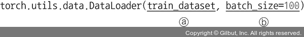

- 데이터로더에서 사용하는 파라미터:
    - 첫 번째 파라미터: 데이터를 불러올 데이터셋을 지정한다.
    - batch_size: 데이터를 배치로 묶어 준다. 위 코드에서는 batch_size=100으로 지정했기 때문에 100개 단위로 데이터를 묶어서 불러온다.

- 예제에서 다루는 이미지를 살펴본다.
- 20개의 이미지를 레이블 정보와 함께 출력한다.
- 이때 레이블은 'T-Shirt', 'Trouser', 'Pullover', 'Dress', 'Coat', 'Sandal', 'Shirt', 'Sneaker', 'Bag', 'Ankle Boot' 등 열 개의 클래스로 구성된다.
```py
# 5-5. 분류에 사용될 클래스 정의

# 열 개의 클래스
labels_map = {0 : 'T-Shirt',
              1 : 'Trouser',
              2 : 'Pullover',
              3 : 'Dress',
              4 : 'Coat',
              5 : 'Sandal',
              6 : 'Shirt',
              7 : 'Sneaker',
              8 : 'Bag',
              9 : 'Ankle Boot'}

# 출력할 이미지의 가로세로 길이로 단위는 inch
fig = plt.figure(figsize=(8,8))
columns = 4
rows = 5

for i in range(1, columns*rows +1):

    # (1)
    img_xy = np.random.randint(len(train_dataset))

    # (2)
    img = train_dataset[img_xy][0][0,:,:]
    fig.add_subplot(rows, columns, i)
    plt.title(labels_map[train_dataset[img_xy][1]])
    plt.axis('off')
    plt.imshow(img, cmap='gray')

# 20개의 이미지 데이터를 시각적으로 표현
plt.show()
```

#### (1)
- np.random은 무작위로 데이터를 생성할 때 사용한다.
- 또한, np.random.randint()는 이산형 분포를 갖는 데이터에서 무작위 표본을 추출할 때 사용한다.
- random.randint(len (train_dataset)) 의미는 0~(train_dataset의 길이) 값을 갖는 분포에서 랜덤한 숫자 한 개를 생성하라는 의미이다.

> #### random.rand와 random.randn 예시
> ```py
> import numpy as np
> ```
> - 0~10의 임의의 숫자 출력
> ```py
> np.random.randint(10)
> ```
> ```
> 2
> ```
> - 1~9의 임의의 숫자를 출력
> ```py
> np.random.randint(1, 10)
> ```
> ```
> 1
> ```
> - 0~1 사이의 정규표준분포 난수를 행렬로 (1×8) 출력
> ```py
> np.random.rand(8)
> ```
> ```
> array([0.89213233, 0.24661652, 0.73743451, 0.25592822, 0.49036819, 0.97493688, 0.6356506 , 0.50091059])
> ```
> - 0~1 사이의 정규표준분포 난수를 행렬로 (4×2) 출력
> ```py
> np.random.rand(4, 2)
> ```
> ```
> array([[0.11760522, 0.08913278],
>        [0.78621819, 0.1720912 ],
>        [0.46788007, 0.30779366],
>        [0.66442201, 0.40509264]])
> ```
> - 평균이 0이고, 표준편차가 1인 가우시안 정규분포 난수를 행렬로 (1×8) 출력
> ```py
> np.random.randn(8)
> ```
> ```
> array([ 0.25879494, -0.43633211, 0.61310559, 0.89605309, -0.8632414, -0.67915832, -0.49204324, -0.43216491])
> ```
> - 평균이 0이고, 표준편차가 1인 가우시안 정규분포 난수를 행렬로 (4×2) 출력
> ```py
> np.random.randn(4, 2)
> ```
> ```
> array([[-0.51816619, -0.91865557],
>        [-0.33232116,  1.21916794],
>        [-1.09654634, -0.42127499],
>        [ 1.40003186, -1.34076957]])
> ```

#### (2)
- train_dataset을 이용한 3차원 배열을 생성한다.
- 배열 사용 예시:
```py
import numpy as np
```
- 1~99의 숫자에서 3씩 건너뛴 행렬을 생성
```py
examp = np.arrange(0, 100, 3)
```
- 행렬의 크기를 6×4로 조정
```py
examp.resize(6,4)
```
```py
examp
```
```
array([[ 0,  3,  6,  9],
       [12, 15, 18, 21],
       [24, 27, 30, 33],
       [36, 39, 42, 45],
       [48, 51, 54, 57],
       [60, 63, 66, 69]])
```
- 3행에 해당하는 모든 요소(값)들을 출력(행과 열은 0부터 시작)
```py
examp[3]
```
```
array([36, 39, 42, 45])
```
- 3행의 3번째 열에 대한 값(요소)을 출력
```py
examp[3, 3]
```
```
45
```
- 3행의 3번째 열에 대한 값(요소)을 출력하기 때문에 바로 앞의 결과와 동일
```py
examp[3][3]
```
```
45
```
- 따라서 train_dataset[img_xy][0][0,:,:] 의미는 아래 예시로 출력 결과를 유추해 볼 수 있다.
```py
examp = np.arange(0, 500, 3)
```
```py
examp.resize(3, 5, 5)
```
```py
examp
```
```
array([[[  0,   3,   6,   9,  12],
        [ 15,  18,  21,  24,  27],
        [ 30,  33,  36,  39,  42],
        [ 45,  48,  51,  54,  57],
        [ 60,  63,  66,  69,  72]],

       [[ 75,  78,  81,  84,  87],
        [ 90,  93,  96,  99, 102],
        [105, 108, 111, 114, 117],
        [120, 123, 126, 129, 132],
        [135, 138, 141, 144, 147]],

       [[150, 153, 156, 159, 162],
        [165, 168, 171, 174, 177],
        [180, 183, 186, 189, 192],
        [195, 198, 201, 204, 207],
        [210, 213, 216, 219, 222]]])
```
```py
examp[2][0][3]
```
```
159
```
- 즉, examp[2][0][3]과 같이 train_dataset[img_xy][0][0,:,:] 의미는 train_dataset에서 [img_xy][0][0,:,:]에 해당하는 요소 값을 가져오겠다는 의미이다.

- 코드를 실행하면 그림과 같이 20개의 이미지가 시각적으로 표현된다.

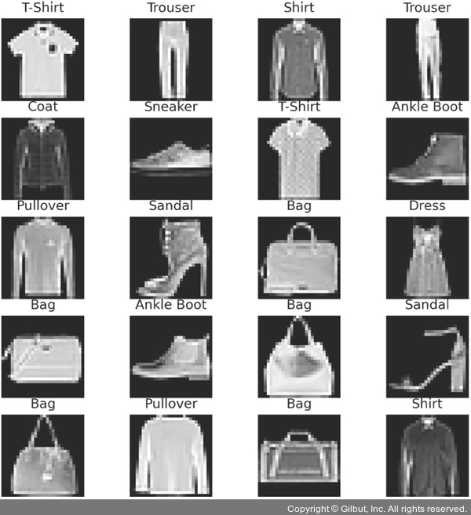

- 합성곱 신경망과 합성곱 신경망이 아닌 심층 신경망의 비교를 위해 먼저 심층 신경망을 생성한 후 학습시켜 본다.
- ConvNet이 적용되지 않은 네트워크를 먼저 만들어 본다.
```py
# 5-6. 심층 신경망 모델 생성

class FashionDNN(nn.Module):

    # (1)
    def __init__(self):
        super(FashionDNN, self).__init__()
        # (2)
        self.fc1 = nn.Linear(in_features=784, out_features=256)
        # (3)
        self.drop = nn.Dropout(0.25)
        self.fc2 = nn.Linear(in_features=256, out_features=128)
        self.fc3 = nn.Linear(in_features=128, out_features=10)

    # (4)
    def forward(self, input_data):
        # (5)
        out = input_data.view(-1, 784)
        # (6)
        out = F.relu(self.fc1(out))
        out = self.drop(out)
        out = F.relu(self.fc2(out))
        out = self.fc3(out)
        return out
```

#### (1)
- 클래스(class) 형태의 모델은 항상 torch.nn.Module을 상속받는다.
- __init__()은 객체가 갖는 속성 값을 초기화하는 역할을 하며, 객체가 생성될 때 자동으로 호출된다.
- super(FashionDNN, self).__init__()은 FashionDNN이라는 부모(super) 클래스를 상속받겠다는 의미이다.

#### (2)
- nn은 딥러닝 모델(네트워크) 구성에 필요한 모듈이 모여 있는 패키지이며, Linear는 단순 선형 회귀 모델을 만들 때 사용한다.

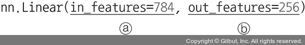

- 사용되는 파라미터:
    - in_features: 입력의 크기(input size)
    - out_features: 출력의 크기(output size)
- 실제로 데이터 연산이 진행되는 forward() 부분에는 첫 번째 파라미터 값만 넘겨주게 되며, 두 번째 파라미터에서 정의된 크기가 forward() 연산의 결과가 된다.

#### (3)
- torch.nn.Dropout(p)는 p만큼의 비율로 텐서의 값이 0이 되고, 0이 되지 않는 값들은 기존 값에 (1/(1-p))만큼 곱해져 커진다.
- 예를 들어 p=0.3이라는 의미는 전체 값 중 0.3의 확률로 0이 된다는 것이며, 0이 되지 않는 0.7에 해당하는 값은 (1/(1-0.7))만큼 커진다.

#### (4)
- forward() 함수는 모델이 학습 데이터를 입력받아서 순전파(forward propagation) 학습을 진행시키며, 반드시 forward라는 이름의 함수여야 한다.
- forward()는 모델이 학습 데이터를 입력받아서 순전파 연산을 진행하는 함수이며, 객체를 데이터와 함께 호출하면 자동으로 실행된다.
- 이때 순전파 연산이란 H(x)^2 식에 입력 x로부터 예측된 y를 얻는 것이다.

#### (5)
- 파이토치에서 사용하는 뷰(view)는 넘파이의 reshape과 같은 역할로 텐서의 크기(shape)를 변경해 주는 역할을 한다.
- 따라서 input_data.view(-1, 784)는 input_data를 (?, 784)의 크기로 변경하라는 의미이다.
- 이때 첫 번째 차원(-1)은 사용자가 잘 모르겠으니 파이토치에 맡기겠다는 의미이고, 두 번째 차원의 길이는 784를 가지도록 하라는 의미이다.
- 2차원 텐서로 변경하되 (?, 784)의 크기로 변경하라는 의미이다.

#### (6)
- 활성화 함수를 지정하는 두가지 방법:
    - F.relu(): forward() 함수에서 정의
    - nn.ReLU(): __init__() 함수에서 정의
- 활성화 함수 사용에 한정하여 이 둘 간의 차이는 간단히 사용하는 위치라고 할 수 있다.
- 근본적으로는 nn.functional.xx()(혹은 F.xx())와 nn.xx()는 사용 방법에 차이가 있다.

- nn을 사용하는 예시 코드
```py
import torch
import torch.nn as nn 

inputs = torch.randn(64, 3, 244, 244)

# 세 개의 채널이 입력되어 64개의 채널이 출력되기 위한 연산으로 3×3 크기의 커널을 사용
conv = nn.Conv2d(in_channels=3, out_channels=64, kernel_size=3, padding=1)
outputs = conv(inputs)
layer = nn.Conv2d(1, 1, 3)
```
- nn.functional을 사용하는 예시 코드
```py
import torch.nn.functional as F

inputs = torch.randn(64, 3, 244, 244)
weight = torch.randn(64, 3, 3, 3)
bias = torch.randn(64)
outputs = F.conv2d(inputs, weight, bias, padding=1)
```
- nn.Conv2d에서 input_channel과 output_channel을 사용해서 연산했다면 functional.conv2d는 입력(input)과 가중치(weight) 자체를 직접 넣어 준다.
- 이때 직접 넣어 준다는 의미는 가중치를 전달해야 할 때마다 가중치 값을 새로 정의해야 함을 의미한다.
- 그 외에 채워야 하는 파라미터들은 nn.Conv2d와 비슷하다.

|구분|nn.xx|nn.functional.xx|
|:---:|:---:|:---:|
|형태|nn.Conv2d:클래스. nn.Module 클래스를 상속받아 사용|nn.functional.conv2d: 함수. def function(input)으로 정의된 순수한 함수|
|호출 방법|먼저 하이퍼파라미터를 전달한 후 함수 호출을 통해 데이터 전달|함수를 호출할 때 하이퍼파라미터, 데이터 전달|
|위치|nn.Sequential 내에 위치|nn.Sequential 에 위치할 수 없음|
|파라미터|파라미터를 새로 정의할 필요 없음|가중치를 수동으로 전달해야 할 때마다 자체 가중치를 정의|

- 모델을 학습시키기 전에 손실 함수, 학습률(learning rate), 옵티마이저(optimizer)에 대해 정의한다.
```py
# 5-7. 심층 신경망에서 필요한 파라미터 정의

learning_rate = 0.001
model = FashionDNN()
model.to(device)

# 분류 문제에서 사용하는 손실 함수
criterion = nn.CrossEntropyLoss()
# (1)
optimizer = torch.optim.Adam(model.parameters(), lr=learning_rate)
print(model)
```

- (1)코드는 옵티마이저를 위한 경사 하강법은 Adam을 사용하며, 학습률을 의미하는 lr은 0.001을 사용한다는 의미이다.
- 코드 실행 시 아래처럼 생성한 심층 신경망 모델을 보여준다.
```
FashionDNN(
  (fc1): Linear(in_features=784, out_features=256, bias=True)
  (drop): Dropout(p=0.25, inplace=False)
  (fc2): Linear(in_features=256, out_features=128, bias=True)
  (fc3): Linear(in_features=128, out_features=10, bias=True)
)
```
- 심층 신경망에 데이터를 적용하여 모델을 학습시킨다.
```py
# 5-8. 심층 신경망을 이용한 모델 학습

num_epochs = 5
count = 0
# (1)
loss_list = []
iteration_list = []
accuracy_list = []

predictions_list = []
labels_list = []

for epoch in range(num_epochs):
    # (2)
    for images, labels in train_loader:
        # (3)
        images, labels = images.to(device), labels.to(device)

        # (4)
        train = Variable(images.view(100, 1, 28, 28))
        labels = Variable(labels)

        # 학습 데이터를 모델에 적용
        outputs = model(train)
        loss = criterion(outputs, labels)
        optimizer.zero_grad()
        loss.backward()
        optimizer.step()
        count += 1
    
        # count를 50으로 나누었을 때 나머지가 0이 아니라면 실행
        if not (count % 50):
            total = 0
            correct = 0
            for images, labels in test_loader:
                images, labels = images.to(device), labels.to(device)
                labels_list.append(labels)
                test = Variable(images.view(100, 1, 28, 28))
                outputs = model(test)
                predictions = torch.max(outputs, 1)[1].to(device)
                predictions_list.append(predictions)
                correct += (predictions == labels).sum()
                total += len(labels)
            
            # (5)
            accuracy = correct * 100 / total
            # (1_)
            loss_list.append(loss.data)
            iteration_list.append(count)
            accuracy_list.append(accuracy)

        if not (count % 500):
            print("Iteration: {}, Loss: {}, Accuracy: {}%".format(count, loss.data, accuracy))
```

#### (1), (1_)
- 일반적으로 배열이나 행렬과 같은 리스트(list)를 사용하는 방법:
    - (1)과 같이 비어 있는 배열이나 행렬을 만든다.
    - (1_)처럼 append 메서드를 이용하여 데이터를 하나씩 추가한다.

#### (2)
- for 구문을 사용하여 레코드(행, 가로줄)를 하나씩 가져온다.
- 이때 for x, y in train:과 같이 in 앞에 변수를 두 개 지정해 주면 레코드에서 요소 두 개를 꺼내 오겠다는 의미이다.

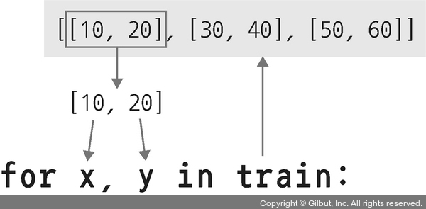

#### (3)
- 모델이 데이터를 처리하기 위해서는 모델과 데이터가 동일한 장치(CPU 또는 GPU)에 있어야 한다.
- 코드 5-7에서 model.to(device)가 GPU를 사용했다면, images.to(device), labels.to(device)도 GPU에서 처리되어야 한다.
- CPU에서 처리된 데이터를 GPU 모델에 적용하거나 그 반대의 경우 런타임 오류가 발생한다.

#### (4)
- Autograd는 자동 미분을 수행하는 파이토치의 핵심 패키지로, 자동 미분에 대한 값을 저장하기 위해 테이프(tape)를 사용한다.
- 순전파(foward) 단계에서 테이프는 수행하는 모든 연산을 저장한다.
- 그리고 역전파(backward) 단계에서 저장된 값들을 꺼내서 사용한다.
- 즉, Autograd는 Variable을 사용해서 역전파를 위한 미분 값을 자동으로 계산해 준다.
- 따라서 자동 미분을 계산하기 위해서는 torch.autograd 패키지 안에 있는 Variable을 이용해야 동작한다.

#### (5)
- 분류 문제에 대한 정확도는 전체 예측에 대한 정확한 예측의 비율로 표현할 수 있으며, 코드는 아래와 같다.
```py
classification accuracy = correct predictions / total predictions
```
- 결과에 100을 곱하여 백분율로 표시하는 코드는 아래와 같다.
```py
classification accuracy = correct predictions / total predictions * 100
```
- 분류 문제에 대한 정확도는 아래와 같이 값을 반전시켜 오분류율 또는 오류율로 표현할 수 있다.
```py
error rate = (1 - (correct predictions / total predictions)) * 100
```
- 분류 문제에서 클래스가 세 개 이상일 때 주의 사항:
    - 정확도가 80% 이상이었다고 하자. 하지만 80%라는 값이 모든 클래스가 동등하게 고려된 것인지, 특정 클래스의 분류가 높았던 것인지에 대해 알 수 없음에 유의해야 한다.
    - 정확도가 90% 이상이었다고 하자. 하지만 100개의 데이터 중 90개가 하나의 클래스에 속할 경우 90%의 정확도는 높다고 할 수 없다. 즉, 모든 데이터를 특정 클래스에 속한다고 예측해도 90%의 예측 결과가 나오기 때문에 데이터 특성에 따라 정확도를 잘 관측해야 한다.

- 코드 5-8을 실행하면 아래와 같이 출력된다.
```
Iteration: 500, Loss: 0.6292067170143127, Accuracy: 83.62000274658203%
Iteration: 1000, Loss: 0.4768368601799011, Accuracy: 84.29000091552734%
Iteration: 1500, Loss: 0.35745346546173096, Accuracy: 84.01000213623047%
Iteration: 2000, Loss: 0.33531057834625244, Accuracy: 85.44000244140625%
Iteration: 2500, Loss: 0.2856130599975586, Accuracy: 85.80999755859375%
Iteration: 3000, Loss: 0.3279655873775482, Accuracy: 86.80999755859375%
```
- 최종적으로 정확도가 86%로 높은 수치를 보여준다.
- 심층 신경망에 대한 모델 생성과 성능을 평가해 보았다면, 이제 합성곱 신경망을 생성해 본다.
```py
# 5-9. 합성곱 네트워크 생성

class FashionCNN(nn.Module):
    def __init__(self):
        super(FashionCNN, self).__init__()

        # (1)
        self.layer1 = nn.Sequential(
            # (2)
            nn.Conv2d(in_channels=1, out_channels=32, kernel_size=3, padding=1),
            # (3)
            nn.BatchNorm2d(32),
            nn.ReLU(),
            # (4)
            nn.MaxPool2d(kernel_size=2, stride=2)
        )

        self.layer2 = nn.Sequential(
            nn.Conv2d(in_channels=32, out_channels=64, kernel_size=3),
            nn.BatchNorm2d(64),
            nn.ReLU(),
            nn.MaxPool2d(2)
        )

        # (5)
        self.fc1 = nn.Linear(in_features=64*6*6, out_features=600)
        self.drop = nn.Dropout2d(0.25)
        self.fc2 = nn.Linear(in_features=600, out_features=120)
        # 마지막 계층의 out_features는 클래스 개수를 의미
        self.fc3 = nn.Linear(in_features=120, out_features=10)

    def forward(self, x):
        out = self.layer1(x)
        out = self.layer2(out)
        # (6)
        out = out.view(out.size(0), -1)
        out = self.fc1(out)
        out = self.drop(out)
        out = self.fc2(out)
        out = self.fc3(out)
        return out
```

#### (1)
- nn.Sequential을 사용하면 __init__()에서 사용할 네트워크 모델들을 정의해 줄 뿐만 아니라, forward() 함수에서 구현될 순전파를 계층(layer) 형태로 좀 더 가독성이 뛰어난 코드로 작성할 수 있다.
- 즉, nn.Sequential은 계층을 차례로 쌓을 수 있도록 Wx + b와 같은 수식과 활성화 함수를 연결해 주는 역할을 한다.
- 특히 데이터가 각 계층을 순차적으로 지나갈 때 사용하면 좋은 방법이다.
- 정리하면 nn.Sequential은 여러 개의 계층을 하나의 컨테이너에 구현하는 방법이라고 생각하면 된다.

#### (2)
- 합성곱층(conv layer)은 합성곱 연산을 통해서 이미지의 특징을 추출한다.
- 합성곱이란 커널(또는 필터)이라는 n×m 크기의 행렬이 높이(height)×너비(width) 크기의 이미지를 처음부터 끝까지 훑으면서 각 원소 값끼리 곱한 후 모두 더한 값을 출력한다.

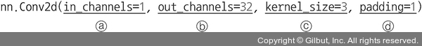

- 커널은 일반적으로 3×3이나 5×5를 사용하며 파라미터는 다음과 같다.
    - in_channels: 입력 채널의 수를 의미한다. 흑백 이미지는 1, RGB 값을 가진 이미지는 3을 가진 경우가 많다.
    - out_channels: 출력 채널의 수를 의미한다.
    - kernel_size: 커널 크기를 의미하며 논문에 따라 필터라고도 한다. 커널은 이미지 특징을 찾아내기 위한 공용 파라미터이며, CNN에서 학습 대상은 필터 파라미터가 된다. 커널은 입력 데이터를 스트라이드 간격으로 순회하면서 합성곱을 계산한다.
    - padding: 패딩 크기를 의미하는 것으로 출력 크기를 조정하기 위해 입력 데이터 주위에 0을 채운다. 패딩 값이 클수록 출력 크기도 커진다.

> #### 채널이란?
> - 2D 합성곱층에 이미지를 적용한다고 가정해 본다.
> - 흑백 이미지일 경우 이미지 데이터는 w×h 형태의 행렬로 표현된다(이때 w는 이미지의 너비, h는 이미지의 높이가 된다).
> - 컬러 이미지를 가정해 본다.
> - 컬러 이미지는 일반적으로 Red, Green, Blue라는 세 개의 채널을 가지고 있다.
> - 이때 컬러 이미지는 w×h×c 형태의 행렬로 표현될 수 있다(c는 채널 수를 의미한다).
> - 3차원으로 생각하면 채널은 결국 깊이(depth)를 의미한다고 할 수 있다.
>
> 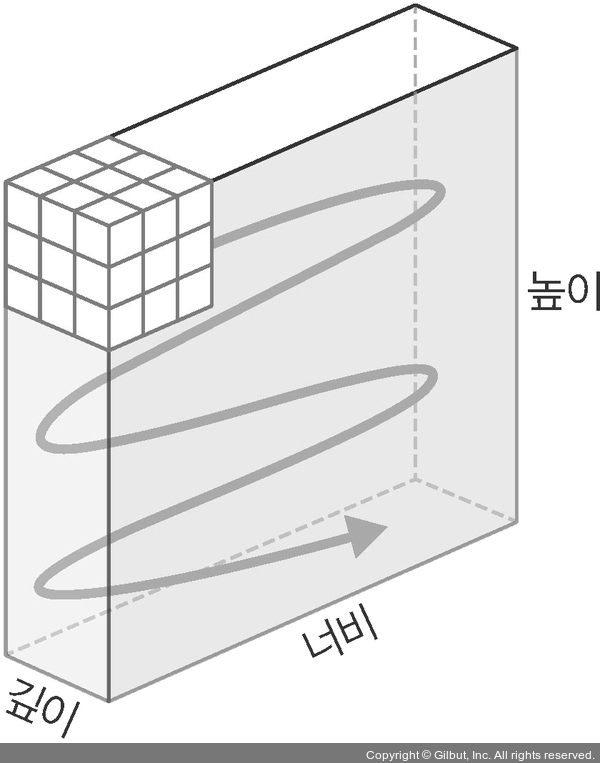

#### (3)
- BatchNorm2d는 학습 과정에서 각 배치 단위별로 데이터가 다양한 분포를 가지더라도 평균과 분산을 이용하여 정규화하는 것을 의미한다.
- 그림을 보면 배치 단위나 계층에 따라 입력 값의 분포가 모두 다르지만 정규화를 통해 분포를 가우시안 형태로 만든다.
- 그러면 평균은 0, 표준편차는 1로 데이터의 분포가 조정된다.

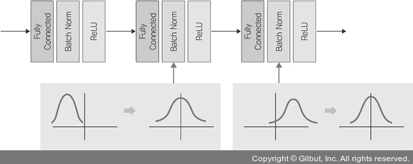

#### (4)
- MaxPool2d는 이미지 크기를 축소시키는 용도로 사용한다.
- 풀링 계층은 합성곱층의 출력 데이터를 입력으로 받아서 출력 데이터(activation map)의 크기를 줄이거나 특정 데이터를 강조하는 용도로 사용된다.
- 풀링 계층을 처리하는 방법으로는 최대 풀링(max pooling)과 평균 풀링(average pooling), 최소 풀링(min pooling)이 있다.

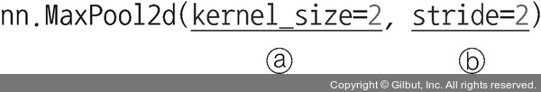

- 사용하는 파라미터:
    - kernel_size: m×n 행렬로 구성된 가중치
    - stride: 입력 데이터에 커널(필터)을 적용할 때 이동할 간격을 의미하는데, 스트라이드 값이 커지면 출력 크기는 작아진다.

#### (5)
- 클래스를 분류하기 위해서는 이미지 형태의 데이터를 배열 형태로 변환하여 작업해야 한다.
- 이때 Conv2d에서 사용하는 하이퍼파라미터 값들에 따라 출력 크기(output size)가 달라진다.
- 즉, 패딩과 스트라이드의 값에 따라 출력 크기가 달라진다.
- 이렇게 줄어든 출력 크기는 최종적으로 분류를 담당하는 완전연결층(fully connected layer)으로 전달된다.

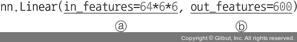

- in_features: 입력 데이터의 크기를 의미한다.
- out_features: 출력 데이터의 크기를 의미한다.
- 이전까지 수행했던 Conv2d, MaxPool2d는 이미지 데이터를 입력으로 받아 처리했다.
- 그 출력 결과를 완전연결층으로 보내기 위해서는 1차원으로 변경해 주어야 하는데, 공식은 아래와 같다.
- 공식은 Conv2d와 MaxPool2d가 다르다
- Conv2d 계층에서의 출력 크기 구하는 공식:
    - 출력 크기 = (W-F+2P)/S+1
        - W: 입력 데이터의 크기(input_volume_size)
        - F: 커널 크기(kernel_size)
        - P: 패딩 크기(padding_size)
        - S: 스트라이드(strides)

- MaxPool2d 계층에서의 출력 크기 구하는 공식:
    - 출력 크기 = IF/F
        - IF: 입력 필터의 크기(input_filter_size, 또한 바로 앞의 Conv2d의 출력 크기이기도 하다)
        - F: 커널 크기(kernel_size)

#### (6)
- 합성곱층에서 완전연결층으로 변경되기 때문에 데이터의 형태를 1차원으로 바꾸어 준다.
- 이때 out.size(0)은 결국 64*6*6을 의미한다.
- 따라서 (64*6*6, ?) 크기의 텐서로 변경하겠다는 의미이다.
- out.view(out.size(0), -1)에서 ‘-1’은 행(row)의 수는 정확히 알고 있지만 열(column)의 수를 알지 못할 때 사용한다.

- 이제 합성곱 네트워크를 사용하기 위한 파라미터를 정의한다.
```py
# 5-10. 합성곱 네트워크를 위한 파라미터 정의

learning_rate = 0.001
model = FashionCNN()
model.to(device)

criterion = nn.CrossEntropyLoss()
optimizer = torch.optim.Adam(model.parameters(), lr=learning_rate)
print(model)
```
- 합성곱 네트워크 구조에 대한 출력 결과:
```
FashionCNN(
  (layer1): Sequential(
    (0): Conv2d(1, 32, kernel_size=(3, 3), stride=(1, 1), padding=(1, 1))
    (1): BatchNorm2d(32, eps=1e-05, momentum=0.1, affine=True, track_running_stats=True)
    (2): ReLU()
    (3): MaxPool2d(kernel_size=2, stride=2, padding=0, dilation=1, ceil_mode=False)
  )
  (layer2): Sequential(
    (0): Conv2d(32, 64, kernel_size=(3, 3), stride=(1, 1))
    (1): BatchNorm2d(64, eps=1e-05, momentum=0.1, affine=True, track_running_stats=True)
    (2): ReLU()
    (3): MaxPool2d(kernel_size=2, stride=2, padding=0, dilation=1, ceil_mode=False)
  )
  (fc1): Linear(in_features=2304, out_features=600, bias=True)
  (drop): Dropout2d(p=0.25, inplace=False)
  (fc2): Linear(in_features=600, out_features=120, bias=True)
  (fc3): Linear(in_features=120, out_features=10, bias=True)
)
```
- 학습 데이터를 이용해 모델을 학습시킨다.
```py
# 5-11. 모델 학습 및 성능 평가

num_epochs = 5
count = 0
loss_list = []
iteration_list = []
accuracy_list = []

predictions_list = []
labels_list = []

for epoch in range(num_epochs):
    for images, labels in train_loader:
        images, labels = images.to(device), labels.to(device)

        train = Variable(images.view(100, 1, 28, 28))
        labels = Variable(labels)

        outputs = model(train)
        loss = criterion(outputs, labels)
        optimizer.zero_grad()
        loss.backward()
        optimizer.step()
        count += 1

        if not (count % 50):
            total = 0
            correct = 0
            for images, labels in test_loader:
                images, labels = images.to(device), labels.to(device)
                labels_list.append(labels)
                test = Variable(images.view(100, 1, 28, 28))
                outputs = model(test)
                predictions = torch.max(outputs, 1)[1].to(device)
                predictions_list.append(predictions)
                correct += (predictions == labels).sum()
                total += len(labels)

            accuracy = correct * 100 / total
            loss_list.append(loss.data)
            iteration_list.append(count)
            accuracy_list.append(accuracy)

        if not (count % 500):
            print("Iteration: {}, Loss: {}, Accuracy: {}%".format(count, loss.data, accuracy))
```
- 실행 시 훈련 결과가 출력된다.
```
Iteration: 500, Loss: 0.42100775241851807, Accuracy: 87.43000030517578%
Iteration: 1000, Loss: 0.3660697638988495, Accuracy: 85.7699966430664%
Iteration: 1500, Loss: 0.34062644839286804, Accuracy: 88.04000091552734%
Iteration: 2000, Loss: 0.2210044115781784, Accuracy: 89.16000366210938%
Iteration: 2500, Loss: 0.12506121397018433, Accuracy: 89.62999725341797%
Iteration: 3000, Loss: 0.19771894812583923, Accuracy: 90.16000366210938%
```
- 심층 신경망과 비교하여 정확도가 약간 높다.
- 심층 신경망과 별 차이가 없기 때문에 좀 더 간편한 심층 신경망만 사용해도 무난할 것 같지만 실제로 이미지 데이터가 많아지면 단순 심층 신경망으로는 정확한 특성 추출 및 분류가 불가능하므로 합성곱 신경망을 생성할 수 있도록 학습해야 한다.
