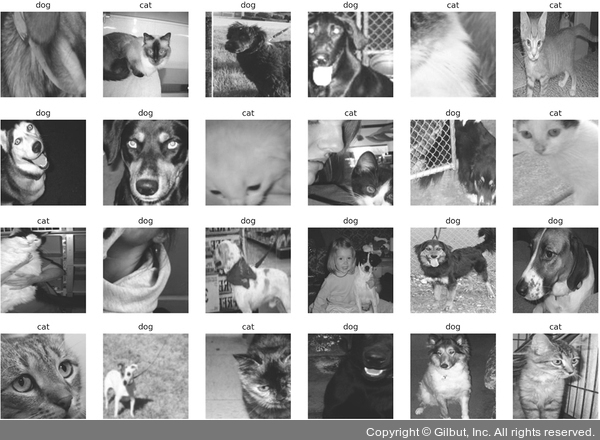

# Chapter 05: 합성곱 신경망 1
## 03. 전이 학습
- 일반적으로 합성곱 신경망 기반의 딥러닝 모델을 제대로 훈련시키려면 많은 양의 데이터가 필요하다.
- 큰 데이터셋을 얻는 어려움을 해결한 것이 전이 학습(transfer learning)이다.
- 전이 학습: 이미지넷(ImageNet)3처럼 아주 큰 데이터셋을 써서 훈련된 모델의 가중치를 가져와 우리가 해결하려는 과제에 맞게 보정해서 사용하는 것
- 이때 아주 큰 데이터셋을 사용하여 훈련된 모델을 사전 훈련된 모델(네트워크)이라고 한다.
- 결과적으로 비교적 적은 수의 데이터를 가지고도 원하는 과제를 해결할 수 있다.


- 전이 학습을 위한 방법으로는 특성 추출과 미세 조정 기법이 있다.

### 3-1. 특성 추추러 기법
- 특성 추출(feature extractor)은 ImageNet 데이터셋으로 사전 훈련된 모델을 가져온 후 마지막에 완전연결층 부분만 새로 만든다.
- 즉, 학습할 때는 마지막 완전연결층(이미지의 카테고리를 결정하는 부분)만 학습하고 나머지 계층들은 학습되지 않도록 한다.
- 특성 추출은 이미지 분류를 위해 두 부분으로 구성된다.
    - 합성곱층: 합성곱층과 풀링층으로 구성
    - 데이터 분류기(완전연결층): 추출된 특성을 입력받아 최종적으로 이미지에 대한 클래스를 분류하는 부분
- 사전 훈련된 네트워크의 합성곱층(가중치 고정)에 새로운 데이터를 통과시키고, 그 출력을 데이터 분류기에서 훈련시킨다.
- 사용 가능한 이미지 분류 모델:
    - Xception
    - Inception V3
    - ResNet50
    - VGG16
    - VGG19
    - MobileNet


- 특성 추출에 필요한 라이브러리를 설치한다.
```
pip install opencv-python
```
- OpenCV: Open Source Computer Vision Library의 약어로 오픈 소스 컴퓨터 비전 라이브러리
- 특히 OpenCV-Python 라이브러리를 설치하면 파이썬에서도 사용이 가능하다.
- 필요한 라이브러리 호출한다.
```py
# 5-12. 라이브러리 호출

import os
import time
import copy
import glob
# 앞에서 설치한 OpenCV 라이브러리
import cv2
import shutil

import torch
# 컴퓨터 비전(computer vision) 용도의 패키지
import torchvision
# 데이터 전처리를 위해 사용되는 패키지
import torchvision.transforms as transforms
# 다양한 파이토치 네트워크를 사용할 수 있도록 도와주는 패키지
import torchvision.models as models
import torch.nn as nn
import torch.optim as optim
from torch.utils.data import DataLoader

import matplotlib.pyplot as plt
```
- 사용할 이미지 데이터에 대한 전처리 방법을 정의한다.
```py
# 5-13. 이미지 데이터 전처리 방법 정의

# 이미지 데이터가 위치한 경로 지정
data_path = '/Users/ramy/PycharmProjects/Pytorch/080289/chap05/data/catanddog/train'

# (1)
transform = transforms.Compose(
                [
                    transforms.Resize([256, 256]),
                    transforms.RandomResizedCrop(224),
                    transforms.RandomHorizontalFlip(),
                    transforms.ToTensor()
])

# (2)
train_dataset = torchvision.datasets.ImageFolder(
                data_path,
                transform=transform
)

# (3)
train_loader = torch.utils.data.DataLoader(
               train_dataset,
               batch_size=32,
               num_workers=8,
               shuffle=True
)

print(len(train_dataset))
```

#### (1)
- torchvision.transfrom은 이미지 데이터를 변환하여 모델(네트워크)의 입력으로 사용할 수 있게 변환한다.


- 사용되는 파라미터:
    - Resize: 이미지의 크기를 조정. 즉, 256×256 크기로 이미지 데이터를 조정한다.
    - RandomResizedCrop: 이미지를 랜덤한 크기 및 비율로 자른다.
    - RandomHorizontalFlip: 이미지를 랜덤하게 수평으로 뒤집는다.
    - ToTensor: 이미지 데이터를 텐서로 변환한다.
- Resize와 RandomResizedCrop 모두 이미지를 자르는 데 사용하지만 그 용도는 다르다.
- Resize가 합성곱층을 통과하기 위해 이미지 크기를 조정하는 전처리 과정이라면, RandomResizedCrop은 데이터 확장 용도로 사용된다.
- RandomResizedCrop은 이미지를 랜덤한 비율로 자른 후 데이터 크기를 조정한다.

#### (2)
- datasets.ImageFolder는 데이터로더가 데이터를 불러올 대상(혹은 경로)과 방법(transform)(혹은 전처리)을 정의한다.


- 사용되는 파라미터:
    - 첫 번째 파라미터: 불러올 데이터가 위치한 경로
    - transform: 이미지 데이터에 대한 전처리

#### (3)
- 데이터로더는 데이터를 불러오는 부분으로 앞에서 정의한 ImageFolder(train_dataset)을 데이터로더에 할당하는데, 이때 한 번에 불러올 데이터양을 결정하는 batch_size를 지정한다.
- 추가적으로 데이터를 무작위로 섞을(shuffle) 것인지도 설정한다.


- 사용되는 파라미터:
    - 첫 번째 파라미터: 데이터셋을 지정한다.
    - batch_size: 한 번에 불러올 데이터양을 결정하는 배치 크기를 설정한다.
    - num_workers: 데이터를 불러올 때 하위 프로세스를 몇 개 사용할지 설정하는데, 이때 너무 많은 하위 프로세스를 설정하게 되면 오류가 발생하거나 메모리 부족 현상이 발생할 수 있다.
    - shuffle: 데이터를 무작위로 섞을지를 지정한다. shuffle=True로 설정하면 데이터를 무작위로 섞어서 랜덤으로 불러온다.

- 코드 실행시 train_dataset에 포함된 데이터 개수가 출력된다.
```
385
```

> #### RandomResizedCrop 자세히 알아보기
> - RandomResizedCrop으로 데이터를 확장하는 방법에 대해 코드로 살펴볼 텐데, mxnet을 설치한다.
> - mxnet 설치가 완료된 후에는 커널을 재시작해야 한다.
> ```
> pip install mxnet
> ```
> - 설치에 실패하면 아래 명령을 사용한다.
> ```
> pip install --user mxnet
> ```
> - 넘파이 버전과 호환성에 문제가 있다는 문구로 호환되는 넘파이 버전으로 재설치된다.
> - 이후 동일한 명령어를 한 번 더 실행하면 다음과 같이 정상적으로 설치된다.
> - 설치가 완료되었다면 아래 코드를 통해 RandomResizedCrop을 이용한 데이터 확장 코드에 대해 알아본다.
> ```py
> import matplotlib.pyplot as plt
> import mxnet as mx
> from mxnet.gluon.data.vision import transforms
> 
> # 예제를 진행할 이미지 불러오기
> example_image = mx.image.imread("../chap05/data/cat.jpg")
> # 불러온 이미지 출력
> plt.imshow(example_image.asnumpy())
> ```
> - 불러올 이미지는 아래와 같다.
>
> 
>
> - 불러온 이미지에 RandomResizedCrop을 적용하기 위한 함수를 생성한다.
> ```py
> def show_images(imgs, num_rows, num_cols, scale=2):
> 
>     # 확장할 이미지의 크기 조정
>     aspect_ratio = imgs[0].shape[0]/imgs[0].shape[1]
>     figsize = (num_cols * scale, num_rows * scale * aspect_ratio)
>     _, axes = plt.subplots(num_rows, num_cols, figsize=figsize)
> 
>     for i in range(num_rows):
>         for j in range(num_cols):
>             axes[i][j].imshow(imgs[i * num_cols + j].asnumpy())
>             # x축 전체를 숨김
>             axes[i][j].axes.get_xaxis().set_visible(False)
>             # y축 전체를 숨김
>             axes[i][j].axes.get_yaxis().set_visible(False)
> 
>     plt.subplots_adjust(hspace=0.1, wspace=0)
>     return axes
> 
> def apply(img, aug, num_rows=2, num_cols=4, scale=3):
>     # 다양한 샘플을 얻기 위해 여러 번 데이터 확장 적용
>     Y = [aug(img) for _ in range(num_rows * num_cols)]
>     show_images(Y, num_rows, num_cols, scale)
> ```
> - RandomResizedCrop이 적용된 이미지를 출력한다.
> ```py
> shape_aug = transforms.RandomResizedCrop(size=(200, 200),
>                                          scale=(0.1, 1),
>                                          ratio=(0.5, 2))
> apply(example_image, shape_aug)
> ```
>
> 
> 
> - RandomResizedCrop에 적용된 파라미터:
>     - size: 출력할 크기를 200×200으로 조정한다.
>     - scale: 면적 비율을 0.1~1(10~100%) 범위 내에서 무작위로 자른다.
>     - ratio: 면적의 너비와 높이 비율을 0.5~2 범위 내에서 무작위로 조절한다.
> - RandomResizedCrop이 적용된 이미지는 아래와 같다.
> 
> 

- 이미지 데이터를 불러왔으니 24개의 이미지에 대해 레이블 정보와 함께 출력한다.
```py
# 5-14. 학습에 사용될 이미지 출력

# (1)
samples, labels = next(iter(train_loader))
# 개와 고양이에 대한 클래스로 구성
classes = {0:'cat', 1:'dog'}
fig = plt.figure(figsize=(16,24))

# 24개의 이미지 데이터 출력
for i in range(24):
    a = fig.add_subplot(4,6,i+1)
    # 레이블 정보(클래스)를 함께 출력
    a.set_title(classes[labels[i].item()])
    a.axis('off')
    # (2)
    a.imshow(np.transpose(samples[i].numpy(), (1,2,0)))
plt.subplots_adjust(bottom=0.2, top=0.6, hspace=0)
```
- 24개의 이미지가 출력된다.



#### (1)
- 반복자(iterator, for 구문과 같은 효과)를 사용하려면 iter()와 next()가 필요하다.
- iter()는 전달된 데이터의 반복자를 꺼내 반환하며, next()는 그 반복자가 다음에 출력해야 할 요소를 반환한다.
- 즉, iter()로 반복자를 구하고 그 반복자를 next()에 전달하여 차례대로 꺼낼 수 있다.
- 앞의 코드에서 반복자는 train_loader가 되기 때문에 train_loader에서 samples와 labels의 값을 순차적으로 꺼내서 저장한다.

#### (2)
- np.transpose는 다음 그림과 같이 행과 열을 바꿈으로써 행렬의 차원을 바꾼다.


- 일반적으로 행렬의 차원을 변경하는 이유는 행렬의 내적 연산 때문이다.
- 다음 그림과 같이 A라는 행렬과 B라는 행렬의 내적 결과는 C가 된다.
- 이때 A 행렬의 행과 B 행렬의 열의 수가 같아야 내적이 가능하다.
- A와 B의 행과 열의 수가 달라 내적이 불가능할 때는 np.transpose()나 np.reshape() 등으로 차원을 조정해야 한다.


- print(samples.shape)을 통해 데이터의 형태를 확인해 보면 torch.Size([32, 3, 224, 224])가 출력된다.
- 이 상태 그대로(np.transpose를 적용하지 않으면) ‘Invalid shape (3, 224, 224) for image data’와 같은 오류가 발생한다.
- 따라서 np.transpose(samples[i].numpy(), (1,2,0))을 사용해서 (224, 224, 3)과 같은 형태로 변환한 후 사용해야 한다.

- 데이터가 준비되었으므로 사전 훈련된 ResNet18 모델을 내려받는다.
```py
# 5-15 사전 훈련된 모델 내려받기

# pretrained=True는 사전 학습된 가중치를 사용하겠다는 의미
resnet18 = models.resnet18(pretrained=True)
```

> #### 사전 훈련된 모델
> - 파이토치는 다음과 같은 방법으로 무작위의 가중치로 모델을 구성할 수 있다.
> ```py
> import torchvision.models as models
> resnet18 = models.resnet18()
> alexnet = models.alexnet()
> vgg16 = models.vgg16()
> squeezenet = models.squeezenet1_0()
> densenet = models.densenet161()
> inception = models.inception_v3()
> googlenet = models.googlenet()
> shufflenet = models.shufflenet_v2_x1_0()
> mobilenet_v2 = models.mobilenet_v2()
> mobilenet_v3_large = models.mobilenet_v3_large()
> mobilenet_v3_small = models.mobilenet_v3_small()
> resnext50_32x4d = models.resnext50_32x4d()
> wide_resnet50_2 = models.wide_resnet50_2()
> mnasnet = models.mnasnet1_0()
> ```
> - 다음과 같은 방법을 이용하여 사전 학습된 모델(사전 학습된 모델의 가중치 값)을 사용할 수 있다.
> - 다음의 모델들이 사용하는 것과 같이 pretrained=True로 설정하여 사용하면 됩니다.
> ```py
> import torchvision.models as models
> resnet18 = models.resnet18(pretrained=True)
> alexnet = models.alexnet(pretrained=True)
> squeezenet = models.squeezenet1_0(pretrained=True)
> vgg16 = models.vgg16(pretrained=True)
> densenet = models.densenet161(pretrained=True) 
> inception = models.inception_v3(pretrained=True)
> googlenet = models.googlenet(pretrained=True)
> shufflenet = models.shufflenet_v2_x1_0(pretrained=True)
> mobilenet_v2 = models.mobilenet_v2(pretrained=True)
> mobilenet_v3_large = models.mobilenet_v3_large(pretrained=True)
> mobilenet_v3_small = models.mobilenet_v3_small(pretrained=True)
> resnext50_32x4d = models.resnext50_32x4d(pretrained=True)
> wide_resnet50_2 = models.wide_resnet50_2(pretrained=True)
> mnasnet = models.mnasnet1_0(pretrained=True)
> ```

- 내려받은 ResNet18의 합성곱층을 사용하되 파라미터에 대해서는 학습을 하지 않도록 고정시킨다.
```py
# 5-16. 사전 훈련된 모델의 파라미터 학습 유무 지정

def set_parameter_requires_grad(model, feature_extracting=True):
    if feature_extracting:
        for param in model.parameters():
            # (1)
            param.requires_grad = False

set_parameter_requires_grad(resnet18)
```

#### (1)
- 역전파 중 파라미터들에 대한 변화를 계산할 필요가 없음을 나타낸다.
- 즉, 모델의 일부를 고정하고 나머지를 학습하고자 할 때 requires_grad = False로 설정한다.
- 이때 모델의 일부는 합성곱층(convolutional layer)과 풀링(pooling)층을 의미한다.

---

- 내려받은 ResNet18의 마지막 부분에 완전연결층을 추가한다.
- 추가된 완전연결층은 개와 고양이 클래스를 분류하는 용도로 사용된다.


```py
# 5-17 ResNet18에 완전연결층 추가

# 2는 클래스가 두 개라는 의미
resnet18.fc = nn.Linear(512, 2)
```

- 참고용으로 모델의 파라미터 값들을 확인해 본다.
```py
# 5-18. 모델의 파라미터 값 확인

# model.named_parameters()는 모델에 접근하여 파라미터 값들을 가져올 때 사용
for name, param in resnet18.named_parameters():
    if param.requires_grad:
        print(name, param.data)
```
- 파라미터 값들을 가져온 결과
```
fc.weight tensor([[ 0.0318,  0.0019,  0.0289,  ..., -0.0349,  0.0058,  0.0059],
        [-0.0376,  0.0417, -0.0440,  ...,  0.0021, -0.0342, -0.0424]])
fc.bias tensor([-0.0242,  0.0311])
```
- 모델 학습 준비를 위해 모델의 객체를 생성하고 손실 함수를 정의한다.
```py
# 5-19. 모델 객체 생성 및 손실 함수 정의

# 모델의 객체 생성
model = models.resnet18(pretrained=True)

# 모델의 합성곱층 가중치 고정
for param in model.parameters():
    param.requires_grad = False

model.fc = torch.nn.Linear(512, 2)

# 완전연결층은 학습
for param in model.fc.parameters():
    param.requires_grad = True

optimizer = torch.optim.Adam(model.fc.parameters())
# 손실 함수 정의
cost = torch.nn.CrossEntropyLoss()
print(model)
```
- 내려받은 ResNet18 모델의 마지막에 완전연결층을 추가한 모델을 보여 준다.
```
ResNet(
  (conv1): Conv2d(3, 64, kernel_size=(7, 7), stride=(2, 2), padding=(3, 3), bias=False)
  (bn1): BatchNorm2d(64, eps=1e-05, momentum=0.1, affine=True, track_running_stats=True)
  (relu): ReLU(inplace=True)
  (maxpool): MaxPool2d(kernel_size=3, stride=2, padding=1, dilation=1, ceil_mode=False)
  (layer1): Sequential(
    (0): BasicBlock(
      (conv1): Conv2d(64, 64, kernel_size=(3, 3), stride=(1, 1), padding=(1, 1), bias=False)
      (bn1): BatchNorm2d(64, eps=1e-05, momentum=0.1, affine=True, track_running_stats=True)
      (relu): ReLU(inplace=True)
      (conv2): Conv2d(64, 64, kernel_size=(3, 3), stride=(1, 1), padding=(1, 1), bias=False)
      (bn2): BatchNorm2d(64, eps=1e-05, momentum=0.1, affine=True, track_running_stats=True)
    )
    (1): BasicBlock(
      (conv1): Conv2d(64, 64, kernel_size=(3, 3), stride=(1, 1), padding=(1, 1), bias=False)
      (bn1): BatchNorm2d(64, eps=1e-05, momentum=0.1, affine=True, track_running_stats=True)
      (relu): ReLU(inplace=True)
      (conv2): Conv2d(64, 64, kernel_size=(3, 3), stride=(1, 1), padding=(1, 1), bias=False)
      (bn2): BatchNorm2d(64, eps=1e-05, momentum=0.1, affine=True, track_running_stats=True)
    )
  )
  (layer2): Sequential(
    (0): BasicBlock(
      (conv1): Conv2d(64, 128, kernel_size=(3, 3), stride=(2, 2), padding=(1, 1), bias=False)
      (bn1): BatchNorm2d(128, eps=1e-05, momentum=0.1, affine=True, track_running_stats=True)
      (relu): ReLU(inplace=True)
      (conv2): Conv2d(128, 128, kernel_size=(3, 3), stride=(1, 1), padding=(1, 1), bias=False)
      (bn2): BatchNorm2d(128, eps=1e-05, momentum=0.1, affine=True, track_running_stats=True)
      (downsample): Sequential(
        (0): Conv2d(64, 128, kernel_size=(1, 1), stride=(2, 2), bias=False)
        (1): BatchNorm2d(128, eps=1e-05, momentum=0.1, affine=True, track_running_stats=True)
      )
    )
    (1): BasicBlock(
      (conv1): Conv2d(128, 128, kernel_size=(3, 3), stride=(1, 1), padding=(1, 1), bias=False)
      (bn1): BatchNorm2d(128, eps=1e-05, momentum=0.1, affine=True, track_running_stats=True)
      (relu): ReLU(inplace=True)
      (conv2): Conv2d(128, 128, kernel_size=(3, 3), stride=(1, 1), padding=(1, 1), bias=False)
      (bn2): BatchNorm2d(128, eps=1e-05, momentum=0.1, affine=True, track_running_stats=True)
    )
  )
  (layer3): Sequential(
    (0): BasicBlock(
      (conv1): Conv2d(128, 256, kernel_size=(3, 3), stride=(2, 2), padding=(1, 1), bias=False)
      (bn1): BatchNorm2d(256, eps=1e-05, momentum=0.1, affine=True, track_running_stats=True)
      (relu): ReLU(inplace=True)
      (conv2): Conv2d(256, 256, kernel_size=(3, 3), stride=(1, 1), padding=(1, 1), bias=False)
      (bn2): BatchNorm2d(256, eps=1e-05, momentum=0.1, affine=True, track_running_stats=True)
      (downsample): Sequential(
        (0): Conv2d(128, 256, kernel_size=(1, 1), stride=(2, 2), bias=False)
        (1): BatchNorm2d(256, eps=1e-05, momentum=0.1, affine=True, track_running_stats=True)
      )
    )
    (1): BasicBlock(
      (conv1): Conv2d(256, 256, kernel_size=(3, 3), stride=(1, 1), padding=(1, 1), bias=False)
      (bn1): BatchNorm2d(256, eps=1e-05, momentum=0.1, affine=True, track_running_stats=True)
      (relu): ReLU(inplace=True)
      (conv2): Conv2d(256, 256, kernel_size=(3, 3), stride=(1, 1), padding=(1, 1), bias=False)
      (bn2): BatchNorm2d(256, eps=1e-05, momentum=0.1, affine=True, track_running_stats=True)
    )
  )
  (layer4): Sequential(
    (0): BasicBlock(
      (conv1): Conv2d(256, 512, kernel_size=(3, 3), stride=(2, 2), padding=(1, 1), bias=False)
      (bn1): BatchNorm2d(512, eps=1e-05, momentum=0.1, affine=True, track_running_stats=True)
      (relu): ReLU(inplace=True)
      (conv2): Conv2d(512, 512, kernel_size=(3, 3), stride=(1, 1), padding=(1, 1), bias=False)
      (bn2): BatchNorm2d(512, eps=1e-05, momentum=0.1, affine=True, track_running_stats=True)
      (downsample): Sequential(
        (0): Conv2d(256, 512, kernel_size=(1, 1), stride=(2, 2), bias=False)
        (1): BatchNorm2d(512, eps=1e-05, momentum=0.1, affine=True, track_running_stats=True)
      )
    )
    (1): BasicBlock(
      (conv1): Conv2d(512, 512, kernel_size=(3, 3), stride=(1, 1), padding=(1, 1), bias=False)
      (bn1): BatchNorm2d(512, eps=1e-05, momentum=0.1, affine=True, track_running_stats=True)
      (relu): ReLU(inplace=True)
      (conv2): Conv2d(512, 512, kernel_size=(3, 3), stride=(1, 1), padding=(1, 1), bias=False)
      (bn2): BatchNorm2d(512, eps=1e-05, momentum=0.1, affine=True, track_running_stats=True)
    )
  )
  (avgpool): AdaptiveAvgPool2d(output_size=(1, 1))
  (fc): Linear(in_features=512, out_features=2, bias=True)
)
```
- 데이터 준비 및 네트워크 생성이 완료되었으므로 이제 모델을 학습시킨다.
- 모델 학습을 위한 함수를 생성한다.
```py
# 5-20. 모델 학습을 위한 함수 생성

def train_model(model, dataloaders, criterion, optimizer, device, num_epochs=13, is_train=True):
    # 컴퓨터의 현재 시각을 구하는 함수
    since = time.time()
    acc_history = []
    loss_history = []
    best_acc = 0.0
    
    # 에포크(13)만큼 반복
    for epoch in range(num_epochs):
        print('Epoch {}/{}'.format(epoch, num_epochs-1))
        print('-' * 10)

        running_loss = 0.0
        running_corrects = 0
        
        # 데이터로더에 전달된 데이터만큼 반복
        for inputs, labels in dataloaders:
            inputs = inputs.to(device)
            labels = labels.to(device)

            model.to(device)
            # 기울기를 0으로 설정
            optimizer.zero_grad()
            # 순전파 학습
            outputs = model(inputs)
            loss = criterion(outputs, labels)
            _, preds = torch.max(outputs, 1)
            # 역전파 학습
            loss.backward()
            optimizer.step()
            
            # 출력 결과와 레이블의 오차를 계산한 결과를 누적하여 저장
            running_loss += loss.item() * inputs.size(0)
            # 출력 결과와 레이블이 동일한지 확인한 결과를 누적하여 저장
            running_corrects += torch.sum(preds == labels.data)

        # 평균 오차 계산
        epoch_loss = running_loss / len(dataloaders.dataset)
        # 평균 정확도 계산
        epoch_acc = running_corrects.double() / len(dataloaders.dataset)

        print('Loss: {:.4f} Acc: {:.4f}'.format(epoch_loss, epoch_acc))

        if epoch_acc > best_acc:
           best_acc = epoch_acc

        acc_history.append(epoch_acc.item())
        loss_history.append(epoch_loss)
        # 모델 재사용을 위해 저장
        torch.save(model.state_dict(), os.path.join('../chap05/data/catanddog/',  '{0:0=2d}.pth'.format(epoch)))
        print()

    # 실행 시간(학습 시간)을 계산
    time_elapsed = time.time() - since
    print('Training complete in {:.0f}m {:.0f}s'.format(time_elapsed // 60, time_elapsed % 60))
    print('Best Acc: {:4f}'.format(best_acc))
    # 모델의 정확도와 오차를 반환
    return acc_history, loss_history
```
- 마지막으로 ResNet18에 추가된 완전연결층은 학습을 하도록 설정한다.
- 학습을 통해 얻어지는 파라미터를 옵티마이저에 전달해서 최종적으로 모델 학습에 사용한다.
```py
# 5-21. 파라미터 학습 결과를 옵티마이저에 전달

params_to_update = []
for name, param in resnet18.named_parameters():
    if param.requires_grad == True:
        # 파라미터 학습 결과를 저장
        params_to_update.append(param)
        print("\t", name)

# 학습 결과를 옵티마이저에 전달
optimizer = optim.Adam(params_to_update)
```
- 다음은 완전연결층의 어떤 파라미터들이 옵티마이저로 전달되는지를 보여준다.
- 다음 결과와 같이 weight와 bias 값들이 업데이트되고 옵티마이저에 전달될 것이다.
```
fc.weight
fc.bias
```
- 이제 모델을 학습시킨다.
```py
# 5-22. 모델 학습

device = torch.device("cuda" if torch.cuda.is_available() else "cpu")
# 손실 함수 지정
criterion = nn.CrossEntropyLoss()
train_acc_hist, train_loss_hist = train_model(resnet18, train_loader, criterion, optimizer, device)
```
- 모델 훈련을 위해 전달되는 파라미터는 (모델, 학습 데이터, 손실 함수, 옵티마이저, 장치(CPU 혹은 GPU))이다.
- 다음은 모델 학습에 대한 결과이다.
```
Epoch 0/12
----------
Loss: 0.4494 Acc: 0.7974

Epoch 1/12
----------
Loss: 0.3353 Acc: 0.8675

Epoch 2/12
----------
Loss: 0.2859 Acc: 0.8987

Epoch 3/12
----------
Loss: 0.3072 Acc: 0.8675

Epoch 4/12
----------
Loss: 0.2395 Acc: 0.8909

Epoch 5/12
----------
Loss: 0.2614 Acc: 0.8961

Epoch 6/12
----------
Loss: 0.2955 Acc: 0.8727

Epoch 7/12
----------
Loss: 0.2494 Acc: 0.9013

Epoch 8/12
----------
Loss: 0.1800 Acc: 0.9325

Epoch 9/12
----------
Loss: 0.2582 Acc: 0.8883

Epoch 10/12
----------
Loss: 0.1956 Acc: 0.9195

Epoch 11/12
----------
Loss: 0.1788 Acc: 0.9351

Epoch 12/12
----------
Loss: 0.2110 Acc: 0.9091

Training complete in 11m 49s
Best Acc: 0.935065
```
- 약 93%로 상당히 높은 정확도를 보여 주고 있다.
- 훈련 데이터로는 학습이 잘되었다고 할 수 있다.
- 이제 테스트 용도의 데이터를 이용하여 모델 정확도를 측정해 보아야 한다.
- 테스트 데이터를 불러와 전처리한다.
```py
# 5-23. 테스트 데이터 호출 및 전처리

test_path = '/Users/ramy/PycharmProjects/Pytorch/080289/chap05/data/catanddog/test'

transform = transforms.Compose(
                [
                   transforms.Resize(224),
                   transforms.CenterCrop(224),
                   transforms.ToTensor(),
])
test_dataset = torchvision.datasets.ImageFolder(
    root=test_path,
    transform=transform
)
test_loader = torch.utils.data.DataLoader(
    test_dataset,
    batch_size=32,
    num_workers=1,
    shuffle=True
)

print(len(test_dataset))
```
- 다음은 테스트 데이터가 몇 건인지 보여준다.
- 테스트용 데이터로 부족하지만 실습을 진행할 환경을 고려하여 일부만 사용한다.
```
98
```
- 테스트 데이터 평가를 위한 함수를 생성한다.
```py
# 5-24. 테스트 데이터 평가 함수 생성

def eval_model(model, dataloaders, device):
    since = time.time()
    acc_history = []
    best_acc = 0.0

    # (1)
    saved_models = glob.glob('/Users/ramy/PycharmProjects/Pytorch/080289/chap05/data/catanddog/' + '*.pth')
    # 불러온 .pth 파일들을 정렬
    saved_models.sort()
    print('saved_model', saved_models)

    for model_path in saved_models:
        print('Loading model', model_path)

        model.load_state_dict(torch.load(model_path))
        model.eval()
        model.to(device)
        running_corrects = 0

        # 테스트 반복
        for inputs, labels in dataloaders:
            inputs = inputs.to(device)
            labels = labels.to(device)

            # autograd를 사용하지 않겠다는 의미
            with torch.no_grad():
                # 데이터를 모델에 적용한 결과를 outputs에 저장
                outputs = model(inputs)

            # (2)
            _, preds = torch.max(outputs.data, 1)
            # torch.max로 출력된 값이 0.5보다 크면 올바르게 예측
            preds[preds >= 0.5] = 1
            # torch.max로 출력된 값이 0.5보다 작으면 틀리게 예측
            preds[preds < 0.5] = 0
            # (3)
            running_corrects += preds.eq(labels.cpu()).int().sum()

        # 테스트 데이터의 정확도 계산
        epoch_acc = running_corrects.double() / len(dataloaders.dataset)
        print('Acc: {:.4f}'.format(epoch_acc))

        if epoch_acc > best_acc:
            best_acc = epoch_acc
            acc_history.append(epoch_acc.item())
            print()

        time_elapsed = time.time() - since
        print('Validation complete in {:.0f}m {:.0f}s'.format(time_elapsed // 60, time_elapsed % 60))
        print('Best Acc: {:4f}'.format(best_acc))

        # 계산된 정확도 반환
        return acc_history
```

#### (1)
- glob은 현재 디렉터리에서 원하는 파일들만 추출하여 가져올 때 사용한다.
- 즉, ‘../chap05/data/catanddog/’ 경로에서 pth 확장자를 갖는 파일을 가져오라는 의미이다.
- pth라는 확장자를 갖는 파일은 훈련 데이터로 모델을 훈련시킬 때 생성된 파일이다.

#### (2)
- torch.max는 주어진 텐서 배열의 최댓값이 들어 있는 index를 반환하는 함수이다.
- 예를 들어 y_pred = [[0.2,0.7,0.8,0.4]]라는 배열에 torch.max(y_pred.data, 1)을 적용한다고 가정해 본다.
- [0.2,0.7,0.8,0.4]의 최댓값은 0.8이 되며 그 인덱스는 2이므로 최종적으로 반환되는 값은 2가 된다.

#### (3)
- preds.eq(labels)는 preds 배열과 labels가 일치하는지 검사하는 용도로 사용한다.
- 또한, 뒤에 사용된 .sum()은 모델의 예측 결과와 정답(레이블)이 일치하는 것들의 개수 합을 숫자로 출력한다.

---
- 모델 평가 함수에 테스트 데이터를 적용해서 실제로 성능(정확도)을 측정한다.
```py
# 5-25. 테스트 데이터를 평가 함수에 적용

val_acc_hist = eval_model(resnet18, test_loader, device)
```
- 테스트 데이터의 정확도를 출력한 결과
```
saved_model ['/Users/ramy/PycharmProjects/Pytorch/080289/chap05/data/catanddog/00.pth', '/Users/ramy/PycharmProjects/Pytorch/080289/chap05/data/catanddog/01.pth', '/Users/ramy/PycharmProjects/Pytorch/080289/chap05/data/catanddog/02.pth', '/Users/ramy/PycharmProjects/Pytorch/080289/chap05/data/catanddog/03.pth', '/Users/ramy/PycharmProjects/Pytorch/080289/chap05/data/catanddog/04.pth', '/Users/ramy/PycharmProjects/Pytorch/080289/chap05/data/catanddog/05.pth', '/Users/ramy/PycharmProjects/Pytorch/080289/chap05/data/catanddog/06.pth', '/Users/ramy/PycharmProjects/Pytorch/080289/chap05/data/catanddog/07.pth', '/Users/ramy/PycharmProjects/Pytorch/080289/chap05/data/catanddog/08.pth', '/Users/ramy/PycharmProjects/Pytorch/080289/chap05/data/catanddog/09.pth', '/Users/ramy/PycharmProjects/Pytorch/080289/chap05/data/catanddog/10.pth', '/Users/ramy/PycharmProjects/Pytorch/080289/chap05/data/catanddog/11.pth', '/Users/ramy/PycharmProjects/Pytorch/080289/chap05/data/catanddog/12.pth']
Loading model /Users/ramy/PycharmProjects/Pytorch/080289/chap05/data/catanddog/00.pth

Acc: 0.9082

Validation complete in 0m 10s
Best Acc: 0.908163
```
- 테스트 데이터 역시 90% 정도의 높은 정확도를 보인다.
- 이제 모델의 학습 결과를 시각적으로 살펴본다.
- 먼저 훈련과 테스트 데이터에 대한 정확도이다.
```py
# 5-26. 훈련과 테스트 데이터의 정확도를 그래프로 확인

plt.plot(train_acc_hist)
plt.plot(val_acc_hist)
plt.show()
```
- 다음 그림은 훈련과 테스트 데이터에 대해 에포크가 진행될 때마다 정확도를 출력한 결과이다.
- 훈련과 테스트 데이터 모두 에포크가 진행될수록 정확도가 높아지면서 100% 가까워지고 있다.
- 실제로 더 많은 에포크를 진행한다면 더욱더 100%에 수렴하는 것을 확인할 수 있다.


- 오차 정보를 그래프로 살펴본다.
```py
# 5-27. 훈련 데이터의 오차에 대한 그래프 확인

plt.plot(train_loss_hist)
plt.show()
```
- 그림은 훈련 데이터에 대해 에포크가 진행될 때마다 오차를 출력한 결과이다.
- 에포크가 진행될수록 오차가 낮아지고 있기 때문에 학습이 잘되었다고 할 수 있다.


- 단순히 정확도와 오차 정보를 확인하는 것에 머무르지 않고, 실제로 데이터를 잘 예측하는지 살펴본다.
- 예측된 이미지를 출력하기 위한 전처리 함수를 생성한다.
```py
# 5-28. 예측 이미지 출력을 위한 전처리 함수

def im_convert(tensor):
    # (1)
    image = tensor.clone().detach().numpy()
    image = image.transpose(1, 2, 0)
    image = image * (np.array((0.5,0.5,0.5)) + np.array((0.5,0.5,0.5)))
    # (2)
    image = image.clip(0, 1)
    return image
```

#### (1)
- tensor.clone()은 기존 텐서의 내용을 복사한 텐서를 생성하겠다는 의미이며, detach()는 기존 텐서에서 기울기가 전파되지 않는 텐서이다.
- 즉, tensor.clone().detach()는 기존 텐서를 복사한 새로운 텐서를 생성하지만 기울기에 영향을 주지는 않겠다는 의미이다.
- tensor.clone(), tensor.detach(), tensor.clone().detach()를 비교한 표:

|구분|메모리|계산 그래프 상주 유무|
|:---:|:---:|:---:|
|tensor.clone()|새롭게 할당|계산 그래프에 계속 상주|
|tensor.detach()|공유해서 사용|계산 그래프에 상주하지 않음|
|tensor.clone().detach()|새롭게 할당|계산 그래프에 상주하지 않음|

#### (2)
- clip()은 입력 값이 주어진 범위를 벗어날 때 입력 값을 특정 범위로 제한시키기 위해 사용한다.
- 즉, image.clip(0, 1)은 image 데이터를 0과 1 사이의 값으로 제한하겠다는 의미이다.
- 예시:
```py
import numpy as np

exam = np.array([-1.8, -1.2, -0.7, 0.0, 0.8, 1.4, 1.9])
print(exam)
print(np.clip(exam, -0.5, 0.5))
```
```
[-1.8 -1.2 -0.7 0.   0.8 1.4 1.9]
[-0.5 -0.5 -0.5 0.   0.5 0.5 0.5]
```

---
- 테스트 데이터셋을 이용하여 실제로도 개와 고양이를 잘 분류하는지 살펴본다.
```py
# 5-29. 개와 고양이 예측 결과 출력

# 개와 고양이 두 개에 대한 레이블
classes = {0:'cat', 1:'dog'}

# 테스트 데이터셋을 가져오기
dataiter = iter(test_loader)
# 테스트 데이터셋에서 이미지와 레이블을 분리하여 가져오기
images, labels = next(dataiter)
output = model(images)
_, preds = torch.max(output, 1)

fig = plt.figure(figsize=(25,4))
for idx in np.arange(20):
    # (1)
    ax = fig.add_subplot(2, 10, idx+1, xticks=[], yticks=[])
    # 이미지 출력을 위해 코드 5-28에서 정의한 im_convert 함수를 적용
    plt.imshow(im_convert(images[idx]))
    a.set_title(classes[labels[i].item()])

# (2)
ax.set_title("{}({})".format(str(classes[preds[idx].item()]), str(classes[labels[idx].
             item()])), color=("green" if preds[idx]==labels[idx] else "red"))
plt.show()
# (3)
plt.subplots_adjust(bottom=0.2, top=0.6, hspace=0)
```

#### (1)
- add_subplot은 한 화면에 여러 개의 이미지를 담기 위해 사용한다.


- 사용되는 파라미터:
    - 첫 번째 파라미터: 행의 수를 의미하는데, 이미지를 두 줄로 출력한다.
    - 두 번째 파라미터: 열의 수를 의미하는데, 한 줄에 열 개의 이미지를 출력한다.
    - 세 번째 파라미터: 인덱스를 의미하는데, 행과 열을 기준으로 순차적으로 이미지를 출력한다.
    - 네 번째 파라미터: 틱(tick)을 삭제하겠다는 의미이다.

- 틱의 의미:


#### (2)
- classes[preds[idx].item()]은 preds[idx].item() 값이 classes로 정의된 ‘0’과 ‘1’ 중 어떤 값을 갖는지 판별하겠다는 의미이다.
- 즉, classes[preds[idx].item()] 값이 0이면 고양이, 1이면 개로 출력된다.

#### (3)
- 그림과 같이 Figure 안에서 서브플롯(subplot)(다음 그림에서 Axes에 해당)의 위치를 조정할 때 사용한다.
- left, bottom, right, top으로 이미지 위치를 조정한다.
- 또한, hspace와 wspace를 사용해서 서브플롯 간의 간격(너비와 높이의 비율)을 조정할 수 있다.


---
- 그림은 개와 고양이에 대한 예측 결과이다.


- 결과를 살펴보니 예측이 정확하지 않은 것을 확인할 수 있다.
- 훈련 데이터를 더 늘리고, 에포크 횟수도 늘려 보면 더 좋은 결과를 얻을 수 있을 것이다.