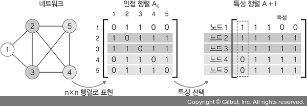

# Chapter 05: 합성곱 신경망 1
## 04. 설명 가능한 CNN
- 설명 가능한 CNN(explainable CNN): 딥러닝 처리 결과를 사람이 이해할 수 있는 방식으로 제시하는 기술
- CNN은 블랙박스와 같아 내부에서 어떻게 동작하는지 설명하기 어렵다.
- 따라서 CNN으로 얻은 결과는 신뢰하기 어려운데, 이를 해결하려면 CNN 처리 과정을 시각화해야 할 필요성이 있다.


- CNN을 구성하는 각 중간 계층부터 최종 분류까지 입력된 이미지에서 특성이 어떻게 추출되고 학습하는지를 시각적으로 설명할 수 있어야 결과에 대한 신뢰성을 얻을 수 있다.
- CNN의 시각화 방법에는 필터에 대한 시각화와 특성 맵에 대한 시각화가 있지만, 특성 맵에 대한 시각화를 주로 학습한다.

### 4-1. 특성 맵 시각화
- 특성 맵(feature map)(혹은 활성화 맵)은 입력 이미지 또는 다른 특성 맵처럼 필터를 입력에 적용한 결과이다.
- 따라서 특정 입력 이미지에 대한 특성 맵을 시각화한다는 의미는 특성 맵에서 입력 특성을 감지하는 방법을 이해할 수 있도록 돕는 것이다.
- 특성 맵 시각화에 대한 예제를 진행한다.
- 먼저 이미지 분석 및 처리를 쉽게 할 수 있도록 도와주는 라이브러리인 PIL(Python Image Library)을 설치한다.
    - PIL: 다양한 이미지 파일 형식을 지원하며, 강력한 이미지 처리와 그래픽 기능을 제공하는 이미지 프로세싱 라이브러리

```
pip install pillow
```

- 설치가 완료되면 라이브러리를 호출한다.
```py
# 5-30. 필요한 라이브러리 호출

import matplotlib.pyplot as plt
from PIL import Image
import cv2
import torch
import torch.nn.functional as F
import torch.nn as nn
from torchvision.transforms import ToTensor
import torchvision
import torchvision.transforms as transforms
import torchvision.models as models

device = torch.device("cuda" if torch.cuda.is_available() else "cpu")
```
- 설명 가능한 모델을 위해 13개의 합성곱층과 두 개의 완전연결층으로 구성된 네트워크를 생성한다.
- 이때 합성곱층과 완전 연결층은 렐루(ReLU)라는 활성화 함수를 사용하도록 한다.
```py
# 5-31. 설명 가능한 네트워크 생성

class XAI(torch.nn.Module):
    def __init__(self, num_classes=2):
        super(XAI, self).__init__()
        self.features = nn.Sequential(
            nn.Conv2d(3, 64, kernel_size=3, bias=False),
            nn.BatchNorm2d(64),
            # inplace=True는 기존의 데이터를 연산의 결과로 대체하는 것을 의미
            nn.ReLU(inplace=True),
            nn.Dropout(0.3),
            nn.Conv2d(64, 64, kernel_size=3, padding=1, bias=False),
            nn.BatchNorm2d(64),
            nn.ReLU(inplace=True),
            nn.MaxPool2d(kernel_size=2, stride=2),

            nn.Conv2d(64, 128, kernel_size=3, padding=1, bias=False),
            nn.BatchNorm2d(128),
            nn.ReLU(inplace=True),
            nn.Dropout(0.4),
            nn.Conv2d(128, 128, kernel_size=3, padding=1, bias=False),
            nn.BatchNorm2d(128),
            nn.ReLU(inplace=True),
            nn.MaxPool2d(kernel_size=2, stride=2),

            nn.Conv2d(128, 256, kernel_size=3, padding=1, bias=False),
            nn.BatchNorm2d(256),
            nn.ReLU(inplace=True),
            nn.Dropout(0.4),
            nn.Conv2d(256, 256, kernel_size=3, padding=1, bias=False),
            nn.BatchNorm2d(256),
            nn.ReLU(inplace=True),
            nn.Dropout(0.4),
            nn.Conv2d(256, 256, kernel_size=3, padding=1, bias=False),
            nn.BatchNorm2d(256),
            nn.ReLU(inplace=True),
            nn.MaxPool2d(kernel_size=2, stride=2),

            nn.Conv2d(256, 512, kernel_size=3, padding=1, bias=False),
            nn.BatchNorm2d(512),
            nn.ReLU(inplace=True),
            nn.Dropout(0.4),
            nn.Conv2d(512, 512, kernel_size=3, padding=1, bias=False),
            nn.BatchNorm2d(512),
            nn.ReLU(inplace=True),
            nn.Dropout(0.4),
            nn.Conv2d(512, 512, kernel_size=3, padding=1, bias=False),
            nn.BatchNorm2d(512),
            nn.ReLU(inplace=True),
            nn.MaxPool2d(kernel_size=2, stride=2),

            nn.Conv2d(512, 512, kernel_size=3, padding=1, bias=False),
            nn.BatchNorm2d(512),
            nn.ReLU(inplace=True),
            nn.Dropout(0.4),
            nn.Conv2d(512, 512, kernel_size=3, padding=1, bias=False),
            nn.BatchNorm2d(512),
            nn.ReLU(inplace=True),
            nn.Dropout(0.4),
            nn.Conv2d(512, 512, kernel_size=3, padding=1, bias=False),
            nn.BatchNorm2d(512),
            nn.ReLU(inplace=True),
            nn.MaxPool2d(kernel_size=2, stride=2),
        )

        self.classifier = nn.Sequential(
            nn.Linear(512, 512, bias=False),
            nn.Dropout(0.5),
            nn.BatchNorm1d(512),
            nn.ReLU(inplace=True),
            nn.Dropout(0.5),
            nn.Linear(512, num_classes),
        )

    def forward(self, x):
        x = self.features(x)
        x = x.view(-1, 512)
        x = self.classifier(x)

        # (1)
        return F.log_softmax(x)
```

#### (1)
- 로그 소프트맥스(log_softmax()): 신경망 말단의 결괏값들을 확률 개념으로 해석하기 위해 소프트맥스(softmax) 함수의 결과에 log 값을 취한 연산
- 소프트맥스를 사용하지 않고 로그 소프트맥스를 사용하는 이유: 소프트맥스는 기울기 소멸 문제(vanishing gradient problem)에 취약하기 때문
- 다음은 소프트맥스와 로그 소프트맥스에 대한 수식이다.


---
- 생성된 모델을 model = XAI()로 객체화 한 후 장치에 할당한다.
```py
# 5-32. 모델 객체화

# model이라는 이름의 객체 생성
model = XAI()
# model을 장치 (CPU 혹은 GPU)에 할당
model.to(device)
# 테스트 데이터에 대한 모델 평가 용도로 사용
model.eval()
```
- 객체화 한 결과는 아래와 같다.
```
XAI(
  (features): Sequential(
    (0): Conv2d(3, 64, kernel_size=(3, 3), stride=(1, 1), bias=False)
    (1): BatchNorm2d(64, eps=1e-05, momentum=0.1, affine=True, track_running_stats=True)
    (2): ReLU(inplace=True)
    (3): Dropout(p=0.3, inplace=False)
    (4): Conv2d(64, 64, kernel_size=(3, 3), stride=(1, 1), padding=(1, 1), bias=False)
    (5): BatchNorm2d(64, eps=1e-05, momentum=0.1, affine=True, track_running_stats=True)
    (6): ReLU(inplace=True)
    (7): MaxPool2d(kernel_size=2, stride=2, padding=0, dilation=1, ceil_mode=False)
    (8): Conv2d(64, 128, kernel_size=(3, 3), stride=(1, 1), padding=(1, 1), bias=False)
    (9): BatchNorm2d(128, eps=1e-05, momentum=0.1, affine=True, track_running_stats=True)
    (10): ReLU(inplace=True)
    (11): Dropout(p=0.4, inplace=False)
    (12): Conv2d(128, 128, kernel_size=(3, 3), stride=(1, 1), padding=(1, 1), bias=False)
    (13): BatchNorm2d(128, eps=1e-05, momentum=0.1, affine=True, track_running_stats=True)
    (14): ReLU(inplace=True)
    (15): MaxPool2d(kernel_size=2, stride=2, padding=0, dilation=1, ceil_mode=False)
    (16): Conv2d(128, 256, kernel_size=(3, 3), stride=(1, 1), padding=(1, 1), bias=False)
    (17): BatchNorm2d(256, eps=1e-05, momentum=0.1, affine=True, track_running_stats=True)
    (18): ReLU(inplace=True)
    (19): Dropout(p=0.4, inplace=False)
    (20): Conv2d(256, 256, kernel_size=(3, 3), stride=(1, 1), padding=(1, 1), bias=False)
    (21): BatchNorm2d(256, eps=1e-05, momentum=0.1, affine=True, track_running_stats=True)
    (22): ReLU(inplace=True)
    (23): Dropout(p=0.4, inplace=False)
    (24): Conv2d(256, 256, kernel_size=(3, 3), stride=(1, 1), padding=(1, 1), bias=False)
    (25): BatchNorm2d(256, eps=1e-05, momentum=0.1, affine=True, track_running_stats=True)
    (26): ReLU(inplace=True)
    (27): MaxPool2d(kernel_size=2, stride=2, padding=0, dilation=1, ceil_mode=False)
    (28): Conv2d(256, 512, kernel_size=(3, 3), stride=(1, 1), padding=(1, 1), bias=False)
    (29): BatchNorm2d(512, eps=1e-05, momentum=0.1, affine=True, track_running_stats=True)
    (30): ReLU(inplace=True)
    (31): Dropout(p=0.4, inplace=False)
    (32): Conv2d(512, 512, kernel_size=(3, 3), stride=(1, 1), padding=(1, 1), bias=False)
    (33): BatchNorm2d(512, eps=1e-05, momentum=0.1, affine=True, track_running_stats=True)
    (34): ReLU(inplace=True)
    (35): Dropout(p=0.4, inplace=False)
    (36): Conv2d(512, 512, kernel_size=(3, 3), stride=(1, 1), padding=(1, 1), bias=False)
    (37): BatchNorm2d(512, eps=1e-05, momentum=0.1, affine=True, track_running_stats=True)
    (38): ReLU(inplace=True)
    (39): MaxPool2d(kernel_size=2, stride=2, padding=0, dilation=1, ceil_mode=False)
    (40): Conv2d(512, 512, kernel_size=(3, 3), stride=(1, 1), padding=(1, 1), bias=False)
    (41): BatchNorm2d(512, eps=1e-05, momentum=0.1, affine=True, track_running_stats=True)
    (42): ReLU(inplace=True)
    (43): Dropout(p=0.4, inplace=False)
    (44): Conv2d(512, 512, kernel_size=(3, 3), stride=(1, 1), padding=(1, 1), bias=False)
    (45): BatchNorm2d(512, eps=1e-05, momentum=0.1, affine=True, track_running_stats=True)
    (46): ReLU(inplace=True)
    (47): Dropout(p=0.4, inplace=False)
    (48): Conv2d(512, 512, kernel_size=(3, 3), stride=(1, 1), padding=(1, 1), bias=False)
    (49): BatchNorm2d(512, eps=1e-05, momentum=0.1, affine=True, track_running_stats=True)
    (50): ReLU(inplace=True)
    (51): MaxPool2d(kernel_size=2, stride=2, padding=0, dilation=1, ceil_mode=False)
  )
  (classifier): Sequential(
    (0): Linear(in_features=512, out_features=512, bias=False)
    (1): Dropout(p=0.5, inplace=False)
    (2): BatchNorm1d(512, eps=1e-05, momentum=0.1, affine=True, track_running_stats=True)
    (3): ReLU(inplace=True)
    (4): Dropout(p=0.5, inplace=False)
    (5): Linear(in_features=512, out_features=2, bias=True)
  )
)
```
- 이 예제에서는 특성 맵의 시각화에 대해 살펴볼 예정이므로 특성 맵의 결과를 확인할 수 있는 함수를 정의해야 한다.
- 특성 맵은 합성곱층을 입력 이미지와 필터를 연산하여 얻은 결과이다.
- 따라서 합성곱층에서 입력과 출력을 알 수 있다면 특성 맵에 대한 값들을 확인할 수 있다는 의미이기도 하다. 
- 예를 들어 위의 출력 결과인 (0): Conv2d(3, 64, kernel_size=(3, 3), stride=(1, 1), bias=False)에 대한 특성 맵을 확인하기 위한 클래스를 먼저 정의한다.
```py
# 5-33. 특성 맵을 확인하기 위한 클래스 정의

class LayerActivations:
    features = []
    
    def __init__(self, model, layer_num):
        # (1)
        self.hook = model[layer_num].register_forward_hook(self.hook_fn)
        
    def hook_fn(self, module, input, output):
        self.features = output.detach().numpy()
    
    # hook 삭제
    def remove(self):
        self.hook.remove()
```

#### (1)
- 파이토치는 매 계층마다 print 문을 사용하지 않더라도 hook 기능을 사용하여 각 계층의 활성화 함수 및 기울기 값을 확인할 수 있다.
- 따라서 register_forward_hook의 목적은 순전파 중에 각 네트워크 모듈의 입력 및 출력을 가져오는 것이다.

---
- 특성 맵 정보를 가져올 이미지를 호출한다.
```py
# 5-34. 이미지 호출

img = cv2.imread("/Users/ramy/PycharmProjects/Pytorch/080289/chap05/data/cat.jpg")
plt.imshow(img)

# (1)
img = cv2.resize(img, (100, 100), interpolation=cv2.INTER_LINEAR)
# (2)
img = ToTensor()(img).unsqueeze(0)
print(img.shape)
```

#### (1)
- cv2.resize는 이미지 크기를 변경할 때 사용한다.


- 사용하는 파라미터:
    - 첫 번째 파라미터: 변경할 이미지 파일
    - 두 번째 파라미터: 변경될 이미지 크기를 (너비, 높이)로 지정
    - interpolation: 보간법
- 이미지 크기를 변경할 경우 변형된 이미지의 픽셀을 추정해서 값을 할당해야한다.
- 이미지 비율을 변경하면 존재하지 않는 영역에 새로운 픽셀 값을 매핑하거나 존재하는 픽셀들을 압축해서 새로운 값을 할당해야 한다.
- 이러한 상황을 피하고자 이미지상에 존재하는 픽셀 데이터 (xi yi)들에 대해 근사 함수 f(x, y)를 적용해서 새로운 픽셀 값을 구하는 것이 보간법이다.
- 즉, 추정해야 하는 픽셀을 보간법을 이용하여 값을 할당한다.

#### (2)
- ToTensor()(img).unsqueeze(0)에서 사용된 unsqueeze()는 1차원 데이터를 생성하는 함수이다.
- 즉, 이미지 데이터를 텐서로 변환하고, 그 변환된 데이터를 1차원으로 변경하겠다는 의미이다.
- unsqueeze는 다음과 같이 사용할 수 있다.
```py
import torch

x1 = torch.rand(3, 10, 64)
x2 = x1.unsqueeze(dim=0) ------ [3, 10, 64] -> [1, 3, 10, 64]
print(x2.shape)
print('---------------')
x3 = x1.unsqueeze(dim=1) ------ [3, 10, 64] -> [3, 1, 10, 64]
print(x3.shape)
```
- 출력:
```
torch.Size([1, 3, 10, 64])
---------------
torch.Size([3, 1, 10, 64])
```

---
- 출력된 이미지는 아래와 같다.


- 5-32번 코드의 출력 결과인 (0): Conv2d(3, 64, kernel_size=(3, 3), stride=(1, 1), bias=False)에 대한 특성 맵을 확인해 본다.
```py
# 5-35. (0): Conv2d 특성 맵 확인

result = LayerActivations(model.features, 0)

model(img)
activations = result.features
```
- 특성 맵을 시각적으로 표현한다.
```py
# 5-36. 특성 맵 확인

fig, axes = plt.subplots(4, 4)
fig = plt.figure(figsize=(12, 8))
fig.subplots_adjust(left=0, right=1, bottom=0, top=1, hspace=0.05, wspace=0.05)

for row in range(4):
    for column in range(4):
        axis = axes[row][column]
        axis.get_xaxis().set_ticks([])
        axis.get_yaxis().set_ticks([])
        axis.imshow(activations[0][row*10+column])

plt.show()
```
- 출력 결과:


- 입력층과 가까운 계층으로 입력 이미지의 형태가 많이 유지되고 있다.
- 학습이 진행될수록 이미지의 변화를 확인할 수 있도록 20번째 계층과 40번째 계층에 대한 특성 맵도 함께 살펴본다.
- 먼저 20번째 계층에 대한 특성 맵을 살펴본다.
```py
# 5-37. 20번째 계층에 대한 특성 맵

# 20번째 Conv2d 특성 맵 확인
result = LayerActivations(model.features, 20)

model(img)
activations = result.features
```
- 특성 맵을 시각적으로 표현한다.
```py
# 5-38. 특성 맵 확인

fig, axes = plt.subplots(4, 4)
fig = plt.figure(figsize=(12, 8))
fig.subplots_adjust(left=0, right=1, bottom=0, top=1, hspace=0.05, wspace=0.05)

for row in range(4):
    for column in range(4):
        axis = axes[row][column]
        axis.get_xaxis().set_ticks([])
        axis.get_yaxis().set_ticks([])
        axis.imshow(activations[0][row*10+column])

plt.show()
```
- 20번째 계층에서 특성 맵에 대한 출력 결과:


- 20번째 특성 맵의 결과 기존 고양이 이미지의 형태는 찾아볼 수 없게 되었다.
- 이번에는 40번째 계층에서 특성 맵 결과를 살펴본다.
```py
# 5-39. 40번째 계층에 대한 특성 맵

result = LayerActivations(model.features, 40)

model(img)
activations = result.features
```
- 특성 맵을 시각적으로 표현한다.
```py
# 5-40. 특성 맵 확인

fig, axes = plt.subplots(4, 4)
fig = plt.figure(figsize=(12, 8))
fig.subplots_adjust(left=0, right=1, bottom=0, top=1, hspace=0.05, wspace=0.05)

for row in range(4):
    for column in range(4):
        axis = axes[row][column]
        axis.get_xaxis().set_ticks([])
        axis.get_yaxis().set_ticks([])
        axis.imshow(activations[0][row*10+column])

plt.show()
```
- 40번째 계층에서 특성 맵에 대한 출력 결과:


- 이제 원래 입력 이미지에 대한 형태는 전혀 찾아볼 수 없다.
- 즉, 출력층에 가까울수록 원래 형태는 찾아볼 수 없고, 이미지 특징들만 전달되는 것을 확인할 수 있다.
- CNN은 필터와 특성 맵을 시각화해서 CNN 결과의 신뢰성을 확보할 수 있다.

## 05. 그래프 합성곱 네트워크
- 그래프 합성곱 네트워크(graph convolutional network)는 그래프 데이터를 위한 신경망이다.
- 그래프 합성곱 네트워크를 이해하기 앞서 먼저 그래프란 무엇인지 알아본다.

### 5-1. 그래프란
- 그래프: 방향성이 있거나(directed) 없는(undirected) 에지로 연결된 노드(nodes=verticals)의 집합
- 여기에서 노드와 에지는 일반적으로 풀고자 하는 문제에 대한 전문가 지식이나 직관 등으로 구성된다.
- 다음 그림과 같은 형태를 취하는 것이 그래프이다.


- 그래프의 구성 요소:
    - 노드(node, vertex): 그림에서 원들이 노드
    - 에지(edge): 두 노드를 연결한 선
- 노드는 원소들을 의미하고, 에지는 결합 방법(single, double, triple, aromatic 등)을 의미한다.

### 5-2. 그래프 신경망
- 그래프 신경망(Graph Neural Network, GNN)은 그래프 구조에서 사용하는 신경망을 의미한다.
- 그래프 데이터에 대한 표현은 두 단계로 이루어진다.



#### 1단계: 인접 행렬(adjacency matrix)
- 위 그림의 왼쪽과 같은 네트워크가 있을 때 노드 n개를 n×n 행렬(matrix)로 표현한다.
- 이렇게 생성된 인접 행렬 내의 값은 ‘Aij는 i와 j의 관련성 여부’를 만족하는 값으로 채워 준다.
- 인접 행렬 과정은 컴퓨터가 이해하기 쉽게 그래프로 표현하는 과정이라고 할 수 있다.

#### 2단계: 특성 행렬(feature matrix)
- 인접 행렬만으로는 특성을 파악하기 어렵기 때문에 단위 행렬을 적용한다.
- 각 입력 데이터에서 이용할 특성을 선택한다.
- 특성 행렬에서 각 행은 선택된 특성에 대해 각 노드가 갖는 값을 의미한다(예: 첫 번째 행은 첫 번째 노드의 특성 값).
- 이제 노드 1·2·3·4에 대한 특성을 한눈에 파악하기 쉽게 표현되었다.
- 즉, 특성 행렬 과정을 거쳐 그래프 특성(graph feature)이 추출된다.

### 5-3. 그래프 합성곱 네트워크
- 그래프 합성곱 네트워크(Graph Convolutional Network, GCN)는 이미지에 대한 합성곱을 그래프 데이터로 확장한 알고리즘이다.
- 그래프 합성곱 네트워크 구조는 다음 그림과 같다.


- 여기에서 리드아웃(readout)은 특성 행렬을 하나의 벡터로 변환하는 함수이다.
- 즉, 전체 노드의 특성 벡터에 대해 평균을 구하고 그래프 전체를 표현하는 하나의 벡터를 생성한다.
- GCN에서 가장 중요한 부분은 그래프 합성곱층(graph convolutional layer)이다.
- 그래프 합성곱층을 이용한 그래프 형태의 데이터는 행렬 형태의 데이터로 변환되어 딥러닝 알고리즘을 적용할 수 있기 때문이다.
- 기존 그래프 형태의 데이터로는 딥러닝 알고리즘을 적용할 수 없다.
- GCN의 활용:
    - SNS에서 관계 네트워크
    - 학술 연구에서 인용 네트워크
    - 3D Mesh