# Chapter 06: 합성곱 신경망 2
## 01. 이미지 분류를 위한 신경망
### 1-1. LeNet-5
- LeNet-5는 합성곱 신경망이라는 개념을 최초로 얀 르쿤(Yann LeCun)이 개발한 구조이다.
- 1995년 얀 르쿤, 레옹 보토(Leon Bottu), 요슈아 벤지오(Yosua Bengio), 패트릭 하프너(Patrick Haffner)가 수표에 쓴 손글씨 숫자를 인식하는 딥러닝 구조 LeNet-5를 발표했는데, 그것이 현재 CNN의 초석이 되었다.
- LeNet-5는 합성곱(convolutional)과 다운 샘플링(sub-sampling)(혹은 풀링)을 반복적으로 거치면서 마지막에 완전연결층에서 분류를 수행한다.
- 다음 그림을 이용하여 구체적으로 살펴보면 C1에서 5×5 합성곱 연산 후 28×28 크기의 특성 맵(feature map) 여섯 개를 생성한다.
- S2에서 다운 샘플링하여 특성 맵 크기를 14×14로 줄인다.
- 다시 C3에서 5×5 합성곱 연산하여 10×10 크기의 특성 맵 16개를 생성하고, S4에서 다운 샘플링하여 특성 맵 크기를 5×5로 줄인다.
- C5에서 5×5 합성곱 연산하여 1×1 크기의 특성 맵 120개를 생성하고, 마지막으로 F6에서 완전연결층으로 C5의 결과를 유닛(unit)(또는 노드) 84개에 연결시킨다.
- 이때 C로 시작하는 것은 합성곱층을 의미하고, S로 시작하는 것은 풀링층을 의미하며, F로 시작하는 것은 완전연결층을 의미한다.

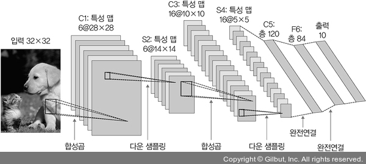

- LeNet-5를 사용하는 예제를 구현한다.
- 개와 고양이 데이터셋을 사용한다.
- 구현할 신경망:

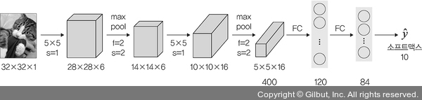

- 32×32 크기의 이미지에 합성곱층과 최대 풀링층이 쌍으로 두 번 적용된 후 완전연결층을 거쳐 이미지가 분류되는 신경망이다.
- 신경망에 대한 설명:

|계층 유형|특성 맵|크기|커널 크기|스트라이드|활성화 함수|
|:---:|:---:|:---:|:---:|:---:|:---:|
|이미지|1|32x32|-|-|-|
|합성곱층|6|28x28|5x5|1|렐루(ReLU)|
|최대 풀링층|6|14x14|2x2|2|-|
|합성곱층|16|10x10|5x5|1|렐루(ReLU)|
|최대 풀링층|16|5x5|2x2|2|-|
|완전 연결층|-|120|-|-|렐루(ReLU)|
|완전 연결층|-|84|-|-|렐루(ReLU)|
|완전 연결층|-|2|-|-|소프트맥스(softmax)|

- 예제를 진행하기 위해 아나콘다 프롬프트에서 tqdm 라이브러리를 설치한다.
- 라이브러리는 두 가지 방법으로 설치할 수 있다.
```
pip install --user tqdm
```
```
conda install -c conda-forge tqdm
```
- 설치되었다면 라이브러리를 호출한다.
```py
# 6-1. 필요한 라이브러리 호출

import torch
import torchvision
from torch.utils.data import DataLoader, Dataset
# 이미지 변환(전처리) 기능을 제공하는 라이브러리
from torchvision import transforms
from torch.autograd import Variable
# 경사 하강법을 이용하여 가중치를 구하기 위한 옵티마이저 라이브러리
from torch import optim
import torch.nn as nn
import torch.nn.functional as F
# 파일 경로에 대한 함수들을 제공
import os
import cv2
from PIL import Image
# 진행 상황을 가시적으로 표현해 주는데, 특히 모델의 학습 경과를 확인하고 싶을 때 사용하는 라이브러리
from tqdm import tqdm_notebook as tqdm
import random
from matplotlib import pyplot as plt

# 파이토치는 텐서플로와 다르게 GPU를 자동으로 할당해 주지 않기 때문에 GPU 할당을 모델과 데이터에 선언해 주어야 함. 단 이 장에서는 CPU를 사용
device = torch.device("cuda:0" if torch.cuda.is_available() else "cpu")
```
- 모델 학습에 필요한 데이터셋의 전처리가 필요하다.
```py
# 6-2. 이미지 데이터셋 전처리

class ImageTransform():
    def __init__(self, resize, mean, std):
        self.data_transform = {
            # (1)
            'train': transforms.Compose([
                transforms.RandomResizedCrop(resize, scale=(0.5,1.0)),
                transforms.RandomHorizontalFlip(),
                transforms.ToTensor(),
                transforms.Normalize(mean, std)
            ]),
            'val': transforms.Compose([
                transforms.Resize(256),
                transforms.CenterCrop(resize),
                transforms.ToTensor(),
                transforms.Normalize(mean, std)
            ])
        } 

    # (2)
    def __call__(self, img, phase):
        return self.data_transform[phase](img)
```
#### (1)
- 토치비전(torchvision) 라이브러리를 이용하면 이미지에 대한 전처리를 손쉽게 할 수 있다.

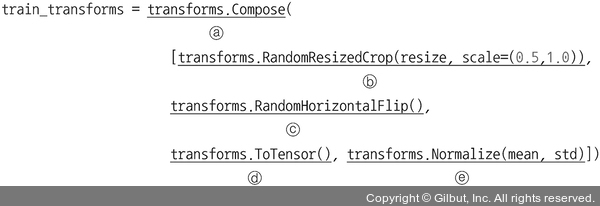

- torchvision.transforms에서 사용하는 파라미터:
    - transforms.Compose: 이미지를 변형할 수 있는 방식들의 묶음
    - transforms.RandomResizedCrop: 입력 이미지를 주어진 크기(resize: 224×224)로 조정한다. 또한, scale은 원래 이미지를 임의의 크기(0.5~1.0(50~100%))만큼 면적을 무작위로 자르겠다는 의미이다.
    - transforms.RandomHorizontalFlip: 주어진 확률로 이미지를 수평 반전시킨다. 이때 확률 값을 지정하지 않았으므로 기본값인 0.5의 확률로 이미지들이 수평 반전된다. 즉, 훈련 이미지 중 반은 위아래 뒤집힌 상태로 두고, 반은 그대로 사용한다.
    - transforms.ToTensor: ImageFolder 메서드를 비롯해서 torchvision 메서드는 이미지를 읽을 때 파이썬 이미지 라이브러리인 PIL을 사용한다. PIL을 사용해서 이미지를 읽으면 생성되는 이미지는 범위가 [0, 255]이며, 배열의 차원이 (높이 H×너비 W×채널 수 C)로 표현된다. 이후 효율적인 연산을 위해 torch.FloatTensor 배열로 바꾸어야 하는데, 이때 픽셀 값의 범위는 [0.0, 1.0] 사이가 되고 차원의 순서도 (채널 수 C×높이 H×너비 W)로 바뀐다. 그리고 이러한 작업을 수행해 주는 메서드가 ToTensor()이다.
    - transforms.Normalize: 전이 학습에서 사용하는 사전 훈련된 모델들은 대개 ImageNet 데이터셋에서 훈련되었다. 따라서 사전 훈련된 모델을 사용하기 위해서는 ImageNet 데이터의 각 채널별 평균과 표준편차에 맞는 정규화(normalize)1를 해 주어야 한다. 즉, Normalize 메서드 안에 사용된 (mean: 0.485, 0.456, 0.406), (std: 0.229, 0.224, 0.225)는 ImageNet에서 이미지들의 RGB 채널마다 평균과 표준편차를 의미한다. 참고로 OpenCV를 사용해서 이미지를 읽어 온다면 RGB 이미지가 아닌 BGR 이미지이므로 채널 순서에 주의해야 한다.

#### (2)
- __call__ 함수는 클래스를 호출할 수 있도록 하는 메서드이다.
- __init__은 인스턴스 초기화를 위해 사용한다면 __call__은 인스턴스가 호출되었을 때 실행된다.
- 즉, 클래스에 __call__ 함수가 있을 경우 클래스 객체 자체를 호출하면 __call__ 함수의 리턴(return) 값이 반환된다.

---
- 이미지가 위치한 디렉터리에서 데이터를 불러온 후 훈련용으로 400개의 이미지, 검증용으로 92개의 이미지, 테스트용으로 열 개의 이미지를 사용한다.
- 예제를 진행하기 위한 시스템 성능이 좋을 경우 훈련용 2만 개를 사용하면 모델 성능이 더 높아진다.
- 예제 파일의 주석(#)을 해제하고 실행하면 된다.
- 단 해제하고 실행한다면 그다음 두 줄은 주석 처리해야 한다.
```py
# 6-3 이미지 데이터셋을 불러온 후 훈련, 검증, 테스트로 분리

cat_directory = r'/Users/ramy/PycharmProjects/Pytorch/080289/chap06/data/dogs-vs-cats/Cat'
dog_directory = r'/Users/ramy/PycharmProjects/Pytorch/080289/chap06/data/dogs-vs-cats/Dog'

# (1)
cat_images_filepaths = sorted([os.path.join(cat_directory, f) for f in
                              os.listdir(cat_directory)])
dog_images_filepaths = sorted([os.path.join(dog_directory, f) for f in
                              os.listdir(dog_directory)])

# 개와 고양이 이미지들을 합쳐서 images_filepaths에 저장
images_filepaths = [*cat_images_filepaths, *dog_images_filepaths]
# (2)
correct_images_filepaths = [i for i in images_filepaths if cv2.imread(i) is not None]

# (3)
random.seed(42)
random.shuffle(correct_images_filepaths)
# 훈련용 400개의 이미지
train_images_filepaths = correct_images_filepaths[:400]
# 검증용 92개의 이미지
val_images_filepaths = correct_images_filepaths[400:-10]
# 테스트용 열 개의 이미지
test_images_filepaths = correct_images_filepaths[-10:]
print(len(train_images_filepaths), len(val_images_filepaths), len(test_images_filepaths))
```
#### (1)

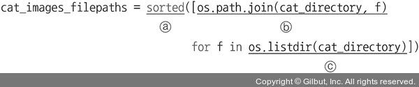

- 고양이 이미지 데이터를 가져온다.
    - sorted: 데이터를 정렬된 리스트로 만들어서 반환한다.
    - os.path.join: 경로와 파일명을 결합하거나 분할된 경로를 하나로 합치고 싶을 때 사용한다. 즉, cat_directory 디렉터리(../chap06/data/dogs-vs-cats/Cat/)와 os.listdir을 통해 검색된 이미지 파일들(f)을 하나로 합쳐서 ‘../chap06/data/dogs-vs-cats/Cat/이미지파일명’(예 ../chap06/data/dogs-vs-cats/Cat/cat.0.jpg)으로 표시해 준다.
    - os.listdir: 지정한 디렉터리 내 모든 파일의 리스트를 반환한다. 예제에서 사용하는 Cat 디렉터리의 이미지 파일들을 모두 반환한다.
- 아래 방법으로 경로를 하나로 합칠 수 있다.
```py
import os
list_path = ['C:\\', 'Temp', 'user']
folder_path = os.path.join(*list_path)
folder_path
```
- 실행 결과:
```
'C:\\Temp\\user'
```

#### (2)

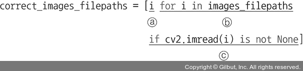

- images_filepaths에서 이미지 파일들을 불러온다.
    - for 반복문을 이용하여 가져온 데이터에 대해 i를 이용하여 리스트로 만든다.
    - 반복문(for)을 이용하여 images_filepaths에서 이미지 데이터를 검색한다.
    - 조건문(if)을 의미한다. cv2.imread() 함수(cv2.imread(i))를 이용하여 모든 이미지 데이터를 읽어 온다(not None 상태, 즉 ‘더 이상 데이터를 찾을 수 없을 때까지’를 의미한다).

#### (3)
- 넘파이 random() 함수는 임의의 난수를 생성하는데, 이때 난수를 생성하기 위해 사용되는 것이 시드 값(seed value)아다.
- 또한, Numpy.random.seed() 메서드는 상태를 초기화한다.
- 즉, 이 모듈이 호출될 때마다 임의의 난수가 재생성된다.
- 하지만 특정 시드 값을 부여하면 상태가 저장되기 때문에 동일한 난수를 생성한다.
- 예를 들어 다음과 같다.
```py
import numpy as np

np.random.seed(101)
np.random.randint(low=1, high=10, size=10)
```
- 시드 값 101로 설정한 결과:
```
array([2, 7, 8, 9, 5, 9, 6, 1, 6, 9])
```
- 시드 값 100으로 설정
```py
np.random.seed(100)
np.random.randint(low=1, high=10, size=10)
```
- 시드 값 100으로 설정한 결과
```
array([9, 9, 4, 8, 8, 1, 5, 3, 6, 3])
```
- 다시 101로 설정하면 이전에 101로 설정했을 때의 결과가 출력된다.

---
- 주어진 데이터셋을 훈련, 검증, 테스트 용도로 분리했는데, 테스트 용도의 데이터셋에 어떤 데이터들이 있는지 확인해 본다.
```py
# 6-4 테스트 데이터셋 이미지 확인 함수

def display_image_grid(images_filepaths, predicted_labels=(), cols=5):
    rows = len(images_filepaths) // cols
    figure, ax = plt.subplots(nrows=rows, ncols=cols, figsize=(12, 6))
    for i, image_filepath in enumerate(images_filepaths):
        image = cv2.imread(image_filepath)
        # (1)
        image = cv2.cvtColor(image, cv2.COLOR_BGR2RGB)
        # (2_
        true_label = os.path.normpath(image_filepath).split(os.sep)[-2]
        # (3)
        predicted_label = predicted_labels[i] if predicted_labels else true_label
        # 예측과 정답(레이블)이 동일하면 초록색으로 표시하고, 그렇지 않다면 빨간색으로 표시
        color = "green" if true_label == predicted_label else "red"
        # 개별 이미지를 출력
        ax.ravel()[i].imshow(image)
        # predicted_label을 타이틀로 사용
        ax.ravel()[i].set_title(predicted_label, color=color)
        # 이미지의 축 제거
        ax.ravel()[i].set_axis_off()
    
    # 이미지의 여백을 조정
    plt.tight_layout()
    plt.show()
```

#### (1)
- cv2.cvtColor는 이미지의 색상을 변경하기 위해 사용된다.

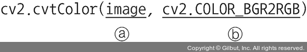

- 사용되는 파라미터:
    - 첫 번째 파라미터: 입력 이미지
    - 두 번째 파라미터: 변환할 이미지의 색상을 지정하는 것으로 BGR(Blue, Green, Red) 채널 이미지를 RGB(컬러)로 변경하겠다는 의미이다.

#### (2)
- 이미지의 전체 경로를 정규화하고 분할을 위한 코드이다.

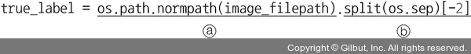

- 사용되는 파라미터:
    - os.path.normpath: 경로명을 정규화한다. 예를 들어 A//B, A/B/, A/./B 및 A//../B 모두 A/B로 경로를 통일한다.
    - split(os.sep): 경로를 / 혹은 \를 기준으로 분할할 때 사용한다. 예를 들어 c:/temp/user/a.jpg라는 경로가 있을 때 split(os.sep)를 적용하면 [‘c:’, ‘temp’, ‘user’, ‘a.jpg’]처럼 분할된다. 또한, split(os.sep)[-2]를 적용하면 ‘user’를 반환한다.

#### (3)
- predicted_label에 대한 값을 정의하기 위한 코드이다.

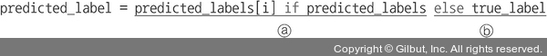

- predicted_labels 값이 있으면 그 값을 predicted_label로 사용한다.
- predicted_labels에 값이 없다면 true_label 값을 predicted_label로 사용한다.

---
- 앞에서 정의한 함수를 호출하여 열 개의 이미지를 출력한다.
```py
# 6-5. 테스트 데이터셋 이미지를 출력

display_image_grid(test_images_filepaths)
```
- 출력 결과:

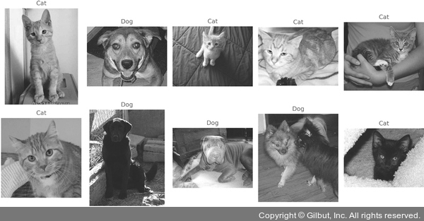

- 이제부터 모델 학습을 위한 구체적인 단계들을 시작한다.
- 먼저 데이터셋에는 학습할 데이터의 경로를 정의하고 그 경로에서 데이터를 읽어 온다.
- 데이터셋 크기가 클 수 있으므로 __init__에서 전체 데이터를 읽어 오는 것이 아니라 경로만 저장해 놓고, __getitem__ 메서드에서 이미지를 읽어 온다.
- 즉, 데이터를 어디에서 가져올지 결정한다.
- 이후 데이터로더에서 데이터셋의 데이터를 메모리로 불러오는데, 한꺼번에 전체 데이터를 불러오는 것이 아니라 배치 크기만큼 분할하여 가져온다.
- 이번에 살펴볼 DogvsCatDataset() 클래스는 데이터를 불러오는 방법을 정의한다.
- 이번 예제의 목적은 다수의 개와 고양이 이미지가 포함된 데이터에서 이들을 예측하는 것이다.
- 따라서 레이블(정답) 이미지에서 고양이와 개가 포함될 확률을 코드로 구현한다.
- 예를 들어 고양이가 있는 이미지의 레이블은 0이 되고, 개가 있는 이미지의 레이블은 1이 되도록 코드를 구현한다.
```py
# 6-6. 이미지 데이터셋 클래스 정의

class DogvsCatDataset(Dataset):
    # 데이터셋의 전처리(데이터 변형 적용)
    def __init__(self, file_list, transform=None, phase='train'):
        self.file_list = file_list
        # DogvsCatDataset 클래스를 호출할 때 transform에 대한 매개변수를 받아 옴
        self.transform = transform
        # ‘train’ 적용
        self.phase = phase
    
    # images_filepaths 데이터셋의 전체 길이를 반환
    def __len__(self):
        return len(self.file_list)
    
    # 데이터셋에서 데이터를 가져오는 부분으로 결과는 텐서 형태가 됨
    def __getitem__(self, idx):
        img_path = self.file_list[idx]
        # img_path 위치에서 이미지 데이터들을 가져옴
        img = Image.open(img_path)
        # 이미지에 ‘train’ 전처리를 적용
        img_transformed = self.transform(img, self.phase)
        # (1)
        label = img_path.split('/')[-1].split('.')[0]
        if label == 'dog':
            label = 1
        elif label == 'cat':
            label = 0
        return img_transformed, label
```

#### (1)

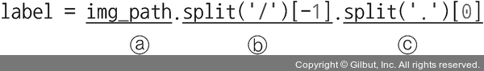

- 이미지 데이터에 대한 레이블 값(dog, cat)을 가져온다.
    - img_path: 이미지가 위치한 전체 경로를 보여 준다.
        - ex: /Users/ramy/PycharmProjects/Pytorch/080289/chap06/data/dogs-vs-cats/Dog/dog.113.jpg
    - 이때 이미지 데이터의 레이블(dog)을 가져오려면 ‘/’와 ‘.’을 제거해야 한다.
    - img_path.split('/')[-1]: 이미지의 전체 경로에서 ‘/’를 제거한다. 제거 결과는 아래와 같다.
        - ex: dog.113.jpg
    - split('.')[0]: 마지막으로 img_path.split('/')[-1]을 통해 얻은 결과인 ‘dog.113.jpg’에서 ‘.’을 제거한다. 이때 ‘dog.113.jpg’를 ‘.’을 기준으로 분리시켰고, 분리된 값들에서 첫 번째 값([0])을 가져오면 결과는 다음과 같다.
        - ex: dog

---
- 전처리에서 사용할 변수에 대한 값을 정의한다.
```py
# 6-7. 변수 값 정의

size = 224
mean = (0.485, 0.456, 0.406)
std = (0.229, 0.224, 0.225)
batch_size = 32
```
- 훈련과 검증 용도의 데이터셋을 정의한다.
- 앞에서 정의한 DogvsCatDataset() 클래스를 이용하여 훈련과 검증 데이터셋을 준비하되 전처리도 함께 적용하도록 한다.
```py
# 6-8. 이미지 데이터셋 정의

# 훈련 이미지에 train_transforms를 적용
train_dataset = DogvsCatDataset(train_images_filepaths, transform=ImageTransform(size, mean, std), phase='train')
# 검증 이미지에 test_transforms를 적용
val_dataset = DogvsCatDataset(val_images_filepaths, transform=ImageTransform(size,  mean, std), phase='val')

index = 0
# 훈련 데이터(train_dataset.__getitem__[0][0])의 크기(size()) 출력
print(train_dataset.__getitem__(index)[0].size())
# 훈련 데이터의 레이블 출력
print(train_dataset.__getitem__(index)[1])
```
- 훈련 데이터 크기와 레이블에 대한 출력 결과:
```
torch.Size([3, 224, 224])
0
```
- 이미지는 컬러 상태에서 224×224 크기를 가지며 레이블이 0으로 출력되었다.
- 즉, 훈련 데이터셋의 레이블(train_dataset.__getitem__(index)[1])이 0 값을 갖기 때문에 ‘고양이’라는 이미지가 포함되어 있다는 것을 유추해 볼 수 있다.
- 전처리와 함께 데이터셋을 정의했기 때문에 이제 메모리로 불러와서 훈련을 위한 준비를 한다.
```py
# 6-9. 데이터로더 정의

# (1)
train_dataloader = DataLoader(train_dataset, batch_size=batch_size, shuffle=True)
val_dataloader = DataLoader(val_dataset, batch_size=batch_size, shuffle=False)
# 훈련 데이터셋(train_dataloader)과 검증 데이터셋(val_dataloader)을 합쳐서 표현
dataloader_dict = {'train': train_dataloader, 'val': val_dataloader}

batch_iterator = iter(train_dataloader)
inputs, label = next(batch_iterator)
print(inputs.size())
print(label)
```
- 데이터로더를 이용하여 훈련 데이터셋을 메모리로 불러온 후 데이터셋의 크기와 레이블을 출력한 결과:
```
torch.Size([32, 3, 224, 224])
tensor([1, 1, 1, 0, 0, 1, 0, 1, 0, 1, 1, 0, 1, 0, 0, 0, 0, 0, 0, 1, 0, 0, 1, 1, 1, 1, 1, 0, 0, 1, 1, 0])
```

#### (1)

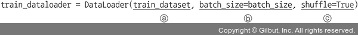

- 파이토치의 데이터로더는 배치 관리를 담당한다.
- 한 번에 모든 데이터를 불러오면 메모리에 부담을 줄 수 있기 때문에 데이터를 그룹으로 쪼개서 조금씩 불러온다.
- 사용되는 파라미터:
    - 첫 번째 파라미터: 데이터를 불러오기 위한 데이터셋
    - batch_size: 한 번에 메모리로 불러올 데이터 크기로, 여기에서는 32개씩 데이터를 가져온다.
    - shuffle: 메모리로 데이터를 가져올 때 임의로 섞어서 가져오도록 한다.

---
- 데이터셋을 학습시킬 모델의 네트워크를 설계하기 위한 클래스를 생성한다.
```py
# 6-10. 모델의 네트워크 클래스

class LeNet(nn.Module):
    def __init__(self):
        super(LeNet, self).__init__()
        # 2D 합성곱층이 적용됨. 이때 입력 형태는 (3, 224, 224)가 되며 출력 형태는 (weight-kernel_size+1)/stride에 따라 (16, 220, 220)이 됨.
        self.cnn1 = nn.Conv2d(in_channels=3, out_channels=16, kernel_size=5, stride=1, padding=0)
    
        # ReLU 활성화 함수
        self.relu1 = nn.ReLU()
        # 최대 풀링이 적용됨. 적용 이후 출력 형태는 220/2가 되어 (16, 110, 110)
        self.maxpool1 = nn.MaxPool2d(kernel_size=2)
        # 또다시 2D 합성곱층이 적용되며 출력 형태는 (32, 106, 106)
        self.cnn2 = nn.Conv2d(in_channels=16, out_channels=32, kernel_size=5, stride=1, padding=0)
        self.relu2 = nn.ReLU()
        # 최대 풀링이 적용되며 출력 형태는 (32, 53, 53)
        self.maxpool2 = nn.MaxPool2d(kernel_size=2)

        self.fc1 = nn.Linear(32*53*53, 512)
        self.relu5 = nn.ReLU()
        self.fc2 = nn.Linear(512, 2)
        self.output = nn.Softmax(dim=1)

    def forward(self, x):
        out = self.cnn1(x)
        out = self.relu1(out)
        out = self.maxpool1(out)
        out = self.cnn2(out)
        out = self.relu2(out)
        out = self.maxpool2(out)
        # 완전연결층에 데이터를 전달하기 위해 데이터 형태를 1차원으로 바꿈
        out = out.view(out.size(0), -1)
        out = self.fc1(out)
        out = self.fc2(out)
        out = self.output(out)
        return out
```
- 네트워크의 각 부분들을 통과할 때마다 입력과 출력의 형태가 바뀌는데, 그 계산은 다음 수식과 같다.

#### Conv2d 계층에서의 출력 크기 구하는 공식
- 출력 크기 = (W-F+2P)/S+1
    - W: 입력 데이터의 크기(input_volume_size)
    - F: 커널 크기(kernel_size)
    - P: 패딩 크기(padding_size)
    - S: 스트라이드(strides)

#### MaxPool2d 계층에서의 출력 크기 구하는 공식
- 출력 크기 = IF/F
    - IF: 입력 필터의 크기(input_filter_size, 또한 바로 앞의 Conv2d의 출력 크기이기도 함)
    - F: 커널 크기(kernel_size)

---
- 각각의 계층에 대한 결과:

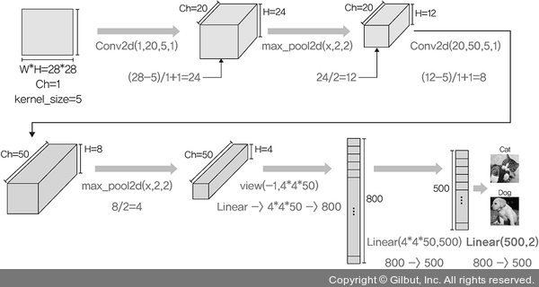

- LeNet()을 model이라는 이름으로 객체를 생성하여 모델 학습을 위한 준비를 한다.
```py
# 6-11. 모델 객체 생성

model = LeNet()
print(model)
```
- 출력 결과:
```
LeNet(
  (cnn1): Conv2d(3, 16, kernel_size=(5, 5), stride=(1, 1))
  (relu1): ReLU()
  (maxpool1): MaxPool2d(kernel_size=2, stride=2, padding=0, dilation=1, ceil_mode=False)
  (cnn2): Conv2d(16, 32, kernel_size=(5, 5), stride=(1, 1))
  (relu2): ReLU()
  (maxpool2): MaxPool2d(kernel_size=2, stride=2, padding=0, dilation=1, ceil_mode=False)
  (fc1): Linear(in_features=89888, out_features=512, bias=True)
  (relu5): ReLU()
  (fc2): Linear(in_features=512, out_features=2, bias=True)
  (output): Softmax(dim=1)
)
```
- 출력 결과가 한눈에 들어오지 않는다면 torchsummary 라이브러리를 사용해 볼 수 있다.
- torchsummary는 케라스와 같은 형태로 모델을 출력해 볼 수 있는 라이브러리이다.
- 아나콘다 프롬프트(Anaconda prompt)에서 다음 명령을 실행하여 torchsummary 라이브러리를 설치한다.
```
pip install torchsummary
```
- torchsummary 라이브러리를 사용하여 모델의 네트워크 구조를 다시 확인해 본다.
```py
# 6-12. torchsummary 라이브러리를 이용한 모델의 네트워크 구조 확인

from torchsummary import summary
# (1)
summary(model, input_size=(3,224,224))
```
#### (1)
- summary를 통해 모델의 네트워크 관련 정보를 확인할 수 있다.

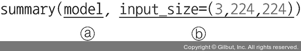

- 사용되는 파라미터:
    - 첫 번째 파라미터: 모델의 네트워크
    - 두 번째 파라미터: 입력 값으로 (채널(channel), 너비(width), 높이(height))가 된다. 여기서는 (3, 244, 244)를 입력으로 지정한다(이미 앞에서 244×244 크기의 이미지를 사용하겠다고 지정했다).

---
- 다음은 torchsummary 라이브러리를 이용했을 때 모델의 구조이다.
- 앞에서 모델 출력 결과와 비교하면 네트워크 내 파라미터 수와 구조가 이해하기 쉽게 표현되어 있는 것을 확인할 수 있다.
- 출력되는 정보로는 총 파라미터 수, 입력 크기, 네트워크의 총 크기 등이 있다.
```
----------------------------------------------------------------
        Layer (type)               Output Shape         Param #
================================================================
            Conv2d-1         [-1, 16, 220, 220]           1,216
              ReLU-2         [-1, 16, 220, 220]               0
         MaxPool2d-3         [-1, 16, 110, 110]               0
            Conv2d-4         [-1, 32, 106, 106]          12,832
              ReLU-5         [-1, 32, 106, 106]               0
         MaxPool2d-6           [-1, 32, 53, 53]               0
            Linear-7                  [-1, 512]      46,023,168
            Linear-8                    [-1, 2]           1,026
           Softmax-9                    [-1, 2]               0
================================================================
Total params: 46,038,242
Trainable params: 46,038,242
Non-trainable params: 0
----------------------------------------------------------------
Input size (MB): 0.57
Forward/backward pass size (MB): 19.47
Params size (MB): 175.62
Estimated Total Size (MB): 195.67
----------------------------------------------------------------
```
- 다음은 모델의 학습 가능한 파라미터 수를 model.parameters()를 이용하여 확인해 본다.
- 전반적인 코드의 흐름과는 관련이 없는 부분이지만 정보 확인을 위한 코드이다.
- 해당 정보는 앞에서 실행했던 summary로도 확인이 가능하다.
```py
# 6-13. 학습 가능한 파라미터 수 확인

def count_parameters(model):
    return sum(p.numel() for p in model.parameters() if p.requires_grad)

print(f'The model has {count_parameters(model):,} trainable parameters')
```
- 실행 결과:
```
The model has 46,038,242 trainable parameters
```
- 실행 결과를 보니 46,038,242개의 파라미터를 학습해야 함을 확인할 수 있다.
- 꽤 많은 파라미터를 학습해야 하기 때문에 추후 데이터를 모델에 적용했을 때 긴 시간이 걸릴 것을 예상할 수 있다.
- 모델의 네트워크 구성이 완료되었기 때문에 이제 옵티마이저와 손실 함수를 정의한다.
```py
# 6-14. 옵티마이저와 손실 함수 정의

# (1)
optimizer = optim.SGD(model.parameters(), lr=0.001, momentum=0.9)
criterion = nn.CrossEntropyLoss()
```

#### (1)
- 경사 하강법으로 모멘텀 SGD를 사용하도록 했다.
- 모멘템 SGD는 SGD에 관성이 추가된 것으로 매번 기울기를 구하지만 가중치를 수정하기 전에 이전 수정 방향(+, -)을 참고하여 같은 방향으로 일정한 비율만 수정되게 하는 방법이다.

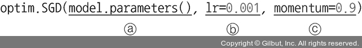

- 사용되는 파라미터:
    - 첫 번째 파라미터: 경사 하강법을 통해 궁극적으로 업데이트하고자 하는 파라미터는 가중치(weight)와 바이어스(bias)이다. 모델에 대한 파라미터는 앞에서 살펴보았듯이 총 46,038,242개이다.
    - lr(learning rate): 가중치를 변경할 때 얼마나 크게 변경할지 결정한다.
    - momentum: SGD를 적절한 방향으로 가속화하며 흔들림(진동)을 줄여 주는 매개변수이다.

---
- 파이토치는 GPU 할당이 자동화되어 있지 않기 때문에 모델의 모든 파라미터 및 손실 함수가 GPU를 사용할 수 있도록 지정해 주어야 한다.
- 하지만 아직 GPU를 활성화하지 않았기 때문에 여기에서는 CPU를 사용한다.
```py
# 6-15. 모델의 파라미터와 손실 함수를 CPU에 할당

model = model.to(device)
criterion = criterion.to(device)
```
- 모델을 학습시킬 함수를 정의한다.
- 학습 용도이기 때문에 model.train()을 사용한다.
```py
# 6-16. 모델 학습 함수 정의

def train_model(model, dataloader_dict, criterion, optimizer, num_epoch):
    since = time.time()
    best_acc = 0.0

    # epoch를 10으로 설정했으므로 10회 반복
    for epoch in range(num_epoch):
        print('Epoch {}/{}'.format(epoch+1, num_epoch))
        print('-'*20)

        for phase in ['train', 'val']:
            if phase == 'train':
                # 모델을 학습시키겠다는 의미
                model.train()
            else:
                model.eval()

        epoch_loss = 0.0
        epoch_corrects = 0

        # 여기에서 dataloader_dict는 훈련 데이터셋(train_loader)을 의미
        for inputs, labels in tqdm(dataloader_dict[phase]):
            # 훈련 데이터셋을 CPU에 할당
            inputs = inputs.to(device)
            labels = labels.to(device)
            # 역전파 단계를 실행하기 전에 기울기(gradient)를 0으로 초기화
            optimizer.zero_grad()

            with torch.set_grad_enabled(phase == 'train'):
                outputs = model(inputs)
                _, preds = torch.max(outputs, 1)
                # 손실 함수를 이용한 오차 계산
                loss = criterion(outputs, labels)

                if phase == 'train':
                    # 모델의 학습 가능한 모든 파라미터에 대해 기울기를 계산
                    loss.backward()
                    # optimizer의 step 함수를 호출하면 파라미터를 갱신
                    optimizer.step()

                # (1)
                epoch_loss += loss.item() * inputs.size(0)
                # 정답과 예측이 일치하면 그것의 합계를 epoch_corrects에 저장
                epoch_corrects += torch.sum(preds == labels.data)

        # 최종 오차 계산(오차를 데이터셋의 길이(개수)로 나누어서 계산)
        epoch_loss = epoch_loss / len(dataloader_dict[phase].dataset)
        # 최종 정확도(epoch_corrects를 데이터셋의 길이(개수)로 나누어서 계산)
        epoch_acc = epoch_corrects.double() / len(dataloader_dict[phase].dataset)

        print('{} Loss: {:.4f} Acc: {:.4f}'.format(phase, epoch_loss, epoch_acc))

        # 검증 데이터셋에 대한 가장 최적의 정확도를 저장
        if phase == 'val' and epoch_acc > best_acc:
            best_acc = epoch_acc
            best_model_wts = model.state_dict()

    time_elapsed = time.time() - since
    print('Training complete in {:.0f}m {:.0f}s'.format(time_elapsed // 60, time_elapsed % 60))
    print('Best val Acc: {:4f}'.format(best_acc))
    return model
```

#### (1)
- 오차와 입력을 곱하는 이유를 알아보기 위해 손실 함수의 reduction이라는 파라미터를 이해할 필요가 있다.
- 예를 들어 코드 6-14에서 손실 함수를 정의할 때 다음과 같이 지정할 수 있다.
- reduction을 따로 명시하지 않았던 이유는 기본값을 그대로 사용하기 때문이다.
```py
criterion = nn.CrossEntropyLoss(reduction='mean')
```
- reduction 파라미터의 기본값은 'mean'이다.
- 'mean'은 정답과 예측 값의 오차를 구한 후 그 값들의 평균을 반환한다.
- 즉, 손실 함수 특성상 전체 오차를 배치 크기로 나눔으로써 평균을 반환하기 때문에 epoch_loss를 계산하는 동안 loss.item()과 inputs.size(0)을 곱해 준다.

---
- 이제 모델을 학습시키기 위해 train_model을 호출한다.
```py
# 6-17. 모델 학습

import time

num_epoch = 10
model = train_model(model, dataloader_dict, criterion, optimizer, num_epoch)
```
- 모델 학습 결과:
```
Epoch 1/10
--------------------

100%|          | 3/3 [00:01<00.00, 2.90it/s]
val Loss: 0.6934 Acc: 0.5000
Epoch 2/10
--------------------

100%|          | 3/3 [00:00<00.00, 4.13it/s]
val Loss: 0.6934 Acc: 0.5000
Epoch 3/10
--------------------

100%|          | 3/3 [00:00<00.00, 4.24it/s]
val Loss: 0.6934 Acc: 0.5000
Epoch 4/10
--------------------

100%|          | 3/3 [00:00<00.00, 4.31it/s]
val Loss: 0.6934 Acc: 0.5000
Epoch 5/10
--------------------

100%|          | 3/3 [00:00<00.00, 4.40it/s]
val Loss: 0.6934 Acc: 0.5000
Epoch 6/10
--------------------

100%|          | 3/3 [00:00<00.00, 4.34it/s]
val Loss: 0.6934 Acc: 0.5000
Epoch 7/10
--------------------

100%|          | 3/3 [00:00<00.00, 4.45it/s]
val Loss: 0.6934 Acc: 0.5000
Epoch 8/10
--------------------

100%|          | 3/3 [00:00<00.00, 4.52it/s]
val Loss: 0.6934 Acc: 0.5000
Epoch 9/10
--------------------

100%|          | 3/3 [00:00<00.00, 4.47it/s]
val Loss: 0.6934 Acc: 0.5000
Epoch 10/10
--------------------

100%|          | 3/3 [00:00<00.00, 4.40it/s]
val Loss: 0.6934 Acc: 0.5000
Training complete in 0m 8s
Best val Acc: 0.500000
```
- 검증 데이터셋을 이용한 모델 학습 결과 최고 50%의 정확도를 보이고 있다.
- 높지 않은 결과라고 할 수 있다.
- 좀 더 정확한 결과를 원한다면 데이터셋을 늘려서 테스트해 보길 권장한다.
- 훈련 데이터셋과 더불어 테스트 데이터셋을 모델에 적용하여 정확도를 측정해 본다.
- 측정 결과는 데이터 프레임에 담아 둔 후 CSV 파일로 저장한다. 
- 테스트 용도의 데이터셋을 이용하므로 model.eval()을 사용한다.
```py
# 6-18. 모델 테스트를 위한 함수 정의

import pandas as pd

id_list = []
pred_list = []
_id = 0

# 역전파 중 텐서들에 대한 변화도를 계산할 필요가 없음을 나타내는 것으로, 훈련 데이터셋의 모델 학습과 가장 큰 차이점
with torch.no_grad():
    # 테스트 데이터셋 이용
    for test_path in tqdm(test_images_filepaths):
        img = Image.open(test_path)
        _id = test_path.split('/')[-1].split('.')[1]
        transform = ImageTransform(size, mean, std)
        # 테스트 데이터셋 전처리 적용
        img = transform(img, phase='val')
        # (1)
        img = img.unsqueeze(0)
        img = img.to(device)

        model.eval()
        outputs = model(img)
        # (2)
        preds = F.softmax(outputs, dim=1)[:, 1].tolist()
        id_list.append(_id)
        pred_list.append(preds[0])

# 테스트 데이터셋의 예측 결과인 id와 레이블(label)을 데이터 프레임에 저장
res = pd.DataFrame({
    'id': id_list,
    'label': pred_list
})

res.sort_values(by='id', inplace=True)
res.reset_index(drop=True, inplace=True)

# 데이터 프레임을 CSV 파일로 저장
res.to_csv('/Users/ramy/PycharmProjects/Pytorch/080289/chap06/data/LeNet', index=False)
```

#### (1)
- torch.unsqueeze는 텐서에 차원을 추가할 때 사용한다.
- 또한, (0)은 차원이 추가될 위치를 의미한다.
- 예를 들어 형태가 (3)인 텐서가 있다고 가정해 본다.
- 0 위치에 차원을 추가하면 형태가 (1,3)이 된다.
- 즉, 행 한 개와 열 세 개의 구조를 갖는 텐서가 만들어진다.
- 그렇다면 2D에 텐서가 추가될 때는?
    - 형태가 (2,2)인 2D 텐서가 있을 때 0 위치에 차원을 추가하면 텐서 모양이 (1,2,2)가 된다. 이는 하나의 채널, 행 두 개와 열 두 개를 의미한다.
    - 1 위치에 차원을 추가하면 (2,1,2)의 형태가 되므로 채널 두 개, 행 한 개, 열 두 개가 된다.
    - 2 위치에 차원을 추가하면 텐서는 (2,2,1)의 형태가 된다. 즉, 채널 두 개와 행 두 개, 열 한 개를 의미한다.

#### (2)

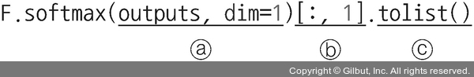

- 소프트맥스(softmax)는 지정된 차원(dim)을 따라 텐서의 요소(텐서의 개별 값)가 (0, 1) 범위에 있고 합계가 1이 되도록 크기를 다시 조정한다.
    - outputs에 softmax를 적용하여 각 행의 합이 1이 되도록 한다.
    - 위의 값 중 모든 행(:)에서 두 번째 칼럼(1번째 인덱스)을 가져온다.
    - 배열을 리스트 형태로 변환한다.

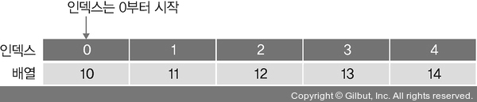

---
- 예측 함수를 실행한 결과:
```
100%|          | 10/10 [00:00<00.00, 49.51it/s]
```
- 예측 결과를 CSV 파일로 저장하는 함수였기 때문에 실행 결과는 큰 의미가 없으며 단순히 처리가 완료되었다고 이해하면 된다.
- 테스트 데이터셋을 모델에 적용한 결과를 LeNet 파일로 저장해 두었고, 그 결과를 보자.
```py
# 6-19. 테스트 데이터셋의 예측 결과 호출

res.head(10)
```
- DataFrame에서 10개의 값을 보여준다.

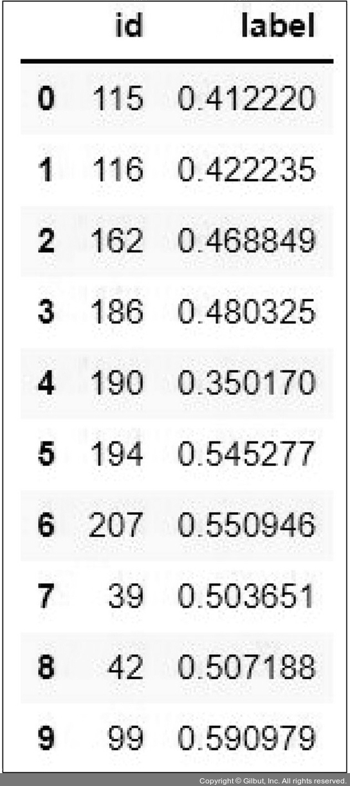

- 예측 결과 레이블(label)이 0.5보다 크면 개를 의미하고, 0.5보다 작으면 고양이를 의미한다.
- 마지막으로 예측 결과를 시각적으로 표현하기 위한 함수를 정의한다.
```py
# 6-20. 테스트 데이터셋 이미지를 출력하기 위한 함수 정의

# 개와 고양이에 대한 클래스 정의
class_ = classes = {0:'cat', 1:'dog'}
def display_image_grid(images_filepaths, predicted_labels=(), cols=5):
    rows = len(images_filepaths) // cols
    figure, ax = plt.subplots(nrows=rows, ncols=cols, figsize=(12, 6))
    for i, image_filepath in enumerate(images_filepaths):
        image = cv2.imread(image_filepath)
        image = cv2.cvtColor(image, cv2.COLOR_BGR2RGB)
        # 데이터 프레임의 id라는 칼럼에서 임의로 데이터를 가져옴
        a = random.choice(res['id'].values)
        label = res.loc[res['id'] == a, 'label'].values[0]
        
        # 레이블 값이 0.5보다 크다면 개
        if label > 0.5:
            label = 1
            
        # 레이블 값이 0.5보다 작다면 고양이
        else:
            label = 0
        ax.ravel()[i].imshow(image)
        ax.ravel()[i].set_title(class_[label])
        ax.ravel()[i].set_axis_off()
    plt.tight_layout()
    plt.show()
```
- 다음은 테스트 데이터셋에 대한 예측 결과를 시각적으로 보여 주기 위해 앞에서 정의한 함수를 호출한다.
- 이때 전달되는 파라미터는 테스트 데이터셋이다.
```py
# 6-21. 테스트 데이터셋 예측 결과 이미지 출력

display_image_grid(test_images_filepaths)
```


- 예측력이 좋지는 않다.
- 극히 일부의 데이터를 이용한 모델 학습을 진행했기 때문에 이와 같은 예측력을 보여준다.
- 앞에서 말했듯이 캐글에서 내려받은 데이터 전체를 사용한다면 성능이 높아지겠지만 CPU를 사용한다면 훈련 시간은 며칠이 걸릴 수도 있다.

### 1-2. AlexNet
- AlexNet을 설명하기에 앞서 AlexNet의 세부 블록을 이해하고자 CNN 구조를 다시 살펴본다.
- CNN은 다음 그림과 같이 3차원 구조를 갖는다는 것을 이해해야 한다(이미지를 다루기 때문에 기본적으로 3차원 데이터를 다룬다).
- 이미지 크기를 나타내는 너비(width)와 높이(height)뿐만 아니라 깊이(depth)를 갖는다.
- 보통 색상이 많은 이미지는 R/G/B 성분 세 개를 갖기 때문에 시작이 3이지만, 합성곱을 거치면서 특성 맵이 만들어지고 이것에 따라 중간 영상의 깊이가 달라진다.

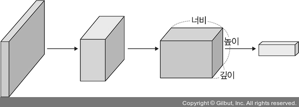

- AlexNet은 합성곱층 총 다섯 개와 완전연결층 세 개로 구성되어 있으며, 맨 마지막 완전연결층은 카테고리 1000개를 분류하기 위해 소프트맥스 활성화 함수를 사용하고 있다.
- 전체적으로 보면 GPU 두 개를 기반으로 한 병렬 구조인 점을 제외하면 LeNet-5와 크게 다르지 않다.

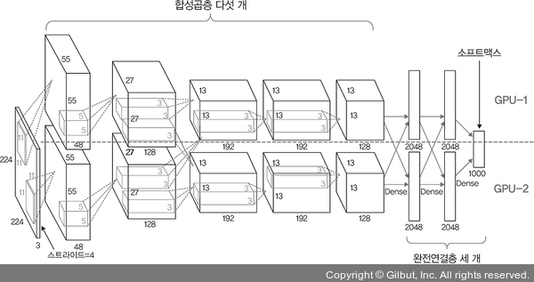

- AlexNet의 합성곱층에서 사용된 활성화 함수는 렐루(ReLU)이다.
- 각 계층의 구조적 세부 사항:

|계층 유형|특성 맵|크기|커널 크기|스트라이드|활성화 함수|
|:---:|:---:|:---:|:---:|:---:|:---:|
|이미지|1|227x227|-|-|-|
|합성곱층|96|55x55|11x11|4|렐루(ReLU)|
|최대 풀링층|96|27x27|3x3|2|-|
|합성곱층|256|27x27|5x5|1|렐루(ReLU)|
|최대 풀링층|256|13x13|3x3|2|-|
|합성곱층|384|13x13|3x3|1|렐루(ReLU)|
|합성곱층|384|13x13|3x3|1|렐루(ReLU)|
|합성곱층|256|13x13|3x3|1|렐루(ReLU)|
|최대 풀링층|256|6x6|3x3|2|-|
|완전연결층|-|4096|-|-|렐루(ReLU)|
|완전연결층|-|4096|-|-|렐루(ReLU)|
|완전연결층|-|1000|-|-|소프트맥스(softmax)|

- 네트워크에는 학습 가능한 변수가 총 6600만 개 있다.
- 네트워크에 대한 입력은 227×227×3 크기의 RGB 이미지이며, 각 클래스(혹은 카테고리)에 해당하는 1000×1 확률 벡터를 출력한다.
- AlexNet의 첫 번째 합성곱층 커널의 크기는 11×11×3이며, 스트라이드를 4로 적용하여 특성 맵을 96개 생성하기 때문에 55×55×96의 출력을 갖는다.
- 첫 번째 계층을 거치면서 GPU-1에서는 주로 컬러와 상관없는 정보를 추출하기 위한 커널이 학습되고, GPU-2에서는 주로 컬러와 관련된 정보를 추출하기 위한 커널이 학습된다.
- 각 GPU의 결과가 다음 그림과 같이 나타난다.

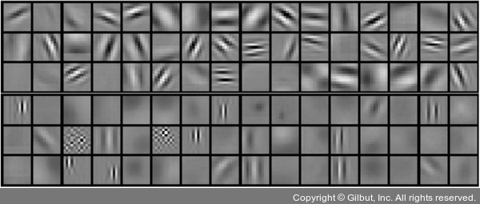

- 이제 파이토치 코드로 AlexNet에 대해 살펴본다.
- 먼저 필요한 라이브러리를 호출한다.
- 전반적인 코드는 LeNet과 크게 다르지 않기 때문에 주로 모델을 구성하는 네트워크가 어떻게 차이가 나는지 위주로 살펴보면 좋다.
```py
# 6-22. 필요한 라이브러리 호출

import torch
import torchvision
from torch.utils.data import DataLoader, Dataset
from torchvision import transforms
from torch.autograd import Variable
from torch import optim
import torch.nn as nn
import torch.nn.functional as F
import os
import cv2
import random
from PIL import Image
from tqdm import tqdm_notebook as tqdm
device = torch.device("cuda:0" if torch.cuda.is_available() else "cpu")
```
- 데이터셋은 앞서 진행했던 개와 고양이 이미지를 계속 사용한다.
- 이제 준비된 데이터를 이용할 네트워크를 생성해야 한다.
- 원래 AlexNet의 마지막 계층에는 뉴런이 1000개 있지만 예제에서는 클래스 두 개만 사용한다.

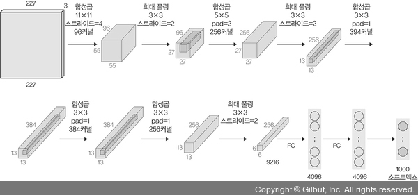

- 데이터 전처리에 대한 코드이다.
```py
# 6-23. 데이터 전처리

class ImageTransform():
    def __init__(self, resize, mean, std):
        self.data_transform = {
            'train': transforms.Compose([
                transforms.RandomResizedCrop(resize, scale=(0.5,1.0)),
                transforms.RandomHorizontalFlip(),
                transforms.ToTensor(),
                transforms.Normalize(mean, std)
            ]),
            'val': transforms.Compose([
                transforms.Resize(256),
                transforms.CenterCrop(resize),
                transforms.ToTensor(),
                transforms.Normalize(mean, std)
            ])
        }

    def __call__(self, img, phase):
        return self.data_transform[phase](img)
```
- 이미지가 위치한 경로에서 데이터를 가져와 훈련, 검증, 테스트 용도로 분리한다.
- 데이터가 위치한 경로에는 Cat과 Dog 폴더로 구성되어 있다.
```py
# 6-24. 데이터를 가져와서 훈련, 검증, 테스트 용도로 분리

cat_directory = '/Users/ramy/PycharmProjects/Pytorch/080289/chap06/data/dogs-vs-cats/Cat/'
dog_directory = '/Users/ramy/PycharmProjects/Pytorch/080289/chap06/data/dogs-vs-cats/Dog/'

cat_images_filepaths = sorted([os.path.join(cat_directory, f) for f in os.listdir(cat_directory)])
dog_images_filepaths = sorted([os.path.join(dog_directory, f) for f in os.listdir(dog_directory)])
images_filepaths = [*cat_images_filepaths, *dog_images_filepaths]
correct_images_filepaths = [i for i in images_filepaths if cv2.imread(i) is not None]

random.seed(42)
random.shuffle(correct_images_filepaths)
train_images_filepaths = correct_images_filepaths[:400]
val_images_filepaths = correct_images_filepaths[400:-10]
test_images_filepaths = correct_images_filepaths[-10:]
print(len(train_images_filepaths), len(val_images_filepaths), len(test_images_filepaths))
```
- 다음은 훈련, 검증, 테스트에서 사용할 데이터셋의 이미지 수이다.
```
400 92 10
```
- AlexNet은 파라미터를 6000만 개 사용하는 모델이다.
- 이때 충분한 데이터가 없으면 과적합이 발생하는 등 테스트 데이터에 대한 성능이 좋지 않다.
- 우리가 사용할 예제에서는 데이터셋을 상당히 제한하여 사용하고 있기 때문에 성능은 좋지 않다는 것을 미리 언급한다.
- 성능이 좋은 결과를 원한다면 충분한 데이터셋을 확보하고 테스트를 진행하면 된다.
- 예를 들어 캐글에서 내려받은 모든 이미지를 사용하는 것뿐만 아니라 전처리 부분에서 데이터를 많이 확장(RandomRotation, RandomHorizontalFlip 등을 이용)시켜 예제를 진행해야 한다.
- torch.utils.data.Dataset을 상속받아 커스텀 데이터셋(custom dataset)을 정의한다.
- torch.utils.data.Dataset 클래스를 상속받아 커스텀 데이터셋을 만들어 본다.
```py
# 6-25. 커스텀 데이터셋 정의

class DogvsCatDataset(Dataset):
    def __init__(self, file_list, transform=None, phase='train'):
        # 이미지 데이터가 위치한 파일 경로
        self.file_list = file_list
        # 이미지 데이터 전처리
        self.transform = transform
        # self.phase는 ImageTransform()에서 정의한 ‘train’과 ‘val’을 의미
        self.phase = phase

    def __len__(self):
        return len(self.file_list)

    def __getitem__(self, idx):
        # 이미지 데이터의 인덱스를 가져오기
        img_path = self.file_list[idx]
        img = Image.open(img_path)
        img_transformed = self.transform(img, self.phase)

        # 레이블 값을 가져오기
        label = img_path.split('/')[-1].split('.')[0]
        if label == 'dog':
            label = 1
        elif label == 'cat':
            label = 0

        # 전처리가 적용된 이미지와 레이블 반환
        return img_transformed, label
```
- 전처리에서 필요한 평균(mean), 표준편차(std) 등에 대한 변수 값을 정의한다.
```py
# 6-26. 변수에 대한 값 정의

# AlexNet은 깊이가 깊은 네트워크를 사용하므로 이미지 크기가 256이 아니면 풀링층 때문에 크기가 계속 줄어들어 오류가 발생할 수 있음
size = 256
mean = (0.485, 0.456, 0.406)
std = (0.229, 0.224, 0.225)
batch_size = 32
```
- 훈련과 검증 용도의 데이터셋을 정의한다.
- 앞에서 정의한 DogvsCatDataset() 클래스에 훈련, 검증, 테스트 데이터를 적용하되 전처리도 함께 적용하도록 한다.
```py
# 6-27. 훈련, 검증, 테스트 데이터셋 정의

train_dataset = DogvsCatDataset(train_images_filepaths, transform=ImageTransform(size, mean, std), phase='train')
val_dataset = DogvsCatDataset(val_images_filepaths, transform=ImageTransform(size, mean, std), phase='val')
test_dataset = DogvsCatDataset(val_images_filepaths, transform=ImageTransform(size, mean, std), phase='val')

index = 0
print(train_dataset.__getitem__(index)[0].size())
print(train_dataset.__getitem__(index)[1])
```
- 출력 결과:
```
torch.Size([3, 256, 256])
0
```
- 훈련 데이터셋의 크기는 (3, 256, 256)을 보여 준다.
- 이것에 대한 값은 (채널, 너비, 높이)를 의미한다.
- 이제 데이터셋을 데이터로더로 전달하여 메모리로 불러올 준비를 한다.
```py
# 6-28. 데이터셋을 메모리로 불러옴

train_dataloader = DataLoader(train_dataset, batch_size=batch_size, shuffle=True)
val_dataloader = DataLoader(val_dataset, batch_size=batch_size, shuffle=False)
test_dataloader = DataLoader(test_dataset, batch_size=batch_size, shuffle=False)
dataloader_dict = {'train': train_dataloader, 'val': val_dataloader}

batch_iterator = iter(train_dataloader)
inputs, label = next(batch_iterator)
print(inputs.size())
print(label)
```
- 출력 결과:
```
torch.Size([32, 3, 256, 256])
tensor([0, 1, 1, 1, 0, 1, 1, 0, 0, 0, 0, 1, 1, 0, 1, 0, 0, 1, 0, 1, 0, 1, 1, 1, 1, 1, 1, 1, 1, 1, 0, 0])
```
- 이제 AlexNet 모델에 대한 네트워크를 정의한다.
- AlexNet 모델을 사용하기 위한 네트워크는 사전 훈련된 네트워크와 유사하게 정의했다.
- 합성곱(Conv2d) +(활성화 함수(ReLU))+풀링(MaxPool2d)이 다섯 번 반복된 후 두 개의 완전연결층과 출력층으로 구성된 네트워크이다.
```py
# 6-29. AlexNet 모델 네트워크 정의

class AlexNet(nn.Module):
    def __init__(self) -> None:
        super(AlexNet, self).__init__()
        self.features = nn.Sequential(
            nn.Conv2d(3, 64, kernel_size=11, stride=4, padding=2),
            # (1)
            nn.ReLU(inplace=True),
            nn.MaxPool2d(kernel_size=3, stride=2),
            nn.Conv2d(64, 192, kernel_size=5, padding=2),
            nn.ReLU(inplace=True),
            nn.MaxPool2d(kernel_size=3, stride=2),
            nn.Conv2d(192, 384, kernel_size=3, padding=1),
            nn.ReLU(inplace=True),
            nn.Conv2d(384, 256, kernel_size=3, padding=1),
            nn.ReLU(inplace=True),
            nn.Conv2d(256, 256, kernel_size=3, padding=1),
            nn.ReLU(inplace=True),
            nn.MaxPool2d(kernel_size=3, stride=2),
        )
        # (2)
        self.avgpool = nn.AdaptiveAvgPool2d((6, 6))
        self.classifier = nn.Sequential(
            nn.Dropout(),
            nn.Linear(256*6*6, 4096),
            nn.ReLU(inplace=True),
            nn.Dropout(),
            nn.Linear(4096, 512),
            nn.ReLU(inplace=True),
            nn.Linear(512, 2),
        )

    def forward(self, x: torch.Tensor) -> torch.Tensor:
        x = self.features(x)
        x = self.avgpool(x)
        x = torch.flatten(x, 1)
        x = self.classifier(x)
        return x
```

#### (1)
- ReLU 활성화 함수에서 inplace 의미에 대해 대략 살펴보았다.
- inplace 연산이란 연산에 대한 결괏값을 새로운 변수에 저장하는 것이 아닌 기존 데이터를 대체하는 것을 의미한다.
- 즉, 기존 값을 연산 결괏값으로 대체함으로써 기존 값들을 무시하겠다는 의미이다.

#### (2)
- nn.AdaptiveAvgPool2d는 nn.AvgPool2d처럼 풀링을 위해 사용한다.
- AvgPool2d에서는 풀링에 대한 커널 및 스트라이드 크기를 정의해야 동작한다.
- 예를 들어 nn.AvgPool2d((3, 2), stride=(2, 1))처럼 지정하면 그 결과는 5×5 텐서를 3×3 텐서로, 7×7 텐서를 4×4 텐서로 줄이는 효과를 얻을 수 있다.
- 조금 더 정확히 표현하자면, (N, C, Hin, Win) 크기의 입력을 (N, C, Hout, Wout) 크기로 출력하는 것이 AvgPool2d이다.
- 이때 Hout, Wout은 다음과 같은 공식에 의해 계산된다.

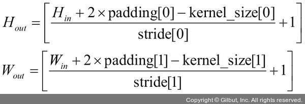

- 반면에 AdaptiveAvgPool2d는 풀링 작업이 끝날 때 필요한 출력 크기를 정의한다.
- 즉, nn.AvgPool2d에서는 커널 크기, 스트라이드, 패딩을 지정했다면 nn.AdaptiveAvgPool2d는 출력에 대한 크기만 지정한다.
- 앞의 수식에서 Hout, Wout 값이 정해졌기 때문에 커널 크기, 스트라이드, 패딩 값을 구할 수 있다.
- 따라서 AdaptiveAvgPool2d를 사용할 경우 출력 크기에 대한 조정이 상당히 쉬워진다.
- 참고로 AdaptiveAvgPool2d는 입력 크기에 변동이 있고 CNN 위쪽에 완전연결층을 사용하는 경우 유용하다.

---
- 앞서 생성한 모델의 네트워크 클래스(AlexNet)를 호출하여 model이라는 객체를 생성한다.
```py
# 6-30. model 객체 생성

model = AlexNet()
model.to(device)
```
- 실행 시 AlexNet 모델에 대한 네트워크 구조를 보여준다.
```
AlexNet(
  (features): Sequential(
    (0): Conv2d(3, 64, kernel_size=(11, 11), stride=(4, 4), padding=(2, 2))
    (1): ReLU(inplace=True)
    (2): MaxPool2d(kernel_size=3, stride=2, padding=0, dilation=1, ceil_mode=False)
    (3): Conv2d(64, 192, kernel_size=(5, 5), stride=(1, 1), padding=(2, 2))
    (4): ReLU(inplace=True)
    (5): MaxPool2d(kernel_size=3, stride=2, padding=0, dilation=1, ceil_mode=False)
    (6): Conv2d(192, 384, kernel_size=(3, 3), stride=(1, 1), padding=(1, 1))
    (7): ReLU(inplace=True)
    (8): Conv2d(384, 256, kernel_size=(3, 3), stride=(1, 1), padding=(1, 1))
    (9): ReLU(inplace=True)
    (10): Conv2d(256, 256, kernel_size=(3, 3), stride=(1, 1), padding=(1, 1))
    (11): ReLU(inplace=True)
    (12): MaxPool2d(kernel_size=3, stride=2, padding=0, dilation=1, ceil_mode=False)
  )
  (avgpool): AdaptiveAvgPool2d(output_size=(6, 6))
  (classifier): Sequential(
    (0): Dropout(p=0.5, inplace=False)
    (1): Linear(in_features=9216, out_features=4096, bias=True)
    (2): ReLU(inplace=True)
    (3): Dropout(p=0.5, inplace=False)
    (4): Linear(in_features=4096, out_features=512, bias=True)
    (5): ReLU(inplace=True)
    (6): Linear(in_features=512, out_features=2, bias=True)
  )
)
```
- 학습에서 사용될 옵티마이저와 손실 함수를 정의한다.
```py
# 6-31. 옵티마이저 및 손실 함수 정의

optimizer = optim.SGD(model.parameters(), lr=0.001, momentum=0.9)
criterion = nn.CrossEntropyLoss()
```
- torchsummary를 이용하여 모델의 네트워크를 다시 살펴본다.
- 모델의 네트워크를 파라미터와 함께 보여 주고 있기 때문에 내부적으로 어떤 일들이 이루어지는지 예측하면서 살펴볼 수 있다.
```py
# 6-32. 모델 네트워크 구조 확인

from torchsummary import summary
summary(model, input_size=(3, 256, 256))
```
- torchsummary를 이용한 네트워크 구조를 출력한 결과:
```
----------------------------------------------------------------
        Layer (type)               Output Shape         Param #
================================================================
            Conv2d-1           [-1, 64, 63, 63]          23,296
              ReLU-2           [-1, 64, 63, 63]               0
         MaxPool2d-3           [-1, 64, 31, 31]               0
            Conv2d-4          [-1, 192, 31, 31]         307,392
              ReLU-5          [-1, 192, 31, 31]               0
         MaxPool2d-6          [-1, 192, 15, 15]               0
            Conv2d-7          [-1, 384, 15, 15]         663,936
              ReLU-8          [-1, 384, 15, 15]               0
            Conv2d-9          [-1, 256, 15, 15]         884,992
             ReLU-10          [-1, 256, 15, 15]               0
           Conv2d-11          [-1, 256, 15, 15]         590,080
             ReLU-12          [-1, 256, 15, 15]               0
        MaxPool2d-13            [-1, 256, 7, 7]               0
AdaptiveAvgPool2d-14            [-1, 256, 6, 6]               0
          Dropout-15                 [-1, 9216]               0
           Linear-16                 [-1, 4096]      37,752,832
             ReLU-17                 [-1, 4096]               0
          Dropout-18                 [-1, 4096]               0
           Linear-19                  [-1, 512]       2,097,664
             ReLU-20                  [-1, 512]               0
           Linear-21                    [-1, 2]           1,026
================================================================
Total params: 42,321,218
Trainable params: 42,321,218
Non-trainable params: 0
----------------------------------------------------------------
Input size (MB): 0.75
Forward/backward pass size (MB): 10.90
Params size (MB): 161.44
Estimated Total Size (MB): 173.10
----------------------------------------------------------------
```
- 모델 학습을 진행할 함수를 정의한다.
```py
# 6-33. 모델 학습 함수 정의

def train_model(model, dataloader_dict, criterion, optimizer, num_epoch):

    since = time.time()
    best_acc = 0.0

    for epoch in range(num_epoch):
        print('Epoch {}/{}'.format(epoch+1, num_epoch))
        print('-'*20)

        for phase in ['train', 'val']:
            if phase == 'train':
                model.train()
            else:
                model.eval()

            epoch_loss = 0.0
            epoch_corrects = 0

            for inputs, labels in tqdm(dataloader_dict[phase]):
                inputs = inputs.to(device)
                labels = labels.to(device)
                optimizer.zero_grad()

                with torch.set_grad_enabled(phase == 'train'):
                    outputs = model(inputs)
                    _, preds = torch.max(outputs, 1)
                    loss = criterion(outputs, labels)

                    if phase == 'train':
                        loss.backward()
                        optimizer.step()

                    epoch_loss += loss.item() * inputs.size(0)
                    epoch_corrects += torch.sum(preds == labels.data)

            epoch_loss = epoch_loss / len(dataloader_dict[phase].dataset)
            epoch_acc = epoch_corrects.double() / len(dataloader_dict[phase].dataset)

            print('{} Loss: {:.4f} Acc: {:.4f}'.format(phase, epoch_loss, epoch_acc))

    time_elapsed = time.time() - since
    print('Training complete in {:.0f}m {:.0f}s'.format(
          time_elapsed // 60, time_elapsed % 60))
    return model
```
- 훈련을 위해 정의된 train_model() 함수를 호출하여 모델을 학습시켜 본다.
- 이때 에포크는 10으로 한다.
- 이 역시 예제를 진행할 PC(노트북)의 성능 및 학습 시간을 고려하여 최소한의 에포크로 지정했다.
```py
# 6-34. 모델 학습

num_epoch = 10
model = train_model(model, dataloader_dict, criterion, optimizer, num_epoch)
```
- 학습 결과:
```
Epoch 1/10
--------------------

100%|          | 13/13 [00:09<00.00, 1.52it/s]
train Loss: 0.6933 Acc: 0.5025

100%|          | 3/3 [00:01<00.00, 2.80it/s]
val Loss: 0.6929 Acc: 0.5109
Epoch 2/10
--------------------

100%|          | 13/13 [00:09<00.00, 1.53it/s]
train Loss: 0.6930 Acc: 0.5025

100%|          | 3/3 [00:01<00.00, 2.94it/s]
val Loss: 0.6929 Acc: 0.5109
Epoch 3/10
--------------------

100%|          | 13/13 [00:09<00.00, 1.51it/s]
train Loss: 0.6932 Acc: 0.5025

100%|          | 3/3 [00:01<00.00, 2.90it/s]
val Loss: 0.6928 Acc: 0.5109
Epoch 4/10
--------------------

100%|          | 13/13 [00:09<00.00, 1.56it/s]
train Loss: 0.6932 Acc: 0.5025

100%|          | 3/3 [00:01<00.00, 2.99it/s]
val Loss: 0.6928 Acc: 0.5109
Epoch 5/10
--------------------

100%|          | 13/13 [00:09<00.00, 1.56it/s]
train Loss: 0.6929 Acc: 0.5025

100%|          | 3/3 [00:01<00.00, 2.90it/s]
val Loss: 0.6928 Acc: 0.5109
Epoch 6/10
--------------------

100%|          | 13/13 [00:09<00.00, 1.52it/s]
train Loss: 0.6931 Acc: 0.5025

100%|          | 3/3 [00:01<00.00, 2.79it/s]
val Loss: 0.6927 Acc: 0.5109
Epoch 7/10
--------------------

100%|          | 13/13 [00:09<0.00, 1.47it/s]
train Loss: 0.6932 Acc: 0.5025

100%|          | 3/3 [00:01<00.00, 2.75it/s]
val Loss: 0.6927 Acc: 0.5109
Epoch 8/10
--------------------

100%|          | 13/13 [00:10<00.00, 1.45it/s]
train Loss: 0.6929 Acc: 0.5025

100%|          | 3/3 [00:01<00.00, 2.70it/s]
val Loss: 0.6927 Acc: 0.5109
Epoch 9/10
--------------------

100%|          | 13/13 [00:10<00.00, 1.42it/s]
train Loss: 0.6929 Acc: 0.5025

100%|          | 3/3 [00:01<00.00, 2.65it/s]
val Loss: 0.6927 Acc: 0.5109
Epoch 10/10
--------------------

100%|          | 13/13 [00:10<00.00, 1.41it/s]
train Loss: 0.6926 Acc: 0.5025

100%|          | 3/3 [00:01<00.00, 2.60it/s]
val Loss: 0.6927 Acc: 0.5109
Training complete in 1m 49s
```
- 모델을 이용하여 테스트 데이터셋을 예측해 본다.
```py
# 6-35. 모델을 이용한 예측

import pandas as pd
id_list = []
pred_list = []
_id = 0
with torch.no_grad():
    # 테스트 이미지 데이터 이용
    for test_path in tqdm(test_images_filepaths):
        img = Image.open(test_path)
        # 이미지 데이터의 번호 가져오기(예를 들어 dog.113.jpg라는 이미지 이름에서 113 가져오기)
        _id = test_path.split('/')[-1].split('.')[1]
        transform = ImageTransform(size, mean, std)
        # 테스트 데이터에 검증용 전처리 적용
        img = transform(img, phase='val')
        img = img.unsqueeze(0)
        img = img.to(device)

        model.eval()
        outputs = model(img)
        preds = F.softmax(outputs, dim=1)[:, 1].tolist()

        id_list.append(_id)
        pred_list.append(preds[0])

# 데이터 프레임에 이미지의 id(번호)와 레이블 저장
res = pd.DataFrame({
    'id': id_list,
    'label': pred_list
})
# 이미지의 id와 레이블을 alexnet.csv 파일에 저장
res.to_csv('/Users/ramy/PycharmProjects/Pytorch/080289/chap06/data/alexnet.csv', index=False)
```
- 실행 결과:
```
100%|          | 10/10 [00:00<00.00, 43.24it/s]
```
- 데이터 프레임에 대한 결과를 확인해본다.
```py
# 6-36. 데이터 프레임 결과 확인

res.head(10)
```
- 출력 결과:

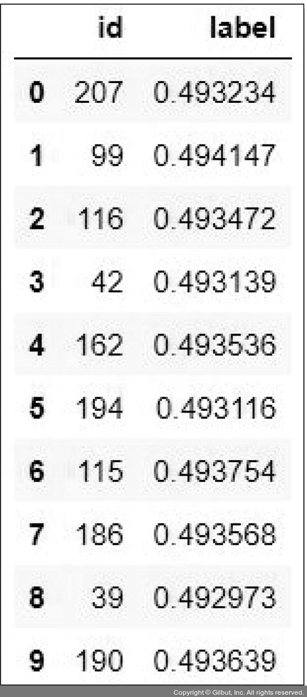

- label 값이 0.5보다 크면 개, 0.5보다 작으면 고양이로 예측했음을 의미한다.
- 예측 결과를 시각적으로 표현하기 위한 함수를 정의힌다.
```py
# 6-37. 예측 결과를 시각적으로 표현하기 위한 함수 정의

class_ = classes = {0:'cat', 1:'dog'}
def display_image_grid(images_filepaths, predicted_labels=(), cols=5):
    rows = len(images_filepaths) // cols
    figure, ax = plt.subplots(nrows=rows, ncols=cols, figsize=(12, 6))
    for i, image_filepath in enumerate(images_filepaths):
        image = cv2.imread(image_filepath)
        image = cv2.cvtColor(image, cv2.COLOR_BGR2RGB)

        a = random.choice(res['id'].values)
        label = res.loc[res['id'] == a, 'label'].values[0]
        if label > 0.5:
            label = 1
        else:
            label = 0
        ax.ravel()[i].imshow(image)
        ax.ravel()[i].set_title(class_[label])
        ax.ravel()[i].set_axis_off()
    plt.tight_layout()
    plt.show()
```
- 함수를 호출하여 테스트 데이터셋에 대한 예측 결과를 이미지와 함께 보여준다.
```py
# 6-38. 예측 결과에 대해 이미지와 함께 출력

display_image_grid(test_images_filepaths)
```
- 출력 결과:


- 예측 결과가 좋지 않다.

### 1-3. VGGNet
