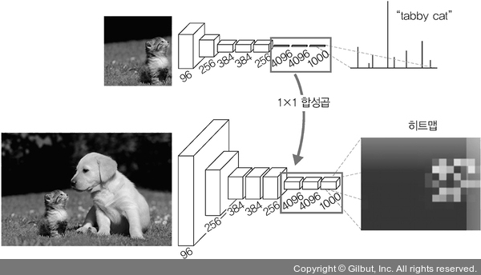
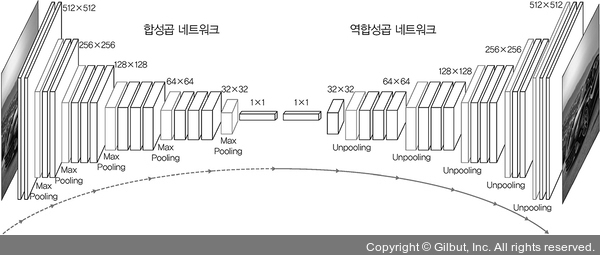
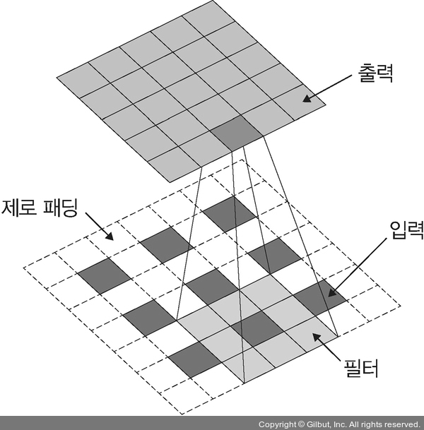
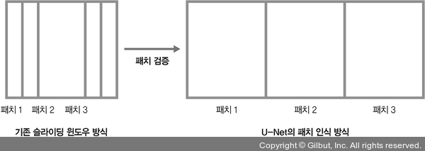
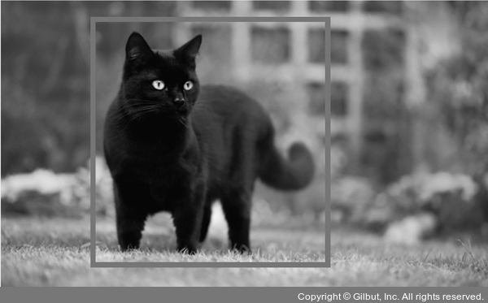
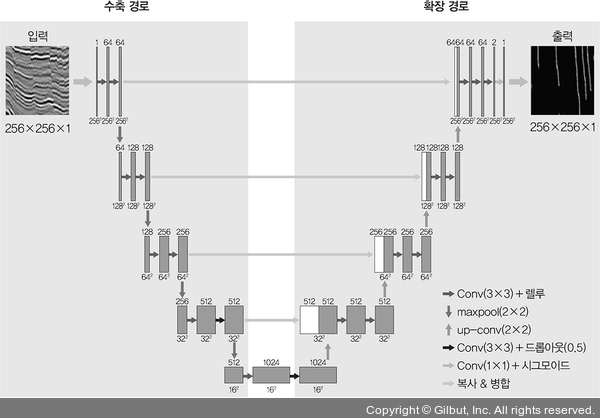

# Chapter 06: 합성곱 신경망 2
## 3. 이미지 분할을 위한 신경망
- 이미지 분할(image segmentation): 신경망을 훈련시켜 이미지를 픽셀 단위로 분할하는 것
-  즉, 이미지를 픽셀 단위로 분할하여 이미지에 포함된 객체를 추출한다.
- 이미지 분할의 대표적 네트워크: 완전 합성곱 네트워크, 합성곱 & 역합성곱 네트워크, U-Net, PSPNet, DeepLabv3/DeepLabv3+
- 먼저 완전 합성곱 네트워크를 살펴본다.

### 3-1. 완전 합성곱 네트워크
- 완전연결층의 한계는 고정된 크기의 입력만 받아들이며, 완전연결층을 거친 후에는 위치 정보가 사라진다는 것이다.
- 이러한 문제를 해결하기 위해 완전연결층을 1×1 합성곱으로 대체하는 것이 완전 합성곱 네트워크이다.
- 즉, 완전 합성곱 네트워크(Fully Convolutional Network, FCN)는 이미지 분류에서 우수한 성능을 보인 CNN 기반 모델(AlexNet, VGG16, GoogLeNet)을 변형시켜 이미지 분할에 적합하도록 만든 네트워크이다.
- 예를 들어 그림과 같이 AlexNet 아래쪽에서 사용되었던 완전연결층 세 개를 1×1 합성곱으로 변환하면 위치 정보가 남아 있기 때문에 히트맵(heatmap) 그림과 같이 고양이의 위치를 확인할 수 있다.

- 또한, 합성곱층으로 사용되기 때문에 입력 이미지에 대한 크기 제약이 사라지는 장점이 있다.

### 3-2. 합성곱 & 역합성곱 네트워크
- 완전 합성곱 네트워크는 위치 정보가 보존된다는 장점에도 아래 단점이 있다.
    - 여러 단계의 합성곱층과 풀링층을 거치면서 해상도가 낮아진다.
    - 낮아진 해상도를 복원하기 위해 업 샘플링 방식을 사용하기 때문에 이미지의 세부 정보들을 잃어버리는 문제가 발생한다.
- 이러한 문제를 해결하기 위해 역합성곱 네트워크를 도입한 것이 합성곱 & 역합성곱 네트워크(convolutional & deconvolutional network)이다.
- 역합성곱은 CNN의 최종 출력 결과를 원래의 입력 이미지와 같은 크기로 만들고 싶을 때 사용한다.
- 시멘틱 분할(semantic segmentation) 등에 활용할 수 있으며, 역합성곱을 업 샘플링(upsampling) 이라고도 한다.

- CNN에서 합성곱층은 합성곱을 사용하여 특성 맵 크기를 줄인다.
- 하지만 역합성곱은 이와 반대로 특성 맵 크기를 증가시키는 방식으로 동작한다.
- 역합성곱 동작 방식:
    1. 각각의 픽셀 주위에 제로 패딩(zero-padding)을 추가한다.
    2. 이렇게 패딩된 것에 합성곱 연산을 수행한다.
- 그림에서 아래쪽의 파란색 픽셀이 입력이며, 초록색 픽셀이 출력이다.
- 이 파란색 픽셀 주위로 흰색 제로 패딩을 수행하고, 회색 필터로 합성곱 연산을 수행하면 초록색이 출력된다.

### 3-3. U-Net
- U-Net: 바이오 메디컬 이미지 분할을 위한 합성곱 신경망
- 메디컬 이미지의 분할과 관련해서 항상 회자되는 네트워크가 U-Net이다.

#### U-Net 특징
- 속도가 빠르다.
    - 기존 슬라이딩 윈도우 방식은 이전 패치(patch)11에서 검증이 끝난 부분을 다음 패치에서 또 검증하기 때문에 속도가 느렸다.
    - 하지만 U-Net은 이미 검증이 끝난 패치는 건너뛰기 때문에 속도가 빠르다.

- 트레이드오프(trade-off)에 빠지지 않는다.
    - 일반적으로 패치 크기가 커진다면 넓은 범위의 이미지를 인식하는 데 뛰어나기 때문에 컨텍스트(context) 인식에 탁월하다.
    - 하지만 지역화에는 한계가 있다.
    - 즉, 너무 넓은 범위를 한 번에 인식하기 때문에 지역화에는 약하기 마련인데, U-Net은 컨텍스트 인식과 지역화 트레이드오프 문제를 개선했다.

> #### 지역화
> - 지역화(localization)는 그림과 같이 이미지 안에 객체(고양이) 위치 정보를 출력해 주는 것으로, 주로 바운딩 박스를 많이 사용한다.
> - 바운딩 박스의 네 꼭지점 픽셀 좌표가 출력되는 것이 아닌 왼쪽 위(left top), 오른쪽 아래(right bottom) 좌표를 출력한다.
>
> 

#### U-Net 구조
- U-Net은 FCN을 기반으로 구축되었으며, 수축 경로(contracting path)와 확장 경로(expansive path)로 구성되어 있다.
- 수축 경로는 컨텍스트를 포착하며, 확장 경로는 특성 맵을 업 샘플링하고 수축 경로에서 포착한 특성 맵의 컨텍스트와 결합하여 정확한 지역화를 수행한다.
- U-Net은 3×3 합성곱이 주를 이루는데 각 합성곱 블록은 3×3 합성곱 두 개로 구성되어 있으며, 그 사이에 드롭아웃(dropout)이 있다.
- 그림의 왼쪽 수축 경로에서의 블록은 3×3 합성곱 두 개로 구성된 것이 네 개가 있는 형태이다.
- 그리고 각 블록은 최대 풀링(maxpool)을 이용하여 크기를 줄이면서 다음 블록으로 넘어간다.
- 반면 그림의 오른쪽 확장 경로에서는 합성곱 블록에 up-conv라는 것을 앞에 붙였다.
- 수축 과정에서 줄어든 크기를 다시 키워 가면서 합성곱 블록을 이용하는 형태이다.
- 즉, 크기가 다양한 이미지의 객체를 분할하기 위해 크기가 다양한 특성 맵을 병합할 수 있도록 다운 샘플링과 업 샘플링을 순서대로 반복하는 구조로 되어 있다.

