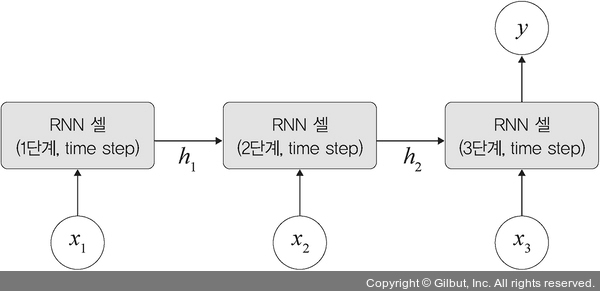

# Chapter 07: 시계열 분석
## 03. 순환 신경망 (RNN)
- RNN(Recurrent Neural Network): 시간적으로 연속성이 있는 데이터를 처리하려고 고안된 인공 신경망
- RNN의 ‘Recurrent(반복되는)’는 이전 은닉층이 현재 은닉층의 입력이 되면서 ‘반복되는 순환 구조를 갖는다’는 의미이다.
- RNN이 기존 네트워크와 다른 점은 ‘기억(memory)’을 갖는다는 것이다.
- 이때 기억은 현재까지 입력 데이터를 요약한 정보라고 생각하면 된다.
- 따라서 새로운 입력이 네트워크로 들어올 때마다 기억은 조금씩 수정되며, 결국 최종적으로 남겨진 기억은 모든 입력 전체를 요약한 정보가 된다.


- 그림과 같이 첫 번째 입력(x1)이 들어오면 첫 번째 기억(h1)이 만들어지고, 두 번째 입력(x2)이 들어오면 기존 기억(h1)과 새로운 입력을 참고하여 새 기억(h2)을 만든다.
- 입력 길이만큼 이 과정을 얼마든지 반복할 수 있다.
- 즉, RNN은 외부 입력과 자신의 이전 상태를 입력받아 현재 상태를 갱신한다.
- RNN은 입력과 출력에 따라 유형이 다양하다.

#### 1. 일대일
- 순환이 없기 때문에 RNN이라고 말하기 어려우며, 순방향 네트워크가 대표적 사례이다.

#### 2. 일대다
- 입력이 하나이고, 출력이 다수인 구조이다.
- 이미지를 입력해서 이미지에 대한 설명을 문장으로 출력하는 이미지 캡션(image captioning)이 대표적 사례이다.

#### 3. 다대일
- 입력이 다수이고 출력이 하나인 구조로, 문장을 입력해서 긍정/부정을 출력하는 감성 분석기에서 사용된다.
- 다대일에 대한 모델은 파이토치에서 아래와 같이 구현한다.
```py
# 임베딩 처리
self.em = nn.Embedding(len(TEXT.vocab.stoi), embeding_dim)
# RNN 적용
self.rnn = nn.RNNCell(input_dim, hidden_size)
# 완전연결층
self.fc1 = nn.Linear(hidden_size, 256)
# 출력층
self.fc2 = nn.Linear(256, 3)
```
- 코드를 구조화하면 다음 그림과 같다.
- 하지만 코드는 입력과 출력 사이에 하나의 RNN 셀(cell)만 가지고 있는 것에 주의해야 한다.



- 또한, 다대일 구조에 층을 쌓아 올리면 다음과 같이 적층된 구조를 가질 수 있다.


#### 4. 다대다
- 입력과 출력이 다수인 구조로, 언어를 번역하는 자동 번역기 등이 대표적인 사례이다.
- 예를 들어 다대다에 대한 모델은 파이토치에서 다음과 같이 구현한다.
- 엄밀히 말해서 파이토치는 텐서플로처럼 구현이 간단하지 않다.
- 텐서플로에서는 `keras.layers.SimpleRNN (100, return_sequences=True, name='RNN')`처럼 `return_sequences=True` 옵션으로 시퀀스를 리턴하도록 쉽게 구현할 수 있다.
- 반면에 파이토치에서는 다음과 같이 문장 번역에서 많이 사용되는 시퀀스-투-시퀀스(seq 2 seq)를 이용하는 방식으로 사용된다.
```py
Seq2Seq(
    (encoder): Encoder(
        (embedding): Embedding(7855, 256)
        (rnn): LSTM(256, 512, num_layers=2, dropout=0.5)
        (dropout): Dropout(p=0.5, inplace=False)
    )
    (decoder): Decoder(
        (embedding): Embedding(5893, 256)
        (rnn): LSTM(256, 512, num_layers=2, dropout=0.5)
        (fc_out): Linear(in_features=512, out_features=5893, bias=True)
        (dropout): Dropout(p=0.5, inplace=False)
    )
)
```
- 코드를 구조화하면 그림과 같다.


#### 5. 동기화 다대다
- 4의 유형처럼 입력과 출력이 다수인 구조이다.
- 문장에서 다음에 나올 단어를 예측하는 언어 모델, 즉 프레임 수준의 비디오 분류가 대표적 사례이다.

---
- 앞서 언급된 순환 신경망 구조들:


### 3-1. RNN 계층과 셀
- 이제 RNN을 구성하는 RNN 계층(layer)과 RNN 셀(cell)을 살펴본다.
- RNN은 내장된(built - in) 계층뿐만 아니라 셀 레벨의 API도 제공한다.
- RNN 계층이 입력된 배치 순서대로 모두 처리하는 것과 다르게 RNN 셀은 오직 하나의 단계(time step)만 처리한다.
- 따라서 RNN 셀은 RNN 계층의 for loop 구문을 갖는 구조라고 할 수 있다.


- RNN 계층은 셀을 래핑하여 동일한 셀을 여러 단계에 적용한다.
- 위 그림에서도 X1, X2, …, Xn 등이 전체 RNN 셀에서 사용되고 있다.
- 즉, 셀은 실제 계산에 사용되는 RNN 계층의 구성 요소로, 단일 입력과 과거 상태(state)를 가져와서 출력과 새로운 상태를 생성한다.
- 셀 유형:
    - nn.RNNCell: SimpleRNN 계층에 대응되는 RNN 셀
    - nn.GRUCell: GRU 계층에 대응되는 GRU 셀
    - nn.LSTMCell: LSTM 계층에 대응되는 LSTM 셀
- 이렇게 RNN의 계층과 셀을 분리해서 설명하는 이유는 파이토치에서 이 둘을 분리해서 구현이 가능하기 때문이다.
- 따라서 앞으로 진행될 RNN 예제는 이 둘을 분리해서 진행한다.
- RNN의 활용 분야로는 대표적으로 ‘자연어 처리’를 꼽을 수 있다.
- 연속적인 단어들의 나열인 언어(자연어) 처리는 음성 인식, 단어의 의미 판단 및 대화 등에 대한 처리가 가능하다.
- 이외에도 손글씨, 센서 데이터 등 시계열 데이터 처리에 활용된다.
- 이제 구체적으로 RNN 구조를 살펴본다.

## 04. RNN 구조
- RNN은 은닉층 노드들이 연결되어 이전 단계 정보를 은닉층 노드에 저장할 수 있도록 구성한 신경망이다.
- 그림에서 볼 수 있듯이 x(t-1)에서 h(t-1)을 얻고 다음 단계에서 h(t-1)과 xt를 사용하여 과거 정보와 현재 정보를 모두 반영한다.
- 또한, ht와 x(t+1)의 정보를 이용하여 과거와 현재 정보를 반복해서 반영하는데, 이러한 구조를 요약한 것이 다음 그림의 오른쪽 부분과 같다.


- RNN에서는 입력층, 은닉층, 출력층 외에 가중치를 세 개 가진다.
- RNN의 가중치는 Wxh, Whh, Why로 분류된다.
    - Wxh: 입력층에서 은닉층으로 전달되는 가중치
    - Whh: t 시점의 은닉층에서 t+1 시점의 은닉층으로 전달되는 가중치
    - Why: 은닉층에서 출력층으로 전달되는 가중치
- 가중치 Wxh, Whh, Why는 모든 시점에 동일하다는 것에 주의할 필요가 있다.
- 즉, 가중치를 공유하는데 위 그림과 같이 모든 가중치가 동일한 것을 확인할 수 있다.

#### t 단계에서의 RNN 계산
1. 은닉층
    - 은닉층 계산을 위해 xt와 h(t-1)이 필요하다.
    - 즉, (이전 은닉층×은닉층 → 은닉층 가중치 + 입력층 → 은닉층 가중치×(현재) 입력 값)으로 계산할 수 있으며, RNN에서 은닉층은 일반적으로 하이퍼볼릭 탄젠트 활성화 함수를 사용한다.
    - 수식:


2. 출력층
    - 출력층은 심층 신경망과 계산 방법이 동일하다.
    - 즉, (은닉층 → 출력층 가중치×현재 은닉층)에 소프트맥스 함수를 적용한다.
    - 수식:


3. 오차
    - RNN의 오차(E)는 심층 신경망에서 전방향(feedforward) 학습과 달리 각 단계(t)마다 오차를 측정한다.
    - 각 단계마다 실제 값과 예측 값으로 오차(평균 제곱 오차 적용)를 이용하여 측정한다.


4. 역전파
    - RNN에서 역전파는 BPTT(BackPropagation Through Time)를 이용하여 모든 단계마다 처음부터 끝까지 역전파한다.

- 오차는 각 단계(t)마다 오차를 측정하고 이전 단계로 전달되는데, 이것을 BPTT라고 한다.
- 즉, 3에서 구한 오차를 이용하여 Wxh, Whh, Why 및 바이어스(bias)를 업데이트한다.
- 이때 BPTT는 오차가 멀리 전파될 때(왼쪽으로 전파) 계산량이 많아지고 전파되는 양이 점차 적어지는 문제점(기울기 소멸 문제(vanishing gradient problem))이 발생한다.
- 기울기 소멸 문제를 보완하기 위해 오차를 몇 단계까지만 전파시키는 생략된-BPTT(truncated BPTT)를 사용할 수도 있고, 근본적으로는 LSTM 및 GRU를 많이 사용한다.


> #### 생략된-BPTT
> - 계산량을 줄이기 위해 현재 단계에서 일정 시점까지만 오류를 역전파하는데, 이것을 생략된-BPTT라고 한다.

> #### IMDB 데이터셋
> - IMDB 데이터셋은 영화 리뷰에 대한 데이터 5만 개로 구성되어 있다.
> - 이것을 훈련 데이터 2만 5000개와 테스트 데이터 2만 5000개로 나누며, 각각 50%씩 긍정 리뷰와 부정 리뷰가 있다.
> - 이 데이터는 이미 전처리가 되어 있어 각 리뷰가 숫자로 변환되어 있다.
> - 스탠포드 대학에서 2011년에 낸 논문에서 이 데이터를 소개했으며, 당시 논문에서는 IMDB 데이터셋을 훈련 데이터와 테스트 데이터 50:50 비율로 분할하여 88.89%의 정확도를 얻었다고 소개했다.
> - IMDB 영화 리뷰 데이터셋은 imdb.load_data() 메서드로 바로 내려받아 사용할 수 있도록 지원하고 있다.

- IMDB 데이터셋을 사용해 파이토치에서 RNN 계층과 셀을 구현한다.
- RNN 셀부터 파이토치 코드를 작성해 본다.

### 4-1. RNN 셀 구현
- 아나콘다 프롬프트에서 아래 명령을 실행
```
pip install --user torchtext
```
- torchtext는 자연어 처리(NLP) 분야에서 사용하는 데이터로더(DataLoader)이다.
- torchtext는 파일 가져오기, 토큰화, 단어 집합 생성, 인코딩, 단어 벡터 생성 등의 작업을 지원하기 때문에 자연어 처리에서 많이 사용되고 있다.
- 먼저 필요한 라이브러리들을 호출한다.
```py
# 7-3. 라이브러리 호출

import torch
import torchtext
import numpy as np
import torch.nn as nn
import torch.nn.functional as F
import time
```
- 사용할 데이터셋을 전처리하기 위한 구문이다.
```py
# 7-4. 데이터 전처리

start = time.time()
# (1)
TEXT = torchtext.legacy.data.Field(lower=True, fix_length=200, batch_first=False)
# (2)
LABEL = torchtext.legacy.data.Field(sequential=False)
```

#### (1)
- torchtext.legacy.data에서 제공하는 Field는 데이터 전처리를 위해 사용된다.


- 사용되는 파라미터:
    - lower: 대문자를 모두 소문자로 변경한다. 기본값은 false이다.
    - fix_length: 고정된 길이의 데이터를 얻을 수 있다. 여기에서는 데이터의 길이를 200으로 고정했으며 200보다 짧다면 패딩 작업(padding)을 통해 200으로 맞추어 준다.
    - batch_first: 신경망에 입력되는 텐서의 첫 번째 차원 값이 배치 크기(batch _ size)가 되도록 한다.
        - 기본값은 false이다.
        - 모델의 네트워크로 입력되는 데이터는 [시퀀스 길이, 배치 크기, 은닉층의 뉴런 개수]([seq_len, batch_size, hidden_size])의 형태이다.
        - 이때 batch_first=True로 설정한다면 [배치 크기, 시퀀스 길이, 은닉층의 뉴런 개수]([batch_size, seq_len, hidden_size]) 형태로 변경된다.
        - 참고로 은닉층의 입력 데이터는 batch_first=True 옵션과는 무관하게 [은닉층 개수, 배치 크기, 은닉층의 뉴런 개수]([num_layers, batch, hidden_size])이다.
        - 파이토치는 각 계층별 데이터의 형태를 맞추는 것에서 시작하여 끝날 정도로 중요하다.
        - 따라서 입력층, 은닉층의 데이터들에 대해 각각의 숫자가 의미하는 것을 이해해야 한다.

#### (2)
- 레이블에 대한 전처리 부분이다.


- 사용되는 파라미터:
    - sequential: 데이터에 순서(sequential)가 있는지 나타내며 기본값은 True이다. 예제의 레이블은 긍정/부정 값만 갖기 때문에 False로 설정한다.

---
- 예제에서 사용할 데이터셋은 IMDB이다.
- IMDB는 영화 리뷰 5만 건이 담긴 데이터로 긍정은 2, 부정은 1로 레이블링되어 있다.
- torchtext.legacy.datasets에서 제공하는 IMDB 데이터셋을 내려받는다.
```py
# 7-5. 데이터셋 준비

from torchtext.legacy import datasets
# (1)
train_data, test_data = datasets.IMDB.splits(TEXT, LABEL)
```

#### (1)
- datasets.IMDB를 사용하여 IMDB 데이터셋을 내려받는다.


- 사용되는 파라미터:
    - datasets.IMDB: 파이토치의 datasets에는 사용자들의 학습을 위해 다양한 데이터셋을 제공하고 있다. 이들 중에서 IMDB 데이터를 가져온다.
    - splits: 전체 데이터셋을 텍스트(TEXT)와 레이블(LABEL)로 분할한다. 이후 텍스트 데이터셋은 훈련 용도로, 레이블은 테스트 용도로 사용한다.

---
- 데이터셋을 분리하면 훈련 데이터셋이 2만 5000개, 테스트 데이터셋이 2만 5000개가 된다.
- 훈련 데이터셋에 어떤 데이터들이 포함되어 있는지 확인해 본다.
```py
# 7-6 훈련 데이터셋 내용 확인

# 데이터셋의 내용을 보고자 할 때는 examples를 사용
print(vars(train_data.examples[0]))
```
- 훈련 데이터셋의 첫 번째 데이터(examples[0]) 출력:
```
{'text': ['for', 'a', 'movie', 'that', 'gets', 'no', 'respect', 'there', 'sure', 'are', 'a', 'lot', 'of', 'memorable', 'quotes', 'listed', 'for', 'this', 'gem.', 'imagine', 'a', 'movie', 'where', 'joe', 'piscopo', 'is', 'actually', 'funny!', 'maureen', 'stapleton', 'is', 'a', 'scene', 'stealer.', 'the', 'moroni', 'character', 'is', 'an', 'absolute', 'scream.', 'watch', 'for', 'alan', '"the', 'skipper"', 'hale', 'jr.', 'as', 'a', 'police', 'sgt.'], 'label': 'pos'}
```
- 데이터는 text와 label을 갖는 사전 형식(dict type)으로 구성되어 있다.
- 앞에서 정의했던 전처리 코드를 이용하여 전처리를 진행한다.
- 전처리는 컴퓨터 비전(CNN)과는 다르게 공백 처리, 불필요한 문자 제거 등이 포함된다.
```py
# 7-7. 데이터셋 전처리 적용

import string

for example in train_data.examples:
    # 소문자로 변경
    text = [x.lower() for x in vars(example)['text']]
    # “<br”을 “ ”(공백)으로 변경
    text = [x.replace("<br","") for x in text]
    # 구두점 제거
    text = [''.join(c for c in s if c not in string.punctuation) for s in text]
    # 공백 제거
    text = [s for s in text if s]
    vars(example)['text'] = text
```
- 훈련 데이터셋을 훈련과 검증 용도로 분리한다.
```py
# 7-8. 훈련과 검증 데이터셋 분리

import random
# (1)
train_data, valid_data = train_data.split(random_state=random.seed(0), split_ratio=0.8)
```

#### (1)
- split()을 이용하여 훈련 데이터셋을 훈련과 검증 용도로 분리한다.


- 사용한 파라미터:
    - random_state: 데이터 분할 시 데이터가 임의로 섞인 상태에서 분할된다. 이때 시드(seed) 값을 사용하면 동일한 코드를 여러 번 수행하더라도 동일한 값의 데이터를 반환한다.
    - split_ratio: 데이터의 분할 정도를 의미한다. 훈련과 검증 데이터셋을 8:2로 분리한다.

---
- 분할된 데이터셋의 크기(개수)를 확인한다.
```py
# 7-9. 데이터셋 개수 확인

print(f'Number of training examples: {len(train_data)}')
print(f'Number of validation examples: {len(valid_data)}')
print(f'Number of testing examples: {len(test_data)}')
```
- 분할된 데이터셋의 크기가 출력된다.
```
Number of training examples: 20000
Number of validation examples: 5000
Number of testing examples: 25000
```
- 훈련 데이터셋 2만 5000개를 훈련과 검증 용도로 분리했기 때문에 훈련 데이터셋은 2만 개, 검증 데이터셋은 5000개, 테스트 데이터셋은 2만 5000개가 된다.
- 이제 단어 집합을 만들어 본다.
- 단어 집합이란 말 그대로 IMDB 데이터셋에 포함된 단어들을 이용하여 하나의 딕셔너리와 같은 집합을 만드는 것으로 이해하면 된다.
- 단어 집합을 만들 때는 단어들의 중복은 제거된 상태에서 진행한다.
```py
# 7-10. 단어 집합 만들기

# (1)
TEXT.build_vocab(train_data, max_size=10000, min_freq=10, vectors=None)
LABEL.build_vocab(train_data)

print(f"Unique tokens in TEXT vocabulary: {len(TEXT.vocab)}")
print(f"Unique tokens in LABEL vocabulary: {len(LABEL.vocab)}")
```

#### (1)
- 단어 집합 생성은 build_vocab()을 이용한다.


- 사용된 파라미터:
    - 첫 번째 파라미터: 훈련 데이터셋
    - max_size: 단어 집합의 크기로 단어 집합에 포함되는 어휘 수를 의미한다.
    - min_freq: 훈련 데이터셋에서 특정 단어의 최소 등장 횟수를 의미한다.즉, min_freq=10으로 설정했기 때문에 훈련 데이터셋에서 특정 단어가 최소 열 번 이상 등장한 것만 단어 집합에 추가하겠다는 의미이다.
    - vectors: 임베딩 벡터를 지정할 수 있다.
        - 임베딩 벡터는 워드 임베딩의 결과로 나온 벡터이다.
        - 사전 학습된 임베딩으로는 워드투벡터(Word 2 Vector), 글로브(Glove) 등이 있으며, 파이토치에서도 nn.embedding()을 통해 단어를 랜덤한 숫자 값으로 변환한 후 가중치를 학습하는 방법을 제공한다.

---
- 훈련과 테스트 데이터셋에 포함된(단어 집합에 포함된) 단어의 개수:
```
Unique tokens in TEXT vocabulary: 10002
Unique tokens in LABEL vocabulary: 3
```
- TEXT는 10002개, LABEL은 세 개의 단어로 구성되어 있다.
- LABEL은 긍정과 부정 두 개의 값만 있어야 할 것 같은데 세 개가 있다고 출력되었다.
- LABEL.vocab.stoi를 통해 현재 단어 집합의 단어와 그것에 부여된 고유 정수(인덱스)를 확인해 본다.
```py
# 7-11. 테스트 데이터셋의 단어 집합 확인

print(LABEL.vocab.stoi)
```
- 테스트 데이터셋의 단어 집합에 대한 결과:
```
defaultdict(<bound method Vocab._default_unk_index of <torchtext.legacy.vocab.Vocab object at 0x3781d9550>>, {'<unk>': 0, 'pos': 1, 'neg': 2})
```
- 확인 결과 pos(positive)(긍정), neg(negative)(부정) 외에 `<unk>`가 있다.
- 일반적으로 `<unk>`는 사전에 없는 단어를 의미한다.
- 따라서 예제에서 사용하는 것은 pos와 neg가 될 것이다.
- 전처리가 완료되었기 때문에 BucketIterator()를 이용하여 데이터셋을 메모리로 가져온다.
```py
# 7-12. 데이터셋 메모리로 가져오기

BATCH_SIZE = 64
device = torch.device('cuda:0' if torch.cuda.is_available() else 'cpu')

# 각 단어를 100차원으로 조정(임베딩 계층을 통과한 후 각 벡터의 크기)
embeding_dim = 100
# (1)
hidden_size = 300

# (2)
train_iterator, valid_iterator, test_iterator = torchtext.legacy.data.BucketIterator.splits(
    (train_data, valid_data, test_data),
    batch_size=BATCH_SIZE,
    device=device)
```

#### (1)
- 은닉층의 유닛 개수를 지정한다.
- 유닛 의미:


- 일반적으로 계층(layer)의 유닛 개수를 늘리는 것보다 계층 자체에 대한 개수를 늘리는 것이 성능을 위해서는 더 좋다.
- 은닉층 층수는 인공 신경망이 비선형 문제를 좀 더 잘 학습할 수 있도록 하는 반면, 층 안에 포함된 뉴런은 가중치와 바이어스를 계산하는 용도로 사용되기 때문이다.
- 하지만 최적의 은닉층 개수와 유닛 개수를 찾는 것은 매우 어려운 일이다.
- 그래서 많은 사람이 실제 필요한 개수보다 더 많은 층과 유닛을 구성한 후 과적합이 발생하지 않도록 이들 개수를 조정해 나가는 방식을 많이 사용한다.

#### (2)
- BucketIterator는 데이터로더(dataloader)와 쓰임새가 같다.
- 즉, 배치 크기 단위로 값을 차례대로 꺼내어 메모리로 가져오고 싶을 때 사용한다.
- 특히 Field에서 fix_length를 사용하지 않았다면 BucketIterator에서 데이터의 길이를 조정할 수 있다. 
- ucketIterator는 비슷한 길이의 데이터를 한 배치에 할당하여 패딩(padding)을 최소화시켜 준다.


- 사용된 파라미터:
    - 첫 번째 파라미터: 배치 크기 단위로 데이터를 가져올 데이터셋
    - batch_size: 한 번에 가져올 데이터 크기(배치 크기)
    - device: 어떤 장치(CPU 혹은 GPU)를 사용할지 지정

---
- 이제 워드 임베딩 처리를 해야한다.
- 앞에서 단어 집합을 만드는 과정에서 vectors=none으로 설정했기 때문에 임베딩 처리 부분에 대해 정의하지 않았다.
- 이번 예제에서는 nn.Embedding()을 이용하여 임베딩 처리를 진행한다.
```py
# 7-13. 워드 임베딩 및 RNN 셀 정의

class RNNCell_Encoder(nn.Module):
    def __init__(self, input_dim, hidden_size):
        super(RNNCell_Encoder, self).__init__()
        # (1)
        self.rnn = nn.RNNCell(input_dim, hidden_size)

    # inputs는 입력 시퀀스로 (시퀀스 길이, 배치, 임베딩(seq,batch, embedding))의 형태를 가짐
    def forward(self, inputs):
        # 배치를 가져옴
        bz = inputs.shape[1]
        # 배치와 은닉층 뉴런의 크기를 0으로 초기화
        ht = torch.zeros((bz, hidden_size)).to(device)
        for word in inputs:
            # (2)
            ht = self.rnn(word, ht)
        return ht

class Net(nn.Module):
    def __init__(self):
        super(Net, self).__init__()
        # (3)
        self.em = nn.Embedding(len(TEXT.vocab.stoi), embeding_dim)
        self.rnn = RNNCell_Encoder(embeding_dim, hidden_size)
        self.fc1 = nn.Linear(hidden_size, 256)
        self.fc2 = nn.Linear(256, 3)

    def forward(self, x):
        x = self.em(x)
        x = self.rnn(x)
        x = F.relu(self.fc1(x))
        x = self.fc2(x)
        return x
```

#### (1)
- RNN 셀 구현을 위한 구문이다.


- 사용된 파라미터:
    - input_dim: 훈련 데이터셋의 특성(feature) 개수로 (배치, 입력 데이터 칼럼 개수/특성 개수(batch, input_size)) 형태를 갖는다.
    - hidden_size: 은닉층의 뉴런(유닛) 개수로 (배치, 은닉층의 뉴런 개수(batch, hidden_size)) 형태를 갖는다.

#### (2)
- 재귀적으로 발생하는 상태 값을 처리하기 위한 구문이다.


- 사용된 파라미터:
    - 현재 상태를 의미하는 것으로 다음 그림의 ht를 의미한다.
    - word: 현재의 입력 벡터로 다음 그림의 xt를 의미하며 (배치, 입력 데이터 칼럼 개수(batch, input_size))의 형태를 갖는다.
    - ht: 이전 상태를 의미하는 것으로 다음 그림의 h(t-1)을 의미하며 (배치, 은닉층의 뉴런 개수(batch, hidden_size))의 형태를 갖는다.


#### (3)
- 임베딩 처리를 위한 구문이다.


- 사용된 파라미터:
    - 첫 번째 파라미터: 임베딩을 할 단어 수(단어 집합의 크기)
    - embeding_dim: 임베딩할 벡터의 차원

---
- 이제 옵티마이저와 손실 함수를 정의한다.
```py
# 7-14. 옵티마이저와 손실 함수 정의

# model이라는 이름으로 모델을 객체화
model = Net()
model.to(device)

# (1)
loss_fn = nn.CrossEntropyLoss()
optimizer = torch.optim.Adam(model.parameters(), lr=0.0001)
```

#### (1)
- torch.nn.CrossEntropyLoss는 다중 분류에 사용된다.
- torch.nn.CrossEntropyLoss는 nn.LogSoftmax와 nn.NLLLoss 연산의 조합으로 구성된다.
- nn.LogSoftmax는 모델 네트워크의 마지막 계층에서 얻은 결괏값들을 확률로 해석하기 위해 소프트맥스 함수의 결과에 로그(log)를 취한 것이고, nn.NLLLoss는 다중 분류에 사용한다.
- 신경망에서 로그 확률 값을 얻으려면 마지막에 LogSoftmax를 추가해야 한다.

---
- 이제 모델 학습을 위한 함수를 생성한다.
- 모델 학습을 위한 함수는 공식과도 같다.
- 데이터로더에서 데이터를 가져와서 모델에 적용한 후 손실 함수를 적용하여 오차를 구하고 옵티마이저를 이용하여 파라미터(가중치, 바이어스 등)를 업데이트한다.
```py
# 7-15. 모델 학습을 위한 함수 정의

def training(epoch, model, trainloader, validloader):
    correct = 0
    total = 0
    running_loss = 0

    model.train()
    for b in trainloader:
        # trainloader에서 text와 label을 꺼내 옴
        x, y = b.text, b.label
        # 꺼내 온 데이터가 CPU를 사용할 수 있도록 장치 지정, 반드시 모델과 같은 장치를 사용하도록 지정해야 함
        x, y = x.to(device), y.to(device)
        y_pred = model(x)
        # CrossEntropyLoss 손실 함수를 이용하여 오차 계산
        loss = loss_fn(y_pred, y)
        optimizer.zero_grad()
        loss.backward()
        optimizer.step()
        with torch.no_grad():
            y_pred = torch.argmax(y_pred, dim=1)
            correct += (y_pred == y).sum().item()
            total += y.size(0)
            running_loss += loss.item()

    # 누적된 오차를 전체 데이터셋으로 나누어서 에포크 단계마다 오차를 구함
    epoch_loss = running_loss / len(trainloader.dataset)
    epoch_acc = correct / total

    valid_correct = 0
    valid_total = 0
    valid_running_loss = 0

    model.eval()
    with torch.no_grad():
        for b in validloader:
            x, y = b.text, b.label
            x, y = x.to(device), y.to(device)
            y_pred = model(x)
            loss = loss_fn(y_pred, y)
            y_pred = torch.argmax(y_pred, dim=1)
            valid_correct += (y_pred == y).sum().item()
            valid_total += y.size(0)
            valid_running_loss += loss.item()

    epoch_valid_loss = valid_running_loss / len(validloader.dataset)
    epoch_valid_acc = valid_correct / valid_total

    # 훈련이 진행될 때 에포크마다 정확도와 오차(loss)를 출력
    print('epoch: ', epoch,
          'loss： ', round(epoch_loss, 3),
          'accuracy:', round(epoch_acc, 3),
          'valid_loss： ', round(epoch_valid_loss, 3),
          'valid_accuracy:', round(epoch_valid_acc, 3)
          )
    return epoch_loss, epoch_acc,     epoch_valid_loss, epoch_valid_acc
```
- 이제 실제로 훈련과 검증 데이터셋을 이용한 모델 학습을 진행한다.
```py
# 7-16. 모델 학습

epochs = 5
train_loss = []
train_acc = []
valid_loss = []
valid_acc = []

for epoch in range(epochs):
    epoch_loss, epoch_acc, epoch_valid_loss, epoch_valid_acc = training(epoch, model, train_iterator, valid_iterator)
    # 훈련 데이터셋을 모델에 적용했을 때의 오차
    train_loss.append(epoch_loss)
    # 훈련 데이터셋을 모델에 적용했을 때의 정확도
    train_acc.append(epoch_acc)
    # 검증 데이터셋을 모델에 적용했을 때의 오차
    valid_loss.append(epoch_valid_loss)
    # 검증 데이터셋을 모델에 적용했을 때의 정확도
    valid_acc.append(epoch_valid_acc)

end = time.time()
print(end-start)
```
- 훈련과 검증 데이터셋을 이용한 모델 학습 결과:
```
epoch:  0 loss：  0.011 accuracy: 0.49 valid_loss：  0.011 valid_accuracy: 0.51
epoch:  1 loss：  0.011 accuracy: 0.502 valid_loss：  0.011 valid_accuracy: 0.496
epoch:  2 loss：  0.011 accuracy: 0.511 valid_loss：  0.011 valid_accuracy: 0.497
epoch:  3 loss：  0.011 accuracy: 0.517 valid_loss：  0.011 valid_accuracy: 0.498
epoch:  4 loss：  0.011 accuracy: 0.528 valid_loss：  0.011 valid_accuracy: 0.519
17527.807079792023
```
- 에포크를 5로 지정했기 때문에 정확도가 낮지만 학습과 검증 데이터셋에 대한 오차가 유사하므로 과적합은 발생하지 않고 있다.
- 실제로 테스트 데이터셋에 대해서는 어떤 결과가 나타날지 알아본다.
- 함수의 내용은 앞에서 살펴보았던 코드와 크게 다르지 않다.
```py
# 7-17. 모델 예측 함수 정의

def evaluate(epoch, model, testloader):
    test_correct = 0
    test_total = 0
    test_running_loss = 0

    model.eval()
    with torch.no_grad():
        for b in testloader:
            x, y = b.text, b.label
            x, y = x.to(device), y.to(device)
            y_pred = model(x)
            loss = loss_fn(y_pred, y)
            y_pred = torch.argmax(y_pred, dim=1)
            test_correct += (y_pred == y).sum().item()
            test_total += y.size(0)
            test_running_loss += loss.item()

    epoch_test_loss = test_running_loss / len(testloader.dataset)
    epoch_test_acc = test_correct / test_total

    print('epoch: ', epoch,
          'test_loss: ', round(epoch_test_loss, 3),
          'test_accuracy:', round(epoch_test_acc, 3)
          )
    return epoch_test_loss, epoch_test_acc
```
- 테스트 데이터셋을 이용한 모델 예측 결과를 알아본다.
```py
# 7-18. 모델 예측 결과 확인

epochs = 5
test_loss = []
test_acc = []

for epoch in range(epochs):
    epoch_test_loss, epoch_test_acc = evaluate(epoch, model, test_iterator)
    test_loss.append(epoch_test_loss)
    test_acc.append(epoch_test_acc)

end = time.time()
print(end-start)
```
- 다음과 같이 테스트 데이터셋도 검증 데이터셋의 평가 결과와 크게 다르지 않다.
- 더 높은 정확도를 원한다면 에포크 횟수를 늘려야 한다.
```
epoch:  0 test_loss:  0.011 test_accuracy: 0.503
epoch:  1 test_loss:  0.011 test_accuracy: 0.503
epoch:  2 test_loss:  0.011 test_accuracy: 0.503
epoch:  3 test_loss:  0.011 test_accuracy: 0.503
epoch:  4 test_loss:  0.011 test_accuracy: 0.503
17626.85786795616
```
- 이제 이 결과를 염두해 두고 다른 모델을 적용했을 때의 결과와 비교해 본다.

### 4-2. RNN 계층 구현
- 이번에는 RNN 계층에 대한 예제를 살펴본다.
- RNN 셀에서 진행했던 동일한 IMDB 데이터셋을 사용한다.
- 또한, RNN 계층은 RNN 셀의 네트워크와 크게 다르지 않기 때문에 미세한 차이 위주로 학습하면 좋다.
- 예제 진행을 위해 먼저 필요한 라이브러리를 가져온다.
```py
# 7-19. 라이브러리 호출

import torch
import torchtext
import numpy as np
import torch.nn as nn
import torch.nn.functional as F
import time
```
- IMDB 데이터셋을 내려받은 후 전처리를 진행한다.
```py
# 7-20. 데이터셋 내려받기 및 전처리

start = time.time()
TEXT = torchtext.legacy.data.Field(sequential=True, batch_first=True, lower=True)
LABEL = torchtext.legacy.data.Field(sequential=False, batch_first=True)

from torchtext.legacy import datasets
# IMDB를 사용
train_data, test_data = datasets.IMDB.splits(TEXT, LABEL)
train_data, valid_data = train_data.split(split_ratio=0.8)

TEXT.build_vocab(train_data, max_size=10000, min_freq=10, vectors=None)
LABEL.build_vocab(train_data)

BATCH_SIZE = 100
device = torch.device('cuda:0' if torch.cuda.is_available() else 'cpu')
```
- BucketIterator()를 이용하여 훈련, 검증, 테스트 데이터셋으로 분리힌다.
```py
# 7-21. 데이터셋 분리

train_iterator, valid_iterator, test_iterator = torchtext.legacy.data.BucketIterator.splits((train_data, valid_data, test_data), batch_size=BATCH_SIZE, device=device)
```
- 변수 값을 지정한다.
- vocab_size에는 영화 리뷰에 대한 텍스트 길이를, n_classes에는 레이블(긍정, 부정) 값을 지정한다.
```py
# 7-22. 변수 값 지정

vocab_size = len(TEXT.vocab)
# pos(긍정), neg(부정)
n_classes = 2
```
- 모델에 대한 네트워크를 정의한다.
```py
# 7-23. RNN 계층 네트워크

class BasicRNN(nn.Module):
    def __init__(self, n_layers, hidden_dim, n_vocab, embed_dim, n_classes, dropout_p=0.2):
        super(BasicRNN, self).__init__()
        # RNN 계층에 대한 개수
        self.n_layers = n_layers
        # 워드 임베딩 적용
        self.embed = nn.Embedding(n_vocab, embed_dim)
        self.hidden_dim = hidden_dim
        # 드롭아웃 적용
        self.dropout = nn.Dropout(dropout_p)
        # (1)
        self.rnn = nn.RNN(embed_dim, self.hidden_dim, num_layers=self.n_layers,  batch_first=True)
        self.out = nn.Linear(self.hidden_dim, n_classes)

    def forward(self, x):
        # 문자를 숫자/벡터로 변환
        x = self.embed(x)
        # 최초 은닉 상태의 값을 0으로 초기화
        h_0 = self._init_state(batch_size=x.size(0))
        # RNN 계층을 의미하며, 파라미터로 입력과 이전 은닉 상태의 값을 받음
        x, _ = self.rnn(x, h_0)
        # 모든 네트워크를 거쳐서 가장 마지막에 나온 단어의 임베딩 값(마지막 은닉 상태의 값)
        h_t = x[:, -1, :]
        self.dropout(h_t)
        logit = torch.sigmoid(self.out(h_t))
        return logit

    def _init_state(self, batch_size=1):
        # 모델의 파라미터 값을 가져와서 weight 변수에 저장
        weight = next(self.parameters()).data
        # 크기가 (계층의 개수, 배치 크기, 은닉층의 뉴런/유닛 개수)인 은닉 상태(텐서)를 생성하여 0으로 초기화한 후 반환
        return weight.new(self.n_layers, batch_size, self.hidden_dim).zero_()
```

#### (1)
- RNN 계층에 대한 구문이다.


- 사용된 파라미터:
    - embed_dim: 훈련 데이터셋의 특성(feature) 개수(칼럼 개수)
    - self.hidden_dim: 은닉 계층의 뉴런(유닛) 개수
    - num_layers: RNN 계층의 개수
    - batch_first: 기본값은 False로, 입력 데이터의 형태는 (시퀀스의 길이, 배치 크기, 특성 개수)이다. 하지만 True로 설정하면 배치 크기가 가장 앞으로 오면서 (배치 크기, 시퀀스의 길이, 특성 개수) 형태가 된다.

---
- 모델에서 사용할 손실 함수와 옵티마이저를 설정한다.
```py
# 7-24. 손실 함수와 옵티마이저 설정

model = BasicRNN(n_layers=1, hidden_dim=256, n_vocab=vocab_size, embed_dim=128, n_classes=n_classes, dropout_p=0.5)
model.to(device)

loss_fn = nn.CrossEntropyLoss()
optimizer = torch.optim.Adam(model.parameters(), lr=0.0001)
```
- 훈련 데이터셋을 이용하여 모델을 학습시키기 위한 함수를 작성한다.
```py
# 7-25. 모델 학습 함수

def train(model, optimizer, train_iter):
    model.train()
    for b, batch in enumerate(train_iter):
        x, y = batch.text.to(device), batch.label.to(device)
        # (1)
        y.data.sub_(1)
        optimizer.zero_grad()

        logit = model(x)
        loss = F.cross_entropy(logit, y)
        loss.backward()
        optimizer.step()

        # 훈련 데이터셋의 개수를 50으로 나누어서 나머지가 0이면 출력
        if b % 50 == 0:
            print("Train Epoch: {} [{}/~{} ({:.0f}%)]\tLoss: {:.6f}".format(
    e, b * len(x), len(train_iter) * len(x), 100. * b / len(train_iter), loss.item()))
```

#### (1)
- sub_()는 뺄셈에 대한 함수이며, 함수명에 ‘_’이 붙은 것은 inplace 연산을 하겠다는 의미이다.
- 그리고 앞에서 IMDB의 레이블의 경우 긍정은 2, 부정은 1의 값을 갖는다고 했다.
- 따라서 y.data에서 1을 뺀다는 것은 레이블 값을 0과 1로 변환하겠다는 의미이다.

---
- 검증과 테스트 데이터셋을 모델에 적용하여 결과를 예측하기 위한 함수를 작성한다.
```py
# 7-26. 모델 평가 함수

def evaluate(model, val_iter):
    model.eval()
    corrects, total, total_loss = 0, 0, 0

    for batch in val_iter:
        x, y = batch.text.to(device), batch.label.to(device)
        y.data.sub_(1)
        logit = model(x)
        loss = F.cross_entropy(logit, y, reduction="sum")
        total += y.size(0)
        total_loss += loss.item()
        # (1)
        corrects += (logit.max(1)[1].view(y.size()).data == y.data).sum()

    avg_loss = total_loss / len(val_iter.dataset)
    avg_accuracy = corrects / total
    return avg_loss, avg_accuracy
```

#### (1)
- 모델의 정확도를 구한다.


- 사용된 파라미터:
    - max(1)[1]: .max(dim=0)[0]은 최댓값(max)을 나타내고 .max(dim=0)[1]은 최댓값을 갖는 데이터의 인덱스를 나타낸다.
    - view(y.size()): logit.max(1)[1]의 결과를 y.size()로 크기를 변경한다.
    - data == y.data: 모델의 예측 결과(logit.max(1)[1].view(y.size()).data)가 레이블(실제 값, y.data)과 같은지 확인한다.
    - sum(): 모델의 예측 결과와 레이블(실제 값)이 같으면 그 합을 corrects 변수에 누적하여 저장한다.

---
- 훈련 데이터셋을 이용하여 모델을 학습시키고 검증 데이터셋을 이용하여 성능(정확도)을 확인한다.
```py
# 7-27. 모델 학습 및 평가

BATCH_SIZE = 100
LR = 0.001
EPOCHS = 5
for e in range(1, EPOCHS + 1):
    train(model, optimizer, train_iterator)
    val_loss, val_accuracy = evaluate(model, valid_iterator)
    print("[EPOCH: %d], Validation Loss: %5.2f | Validation Accuracy: %5.2f" % (e, val_loss, val_accuracy))
```
- 모델 학습 결과:
```
Train Epoch: 1 [0/~20000 (0%)]	Loss: 0.693111
Train Epoch: 1 [5000/~20000 (25%)]	Loss: 0.692778
Train Epoch: 1 [10000/~20000 (50%)]	Loss: 0.692853
Train Epoch: 1 [15000/~20000 (75%)]	Loss: 0.689483
[EPOCH: 1], Validation Loss:  0.70 | Validation Accuracy:  0.49
Train Epoch: 2 [0/~20000 (0%)]	Loss: 0.702477
Train Epoch: 2 [5000/~20000 (25%)]	Loss: 0.689200
Train Epoch: 2 [10000/~20000 (50%)]	Loss: 0.689926
Train Epoch: 2 [15000/~20000 (75%)]	Loss: 0.694447
[EPOCH: 2], Validation Loss:  0.69 | Validation Accuracy:  0.50
Train Epoch: 3 [0/~20000 (0%)]	Loss: 0.689925
Train Epoch: 3 [5000/~20000 (25%)]	Loss: 0.692659
Train Epoch: 3 [10000/~20000 (50%)]	Loss: 0.693469
Train Epoch: 3 [15000/~20000 (75%)]	Loss: 0.693276
[EPOCH: 3], Validation Loss:  0.69 | Validation Accuracy:  0.50
Train Epoch: 4 [0/~20000 (0%)]	Loss: 0.693641
Train Epoch: 4 [5000/~20000 (25%)]	Loss: 0.693065
Train Epoch: 4 [10000/~20000 (50%)]	Loss: 0.693093
Train Epoch: 4 [15000/~20000 (75%)]	Loss: 0.693143
[EPOCH: 4], Validation Loss:  0.69 | Validation Accuracy:  0.51
Train Epoch: 5 [0/~20000 (0%)]	Loss: 0.693069
Train Epoch: 5 [5000/~20000 (25%)]	Loss: 0.693536
Train Epoch: 5 [10000/~20000 (50%)]	Loss: 0.692222
Train Epoch: 5 [15000/~20000 (75%)]	Loss: 0.692410
[EPOCH: 5], Validation Loss:  0.69 | Validation Accuracy:  0.49
```
- 검증 데이터셋을 모델에 적용한 결과 50%의 정확도를 보이고 있다.
- 여전히 높은 예측력이라고 볼 수 없다.
- 또한, RNN 셀과 비교해도 성능의 차이는 없다.
- 더 많은 에포크를 지정한다면 성능은 좋아질 수 있다.
- 마지막으로 테스트 데이터셋을 모델에 적용하여 성능을 확인한다.
```py
# 7-28. 테스트 데이터셋을 이용한 모델 예측

test_loss, test_acc = evaluate(model, test_iterator)
print("Test Loss: %5.2f | Test Accuracy: %5.2f" % (test_loss, test_acc))
```
- 테스트 데이터셋을 이용한 모델 예측:
```
Test Loss:  0.69 | Test Accuracy:  0.53
```
- 테스트 데이터셋에 대해 53%의 정확도를 보이고 있다.
- 여전히 모델 성능이 좋다고 할 수 없는 상황이다.
- 이와 같이 모델 성능이 좋지 않다면 다른 모델로 변경하여 테스트를 진행해 보아야 한다.
- 이렇게 여러 유형의 모델을 적용한 후 결과가 가장 좋은 모델을 선택한다.
- 또한, 하이퍼파라미터를 튜닝해 나가는 과정이 필요하므로 데이터 분석은 꽤 많은 시간이 필요하다.