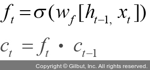
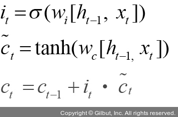
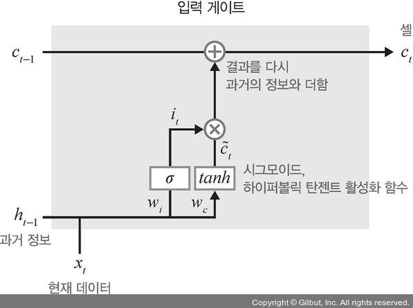

# Chapter 07: 시계열 분석
## 05. LSTM
- RNN은 결정적 단점이 있다.
- 앞서 언급했듯이 가중치가 업데이트되는 과정에서 기울기가 1보다 작은 값이 계속 곱해지기 때문에 기울기가 사라지는 기울기 소멸 문제가 발생한다.
- 이를 해결하기 위해 LSTM이나 GRU 같은 확장된 RNN 방식들을 사용하고 있다.

### 5-1. LSTM 구조
- LSTM 구조를 순전파와 역전파의 과정으로 살펴보자.

### 5-1-1. LSTM 순전파
- LSTM은 기울기 소멸 문제를 해결하기 위해 망각 게이트, 입력 게이트, 출력 게이트라는 새로운 요소를 은닉층의 각 뉴런에 추가했다.
- LSTM에서 사용되는 각 게이트를 자세히 알아보자.

#### 망각 게이트
- 망각 게이트(forget gate)는 과거 정보를 어느 정도 기억할지 결정한다.
- 과거 정보와 현재 데이터를 입력받아 시그모이드를 취한 후 그 값을 과거 정보에 곱한다.
- 따라서 시그모이드의 출력이 0이면 과거 정보는 버리고, 1이면 과거 정보는 온전히 보존한다.
- 0과 1 사이의 출력 값을 가지는 ht-1과 xt를 입력 값으로 받는다.
- 이때 xt는 새로운 입력 값이고 ht-1은 이전 은닉층에서 입력되는 값이다.
- 즉, ht-1과 xt를 이용하여 이전 상태 정보를 현재 메모리에 반영할지 결정하는 역할을 한다.
    - 계산한 값이 1이면 바로 직전의 정보를 메모리에 유지
    - 계산한 값이 0이면 초기화
- 망각 게이트에 대한 수식:

- 그림으로 표현:

#### 입력 게이트
- 입력 게이트(input gate)는 현재 정보를 기억하기 위해 만들어졌다.
- 과거 정보와 현재 데이터를 입력받아 시그모이드와 하이퍼볼릭 탄젠트 함수를 기반으로 현재 정보에 대한 보존량을 결정한다.
- 즉, 현재 메모리에 새로운 정보를 반영할지 결정하는 역할을 한다.
    - 계산한 값이 1이면 입력 xt가 들어올 수 있도록 허용(open)
    - 계산한 값이 0이면 차단
- 입력 게이트에 대한 수식:

- 그림으로 표현:

