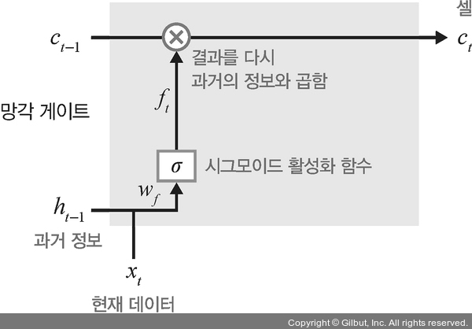
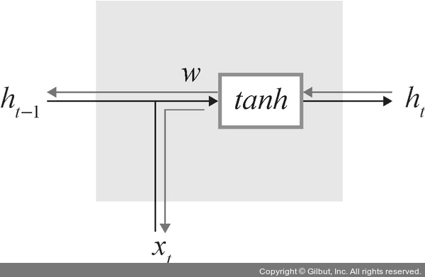

# Chapter 07: 시계열 분석
## 05. LSTM
- RNN은 결정적 단점이 있다.
- 앞서 언급했듯이 가중치가 업데이트되는 과정에서 기울기가 1보다 작은 값이 계속 곱해지기 때문에 기울기가 사라지는 기울기 소멸 문제가 발생한다.
- 이를 해결하기 위해 LSTM이나 GRU 같은 확장된 RNN 방식들을 사용하고 있다.

### 5-1. LSTM 구조
- LSTM 구조를 순전파와 역전파의 과정으로 살펴보자.

### 5-1-1. LSTM 순전파
- LSTM은 기울기 소멸 문제를 해결하기 위해 망각 게이트, 입력 게이트, 출력 게이트라는 새로운 요소를 은닉층의 각 뉴런에 추가했다.
- LSTM에서 사용되는 각 게이트를 자세히 알아보자.

#### 망각 게이트
- 망각 게이트(forget gate)는 과거 정보를 어느 정도 기억할지 결정한다.
- 과거 정보와 현재 데이터를 입력받아 시그모이드를 취한 후 그 값을 과거 정보에 곱한다.
- 따라서 시그모이드의 출력이 0이면 과거 정보는 버리고, 1이면 과거 정보는 온전히 보존한다.
- 0과 1 사이의 출력 값을 가지는 ht-1과 xt를 입력 값으로 받는다.
- 이때 xt는 새로운 입력 값이고 ht-1은 이전 은닉층에서 입력되는 값이다.
- 즉, ht-1과 xt를 이용하여 이전 상태 정보를 현재 메모리에 반영할지 결정하는 역할을 한다.
    - 계산한 값이 1이면 바로 직전의 정보를 메모리에 유지
    - 계산한 값이 0이면 초기화
- 망각 게이트에 대한 수식:


- 그림으로 표현:



#### 입력 게이트
- 입력 게이트(input gate)는 현재 정보를 기억하기 위해 만들어졌다.
- 과거 정보와 현재 데이터를 입력받아 시그모이드와 하이퍼볼릭 탄젠트 함수를 기반으로 현재 정보에 대한 보존량을 결정한다.
- 즉, 현재 메모리에 새로운 정보를 반영할지 결정하는 역할을 한다.
    - 계산한 값이 1이면 입력 xt가 들어올 수 있도록 허용(open)
    - 계산한 값이 0이면 차단
- 입력 게이트에 대한 수식:


- 그림으로 표현:


#### 셀
- 각 단계에 대한 은닉 노드(hidden node)를 메모리 셀이라고 한다.
- ‘총합(sum)’을 사용하여 셀 값을 반영하며, 이것으로 기울기 소멸 문제가 해결된다.
- 셀을 업데이트하는 방법:
    - 망각 게이트와 입력 게이트의 이전 단계 셀 정보를 계산하여 현재 단계의 셀 상태(cell state)를 업데이트한다.
- 셀에 대한 수식:


- 그림으로 표현:


#### 출력 게이트
- 출력 게이트(output gate)는 과거 정보와 현재 데이터를 사용하여 뉴런의 출력을 결정한다.
- 이전 은닉 상태(hidden state)와 t번째 입력을 고려해서 다음 은닉 상태를 계산한다.
- 그리고 LSTM에서는 이 은닉 상태가 그 시점에서의 출력이 된다.
- 출력 게이트는 갱신된 메모리의 출력 값을 제어하는 역할을 한다.
    - 계산한 값이 1이면 의미 있는 결과로 최종 출력
    - 계산한 값이 0이면 해당 연산 출력을 하지 않음
- 출력 게이트에 대한 수식:


- 그림으로 표현:


---
- 망각 게이트, 입력 게이트, 출력 게이트에 대한 그림:


### 5-1-2. LSTM 역전파
- LSTM은 셀을 통해서 역전파를 수행하기 때문에 ‘중단 없는 기울기(uninterrupted gradient f low)’라고도 한다.
- 즉, 다음 그림과 같이 최종 오차는 모든 노드에 전파되는데, 이때 셀을 통해서 중단 없이 전파된다.


- 역전파를 수행하기 위한 공식:


- 이때 주의해야 할 것은 셀 단위로 오차가 전파된다고 해서 입력 방향으로 오차가 전파되지 않는 것은 아나다.
- 다음 그림과 같이 셀 내부적으로는 오차가 입력(xt)으로 전파된다는 것도 잊지 말아야 한다.



### 5-2. LSTM 셀 구현
- 지금까지 RNN을 살펴보았다면 이제 LSTM 셀과 LSTM 계층을 살펴본다.
- 이번 예제에서 사용할 데이터셋은 MNIST이다.

> #### MNIST
> - MNIST는 인공지능 연구의 권위자 얀 르쿤(Yann LeCun) 교수가 만든 데이터셋으로 훈련 데이터셋 6만 개와 검증 데이터셋 1만 개로 구성되어 있다.
> - MNIST는 손으로 쓴 숫자 이미지(0에서 9까지 값을 갖는 고정 크기 이미지(28×28 픽셀))들로 구성되어 있다.

- 필요한 라이브러리를 호출한다.
```py
# 7-29. 라이브러리 호출

import torch
import torch.nn as nn
import torchvision.transforms as transforms
import torchvision.datasets as dataset
from torch.autograd import Variable
# 파라미터 목록을 갖고 있는 라이브러리(패키지)
from torch.nn import Parameter
from torch import Tensor
import torch.nn.functional as F
from torch.utils.data import DataLoader
# 수학과 관련되어 다양한 함수들과 상수들이 정의되어 있는 라이브러리
import math

device = torch.device('cuda:0' if torch.cuda.is_available() else 'cpu')
# GPU 사용에 필요
cuda = True if torch.cuda.is_available() else False

# GPU 사용에 필요
Tensor = torch.cuda.FloatTensor if cuda else torch.FloatTensor

torch.manual_seed(125)
if torch.cuda.is_available():
    torch.cuda.manual_seed_all(125)
```
- 데이터에 대한 전처리를 한다.
- 평균과 표준편차에 맞게 데이터를 정규화하기 위한 코드이다.
```py
# 7-30. 데이터 전처리

import torchvision.transforms as transforms

mnist_transform = transforms.Compose([
    transforms.ToTensor(),
    # 평균을 0.5, 표준편차를 1.0으로 데이터 정규화(데이터 분포를 조정)
    transforms.Normalize((0.5,), (1.0,))
])
```
- torchvision.datasets에서 제공하는 데이터셋 중 MNIST 데이터셋을 내려받는다.
```py
# 7-31 데이터셋 내려받기

from torchvision.datasets import MNIST

# MNIST를 내려받을 경로
download_root = '/Users/ramy/PycharmProjects/Pytorch/080289/chap07/MNIST_DATASET'

# (1)
train_dataset = MNIST(download_root, transform=mnist_transform, train=True, download=True)
valid_dataset = MNIST(download_root, transform=mnist_transform, train=False, download=True)
test_dataset = MNIST(download_root, transform=mnist_transform, train=False, download=True)
```

#### (1)


- MNIST 데이터셋을 내려받기 위해 필요한 파라미터:
    - 첫 번째 파라미터: MNIST를 내려받을 위치 지정
    - transform: 앞에서 정의했던 데이터 전처리 적용
    - train: True로 설정할 경우 훈련용 데이터셋을 가져오지만, False로 설정할 경우 테스트용 데이터셋을 가져온다.
    - download: True로 설정될 경우 내려받으려는 위치에 MNIST 파일이 없으면 내려받지만 파일이 있다면 내려받지 않는다.

---
- MNIST를 내려받은 결과:
```
100%|██████████| 9.91M/9.91M [00:09<00:00, 1.09MB/s]
100%|██████████| 28.9k/28.9k [00:00<00:00, 138kB/s]
100%|██████████| 1.65M/1.65M [00:01<00:00, 1.09MB/s]
100%|██████████| 4.54k/4.54k [00:00<00:00, 1.47MB/s]

```
- 데이터로더를 이용하여 내려받은 MNIST 파일을 메모리로 불러온다.
- 단, train_loader, valid_loader, test_loader가 호출될 때 메모리로 불러온다는 점에 주의하자.
```py
# 7-32. 데이터셋을 메모리로 가져오기

batch_size = 64
train_loader = DataLoader(dataset=train_dataset,
                          batch_size=batch_size,
                          shuffle=True)
valid_loader = DataLoader(dataset=test_dataset,
                          batch_size=batch_size,
                          shuffle=True)
test_loader = DataLoader(dataset=test_dataset,
                         batch_size=batch_size,
                         shuffle=True)
```
- 배치 크기 및 에포크 등 변수에 대한 값을 지정한다.
```py
# 7-33. 변수 값 지정

batch_size = 100
n_iters = 6000
num_epochs = n_iters / (len(train_dataset) / batch_size)
num_epochs = int(num_epochs)
```
- LSTM 셀에 대한 네트워크를 구축한다.
- 모델의 전반적인 네트워크가 아닌 LSTM 셀에 집중한 네트워크이다.
```py
# 7-34. LSTM 셀 네트워크 구축

class LSTMCell(nn.Module):
    def __init__(self, input_size, hidden_size, bias=True):
        super(LSTMCell, self).__init__()
        self.input_size = input_size
        self.hidden_size = hidden_size
        self.bias = bias
        # (1)
        self.x2h = nn.Linear(input_size, 4 * hidden_size, bias=bias)
        # (1)'
        self.h2h = nn.Linear(hidden_size, 4 * hidden_size, bias=bias)
        self.reset_parameters()

    # 모델의 파라미터 초기화
    def reset_parameters(self):
        std = 1.0 / math.sqrt(self.hidden_size)
        for w in self.parameters():
            # (2)
            w.data.uniform_(-std, std)

    def forward(self, x, hidden):
        hx, cx = hidden
        x = x.view(-1, x.size(1))

        # (1)"
        gates = self.x2h(x) + self.h2h(hx)
        # (3)
        gates = gates.squeeze()
        # (1)"'
        ingate, forgetgate, cellgate, outgate = gates.chunk(4, 1)

        # 입력 게이트에 시그모이드 활성화 함수 적용
        ingate = F.sigmoid(ingate)
        # 망각 게이트에 시그모이드 활성화 함수 적용
        forgetgate = F.sigmoid(forgetgate)
        # 셀 게이트에 탄젠트 활성화 함수 적용
        cellgate = F.tanh(cellgate)
        # 출력 게이트에 시그모이드 활성화 함수 적용
        outgate = F.sigmoid(outgate)

        # (4)
        cy = torch.mul(cx, forgetgate) + torch.mul(ingate, cellgate)
        # (4)'
        hy = torch.mul(outgate, F.tanh(cy))
        return(hy, cy)
```

#### (1), (1)'
- self.x2h = nn.Linear(input_size, 4 * hidden_size, bias=bias)와 self.h2h = nn.Linear(hidden_size, 4 * hidden_size, bias=bias)에서 4 * hidden_size가 사용되고 있는 이유에 대해 생각해 볼 필요가 있다.
- 왜 은닉층의 뉴런/유닛에 4를 곱할까.
- 그 답을 알기 위해서는 다음 그림을 먼저 이해해야 한다.


- 그림과 같이 LSTM에서 중요한 것은 게이트이다.
- 게이트는 망각, 입력, 셀, 출력으로 구성되며 이 모든 게이트는 (1)"처럼 구할 수 있다.
- (1)"를 풀어서 작성하면 다음과 같다.


- ⓐ 입력층으로 입력되는 훈련 데이터셋의 특성(feature) 수(칼럼 개수)
- ⓑ 입력층과 은닉층 사이의 가중치
- ⓒ 입력층과 은닉층 사이의 바이어스
- ⓓ 은닉층의 뉴런/유닛 개수(은닉층의 특성(feature) 수)
- ⓔ 은닉층과 은닉층 사이의 가중치
- ⓕ 은닉층과 은닉층 사이의 바이어스
- 이렇게 계산된 게이트(gates)는 (1)"'처럼 gates.chunk(4, 1)에 의해 네 개로 쪼개져서 각각 망각, 입력, 셀, 출력 게이트를 의미하는 변수에 저장된다.
- 즉, gates가 네 개로 쪼개지는 상황이기 때문에 4가 곱해졌던 것이다.
- 일반적으로 바이어스도 4를 곱해 주지만 예제에서는 은닉층의 뉴런/유닛 개수만 4를 곱해 주었다.
- 또한, 여기에서 사용되는 torch.chunk() 사용 방법은 다음과 같다.
- torch.chunk는 텐서를 쪼갤 때 사용하는 함수이다.


- 사용된 파라미터:
    - 첫 번째 파라미터: 텐서를 몇 개로 쪼갤지 설정한다.
    - 두 번째 파라미터: 어떤 차원을 기준으로 쪼갤지를 결정한다. dim=1이므로 열 단위로 텐서를 분할하겠다는 의미이다.

#### (2)
-  uniform()은 난수를 위해 사용한다.
- 난수 사용은 uniform() 외에도 randint(), random() 등이 있는데, 사용 방법은 다음과 같다.
```py
from random import *

# 1부터 10 사이의 임의의 정수
ri = randint(1, 10)
print(ri)

# 0부터 1 사이의 임의의 실수(float)
rd = random()
print(rd)

# 1부터 10 사이의 임의의 실수(float)
ui = uniform(1, 10)
print(ui)

# 1부터 10 사이를 2씩 건너뛴 임의의 정수(예 1, 3, 5, 7, 9)
rr = randrange(1, 10, 2)
print(rr)
```
- 다음은 난수 생성에 대한 실행 결과이다.
```
7
0.5517938632336726
5.378512915003691
1
```

#### (3)
- torch.squeeze()는 텐서의 차원을 줄이고자 할 때 사용한다.
- 사용 방법은 다음과 같다.
```py
import torch
# (2×1) 크기의 2차원 텐서 생성
x = torch.FloatTensor([[1], [2]])
print(x)
print(x.shape)
print('--squeeze 적용--')
# squeeze( )가 적용되어 1차원으로 축소
print(x.squeeze())
print(x.squeeze().shape)
```
- 다음은 squeeze()를 적용한 결과이다.
```
tensor([[1.],
        [2.]])
torch.Size([2, 1])
--squeeze 적용--
tensor([1., 2.])
torch.Size([2])
```
- squeeze()를 적용한 결과 (2×1) 텐서가 (2,) 크기를 갖는 1차원 벡터로 변경되었다.

#### (4), (4)'
- 하나의 LSTM 셀을 통과하면 셀(ct) 상태와 은닉 상태(ht)가 출력으로 주어진다.
- 이때 셀 상태는 입력, 망각, 셀 게이트에 의해 계산되며, 은닉 상태는 출력 게이트에 의해 계산된다.
- 여기에서 사용되는 torch.mul()은 텐서에 곱셈을 할 때 사용한다.
- 사용 방법은 다음과 같다.
```py
import torch
# 임의의 텐서 생성
x = torch.FloatTensor([[1], [2]])
print(x)
print('--mul 적용--')
# x라는 텐서의 원소에 3을 곱합니다.
torch.mul(x, 3)
```
- 다음은 torch.mul()이 적용된 결과이다.
```
tensor([[1.],
        [2.]])
--mul 적용--
tensor([[3.],
        [6.]])
```

---
- 앞에서 게이트 위주의 셀에 대해 살펴보았다면 이번에는 전반적인 네트워크를 구성해 본다.
```py
# 7-35. LSTM 셀의 전반적인 네트워크

class LSTMModel(nn.Module):
    def __init__(self, input_dim, hidden_dim, layer_dim, output_dim, bias=True):
        super(LSTMModel, self).__init__()
        # 은닉층의 뉴런/유닛 개수
        self.hidden_dim = hidden_dim

        self.layer_dim = layer_dim
        # (1)
        self.lstm = LSTMCell(input_dim, hidden_dim, layer_dim)
        self.fc = nn.Linear(hidden_dim, output_dim)

    def forward(self, x):
        # GPU 사용 유무 확인
        if torch.cuda.is_available():
            # (은닉층의 계층 개수, 배치 크기, 은닉층의 뉴런 개수) 형태를 갖는 은닉 상태를 0으로 초기화
            h0 = Variable(torch.zeros(self.layer_dim, x.size(0), self.hidden_dim).cuda())
        else:
            h0 = Variable(torch.zeros(self.layer_dim, x.size(0), self.hidden_dim))

        # GPU 사용 유무 확인
        if torch.cuda.is_available():
            # (은닉층의 계층 개수, 배치 크기, 은닉층의 뉴런 개수) 형태를 갖는 셀 상태를 0으로 초기화
            c0 = Variable(torch.zeros(self.layer_dim, x.size(0), self.hidden_dim).cuda())
        else:
            c0 = Variable(torch.zeros(self.layer_dim, x.size(0), self.hidden_dim))

        outs = []
        # (은닉층의 계층 개수, 배치 크기, 은닉층의 뉴런 개수) 크기를 갖는 셀 상태에 대한 텐서
        cn = c0[0,:,:]
        # (은닉층의 계층 개수, 배치 크기, 은닉층의 뉴런 개수) 크기를 갖는 은닉 상태에 대한 텐서
        hn = h0[0,:,:]

        # LSTM 셀 계층을 반복하여 쌓아 올림
        for seq in range(x.size(1)):
            # 은닉 상태(hn)와 셀 상태를 LSTMCell에 적용한 결과를 또다시 hn, cn에 저장
            hn, cn = self.lstm(x[:,seq,:], (hn,cn))
            outs.append(hn)

        out = outs[-1].squeeze()
        out = self.fc(out)
        return out
```

#### (1)
- LSTM 셀은 앞에서 정의한 함수를 불러오는 부분이다.


- 사용된 파라미터:
    - input_dim: 입력에 대한 특성(feature) 수(칼럼 개수)
    - hidden_dim: 은닉층의 뉴런 개수
    - layer_dim: 은닉층의 계층 개수

---
- 옵티마이저와 손실함수를 지정한다.
```py
# 7-36. 옵티마이저와 손실 함수 지정

input_dim = 28
hidden_dim = 128
layer_dim = 1
output_dim = 10

model = LSTMModel(input_dim, hidden_dim, layer_dim, output_dim)
# GPU 사용 유무 확인
if torch.cuda.is_available():
    model.cuda()
criterion = nn.CrossEntropyLoss()
learning_rate = 0.1
optimizer = torch.optim.SGD(model.parameters(), lr=learning_rate)
```
- 훈련 데이터셋을 이용하여 모델을 학습시키고, 검증 데이터셋을 이용하여 모델 성능을 확인한다.
```py
# 7-37. 모델 학습 및 성능 확인

seq_dim = 28
loss_list = []
iter = 0
for epoch in range(num_epochs):
    # 훈련 데이터셋을 이용한 모델 학습
    for i, (images, labels) in enumerate(train_loader):
        # GPU 사용 유무 확인
        if torch.cuda.is_available():
            # (1)
            images = Variable(images.view(-1, seq_dim, input_dim).cuda())
            labels = Variable(labels.cuda())
        # GPU를 사용하지 않기 때문에 else 구문이 실행
        else:
            images = Variable(images.view(-1, seq_dim, input_dim))
            labels = Variable(labels)

        optimizer.zero_grad()
        outputs = model(images)
        # 손실 함수를 이용하여 오차 계산
        loss = criterion(outputs, labels)

        if torch.cuda.is_available():
            loss.cuda()

        loss.backward()
        # 파라미터 업데이트
        optimizer.step()
        loss_list.append(loss.item())
        iter += 1

        # 정확도(accuracy) 계산
        if iter % 500 == 0:
            correct = 0
            total = 0
            # 검증 데이터셋을 이용한 모델 성능 검증
            for images, labels in valid_loader:

                if torch.cuda.is_available():
                    images = Variable(images.view(-1, seq_dim, input_dim).cuda())
                else:
                    images = Variable(images.view(-1, seq_dim, input_dim))

                outputs = model(images)
                # 모델을 통과한 결과의 최댓값으로부터 예측 결과 가져오기
                _, predicted = torch.max(outputs.data, 1)

                # 총 레이블 수
                total += labels.size(0)
                if torch.cuda.is_available():
                    correct += (predicted.cpu() == labels.cpu()).sum()
                else:
                    correct += (predicted == labels).sum()

            accuracy = 100 * correct / total
            print('Iteration: {}. Loss: {}. Accuracy: {}'.format(iter, loss.item(), accuracy))
```

#### (1)
- 현재 버전에서는 모든 텐서가 자동으로 Variable의 성질을 갖기 때문에 torch.autograd.Variable을 사용할 필요가 없지만 학습/연습 및 이전 버전에서 구현된 파이토치 코드를 이해하기 위해 사용한다.

---
- 모델의 학습 결과:
```
Iteration: 500. Loss: 2.237457513809204. Accuracy: 21.420000076293945
Iteration: 1000. Loss: 1.0162721872329712. Accuracy: 73.87999725341797
Iteration: 1500. Loss: 0.4256852865219116. Accuracy: 89.63999938964844
Iteration: 2000. Loss: 0.28754276037216187. Accuracy: 93.33999633789062
Iteration: 2500. Loss: 0.062279555946588516. Accuracy: 95.37999725341797
Iteration: 3000. Loss: 0.09727098792791367. Accuracy: 95.73999786376953
Iteration: 3500. Loss: 0.07890735566616058. Accuracy: 96.69999694824219
Iteration: 4000. Loss: 0.01977785862982273. Accuracy: 97.02999877929688
Iteration: 4500. Loss: 0.037251248955726624. Accuracy: 96.55999755859375
Iteration: 5000. Loss: 0.0724782943725586. Accuracy: 97.02999877929688
Iteration: 5500. Loss: 0.12784495949745178. Accuracy: 97.05999755859375
Iteration: 6000. Loss: 0.01750139147043228. Accuracy: 97.77999877929688
Iteration: 6500. Loss: 0.037485670298337936. Accuracy: 97.31999969482422
Iteration: 7000. Loss: 0.010999397374689579. Accuracy: 97.73999786376953
Iteration: 7500. Loss: 0.05484127998352051. Accuracy: 97.83000183105469
Iteration: 8000. Loss: 0.08484048396348953. Accuracy: 97.93000030517578
Iteration: 8500. Loss: 0.017380280420184135. Accuracy: 98.19000244140625
Iteration: 9000. Loss: 0.030375448986887932. Accuracy: 97.83999633789062
```
- 정확도가 97% 정도로 상당히 높다.
- 테스트 데이터셋을 이용해 모델 예측 성능을 본다.
```py
# 7-38. 테스트 데이터셋을 이용한 모델 예측 성능 확인

def evaluate(model, val_iter):
    corrects, total, total_loss = 0, 0, 0
    model.eval()
    for images, labels in val_iter:
        # GPU 사용 유무 확인
        if torch.cuda.is_available():
            images = Variable(images.view(-1, seq_dim, input_dim).cuda())
        else:
            images = Variable(images.view(-1, seq_dim, input_dim)).to(device)

        logit = model(images).to(device)
        # reduction=‘sum’을 지정했기 때문에 모든 오차를 더함
        loss = F.cross_entropy(logit, labels, reduction="sum")
        # logit.data 텐서에서 최댓값의 인덱스(index)를 반환
        _, predicted = torch.max(logit.data, 1)
        total += labels.size(0)
        total_loss += loss.item()
        corrects += (predicted == labels).sum()

    avg_loss = total_loss / len(val_iter.dataset)
    avg_accuracy = corrects / total
    return avg_loss, avg_accuracy
```
- 모델 학습 및 모델 예측 관련한 코드는 비슷한 패턴으로 진행된다.
- 따라서 모델의 네트워크 및 네트워크에서 사용되는 파라미터에 집중하여 학습하면 좋다.
- 마지막으로 테스트 데이터셋을 이용한 모델 예측 성능을 확인해 본다.
```py
# 7-39. 모델 예측 성능 확인

test_loss, test_acc = evaluate(model, test_loader)
print("Test Loss: %5.2f | Test Accuracy: %5.2f" % (test_loss, test_acc))
```
- 모델 예측에 대한 결과:
```
Test Loss:  0.07 | Test Accuracy:  0.98
```
- IMDB에서 MNIST로 데이터셋이 바뀌기는 했지만 98%로 성능이 매우 좋다.
- IMDB는 사전에 전처리가 되지 않은 데이터셋이고, MNIST는 사전에 전처리가 된 상태의 데이터셋이기 때문에 정확도 측면에서 차이가 날 수 있다.
- 이와 같이 사전에 전처리가 되지 않은 데이터셋의 경우 정확도를 높이기 위해 은닉층의 개수(혹은 뉴런의 개수) 및 하이퍼파라미터 수정 등이 필요하다.

### 5-3. LSTM 계층 구현
- LSTM 계층에 대한 예제 데이터셋은 스타벅스 주가 데이터셋을 사용한다.
- 또한, 예제를 통해 확인하고자 하는 것은 모델이 얼마나 주가 예측을 잘 하는지에 대해 알아보는 것이다.
- 먼저 필요한 라이브러리를 호출한다.
```py
# 7-40. 라이브러리 호출

import os
import time

import numpy as np
import pandas as pd
import matplotlib.pyplot as plt

import torch
import torch.nn as nn
from torch.utils.data import TensorDataset, DataLoader
from torch.autograd import Variable
from tqdm import tqdm_notebook
from sklearn.preprocessing import StandardScaler, MinMaxScaler
from sklearn.model_selection import train_test_split

device = torch.device('cuda:0' if torch.cuda.is_available() else 'cpu')
```
- 이번 예제에서 사용할 데이터셋은 스타벅스 주가이다.
- 데이터셋은 https://finance.yahoo.com/quote/sbux/history/를 이용한다.
```py
# 7-41. 데이터셋 가져오기

data = pd.read_csv('/Users/ramy/PycharmProjects/Pytorch/080289/chap07/data/SBUX.csv')
print(data.dtypes)
```
- 다음은 스타벅스 주가 데이터셋의 각 칼럼과 데이터 타입을 보여 준다.
```
Date          object
Open         float64
High         float64
Low          float64
Close        float64
Adj Close    float64
Volume         int64
dtype: object
```
- 데이터셋에 포함된 ‘Date’ 칼럼을 인덱스로 사용하도록 한다.
- 이번 예제에서 사용할 데이터들은 숫자이기 때문에 임베딩이 필요하지 않지만 단어들로 구성된 데이터셋은 임베딩 과정을 거쳐야 한다.
- 이때 날짜 칼럼은 임베딩 처리가 어려운 경우가 많은데, 날짜 칼럼을 인덱스로 처리하면 편리하다.
```py
# 7-42. 날짜 칼럼을 인덱스로 사용

data['Date'] = pd.to_datetime(data['Date'])
# ‘date’ 칼럼을 인덱스로 사용
data.set_index('Date', inplace=True)
```
- ‘Volume’ 칼럼은 정수(int)라는 데이터 형식을 갖는데, 이것을 실수(float)로 변경한다.
- 여기도 마찬가지로 데이터 형식을 실수(float)로 맞추고 시작하면 추후 데이터를 텐서로 변환할 때 편리히다.
```py
# 7-43. 데이터 형식 변경

# 데이터 형식을 변경할 때는 astype()을 사용
data['Volume'] = data['Volume'].astype(float)
```
- 데이터에 대한 전처리가 완료되었다면 데이터셋을 훈련과 정답(레이블)으로 분리하고 그 결과를 출력한다.
```py
# 7-44. 훈련과 레이블 분리

# 마지막 칼럼을 제외한 모든 칼럼을 x로 사용
X = data.iloc[:, :-1]
# 마지막 ‘Volume’을 레이블로 사용
y = data.iloc[:, 5:6]
print(X)
print(y)
```
- 훈련(x)과 레이블(y) 데이터셋에 대한 출력 결과:
```
                  Open        High         Low       Close   Adj Close
Date                                                                  
2019-12-11   86.260002   86.870003   85.849998   86.589996   84.145752
2019-12-12   88.000000   88.889999   87.540001   88.209999   85.720032
2019-12-13   88.019997   88.790001   87.580002   88.669998   86.167046
2019-12-16   89.139999   89.300003   88.430000   88.779999   86.273941
2019-12-17   88.870003   88.970001   87.470001   88.129997   85.642288
...                ...         ...         ...         ...         ...
2020-12-04  101.349998  102.940002  101.070000  102.279999  101.442787
2020-12-07  102.010002  102.220001  100.690002  101.410004  100.579918
2020-12-08  100.370003  101.570000  100.010002  101.209999  100.381554
2020-12-09  101.940002  102.209999  100.099998  100.400002   99.578186
2020-12-10  103.510002  106.089996  102.750000  105.389999  104.527336

[253 rows x 5 columns]
                Volume
Date                  
2019-12-11   4921900.0
2019-12-12  10282100.0
2019-12-13   6714100.0
2019-12-16   6705600.0
2019-12-17   7296900.0
...                ...
2020-12-04   6952700.0
2020-12-07   4514800.0
2020-12-08   3911300.0
2020-12-09   6629900.0
2020-12-10  12939200.0

[253 rows x 1 columns]
```
- 데이터셋에서 데이터 간의 분포가 다르게 나타나고 있다.
- 분포를 고르게 맞추기 위한 과정이 필요한데 MinMaxScaler()와 StandardScaler()를 사용하여 분산을 조정한다.
```py
# 7-45. 데이터 분포 조정

# 데이터의 모든 값이 0~1 사이에 존재하도록 분산 조정
ms = MinMaxScaler()
# 데이터가 평균 0, 분산 1이 되도록 분산 조정
ss = StandardScaler()

X_ss = ss.fit_transform(X)
y_ms = ms.fit_transform(y)

# 훈련 데이터셋
X_train = X_ss[:200, :]
# 테스트 데이터셋
X_test = X_ss[200:, :]

y_train = y_ms[:200, :]
y_test = y_ms[200:, :]

print("Training Shape", X_train.shape, y_train.shape)
print("Testing Shape", X_test.shape, y_test.shape)
```
- 코드를 실행하면 훈련과 테스트 데이터셋에 대한 형태를 보여 준다.
```
Training Shape (200, 5) (200, 1)
Testing Shape (53, 5) (53, 1)
```
- 훈련 데이터셋(X_train)은 200개의 데이터와 다섯 개의 칼럼으로 구성되어 있으며, 테스트 데이터셋(y_test)은 53개의 데이터와 한 개의 칼럼으로 구성되어 있는 것을 확인할 수 있다.
- 모든 데이터셋은 그 자체로 네트워크에 보낼 수 없다.
- 네트워크에서 정의된 형태 및 크기에 따라 데이터셋 크기를 조정한 후 네트워크로 보내야 한다.
```py
# 7-46. 데이터셋의 형태 및 크기 조정

# Variable로 감싸진 텐서는 .backward( )가 호출될 때 자동으로 기울기가 계산
X_train_tensors = Variable(torch.Tensor(X_train))
X_test_tensors = Variable(torch.Tensor(X_test))

y_train_tensors = Variable(torch.Tensor(y_train))
y_test_tensors = Variable(torch.Tensor(y_test))

# (1)
X_train_tensors_f = torch.reshape(X_train_tensors, (X_train_tensors.shape[0], 1, X_train_tensors.shape[1]))
X_test_tensors_f = torch.reshape(X_test_tensors, (X_test_tensors.shape[0], 1, X_test_tensors.shape[1]))

print("Training Shape", X_train_tensors_f.shape, y_train_tensors.shape)
print("Testing Shape", X_test_tensors_f.shape, y_test_tensors.shape)
```

#### (1)
- torch.reshape은 텐서의 형태를 바꿀 때 사용하며, 훈련 데이터셋(X_train_tensors)의 형태(200, 5)를 (200, 1, 5)로 변경하겠다는 의미이다.

---
- 훈련, 테스트 데이터셋의 형태가 변경된 결과:
```
Training Shape torch.Size([200, 1, 5]) torch.Size([200, 1])
Testing Shape torch.Size([53, 1, 5]) torch.Size([53, 1])
```
- 이와 같이 데이터셋의 형태를 변경하는 이유는 LSTM 네트워크의 입력 형태와 맞추기 위함이다.
- 이제 LSTM 모델의 네트워크를 구성한다.
```py
# 7-47. LSTM 네트워크

class LSTM(nn.Module):
    def __init__(self, num_classes, input_size, hidden_size, num_layers, seq_length):
        super(LSTM, self).__init__()
        # 클래스 개수
        self.num_classes = num_classes
        # LSTM 계층의 개수
        self.num_layers = num_layers
        # 입력 크기로 훈련 데이터셋의 칼럼 개수를 의미
        self.input_size = input_size
        # 은닉층의 뉴런 개수
        self.hidden_size = hidden_size
        # 시퀀스 길이
        self.seq_length = seq_length
    
        # LSTM 계층
        self.lstm = nn.LSTM(input_size=input_size, hidden_size=hidden_size, num_layers=num_layers, batch_first=True)
        # 완전연결층
        self.fc_1 = nn.Linear(hidden_size, 128)
        # 출력층
        self.fc = nn.Linear(128, num_classes)
        self.relu = nn.ReLU()

    def forward(self,x):
        # 은닉 상태를 0으로 초기화
        h_0 = Variable(torch.zeros(self.num_layers, x.size(0), self.hidden_size))
        # 셀 상태를 0으로 초기화
        c_0 = Variable(torch.zeros(self.num_layers, x.size(0), self.hidden_size))
        # LSTM 계층에 은닉 상태와 셀 상태 적용
        output, (hn, cn) = self.lstm(x, (h_0, c_0))
        # 완전연결층 적용을 위해 데이터의 형태 조정(1차원으로 조정)
        hn = hn.view(-1, self.hidden_size)
        out = self.relu(hn)
        out = self.fc_1(out)
        out = self.relu(out)
        out = self.fc(out)
        return out
```
- 모델 학습을 위해 필요한 변수 값들을 설정한다.
```py
# 7-48. 변수 값 설정

# 1000번의 에포크
num_epochs = 1000
# 학습률을 0.0001로 지정
learning_rate = 0.0001

# 입력 데이터셋의 칼럼(feature) 개수
input_size = 5
# 은닉층의 뉴런/유닛 개수
hidden_size = 2
# LSTM 계층의 개수
num_layers = 1

# 클래스 개수
num_classes = 1
# 앞에서 정의한 값들을 이용하여 LSTM 모델 학습
model = LSTM(num_classes, input_size, hidden_size, num_layers, X_train_tensors_f.shape[1])

criterion = torch.nn.MSELoss()
optimizer = torch.optim.Adam(model.parameters(), lr=learning_rate)
```
- 모델을 학습시킨다.
```py
# 7-49. 모델 학습

for epoch in range(num_epochs):
    # 전방향(forward) 학습
    outputs = model.forward(X_train_tensors_f)
    optimizer.zero_grad()
    # 손실 함수를 이용한 오차 계산(모델 학습 결과(outputs)와 레이블(y_train_tensors)의 차이 계산)
    loss = criterion(outputs, y_train_tensors)
    # 기울기 계산
    loss.backward()

    # 오차 업데이트
    optimizer.step()
    # 1000을 100으로 나누어 나머지가 0이면 출력
    if epoch % 100 == 0:
        print("Epoch: %d, loss: %1.5f" % (epoch, loss.item()))
```
- 모델 학습 결과:
```
Epoch: 0, loss: 0.06444
Epoch: 100, loss: 0.03876
Epoch: 200, loss: 0.03860
Epoch: 300, loss: 0.03839
Epoch: 400, loss: 0.03813
Epoch: 500, loss: 0.03781
Epoch: 600, loss: 0.03738
Epoch: 700, loss: 0.03682
Epoch: 800, loss: 0.03607
Epoch: 900, loss: 0.03511
```
- 오차 위주로 출력했기 때문에 실제로 얼마나 잘 예측했는지 알기 어렵다.
- 예측 결과를 시각적으로 표현해 본다.
- 먼저 레이블과 예측 결과를 출력하기 위한 전처리(데이터의 분포 및 형태 변경)를 진행한다.
```py
# 7-50. 모델 예측 결과를 출력하기 위한 데이터 크기 재구성

# 데이터 정규화(분포 조정)
df_x_ss = ss.transform(data.iloc[:, :-1])
# 데이터 정규화
df_y_ms = ms.transform(data.iloc[:, -1:])

df_x_ss = Variable(torch.Tensor(df_x_ss))
df_y_ms = Variable(torch.Tensor(df_y_ms))
df_x_ss = torch.reshape(df_x_ss, (df_x_ss.shape[0], 1, df_x_ss.shape[1]))
```
- 전처리가 진행된 데이터를 그래프로 출력한다.
```py
# 7-51. 모델 예측 결과 출력

# 훈련 데이터셋을 모델에 적용하여 모델 학습
train_predict = model(df_x_ss)
# 모델 학습 결과를 넘파이로 변경
predicted = train_predict.data.numpy()
label_y = df_y_ms.data.numpy()

# 모델 학습을 위해 전처리(정규화)했던 것을 해제(그래프의 본래 값을 출력하기 위한 목적)
predicted = ms.inverse_transform(predicted)
label_y = ms.inverse_transform(label_y)
# 그래프로 표시(plotting)
plt.figure(figsize=(10,6))
# (1)
plt.axvline(x=200, c='r', linestyle='--')

plt.plot(label_y, label='Actual Data')
plt.plot(predicted, label='Predicted Data')
plt.title('Time-Series Prediction')
plt.legend()
plt.show()
```

#### (1)
- axvline()은 그래프의 축을 따라 수직선을 표현할 때 사용한다.


- 사용된 파라미터:
    - 첫 번째 파라미터: 어떤 지점에 수직선을 표현할지 지정
    - c: 어떤 색상으로 수직선을 표현할지 지정
    - linestyle: 어떤 스타일로 수직선을 표현할지 지정. 참고로 수평선은 axhline()을 사용하며 다음 그림과 같이 표현할 때 사용


---
- 그림은 레이블과 모델의 예측 결과를 그래프로 표현한 것:


- 파란색은 실제 레이블에 대한 출력 결과이고 주황색은 모델이 예측한 결과를 보여 준다.
- 예측 결과가 만족스럽지 않다.
- 추후 GRU에 대해서도 동일한 데이터셋을 사용해 볼 텐데 결과를 비교해 본다.
- 이와 같이 결과가 만족스럽지 않다면 하이퍼파라미터에 대한 튜닝도 중요하지만 모델을 변경해 보는 것이 좋다.
