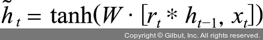

# Chapter 07: 시계열 분석
## 06. 게이트 순환 신경망 (GRU)
- GRU(Gated Recurrent Unit)는 게이트 메커니즘이 적용된 RNN 프레임워크의 한 종류이면서 LSTM보다 구조가 간단하다.

### 6-1. GRU 구조
- GRU는 LSTM에서 사용하는 망각 게이트와 입력 게이트를 하나로 합친 것이며, 별도의 업데이트 게이트로 구성되어 있다.
- 하나의 게이트 컨트롤러(gate controller)가 망각 게이트와 입력 게이트를 모두 제어한다.
- 게이트 컨트롤러가 1을 출력하면 망각 게이트는 열리고 입력 게이트는 닫히며, 반대로 0을 출력하면 망각 게이트는 닫히고 입력 게이트는 열린다.
- 즉, 이전 기억이 저장될 때마다 단계별 입력은 삭제된다.
- GRU는 출력 게이트가 없어 전체 상태 벡터가 매 단계마다 출력되며, 이전 상태의 어느 부분이 출력될지 제어하는 새로운 게이트 컨트롤러가 별도로 존재한다.

### 6-1-1. 망각 게이트
- 망각 게이트(reset gate)는 과거 정보를 적당히 초기화(reset)시키려는 목적으로 시그모이드 함수를 출력으로 이용하여 (0,1) 값을 이전 은닉층에 곱한다.
- 이전 시점의 은닉층 값에 현시점의 정보에 대한 가중치를 곱한 것이다.
- 망각 게이트에 대한 수식:


- 그림으로 표현:


### 6-1-2. 업데이트 게이트
- 업데이트 게이트(update gate)는 과거와 현재 정보의 최신화 비율을 결정하는 역할을 한다.
- 시그모이드로 출력된 결과(zt)는 현시점의 정보량을 결정하고 1에서 뺀 값(1-zt)을 직전 시점의 은닉층 정보와 곱한다.
- 업데이트 게이트에 대한 수식:


- 그림으로 표현:


### 6-1-3. 후보군
- 후보군(candidate)은 현시점의 정보에 대한 후보군을 계산한다.
- 과거 은닉층의 정보를 그대로 이용하지 않고 망각 게이트의 결과를 이용하여 후보군을 계산한다.



- *는 점 단위 연산(pointwise operation)이다.
- 예를 들어 벡터를 더할 때 각각의 차원(dimension)에 맞게 곱하거나 더하는 것이 가능해진다.

### 6-1-4. 은닉층 계산
- 마지막으로 업데이트 게이트 결과와 후보군 결과를 결합하여 현시점의 은닉층을 계산힌다.
- 시그모이드 함수의 결과는 현시점에서 결과에 대한 정보량을 결정하고, 1-시그모이드 함수의 결과는 과거의 정보량을 결정한다.
- 은닉층 계산 수식:


---
- GRU 전체에 대한 내부 구조:


### 6-2. GRU 셀 구현
- 이번에는 GRU 셀을 파이토치로 구현해 본다.
- 데이터셋 및 대부분의 코드는 LSTM 셀과 동일하다.
- 따라서 여기에서도 네트워크의 차이점 위주로 학습하면 좋다.
- 필요한 라이브러리를 호출한다.
```py
# 7-52. 라이브러리 호출

import torch
import torch.nn as nn
import torchvision.transforms as transforms
import torchvision.datasets as dataset
from torch.autograd import Variable
from torch.nn import Parameter
from torch import Tensor
import torch.nn.functional as F
from torch.utils.data import DataLoader
import math

device = torch.device('cuda:0' if torch.cuda.is_available() else 'cpu')

cuda = True if torch.cuda.is_available() else False

Tensor = torch.cuda.FloatTensor if cuda else torch.FloatTensor
torch.manual_seed(125)
if torch.cuda.is_available():
    torch.cuda.manual_seed_all(125)
```
- 데이터셋을 평균과 표준편차를 기준으로 정규화하고 텐서로 변경하는 전처리를 진행한다.
```py
# 코드 7-53. 데이터 전처리

mnist_transform = transforms.Compose([
    transforms.ToTensor(),
    transforms.Normalize((0.5,), (1.0,))
])
```
- GRU 셀에서도 MNIST 데이터셋을 사용한다.
- MNIST 데이터셋을 내려받은 후 전처리를 적용한다.
```py
# 7-54. 데이터셋 내러받기 및 전처리 적용

from torchvision.datasets import MNIST
download_root = '/Users/ramy/PycharmProjects/Pytorch/080289/chap07/MNIST_DATASET'

train_dataset = MNIST(download_root, transform=mnist_transform, train=True, download=True)
valid_dataset = MNIST(download_root, transform=mnist_transform, train=False, download=True)
test_dataset = MNIST(download_root, transform=mnist_transform, train=False, download=True)
```
- 데이터로더를 이용하여 전처리된 데이터셋을 메모리로 불러온다.
- 단 메모리로 불러오는 시점은 train_loader, valid_loader, test_loader가 호출되는 시점이다.
```py
# 7-55. 데이터셋 메모리로 가져오기

batch_size = 64
train_loader = DataLoader(dataset=train_dataset,
                          batch_size=batch_size,
                          shuffle=True)
# 일반적으로 검증과 테스트 용도의 데이터셋은 섞어서 사용하지 않음
valid_loader = DataLoader(dataset=test_dataset,
                          batch_size=batch_size,
                          shuffle=True)
test_loader = DataLoader(dataset=test_dataset,
                          batch_size=batch_size,
                          shuffle=True)
```
- 필요한 변수에 대한 값을 설정한다.
```py
# 7-56. 변수 값 설정

batch_size = 100
n_iters = 6000
num_epochs = n_iters / (len(train_dataset) / batch_size)
num_epochs = int(num_epochs)
```
- 이제 집중해서 살펴보아야 할 GRU 셀에 대한 네트워크이다.
- LSTM 셀과 크게 다르지 않지만 차이점 위주로 설명한다.
```py
# 7-57. GRU 셀 네트워크

class GRUCell(nn.Module):
    def __init__(self, input_size, hidden_size, bias=True):
        super(GRUCell, self).__init__()
        self.input_size = input_size
        self.hidden_size = hidden_size
        self.bias = bias
        # (1)
        self.x2h = nn.Linear(input_size, 3 * hidden_size, bias=bias)
        self.h2h = nn.Linear(hidden_size, 3 * hidden_size, bias=bias)
        self.reset_parameters()
    
    # 파라미터를 초기화
    def reset_parameters(self):
        std = 1.0 / math.sqrt(self.hidden_size)
        for w in self.parameters():
            w.data.uniform_(-std, std)

    def forward(self, x, hidden):
        x = x.view(-1, x.size(1))
        
        # LSTM 셀에서는 gates를 x2h+h2h로 정의했지만 GRU 셀에서는 개별적인 상태를 유지
        gate_x = self.x2h(x)
        gate_h = self.h2h(hidden)
        gate_x = gate_x.squeeze()
        gate_h = gate_h.squeeze()

        # 총 세 개의 게이트(망각, 입력, 새로운 게이트)를 위해 세 개로 쪼갬
        i_r, i_i, i_n = gate_x.chunk(3, 1)
        h_r, h_i, h_n = gate_h.chunk(3, 1)

        resetgate = F.sigmoid(i_r + h_r)
        inputgate = F.sigmoid(i_i + h_i)
        # ‘새로운 게이트’는 탄젠트 활성화 함수가 적용된 게이트
        newgate = F.tanh(i_n + (resetgate * h_n))

        hy = newgate + inputgate * (hidden - newgate)
        return hy
```

#### (1)
- LSTM 셀에서는 4를 곱했지만 GRU 셀에서는 세 개의 게이트가 사용되므로 3을 곱한다.
- 엄밀히 게이트는 두 개(망각, 입력 게이트)이지만 탄젠트 활성화 함수가 적용되는 부분을 ‘새로운 게이트(newgate)’로 정의하여 총 3을 곱한다.

---
- 개별적인 GRU 셀의 네트워크가 구성되었기 때문에 전반적인 네트워크에 대해 살펴본다.
```py
# 7-58. 전반적인 네트워크 구조

class GRUModel(nn.Module):
    def __init__(self, input_dim, hidden_dim, layer_dim, output_dim, bias=True):
        super(GRUModel, self).__init__()
        self.hidden_dim = hidden_dim
        self.layer_dim = layer_dim
        
        # 앞에서 정의한 GRUCell 함수를 호출
        self.gru_cell = GRUCell(input_dim, hidden_dim, layer_dim)
        self.fc = nn.Linear(hidden_dim, output_dim)

    def forward(self, x):
        if torch.cuda.is_available():
            h0 = Variable(torch.zeros(self.layer_dim, x.size(0), self.hidden_dim).cuda())
        else:
            h0 = Variable(torch.zeros(self.layer_dim, x.size(0), self.hidden_dim))

        outs = []
        # LSTM 셀에서는 셀 상태에 대해서도 정의했었지만 GRU 셀에서는 셀은 사용되지 않음
        hn = h0[0,:,:]

        for seq in range(x.size(1)):
            hn = self.gru_cell(x[:,seq,:], hn)
            outs.append(hn)
            out = outs[-1].squeeze()
            out = self.fc(out)
            return out
```
- 모델에 적용될 변수 값 및 옵티마이저와 손실 함수를 설정한다.
```py
# 7-59. 옵티마이저와 손실 함수 설정

input_dim = 28
hidden_dim = 128
layer_dim = 1
output_dim = 10

model = GRUModel(input_dim, hidden_dim, layer_dim, output_dim)

if torch.cuda.is_available():
    model.cuda()

criterion = nn.CrossEntropyLoss()
learning_rate = 0.1
optimizer = torch.optim.SGD(model.parameters(), lr=learning_rate)
```
- 훈련 데이터셋을 이용하여 모델을 학습시키고 검증 데이터셋을 이용하여 모델 성능을 측정한다.
```py
# 7-60. 모델 학습 및 성능 검증

seq_dim = 28
loss_list = []
iter = 0
for epoch in range(num_epochs):
    for i, (images, labels) in enumerate(train_loader):
        if torch.cuda.is_available():
            images = Variable(images.view(-1, seq_dim, input_dim).cuda())
            labels = Variable(labels.cuda())
        else:
            images = Variable(images.view(-1, seq_dim, input_dim))
            labels = Variable(labels)

        optimizer.zero_grad()
        outputs = model(images)
        loss = criterion(outputs, labels)
        if torch.cuda.is_available():
            loss.cuda()

        loss.backward()
        optimizer.step()

        loss_list.append(loss.item())
        iter += 1

        if iter % 500 == 0:
            correct = 0
            total = 0
            for images, labels in valid_loader:
                if torch.cuda.is_available():
                    images = Variable(images.view(-1, seq_dim, input_dim).cuda())
                else:
                    images = Variable(images.view(-1, seq_dim, input_dim))

                outputs = model(images)
                _, predicted = torch.max(outputs.data, 1)
                total += labels.size(0)

                if torch.cuda.is_available():
                    correct += (predicted.cpu() == labels.cpu()).sum()
                else:
                    correct += (predicted == labels).sum()

            accuracy = 100 * correct / total
            print('Iteration: {}. Loss: {}. Accuracy: {}'.format(iter, loss.item(), accuracy))
```
- 모델 학습 결과:
```
Iteration: 500. Loss: 1.5516517162322998. Accuracy: 48.20000076293945
Iteration: 1000. Loss: 0.630592405796051. Accuracy: 69.0
Iteration: 1500. Loss: 0.5419546961784363. Accuracy: 87.66999816894531
Iteration: 2000. Loss: 0.21588271856307983. Accuracy: 92.08999633789062
Iteration: 2500. Loss: 0.15529732406139374. Accuracy: 94.77999877929688
Iteration: 3000. Loss: 0.3174344003200531. Accuracy: 95.26000213623047
Iteration: 3500. Loss: 0.1984528750181198. Accuracy: 95.86000061035156
Iteration: 4000. Loss: 0.2198045551776886. Accuracy: 96.19000244140625
Iteration: 4500. Loss: 0.06266965717077255. Accuracy: 96.69000244140625
Iteration: 5000. Loss: 0.04512554779648781. Accuracy: 97.0199966430664
Iteration: 5500. Loss: 0.08186612278223038. Accuracy: 96.94999694824219
Iteration: 6000. Loss: 0.03478262573480606. Accuracy: 97.58999633789062
Iteration: 6500. Loss: 0.18984605371952057. Accuracy: 97.11000061035156
Iteration: 7000. Loss: 0.07542693614959717. Accuracy: 97.13999938964844
Iteration: 7500. Loss: 0.11737079918384552. Accuracy: 97.29000091552734
Iteration: 8000. Loss: 0.018241778016090393. Accuracy: 98.04000091552734
Iteration: 8500. Loss: 0.0428263396024704. Accuracy: 98.13999938964844
Iteration: 9000. Loss: 0.13825277984142303. Accuracy: 97.80000305175781
```
- LSTM 셀을 실행했을 때의 정확도와 유사하다.
- 즉, LSTM 셀을 사용하든, GRU 셀을 사용하든 정확도가 비슷하게 나왔다.
- 시계열 처리 관련한 모델(RNN, LSTM, GRU) 중 어떤 것이 더 좋다고 말할 수는 없다.
- 따라서 주어진 데이터셋을 다양한 모델에 적용하여 최적의 모델을 찾는 것이 중요하다.
- 테스트 데이터셋을 모델에 적용하여 예측에 대한 성능을 확인해 보자.
```py
# 7-61. 테스트 데이터셋을 이용한 모델 예측

def evaluate(model, val_iter):
    corrects, total, total_loss = 0, 0, 0
    model.eval()
    for images, labels in val_iter:
        if torch.cuda.is_available():
            images = Variable(images.view(-1, seq_dim, input_dim).cuda())
        else:
            images = Variable(images.view(-1, seq_dim, input_dim)).to(device)

        logit = model(images).to(device)
        loss = F.cross_entropy(logit, labels, reduction="sum")
        _, predicted = torch.max(logit.data, 1)
        total += labels.size(0)
        total_loss += loss.item()
        corrects += (predicted == labels).sum()

    avg_loss = total_loss / len(val_iter.dataset)
    avg_accuracy = corrects / total
    return avg_loss, avg_accuracy
```
- 모델의 예측력에 대한 성능 확인을 위해 테스트 데이터셋을 모델에 적용시킨다.
```py
# 7-62. 모델 예측 결과

test_loss, test_acc = evaluate(model,test_loader)
print("Test Loss: %5.2f | Test Accuracy: %5.2f" % (test_loss, test_acc))
```
- 테스트 데이터셋을 이용했을 때 모델의 예측:
```
Test Loss:  0.07 | Test Accuracy:  0.98
```
- 예측력(정확도)이 98%로 상당히 높게 나왔다.
- 역시 LSTM 셀을 사용했을 때와 성능이 비슷하다.
- MNIST 데이터셋에 대해서는 높은 성능을 보이지만 또 다른 데이터셋을 적용했을 때는 정확도가 낮게 나올 수도 있다.
- 따라서 주어진 데이터셋에 대해 다양한 모델을 적용해 보고 최적의 하이퍼파라미터를 찾는 것이 중요하다.

### 6-3. GRU 계층 구현
- GRU 계층에 대해 파이토치를 이용한 예제를 살펴본다.
- 이번 예제 또한 LSTM 계층에서 사용했던 데이터셋 및 코드와 유사하다.
- 따라서 모델의 네트워크 위주로 학습해 본다.
- 필요한 라이브러리를 호출한다.
```py
# 7-63. 라이브러리 호출

import os
import time

import numpy as np
import pandas as pd
import matplotlib.pyplot as plt

import torch
import torch.nn as nn
from torch.utils.data import TensorDataset, DataLoader
from torch.autograd import Variable
from tqdm import tqdm_notebook
from sklearn.preprocessing import StandardScaler, MinMaxScaler
from sklearn.model_selection import train_test_split

device = torch.device('cuda:0' if torch.cuda.is_available() else 'cpu')
```
- 스타벅스 주가 데이터셋을 불러와서 각 칼럼에 대한 데이터 형식을 살펴본다.
```py
# 7-64. 데이터셋 불러오기

data = pd.read_csv('/Users/ramy/PycharmProjects/Pytorch/080289/chap07/data/SBUX.csv')
print(data.dtypes)
```
- 데이터셋 각 칼럼의 형식:
```
Date          object
Open         float64
High         float64
Low          float64
Close        float64
Adj Close    float64
Volume         int64
dtype: object
```
- ‘Date’ 칼럼을 인덱스로 지정하고, ‘Volume’ 칼럼의 데이터 형식을 실수(float)로 변경한다.
- 대·소문자를 구분하기 때문에 ‘Date’를 ‘date’로 사용하면 오류가 발생한다.
```py
# 7-65. 인덱스 설정 및 데이터 타입 변경

data['Date'] = pd.to_datetime(data['Date'])
data.set_index('Date', inplace=True)
data['Volume'] = data['Volume'].astype(float)
```
- 전체 칼럼 중 마지막 칼럼을 제외한 모든 데이터셋을 x(훈련 용도)로 지정하고 마지막 칼럼을 레이블(y)로 지정한다.
```py
# 7-66. 훈련과 레이블 데이터셋 분리

X = data.iloc[:, :-1]
y = data.iloc[:, 5:6]
print(X)
print(y)
```
- 훈련(x)과 레이블(y)에 대한 데이터를 출력한 결과:
```
                  Open        High         Low       Close   Adj Close
Date                                                                  
2019-12-11   86.260002   86.870003   85.849998   86.589996   84.145752
2019-12-12   88.000000   88.889999   87.540001   88.209999   85.720032
2019-12-13   88.019997   88.790001   87.580002   88.669998   86.167046
2019-12-16   89.139999   89.300003   88.430000   88.779999   86.273941
2019-12-17   88.870003   88.970001   87.470001   88.129997   85.642288
...                ...         ...         ...         ...         ...
2020-12-04  101.349998  102.940002  101.070000  102.279999  101.442787
2020-12-07  102.010002  102.220001  100.690002  101.410004  100.579918
2020-12-08  100.370003  101.570000  100.010002  101.209999  100.381554
2020-12-09  101.940002  102.209999  100.099998  100.400002   99.578186
2020-12-10  103.510002  106.089996  102.750000  105.389999  104.527336

[253 rows x 5 columns]
                Volume
Date                  
2019-12-11   4921900.0
2019-12-12  10282100.0
2019-12-13   6714100.0
2019-12-16   6705600.0
2019-12-17   7296900.0
...                ...
2020-12-04   6952700.0
2020-12-07   4514800.0
2020-12-08   3911300.0
2020-12-09   6629900.0
2020-12-10  12939200.0

[253 rows x 1 columns]
```
- 앞에서 정의한 훈련과 레이블 데이터셋을 정규화하여 분포를 조정한다.
```py
# 7-67. 훈련과 테스트 데이터셋 정규화

ms = MinMaxScaler()
ss = StandardScaler()

X_ss = ss.fit_transform(X)
y_ms = ms.fit_transform(y)

X_train = X_ss[:200, :]
X_test = X_ss[200:, :]

y_train = y_ms[:200, :]
y_test = y_ms[200:, :]

print("Training Shape", X_train.shape, y_train.shape)
print("Testing Shape", X_test.shape, y_test.shape)
```
- 훈련과 테스트 데이터셋의 형태에 대한 출력 결과:
```
Training Shape (200, 5) (200, 1)
Testing Shape (53, 5) (53, 1)
```
- 데이터셋을 LSTM 네트워크에 적용하기 위해 형태를 변경한다.
```py
# 7-68. 데이터셋 형태 변경

X_train_tensors = Variable(torch.Tensor(X_train))
X_test_tensors = Variable(torch.Tensor(X_test))

y_train_tensors = Variable(torch.Tensor(y_train))
y_test_tensors = Variable(torch.Tensor(y_test))

X_train_tensors_f = torch.reshape(X_train_tensors, (X_train_tensors.shape[0], 1, X_train_tensors.shape[1]))
X_test_tensors_f = torch.reshape(X_test_tensors, (X_test_tensors.shape[0], 1, X_test_tensors.shape[1]))

print("Training Shape", X_train_tensors_f.shape, y_train_tensors.shape)
print("Testing Shape", X_test_tensors_f.shape, y_test_tensors.shape)
```
- 변경된 훈련과 테스트 데이터셋의 형태를 출력한 결과:
```
Training Shape torch.Size([200, 1, 5]) torch.Size([200, 1])
Testing Shape torch.Size([53, 1, 5]) torch.Size([53, 1])
```
- 이제 GRU 모델의 네트워크를 살펴볼 텐데, 역시 LSTM 계층과의 차이점 위주로 학습하는 것이 중요하다.
- 하지만 이미 GRU 셀 부분에서 네트워크 부분에 대해 살펴보았기 때문에 어렵지 않을 것이다.
```py
# 7-69. GRU 모델의 네트워크

class GRU(nn.Module):
    def __init__(self, num_classes, input_size, hidden_size, num_layers, seq_length):
        super(GRU, self).__init__()
        self.num_classes = num_classes
        self.num_layers = num_layers
        self.input_size = input_size
        self.hidden_size = hidden_size
        self.seq_length = seq_length

        self.gru = nn.GRU(input_size=input_size, hidden_size=hidden_size, num_layers=num_layers, batch_first=True)
        self.fc_1 = nn.Linear(hidden_size, 128)
        self.fc = nn.Linear(128, num_classes)
        self.relu = nn.ReLU()

    def forward(self, x):
        # 은닉 상태에 대해 0으로 초기화하는 부분으로, LSTM 계층은 셀 상태가 있었지만 GRU는 셀 상태를 정의하지 않음
        h_0 = Variable(torch.zeros(self.num_layers, x.size(0), self.hidden_size))
        output, (hn) = self.gru(x, (h_0))
        hn = hn.view(-1, self.hidden_size)
        out = self.relu(hn)
        out = self.fc_1(out)
        out = self.relu(out)
        out = self.fc(out)
        return out
```
- 모델을 훈련시키기 위해 변수 값 및 옵티마이저, 손실 함수도 지정한다.
```py
# 7-70. 옵티마이저와 손실 함수 지정

num_epochs = 1000
learning_rate = 0.0001

input_size = 4
hidden_size = 2
# GRU 계층의 개수
num_layers = 1

num_classes = 1
model = GRU(num_classes, input_size, hidden_size, num_layers, X_train_tensors_f.shape[1])

criterion = torch.nn.MSELoss()
optimizer = torch.optim.Adam(model.parameters(), lr=learning_rate)
```
- 준비된 데이터셋과 모델의 네트워크를 이용하여 모델을 학습시킨다.
```py
# 7-71. 모델 학습

for epoch in range(num_epochs):
    outputs = model.forward(X_train_tensors_f)
    optimizer.zero_grad()
    loss = criterion(outputs, y_train_tensors)
    loss.backward()

    optimizer.step()
    if epoch % 100 == 0:
        print("Epoch: %d, loss: %1.5f" % (epoch, loss.item()))
```
- 모델 학습 결과:
```
Epoch: 0, loss: 0.06033
Epoch: 100, loss: 0.04255
Epoch: 200, loss: 0.03610
Epoch: 300, loss: 0.03214
Epoch: 400, loss: 0.03000
Epoch: 500, loss: 0.02855
Epoch: 600, loss: 0.02729
Epoch: 700, loss: 0.02614
Epoch: 800, loss: 0.02511
Epoch: 900, loss: 0.02417
```
- 데이터를 그래프로 출력하기 위한 준비를 한다.
```py
# 7-72. 그래프 출력을 위한 전처리

df_x_ss = ss.transform(data.iloc[:, :-1])
df_y_ms = ms.transform(data.iloc[:, -1:])

df_x_ss = Variable(torch.Tensor(df_x_ss))
df_y_ms = Variable(torch.Tensor(df_y_ms))
df_x_ss = torch.reshape(df_x_ss, (df_x_ss.shape[0], 1, df_x_ss.shape[1]))
```
- 모델의 예측 결과와 레이블을 그래프로 출력한다.
```py
# 7-73. 모델 예측 결과 출력

train_predict = model(df_x_ss)
predicted = train_predict.data.numpy()
label_y = df_y_ms.data.numpy()

predicted = ms.inverse_transform(predicted)
label_y = ms.inverse_transform(label_y)
plt.figure(figsize=(10,6))
plt.axvline(x=200, c='r', linestyle='--')

plt.plot(label_y, label='Actual Data')
plt.plot(predicted, label='Predicted Data')
plt.title('Time-Series Prediction')
plt.legend()
plt.show()
```
- 그림은 모델의 예측 결과와 레이블을 비교하여 그래프로 출력한 것


- 그래프상으로는 GRU 계층을 사용했을 때가 LSTM 계층을 사용했을 때보다 예측력이 더 좋아 보안다.
- 하지만 수치상으로 모델의 예측 정확도는 유사했다.
- 또한, 훈련 데이터를 섞어서(shuffle) 가져오도록 했기 때문에 결과는 책과 다를 수 있다.
