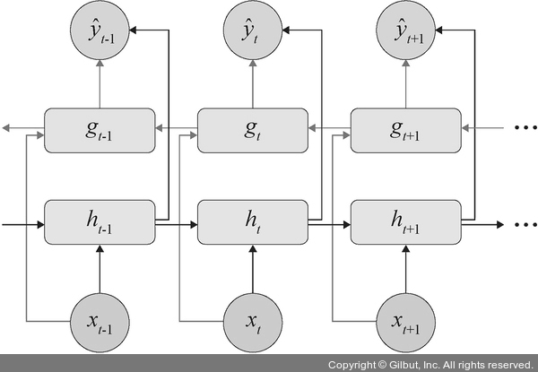
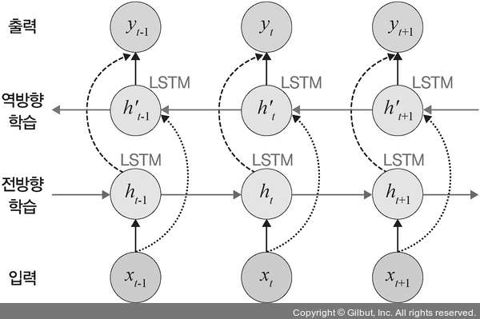
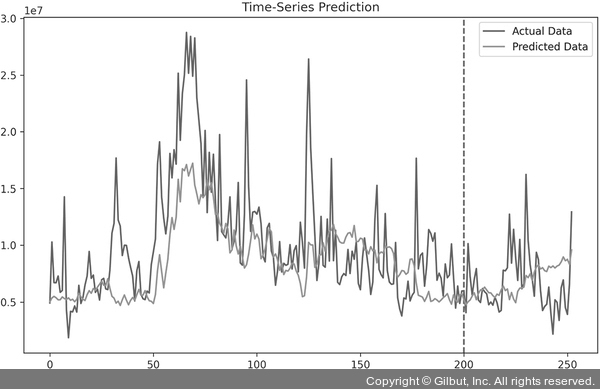

# Chapter 07: 시계열 분석
## 07. 양방향 RNN
- RNN은 이전 시점의 데이터들을 참고해서 정답을 예측하지만 실제 문제에서는 과거 시점이 아닌 미래 시점의 데이터에 힌트가 있는 경우도 많다.
- 따라서 이전 시점의 데이터뿐만 아니라, 이후 시점의 데이터도 함께 활용하여 출력 값을 예측하고자 하는 것이 양방향 RNN(bidirectional RNN)이다.

### 7-1. 양방향 RNN 구조
- 양방향 RNN은 하나의 출력 값을 예측하는 데 메모리 셀 두 개를 사용한다.
- 첫 번째 메모리 셀은 이전 시점의 은닉 상태(forward states)를 전달받아 현재의 은닉 상태를 계산한다.
- 다음 그림에서는 h 메모리 셀에 해당된다.
- 두 번째 메모리 셀은 다음 시점의 은닉 상태(backward states)를 전달받아 현재의 은닉 상태를 계산한다.
- 다음 그림의 g 메모리 셀에 해당된다.
- 그리고 이 값 두 개를 모두 출력층에서 출력 값을 예측하는 데 사용한다.



- 양방향 RNN에 대한 개념은 RNN뿐만 아니라 LSTM이나 GRU에도 적용된다.

### 7-2. 양방향 LSTM 구현
- 계속 스타벅스 주가 예측 데이터셋을 사용한 예제를 살펴본다.
- 예제 코드 역시 LSTM 계층에서 사용했던 코드와 동일하다.
- LSTM 계층과 양방향 LSTM이 어떻게 다른지 네트워크 위주로 살펴본다.
- 다음은 모델의 네트워크 이전까지의 모든 코드이다.
- LSTM 계층과 동일한 코드이므로 별도의 설명 없이 일괄 작성했으며 출력(print)에 대한 결과 부분도 생략했다.
- 하지만 주피터 노트북 예제 파일은 단계별로 실행할 수 있도록 나누어서 작성했다.
```py
# 7-74 모델을 생성하고 학습

import os
import time

import numpy as np
import pandas as pd
import matplotlib.pyplot as plt

import torch
import torch.nn as nn
from torch.utils.data import TensorDataset, DataLoader
from torch.autograd import Variable
from tqdm import tqdm_notebook
from sklearn.preprocessing import StandardScaler, MinMaxScaler
from sklearn.model_selection import train_test_split

device = torch.device('cuda:0' if torch.cuda.is_available() else 'cpu')

data = pd.read_csv('../chap07/data/SBUX.csv')
print(data.dtypes)

data['Date'] = pd.to_datetime(data['Date'])
data.set_index('Date', inplace=True)
data['Volume'] = data['Volume'].astype(float)

X = data.iloc[:, :-1]
y = data.iloc[:, 5:6]

ms = MinMaxScaler()
ss = StandardScaler()

X_ss = ss.fit_transform(X)
y_ms = ms.fit_transform(y)

X_train = X_ss[:200, :]
X_test = X_ss[200:, :]
y_train = y_ms[:200, :]
y_test = y_ms[200:, :]

X_train_tensors = Variable(torch.Tensor(X_train))
X_test_tensors = Variable(torch.Tensor(X_test))

y_train_tensors = Variable(torch.Tensor(y_train))
y_test_tensors = Variable(torch.Tensor(y_test))

X_train_tensors_f = torch.reshape(X_train_tensors, (X_train_tensors.shape[0], 1, X_train_tensors.shape[1]))
X_test_tensors_f = torch.reshape(X_test_tensors, (X_test_tensors.shape[0], 1, X_test_tensors.shape[1]))

print("Training Shape", X_train_tensors_f.shape, y_train_tensors.shape)
print("Testing Shape", X_test_tensors_f.shape, y_test_tensors.shape)
```
- 이제 집중해서 살펴보아야 할 양방향 LSTM에 대한 네트워크 부분이다.
- 양방향 LSTM과 LSTM이 다른 부분은 붉은색으로 구분해 두었다.
```py
class biLSTM(nn.Module):
    def __init__(self, num_classes, input_size, hidden_size, num_layers, seq_length):
        super(biLSTM, self).__init__()
        self.num_classes = num_classes
        self.num_layers = num_layers
        self.input_size = input_size
        self.hidden_size = hidden_size
        self.seq_length = seq_length

        # (1)
        self.lstm = nn.LSTM(input_size=input_size, hidden_size=hidden_size,
                          num_layers=num_layers, bidirectional=True, batch_first=True)
        # (2)
        self.fc =  nn.Linear(hidden_size*2, num_classes)
        self.relu = nn.ReLU()

    def forward(self,x):
        h_0 = Variable(torch.zeros(self.num_layers*2, x.size(0), self.hidden_size))
        c_0 = Variable(torch.zeros(self.num_layers*2, x.size(0), self.hidden_size))
        out, _ = self.lstm(x, (h_0, c_0))
        # 마지막 시간(time step상 마지막 단계)의 은닉 상태
        out = self.fc(out[:, -1, :])
        out = self.relu(out)
        return out
```

#### (1)
- LSTM 계층을 정의하는 부분(nn.LSTM)에 bidirectional=True 옵션을 사용하면 양방향 LSTM을 사용하겠다는 의미이다.
- 이와 같이 양방향 LSTM은 옵션 변경만으로 손쉽게 구현할 수 있다.
- bidirectional=True 옵션은 양방향 RNN, 양방향 GRU 모두에 해당된다.

#### (2), (2)', (2)"
- LSTM과 양방향 LSTM의 차이는 다음 그림과 같다.
- 입력 데이터가 전방향과 역방향 학습에 모두 전달되며 그 결과들도 모두 출력에 반영된다.
- 즉, 한 번 학습하는 데 두 개의 계층이 필요하기 때문에 LSTM과는 다르게 은닉 상태, 셀 상태에 2를 곱하고 마지막 출력층에도 2를 곱해야 한다(num_layers = 1로 정의했지만 다음 그림과 같이 마치 두 개의 계층을 사용하는 것과 같기 때문에 2를 곱합니다).



---
- 이제 양방향 LSTM 모델을 학습시킨다.
```py
num_epochs = 1000
learning_rate = 0.0001

input_size = 5
hidden_size = 2
num_layers = 1

num_classes = 1
model = biLSTM(num_classes, input_size, hidden_size, num_layers, X_train_tensors_f.shape[1])

criterion = torch.nn.MSELoss()
optimizer = torch.optim.Adam(model.parameters(), lr=learning_rate)

for epoch in range(num_epochs):
    outputs = model.forward(X_train_tensors_f)
    optimizer.zero_grad()

    loss = criterion(outputs, y_train_tensors)
    loss.backward()
    optimizer.step()
    if epoch % 100 == 0:
        print("Epoch: %d, loss: %1.5f" % (epoch, loss.item()))
```
- 양방향 LSTM 모델의 학습 결과:
```
Epoch: 0, loss: 0.04362
Epoch: 100, loss: 0.03731
Epoch: 200, loss: 0.03230
Epoch: 300, loss: 0.02841
Epoch: 400, loss: 0.02549
Epoch: 500, loss: 0.02336
Epoch: 600, loss: 0.02187
Epoch: 700, loss: 0.02086
Epoch: 800, loss: 0.02020
Epoch: 900, loss: 0.01979
```
- 학습이 진행될수록 오차가 줄어들고 있어 훈련이 잘된 것 같지만 어느 정도 잘된 것인지 알기 어렵다.
- 그래프를 통해서 모델의 예측력을 알아본다.
- 다음 코드 역시 LSTM과 동일한 코드로 설명은 생략한다.
```py
df_x_ss = ss.transform(data.iloc[:, :-1])
df_y_ms = ms.transform(data.iloc[:, -1:])

df_x_ss = Variable(torch.Tensor(df_x_ss))
df_y_ms = Variable(torch.Tensor(df_y_ms))
df_x_ss = torch.reshape(df_x_ss, (df_x_ss.shape[0], 1, df_x_ss.shape[1]))

train_predict = model(df_x_ss)
predicted = train_predict.data.numpy()
label_y = df_y_ms.data.numpy()

predicted = ms.inverse_transform(predicted)
label_y = ms.inverse_transform(label_y)
plt.figure(figsize=(10,6))
plt.axvline(x=200, c='r', linestyle='--')

plt.plot(label_y, label='Actual Data')
plt.plot(predicted, label='Predicted Data')
plt.title('Time-Series Prediction')
plt.legend()
plt.show()
```
- 다음 그림은 모델의 예측 결과를 출력한 것이다.
- 참고로 데이터가 랜덤으로 섞이기 때문에 실행할 때마다 매번 결과가 다를 수 있다.



-  LSTM과 비교했을 때 예측 결과는 좋다고 예측해 볼 수 있다.
- 하지만 역시 다른 유형의 데이터를 사용한다면 결과는 다를 수 있다.
- 지금까지 시계열 분석과 관련한 다양한 모델의 구현 방법을 알아보았다.
- 살펴본 것처럼 구현하는 것은 어렵지 않다.
- 문제는 데이터에 대한 처리이다.
- 대체로 시계열 데이터들은 일반적인 숫자의 나열보다는 한글 및 영문으로 사람의 언어(자연어)로 구현된 데이터가 대부분이기 때문이다. 