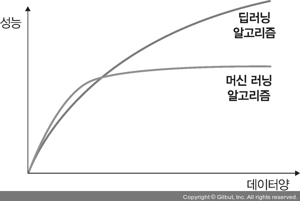
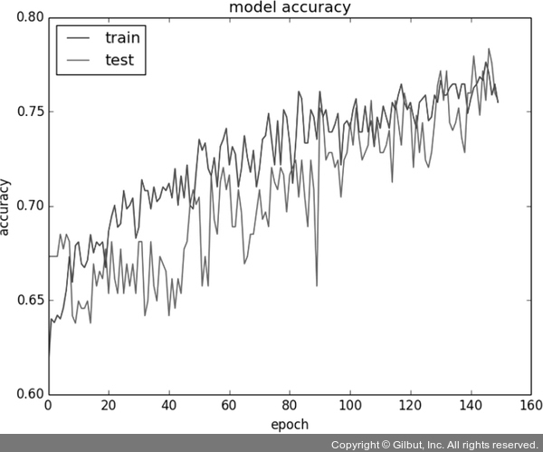

# Chapter 08: 성능 최적화
## 01. 성능 최적화
- 딥러닝에는 성능을 최적화할 수 있는 다양한 방법이 있다.
- 최적화 방법들을 하나씩 살펴본다.

### 1-1. 데이터를 사용한 성능 최적화
- 데이터를 사용한 성능 최적화 방법은 많은 데이터를 수집하는 것이다.
- 하지만 데이터 수집이 여의치 않은 상황에서는 임의로 데이터를 생성하는 방법도 고려해 볼 수 있다.

#### 최대한 많은 데이터 수집하기
- 일반적으로 딥러닝이나 머신 러닝 알고리즘은 데이터양이 많을수록 성능이 좋다.
- 따라서 가능한 많은 데이터(빅데이터)를 수집해야 한다.

#### 데이터 생성하기
- 많은 데이터를 수집할 수 없다면 데이터를 만들어 사용할 수 있다.
- 5장에 이미지 조작에 대한 코드가 있으니 참조하면 된다.

#### 데이터 범위(scale) 조정하기
- 활성화 함수로 시그모이드를 사용한다면 데이터셋 범위를 0~1의 값을 갖도록 하고, 하이퍼볼릭 탄젠트를 사용한다면 데이터셋 범위를 -1~1의 값을 갖도록 조정할 수 있다.

---
- 또한, 정규화, 규제화, 표준화도 성능 향상에 도움이 된다.

### 1-2. 알고리즘을 이용한 성능 최적화
- 머신 러닝과 딥러닝을 위한 알고리즘은 상당히 많다.
- 수많은 알고리즘 중 우리가 선택한 알고리즘이 최적의 알고리즘이 아닐 수도 있다.
- 따라서 유사한 용도의 알고리즘들을 선택하여 모델을 훈련시켜 보고 최적의 성능을 보이는 알고리즘을 선택해야 한다.
- 머신 러닝에서는 데이터 분류를 위해 SVM, K-최근접 이웃 알고리즘들을 선택하여 훈련시켜 보거나, 시계열 데이터의 경우 7장에서 다룬 RNN, LSTM, GRU 등의 알고리즘을 훈련시켜 성능이 가장 좋은 모델을 선택하여 사용한다.

### 1-3. 알고리즘 튜닝을 위한 성능 최적화
- 성능 최적화를 하는 데 가장 많은 시간이 소요되는 부분이다.
- 모델을 하나 선택하여 훈련시키려면 다양한 하이퍼파라미터를 변경하면서 훈련시키고 최적의 성능을 도출해야 한다.
- 이때 선택할 수 있는 하이퍼파라미터로는 다음 항목들이 있다.

#### 진단
- 성능 향상이 어느 순간 멈추었다면 원인을 분석할 필요가 있다.
- 문제를 진단하는 데 사용할 수 있는 것이 모델에 대한 평가다.
- 다음과 같은 평가 결과를 바탕으로 모델이 과적합(over-fitting)인지 혹은 다른 원인으로 성능 향상에 문제가 있는지에 대한 인사이트(insight)를 얻을 수 있다.

- 예를 들어 다음과 같은 상황들이 있을 수 있다.
    1. 훈련(train) 성능이 검증(test)보다 눈에 띄게 좋다면 과적합을 의심해 볼 수 있으며, 이것을 해결하기 위해 규제화를 진행한다면 성능 향상에 도움이 된다.
    2. 훈련과 검증 결과가 모두 성능이 좋지 않다면 과소적합(under-fitting)을 의심할 수 있다. 과소적합 상황에서는 네트워크 구조를 변경하거나 훈련을 늘리기 위해 에포크 수를 조정해 볼 수 있다.
    3. 훈련 성능이 검증을 넘어서는 변곡점이 있다면 조기 종료를 고려할 수 있다.

#### 가중치
- 가중치에 대한 초깃값은 작은 난수를 사용한다.
- 작은 난수라는 숫자가 애매하다면 오토인코더 같은 비지도 학습을 이용하여 사전 훈련(가중치 정보를 얻기 위한 사전 훈련)을 진행한 후 지도 학습을 진행하는 것도 방법이다.

#### 학습률
- 학습률은 모델의 네트워크 구성에 따라 다르기 때문에 초기에 매우 크거나 작은 임의의 난수를 선택하여 학습 결과를 보고 조금씩 변경해야 한다.
- 이때 네트워크의 계층이 많다면 학습률은 높아야 하며, 네트워크의 계층이 몇 개 되지 않는다면 학습률은 작게 설정해야 한다.

#### 활성화 함수
- 활성화 함수의 변경은 신중해야 한다.
- 활성화 함수를 변경할 때 손실 함수도 함께 변경해야 하는 경우가 많기 때문이다.
- 따라서 다루고자 하는 데이터 유형 및 데이터로 어떤 결과를 얻고 싶은지 정확하게 이해하지 못했다면 활성화 함수의 변경은 신중해야 한다.
- 일반적으로는 활성화 함수로 시그모이드나 하이퍼볼릭 탄젠트를 사용했다면 출력층에서는 소프트맥스나 시그모이드 함수를 많이 선택한다.

#### 배치와 에포크
- 일반적으로 큰 에포크와 작은 배치를 사용하는 것이 최근 딥러닝의 트렌드이다.
- 하지만 적절한 배치 크기를 위해 훈련 데이터셋의 크기와 동일하게 하거나 하나의 배치로 훈련을 시켜 보는 등 다양한 테스트를 진행하는 것이 좋다.

#### 옵티마이저 및 손실 함수
- 일반적으로 옵티마이저는 확률적 경사 하강법을 많이 사용한다.
- 네트워크 구성에 따라 차이는 있지만 아담(Adam)이나 알엠에스프롭(RMSProp) 등도 좋은 성능을 보이고 있다.
- 하지만 이것 역시 다양한 옵티마이저와 손실 함수를 적용해 보고 성능이 최고인 것을 선택해야 한다.

#### 네트워크 구성
- 네트워크 구성은 네트워크 토폴로지(topology)라고도 한다.
- 최적의 네트워크를 구성하는 것 역시 쉽게 알 수 있는 부분이 아니기 때문에 네트워크 구성을 변경해 가면서 성능을 테스트해야 한다.
- 예를 들어 하나의 은닉층에 뉴런을 여러 개 포함시키거나(네트워크가 넓다고 표현), 네트워크 계층을 늘리되 뉴런 개수는 줄여 본다(네트워크가 깊다고 표현).
- 혹은 두 가지를 결합하는 방법으로 최적의 네트워크가 무엇인지 확인한 후 사용할 네트워크를 결정해야 한다.

### 1-4. 앙상블을 이용한 성능 최적화
- 앙상블은 간단히 모델을 두 개 이상 섞어서 사용하는 것이다.
- 앙상블을 이용하는 것도 성능 향상에 도움이 됩니다.
- 알고리즘 튜닝을 위한 성능 최적화 방법은 하이퍼파라미터에 대한 경우의 수를 모두 고려해야 하기 때문에 모델 훈련이 수십 번에서 수백 번 필요할 수 있다.
- 따라서 성능 향상은 단시간에 해결되는 것이 아니고, 수많은 시행착오를 겪어야 한다.
- 성능 최적화를 위한 또 다른 방법으로 하드웨어를 이용한 방법과 앞서 언급하지 않았던 하이퍼파라미터를 이용한 추가적인 방법들이 있는데, 하나씩 자세히 살펴보자.