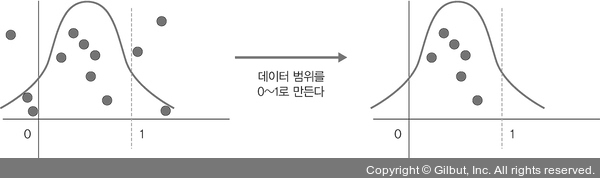
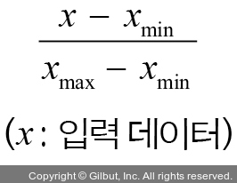

# Chapter 08: 성능 최적화
## 03. 하이퍼 파라미터를 이용한 성능 최적화
- 하이퍼파라미터를 이용한 성능 최적화의 추가적인 방법으로 배치 정규화, 드롭아웃, 조기 종료가 있다.

### 3-1. 배차 정규화를 이용한 성능 최적화
- 배치 정규화를 진행하기에 앞서 유사한 의미로 사용되는 용어들을 알아본다.

#### 1. 정규화
- 정규화(normalization)는 데이터 범위를 사용자가 원하는 범위로 제한하는 것을 의미한다.
- 예를 들어 이미지 데이터는 픽셀 정보로 0~255 사이의 값을 갖는데, 이를 255로 나누면 0~1.0 사이의 값을 갖게 된다.

- 정규화는 각 특성 범위(스케일(scale))를 조정한다는 의미로 특성 스케일링(feature scaling)이라고도 한다.
- 스케일 조정을 위해 MinMaxScaler() 기법을 사용하므로 수식은 다음과 같다.

