# Chapter 13: 생성 모델
## 01. 생성 모델이란
- 생성 모델(generative model)은 주어진 데이터를 학습하여 데이터 분포를 따르는 유사한 데이터를 생성하는 모델이다.
- 그럼 유사한 데이터는 어떻게 만들고, 생성 모델의 유형은 어떤 것들이 있는지 알아보겠다.

### 1-1. 생성 모델 개념
- 기존 합성곱 신경망에서 다룬 이미지 분류, 이미지 검출 등은 입력 이미지(x)가 있을 때 그에 따른 정답(y)을 찾는 것이었다.
- 예를 들어 개와 고양이 이미지 데이터셋이 주어졌을 때, 그 이미지를 개와 고양이로 분류하는 문제들을 다루었다.
- 이렇게 이미지를 분류하는 것을 ‘판별(자) 모델(discriminative model)’이라고 한다.
- 일반적으로 판별자 모델에서는 이미지를 정확히 분류(구별)하고자 해당 이미지를 대표하는 특성들을 잘 찾는 것을 목표로 한다.
- 예를 들어 개와 고양이를 구별하려면 개의 귀, 꼬리 등 특성을 찾는 것이 중요하다.
- 그리고 판별자 모델에서 추출한 특성들의 조합을 이용하여 새로운 개와 고양이 이미지를 생성할 수 있는데, 이것을 ‘생성(자) 모델(generative model)’이라고 한다.
- 즉, 생성 모델은 입력 이미지에 대한 데이터 분포 p(x)를 학습하여 새로운 이미지(새로운 이미지이면서 기존 이미지에서 특성을 추출했기 때문에 최대한 입력 이미지와 유사한 이미지)를 생성하는 것을 목표로 한다.

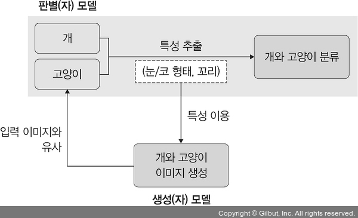

### 1-2. 생선 모델의 유형
- 생성 모델의 유형에는 다음 그림과 같이 모델의 확률 변수를 구하는 ‘변형 오토인코더 모델’과 확률 변수를 이용하지 않는 ‘GAN 모델’이 있다.


- 다시 정리하면 생성 모델은 크게 명시적 방법(explicit density)과 암시적 방법(implicit density)으로 분류할 수 있다.
- 명시적 방법은 확률 변수 p(x)를 정의하여 사용한다.
- 대표적인 모델로 변형 오토인코더(variational autoencoder)가 있다.
- 암시적 방법은 확률 변수 p(x)에 대한 정의 없이 p(x)를 샘플링하여 사용한다.
- 대표적인 모델로 GAN(Generative Adversarial Network)이 있다.
- 변형 오토인코더는 이미지의 잠재 공간(latent space)에서 샘플링하여 완전히 새로운 이미지나 기존 이미지를 변형하는 방식으로 학습을 진행한다.
- GAN은 생성자와 판별자가 서로 경쟁하면서 가짜 이미지를 진짜 이미지와 최대한 비슷하게 만들도록 학습을 진행한다.
- 변형 오토인코더부터 살펴본다.

## 02. 변형 오토인코더
- 변형 오토인코더는 오토인코더의 확장이다.
- 따라서 오토인코더가 무엇인지 확인한 후 변형 오토인코더로 넘어간다.

### 2-1. 오토인코더란
- 오토인코더는 단순히 입력을 출력으로 복사하는 신경망으로 은닉층(혹은 병목층이라고도 함)의 노드 수가 입력 값보다 적은 것이 특징이다.
- 따라서 입력과 출력이 동일한 이미지라고 예상할 수 있다.
- 하지만 입력을 출력으로 복사하는 방법을 사용하는 이유는 은닉층 때문이다.
- 오토인코더의 병목층은 입력과 출력의 뉴런보다 훨씬 적다.
- 즉, 적은 수의 병목층 뉴런으로 데이터를 가장 잘 표현할 수 있는 방법이 오토인코더이다.
- 오토인코더는 네 가지 주요 부분으로 구성된다.

#### 오토인코더의 구성
1. 인코더: 인지 네트워크(recognition network)라고도 하며, 특성에 대한 학습을 수행하는 부분이다.
2. 병목층(은닉층): 모델의 뉴런 개수가 최소인 계층이다. 이 계층에서는 차원이 가장 낮은 입력 데이터의 압축 표현이 포함된다.
3. 디코더: 생성 네트워크(generative network)라고도 하며, 이 부분은 병목층에서 압축된 데이터를 원래대로 재구성(reconstruction)하는 역할을 한다. 즉, 최대한 입력에 가까운 출력을 생성하도록 한다.
4. 손실 재구성: 오토인코더는 다음 그림과 같이 입력층과 출력층의 뉴런 개수가 동일하다는 것만 제외하면 일반적인 다층 퍼셉트론(Multi-Layer Perceptron, MLP)과 구조가 동일하다. 오토인코더는 압축된 입력을 출력층에서 재구성하며, 손실 함수는 입력과 출력(인코더와 디코더)의 차이를 가지고 계산한다.

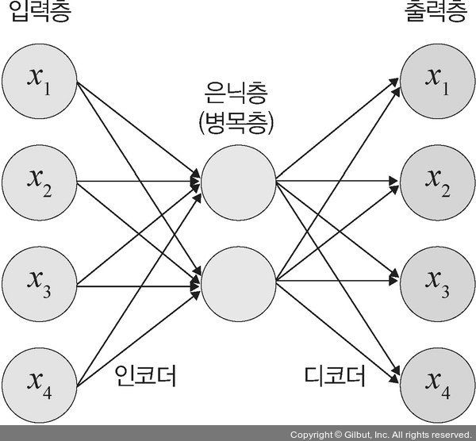

- 오토인코더 개념을 이해했다면 이번에는 수학적으로 접근해 본다.
- 미리 이야기하지만 수학적 접근은 언제나 어렵게 느껴질 수 있다.
- 따라서 한 번 읽어 보고 이해하기 어려운 부분들이 있다면 인공지능 수학 관련 도서를 참고하기 바란다.
- 입력 x와 출력 y는 같은 차원(Rd)에 존재한다는 가정하에 입력 데이터를 인코더 네트워크에 통과시켜 압축된 잠재 벡터 z 값을 얻는다.
- 이때 z를 구하는 공식:
    - z = h(x)
- 압축된 z 벡터에서 입력 데이터와 크기가 같은 출력 값은 다음과 같이 계산한다.
    - y = g(z) = g(h(x))
- 이때 손실(loss) 값은 입력 값 x와 디코더를 통과한 y 값의 차이로 다음과 같이 계산한다.

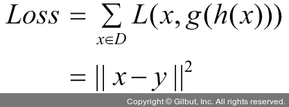

- 즉, 디코더 네트워크를 통과한 출력 값은 입력 값의 크기와 같아야 한다.

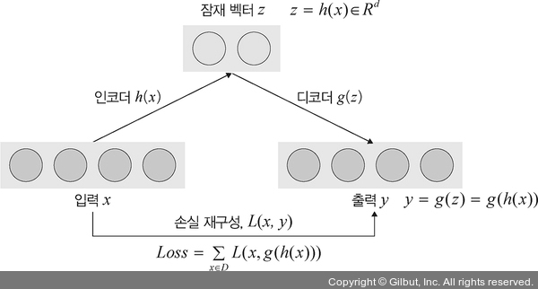

#### 오토인코더가 중요한 이유
1. 데이터 압축: 데이터 압축은 메모리 측면에서 상당한 장점이다. 오토인코더를 이용하여 이미지나 음성 파일의 중요 특성만 압축하면 용량도 작고 품질도 더 좋아진다.
2. 차원의 저주(curse of dimensionality) 예방: 차원의 저주 문제를 예방할 수 있다. 오토인코더는 특성 개수를 줄여 주기 때문에 데이터 차원이 감소하여 차원의 저주를 피할 수 있다.
3. 특성 추출: 오토인코더는 비지도 학습으로 자동으로 중요한 특성을 찾아 준다. 예를 들어 눈 모양, 털 색, 꼬리 길이 등 개의 중요한 특성을 자동으로 찾아 준다.

---
- 이제 파이토치에서 오토인코더를 구현해 볼 텐데, 그동안 진행했던 모델과는 다르게 조금 복잡할 수 있으니 반드시 예제를 실습하면서 이해하기 바란다.
- 예제는 다음 그림과 같은 구조의 오토인코더를 사용한다.


- 먼저 필요한 라이브러리를 호출한다.
```py
# 13-1 라이브러리 호출

import torch
import torch.nn as nn
import torch.optim as optim_module
from torch.utils.data import Dataset, DataLoader
import matplotlib.pylab as plt
import numpy as np

import torchvision.datasets as datasets
import torchvision.transforms as transforms

device = torch.device("cuda" if torch.cuda.is_available() else "cpu")
```
- 이 예제는 케라스에 내장되어 제공하는 MNIST 데이터셋을 사용한다.
- MNIST 데이터셋을 내려받은 후 텐서로 변경하고 데이터로더에 전달한다.
```py
# 13-2 MNIST 데이터셋을 내려받아 전처리

# transforms.ToTensor( )는 이미지를 파이토치의 텐서 형태로 변형
transform = transforms.Compose([transforms.ToTensor()])

# MNIST를 내려받은 후 텐서 형태로 변형
train_dataset = datasets.MNIST(
    root="../chap13/data", train=True, transform=transform, download=True)

test_dataset = datasets.MNIST(
    root="../chap13/data", train=False, transform=transform, download=True)

# (1)
train_loader = DataLoader(
    train_dataset, batch_size=128, shuffle=True, num_workers=4, pin_memory=False)

test_loader = DataLoader(
    test_dataset, batch_size=32, shuffle=False, num_workers=4)
```
```
100%|██████████| 9.91M/9.91M [00:01<00:00, 5.10MB/s]
100%|██████████| 28.9k/28.9k [00:00<00:00, 141kB/s]
100%|██████████| 1.65M/1.65M [00:01<00:00, 1.27MB/s]
100%|██████████| 4.54k/4.54k [00:00<00:00, 1.75MB/s]
```

#### (1)
- 데이터로더는 전체 데이터셋을 작은 단위로 쪼개서 메모리로 가져올 때 사용한다.

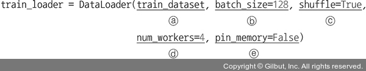

- 데이터로더에서 사용하는 파라미터:
- 첫 번째 파라미터: 훈련 데이터셋
- batch_size: 메모리로 한 번에 불러올 데이터의 크기
- shuffle: True로 지정하면 데이터를 무작위로 섞겠다는 의미
- num_workers: 데이터를 불러올 때 몇 개의 프로세스를 사용할지 지정하는 부분으로 병렬로 데이터를 불러오겠다는 의미
    - 일반적으로 GPU를 사용할 때 많이 사용하는 파라미터
    - 너무 많은 값을 할당하면 오버헤드가 발생할 수 있고 작게 할당하면 좋은 성능을 기대할 수 있으므로 적절한 값을 지정해야 한다.
    - 일반적으로 ‘4 * GPU 개수’를 지정하지만 모든 상황에 적합한 것은 아니므로 주의해서 사용할 필요가 있다.
- pin_memory: CPU를 사용하다 GPU로 전환할 때 속도 향상을 위해 사용한다.
    - 따라서 모델 훈련 과정에서 CPU나 GPU만 사용한다면 True로 지정할 필요가 없는 파라미터이다.
    - pin_memory를 True로 지정하면 훈련에 사용할 데이터셋을 GPU에 미리 불러와서 학습시키기 때문에 속도가 향상된다.

---
- 이제 모델의 네트워크를 생성해 볼 텐데 인코더와 디코더를 사용하여 간단한 오토인코더를 만들어 본다.
- 이때 데이터셋을 저차원으로 압축하는 것을 인코더라고 하며, 압축된 것을 다시 원래의 차원으로 복원하는 것을 디코더라고 한다.
- 따라서 인코더와 디코더에서 사용하는 네트워크 계층은 같아야 한다.
```py
# 13-3 네트워크(신경망) 생성

# 인코더 네트워크 생성
class Encoder(nn.Module):
    def __init__(self, encoded_space_dim,fc2_input_dim):
        super().__init__()

        # 이미지 데이터셋 처리를 위해 합성곱 신경망 이용
        self.encoder_cnn = nn.Sequential(
            nn.Conv2d(1, 8, 3, stride=2, padding=1),
            nn.ReLU(True),
            nn.Conv2d(8, 16, 3, stride=2, padding=1),
            nn.BatchNorm2d(16),
            nn.ReLU(True),
            nn.Conv2d(16, 32, 3, stride=2, padding=0),
            nn.ReLU(True)
        )

        # 완전연결층
        self.flatten = nn.Flatten(start_dim=1)
        # 출력 계층
        self.encoder_lin = nn.Sequential(
            nn.Linear(3 * 3 * 32, 128),
            nn.ReLU(True),
            nn.Linear(128, encoded_space_dim)
        )

    def forward(self, x):
        x = self.encoder_cnn(x)
        x = self.flatten(x)
        x = self.encoder_lin(x)
        return x

# 디코더 네트워크 생성
class Decoder(nn.Module):
    def __init__(self, encoded_space_dim, fc2_input_dim):
        super().__init__()
        # 인코더의 출력을 디코더의 입력으로 사용
        self.decoder_lin = nn.Sequential(
            nn.Linear(encoded_space_dim, 128),
            nn.ReLU(True),
            nn.Linear(128, 3 * 3 * 32),
            nn.ReLU(True)
        )

        # 인코더의 완전연결층에 대응
        self.unflatten = nn.Unflatten(dim=1, unflattened_size=(32, 3, 3))
        # 인코더의 합성곱층에 대응
        self.decoder_conv = nn.Sequential(
            nn.ConvTranspose2d(32, 16, 3, stride=2, output_padding=0),
            nn.BatchNorm2d(16),
            nn.ReLU(True),
            nn.ConvTranspose2d(16, 8, 3, stride=2, padding=1, output_padding=1),
            nn.BatchNorm2d(8),
            nn.ReLU(True),
            nn.ConvTranspose2d(8, 1, 3, stride=2, padding=1, output_padding=1)
        )

    def forward(self, x):
        x = self.decoder_lin(x)
        x = self.unflatten(x)
        x = self.decoder_conv(x)
        x = torch.sigmoid(x)
        return x
```
- 인코더와 디코더 객체를 초기화하고, 모델의 훈련 과정에 필요한 손실 함수와 옵티마이저를 지정한다.
```py
# 13-4 손실 함수와 옵티마이저 지정

encoder = Encoder(encoded_space_dim=4, fc2_input_dim=128)
decoder = Decoder(encoded_space_dim=4, fc2_input_dim=128)
encoder.to(device)
decoder.to(device)

# 인코더와 디코더에서 사용할 파라미터를 다르게 지정
params_to_optimize = [
    {'params': encoder.parameters()},
    {'params': decoder.parameters()}
]
optimizer = optim_module.Adam(params_to_optimize, lr=0.001, weight_decay=1e-05)
loss_fn = torch.nn.MSELoss()
```
- 오토인코더에서 가장 널리 사용되는 손실 함수는 ‘평균 제곱 오차’와 ‘이진 크로스 엔트로피’이다.
- 입력 값이 (0,1) 범위에 있으면 이진 크로스 엔트로피를 사용하고, 그렇지 않으면 평균 제곱 오차를 사용한다.
- 옵티마이저는 아담을 사용했지만 알엠에스프롭(RMSProp) 또는 아다델타(adadelta) 같은 옵티마이저를 이용하여 성능을 비교해 보는 것도 학습에 도움이 많이 되니, 옵션을 변경하여 테스트를 진행해 보자.
- 다음은 앞에서 생성한 모델 네트워크의 구조를 보여 준다(디코더만 보여 준다).
```
Decoder(
  (decoder_lin): Sequential(
    (0): Linear(in_features=4, out_features=128, bias=True)
    (1): ReLU(inplace=True)
    (2): Linear(in_features=128, out_features=288, bias=True)
    (3): ReLU(inplace=True)
  )
  (unflatten): Unflatten(dim=1, unflattened_size=(32, 3, 3))
  (decoder_conv): Sequential(
    (0): ConvTranspose2d(32, 16, kernel_size=(3, 3), stride=(2, 2))
    (1): BatchNorm2d(16, eps=1e-05, momentum=0.1, affine=True, track_running_stats=True)
    (2): ReLU(inplace=True)
    (3): ConvTranspose2d(16, 8, kernel_size=(3, 3), stride=(2, 2), padding=(1, 1), output_padding=(1, 1))
    (4): BatchNorm2d(8, eps=1e-05, momentum=0.1, affine=True, track_running_stats=True)
    (5): ReLU(inplace=True)
    (6): ConvTranspose2d(8, 1, kernel_size=(3, 3), stride=(2, 2), padding=(1, 1), output_padding=(1, 1))
  )
)
```
- 모델 학습에 대한 함수를 생선한다.
```py
# 13-5 모델 학습 함수 생성

def train_epoch(encoder, decoder, device, dataloader, loss_fn, optimizer, noise_factor=0.3):
    # 인코더 훈련
    encoder.train()
    # 디코더 훈련
    decoder.train()
    train_loss = []

    # 훈련 데이터셋을 이용하여 모델 학습(비지도 학습으로 레이블은 필요하지 않음)
    for image_batch, _ in dataloader:
        image_noisy = add_noise(image_batch, noise_factor)
        # 데이터셋이 CPU/GPU 장치를 사용하도록 지정
        image_noisy = image_noisy.to(device)
        # 노이즈 데이터를 인코더의 입력으로 사용
        encoded_data = encoder(image_noisy)
        # 인코더 출력을 디코더의 입력으로 사용
        decoded_data = decoder(encoded_data)
        loss = loss_fn(decoded_data, image_noisy)
        optimizer.zero_grad()
        loss.backward()
        optimizer.step()
        train_loss.append(loss.detach().cpu().numpy())
    return np.mean(train_loss)
```
- 모델을 검증하기 위한 함수를 생성한다.
```py
# 13-6 모델 테스트 함수 생성

def test_epoch(encoder, decoder, device, dataloader, loss_fn, noise_factor=0.3):
    # Set evaluation mode for encoder and decoder
    # 인코더 테스트
    encoder.eval()
    # 디코더 테스트
    decoder.eval()
    with torch.no_grad():
        # 각 배치에 대한 출력을 저장하기 위해 리스트 형식의 변수 정의
        conc_out = []
        conc_label = []
        for image_batch, _ in dataloader:
            image_batch = image_batch.to(device)
            encoded_data = encoder(image_batch)
            decoded_data = decoder(encoded_data)
            conc_out.append(decoded_data.cpu())
            conc_label.append(image_batch.cpu())
        
        # 리스트 형식으로 저장된 모든 값을 하나의 텐서로 생성
        conc_out = torch.cat(conc_out)
        conc_label = torch.cat(conc_label)
        # 손실 함수를 이용하여 오차 계산
        val_loss = loss_fn(conc_out, conc_label)
    return val_loss.data
```
- 입력 데이터셋에 추가할 노이즈를 생성하기 위한 함수를 정의한다.
```py
# 13-7 노이즈 데이터 생성

def add_noise(inputs, noise_factor=0.3):
    # (1)
    noisy = inputs + torch.randn_like(inputs) * noise_factor
    # (2)
    noisy = torch.clip(noisy, 0., 1.)
    return noisy
```
- (1): torch.randn_like(inputs)는 입력(inputs)과 동일한 크기의 노이즈 텐서를 생성하고자 할 때 사용한다.

#### (2)
- torch.clip은 데이터 값의 범위를 조정할 때 사용한다.

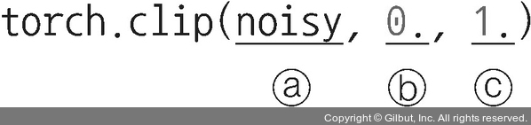

- torch.clip에서 사용하는 파라미터:
    - 첫 번째 파라미터: 값의 범위를 조정할 데이터셋
    - 두 번째 파라미터: 데이터의 범위 중 최솟값을 의미하며 예제에서는 0을 사용했다.
    - 세 번째 파라미터: 데이터의 범위 중 최댓값을 의미하며 예제에서는 1을 사용했다.

---
- 파이썬에서 한글을 출력하면 한글이 깨지는 현상이 발생할 수 있다.
- 다음은 한글 깨짐 현상을 해결하기 위한 코드이다.
- 경로 변경 없이 그대로 사용한다.
```py
# 13-8 한글 깨짐 문제 해결

from matplotlib import font_manager
font_fname = 'C:/Windows/Fonts/malgun.ttf'
font_family = font_manager.FontProperties(fname=font_fname).get_name()
plt.rcParams["font.family"] = font_family
```
- 에포크가 진행될수록 노이즈 데이터로 새로운 이미지가 어떻게 만들어지는지 확인하기 위한 함수를 생성한다.
- 시각화하여 보여 줄 이미지는 원래의 이미지, 노이즈가 적용되어 손상된 데이터(이미지), 노이즈 데이터를 이용하여 새롭게 생성된 데이터(이미지)이다.
```py
# 13-9 이미지 시각화

def plot_ae_outputs(encoder, decoder, n=5, noise_factor=0.3):
    plt.figure(figsize=(10,4.5))
    for i in range(n):
        # subplot에서 사용하는 파라미터는 (행, 열, 인덱스). 3×5 형태의 이미지가 출력.
        ax = plt.subplot(3, n, i+1)
        img = test_dataset[i][0].unsqueeze(0)
        image_noisy = add_noise(img, noise_factor)
        image_noisy = image_noisy.to(device)

        # 인코더 평가
        encoder.eval()
        # 디코더 평가
        decoder.eval()
        with torch.no_grad():
            rec_img = decoder(encoder(image_noisy))

        # 테스트 데이터셋을 출력
        plt.imshow(img.cpu().squeeze().numpy(), cmap='gist_gray')
        # set_visible(False)는 그래프의 눈금을 표시하지 않겠다는 의미
        ax.get_xaxis().set_visible(False)
        ax.get_yaxis().set_visible(False)
        if i == n//2:
            ax.set_title('원래 이미지')
        ax = plt.subplot(3, n, i + 1 + n)
        # 테스트 데이터셋에 노이즈가 적용된 결과를 출력
        plt.imshow(image_noisy.cpu().squeeze().numpy(), cmap='gist_gray')
        ax.get_xaxis().set_visible(False)
        ax.get_yaxis().set_visible(False)
        if i == n//2:
            ax.set_title('노이즈가 적용되어 손상된 이미지')

        ax = plt.subplot(3, n, i + 1 + n + n)
        # 노이즈가 추가된 이미지를 인코더와 디코더에 적용한 결과를 출력
        plt.imshow(rec_img.cpu().squeeze().numpy(), cmap='gist_gray')
        ax.get_xaxis().set_visible(False)
        ax.get_yaxis().set_visible(False)
        if i == n//2:
            ax.set_title('재구성된 이미지')
    
    # subplots_adjust()를 이용하여 subplot들이 겹치지 않도록 최소한의 여백을 만들어 줌
    plt.subplots_adjust(left=0.1,
                        bottom=0.1,
                        right=0.7,
                        top=0.9,
                        wspace=0.3,
                        hspace=0.3)
    plt.show()
```
- 앞에서 정의해 두었던 함수를 이용하여 모델을 학습시킨다.
- 이때 학습 과정 중에 생성된 이미지도 확인해 본다.
```py
# 13-10 모델 학습

import numpy as np

num_epochs = 30
history_da = {'train_loss':[],'val_loss':[]}
loss_fn = torch.nn.MSELoss()

for epoch in range(num_epochs):
    print('EPOCH %d/%d' % (epoch + 1, num_epochs))
    # 모델 학습 함수(train_epoch)를 이용하여 모델 학습
    train_loss=train_epoch(
        encoder=encoder,
        decoder=decoder,
        device=device,
        dataloader=train_loader,
        loss_fn=loss_fn,
        optimizer=optimizer, noise_factor=0.3)
    # 모델 검증(테스트) 함수(test_epoch)를 이용하여 테스트
    val_loss = test_epoch(
        encoder=encoder,
        decoder=decoder,
        device=device,
        dataloader=test_loader,
        loss_fn=loss_fn, noise_factor=0.3)
    history_da['train_loss'].append(train_loss)
    history_da['val_loss'].append(val_loss)
    print('\n EPOCH {}/{} \t train loss {:.3f} \t val loss {:.3f}'.format(epoch + 1, num_epochs,train_loss,val_loss))
    plot_ae_outputs(encoder, decoder, noise_factor=0.3)
```
- 모델 학습 결과
```
... 중간 생략 ... 
EPOCH 12/30 
EPOCH 12/30     train loss 0.050     val loss 0.039
```


```
... 중간 생략 ...  
EPOCH 30/30 
EPOCH 30/30     train loss 0.049     val loss 0.037
```

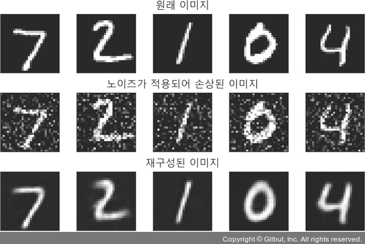

- 에포크가 진행될수록 훈련과 검증(테스트) 데이터셋에 대한 오차가 줄어들고 있다.
- 또한, 노이즈를 이용하여 생성된 이미지 역시 선명해지는 것을 확인할 수 있다.
- 지금까지 오토인코더 예제를 살펴보았다면 이제 변형 오토인코더를 살펴본다.

### 2-2. 변형 오토인코더
- 변형 오토인코더(variational autoencoder)를 좀 더 쉽게 이해할 수 있게 오토인코더와 비교하면서 설명한다.
- 오토인코더는 다음 그림과 같이 입력(숫자 2)→인코더→압축(차원 축소)→디코더→출력(숫자 2)이 나오게 하는 방법이다.

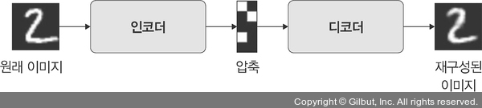

- 오토인코더는 차원을 줄이는 것이 목표이기 때문에 새롭게 생성된 데이터의 확률 분포에는 관심이 없다.
- 반면 변형 오토인코더는 표준편차와 평균을 이용하여 확률 분포를 만들고, 거기에서 샘플링하여 디코더를 통과시킨 후 새로운 데이터를 만들어 낸다.
- 즉, 변형 오토인코더는 입력 데이터와 조금 다른 출력 데이터를 만들어 내는데, 이때 z라는 가우시안 분포를 이용한다(z를 잠재 벡터(latent vector)라고 한다).
- 중요한 특성의 파라미터를 담고 있는 z 분포에서 벡터를 랜덤하게 샘플링하고 이 분포의 오차를 이용하여 입력 데이터와 유사한 다양한 데이터를 만들어 내는 것이 변형 오토인코더이다.

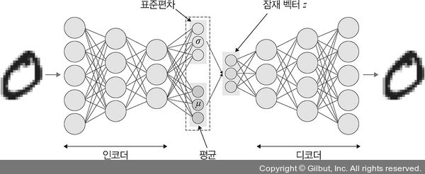

- 오토인코더는 데이터 벡터에 대한 차원을 축소하여 실제 이미지와 동일한 이미지를 출력하는 것이 목적이었다면, 변형 오토인코더는 데이터가 만들어지는 확률 분포를 찾아 비슷한 데이터를 생성하는 것이 목적이다.
- 변형 오토인코더에서 인코더와 디코더에 대한 네트워크는 다음 그림과 같다.


- qϕ(z|x): x를 입력받아 잠재 벡터 z와 대응되는 평균과 분산을 구하는 네트워크로 인코더 네트워크를 의미한다.
- pθ(x|z): z를 입력받아 x와 대응되는 평균과 분산을 구하는 네트워크로 디코더 네트워크를 의미한다.
- 그럼 인코더 네트워크부터 자세히 살펴보자.

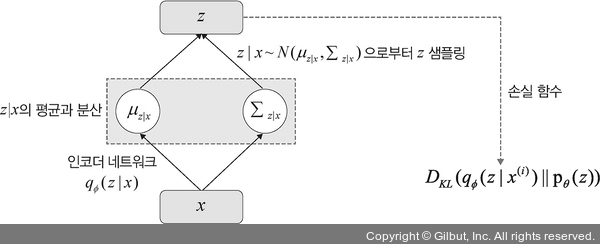

1. 입력 x를 인코더 네트워크 qϕ(z|x)에 보내 (μz|x, Σz|x)를 출력하고, 이를 이용하여 다음 수식의 2항에 대한 값을 구한다.

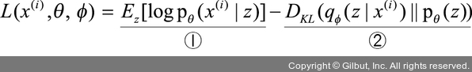

2. (μz|x, Σz|x)의 가우시안 분포에서 z를 샘플링한다.
    - z ← z|x ~ N(μz|x, Σz|x)
- 이렇게 구해진 z는 디코더 네트워크의 입력으로 사용된다.
- 그럼 디코더 네트워크를 살펴보자.

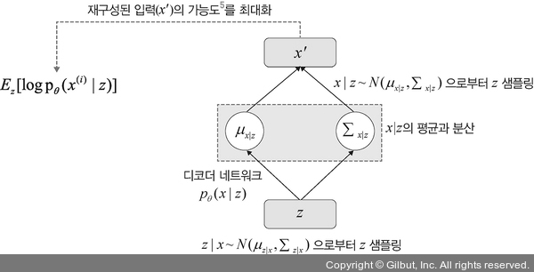

1. 샘플링한 z를 디코더 네트워크 pθ(x|z)에 보내 (μz|x, Σz|x)를 출력한 후 이를 이용하여 1항의 값을 구한다(다음 수식은 앞의 수식과 동일하다).


2. (μx|z, Σx|z)의 가우시안 분포에서 z를 샘플링한 후 x'를 구한다.
    - x' ← x|z ~ N(μx|z, Σx|z)
3. 역전파를 이용하여 L(x(i), θ, ϕ)의 값이 높아지는 방향으로 기울기를 업데이트한다.
- 즉, 가능도(likelihood)가 증가하는 방향으로 파라미터 θ와 ϕ를 업데이트한다.
- 최종적으로 x와 유사한 x'라는 이미지가 생성된다.
- 다음은 인코더와 디코더에서 사용된 수식을 정리한 내용이다.

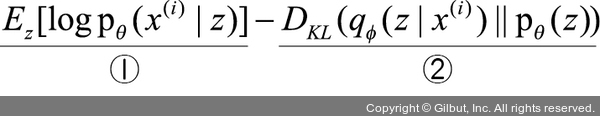

- ①항은 z가 주어졌을 때 x'를 표현하기 위한 확률밀도 함수로 디코더 네트워크를 나타낸다.
- 즉, 디코더 네트워크의 가능도가 크면 클수록 θ가 그 데이터를 잘 표현한다고 해석할 수 있다.
- 따라서 ①항이 크면 클수록 모델 가능도가 커진다.
- ②항은 x에서 z를 표현하는 확률밀도 함수로 인코더 네트워크와 가우시안 분포가 얼마나 유사한지 나타낸다.
- 유사한 정도가 높을수록 쿨백-라이블러 발산(Kullback–Leibler Divergence, DKL)은 낮은 값을 나타내므로, 인코더 네트워크가 가우시안 분포를 최대한 잘 표현할 수 있도록 가능도가 최대화된다.
- 따라서 ②항이 작을수록 모델 가능도가 커진다.
- 다시 정리하면 ①항은 그 값이 클수록, ②항은 그 값이 작을수록 가짜 데이터를 잘 생성한다고 할 수 있다.

- 이번 예제에서는 텐서보드에서 에포크 진행에 따른 오차를 확인할 예정이다.
- 따라서 다음 명령으로 텐서보드를 설치한다.
- 텐서보드 사용을 위해 텐서보드 엑스(tensorboardX) 라이브러리를 설치해야 한다.
```
$ pip install tensorboardX
```
- 텐서보드 엑스는 학습 과정을 시각적으로 확인하고자 할 때 사용하는 도구이다.
- 변형 오토인코더에서도 오토인코더에서와 마찬가지로 MNIST 데이터셋을 이용한다.
- 먼저 필요한 라이브러리를 호출한다.
```py
# 13-11 필요한 라이브러리 호출

import datetime
import os
from tensorboardX import SummaryWriter

import torch
import torchvision
import torch.nn as nn
import torch.optim as optim
from torch.utils.data import Dataset, DataLoader
import matplotlib.pylab as plt

import torchvision.datasets as datasets
import torchvision.transforms as transforms

device = torch.device("cuda" if torch.cuda.is_available() else "cpu")
```
- MNIST 데이터셋을 내려받은 후 이미지를 텐서로 변환한다.
```py
# 13-12 데이터셋을 내려받은 후 텐서 변환

transform = transforms.Compose([transforms.ToTensor()])

train_dataset = datasets.MNIST(
    root="../chap13/data", train=True, transform=transform, download=True)

test_dataset = datasets.MNIST(
    root="../chap13/data", train=False, transform=transform, download=True)

train_loader = DataLoader(
    train_dataset, batch_size=100, shuffle=True, num_workers=4, pin_memory=False)

test_loader = DataLoader(
    test_dataset, batch_size=100, shuffle=False, num_workers=4)
```
- 모델의 네트워크를 생성한다.
- 네트워크는 오토인코더처럼 인코더와 디코더로 구성된다.
```py
# 13-13 인코더 네트워크 생성

class Encoder(nn.Module):
    def __init__(self, input_dim, hidden_dim, latent_dim):
        super(Encoder, self).__init__()
        self.input1 = nn.Linear(input_dim, hidden_dim)
        self.input2 = nn.Linear(hidden_dim, hidden_dim)
        self.mean = nn.Linear(hidden_dim, latent_dim)
        self.var = nn.Linear(hidden_dim, latent_dim)

        self.LeakyReLU = nn.LeakyReLU(0.2)
        self.training = True

    def forward(self, x):
        h_ = self.LeakyReLU(self.input1(x))
        h_ = self.LeakyReLU(self.input2(h_))
        mean = self.mean(h_)
        log_var = self.var(h_)
        # 인코더 네트워크에서 평균과 분산을 반환
        return mean, log_var
```
- 인코더 역할은 데이터(x)가 주어졌을 때 디코더가 원래 데이터로 잘 복원할 수 있는 이상적인 확률 분포 p(z|x)를 찾는 것이다.
- 변형 오토인코더에서는 이상적인 확률 분포를 찾는 데 변분추론(variational inference)을 사용한다.
- 이번에는 디코더 네트워크를 정의힌다.
```py
# 13-14 디코더 네트워크

class Decoder(nn.Module):
    def __init__(self, latent_dim, hidden_dim, output_dim):
        super(Decoder, self).__init__()
        self.hidden1 = nn.Linear(latent_dim, hidden_dim)
        self.hidden2 = nn.Linear(hidden_dim, hidden_dim)
        self.output = nn.Linear(hidden_dim, output_dim)
        self.LeakyReLU = nn.LeakyReLU(0.2)

    def forward(self, x):
        h = self.LeakyReLU(self.hidden1(x))
        h = self.LeakyReLU(self.hidden2(h))
        x_hat = torch.sigmoid(self.output(h))
        # 디코더 결과는 시그모이드를 통과했으므로 0~1 값을 가짐
        return x_hat
```
- 디코더는 추출한 샘플을 입력으로 받아 다시 원본으로 재구축(재생성)하는 역할을 수행한다.
- 이제 평균과 표준편차가 주어졌을 때 잠재 벡터 z를 만들기 위해 reparameterization()이라는 이름으로 함수를 생성한다.
```py
# 13-15 변형 오토인코더 네트워크

class Model(nn.Module):
    def __init__(self, Encoder, Decoder):
        super(Model, self).__init__()
        self.Encoder = Encoder
        self.Decoder = Decoder

    # (1)
    def reparameterization(self, mean, var):
        epsilon = torch.randn_like(var).to(device)
        # z 값 구하기
        z = mean + var * epsilon
        return z

    def forward(self, x):
        # (2)
        mean, log_var = self.Encoder(x)
        z = self.reparameterization(mean, torch.exp(0.5 * log_var))
        x_hat = self.Decoder(z)
        # 디코더 결과와 평균, 표준편차(log를 취한 표준편차)를 반환
        return x_hat, mean, log_var
```

#### (1)
- reparameterization() 함수는 z 벡터를 샘플링하기 위한 용도이다.
- z는 가우시안 분포라고 가정했기 때문에 인코더에서 받아 온 평균(μ)과 표준편차(σ)를 이용하여 z를 생성한다.
- 그리고 z 벡터를 디코더에 다시 통과시켜서 입력과 동일한 데이터(x')를 만들어 내는 작업을 한다.

#### (2)
- 인코더에서 받아 온 평균과 표준편차를 이용하지만 표준편차는 값을 그대로 사용하지 않는다.
- 값이 음수가 되지 않도록 로그(log)를 취하는데, 다음과 같은 방식을 취한다.

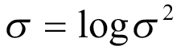

- 따라서 변수 이름도 var에서 log_var로 변경했다.

---
- 필요한 모델의 네트워크(인코더와 디코더) 객체를 초기화한다.
```py
# 13-16 인코더와 디코더 객체 초기화

x_dim = 784
hidden_dim = 400
latent_dim = 200
epochs = 30
batch_size = 100

encoder = Encoder(input_dim=x_dim, hidden_dim=hidden_dim, latent_dim=latent_dim)
decoder = Decoder(latent_dim=latent_dim, hidden_dim=hidden_dim, output_dim=x_dim)

model = Model(Encoder=encoder, Decoder=decoder).to(device)
```
- 오차를 계산하기 위한 손실 함수를 정의한다.
```py
# 13-17 손실 함수 정의

# (1)
def loss_function(x, x_hat, mean, log_var):
    reproduction_loss = nn.functional.binary_cross_entropy(x_hat, x, reduction='sum')
    KLD = -0.5 * torch.sum(1 + log_var - mean.pow(2) - log_var.exp())
    return reproduction_loss, KLD

optimizer = torch.optim.Adam(model.parameters(), lr=1e-3)
```

#### (1)
- 오차를 구하는 함수이다.
- 변분추론으로 p(z|x)와 q(z) 사이의 쿨백-라이블러 발산(KLD)을 계산하고, KLD가 줄어드는 쪽으로 q(z)를 조금씩 업데이트한다.
- 즉, 변형 오토인코더에서 손실 함수가 쿨백-라이블러 발산이 되며, 다음 수식을 사용한다.

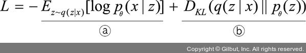

- 즉, 손실 함수에서 반환되는 값(reproduction_loss, KLD)을 수식처럼 모두 더하여 사용하는 것이 최종 손실 함수가 된다.

---
- 이제 모델 학습에 필요한 함수를 정의한다.
```py
# 13-18 모델 학습 함수 정의

# 텐서보드에서 사용할 경로
saved_loc = 'scalar/'
# (1)
writer = SummaryWriter(saved_loc)

model.train()

def train(epoch, model, train_loader, optimizer):
    train_loss = 0
    for batch_idx, (x, _) in enumerate(train_loader):
        x = x.view(batch_size, x_dim)
        x = x.to(device)

        optimizer.zero_grad()
        x_hat, mean, log_var = model(x)
        BCE, KLD = loss_function(x, x_hat, mean, log_var)
        loss = BCE + KLD
        # (2)
        writer.add_scalar("Train/Reconstruction Error", BCE.item(), batch_idx + epoch *
                         (len(train_loader.dataset)/batch_size))
        writer.add_scalar("Train/KL-Divergence", KLD.item(), batch_idx + epoch *
                         (len(train_loader.dataset)/batch_size))
        writer.add_scalar("Train/Total Loss", loss.item(), batch_idx + epoch *
                         (len(train_loader.dataset)/batch_size))

        train_loss += loss.item()
        loss.backward()
        optimizer.step()

        if batch_idx % 100 == 0:
            print('Train Epoch: {} [{}/{} ({:.0f}%)]\t Loss: {:.6f}'.format(
                  epoch, batch_idx * len(x), len(train_loader.dataset),
                  100. * batch_idx / len(train_loader),
                  loss.item() / len(x)))

    print("======> Epoch: {} Average loss: {:.4f}".format(
          epoch, train_loss / len(train_loader.dataset)))
```

#### (1)
- 텐서보드는 오차와 같은 주요 측정 항목들이 학습 과정에서 어떻게 변하는지 알고자 할 때 사용한다.
- 텐서보드를 사용하기 위해서는 먼저 SummaryWriter 인스턴스를 생성해야 한다.

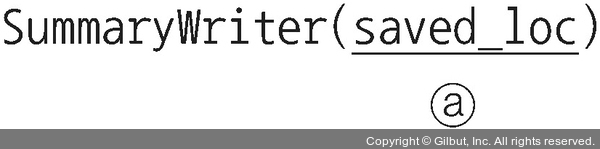

- 파라미터:
    - 첫 번째 파라미터: 측정 항목들의 변화(log)가 저장되는 경로로, 아무것도 지정하지 않는다면 기본값은 ./runs가 된다.

#### (2)
- 텐서보드에 오차 등 주요 측정 항목의 결과를 출력할 때 사용하는 것이 add_scalar 함수이다.

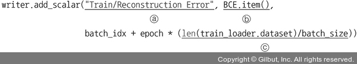

- 파라미터:
    - 첫 번째 파라미터: 태그(tag)로 어떤 값을 기록할지에 대한 구분자로 그래프 제목을 의미한다. 예제에서는 훈련 데이터셋에 대한 재구성 오차(reconstruction error)를 구분자(혹은 태그)로 지정한다.
    - 두 번째 파라미터: 텐서보드에서 확인하고자 하는 값으로 그래프 y축에 해당한다.
    - 세 번째 파라미터: 그래프 x축을 의미한다.

---
- 테스트 데이터셋을 이용해서 모델을 평가하기 위한 함수를 정의한다.
```py
# 13-19 모델 평가 함수 정의

def test(epoch, model, test_loader):
    model.eval()
    test_loss = 0
    with torch.no_grad():
        for batch_idx, (x, _) in enumerate(test_loader):
            x = x.view(batch_size, x_dim)
            x = x.to(device)
            x_hat, mean, log_var = model(x)
            BCE, KLD = loss_function(x, x_hat, mean, log_var)
            loss = BCE + KLD
            
            # 테스트 데이터셋에 대해서도 오차를 로그에 저장
            writer.add_scalar("Test/Reconstruction Error", BCE.item(), batch_idx +
                              epoch * (len(test_loader.dataset)/batch_size))
            writer.add_scalar("Test/KL-Divergence", KLD.item(), batch_idx + epoch *
                              (len(test_loader.dataset)/batch_size))
            writer.add_scalar("Test/Total Loss", loss.item(), batch_idx + epoch *
                              (len(test_loader.dataset)/batch_size))
            test_loss += loss.item()

            if batch_idx == 0:
                n = min(x.size(0), 8)
                comparison = torch.cat([x[:n], x_hat.view(batch_size, x_dim)[:n]])
                grid = torchvision.utils.make_grid(comparison.cpu())
                writer.add_image("Test image - Above: Real data, below: reconstruction data", grid, epoch)
```
- 모델 학습시킨다.
```py
# 13-20 모델 학습

from tqdm.auto import tqdm
for epoch in tqdm(range(0, epochs)):
    train(epoch, model, train_loader, optimizer)
    test(epoch, model, test_loader)
    print("\n")
    
# (1)
writer.close()
```
- (1): 학습이 종료된 후에는 writer 객체를 close하여 값을 저장한다. close하지 않으면 loss 값이 저장되지 않으니 주의한다.

- 모델 학습 결과:
```

```
- 이제 텐서보드에서 오차가 변화되는 과정을 살펴보자.
```py
# 13-21 텐서보드에서 오차 확인

# (1)
%load_ext tensorboard
# (2)
%tensorboard --logdir scalar --port=6013
```

#### (1)
- %로 시작하는 것을 매직 커맨드(magic command)라고 한다.
- 즉, %를 사용하면 터미널(anaconda prompt) 명령어를 주피터 노트북에서 사용할 수 있도록 해 준다.
- 참고로 터미널에서는 %를 사용하지 않는다.
- %로 시작하는 명령어를 사용하여 텐서보드를 실행한다.

#### (2)
- 텐서보드에서 로그를 보여 준다.

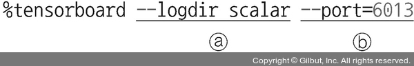

- 사용되는 파라미터:
    - --logdir: 오차 등 데이터가 저장된 위치
    - 터미널에서 커맨드를 실행하면 ‘http://localhost:6013/ 주소에서 텐서보드를 확인’하라는 결과가 출력된다. 즉, 웹 브라우저에서 텐서보드를 확인할 때 사용하는 포트 번호이다. 필요에 따라 포트 번호를 바꿀 수 있으며 기본 포트 번호는 6006이지만 예제에서는 6013을 사용한다.

---
- 텐서보드에 출력되는 각각의 오차는 다음과 같다.
- 훈련에 대한 오차 (KLD 오차):

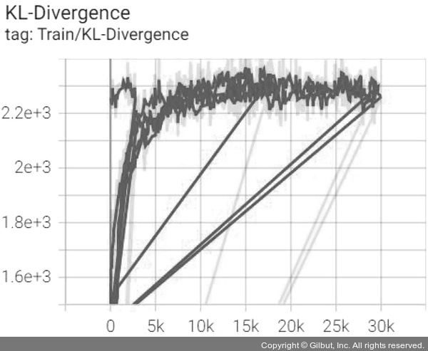

- 재구성 오차:

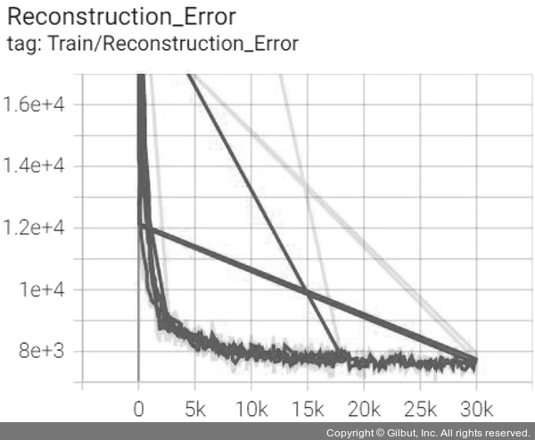

- 전체 오차:

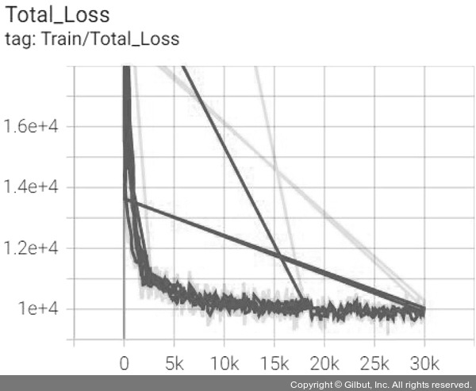

- 오차 결과 KLD와 재구성 오차가 반비례하면서 전체 오차는 에포크가 진행될수록 작아지는 것을 확인할 수 있다.
- 재구성 오차가 감소하고 있는 것으로 보아 기존 이미지를 이용한 새로운 이미지 생성이 잘 진행되고 있음을 유추해 볼 수 있다.
- 또한, KLD가 증가하는 것이 아니라 일정 범위에서 수렴하는 것으로 보아 가 와 가까워지고 있음을 의미한다.
- 테스트 데이터셋에 대한 KLD 오차:

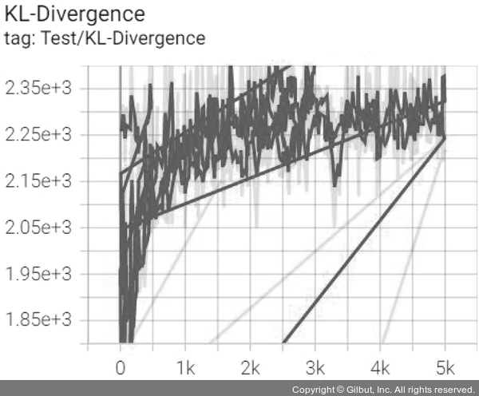

- 테스트 데이터셋에 대한 재구성 오차:


- 테스트 데이터셋에 대한 전체 오차:

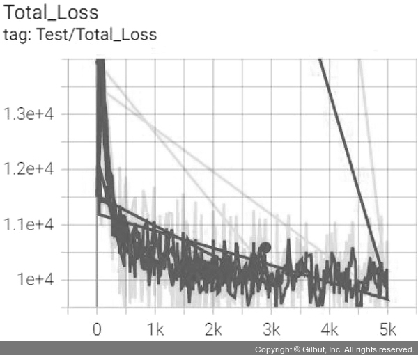

- 훈련 데이터셋과 마찬가지로 KLD와 재구성 오차는 반비례 관계를 가지며 전체 오차는 에포크가 진행되면서 줄어들고 있다.
- 기존 이미지를 이용한 새로운 이미지가 잘 생성되고 있음을 의미한다.