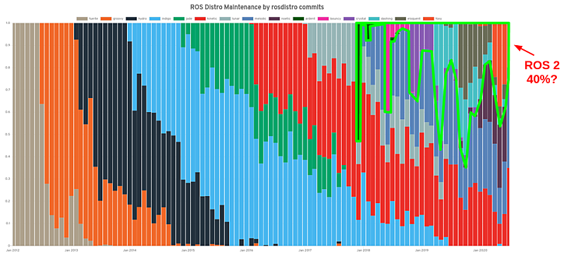
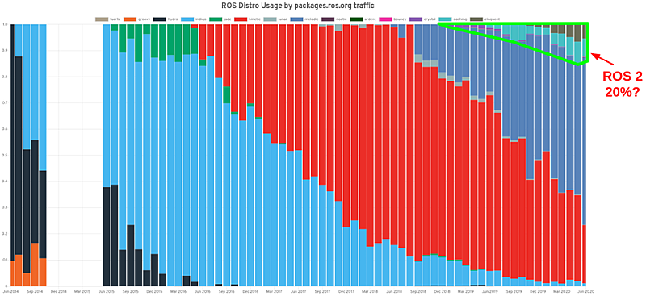
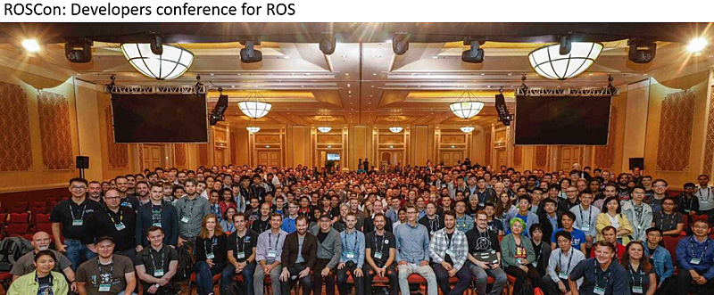
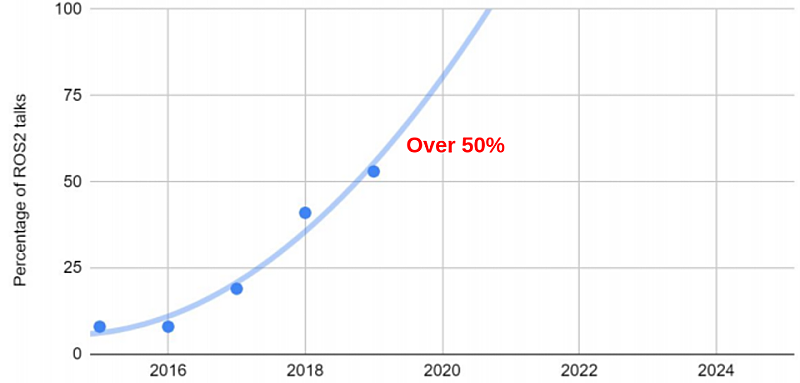
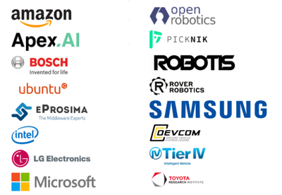

# Chapter 03: 왜 ROS 2로 가야하는가?
## 01. 왜 ROS 2로 가야하는가?
- `ROS 1`을 잘 쓰고 있는데 `ROS 2`라는 것도 있데... 근데 지금 이 시점에서 `ROS 2`로 가야할까?
- 이런 고민을 하고 있는 분들이 주변에 꽤나 많다.
- ROS를 처음 시작하시는 분들에게는 쿨하게~ "ROS 2로 시작하시면 됩니다."라고 말하면 된다.
- 'ROS 2'를 추천 드리면 많은 분들이 "내가 테스터가 되는거 아니냐?", "나만 서둘러 피해를 보지는 않느냐?", "퍼스트 펭귄이 되어야 하냐?"라고 말한다.

- 하지만 이미 ROS 2는 2014년에 3월에 첫 운을 띄고 개발이 시작되었으며, 2015년 알파 버전이 릴리즈되었고, 1년이 넘는 시간 동안 8번에 걸쳐 알파 버전이 8번째까지 릴리즈 되었으며, 2016년~2017년에 걸쳐 베타 버전이 작업되었고, 2017년 12월 첫 공식 버전인 `ROS 2 Ardent Apalone`이 세상에 나왔다.
- 그리고 지금은 2020년 5월에 릴리즈된 ROS 2 Foxy Fitzroy 까지 총 6개의 공식 배포판이 나와 있는 상태이다.
- 첫 개발 시작부터 7년이 지나 널리 사용되기 시작한 ROS 2 사용을 두고 어떻게 빠른 시기라고 말할 수 있을까? 이미 ROS 2는 주류가 되고 있다.

## 02. 대세는 이제 ROS 2
### 2-1. ROS 1 마지막 버전 선언
- 2020년 05월 23일 ROS 1의 13번째 버전인 Noetic Ninjemys 이 릴리즈 되었다.
- 이번 릴리즈와 함께 Open Robotics 및 ROS 커뮤니티에서는 이 버전이 마지막 ROS 1 버전의 배포판이라고 선언하였다.
- 2007년부터 개발이 시작된 ROS 1은 2020년 마지막 버전을 공식 선언하게 된 것이다.
- 참고로 EOL 2025년까지이지만 Kinetic 이후 지금까지 4년 동안 ROS 1의 핵심 코드의 개발은 멈춘지 오래이고 단순 유지 관리 보수 기간일 뿐이다.

### 2-2. 각 ROS 배포판의 사용률 (개발자 중심)
- 릴리즈를 위한 ROSDISTRO 리포지토리에 대한 커밋수로 알아본 ROS 배포판의 사용률을 보면 하기 그래프와 같이 2018년 이후 지속적으로 증가세임을 확인할 수 있다.
- 이 지표에서 ROS 개발자 사이에서 얼마나 ROS 2의 비중이 높아지는지 짐작할 수 있다.

### 2-3. 각 ROS 배포판의 사용률 (사용자 중심)
- 다음 그래프는 패키지 다운로드 수를 통해 알아본 ROS 배포판의 사용률이다.
- 위에서 언급한 그래프와는 사뭇 다른데 이는 개발자 중심보다는 사용자 중심이라고 볼 수 있다.
- 위 그래프보다는 좀 늦은 2019년부터 사용이 시작되고 지금에 와서는 약 20%대 정도로 점점 사용률이 증가하고 있다는 것을 확인할 수 있으며, 지금까지 많이 사랑 받던 ROS 1의 Kinetic Kame (아래 그래프의 빨간색)와 비슷한 수준이 되고 있다는 것을 알 수 있다. 

### 2-4. ROS 2 관심 (커뮤니티)
- ROS 커뮤니티에서 1년 중 가장 중요한 행사는 ROS 개발자 컨퍼런스인 ROSCon 이다.
- ROSCon은 아래 단체 사진과 같이 600 여명의 ROS 개발자와 사용자들이 한 자리에 모여 다양한 주제로 발표를 진행하고 ROS의 미래에 대해 이야기 나누는 자리이다.
- ROS 2에 대한 공식적인 개발 언급도 ROSCon2014에서 발표되었다.
- 그 뒤 꾸준하게 늘더니 작년 ROSCon2019에서는 발표 주제의 50% 이상이 ROS 2일 정도로 커뮤니티에서 큰 관심를 보였다.
- ROSCon2014에서는 2건으로 시작하더니 ROSCon2019에서는 17건의 발표가 있을 정도로 꾸준히 늘고 있다.
- 앞으로의 ROSCon에서는 그 증가 추세가 더 세질 것으로 보인다.

### 2-5. ROS 2 관심 (회사)
- ROS 2에 관심을 보이는 것은 개인만이 아니다.
- ROS 초창기부터 꾸준히 많은 기업들이 관심을 가지고 있었는데 ROS 2에 와서는 단순히 관심에 그치지 않고 ROS 2 TSC(Technical Steering Committee) 를 결성하여 ROS 커뮤니티 서포트 뿐만이 아니라 ROS 2 개발에도 매우 큰 공헌을 하고 있다.
- 현재 ROS 2 TSC의 멤버는 하기와 같이 17 회사 및 단체

## 03. ROS 2 중요 컨셉 및 특징
- 앞선 자료와 같이 개발자, 커뮤니티 구성원, 회사들의 ROS 2에 대한 관심도가 높아지고 실제 사용률 및 개발 투입에 대한 좋은 지표를 확인해 볼 수 있었다.
- 이들이 관심을 갖고 이용하는데에는 다 이유가 있을 것이다.
- 그리고 그 이유는 " 왜? 'ROS 2'로 가야하는가?" 에 대한 답일 것이다.
- Open Robotics 에서는 ROS 2를 사용해야하는 이유에 대해 다음과 같이 공개하였는데 이번 강좌는 일단 항목만 나열해보고 다음 강좌에서 ROS 2 컨셉과 특징을 함께 설명하면서 더 자세히 다루도록 하겠다.

1. Shorten time to market
2. Designed for production
3. Multi-platform
4. Multi-domain
5. No vendor lock-in
6. Built on open standards
7. Permissive open source license
8. Global community
9. Industry support
10. Interoperability with ROS 1

[출처] 003 왜? 'ROS 2'로 가야하는가? (오픈소스 소프트웨어 & 하드웨어: 로봇 기술 공유 카페 (오로카)) | 작성자 표윤석