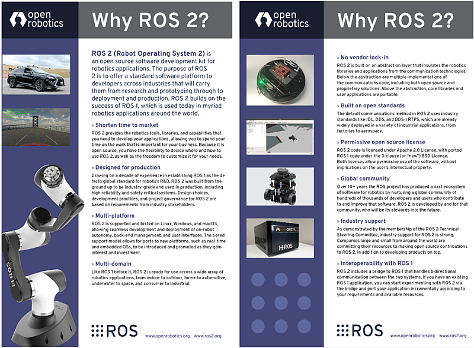

# Chapter 04: ROS 2의 중요 컨셈과 특징
## 01. Why ROS 2?
- Open Robotics 에서는 ROS 2를 사용해야하는 이유에 대해 2019년 5월에 "Why ROS 2"이라는 이름으로 다음과 같은 문서를 공개하였다.
- 이는 기술적인 내용이 중심이였던 기존 ROS 2 디자인 문서와는 달리 개발자가 아닌 사용자에게 전달하는 문서 톤으로 작성되었다.
- 이 문서는 ROS 1을 사용 중인 사용자들에게 보내는 ROS 2 TSC 멤버들의 메시지라고 볼 수 있다.
- 이는 Open Robotics의 CEO인 Brian Gerkey가 2019년 2월에 초안을 작성하였고 그 당시 ROS 2를 개발, 사용 중에 있는 실질적인 사용자인 ROS 2 TSC 멤버들의 의견을 오랜 기간(3달 정도) 수렴하여 작성된 문서로 ROS 2 활성화를 염두하여 제작된 문서이다.
- ROSCon2014, 2015 에서 발표된 ROS 2 에서 바뀌는 부분보다 더 구체적이고 실질적으로 체감할 수 있는 부분으로 10가지로 압축 정리된 항목이다.

1. Shorten time to market
2. Designed for production
3. Multi-platform
4. Multi-domain
5. No vendor lock-in
6. Built on open standards
7. Permissive open source license
8. Global community
9. Industry support
10. Interoperability with ROS 1

## 02. 왜 ROS 2인가?
- ROS 2 (Robot Operating System 2)는 로봇 응용 프로그램을 위한 오픈소스 소프트웨어 개발 키트이다.
- ROS 2의 목적은 로봇 산업 전반의 개발자에게 연구 및 프로토 타이핑에서 배포 및 생산에 이르는 표준 소프트웨어 플랫폼을 제공하는 것이다.
- ROS 2는 오늘날 전 세계 수많은 로봇 응용 프로그램에서 사용되는 ROS 1의 성공과 2007년 이후 10년이 넘는 기간동안 쌓은 노하우를 기반으로 한다.

### 01. 시장 출시 시간 단축
- ROS 2는 로봇 응용 프로그램을 개발하는 데 필요한 도구, 라이브러리 및 기능을 제공하므로 본연의 중요한 로봇 개발 작업에 더 많은 시간을 할애할 수 있다는 것이 가장 큰 장점이다.
- 특정 로봇 개발을 위해 처음부터 프레임워크를 만들고 통신 방법을 선정하고 디버깅 툴과 시각화 툴을 다시 만드는 비요율적인 방법에서 벗어날 수 있게 한다.
- 더불어 ROS 2는 상용 소프트웨어가 아닌 ROS 커뮤니티에서 개발해오고 있는 오픈소스이기 때문에 ROS 2를 사용할 부분과 사용 방법을 유연하게 결정할 수 있을 뿐만 아니라 필요에 따라 자유롭게 수정할 수 있다.

### 02. 생산을 위한 설계
- ROS는 로보틱스 R&D의 사실 상의 글로벌 표준으로서 ROS 1의 10년의 경험을 바탕으로, ROS 2는 처음부터 산업용 수준으로 개발되고 높은 신뢰성과 안전을 중시하고 있다.
- ROS 1의 아카데믹 성격과는 달리 ROS 2는 프로토 타이핑 개발부터 실제 생산에 이르기 위해 ROS 2의 설계, 개발 및 프로젝트 관리는 업계 이해 관계자들로부터 얻은 실직적인 요구 사항을 기반으로 하고 있다.

### 03. 멀티 플랫폼
- ROS 2는 Linux, Windows 및 macOS에서 지원 및 테스트 진행하고 있기에 자율성, 백엔드 관리 및 사용자 인터페이스의 원활한 개발 및 배포가 가능하다.
- 계층형 지원 모델을 사용하고 있기에 실시간 운영체제(Real-time OS) 및 임베디드 OS(Embedded OS)와 같은 새로운 플랫폼으로의 포팅에 대한 관심과 투자를 통해 도입 및 홍보도 할 수 있다.

### 04. 다중 도메인
- 이전의 ROS 1과 마찬가지로 ROS 2는 실내에서 실외, 가정에서 자동차, 수중에서 우주, 소비자에서 산업에 이르기까지 다양한 로봇 응용 분야에서 사용할 수 있다.

### 05. 벤더 선택 가능
- ROS 2는 로봇공학 라이브러리와 응용 프로그램을 통신 기능으로부터 분리하여 추상화 작업을 해두었다.
- 추상화된 부분에는 오픈소스 솔루션 방식과 독점 솔루션을 포함한 여러 가지 방법론을 제공하며 그 이외의 핵심 라이브러리 및 사용자 애플리케이션은 사용자가 원하는 형태로 개발, 수정하여 추상화 위에 추가 가능하다.

### 06. 공개 표준 기반
- ROS 2의 기본 통신 방법은 IDL, DDS 및 DDS-I RTPS과 같이 제조 산업에서 항공 산업까지도 사용되고 있는 산업 표준을 사용하고 있다.

### 07. 자유 재량 허용 범위가 넓은 오픈소스 라이센스 채택
- ROS 2 코드는 Apache 2.0 라이센스를 기본 라이센스로 사용하여 지적 재산권에 영향을 주지 않으면서 자유 재량으로 넓은 범위로 사용 가능하다.

### 08. 글로벌 커뮤니티
- ROS 커뮤니티는 10년 이상 ROS 프로젝트는 소프트웨어에 기여하고 개선하는 수십만 명의 개발자와 사용자로 구성된 글로벌 커뮤니티를 육성함으로써 로봇 공학을 위한 방대한 소프트웨어 에코 시스템을 만들어 왔다.
- ROS 2는 커뮤니티를 위해, 커뮤니티에 의해 개발되었다.

### 09. 산업 지원
- ROS 2 기술 운영위원회(ROS 2 Technical Steering Committee)의 멤버쉽에서 알 수 있듯이 ROS 2에 대한 업계 지원은 강력하다.
- 전 세계의 크고 작은 회사는 제품을 개발할 뿐만 아니라 ROS 2에 오픈소스 기여를 하기 위해 자원을 투입하고 있다.

### 10. ROS 1과의 상호 운용성 확보
- ROS 2에는 두 시스템 간의 양방향 통신을 처리하는 ROS 1에 대한 브리지가 포함되어 있다.
- 기존 ROS 1 애플리케이션이 있는 경우 브리지를 통해 ROS 2 테스트를 시작하고 요구 사항 및 사용 가능한 자원에 따라 점차적으로 애플리케이션을 포팅할 수 있다.

[출처] 004 ROS 2의 중요 컨셉과 특징 (오픈소스 소프트웨어 & 하드웨어: 로봇 기술 공유 카페 (오로카)) | 작성자 표윤석