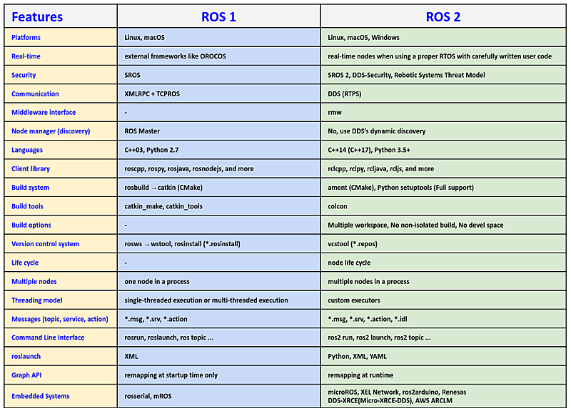

# Chapter 05: ROS 1과 2의 차이점을 통해 알아보는 ROS 2의 특징
## 01. ROS 2
- 2017년 12월 8일에 OpenRobotics 의해 공개된 ROS 2는 기존의 ROS와 호환되지 않는 새로운 ROS 시스템이다.
- 여기에서는 ROS 2가 개발된 경위에 대해 설명한 후 기존의 ROS(이하 ROS 1으로 표기)와 ROS 2의 기능 차이를 설명하고 새롭게 추가 된 기능에 대해 알아보자.
    - 2024.05.23 - ROS 2 Jazzy Jalisco (LTS, 5 years support) 
    - 2023.05.23 - ROS 2 Iron Irwini
    - 2022.05.23 - ROS 2 Humble Hawksbill (LTS, 5 years support)
    - 2021.05.23 - ROS 2 Galactic Geochelone
    - 2020.06.05 - ROS 2 Foxy Fitzroy release (LTS, 3 years support)
    - 2019.11.22 - ROS 2 Eloquent Elusor release
    - 2019.05.31 - ROS 2 Dashing Diademata release (First LTS, 2 years support)
    - 2018.12.14 - ROS 2 Crystal Clemmys release
    - 2018.07.02 - ROS 2 Bouncy Bolson release
    - 2017.12.08 - ROS 2 Ardent Apalone release (1st version)

    - 2017.09.13 - ROS2 Beta3 release (code name R2B3)
    - 2017.07.05 - ROS2 Beta2 release (code name R2B2)
    - 2016.12.19 - ROS2 Beta1 release (code name Asphalt)

    - 2016.10.04 - ROS2 Alpha8 release (code name Hook.and.Loop)
    - 2016.07.14 - ROS2 Alpha7 release (code name Glue Gun)
    - 2016.06.02 - ROS2 Alpha6 release (code name Fastener)
    - 2016.04.06 - ROS2 Alpha5 release (code name Epoxy)
    - 2016.02.17 - ROS2 Alpha4 release (code name Duct tape)
    - 2015.12.18 - ROS2 Alpha3 release (code name Cement)
    - 2015.11.03 - ROS2 Alpha2 release (code name Baling wire)
    - 2015.08.31 - ROS2 Alpha1 release (code name Anchor)

- ROS 1은 2007년에 개발이 시작되어 지금은 대학, 연구 기관, 산업계, 로봇 자작의 취미 활동까지 폭넓게 이용되고 있다.
- 원래 ROS 1은 Willow Garage사가 개인 서비스 로봇인 PR2 개발에 필요한 미들웨어 형태의 로봇 개발 프레임워크를 다양한 개발 툴과 함께 오픈 소스로 공개 한 것으로 시작하였다.
- 따라서 개발 환경으로는 PR2의 초기 컨셉을 그대로 이어받아 다음과 같은 제한 사항이 있었다.
    - 단일 로봇
    - 워크스테이션급 컴퓨터
    - Linux 환경
    - 실시간 제어 지원하지 않음
    - 안정된 네트워크 환경이 요구됨
    - 주로 대학이나 연구소와 같은 아카데믹 연구 용도

- 위의 개발 환경은 PR2 개발 당시 설정된 것이며, 오늘날 요구되는 로봇 개발 환경과는 큰 차이가 있다.
- 예를 들어, 최근의 ROS 1은 종래 가장 많이 이용되고 있던 학술분야뿐만 아니라, 제조 로봇, 농업 로봇, 드론, 소셜 로봇과 같은 상용 로봇 등으로 이용되고 있다.
- 극단적인 예로 NASA가 국제 우주 정거장에서 사용한 Robonaut에는 ROS 1가 채용되고 있지만, 거기에서는 실시간 제어가 요구되었고 이를 위해서 ROS 1을 수정하여 사용하였다.
- 이러한 새로운 로봇 개발 환경 및 요구되는 기능을 정리하면 다음과 같다.
    - 복수대의 로봇
    - 임베디드 시스템에서의 ROS 사용
    - 실시간 제어
    - 불안정한 네트워크 환경에서도 동작 할 수 있는 유연함
    - 멀티 플랫폼 (Linux, macOS, Windows)
    - 최신 기술 지원 (Zeroconf, Protocol Buffers, ZeroMQ, WebSockets, DDS 등)
    - 상업용 제품 지원

- ROS 1에서 이러한 새롭게 요구되는 기능을 제공하려면 대규모 API의 변경이 필요하다.
- 그러나 기존의 ROS 1과의 호환성을 유지하면서 수 많은 새로운 기능을 추가하는 것은 쉽지 않았다.
- 또한, 기존의 ROS 1을 문제 없이 이용하고 있는 사용자에게는 큰 API의 변경은 바람직하지 않다.

- 그래서 ROS의 차세대 기능을 도입한 버전을 ROS 2라고, ROS 1에서 분리하여 개발하게 된 것이다.
- 기존의 ROS1 사용자는 필요하다면 그대로 ROS 1을 이용할 수 있다.
- 한편, 새로운 기능이 필요한 사용자는 ROS 2를 선택하면 된다.
- 또한, ROS 1과 ROS 2 사이에서 서로 메시지 통신이 가능한 브리지 프로그램 (ros1_bridge) 제공되므로 두 버전 모두를 함께 사용하는 것도 가능하다.

## 02. ROS 1과 ROS 2의 차이점



- ROS 2는 ROS 1과 기본 개념은 같지만 완전히 새롭게 처음부터 새로 짠 소프트웨어 플랫폼이기에 ROS 1 과 ROS 2의 차이점을 설명한다는 것은 기본 개념을 제외한 모든 부분에 걸쳐서 ROS 2를 설명한다는 것과 다름이 없다.
- 이에 ROS 2를 사용해보며 경험한 내용 중 중요한 부분에 대하여 위와 같이 비교표로 작성하여 보았으며, 이번 강좌에서는 이 20개의 비교 항목에 대해 하나씩 훑어보며 ROS 2의 특징에 대해 각 항목별로 알아보도록 하자.

## 03. ROS 2의 특징
### 3-1. Platforms
- ROS 2부터는 3대 운영체제인 Linux, Windows, macOS를 모두 지원한다.
- 이는 바이너리 파일로 설치가 가능하다는 의미로 Windows 사용자가 많은 한국의 경우에는 반가운 소식으로 받아들이는 분들이 많을 것 같다.
- ROS 2 Foxy Fitzroy 기준으로 보았을 때 Linux는 Ubuntu Focal (20.04), Windows는 Windows 10 버전, macOS는 Mojave (10.14)버전을 지원하고 있다.
- Linux의 경우에는 Linux 배포판중 일반 사용자가 가장 많은 Canonical의 Ubuntu 진영에서 ROS 2 TSC로 가입되어 있어서 관련된 내용을 많이 볼 수 있다.
- 리눅스 이용자라면 Canonical에서 연재 중인 내용을 참고하면 ROS 2 사용에 도움이 될 듯싶다.
- 그리고 Linux, macOS는 ROS 1 부터 지원하고 있었는데 이번 ROS 2에서는 Microsoft가 ROS 2 TSC로 들어오고 Windows용 패키지 및 테스트, Visual Studio Code Extension for ROS까지 준비하는 등 굉장한 노력을 기울여 Windows 사용자들도 ROS 2를 쉽게 사용할 수 있게 되었다.
- Windows 사용자라면 Windows 관련 문서를 참고하기를 추천한다.

### 3-2. Real-time
- ROS 2는 Real-time을 지원한다.
- 단, 선별된 하드웨어 사용, 리얼타임 운영체제 사용, DDS의 RTPS(Real-time Publish-Subscribe Protocol)와 같은 통신 프로토콜을 사용, 매우 잘 짜여진 리얼타임 코드 사용을 전제로 실시간성을 지원하고 있다.
- 이 부분은 ROSCon2019의 Pre-conference Workshops으로 진행되었던 `Doing real-time with ROS 2: Capabilities and challenges`에서 자세히 설명되었는데 이 부분의 내용은 이 강좌에서 설명하기에는 내용이 많아 상당히 길어질 것 같으므로 다른 후속 강좌를 통해 다뤄보도록 하겠다.

### 3-3. Security
- ROS 1에서는 항상 보안이 문제였다.
- 노드를 관리하는 ROS master의 하나의 IP와 포트만 노출되면 모든 시스템을 죽일 수 있었으며, 보안 입장에서는 TCPROS는 뻥 뚫린 큰 구멍에 가까웠다.
- 하지만 ROS 1은 이러한 부족한 부분을 매우기 보다는 로봇 개발에 사용되는 다양한 하드웨어와 소프트웨어를 평가하고 작동하는 유연성에 더 무게를 두었고 이러한 유연성은 보안에 대한 기회비용보다 더 중요하게 여겼다.
- 즉, 보안 이슈는 개발 우선 순위에서 뒤져 있었다.
- 당연히 ROS 초창기에는 이 선택은 옳았다.
- 하지만 시간이 흘러 이러한 취약점은 상용 로봇에 ROS를 도입할 수 없게 만드는 첫번째 이유이자 가장 큰 걸림돌이 되었다.
- 이에 ROS 2에서는 디자인 설계부터 이 부분을 명확히 짚고 넘어갔다.
- 우선, TCP 기반의 통신은 OMG(Object Management Group)에서 산업용으로 사용 중인 DDS(Data Distribution Service)를 도입하였고, 자연스럽게 DDS-Security 이라는 DDS 보안 사양을 ROS에 적용하여 보안에 대한 이슈를 통신단부터 해결하였다.
- 또한 ROS 커뮤니티에서는 SROS 2(Secure Robot Operating System 2)라는 툴을 개발하였고 보안 관련 RCL 서포트 및 보안관련 프로그래밍에 익숙지 않은 로보틱스 개발자를 위해 보안을 위한 툴킷을 만들어 배포하고 있다.
- 이 부분에 대한 더 자세한 내용은 ROS 2 디자인 문서의 `Security` 관련 문서를 참고하길 바라며 지난 ROSCon2019에서의 워크샵에서 진행한 `Is your robot secure? ROS 1 & ROS 2 Security Workshop`의 문서도 참고하면 도움이 될 것 같다.
- 우리는 추후 강좌를 통해 직접 보안 설정 및 프로그램하는 실습을 진행해보기로 하자.

### 3-4. Communication
- ROS 1에서는 자체 개발한 TCPROS와 같은 통신 라이브러리를 사용하고 있던 반면, ROS 2은 리얼타임 퍼블리시와 서브스크라이브 프로토콜인 RTPS(Real Time Publish Subscribe)를 지원하는 통신 미들웨어 DDS를 사용하고있다.
- DDS는 OMG(Object Management Group)에 의해 표준화가 진행되고 있으며, 상업적인 용도에도 적합하다는 평가가 지배적이다.
- DDS에서는 IDL(Interface Description Language)를 사용하여 메시지 정의 및 직렬화를 더 쉽게, 더 포괄적으로 다룰 수 있다.
- 또한 통신 프로토콜로는 RTPS을 채용하여 실시간 데이터 전송을 보장하고 임베디드 시스템에도 사용할 수 있다.
- DDS는 노드 간의 자동 감지 기능을 지원하고 있어서 기존 ROS 1에서 각 노드들의 정보를 관리하였던 ROS마스터가 없어도 여러 DDS 프로그램간에 통신 할 수 있다.
- 또한 노드 간의 통신을 조정하는 QoS(Quality of Service) 매개 변수를 설정할 수 있어서 TCP 처럼 데이터 손실을 방지함으로써 신뢰도를 높이거나, UDP 처럼 통신 속도를 최우선하여 사용할 수도 있다.
- 이러한 다양한 기능을 갖춘 DDS를 이용하여 ROS1의 퍼블리시, 서브스크라이브 형 메시지 전달은 물론, 실시간 데이터 전송, 불안정한 네트워크에 대한 대응, 보안 강화 등이 강화되었다.
- DDS의 채용은 ROS1에서 ROS2로 바뀌면서 가장 큰 변화점이다.

### 3-5. Middleware interface
- 앞서 설명한 DDS는 다양한 기업에서 통신 미들웨어 형태로 제공하고 있다.
- 그 벤더로는 10 곳이 있는데 이 중 ROS 2를 지원하는 업체는 ADLink, Eclipse Foundation, Eprosima, Gurum Network, RTI로 총 5 곳이다.
- DDS 제품명으로는 ADLINK의 OpenSplice, Eclipse Foundation의 Cyclone DDS, Eprosima의 Fast DDS, Gurum Network의 Gurum DDS, RTI의 Connext DDS가 있다.
- 참고로 이 중 Gurum Network는 유일하게 대한민국 기업으로 DDS를 순수 국산 기술로 개발하여 상용화에 성공한 기업이다.
- ROS 2에서는 이러한 벤더들의 미들웨어를 유저가 원하는 사용 목적에 맞게 선택하여 사용할 수 있도록 ROS Middleware(RMW)형태로 지원하고 있다.
- 이는 각 벤더들의 미들웨어마다 API가 약간씩 달라도 ROS 2 유저들은 이를 생각하지 않고 통일된 코드로 쉽게 바꿔서 사용할 수 있도록 것으로, RMW는 여러 DDS 구현을 지원하기 위하여 API의 추상화 인터페이스로 지원하고 있다.

### 3-6. Node manager (discovery)
- ROS 1에서의 필수 실행 프로그램으로는 roscore가 있다.
- 이를 실행시키면 ROS Master, ROS Parameter Server, rosout logging node가 실행 되었다.
- 특히 ROS Master는 ROS 시스템의 노드들의 이름 지정 및 등록 서비스를 제공하였고, 각 노드에서 퍼블리시 또는 서브스크라이브하는 메시지를 찾아서 연결할 수 있도록 정보를 제공해 주었다.
- 즉, 각각 독립되어 실행되는 노드들의 정보를 관리하여 서로 연결해야 하는 노드들에게 상대방 노드의 정보를 건네주어 연결할 수 있게해 주는 매우 중요한 중매 역할을 수행했었다.
- 이 때문에 ROS 1에서는 노드 사이의 연결을 위해 네임 서비스를 마스터에서 실행했었어야 했고, 이 ROS Master가 연결이 끓기거나 죽는 경우 모든 시스템이 마비되는 단점이 있었다.
- ROS 2에서는 roscore가 없어지고 3가지 프로그램이 각각 독립 수행으로 바뀌었다.
- 특히, ROS Master의 경우 완전히 삭제되었는데 이는 DDS를 사용함에 따라 노드를 DDS의 Participant 개념으로 취급하게 되었으며, Dynamic Discovery 기능을 이용하여 DDS 미들웨어를 통해 직접 검색하여 노드를 연결 할 수 있게 되었다.

### 3-7. Languages
- ROS 2의 프로그램 언어로는 ROS 1과 마찬가지로 다양한 프로그래밍 언어를 지원할 예정이다.
- 아직까지는 C++, Python가 주력 언어라고 볼 수 있는데 이 주력 언어도 아래와 같이 큰 변화가 있었다.
- ROS 2 배포판마다 조금씩 다르기는 하지만 Foxy를 기준으로 보았을 때, 모던 C++ 이라 부르는 C++14를 기준으로 작업되었으며, 파이썬의 경우 Python 3.7를 기본 요구 사항으로 되어있다.
- 같은 언어를 쓰더라도 ROS 1을 사용했을 때에는 뭔가 올드한 느낌이었고 최신 언어들이 제공하는 기능들을 못쓰고 그림에 떡이였는데 이제는 최신의 아름다운 언어를 쓰는 기분이다.
    - ROS 1: C++03, Python 2.7
    - ROS 2: C++14 (C++17), Python 3.5+

### 3-8. Build system
- ROS 2에서는 새로운 빌드 시스템인 ament을 사용한다.
- ament는 ROS 1에서 사용되는 빌드 시스템인 catkin의 업그레이드 버전이다.
- ROS 1의 catkin이 CMake만을 지원했던 반면, ament는 CMake를 사용하지 않는 Python 패키지 관리도 가능하다.
- 즉, ROS 2에 와서는 Python 패키지는 비로서 처음으로 완전 독립을 이루게 되었는데 ROS 1에서 Python 코드가 있는 패키지는 setup.py 파일이 CMake 내에서 사용자 정의 로직으로 처리되었다.
- 하지만 ROS 2에서 Python 패키지는 setup.py 파일의 모든 기능을 순수 Python 모듈과 동등한 수준으로 개발할 수 있게 되었다.
- 마지막으로 TMI일 수 있으나 catkin과 ament는 이음동의어로 버드나무의 화수를 의미하며 ROS 1의 개발 주체인 Willow Garage 뒷 마당에 있던 버드나무 화수를 보고 지었다고 한다.
    - ROS 1: rosbuild → catkin (CMake)
    - ROS 2: ament (CMake), Python setuptools (Full support)

### 3-9. Build tools
- ROS 1의 경우 여러 가지 다른 도구, 즉 catkin_make, catkin_make_isolated 및 catkin_tools가 지원되었다.
- ROS 2에서는 알파, 베타, 그리고 Ardent 릴리스까지 빌드 도구로 ament_tools가 이용되었고 지금에 와서는 colcon을 추천하고 있다.
- colcon은 ROS 2 패키지를 작성, 테스트, 빌드 등 ROS 2 기반의 프로그램할 때 빼놓을 수 없는 툴로 작업흐름을 향상시키는 CLI 타입의 명령어 도구이다.
- 사용 방법은 `colcon test`와 `colcon build` 와 같이 터미널창에서 수행하게 되며 다양한 옵션을 사용할 수 있다.

### 3-10. Build options
- ROS 2에서는 빌드 관련 내용들이 모두 변경되면서 빌드 옵션에도 새로운 변화가 생겼다.
- 그중 사용하면서 가장 좋았던 3가지를 꼽자면 아래와 같다.

#### 1. `Multiple workspace`
- 이는 ROS 1에서는 `catkin_ws`와 같이 특정 워크스페이스를 확보하고 하나의 워크스페이스에서 모든 작업을 다 했는데 ROS 2에서는 복수의 독립된 워크스페이스를 사용할 수 있어서 작업 목적 및 패키지 종류별로 관리할 수 있게 되었다.

#### 2. `No non-isolated build`
- ROS 1에서는 하나의 CMake 파일로 여러 개의 패키지를 동시에 빌드 할 수 있었다.
- 이렇게 하면 빌드 속도가 빨라지지만 모든 패키지의 종속성에 신경을 많이 써야 하고 빌드 순서가 매우 중요하게 된다.
- 또한 모든 패키지가 동일 네임스페이스 사용하게 되므로 이름에서 충돌이 발생할 수 있었다.
- ROS 2에서는 이전 빌드 시스템인 catkin에서 일부 기능으로 사용되었던 `catkin_make_isolated` 형태와 같은 격리 빌드만을 지원함으로써 모든 패키지를 별도로 빌드하게 되었다.
- 이 기능 변화를 통해 설치용 폴더를 분리하거나 병합할 수 있게 되었다.

#### 3. `No devel space`
- catkin은 패키지를 빌드 한 후 devel 이라는 폴더에 코드를 저장한다.
- 이 폴더는 패키지를 설치할 필요 없이 패키지를 사용할 수 있는 환경을 제공한다.
- 이를 통해 파일 복사를 피하면서 사용자는 파이썬 코드를 편집하고 즉시 코드 실행할 수 있었다.
- 단 이러한 기능은 매우 편리한 기능이지만 패키지를 관리하는 측면에서 복잡성을 크게 증가시켰다.
- 이에 ROS 2에서는 패키지를 빌드 한 후 설치해야 패키지를 사용할 수 있도록 바뀌었다.
- 단 쉬운 사용성도 고려하여 colcon 사용 시에 `colcon build --symlink-install` 와 같은 옵션을 사용하여 심벌릭 링크 설치의 선택적 기능을 사용하여 동일한 이점을 제공하고 있다.

### 3-11. Version control system
- ROS는 수 많은 소스 코드 공여자로부터 만들어가는 코드의 집합이기 때문에 개인은 물론 소속도 정말 다양하고 각 코드들의 리포지토리도 제각각이다.
- 예를 들어 어느 패키지는 GitHub를 이용하고 어떤 것은 Bitbucket를 이용한다.
- 그리고 사용하는 버전 관리 시스템(Version Control System, VCS)도 Git, Mercurial, Subversion, Bazaar 등 다양하다.
    - ROS 1: rosws → wstool, rosinstall (*.rosinstall)
    - ROS 2: vcstool (*.repos)

- ROS 커뮤니티에서는 이러한 다양한 리포지토리와 혼재된 버전 관리 시스템을 사용하더라도 ROS를 사용함에 있어서 불편함이 없도록 통합적인 툴이 필요했다.
- ROS 1에서는 처음에 rosws이라는 툴에서 wstool을 이용하였다가 최근 ROS 2에서는 vcstool으로 통합하였다.
- 현재 ROS 1에서도 vcstool를 사용하고 있는 상황이다.
- vcstool은 여러 리포지토리 작업을 보다 쉽게 관리할 수 있도록 설계된 버전 관리 시스템(VCS) 툴이다.
- 이 툴은 ROS 2를 소스코드로부터 설치해본 사람이라면 자신도 모르게 사용했을 것이다.
- 아래의 명령어 2줄을 살펴보자.
- 우선 wget을 통하여 ros2.repos라는 파일을 받게 되는데 이 파일에는 vcs 타입은 무었이고, 리포지토리 주소는 어떻게 되며, 설치해야하는 브랜치는 어떤 것인지가 명시된 파일이다.
- 이러한 정보가 기재된 *.repos 파일를 이용하여 다양한 리포지토리, 다양한 vcs를 지원하며 패키지들을 관리할 수 있도록 하는 것을 의미한다.
- 특히 ROS 2에서는 기존 vcs 툴을 통폐합하여 vcstool 이라는 이름으로 제공되어 사용에 매우 편리하게 되었다.
```
wget https://raw.githubusercontent.com/ros2/ros2/foxy/ros2.repos
vcs import src < ros2.repos
```

### 3-12. Client library
- ROS 기반의 프로그래밍을 작성한다는 것은 ROS 구조에서 유저 코드 영역(user land)을 다룬다는 것으로 그 밑에는 ROS 클라이언트 라이브러리 (ROS Client Library)이 있고, 이 클라이언트 라이브러리는 앞서 설명한 미들웨어(middleware interface)를 사용하고 있다는 것을 알고 있어야 한다.
- 여기서 유저는 개발 목적에 따라 C/C++, Python, Java, Node.js 등을 사용할 것이다.
- ROS 에서는 초창기 부터 이러한 멀티 프로그래밍 언어를 지원하고 있는데 ROS 1에서는 roscpp, rospy, roslisp 등 각 프로그래밍 언어에 대해 클라이언트 라이브러리 (Client Library)를 제공했다.
- 한편, ROS 2에서는 ROS 클라이언트 라이브러리를 RCL(ROS Client Library)이라는 이름으로 제공한다.
- 그리고 프로그래밍 언어별로 rclcpp, rclc, rclpy, rcljava, rclobjc, rclada, rclgo, rclnodejs 등으로 제공된다.
- 또한 ROS 2는 앞서 설명한바와 같이 C이면 C99, C++ 이라면 C++ 14, Python라면 Python 3 (3.5+) 등 최신 기술 사양에 대응하고 있다.
- 이어지는 강좌에서는 주로 rclcpp 및 rclpy를 사용할 예정이며 이전에 다루었던 ROS 1 강의와는 달리 ROS 2 강의에서는 주로 Python를 사용할 예정임을 미리 밝혀둔다.

### 3-13. Life cycle
- 로봇 개발에 있어서 로봇의 현재 상태를 파악하고 현재 상태에서 다른 상태로 변경되는 상태천이 제어는 수십년간 로봇공학에서도 주요 연구 주제로 다루었던 중요한 부분 중에 하나이다.
- 특히 태스크 수행 측면에서 현재의 상태 파악과 천이는 멀티 태스크 수행에서 빠질 수 없는 중요한 부분일 것이고 복수의 로봇 복수의 복합 태스크, 서비스 수행과 같은 상위 레벨의 프로그램일수록 더 중요하게 다루어지는 부분이다.
- ROS 1에서는 이러한 기능을 구현하기 위해서는 SMACH과 같은 상태 천이를 관리하는 독립적인 패키지를 사용했어야 했고 클라이언트 라이브러리에서는 상태 관리하는 부분이 없었기에 사용자가 임의로 클라이언트 라이브러리 부분까지 수정하여 사용했어야 했다.
- ROS 2에서는 이러한 니즈를 반영하여 패키지의 각 노드들의 현재 상태를 모니터링하고 상태를 제어 가능한 lifecycle을 클라이언트 라이브러리에 포함시켰으며 이를 통해 ROS 시스템 상태를 보다 효과적으로 제어 할 수 있게 되었다.
- 이를 이용하게 되면 기존 ROS 1에서는 할 수 없었던 노드의 상태를 모니터링하고 상태를 천이시키거나 노드를 상태에 따라 재시작하거나 교체할 수도 있게 된다.

### 3-14. Multiple nodes
- ROS 1의 초기에는 하나의 프로세스에서 여러 노드를 실행 할 수 없었다.
- 하지만 이러한 요구는 지속적으로 제기되었고 하나의 프로세스에서 여러 노드를 작성하기 위해 nodelet라는 새로운 기능이 ROS 1에 추가되었다.
- 이는 하드웨어 리소스가 제한적이거나 노드 간에 수 많은 메시지를 보내야 할 때 유용하게 사용되었다.
- ROS 2에서 nodelet이 사용되지는 않고 RCL에 포함되어 있다.
- 이름은 컴포넌트(components)라고 부르며 ROS 2에서는 이 컴포넌트를 사용하여 동일한 실행 파일에서 복수의 노드를 수행할 수 있게 되었다.
- 이를 사용하게 되면 노드의 실행 파일 수준은 더 세분화 시킬 수 있으며 프로세스 내 통신(intra-process communication)기능을 이용하여 ROS 2의 통신 오버 헤드를 제거 할 수 있어서 더 효율적인 ROS 2 응용 프로그램을 작성 가능하다.

### 3-15. Messages (topic, service, action)
- ROS 2에서도 기존 ROS 1의 메시지(Messages)과 마찬가지로 단일 데이터 구조를 메시지라고 정의하며 정해진 또는 사용자가 정의한 메시지를 사용할 수 있으며, 각 패키지 이름과 마찬가지로 이름과 각 지정된 형식으로 메시지를 고유하게 식별할 수 있다.
- 사용처도 기존과 마찬가지로 Topic, Service, Action 등에서 사용하며 기존과 비슷한 형태로 사용 가능하다.
- 여기에 ROS 2에서는 OMG(Object Management Group)에서 정의된 IDL(Interface Description Language)을 사용하여 메시지 정의 및 직렬화를 더 쉽게, 더 포괄적으로 다룰 수 있게 되었다.
- IDL을 이용하게 되면 기존 ROS 메시지 컨셉과 마찬가지로 다양한 프로그래밍 언어로 작성된 메시지를 사용할 수 있다.
- 이전에 CORBA (일명, 코바)를 써본 사람들은 IDL이 친숙할 것이다.
- ROS2에서는 기존 msg, srv, action 파일 이외에도 IDL을 지원한다.
- 그리고 ROS 2가 DDS를 채용하게 되면서 기존 메시지들과 DDS 규칙을 맞추는 작업이 진행되었다.
- ROS 2에서는 DDS를 사용하면서 메시지를 이용한 Topic, Service, Action 등의 컨셉은 변하지 않으나 사용 방법은 상당히 많이 바뀌었다.

### 3-17. Command Kine Interface
- 대부분의 CLI 타입의 명령어 사용법은 기존 ROS 1과 매우 비슷해서 약간의 이름 변경과 일부 옵션 사용법만 익힌다면 사용시 큰 차이는 없다.
- 자주 사용되는 명령어를 예를 들어 보자면 아래와 같은 차이 정도이다.
- ROS 1 명령어에 비해 명령어가 약간 길어진듯 보이긴 하지만 자주 쓰는 명령어는 "alias rt='ros2 topic list'"와 같이 설정하여 사용하면 되기에 큰 무리는 없다.
- 더욱이 ROS 2의 CLI 형태의 명령어는 ROS 2 TSC 멤버이자 Ubuntu 개발 업체인 Canonical이 담당하고 있어서 더욱 믿음이 간다.
    - ROS 1: 'rostopic list'
    - ROS 2: 'ros2 topic list'

### 3-18. reslaunch
- ROS의 실행 시스템은 대표적으로 `run`과 `launch`가 있는데 `run`은 단일 프로그램 실행, `launch`는 사용자 지정 프로그램 실행을 수행한다.
- 사용면에서는 `run`에 비해 다양한 설정을 할 수 있는 `launch` 사용이 월등히 사용 빈도가 높다.
- `launch`는 사용자가 실행하고자하는 프로그램의 각종 설정을 기술하고 기술된 설정에 맞추어 각종 프로그램을 실행하도록 도와준다.
- 사용자가 지정하는 설정에는 실행할 프로그램, 실행할 위치, 전달할 인수 등 시스템 전체의 구성 요소를 쉽게 재사용 할 수 있도록 하고있다.
- 그 목적과 컨셉은 ROS 2에서도 크게 다르지 않다.
- ROS 1과 ROS 2의 차이점을 살펴보면 다양한 파일 사용이다.
- ROS 1에서는 `roslaunch` 파일이 특정 `XML` 형식을 사용해었다.
- 이 형식을 이용해도 다양한 설정을 추가하여 프로그램을 실행 시킬 수 있어서 매우 편했는데, ROS 2에서는 `XML` 형식 이외에도 `Python`이 새롭게 채용되어 조건문 및 Python 모듈을 추가로 사용하여 보다 복잡한 논리와 기능을 사용할 수 있게 되었다.

### 3-19. Graph API
- ROS 1에서 `rqt_graph` 툴을 자주 사용했을 것이다.
- 이는 ROS에서 각 노드와 토픽, 메시지 등이 고유의 이름을 가지고 있고 매핑이 이루어져 각 노드와 노드간의 토픽, 메시지의 관계를 그래프화 시킬 수 있었기 때문이다.
- 단, 한가지 불편한 점은 ROS 1에서는 시작할 때만 노드와 토픽간의 매핑이 이루어져서 그 관계를 그래프로 표현할 수 있었기 때문에 실시간으로 변화되는 그래프를 볼 수 없었다.
- 이에 ROS 2에서는 노드 시작할 때뿐만 아니라 실행 도중에 다시 매핑도 가능하며, 그 결과를 바로 그래프로 표현할 수 있게하려 하고 있다.
- 단, 현 시점에서는 개발 컨셉만이 나왔고 아직 구현되지는 않았다.

### 3-20. Embedded Systems
- 로봇 개발에 있어서 실시간성을 담보 받으며 모터 및 센싱을 제어하는 부분은 매우 중요하게 다루어져 왔다.
- 이 강좌 초반에서 언급했듯이 ROS 커뮤니티에서도 이를 위해 ROS 2에서는 선별된 하드웨어 사용, 리얼타임 운영체제 사용, DDS의 RTPS(Real-time Publish-Subscribe Protocol)와 같은 통신 프로토콜을 사용, 매우 잘 짜여진 리얼타임 코드 사용을 전제로 실시간성을 지원하고 있다.
- 하지만 실시간성이라는 것은 상위 소프트웨어에서 다루기에는 제약이 많다.
- 오히려 Embedded Systems 안에서 해결하는게 더 적합하다고 보고 있다.
- 이에 ROS 2 개발 초기부터 Embedded Systems에 대한 관심이 높았는데 초기 개발 컨셈은 ROS의 창시자인 Morgan Quigley가 ROSCon2015에서 `ROS 2 on “small” embedded systems`이라는 이름으로 발표한 자료 및 영상을 보면 도움이 될 것이다.
- ROS 1에서도 Embedded Systems을 지원하지 않는 것은 아니였다.
- 단, 매우 기초적인 수단이라고 볼 수 있는 임베디드 보드와 메시지를 주고 받을 때 시리얼(rosserial)로 통하여 통신하였다.
- ROS 2에서는 한발 더 나아가 기존 시리얼 통신, 블루투스 및 와이파이 통신을 지원하거나 RTOS (Real-Time Operating System)를 사용하고 기존 DDS 대신 eXtremely Resource Constrained Environments (DDS-XRCE)를 사용 하는 등 임베디드 보드에서 직접 ROS 프로그래밍을 하여 하드웨어 펌웨어로 구현된 노드를 실행할 수도 있다.
- 이 방법론에는 여러 가지가 있을 수 있는데 현재 ARM 사를 포함한 다양한 MCU 제조 업체에서 이를 지원하기 위하여 다양한 방법론을 내놓고 있는 상태이고, eProsima, BOSCH, ROBOTIS, FIWARE, Amazon, Renesas 등에서 다양한 임베디드 지원 방법에 대해 개발, 공개하고 있다.
    - ROS 1: rosserial, mROS
    - ROS 2: micro-ROS, XEL Network, ros2arduino, Renesas, DDS-XRCE(Micro-XRCE-DDS), AWS ARCLM

[출처] 005 ROS 1과 2의 차이점을 통해 알아보는 ROS 2의 특징 (오픈소스 소프트웨어 & 하드웨어: 로봇 기술 공유 카페 (오로카)) | 작성자 표윤석