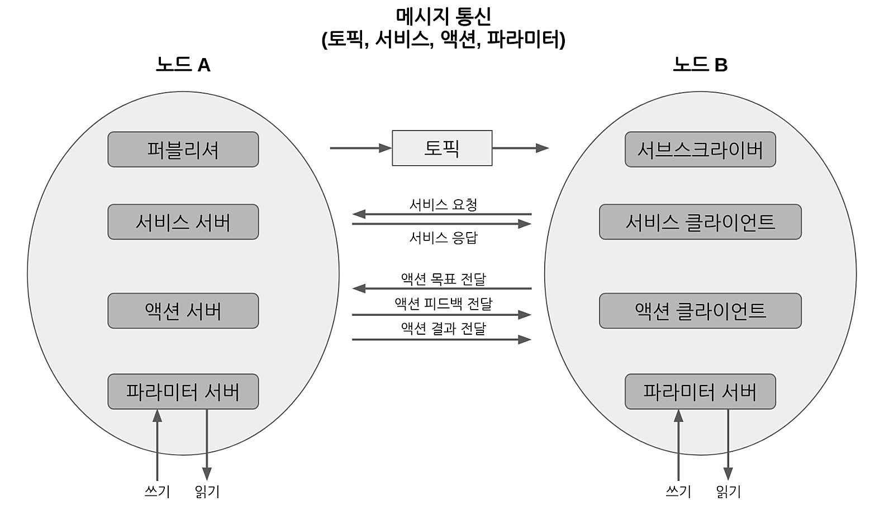
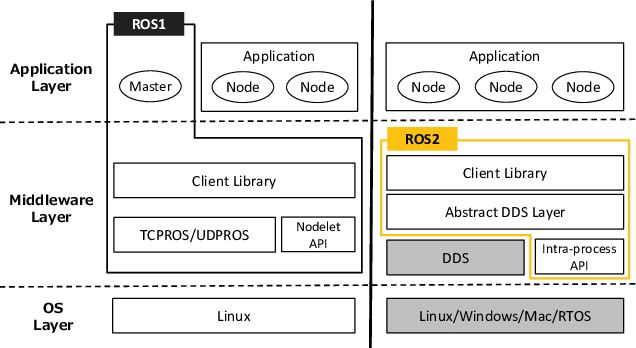
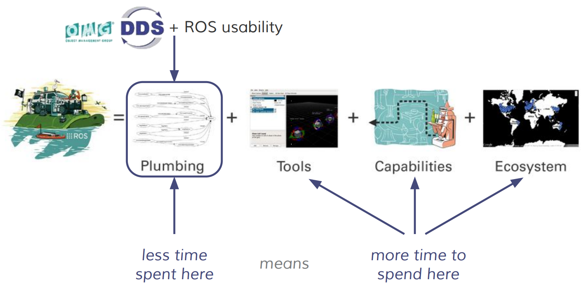
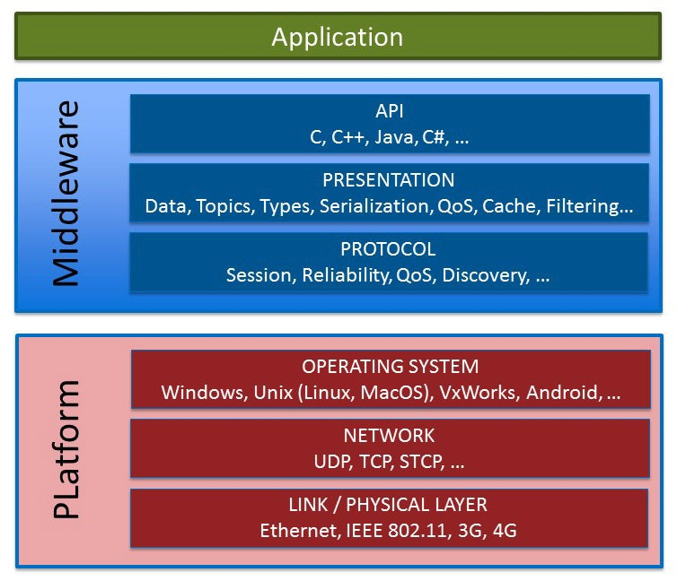
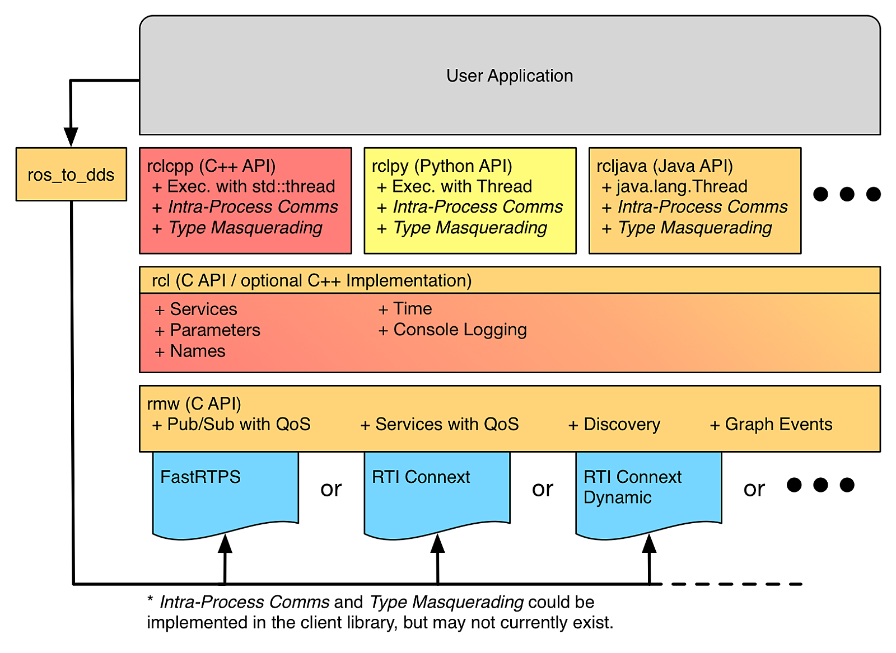
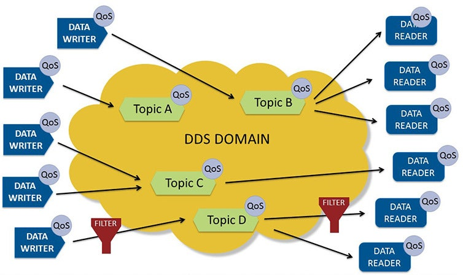
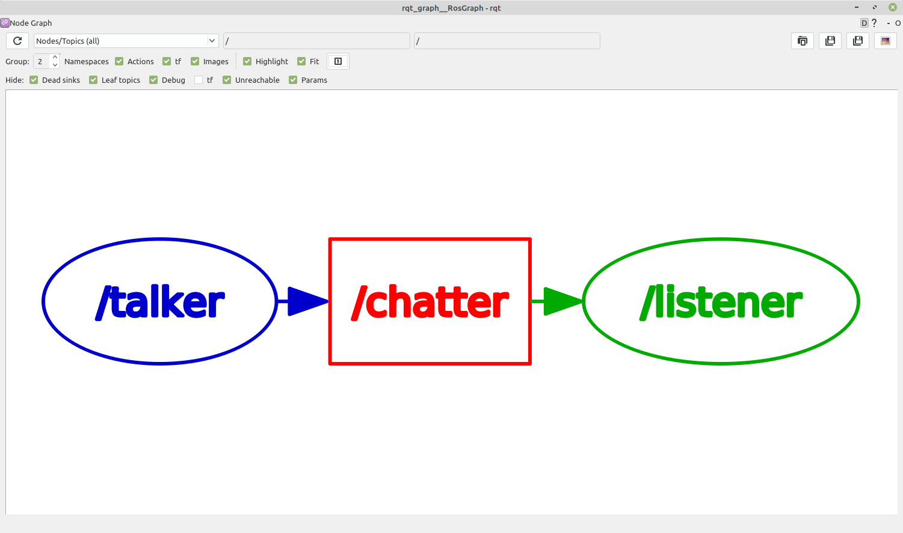

# Chapter 06: ROS 2와 DDS
## 01. ROS의 메시지 통신
- 본격적인 ROS 2 프로그래밍 강좌에 앞서서 로봇 운영체제 ROS에서 중요시 여기는 몇 가지 용어 정의 및 메시지, 메시지 통신에 대해 먼저 알아보도록 하자.
- 특히, 메시지 통신은 ROS 프로그래밍에 있어서 ROS 1과 2의 공통된 중요한 핵심 개념이기에 ROS 프로그래밍에 들어가기 전에 꼭 이해하고 넘어가야 할 부분이다.
- ROS에서는 프로그램의 재사용성을 극대화하기 위하여 최소 단위의 실행 가능한 프로세서라고 정의하는 노드(node) 단위의 프로그램을 작성하게 된다.
- 이는 하나의 실행 가능한 프로그램으로 생각하면 된다.
- 그리고 하나 이상의 노드 또는 노드 실행을 위한 정보 등을 묶어 놓은 것을 패키지(package)라고 하며, 패키지의 묶음을 메타패키지(metapackage)라 하여 따로 분리한다.
- 여기서 제일 중요한 것은 실제 실행 프로그램인 노드인데 앞서 이야기한 것과 마찬가지로 ROS에서는 최소한의 실행 단위로 프로그램을 나누어 프로그래밍하기 때문에 노드는 각각 별개의 프로그램이라고 이해하면 된다.
- 이에 수많은 노드들이 연동되는 ROS 시스템을 위해서는 노드와 노드 사이에 입력과 출력 데이터를 서로 주고받게 설계해야만 한다.
- 여기서 주고받는 데이터를 ROS에서는 메시지(message)라고 하고 주고받는 방식을 메시지 통신이라고 한다.
- 여기서 데이터에 해당되는 메시지(message)는 integer, floating point, boolean, string 와 같은 변수 형태이며 메시지 안에 메시지를 품고 있는 간단한 데이터 구조 및 메시지들의 배열과 같은 구조도 사용할 수 있다.
- 그리고 메시지를 주고받는 통신 방법에 따라 토픽(topic), 서비스(service), 액션(action), 파라미터(parameter)로 구분된다.


- ROS 2의 메시지 통신

## 02. ROS 2와 DDS
- ROS에서 사용되는 메시지 통신 방법으로는 토픽(topic), 서비스(service), 액션(action), 파라미터(prameter)가 있다.
- 각 메시지 통신 방법의 목적과 사용 방법은 다르기는 하지만 토픽의 발간(publish)과 구독(subscribe)의 개념을 응용하고 있다.
- 이 데이터를 보내고 받는 발간, 구독 개념은 ROS 1은 물론 ROS 2에서도 매우 중요한 개념으로 변함이 없는데 이 기술에 사용된 통신 라이브러리는 ROS 1, 2에서 조금씩 다르다.
- ROS 1에서는 자체 개발한 TCPROS와 같은 통신 라이브러리를 사용하고 있던 반면, ROS 2에서는 OMG(Object Management Group)에 의해 표준화된 DDS(Data Distribution Service)의 리얼타임 퍼블리시와 서브스크라이브 프로토콜인 DDSI-RTPS(Real Time Publish Subscribe)를 사용하고 있다.
- ROS 2 개발 초기에는 기존 TCPROS를 개선하거나 ZeroMQ, Protocol Buffers 및 Zeroconf 등을 이용하여 미들웨어처럼 사용하는 방법도 제안되었으나 무엇보다 산업용 시장을 위해 표준 방식 사용을 중요하게 여겼고, ROS 1때와 같이 자체적으로 만들기 보다는 산업용 표준을 만들고 생태계를 꾸려가고 있었던 DDS를 통신 미들웨어로써 사용하기로 하였다.
- DDS 도입에 따라 그림 2과 같이 ROS의 레이아웃은 크게 바뀌게 되었다.
- 처음에는 DDS 채용에 따른 장점과 단점에 대한 팽팽한 줄다리기 토론으로 걱정의 목소리도 높았지만 지금에 와서는 ROS 2에서의 DDS 도입은 상업적인 용도로 ROS를 사용할 수 있게 발판을 만들었다는 것에 가장 큰 역할을 했다는 평가가 지배적이다.


- DDS 사용에 따른 ROS의 구조 변화

- DDS 도입으로 기존 메시지 형태 이외에도 OMG의 CORBA 시절부터 사용되던 IDL(Interface Description Language)를 사용하여 메시지 정의 및 직렬화를 더 쉽게, 더 포괄적으로 다룰 수 있게 되었다.
- 또한 DDS의 중요 컨셉인 DCPS(data-centric publish-subscribe), DLRL(data local reconstruction layer)의 내용을 담아 재정한 통신 프로토콜로인 DDSI-RTPS을 채용하여 실시간 데이터 전송을 보장하고 임베디드 시스템에도 사용할 수 있게 되었다.
- DDS의 사용으로 노드 간의 동적 검색 기능을 지원하고 있어서 기존 ROS 1에서 각 노드들의 정보를 관리하였던 ROS Master가 없어도 여러 DDS 프로그램 간에 통신할 수 있다.
- 또한 노드 간의 데이터 통신을 세부적으로 조정하는 QoS(Quality of Service)를 매개 변수 형태로 설정할 수 있어서 TCP처럼 데이터 손실을 방지함으로써 신뢰도를 높이거나, UDP처럼 통신 속도를 최우선시하여 사용할 수도 있다.
- 그리고 산업용으로 사용되는 미들웨어인 만큼 DDS-Security 도입으로 보안 측면에도 큰 혜택을 얻을 수 있었다.
- 이러한 다양한 기능을 갖춘 DDS를 이용하여 ROS 1의 퍼블리시, 서브스크라이브형 메시지 전달은 물론, 실시간 데이터 전송, 불안정한 네트워크에 대한 대응, 보안  등이 강화되었다.
- DDS의 채용은 ROS 1에서 ROS 2로 바뀌면서 가장 큰 변화점이자 아래 그림과 같이 개발자 및 사용자로 하여금 통신 미들웨어에 대한 개발 및 이용 부담을 줄여 진짜로 집중해야 할 부분에 더 많은 시간을 쏟을 수 있게 되었다. 


- DDS 사용에 따른 개발자 및 사용자 편의

## 03. DDS란?
- 처음 DDS를 ROS 2에 도입하자는 이야기가 나왔을 때, DDS라는 단어 자체를 처음 들어봤기에 너무 어려웠다.
- 결론부터 말하자면 DDS는 데이터 분산 시스템이라는 용어로 OMG에서 표준을 정하고자 만든 트레이드 마크(TM)였다.
- 그냥 용어이고 그 실체는 데이터 통신을 위한 미들웨어이다.
- DDS가 ROS 2의 미들웨어로 사용하는 만큼 그 자체에 대해 너무 자세히 알 필요는 없을 듯싶고 ROS 프로그래밍에 필요한 개념만 알고 넘어가면 될 듯싶다.
- DDS는 Data Distribution Service, 즉 데이터 분산 서비스의 약자이다.
- OMG DDS Foundation에서는 다음과 같이 정의하고 있다.

> The Data Distribution Service (DDS™) is a middleware protocol and API standard for data-centric connectivity from the Object Management Group® (OMG®). It integrates the components of a system together, providing low-latency data connectivity, extreme reliability, and a scalable architecture that business and mission-critical Internet of Things (IoT) applications need.
> In a distributed system, middleware is the software layer that lies between the operating system and applications. It enables the various components of a system to more easily communicate and share data. It simplifies the development of distributed systems by letting software developers focus on the specific purpose of their applications rather than the mechanics of passing information between applications and systems.

- 즉, DDS는 데이터 분산 시스템이라는 개념을 나타내는 단어이고 실제로는 데이터를 중심으로 연결성을 갖는 미들웨어의 프로토콜(DDSI-RTPS)과 같은 DDS 사양을 만족하는 미들웨어 API가 그 실체이다.
- 이 미들웨어는 아래 그림과 같이 ISO 7 계층 레이어에서 호스트 계층(Host layers)에 해당되는 4~7 계층에 해당되고 ROS 2에서는 위에서 언급한 그림 3과 같이 운영 체제와 사용자 애플리케이션 사이에 있는 소프트웨어 계층으로 이를 통해 시스템의 다양한 구성 요소를 보다 쉽게 통신하고 데이터를 공유할 수 있게 된다.


- 미들웨어로서의 DDS

## 04. DDS의 특징
- DDS의 특징은 다양하겠지만 DDS를 ROS 2의 미들웨어로 사용해보면서 느낀 장점은 아래와 같이 10가지이다.
- 여기서는 이 10가지에 대해 하나씩 정리해보고 각 기능들은 이어지는 강좌에서 실습을 통해 더 자세히 알아보자.
    - Industry Standards
    - OS Independent
    - Language Independent
    - Transport on UDP/IP
    - Data Centricity
    - Dynamic Discovery
    - Scalable Architecture
    - Interoperability
    - Quality of Service (QoS)
    - Security

### 4-1. 산업 표준
- DDS는 분산 객체에 대한 기술 표준을 제정하기 위해 1989년에 설립된 비영리 단체인 OMG(Object Management Group, 객체 관리 그룹)가 관리하고 있는 만큼 산업 표준으로 자리 잡고 있다.
- 지금까지 OMG가 진행하여 ISO 승인된 표준으로는 UML, SysML, CORBA 등이 있다.
- 2001년에 시작된 DDS 표준화 작업도 잘 진행되어 지금에 와서는 OpenFMB, Adaptive AUTOSAR, MD PnP, GVA, NGVA, ROS 2와 같은 시스템들에서 DDS를 사용하며 산업 표준의 기반이 되고 있다.
- ROS 1에서의 TCPROS는 독자적인 미들웨어라는 성격이 짙었는데 ROS 2에 와서는 DDS 사용으로 더 넓은 범위로 사용 가능하게 되었으며 산업 표준을 지키고 있는 만큼 로봇 운영체제 ROS가 IoT, 자동차, 국방, 항공, 우주 분야로 넓혀갈 수 있는 발판이 마련되었다고 생각한다.

### 4-2. 운영체제 독립
- DDS는 Linux, Windows, macOS, Android, VxWorks 등 다양한 운영체제를 지원하고 있기에 사용자가 사용하던 운영체제를 변경할 필요가 없다.
- 멀티 운영체제 지원을 컨셉으로 하고 있는 ROS 2에도 매우 적합하다고 볼 수 있다.

### 4-3. 언어 독립
- DDS는 미들웨어이기에 그 상위 레벨이라고 볼 수 있는 사용자 코드 레벨에서는 DDS 사용을 위해 기존에 사용하던 프로그래밍 언어를 바꿀 필요가 없다.
- ROS 2에서도 이 특징을 충분히 살려 아래 그림과 같이 DDS를 RMW(ROS middleware)으로 디자인되었으며 벤더 별로 각 RMW가 제작되었으며, 그 위에 사용자 코드를 위해 rclcpp, rclc, rclpy, rcljava, rclobjc, rclada, rclgo, rclnodejs  같이 다양한 언어를 지원하는 ROS 클라이언트 라이브러리 (ROS Client Library)를 제작하여 멀티 프로그래밍 언어를 지원하고 있다.


- ROS의 RMW, RCL, User Application

### 4-4. UDP 기반의 전송 방식
- DDS 벤더 별로 DDS Interoperability Wire Protocol (DDSI-RTPS)의 구현 방식에 따라 상이할 수 있으나 일반적으로 UDP 기반의 신뢰성 있는 멀티캐스트(reliable multicast)를 구현하여 시스템이 최신 네트워킹 인프라의 이점을 효율적으로 활용할 수 있도록 돕고 있다.
- UDP 기반이라는 것이 ROS 1에서의 TCPROS가 TCP 기반이었던 것에 비해 매우 큰 변화인데 UDP의 멀티캐스트(multicast)는 브로드캐스트(broadcast)처럼 여러 목적지로 동시에 데이터를 보낼 수 있지만, 불특정 목적지가 아닌 특정된 도메인 그룹에 대해서만 데이터를 전송하게 된다.
- 참고로 ROS 2에서는 `ROS_DOMAIN_ID`라는 환경 변수로 도메인을 설정하게 된다.
- 이 멀티캐스트의 방식 도입으로 ROS 2에서는 전역 공간이라 불리는 DDS Global Space 이라는 공간에 있는 토픽들에 대해 구독 및 발행을 할 수 있게 된다.
- Best effort 개념인 UDP는 reliable을 보장하는 TCP에 비해 장단점이 있는데 이 또한 후에 설명하는 QoS(Quality of Service)를 통해 보완 및 해결되었다.
- 참고로 일부 RMW 기능에는 TCP 기반으로 구현되는 경우도 있다.

### 4-5. 데이터 중심적 기능
- 다양한 미들웨어가 있겠지만 그중 DDS를 사용하면서 제일 많이 듣는 말 중에 하나는 `Data Centric`이라는 것이다.
- 우리말로는 데이터 중심적이라는 것인데 실제로 DDS를 사용하다보면 이 말이 이해가 된다.
- DDS 사양에도 DCPS(data-centric publish-subscribe)이라는 개념이 나오는데 이는 적절한 수신자에게 적절한 정보를 효율적으로 전달하는 것을 목표로 하는 발간 및 구독 방식이라는 것이다.
- DDS의 미들웨어를 사용자 입장에서 본다면 어떤 데이터인지, 이 데이터가 어떤 형식인지, 이 데이터를 어떻게 보낼 것인지, 이 데이터를 어떻게 안전하게 보낼 것인지에 대한 기능이 DDS 미들웨어에 녹여있기 때문이다.


- 데이터 중심성의 도식화

### 4-6. 동적 검색
- DDS는 동적 검색(Dynamic Discovery)을 제공한다.
- 즉, 응용 프로그램은 DDS의 동적 검색을 통하여 어떤 토픽이 지정 도메인 영역에 있으며 어떤 노드가 이를 발신하고 수신하는지 알 수 있게 된다.
- 이는 ROS 프로그래밍할 때 데이터를 주고받을 노드들의 IP 주소 및 포트를 미리 입력하거나 따로 구성하지 않아도 되며 사용하는 시스템 아키텍처의 차이점을 고려할 필요가 없기 때문에 모든 운영 체제 또는 하드웨어 플랫폼에서 매우 쉽게 작업할 수 있다.
- ROS 1에서는 ROS Master에서 ROS 시스템의 노드들의 이름 지정 및 등록 서비스를 제공하였고, 각 노드에서 퍼블리시 또는 서브스크라이브하는 메시지를 찾아서 연결할 수 있도록 정보를 제공해 주었다.
- 즉, 각각 독립되어 실행되는 노드들의 정보를 관리하여 서로 연결해야 하는 노드들에게 상대방 노드의 정보를 건네주어 연결할 수 있게 해 주는 매우 중요한 중매 역할을 수행했었다.
- 이 때문에 ROS 1에서는 노드 사이의 연결을 위해 네임 서비스를 마스터에서 실행했었어야 했고, 이 ROS Master가 연결이 끊기거나 죽는 경우 모든 시스템이 마비되는 단점이 있었다.
- ROS 2에서는 ROS Master가 없어지고 DDS의 동적 검색 기능을 사용함에 따라 노드를 DDS의 Participant 개념으로 취급하게 되었으며, 동적 검색 기능을 이용하여 DDS 미들웨어를 통해 직접 검색하여 노드를 연결할 수 있게 되었다.

### 4-7. 확장 가능한 아키텍쳐
- OMG의 DDS 아키텍처는 IoT 디바이스와 같은 소형 디바이스부터 인프라, 국방, 항공, 우주 산업과 같은 초대형 시스템으로까지 확장할 수 있도록 설계되었다.
- 그렇다고 사용하기 복잡한 것도 아니다.
- DDS의 Participant 형태의 노드는 확장 가능한 형태로 제공되어 사용할 수 있으며 단일 표준 통신 계층에서 많은 복잡성을 흡수하여 분산 시스템 개발을 더욱 단순화 시켜 편의성을 높였다.
- 특히 ROS와 같이 최소 실행 가능한 노드 단위로 나누어 수백, 수천 개의 노드를 관리해야 하는 시스템에서는 이 부분이 강점으로 보이며 한대의 로봇이 아닌 복수의 로봇, 주변 인프라와 다양한 IT 기술, 데이터베이스, 클라우드로 연결 및 확장해야 하는 ROS 시스템에 매우 적합한 기능이다.

### 4-8. 상호 운용성
- ROS 2에서 통신 미들웨어로 사용하고 있는 DDS는 상호 운용성을 지원하고 있다.
- 즉, DDS의 표준 사양을 지키고 있는 벤더 제품을 사용한다면 A라는 회사의 제품을 사용하였다가도 B라는 회사 제품으로 변경이 가능하고, A 제품과 B 제품을 혼용하여 서로 다른 제품의 DDS 제품을 사용하더라도 A 제품과 B 제품간의 상호 통신도 지원한다는 것이다.
- 현재 DDS 벤더로는 10 곳이 있는데 이 중 ROS 2를 지원하는 업체는 ADLink, Eclipse Foundation, Eprosima, Gurum Network, RTI로 총 5 곳이며 DDS 제품명으로는 ADLINK의 OpenSplice, Eclipse Foundation의 Cyclone DDS, Eprosima의 Fast DDS, Gurum Network의 Gurum DDS, RTI의 Connext DDS가 있다.
- 이 중 Fast DDS와 Cyclone DDS는 오픈 소스를 지향하고 있기에 자유롭게 사용 가능하며 더 고성능을 위한다면 상용 제품인 OpenSplice, Connext DDS, Gurum DDS를 사용하면 된다.
- 참고로 이 중 구름네트웍스(Gurum Network)는 유일하게 대한민국 기업으로 DDS를 순수 국산 기술로 개발하여 상용화에 성공한 기업이다.

### 4-9. 서비스 품질 (QoS)
- ROS 2에서는 DDS 도입으로 데이터의 송수신 관련 설정을 목적에 맞추어 유저가 직접 설정할 수 있게 되었다.
- 노드 간의 DDS 통신 옵션을 설정하는 QoS(Quality of Service)가 그것인데 퍼블리셔 및 서브스크라이브 등을 선언하고 사용할 때 매개 변수처럼 QoS를 사용할 수 있다.
- DDS 사양상 설정 가능한 QoS 항목은 22가지인데 ROS 2에서는 현재 TCP처럼 데이터 손실을 방지함으로써 신뢰도를 우선시하거나 (reliable), UDP처럼 통신 속도를 최우선시하여 사용(best effort)할 수 있게 하는 신뢰성(reliability) 기능이 대표적으로 사용되고 있다.
- 그 이외에 또한 통신 상태에 따라 정해진 사이즈만큼의 데이터를 보관하는 History 기능, 데이터를 수신하는 서브스크라이버가 생성되기 전의 데이터를 사용할지 폐기할지에 대한 설정인 Durability 기능, 정해진 주기 안에 데이터가 발신 및 수신되지 않을 경우 이벤트 함수를 실행시키는 Deadline 기능, 정해진 주기 안에서 수신되는 데이터만 유효 판정하고 그렇지 않은 데이터는 삭제하는 Lifespan 기능, 정해진 주기 안에서 노드 혹은 토픽의 생사 확인하는 Liveliness도 설정할 수 있다.
- 이러한 다양한 QoS 설정을 통해 DDS는 적시성, 트래픽 우선순위, 안정성 및 리소스 사용과 같은 데이터를 주고받는 모든 측면을 사용자가 제어할 수 있게 되었고 특정 상황, 예를 들어 매우 빠른 속도 데이터를 주고받거나 매우 역동적이고 까다롭고 예측할 수 없는 통신환경에서 데이터 송/수신에 다양한 옵션 설정으로 이를 달성하거나 장애를 극복할 수 있게 되었다. 

### 4-10. 보안
- ROS 1의 가장 큰 구멍이었던 보안 부분은 ROS 2 개발에서 DDS으로 해결되었다.
- DDS의 사양에는 DDS-Security이라는 DDS 보안 사양을 ROS에 적용하여 보안에 대한 이슈를 통신단부터 해결하였다.
- 또한 ROS 커뮤니티에서는 SROS 2(Secure Robot Operating System 2)라는 툴을 개발하였고 보안 관련 RCL 서포트 및 보안 관련 프로그래밍에 익숙지 않은 로보틱스 개발자를 위해 보안을 위한 툴킷을 만들어 배포하고 있다.

## 05. ROS에서의 사용법
### 5-1. 기본적인 퍼블리셔 노드와 서브스크라이버 노드 실행
- 아래의 실행 명령어를 각각 터미널 창 두 곳에서 실행하면 서브스크라이브 역할을 하는 listener 노드와 퍼블리셔 역할을 하는 talk 노드가 각각 실행된다.
- 이 두 노드가 실행되었다는 것은 이미 지정된 DDS, 즉 RMW(ROS middleware)를 사용하고 있는 것이다.
- rqt_graph를 실행하면 아래 그림과 같이 실행된 퍼블리셔 노드, 서브스크라이버 노드를 확인할 수 있으며 두 노드간에 토픽을 주고받고 있다는 것을 확인할 수 있다.
```
$ ros2 run demo_nodes_cpp listener
[INFO]: I heard: [Hello World: 1]
[INFO]: I heard: [Hello World: 2]
[INFO]: I heard: [Hello World: 3]
[INFO]: I heard: [Hello World: 4]
[INFO]: I heard: [Hello World: 5]
```
```
$ ros2 run demo_nodes_cpp talker
[INFO]: Publishing: 'Hello World: 1'
[INFO]: Publishing: 'Hello World: 2'
[INFO]: Publishing: 'Hello World: 3'
[INFO]: Publishing: 'Hello World: 4'
[INFO]: Publishing: 'Hello World: 5'
```
```
$ rqt_graph
```



> #### 참고 사항
> - listener 노드를 실행한 직후에는 talker 노드가 실행되기 전까지 대기하고 있다가 talker 노드가 실행되어 메시지 전송이 시작되면 전송받은 [Hello World: n] 이 표시된다.
> - 위 터미널 창의 메시지가 이 강좌를 보고 직접 테스트해본 분들과 타임 스태프 부분에서 다를 수 있는데 이는 강좌의 코드란을 줄이고자 일부로 타임 스태프가 찍히지 않게 설정해두었기 때문이다.
> - 참고로 터미널상에서 각 노드를 종료시키려면 `Ctrl + c` 를 눌러 종료하면 된다.

### 5-2. RMW 변경 방법
- 위의 5.1 예제에서는 RMW에 대한 아무런 설정도 하지 않았기에 ROS 2 Foxy의 기본 RMW인 `rmw_fastrtps_cpp`가 사용되었다.
- 만약 RMW를 변경하여 사용 하려면 다음과 같이 ROS 2를 지원하는 RMW 중에서 하나를 선택하여 `RMW_IMPLEMENTATION` 이라는 환경 변수로 선언한 후 노드를 실행하면 된다.
    - rmw_connext_cpp
    - rmw_cyclonedds_cpp
    - rmw_fastrtps_cpp
    - rmw_gurumdds_cpp
    - rmw_opensplice_cpp
- 이번 예제에서는 기본 RMW 대신에 `rmw_cyclonedds_cpp`를 사용하여 각 노드를 실행시켜 보겠다.
- 아래와 같이 실행되면 이상 없이 RMW를 변경하게 되었다는 것이다. 

> - 참고로 Fast RTPS는 2.0부터 Fast DDS로 명칭이 변경되었으나 현재 버전에서는 아직 Fast RTPS이름을 사용하고 있음을 주의하자. 차후에 변경될 것으로 보인다.

```
$ export PMW_IMPLEMENTATION=rmw_cyclonedds_cpp
$ ros2 run demo_nodes_cpp listener
[INFO]: I heard: [Hello World: 1]
[INFO]: I heard: [Hello World: 2]
[INFO]: I heard: [Hello World: 3]
```
```
$ export RMW_IMPLEMENTATION=rmw_cyclonedds_cpp
$ ros2 run demo_nodes_cpp talker
[INFO]: Publishing: 'Hello World: 1'
[INFO]: Publishing: 'Hello World: 2'
[INFO]: Publishing: 'Hello World: 3'
```

### 5-3. RMW의 상호 운용성 테스트
- 만약 RMW를 변경해서 위에서 설명한 DDS의 특징 `4-8 상호 운용성`을 테스트하고자 한다면 다음과 같이 ROS 2를 지원하는 RMW 중에서 하나를 선택하여 각 노드 별로 서로 다르게 `RMW_IMPLEMENTATION` 환경 변수로 선언하면 된다.
- 다음 예제에서는 오픈소스 형태로 자유롭게 사용 가능한 `rmw_cyclonedds_cpp`과 `rmw_fastrtps_cpp`을 테스트해보겠다.
- 아래와 같이 listener 노드와 talker 노드가 각각 서로 다른 RMW를 사용하였음에도 문제없이 통신이 되었음을 확인할 수 있다.
```
$ export RMW_IMPLEMENTATION=rmw_cyclonedds_cpp
$ ros2 run demo_nodes_cpp listener
[INFO]: I heard: [Hello World: 1]
[INFO]: I heard: [Hello World: 2]
[INFO]: I heard: [Hello World: 3]
```
```
$ export RMW_IMPLEMENTATION=rmw_fastrtps_cpp
$ ros2 run demo_nodes_cpp talker
[INFO]: Publishing: 'Hello World: 1'
[INFO]: Publishing: 'Hello World: 2'
[INFO]: Publishing: 'Hello World: 3'
```

### 5-4. Domain 변경 방법
- ROS 2에서는 `4-4 UDP 기반의 전송 방식`에서 UDP 멀티캐스트로 통신이 이루어지기 때문에 별도의 설정을 하지 않으면 같은 네트워크의 모든 노드가 연결되게 된다.
- 예를 들어 같은 연구실에서 동일 네트워크를 사용한다면 다른 연구원들의 노드의 데이터에 접근 가능하게 된다.
- 이를 방지하려면 다른 네트워크를 이용하거나 `name space`를 변경하여 사용하면 되는데 가장 간단한 방법으로는 DDS의 `domain`을 변경하는 것이 가장 간단하다.
- ROS의 RMW에서는 이를 `ROS_DOMAIN_ID`이라 하며 환경 변수로 설정하게 되어 있다.
- 하기와 같이 각 터미널상에서 각 노드를 실행시켜 보자.
- `ROS_DOMAIN_ID`을 서로 동일하게 맞춘 talker 노드와 listener 노드만이 연결되어 서로 통신 됨을 확인할 수 있을 것이다.
- 참고로 `ROS_DOMAIN_ID`은 RMW마다 기본 설정값이 달리 설정될 수 있으며 RMW마다 상이할 수는 있지만 기본적으로 0에서 232까지의 정수를 사용할 수 있다.

```
$ export ROS_DOMAIN_ID=11
$ ros2 run demo_nodes_cpp talker
[INFO]: Publishing: 'Hello World: 1'
[INFO]: Publishing: 'Hello World: 2'
[INFO]: Publishing: 'Hello World: 3'
```
```
$ export ROS_DOMAIN_ID=12
$ ros2 run demo_nodes_cpp listener
```
```
$ export ROS_DOMAIN_ID=11
$ ros2 run demo_nodes_cpp listener
[INFO]: I heard: [Hello World: 13]
[INFO]: I heard: [Hello World: 14]
[INFO]: I heard: [Hello World: 15]
```

### 5-5. QoS 테스트
- 위 `4-9 서비스 품질 (QoS)` 설명에서 "TCP처럼 데이터 손실을 방지함으로써 신뢰도를 우선시하거나 (reliable), UDP처럼 통신 속도를 최우선시하여 사용(best effort) 할 수 있게 하는 신뢰성(reliability) 기능이 대표적으로 사용되고 있다"라고 설명했다.
- 이번 예제에서는 프로그래밍까지는 아니더라도 간단한 테스트로 이 기능을 시험해보자.
- 이 테스트에서는 `tc(traffic control)`라는 리눅스 네트워크 트래픽 제어 유틸리티를 사용하여 임의의 데이터 손실(10%)을 만들어 reliability성을 테스트해보았다.

#### 1. Reliability가 RELIABLE로 되어 있을 때
- demo_nodes_cpp 패키지의 listener 노드는 Reliability의 기본 설정인 RELIABLE 으로 되어 있다.
- 그렇기에 데이터 손실이 있어도 TCP와 같이 ack로 매번 확인하여 손실된 데이터를 재전송하게 되며 아래 예제와 같이 잃어버리는 데이터가 없다.
- 단 손실이 있는 시점에서 터미널 창이 잠시 멈추는 것을 확인할 수 있는데 이때에 손실된 데이터를 순차적으로 재전송하고 다시 ack 작업을 하기 때문이다.

```
$ sudo tc qdisc add dev lo root netem loss 10%
```
```
$ ros2 run demo_nodes_cpp listener
[INFO]: I heard: [Hello World: 1]
[INFO]: I heard: [Hello World: 2]
[INFO]: I heard: [Hello World: 3]
[INFO]: I heard: [Hello World: 4]
[INFO]: I heard: [Hello World: 5]
[INFO]: I heard: [Hello World: 6]
[INFO]: I heard: [Hello World: 7]
[INFO]: I heard: [Hello World: 8]
[INFO]: I heard: [Hello World: 9]
[INFO]: I heard: [Hello World: 10]
[INFO]: I heard: [Hello World: 11]
[INFO]: I heard: [Hello World: 12]
[INFO]: I heard: [Hello World: 13]
[INFO]: I heard: [Hello World: 14]
[INFO]: I heard: [Hello World: 15]
```
```
$ ros2 run demo_nodes_cpp talker
[INFO]: Publishing: 'Hello World: 1'
[INFO]: Publishing: 'Hello World: 2'
[INFO]: Publishing: 'Hello World: 3'
[INFO]: Publishing: 'Hello World: 4'
[INFO]: Publishing: 'Hello World: 5'
[INFO]: Publishing: 'Hello World: 6'
[INFO]: Publishing: 'Hello World: 7'
[INFO]: Publishing: 'Hello World: 8'
[INFO]: Publishing: 'Hello World: 9'
[INFO]: Publishing: 'Hello World: 10'
[INFO]: Publishing: 'Hello World: 11'
[INFO]: Publishing: 'Hello World: 12'
[INFO]: Publishing: 'Hello World: 13'
[INFO]: Publishing: 'Hello World: 14'
[INFO]: Publishing: 'Hello World: 15'
```

#### 2. Reliability가 BEST_EFFORT로 되어 있을 때
- 우선 위에서 실행시킨 listener 노드와 talker를 종료하고 아래와 같이 실행하자.
- 이번에는 demo_nodes_cpp 패키지의 listener_best_effort 노드를 사용할 것이다.
- 이 노드는 Reliability의 설정을 RELIABLE이 아닌 BEST_EFFORT 으로 되어 있다.
- 그렇기에 다음 예제와 같이 talker 노드는 1부터 15까지 온전히 데이터를 전송했지만 수신받는 listener_best_effort 노드는 데이터 손실로 인하여 "2"과 "9"가 손실된 채 표시되고 있다.
- RELIABLE 설정과는 다른 결과가 나왔는데 신뢰성 중심이 아닌 속도 중심이고 데이터 손실이 있어도 문제없는 데이터라면 Reliability를 BEST_EFFORT으로 설정하여 사용하면 될 것이다.
- 위에서 끊김의 원인이 되었던 재전송을 수행하지 않음도 느낄 수 있을 것이다.

```
$ ros2 run demo_nodes_cpp listener_best_effort
[INFO]: I heard: [Hello World: 1]
[INFO]: I heard: [Hello World: 3]
[INFO]: I heard: [Hello World: 4]
[INFO]: I heard: [Hello World: 5]
[INFO]: I heard: [Hello World: 6]
[INFO]: I heard: [Hello World: 7]
[INFO]: I heard: [Hello World: 8]
[INFO]: I heard: [Hello World: 10]
[INFO]: I heard: [Hello World: 11]
[INFO]: I heard: [Hello World: 12]
[INFO]: I heard: [Hello World: 13]
[INFO]: I heard: [Hello World: 14]
[INFO]: I heard: [Hello World: 15]
```
```
$ ros2 run demo_nodes_cpp talker
[INFO]: Publishing: 'Hello World: 1'
[INFO]: Publishing: 'Hello World: 2'
[INFO]: Publishing: 'Hello World: 3'
[INFO]: Publishing: 'Hello World: 4'
[INFO]: Publishing: 'Hello World: 5'
[INFO]: Publishing: 'Hello World: 6'
[INFO]: Publishing: 'Hello World: 7'
[INFO]: Publishing: 'Hello World: 8'
[INFO]: Publishing: 'Hello World: 9'
[INFO]: Publishing: 'Hello World: 10'
[INFO]: Publishing: 'Hello World: 11'
[INFO]: Publishing: 'Hello World: 12'
[INFO]: Publishing: 'Hello World: 13'
[INFO]: Publishing: 'Hello World: 14'
[INFO]: Publishing: 'Hello World: 15'
```
- 모든 테스트가 끝났다면 아래 명령을 통해 tc로 설정한 데이터 손실 명령을 반드시 해제하도록 한다.
```
$ sudo tc qdisc delete dev lo root netem loss 10%
```

[출처] 006 ROS 2와 DDS (Data Distribution Service) (오픈소스 소프트웨어 & 하드웨어: 로봇 기술 공유 카페 (오로카)) | 작성자 표윤석
