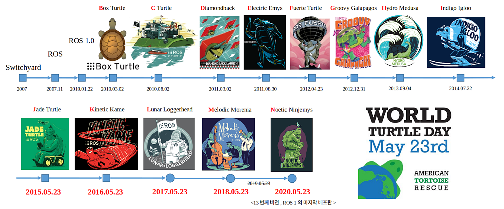
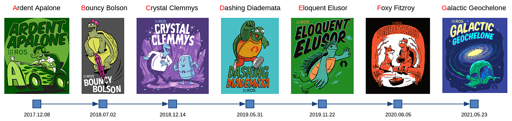
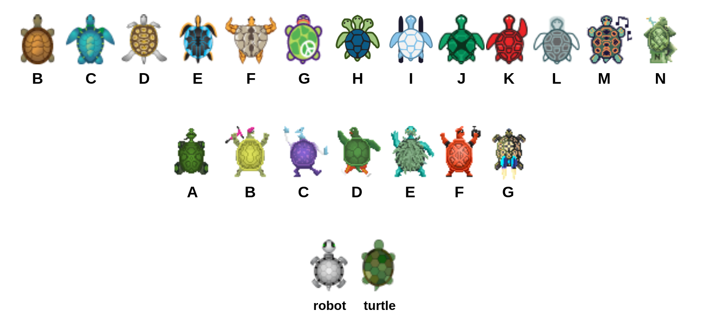
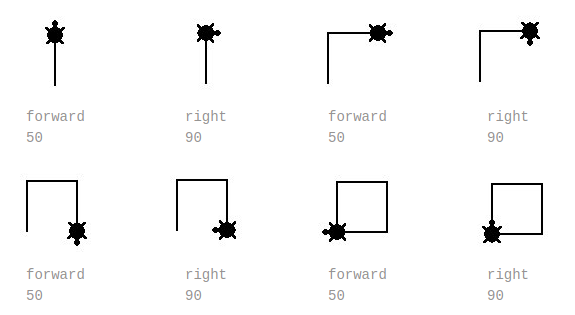
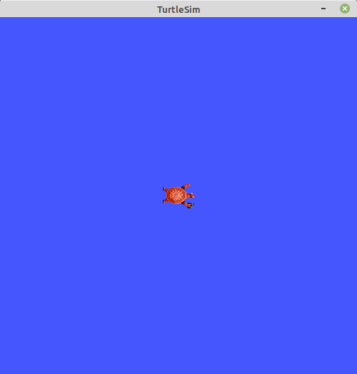
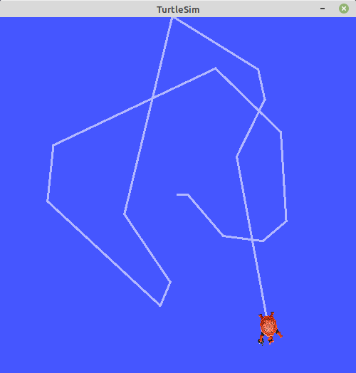
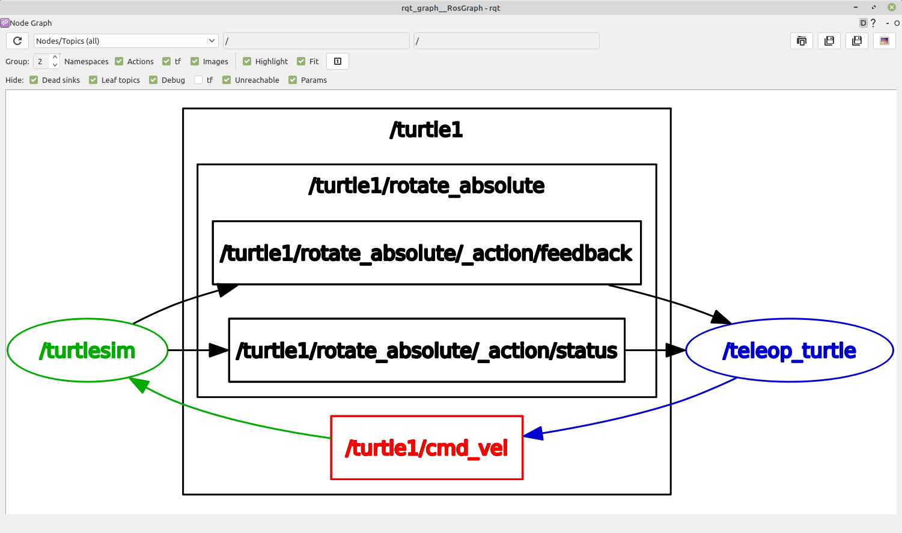

# Chapter 07: 패키지 설치와 노드 실행
## 01. 이번 강좌에서 배울 수 있는 것과 개발 환경
- ROS 2의 공식 튜토리얼 문서를 기본으로 ROS의 기초적인 패키지, 노드, 토픽, 서비스, 액션, 파라미터, CLI 툴, rqt 툴에 대해 알아보도록 하겠다.
- 이 중 오늘 강좌에서는 튜토리얼을 가지고 `turtlesim` 패키지를 이용하여 ROS 패키지의 설치, 노드의 실행, cli 툴 및 rqt 툴의 실행을 실습을 통해 알아보자.
- 참고로 튜토리얼 성격의 강좌를 진행하기 위해서는 서로 개발 환경을 맞추는게 좋다.

## 02. Turtlesim 패키지 설치
- ROS 유저라면 사용해보지 않은 사람이 없을 정도로 유명한 패키지이자 ROS의 기본 기능을 가지고 있기에 많은 사람들이 튜토리얼로써 많이 이용하는 `turtlesim`을 가지고 이번 강좌를 진행하려고 한다.
- `turtlesim`은 기본적으로 `001 ROS 2 개발 환경 구축`의 설치 방법대로 설치를 했다면 이미 설치가 되었을텐데 혹시 다른 방법으로 설치하였거나 지웠을 경우 하기와 같이 설치를 하면 된다.
```
$ sudo apt update
$ sudo apt install ros-foxy-turtlesim
```

## 03. Turtlesim이란?
- TMI이지만 `turtlesim` 패키지는 ROS 1 초창기부터 ROS 2의 현재까지도 ROS 커뮤니티에서 가장 널리 쓰이는 패키지인만큼 `turtlesim`에 대해 좀 더 자세히 알아보기로 하자.
- 뜬금 없을 수 있지만 영국의 역사학자 에드워드 카(Edward Hallett Carr)의 명언 중에 하나인 "역사는 현재와 과거 사이의 끊임없는 대화"라는 말같이 역사를 안다는 것은 지금까지의 지속적인 상호작용의 과정을 이해할 수 있기에 어떠한 것의 역사를 알고나면 왜 이러한 것이 세상에 나왔고 지금까지 널리 쓰이게 되는지 알 수 있게 된다.
- `turtlesim`은 ROS 개발 초창기인 2008년에 ROS 창시자 Morgan Quigley 박사에 의해 시작된 ROS Tutorials 작업에 그 당시 ROS 툴 개발을 맡고 있던 Josh Faust에 의해 2009년에 `turtlesim` 이라는 이름으로 첫 소개되었다.
- `turtlesim`은 해당 소스 코드의 리포지토리가 `ros_tutorials`이라는 이름으로 쓰였고 그 하위에 속하는 패키지인것처럼 ROS를 처음 접하는 유저들에게 튜토리얼로 제공하기위해 ROS 패키지로 제작되었다.
- ROS의 학습용 패키지인만큼 패키지, 노드, 토픽, 서비스, 액션, 파라미터에 대한 기본적인 학습 및 이 패키지와 함께 CLI 툴, rqt 툴 연동도 체험해볼 수 있다.
- TMI로 이 패키지는 2009년 이후 지속적으로 업데이트되어오며 다양한 변천사를 거쳤는데 그림과 같이 ROS 1과 2에 걸쳐서 아이콘이 배포판 이미지로 특화되어 지금의 ROS 2 Foxy까지 지속적으로 나오고 있다.
- 지금까지 Dirk Thomas, William Woodall, Tully Foote 등 많은 공헌자들이 있는데 그 중 우리 한국인으로는 이지훈씨가 표준 메시지(Twist) 사용으로 전환하는 공헌을 했으며 ROS 2로 넘어오면서 ROS 2 Crystal 버전까지 포팅되지 못해 바로 사용할 수 없었던 것을 임태훈씨가 ROS 1의 turtlesim을 ROS 2로 포팅하면서 ROS 2 Dashing 버전부터는 ROS 2 유저들이 사용할 수 있게 되었다.
- 이 `turtlesim` 패키지의 이름에는 거북이(turtle)가 사용되었다.
- 그리고 `turtlesim` 패키지의 `turtlesim_node` 노드를 실행하면 나오는 거북이 아이콘에서도 모두 거북이(turtle)가 사용되었다.
- 이 이외에도 Open Robotics의 ROS라는 트레이드 마크 로고의 `Nine Dots`이 거북이 등껍질을 상징하고, ROS 배포판들의 포스터에서는 거북이를 빼놓을 수 없고, ROSCon의 포스터에서도 거북이가 자주 등장한다.
- 그리고 ROS 커뮤니티의 공식 모바일 로봇 플랫폼으로 널리 사용중인 TurtleBot이라는 이름도 `turtle`이 포함될 정도로 ROS 커뮤니티에서 거북이는 마스코트와 같은 역할이 되었다.


- ROS 1의 배포판


- ROS 2의 배포판


- turtlesim에 등록된 각 배포판별 커서 이미지

---
- 왜 이렇게 ROS 커뮤니티 사람들은 거북이(turtle)를 좋아하게 되었을까?
- 이를 알려면 `turtlesim`이 공개되고 2년 후인 2011년에 첫 출시된 TurtleBot의 비하인드 스토리에 정리되어 알려졌다.
- 그 당시 Open Robotics의 소속의 TurtleBot의 초창기 개발자 Melonee와 Tully의 인터뷰 기사에서 ROS 커뮤니티에서 거북이가 왜 등장하는지, 어떻게 응용되어 변화되었는지에 대해 자세히 설명되어 있어서 정리하여 소개한다.
- 본래 터틀(turtle)은 1967년에 개발된 교육용 컴퓨터 프로그래밍 언어인 로고(Logo)를 사용하여 실제 로봇을 구동하기 위해 만들어진 터틀 로봇에서 유래되었다.
- 이 로봇이 나온지 50년이 넘었지만 로봇 중앙에 펜을 끼워 바닥에 그림을 그리는 역할을 한게 지금도 다양한 교육용 제품에서도 비슷한 컨셉이 나올정도이니 놀랍지 않을 수 없다.
- 참고로 터틀이라는 로봇은 1940년대 William Grey Walter이 로봇은 이후에 실제 로봇이 아닌 컴퓨터 화면에 움직이는대로 라인이 생겨 그림을 그릴 수 있는 Turtle graphics 이라는 프로그램으로 제공되어 아이들의 컴퓨터 프로그래밍 언어 교육에 사용되었다.
- Open Robotics 개발자들은 Logo 언어를 이용하여 컴퓨터 프로그래밍 언어를 쉽게 가르치자는 취지와 마찬가지로 거북이라는 친숙한 동물을 통해 ROS를 처음 다루는 사람들도 쉽게 배울 수 있게하자는 의미를 담아 ROS 공식 모바일 로봇 플랫폼에 `TurtleBot`이라는 이름을 붙였으며, 실제 로봇이 없더라도 컴퓨터 화면상에서 쉽게 ROS의 기본 개념을 설명하고자 `turtlesim` 이라는 프로그램을 제작하게 되었다.
- 처음 제작된 이후 10여년 가까이 오픈 로봇공학 플랫폼으로 개발자, 학생 등의 사이에서 가장 많이 사용되고 있는 ROS의 표준 플랫폼으로 자리 매김하였다.


- Logo의 Turtle graphics

## 04. Turtlesim 패키지와 노드
- 앞선 강좌에서 설명했던 것과 같이 ROS에서는 프로그램의 재사용성을 극대화하기 위하여 최소 단위의 실행 가능한 프로세서라고 정의하는 노드(node) 단위의 프로그램을 작성하게 된다.
- 이는 하나의 실행 가능한 프로그램으로 생각하면 된다.
- 그리고 하나 이상의 노드 또는 노드 실행을 위한 정보 등을 묶어 놓은 것을 패키지(package)라고 하며, 패키지의 묶음을 메타패키지(metapackage)라 하여 따로 분리한다.
- 만약 자신의 개발 환경에 어떠한 패키지가 있는지 알아보기 위해서는 아래와 같은 ROS 2의 CLI(Command Line Interface) 툴을 사용하면 된다.
- 그 중 `pkg` 명령어를 터미널에서 실행하면 이미 설치된 패키지 및 본인이 직접 작성한 패키지까지 포함하여 수백개의 패키지의 리스트를 확인할 수 있을 것이다.
- `turtlesim`를 설치하였다면 이 리스트에도 포함되어 있을 것이다.
```
$ ros2 pkg list
```

- 이번에는 `turtlesim` 패키지에 포함된 노드가 어떤 것들이 있는지 알아보도록 하자.
- 터미널에서 아래와 같이 `ros2 pkg executables <패키지명>`을 사용하면 `turtlesim` 패키지에 포함되어 있는 다수의 노드를 확인할 수 있다.
- 총 4가지로 `draw_square`, `mimic`, `turtle_teleop_key`, `turtlesim_node` 노드이다.
- 각 노드의 역할:
    - `draw_square`: 사각형 모양으로 turtle을 움직이게하는 노드
    - `mimic`: 유저가 지정한 토픽으로 동일 움직임의 `turtlesim_node`를 복수개 실행시킬 수 있는 노드
    - `turtle_teleop_key`: `turtlesim_node`를 움직이게 하는 속도 값을 퍼블리시하는 노드
    - `turtlesim_node`: `turtle_teleop_key` 으로부터 속도 값을 토픽으로 받아 움직이게 하는 간단 2D 시뮬레이터 노드
```
$ ros2 pkg executables turtlesim
turtlesim draw_square
turtlesim mimic
turtlesim turtle_teleop_key
turtlesim turtlesim_node
```

## 05. Turtlesim 패키지의 노드 실행
- 4개의 노드 중에 가장 널리 사용하는 turtlesim_node 노드와 turtle_teleop_key 노드를 ROS 2의 CLI(Command Line Interface) 툴의 `run` 명령어를 이용하여 실행시켜보자.
- turtlesim_node 노드를 실행하면 파란색 창에 거북이 한마리가 보일 것이다.
- 그 뒤 다른 터미널에서 turtle_teleop_key 노드를 실행시키면 화살표키로 turtlesim_node 노드의 거북이를 움질일 수 있게 된다.
- 더 많은 기능들이 있는데 이는 토픽, 서비스, 액션, 파라미터 강좌에서 더 자세히 다루기로 하자.
```
ros2 run turtlesim turtlesim_node
```
```
ros2 run turtlesim turtle_teleop_key
```


- turtlesim_node의 실행 화면


- turtlesim_teleop_key를 이용해 거북이를 이동시킨 모습

## 06. 노드, 토픽, 서비스, 액션의 조회
- 여기서 중요한 것은 두 노드간의 동작이 단순히 키보드 값을 전달하여 움직이는게 아니라 눌려진 키보드의 키값에 해당되는 병진 속도(linear velocity)와 회전 속도(angular velocity)를 geometry_msgs 패키지의 Twist 메시지 형태로 보내고 받는 다는 것이다.
- 참고로 turtle_teleop_key 노드를 실행시킨 후 거북이를 움직일 수 없다는 분들이 있는데 이는 해당 터미널 창을 클릭하고 활성화 시킨상태에서 화살표키를 입력값으로 받아들이기 때문이다. 주의하자.
- 이번에는 현재 어떠한 노드들이 실행되어 있는지, 어떻나 토픽들이 있는지, 어떠한 서비스와 액션이 있는지 알아보자.
- 이를 위해서는 각 명령어 `node list`, `topic list`, `service list`, `action list`를 터미널창에서 실행시키면 된다.
- 아래의 예제는 `turtlesim_node`와 `turtle_teleop_key`가 실행되어 있을 때의 결과 값이다.
```
$ ros2 node list
/turtlesim
/teleop_turtle

$ ros2 topic list
/parameter_events
/rosout
/turtle1/cmd_vel
/turtle1/color_sensor
/turtle1/pose

$ ros2 service list
/clear
/kill
/reset
/spawn
/teleop_turtle/describe_parameters
/teleop_turtle/get_parameter_types
/teleop_turtle/get_parameters
/teleop_turtle/list_parameters
/teleop_turtle/set_parameters
/teleop_turtle/set_parameters_atomically
/turtle1/set_pen
/turtle1/teleport_absolute
/turtle1/teleport_relative
/turtlesim/describe_parameters
/turtlesim/get_parameter_types
/turtlesim/get_parameters
/turtlesim/list_parameters
/turtlesim/set_parameters
/turtlesim/set_parameters_atomically

$ ros2 action list
/turtle1/rotate_absolute
```

## 07. rqt_graph로 보는 노드와 토픽의 그래프 뷰
- 이번에는 ROS 2 CLI 툴이 아닌 ROS 2 GUI툴을 써보자.
- 하기와 같이 터미널 창에서 rqt_graph를 실행시키면 각 노드와 토픽, 액션이 표시된다.
- 이 툴을 통해 현재 개발 환경에서의 모든 노드와 토픽, 액션을 그래프 뷰로 확인할 수 있다.
- 그림에서 보이는 동그라미가 노드이고, 네모는 토픽 또는 액션이며 화살표는 메시지의 방향을 의미한다.
- 여기서 서비스가 빠져있는데 서비스는 필요시 순간적으로 사용되는 형식이라 표시가 안되며, 액션은 토픽와 유사한 Pub, Sub 통신 방식의 응용이기에 표시되고 있다.
```
rqt_graph
```



[출처] 007 패키지 설치와 노드 실행 (오픈소스 소프트웨어 & 하드웨어: 로봇 기술 공유 카페 (오로카)) | 작성자 표윤석
