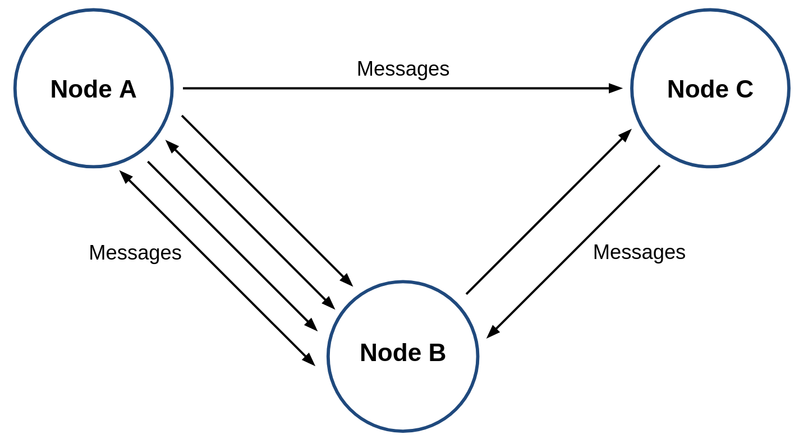
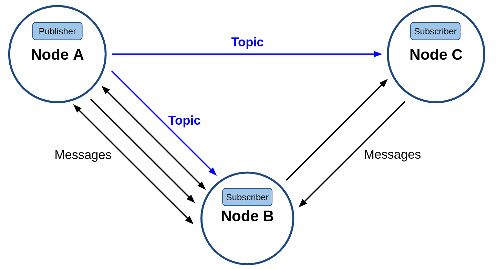
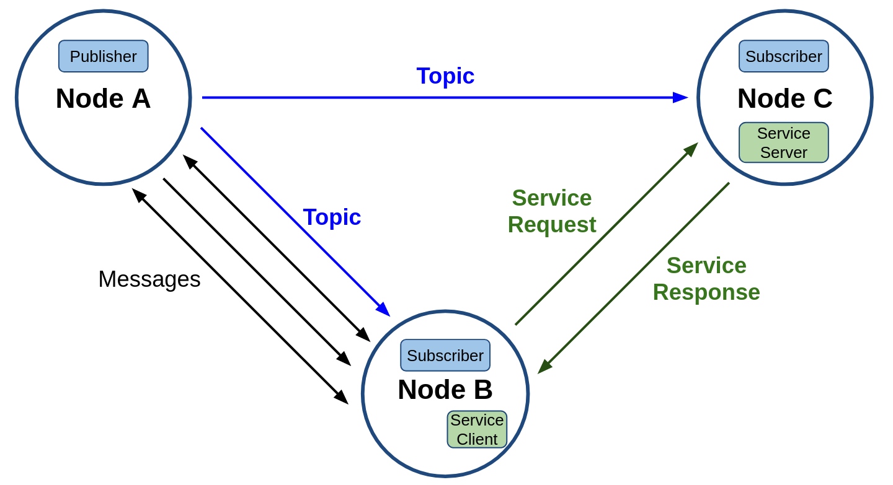
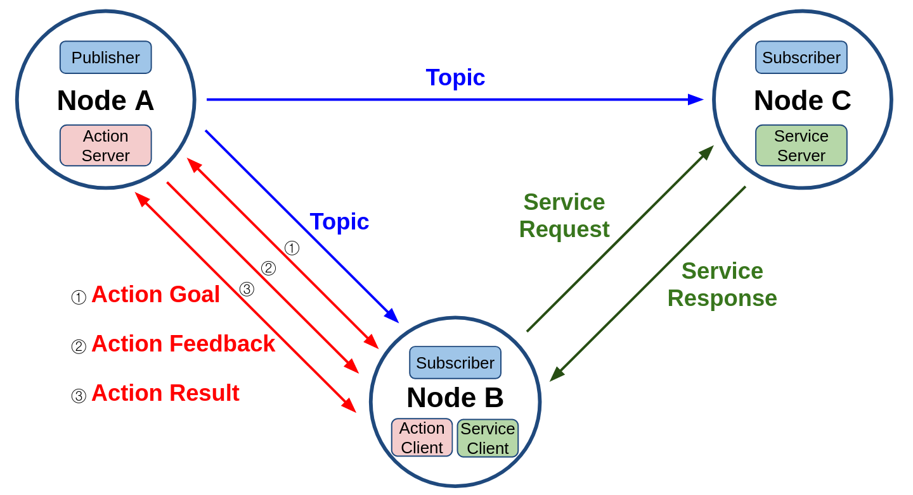
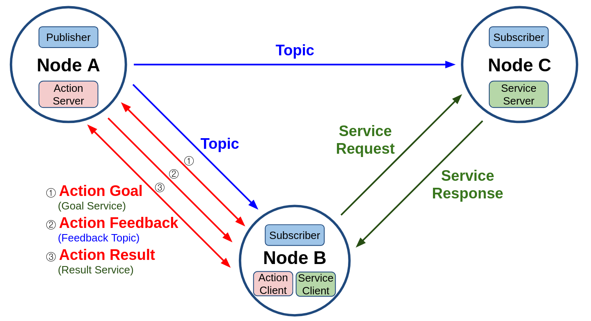
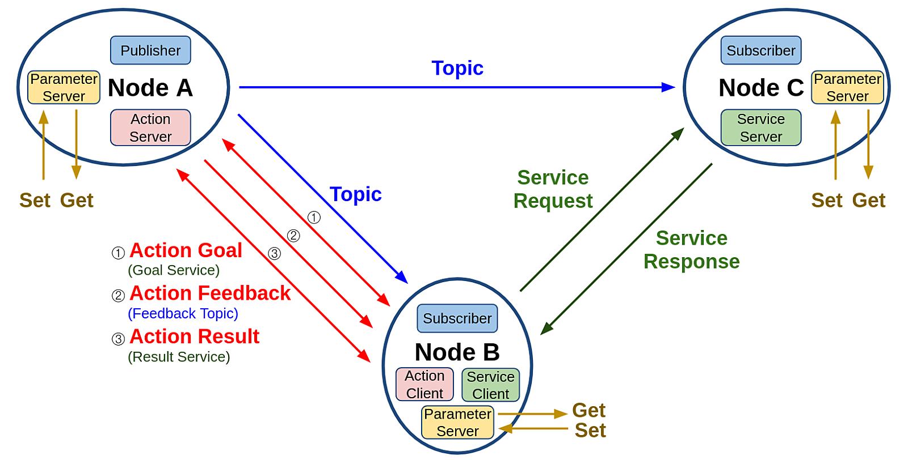
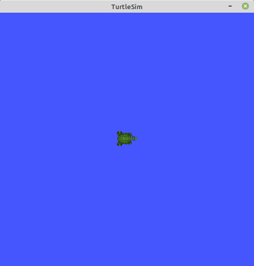
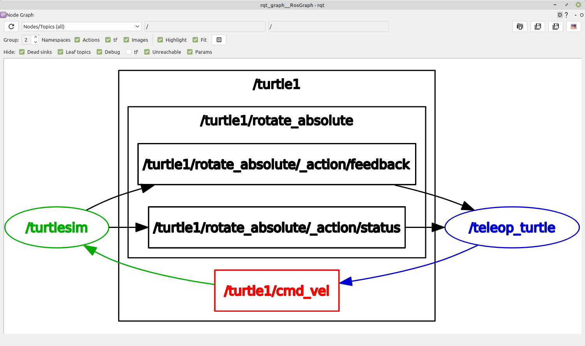
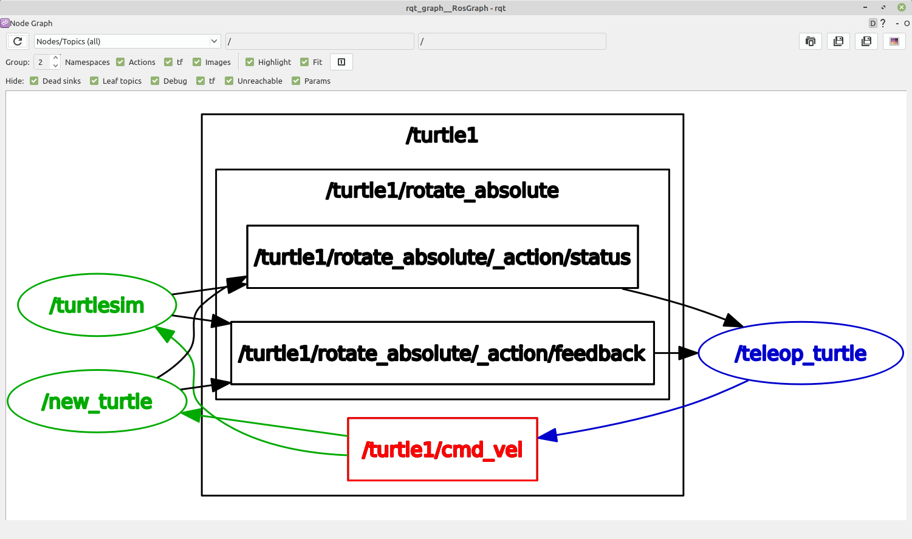

# Chapter 08: Ros 2 노드와 데이터 통신
## 01. 노드(node)와 메시지 통신(message communication)
- 이전 강좌에서도 설명했듯이 노드(node)는 최소 단위의 실행 가능한 프로세스를 가리키는 용어로서 하나의 실행 가능한 프로그램을 이야기하는 것으로 ROS에서는 최소한의 실행 단위로 프로그램을 나누어 작업하게 된다.
- 예를 들어 노드는 원본 영상을 출력하는 카메라 드라이버, 원본 영상에 필터링하는 필터 노드, 필터링 된 영상에서 특징점을 추출하는 노드, 특징점을 이용해 물건을 검출하는 노드, 검출된 물건의 위치로 로봇의 경로를 만들어내는 노드, 모터 드라이버 노드, 경로대로 이동하는 노드 등 각 노드의 역할을 목적에 맞추어 세분화시켜 각 노드들 간의 의존성은 줄여 독립성을 높여 다른 목적의 작업을 할 때 일부 노드를 재사용할 수 있도록 하는 것이다.
- 이에 수많은 노드들이 연동되는 ROS 시스템을 위해서는 노드와 노드 사이에 입력과 출력 데이터를 서로 주고받게 설계해야만 한다.
- 여기서 주고받는 데이터를 ROS에서는 메시지(message)라고 하고 주고받는 방식을 메시지 통신(message communication)이라고 한다.
- 여기서 데이터에 해당되는 메시지(message)는 integer, floating point, boolean, string 와 같은 변수 형태이며 메시지 안에 메시지를 품고 있는 간단한 데이터 구조 및 메시지들의 배열과 같은 구조도 사용할 수 있다.
- 그리고 메시지를 주고받는 통신 방법에 따라 토픽(topic), 서비스(service), 액션(action), 파라미터(parameter)로 나뉘게 된다.

### 1-1. 노드
- 노드(node)는 아래 그림처럼 Node A, Node B, Node C라는 노드가 있을 때 각각의 노드들은 서로 유기적으로 Message로 연결되어 사용된다.
- 지금은 단순히 3개의 노드만 표시하였지만 수행하고자 하는 태스크가 많아질수록 메시지로 연결되는 노드가 늘어나며 시스템이 확장할 수 있게된다.


- 노드들 간의 메시지 통신

- 노드들 간의 메시지는 앞서 설명한 것과 같이 토픽, 서비스, 액션, 파라미터로 나눌 수 있는데 토픽만 예를 들자면 다음과 같다.

### 1-2. 토픽
- 토픽(topic)은 아래 그림의 `Node A - Node B`, `Node A - Node C`처럼 비동기식 단방향 메시지 송수신 방식으로 msg 메시지 형태의 메시지를 발간하는 Publisher와 메시지를 구독하는 Subscriber 간의 통신이라고 볼 수 있다.
- 이는 1:N, N:1, N:N 통신도 가능하며 ROS 메시지 통신에서 가장 널리 사용되는 통신 방법이다.


- 토픽

### 1-3. 서비스
- 서비스(Service)는 아래 그림의 `Node B - Node C`처럼 동기식 양방향 메시지 송수신 방식으로 서비스의 요청(Request)을 하는 쪽을 Service client라고 하며 서비스의 응답(Response)을 하는 쪽을 Service server라고 한다.
- 결국 서비스는 특정 요청을 하는 클라이언트 단과 요청받은 일을 수행 후에 결괏값을 전달하는 서버 단과의 통신이라고 볼 수 있다.
- 서비스 요청 및 응답(Request/Response) 또한 위에서 언급한 msg 메시지의 변형으로 srv 메시지라고 한다.


- 서비스

### 1-4. 액션
- 액션(Action)은 아래 그림의 `Node A - Node B`처럼 비동기식+동기식 양방향 메시지 송수신 방식으로 액션 목표 Goal를 지정하는 Action client과 액션 목표를 받아 특정 태스크를 수행하면서 중간 결괏값에 해당되는 액션 피드백(Feedback)과 최종 결괏값에 해당되는 액션 결과(Result)를 전송하는 Action server 간의 통신이라고 볼 수 있다.
- 액션의 구현 방식을 더 자세히 살펴보면 그 아래의 그림과 같이 토픽(topic)과 서비스(service)의 혼합이라고 볼 수 있는데 액션 목표 및 액션 결과를 전달하는 방식은 서비스와 같으며 액션 피드백은 토픽과 같은 메시지 전송 방식이다.
- 액션 목표/피드백/결과(Goal/Feedback/Result) 메시지 또한 위에서 언급한 msg 메시지의 변형으로 action 메시지라고 한다.


- 액션


- 토픽과 서비스로 구성된 액션

### 1-5. 파라미터
- 파라미터(Parameter)는 아래 그림의 각 노드에 파라미터 관련 Parameter server를 실행시켜 외부의 Parameter client 간의 통신으로 파라미터를 변경하는 것으로 서비스와 동일하다고 볼 수 있다.
- 단 노드 내 매개변수 또는 글로벌 매개변수를 서비스 메시지 통신 방법을 사용하여 노드 내부 또는 외부에서 쉽게 지정(Set) 하거나 변경할 수 있고, 쉽게 가져(Get)와서 사용할 수 있게 하는 점에서 목적이 다르다고 볼 수 있다.


- 파라미터

## 02. 노드 실행 (ros2 run)
- 노드를 실행하기 위해서는 아래와 같이 `ros2 run` 명령어를 이용하여 특정 패키지의 특정 노드를 실행시키게 된다.
- 아래의 두 명령어는 각각 `turtlesim` 패키지의 `turtlesim_node`와 `turtle_teleop_key` 노드를 실행시키게 된다.
```
$ ros2 run turtlesim turtlesim_node
```
```
$ ros2 run turtlesim turtle_teleop_key
```



- 기본적으로 노드를 실행시키는 방법에는 하나의 노드를 실행시키는 `ros2 run` 또는 하나 이상의 노드를 실행시키는 `ros2 launch`를 이용하는 방법 이외에도 `rqt`, `rqt_graph`, `rviz2`와 같이 지정된 실행 명령어를 실행하는 방법이 있다.
- 지정 실행 명령어는 주로 ROS 2의 툴을 실행시킬 때 사용된다.
- 다음 명령어는 노드와 노드 간의 메시지 통신을 그래프 형태로 표시하는 툴인 `rqt_graph`를 실행시키는 명령어이다.
```
rqt_graph
```



## 03. 노드 목록 (ros2 node list)
- 현재 개발 환경에서 동작 중인 노드의 목록을 보기를 원한다면 아래와 같이 `ros2 node list` 명령어를 통해 확인할 수 있다.
- 위에서 실행은 총 3개로 rqt 툴까지 포함하여 3개의 노드의 목록이 결괏값으로 받아 볼 수 있다.
- 노드 파일명과 실제 노드 이름은 다를 수 있다는 것도 알아두자.
- `turtlesim_node` 노드 파일은 `turtlesim`라는 노드명으로 실행되어 있고, `turtle_teleop_key` 노드 파일은 `teleop_turtle`이라는 노드명으로 실행되었다.
- `rqt_graph`는 rqt의 하나의 플러그인 형태로 `rqt_gui_py_node_28168`이라는 노드 이름으로 실행되었는데 rqt의 다양한 툴, 그리고 동일한 툴도 복수개 실행할 수 있도록 rqt 플러그인 류의 툴은 노드 이름에 임의의 번호가 붙게 된다는 것도 알아두자.
```
$ ros2 node list
/rqt_gui_py_node_28168
/teleop_turtle
/turtlesim
```
- 만약 동일 노드를 복수개 실행하려고 한다면 `ros2 run turtlesim turtlesim_node` 같이 이전과 같이 그대로 실행시켜도 되지만 동일한 노드 이름으로 실행되어 된다는 점을 기억해야 한다.
- 동일 이름으로 실행되게 되면 시스템을 구성하는 데에 있어서 복잡하게 된다.
- 만약 노드명을 달리하고 싶다면 아래와 같이 노드 명을 변경하여 실행시키면 된다.
```
$ ros2 run turtlesim turtlesim_node __node:=new_turtle
```
- 이때 실행 중인 노드 목록을 확인하는 아래 명령어로 다시 확인하면 `new_turtle`이 새롭게 추가되었음을 알 수 있다.
- `rqt_graph` 상에서도 그림 9와 같이 지정된 이름을 실행되었음을 확인할 수 있다.
- 현재에는 그림 9와 같이 노드의 이름만 변경되었을 뿐 토픽인 `turtle1/cmd_vel`은 변경되지 않았음을 알 수 있다.
- 그리고 `teleop_turtle` 노드를 이용하여 거북이를 움직여보면 두 개의 노드의 거북이들이 모두 동일하게 움직이는 것을 볼 수 있는데 동일한 토픽을 이용하기 때문이다.
- 이 토픽 또한 토픽명을 변경하거나 name_space를 통해 바꿀 수 있는데 이는 해당 내용을 설명하는 토픽 및 launch 강좌 때에 자세히 다루도록 하겠다.
```
$ ros2 node list
/rqt_gui_py_node_29017
/teleop_turtle
/new_turtle
/turtlesim
```


- new_turtle 명을 이용한 노드가 추가된 모습

## 04. 노드 정보 (ros2 node info)
- 노드의 정보를 확인하기 위해서는 아래와 같이 `ros2 node info` 명령어에 정보를 보기 위한 노드명을 지정하면 된다.
- 이 정보에는 지정된 노드의 Publishers, Subscriber, Service, Action, Parameter 정보를 확인할 수 있다.
```
$ ros2 node info /turtlesim
/turtlesim
  Subscribers:
    /parameter_events: rcl_interfaces/msg/ParameterEvent
    /turtle1/cmd_vel: geometry_msgs/msg/Twist
  Publishers:
    /parameter_events: rcl_interfaces/msg/ParameterEvent
    /rosout: rcl_interfaces/msg/Log
    /turtle1/color_sensor: turtlesim/msg/Color
    /turtle1/pose: turtlesim/msg/Pose
  Service Servers:
    /clear: std_srvs/srv/Empty
    /kill: turtlesim/srv/Kill
    /reset: std_srvs/srv/Empty
    /spawn: turtlesim/srv/Spawn
    /turtle1/set_pen: turtlesim/srv/SetPen
    /turtle1/teleport_absolute: turtlesim/srv/TeleportAbsolute
    /turtle1/teleport_relative: turtlesim/srv/TeleportRelative
    /turtlesim/describe_parameters: rcl_interfaces/srv/DescribeParameters
    /turtlesim/get_parameter_types: rcl_interfaces/srv/GetParameterTypes
    /turtlesim/get_parameters: rcl_interfaces/srv/GetParameters
    /turtlesim/list_parameters: rcl_interfaces/srv/ListParameters
    /turtlesim/set_parameters: rcl_interfaces/srv/SetParameters
    /turtlesim/set_parameters_atomically: rcl_interfaces/srv/SetParametersAtomically
  Service Clients:

  Action Servers:
    /turtle1/rotate_absolute: turtlesim/action/RotateAbsolute
  Action Clients:
```
```
$ ros2 node info /teleop_turtle 
/teleop_turtle
  Subscribers:
    /parameter_events: rcl_interfaces/msg/ParameterEvent
  Publishers:
    /parameter_events: rcl_interfaces/msg/ParameterEvent
    /rosout: rcl_interfaces/msg/Log
    /turtle1/cmd_vel: geometry_msgs/msg/Twist
  Service Servers:
    /teleop_turtle/describe_parameters: rcl_interfaces/srv/DescribeParameters
    /teleop_turtle/get_parameter_types: rcl_interfaces/srv/GetParameterTypes
    /teleop_turtle/get_parameters: rcl_interfaces/srv/GetParameters
    /teleop_turtle/list_parameters: rcl_interfaces/srv/ListParameters
    /teleop_turtle/set_parameters: rcl_interfaces/srv/SetParameters
    /teleop_turtle/set_parameters_atomically: rcl_interfaces/srv/SetParametersAtomically
  Service Clients:

  Action Servers:

  Action Clients:
    /turtle1/rotate_absolute: turtlesim/action/RotateAbsolute
```

[출처] 008 ROS 2 노드와 데이터 통신 (오픈소스 소프트웨어 & 하드웨어: 로봇 기술 공유 카페 (오로카)) | 작성자 표윤석
