# Chapter 09: ROS 2 토픽 (topic)
## 01. 토픽 (topic)
- 토픽(topic)은 아래 그림의 `Node A - Node B`처럼 비동기식 단방향 메시지 송수신 방식으로 msg 메시지 형태의 메시지를 발행하는 `Publisher`와 메시지를 구독하는 `Subscriber` 간의 통신이라고 볼 수 있다.
- 이는 1:1 통신을 기본으로 하지만 두번째 그림의 `Node A - Node B`, `Node A - Node C`와 같이 하나의 토픽(예: Topic C)을 송수신하는 1:N도 가능하고 그 구성 방식에 따라 N:1, N:N 통신도 가능하며 ROS 메시지 통신에서 가장 널리 사용되는 통신 방법이다.
- 그리고 두번째 그림의 `Node A`처럼 하나의 이상의 토픽을 발행할 수 있을 뿐만이 아니라 `Publisher` 기능과 동시에 토픽(예: Topic D)을 구독하는 `Subscriber` 역할도 동시에 수행할 수 있다.
- 원한다면 자신이 발행한 토픽을 셀프 구독할 수 있게 구성할 수도 있다.
- 이처럼 토픽 기능은 목적에 따라 다양한 방법으로 사용할 수 있는데 이러한 유연성으로 다양한 곳에 사용중에 있다.
- 경험상 ROS 프로그래밍시에 70% 이상이 토픽으로 사용될 정도로 통신 방식 중에 가장 기본이 되며 가장 널리쓰이는 방법이다.
- 기본 특징으로 비동기성과 연속성을 가지기에 센서 값 전송 및 항시 정보를 주고 받아야하는 부분에 주로 사용된다.

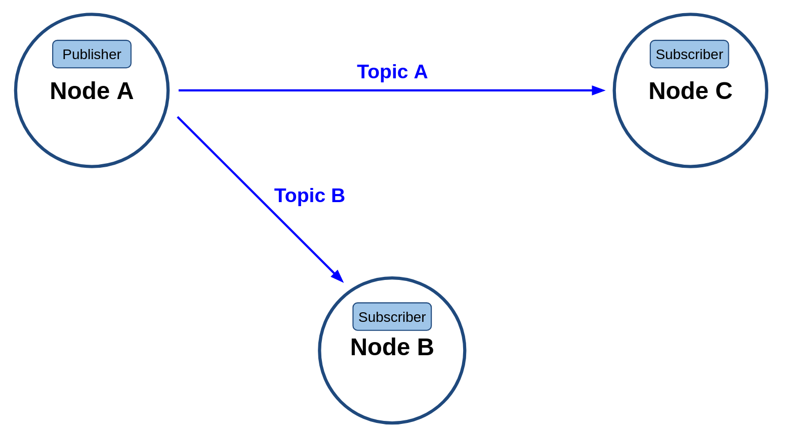
- 퍼블리셔와 섭스크라이버

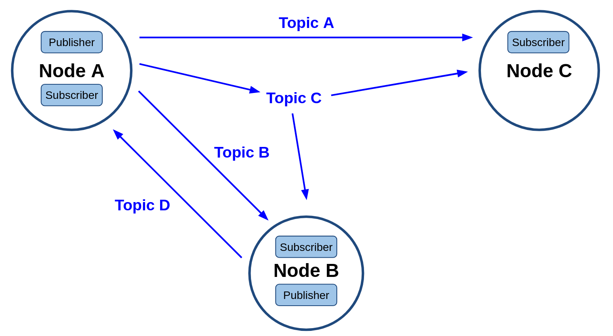
- 다자간 통신

## 02. 토픽 목록 확인 (ros2 topic list)
- 실습을 위해 우리에게 익숙한 turtlesim 패키지의 turtlesim_node (노드명: turtlesim)노드를 이용할 것이며 아래와 같이 실행시키면 아래 그림의 turtlesim을 확인할 수 있다.
```
$ ros2 run turtlesim turtlesim_node
```

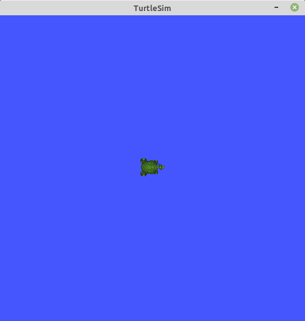

- 그리고 지난 강좌에서 설명하였던 `ros2 node info` 명령어를 이용하여 turtlesim_node (노드명: turtlesim, 이하 turtlesim이라 표기함) 노드의 토픽 정보를 확인해보자.
- 참고로 turtlesim_node 노드는 turtlesim이라는 노드 이름으로 실행된다.
- 서비스, 액션, 파라미터를 제거하여 본다면 아래와 같을 것이다.
- 여기서 알 수 있는 것은 turtlesim 노드는 geometry_msgs/msg/Twist 형태의 메시지인 cmd_vel을 구독하고 있다는 것과 turtlesim/msg/Color 형태의 color_sensor 메시지 형태인 color_sensor, 그리고 turtlesim/msg/Pose 형태의 pose 메시지를 발행하고 있다는 것이다.
```
$ ros2 node info /turtlesim
/turtlesim
  Subscribers:
    /turtle1/cmd_vel: geometry_msgs/msg/Twist
    (생략)
  Publishers:
    /turtle1/color_sensor: turtlesim/msg/Color
    /turtle1/pose: turtlesim/msg/Pose
    (생략)
  Services:
    /clear: std_srvs/srv/Empty
    /kill: turtlesim/srv/Kill
    (생략)
```

- 좀 더 간단하게 메시지들을 확인하고 싶다면 아래 명령어처럼 `ros2 topic list -t`를 이용하면 된다.
- 이전의 명령어가 turtlesim 노드만의 정보를 확인하였다면 `ros2 topic list -t` 명령어는 현재 개발 환경에서 동작 중인 모든 노드들의 토픽 정보를 볼 수 있는 것으로 지금은 turtlesim 노드만이 실행된 상태이기에 turtlesim 노드가 발행, 구독하는 메시지만 표시되고 있다.
- 참고로 `-t` 옵션은 부가적인 것으로 각 메시지의 형태(type)를 함께 표시해준다.
```
$ ros2 topic list -t
/parameter_events [rcl_interfaces/msg/ParameterEvent]
/rosout [rcl_interfaces/msg/Log]
/turtle1/cmd_vel [geometry_msgs/msg/Twist]
/turtle1/color_sensor [turtlesim/msg/Color]
/turtle1/pose [turtlesim/msg/Pose]
```

- 현재 상태는 turtlesim 노드만 실행되었기에 토픽을 주고 받는 상황은 아니다.
- 아래와 같이 rqt_graph를 실행시키면 토픽을 주고 받는 어떠한 상황도 아닌 것임을 그림 4에서 확인할 수 있을 것이다.
```
$ rqt_graph
```

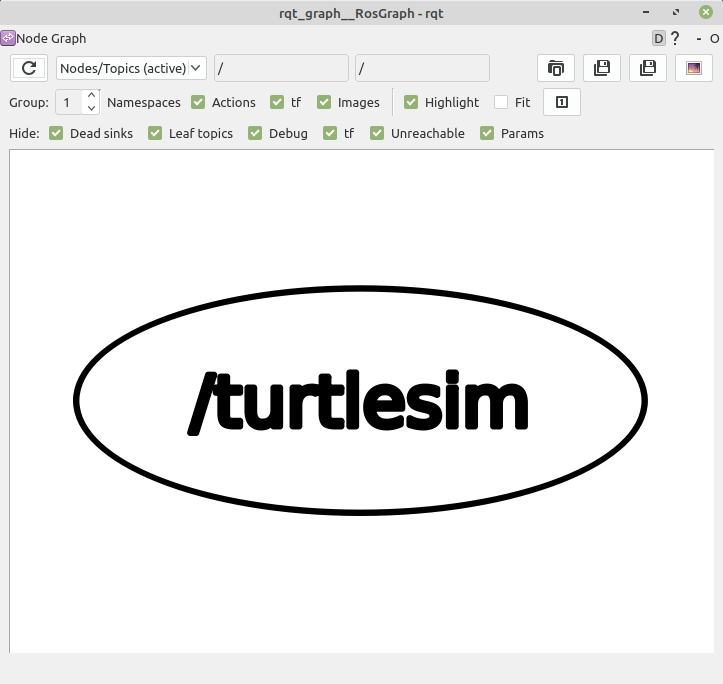

- 여기에 추가로 turtle_teleop_key (노드명: teleop_turtle, 이하 teleop_turtle라고 표기함)를 실행해보자.
- 그 뒤 실행시켜둔 rqt_graph 화면에서 아래 그림과 같이 프로그램의 좌측 상단의 `Refresh ROS graph` 버튼을 클릭하면 최신 상태로 갱신되는데 두번째 그림과 같이 teleop_turtle 노드에서 발행한 cmd_vel 토픽을 turtlesim에서 구독하고 있는 모습을 볼 수 있다.
```
$ ros2 run turtlesim turtle_teleop_key
```

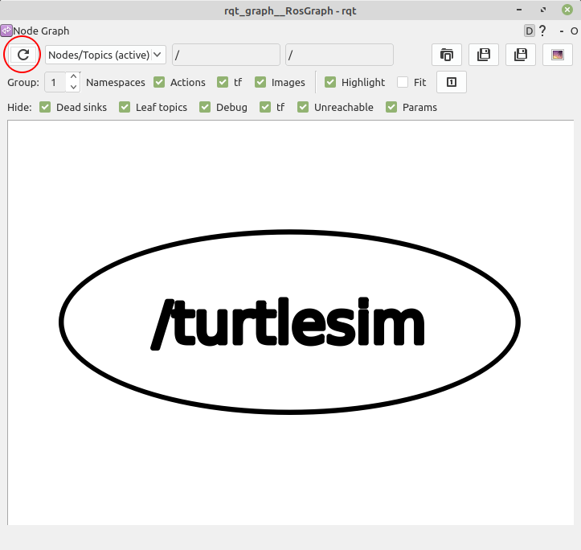

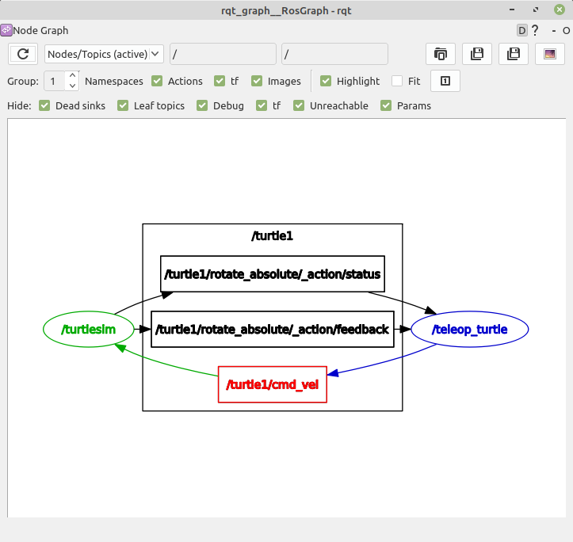

- 분명 위에서는 color_sensor 및 pose 토픽도 있다고 했는데 여기서는 왜 표시가 되지 않는 것일까?
- 분명히 turtlesim 노드는 이 두 개의 토픽을 발행하고 있다.
- 하지만 teleop_turtle를 실행하기 전에 cmd_vel 토픽이 활성화 되지 않았던 것과 마찬가지로 아직 이를 구독하는 노드가 없기 때문이다.
- 만약에 발행하는 노드, 구독하는 노드와 상관없이 모든 토픽을 보기 위해서는 rqt_graph 화면에서 `Dead sinks`와 `Leaf topics`를 해제하여 모두 보이게 하자. 그러면 그림과 같이 확인할 수 있을 것이다.

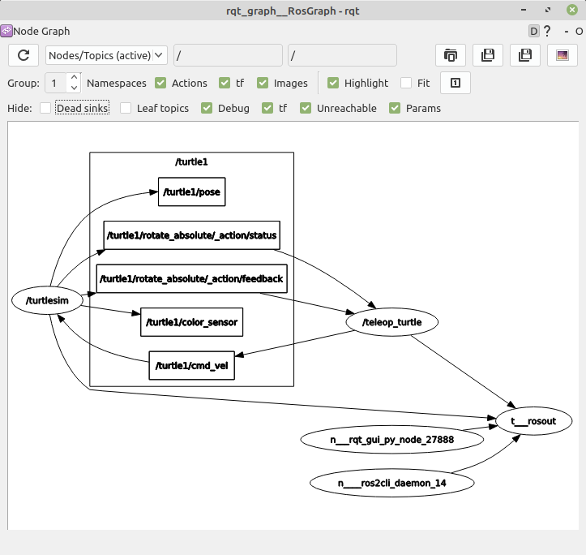

## 03. 토픽 정보 확인 (ros2 topic info)
- rqt_graph를 이용하여 토픽의 pub/sub 상태를 확인하는 방법이외에도 ROS 2 CLI 툴을 이용하여 하기와 같이 토픽 메시지 형태, 토픽의 발행 및 구독 정보를 확인할 수도 있다.
- 경험상 이 명령어는 잘 사용하지는 않는다.
```
$ ros2 topic info /turtle1/cmd_vel
Type: geometry_msgs/msg/Twist
Publisher count: 1
Subscriber count: 1
```

## 04. 토픽 내용 확인 (ros2 topic echo)
- 이번에는 특정 토픽의 메시지 내용을 실시간으로 표시하는 `ros2 topic echo`를 사용해보자.
- 다음 명령어와 같이 `/turtle1/cmd_vel`라고 토픽을 지정하게 되면 해당 토픽의 값을 확인해볼 수 있다.
- 참고로 `/turtle1/cmd_vel` 토픽을 발행하는 teleop_turtle 노드를 실행한 터미널 창에서 방향 키보드 키(←↑ ↓→)를 눌러 명령을 내려야지만 토픽 값을 확인할 수 있다.
- 아래의 결과를 보자면 `/turtle1/cmd_vel` 토픽의 linear에 x, y, z 값이 있으며, angular에 x, y, z 값이 존재한다는 것을 알 수 있다.
- 총 6개의 값으로 구성되어 있으며 현재 linear.x 값으로 1.0 m/s 임을 확인할 수 있다. 
- 참고로 모든 메시지는 meter, second, degree, kg 등 SI 단위를 기본으로 사용한다.
```
$ ros2 topic echo /turtle1/cmd_vel
linear:
x: 1.0
y: 0.0
z: 0.0
angular:
x: 0.0
y: 0.0
z: 0.0
```

## 05. 토픽 대역폭 확인 (ros2 topic bw)
- 위에서 토픽의 내용을 확인해보았다.
- 이번에는 메시지의 대역폭, 즉 송수신받는 토픽 메시지의 크기를 확인해보자.
- 크기 확인은 아래 명령어와 같이 `ros2 topic bw`으로 지정된 토픽 메시지의 송수신되는 토픽의 초당 대역폭을 알 수 있다.
- teleop_turtle 노드에서 지속적으로 메시지를 보내는 상황이라면 평균 1.74KB/s의 대역폭으로 /turtle1/cmd_vel 토픽이 사용되는 것을 확인할 수 있다.
- 이는 사용하는 메시지 형태 및 주기에 따라 달라질 수 있다.
```
$ ros2 topic bw /turtle1/cmd_vel
Subscribed to [/turtle1/cmd_vel]
average: 1.74KB/s
mean: 0.05KB min: 0.05KB max: 0.05KB window: 100
(생략)
```

## 06. 토픽 주기 확인 (ros2 topic hz)
- 토픽의 전송 주기를 확인하려면 `ros2 topic hz` 명령어를 이용하면 된다.
- teleop_turtle 노드에서 지속적으로 /turtle1/cmd_vel 토픽을 발행한다면 아래와 같이 평균 33.2 Hz 정도가 나올 것이다.
- 즉 0.03 초에 한번씩 토픽을 발행하고 있다는 것이다.
- 이는 teleop_turtle 노드에서 얼마나 자주 /turtle1/cmd_vel 토픽을 발행하는지에 따라 달라질 수 있다.
```
$ ros2 topic hz /turtle1/cmd_vel
average rate: 33.212
min: 0.029s max: 0.089s std dev: 0.00126s window: 2483
(생략)
```

## 07. 토픽 지연 시간 확인 (ros2 topic delay)
- 토픽은 RMW 및 네트워크 장비를 거치기 때문에 latency 즉 지연 시간이 반드시 존재하게 된다.
- 이 지연 시간을 체크하는 방식으로 유저가 직접 코드로 구현하는 방법도 있겠지만 메시지내에 header라는 stamp 메시지를 사용하고 있다면 `ros2 topic delay`를 명령어를 이용하여 메시지는 발행한 시간과 구독한 시간의 차를 계산하여 지연 시간을 확인할 수 있다.
```
$ ros2 topic delay /TOPIC_NAME
average delay: xxx.xxx
min: xxx.xxxs max: xxx.xxxs std dev: xxx.xxxs window: 10
```

## 08. 토칙 발행 (ros2 topic pub)
- 토픽의 발행(publish)은 ROS 프로그램에 내장하는게 기본이다.
- 이는 ROS 프로그래밍 시간에 다루도록 하고 여기서는 `ros2 topic pub` 명령어를 통해 간단히 토픽을 발행하는 테스트를 해보자.
- 이 명령어의 사용은 다음과 같다.
- `ros2 topic pub` 명령어에 토픽 이름, 토픽 메시지 타입, 메시지 내용을 기술하면 된다.
```
ros2 topic pub <topic_name> <msg_type> "<args>"
```
- 즉, 아래와 같이 기술하면 되는데 아래 명령어를 풀어 해석하자면 `--once` 옵션을 사용하여 단 한번의 발행만을 수행하도록 하였으며, 토픽 이름으로는 /turtle1/cmd_vel 을 사용하였고, 토픽 메시지 타입은 geometry_msgs/msg/Twist 을 사용하였다.
- 메시지 내용으로는 병진 속도 linear.x 값으로 2.0 m/s를 넣었고, 회전 속도 angular.z 값으로 1.8 rad/s를 입력하였다.
```
$ ros2 topic pub --once /turtle1/cmd_vel geometry_msgs/msg/Twist "{linear: {x: 2.0, y: 0.0, z: 0.0}, angular: {x: 0.0, y: 0.0, z: 1.8}}"
```
- 이를 실행시키면 아래 그림과 같이 거북이가 정해진 병진 속도 및 회전 속도로 이동되었음을 확인할 수 있다.

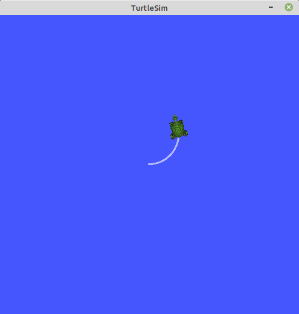

- 지속적인 발행을 원한다면 `--once` 옵션 제거하고 대신 `--rate 1` 옵션처럼 주기 1Hz의 발행도 할 수 있다. 이를 사용하면 아래 그림과 같이 동작할 것이다.
```
$ ros2 topic pub --rate 1 /turtle1/cmd_vel geometry_msgs/msg/Twist "{linear: {x: 2.0, y: 0.0, z: 0.0}, angular: {x: 0.0, y: 0.0, z: 1.8}}"
```

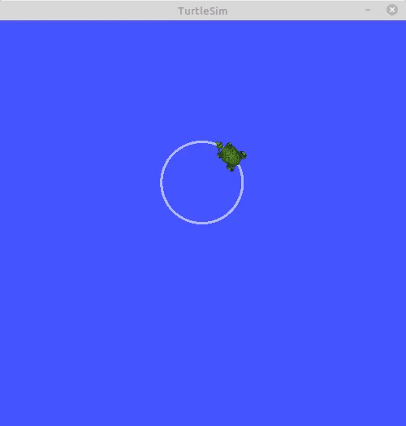

- 그리고 이를 가지고 회전 속도를 몇번 수정하여 입력하면 그림 10과 같은 모습도 만들어낼 수 있다.

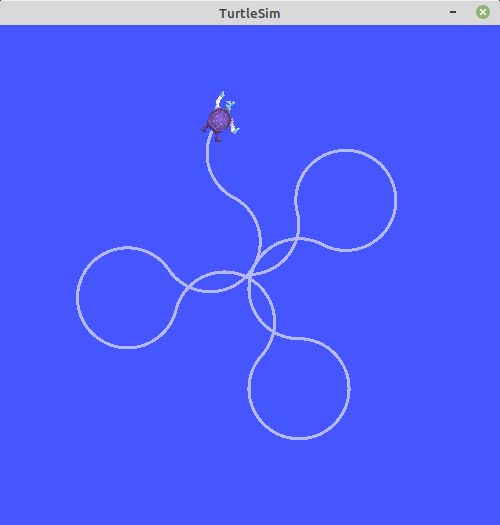

## 09. bag 기록 (ros2 bag record)
- ROS에는 발행하는 토픽을 파일 형태로 저장하고 필요할 때 저장된 토픽을 다시 불러와 동일 타이밍으로 재생할 수 있는 기능이 있다.
- 이를 rosbag이라고 한다.
- 이는 매우 유용한 ROS의 기능으로 디버깅에 큰 도움을 준다. 
- 예를 들어 내가 SLAM 알고리즘을 개발한다면 알고리즘 개발에 집중하기 위해서는 SLAM에 필요한 라이다와 같은 센서 정보와 로봇의 위치 정보인 오도메트리와 같은 상태 정보가 필요한데 매번 로봇을 구동시켜 데이터를 취득하기도 힘들고 데이터 취득을 매번하여 테스트를 하더라도 센서 정보 및 로봇 상태 값에 따라 결괏값이 상이해져 알고리즘이 좋아진 것인지 테스트할 때 운이 좋게 센서 및 로봇 상태 값이 좋았는지 구분하기 어렵다.
- 이럴 때에는 알고리즘의 입력 값을 고정하고 반복하여 테스트할 수 있다면 알고리즘만의 개선 작업 및 성능 검증 테스트를 할 수 있게 된다.
- rosbag은 이러한 상황에서 원하는 토픽을 기록하고 재생하는 도구이다.
- rosbag은 다음과 같이 bag 기록 (ros2 bag record) 명령어에 내가 기록하고자 하는 토픽 이름을 기재하면 된다.
- 예를 들어 /turtle1/cmd_vel 토픽을 기록하려면 다음 명령어와 같이 실행해주면 된다.
- 기록 종료는 프로그램을 종료하면 되는데 일반적인 노드 종료와 마찬가지로 해당 터미널 창에서 `Ctrl + c`를 눌러주면 된다.
- 기록이 종료되면 `rosbag2_2020_09_04-08_31_06` 이라는 이름으로 폴더가 생성된다.
- 참고로 원하는 이름이 별도로 있다면 `ros2 bag record -o 이름 /turtle1/cmd_vel` 과 같이 `-o` (output) 옵션을 이용하여 특정 이름을 지정해도 된다.
```
$ ros2 bag record /turtle1/cmd_vel
[INFO]: Opened database 'rosbag2_2020_09_04-08_31_06'.
[INFO]: Listening for topics...
[INFO]: Subscribed to topic '/turtle1/cmd_vel'
```

## 10. bag 정보 (ros2 bag info)
- 저장된 rosbag 파일의 정보를 확인하려면 아래 예제와 같이 bag 정보 (ros2 bag info) 명령어를 이용하면 된다.
- 내용을 살펴보면 방금 전 우리가 기록한 이 rosbag 파일은 84.4 KiB 크기에 31.602s 시간 동안 기록되었고, 기록이 언제 시작되고 언제 끝났는지 타임스태프와 취득한 토픽의 이름 메시지 형태 메시지 별 갯수와 총 갯수 등이 기록되어 있다.
```
$ ros2 bag info rosbag2_2020_09_04-08_31_06/

Files:             rosbag2_2020_09_04-08_31_06.db3
Bag size:          84.4 KiB
Storage id:        sqlite3
Duration:          31.602s
Start:             Sep  4 2020 08:31:09.952 (1599175869.952)
End                Sep  4 2020 08:31:41.554 (1599175901.554)
Messages:          355
Topic information: Topic: /turtle1/cmd_vel | Type: geometry_msgs/msg/Twist | Count: 355 | Serialization Format: cdr
```

## 11. bag 재생 (ros2 bag play)
- rosbag 파일을 기록하고 정보를 확인해봤으니 이제는 재생을 해보자.
- 일단 turtlesim 노드를 종료한 후 다시 시작하여 초기화를 해준 후 아래의 예제처럼 rosbag를 재생하면 기록 시간 타이밍에 따라 토픽이 재생됨을 확인할 수 있다.
- 이는 위에서 설명한 `ros2 topic echo /turtle1/cmd_vel` 명령어를 이용하여 터미널 창에서 학인해도 되고, 아래 그림과 같이 turtlesim 노드위의 거북이의 움직임을 비교해도 된다.
```
$ ros2 bag play rosbag2_2020_09_04-08_31_06/
[INFO]: Opened database 'rosbag2_2020_09_04-08_31_06/'.
```

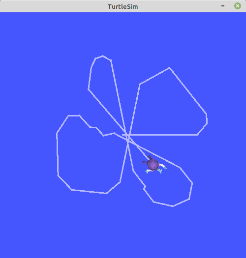

## 12. ROS 인터페이스 (interface)
- ROS의 노드 간에 데이터를 주고받을 때에는 토픽, 서비스, 액션이 사용되는데 이 때 사용되는 데이터의 형태를 ROS 인터페이스(interface)라고 한다.
- ROS 인터페이스에는 ROS 2에 새롭게 추가된 IDL(interface definition language)과 ROS 1부터 ROS 2까지 널리 사용 중인 msg, srv, action 이 있다.
- 토픽, 서비스, 액션은 각각 msg, srv, action interface를 사용하고 있으며 정수, 부동 소수점, 불리언과 같은 단순 자료형을 기본으로 하여 메시지 안에 메시지를 품고 있는 간단한 데이터 구조 및 메시지들이 나열된 배열과 같은 구조도 사용할 수 있다.

#### 단순 자료형
- 예) 정수(integer), 부동 소수점(floating point), 불(boolean)
- [단순 자료형](https://github.com/ros2/common_interfaces/tree/foxy/std_msgs)

#### 메시지 안에 메시지를 품고 있는 간단한 데이터 구조
- 예) geometry_msgs/msgs/Twist의 `Vector3 linear`
- [메시지 안에 메시지를 품고 있는 간단한 데이터 구조](https://github.com/ros2/common_interfaces/blob/foxy/geometry_msgs/msg/Twist.msg)

#### 메시지들이 나열된 배열과 같은 구조
- 예) sensor_msgs/msgs/LaserScan 의 `float32[] ranges`
- [메시지들이 나열된 배열과 같은 구조](https://github.com/ros2/common_interfaces/blob/foxy/sensor_msgs/msg/LaserScan.msg)

## 13. 메시지 인터페이스 (message interface, msg)
- 지금까지 우리가 다루었던 아래 그림의 /turtle1/cmd_vel 토픽은 geometry_msgs/msgs/Twist 형태이다.
- 이름이 좀 긴데 풀어서 설명하면 기하학 관련 메시지를 모아둔 geometry_msgs 패키지의 msgs 분류의 Twist 데이터 형태라는 것이다. 
- Twist 데이터 형태를 자세히 보면 Vector3 linear과 Vector3 angular 이라고 되어 있다.
- 이는 메시지 안에 메시지를 품고 있는 것으로 Vector3 형태에 linear 이라는 이름의 메시지와 Vector3 형태에 angular 이라는 이름의 메시지, 즉 2개의 메시지가 있다는 것이며 Vector3는 다시 float64 형태에 x, y, z 값이 존재한다.
- 다시 말해 geometry_msgs/msgs/Twist 메시지 형태는 float64 자료형의 linear.x, linear.y, linear.z, angular.x, angular.y, angular.z 라는 이름의 메시지인 것이다.
- 이를 통해 병진 속도 3개, 회전 속도 3개를 표현할 수 있게 된다.

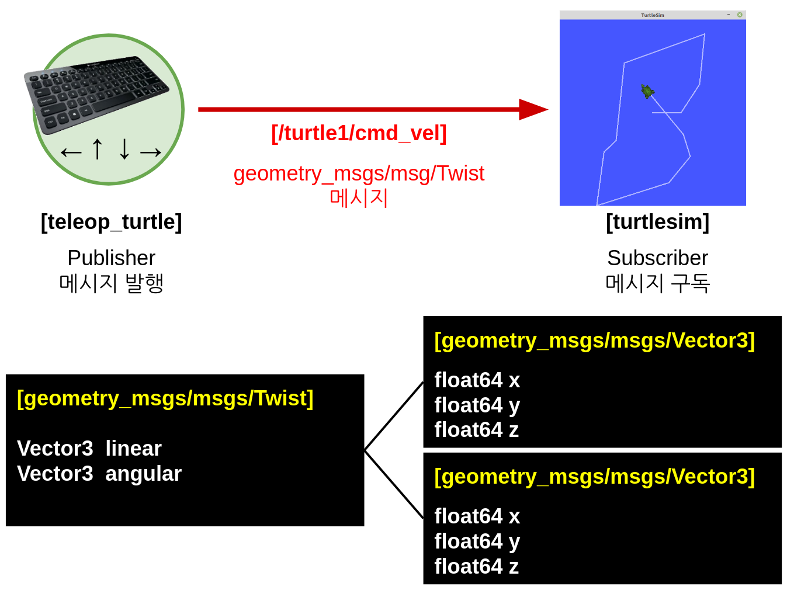

- 이 메시지들을 살펴보는 방법으로는 직접 코드를 보는 방법과 `ros2 interface show` 명령어를 이용하는 방법이 있다.
- 아래 명령어와 같이 알아보고자 하는 메시지를 매개변수로 추가를 하면 다음과 같이 각 메시지 형태 및 메시지 이름을 확인할 수 있다.
```
$ ros2 interface show geometry_msgs/msg/Twist
Vector3 linear
Vector3 angular
```
```
$ ros2 interface show geometry_msgs/msg/Vector3
float64 x
float64 y
float64 z
```
- `ros2 interface` 에는 show 이외에도 list, package, packages, proto가 있는데 list는 현재 개발 환경의 모든 msg, srv, action 메시지를 보여주며, packages는 msg, srv, action 인터페이스를 담고 있는 패키지의 목록을 보여준다.
- package 옵션에 패키지명을 입력하면 지정한 패키지에 포함된 인터페이스들을 보여주고 proto에 특정 인터페이스 형태를 입력하면 그 인터페이스의 기본 형태를 표시해준다.
```
$ ros2 interface list
Messages:
    action_msgs/msg/GoalInfo
    action_msgs/msg/GoalStatus
    action_msgs/msg/GoalStatusArray
(생략)
Services:
    action_msgs/srv/CancelGoal
    composition_interfaces/srv/ListNodes
(생략)
Actions:
    action_tutorials_interfaces/action/Fibonacci
    example_interfaces/action/Fibonacc
(생략)
```
```
$ ros2 interface packages
action_msgs
action_tutorials_interfaces
actionlib_msgs
builtin_interfaces
(생략)
```
```
$ ros2 interface package turtlesim
turtlesim/srv/TeleportAbsolute
turtlesim/srv/SetPen
turtlesim/msg/Color
turtlesim/action/RotateAbsolute
turtlesim/msg/Pose
turtlesim/srv/Spawn
turtlesim/srv/TeleportRelative
turtlesim/srv/Kill
```
```
$ ros2 interface proto geometry_msgs/msg/Twist
"linear:
  x: 0.0
  y: 0.0
  z: 0.0
angular:
  x: 0.0
  y: 0.0
  z: 0.0
"
```
- 지금까지 설명한 메시지는 토픽에 해당되는 msg 인터페이스이다.
- 이 이외에도 `ros2 interface list` 명령어를 통해서 보았듯이 서비스, 액션 메시지가 또 있으며 각각 srv, action 인터페이스라 부르며 그 형태가 약간씩 차이가 있다.

[출처] 009 ROS 2 토픽 (topic) (오픈소스 소프트웨어 & 하드웨어: 로봇 기술 공유 카페 (오로카)) | 작성자 표윤석
