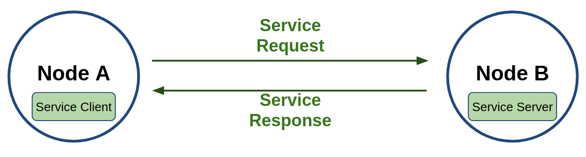
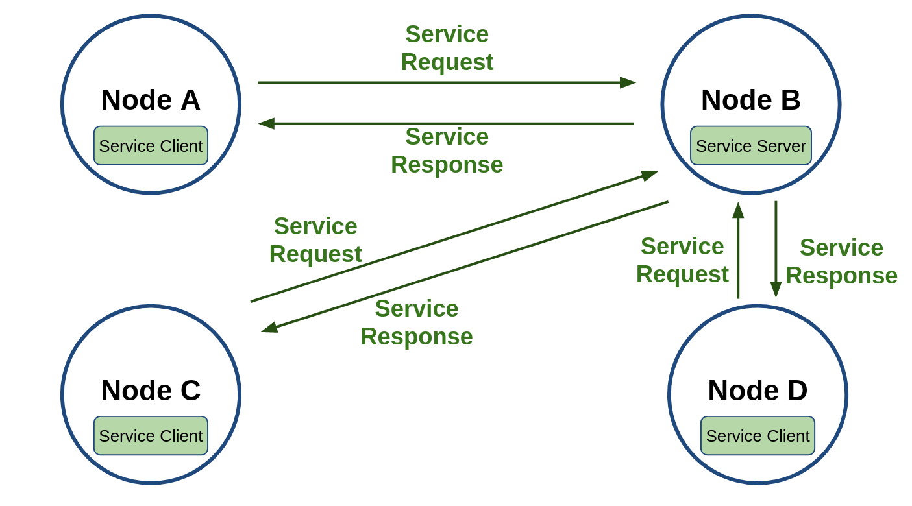
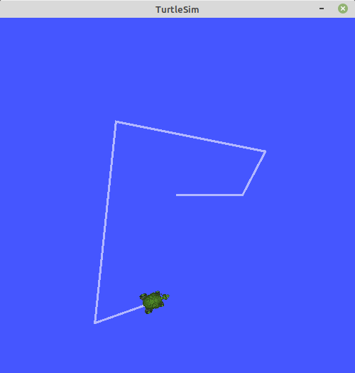
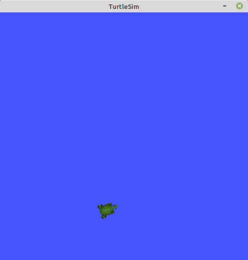
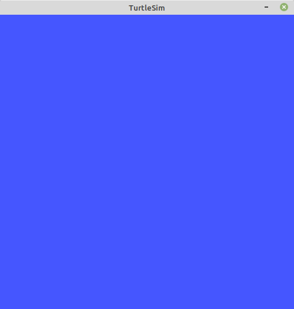
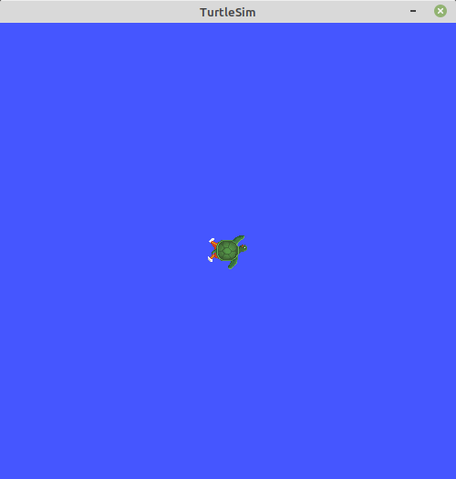
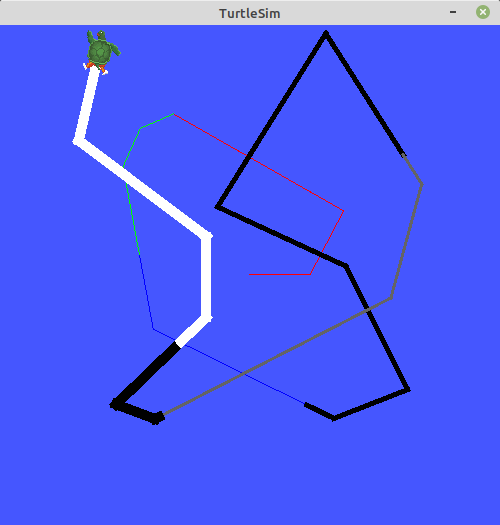
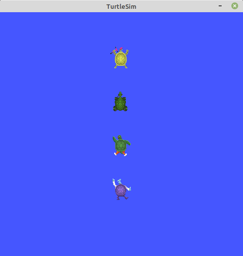

# Chapter 10: ROS 2 서비스 (service)
## 01. 서비스 (service)
- 서비스(service)는 아래 그림의 `Node A - Node B`처럼 동기식 양방향 메시지 송수신 방식으로 서비스의 요청(Request)을 하는 쪽을 Service Client라고 하며 요청받은 서비스를 수행한 후 서비스의 응답(Response)을 하는 쪽을 Service Server라고 한다.
- 결국 서비스는 특정 요청을 하는 클라이언트 단과 요청받은 일을 수행 후에 결괏값을 전달하는 서버 단과의 통신이라고 볼 수 있다.
- 서비스 요청 및 응답(Request/Response) 또한 위에서 언급한 msg 인터페이스의 변형으로 srv 인터페이스라고 한다.


- 서비스 통신에서의 서비스 서버와 서비스 클라이언트

- 서비스는 아래 그림과 같이 동일 서비스에 대해 복수의 클라이언트를 가질 수 있도록 설계되었다.
- 단, 서비스 응답은 서비스 요청이 있었던 서비스 클라이언트에 대해서만 응답을 하는 형태로 그림의 구성에서 예를 들자면 Node C의 Service Client가 Node B의 Service Server에게 서비스 요청을 하였다면 Node B의 Service Server는 요청받은 서비스를 수행한 후 Node C의 Service Client에게만 서비스 응답을 하게된다.


- 서비스 서버와 클라이언트의 관계

## 02. 서비스 목록 확인 (ros2 service list)
- 우선 실습을 위해 우리에게 너무나도 익숙한 turtlesim 패키지의 turtlesim_node (노드명: turtlesim)노드를 이용할 것이며 아래와 같이 실행하자.
```
$ ros2 run turtlesim turtlesim_node
```
- 그 뒤 아래와 같이 서비스 목록 확인 (ros2 service list) 명령어로 현재 실행 중인 노드들의 서비스 목록을 확인해보자.
```
$ ros2 service list
/clear
/kill
/reset
/spawn
/turtle1/set_pen
/turtle1/teleport_absolute
/turtle1/teleport_relative
/turtlesim/describe_parameters
/turtlesim/get_parameter_types
/turtlesim/get_parameters
/turtlesim/list_parameters
/turtlesim/set_parameters
/turtlesim/set_parameters_atomically
```
- 다양한 서비스들이 포함되어 있는데 parameters 가 붙어있는 서비스는 파라미터와 관련된 내용으로 모든 노드의 기본 기능으로 포함되어 있다.
- 이에 대한 부분은 파라미터 강좌때 더 자세히 설명하기로 하고 오늘은 아래의 7가지 서비스에 대해 집중적으로 살펴보자.
```
/clear
/kill
/reset
/spawn
/turtle1/set_pen
/turtle1/teleport_absolute
/turtle1/teleport_relative
```

## 03. 서비스 형태 확인 (ros2 service type)
- 특정 서비스의 형태가 궁금하다면 서비스 형태 확인 명령어인 `ros2 service type`을 이용하면 된다.
- 사용 방법은 다음과 같이 명령어 뒤에 특정 서비스명을 입력하면 어떤 형태의 서비스인지 확인할 수 있다.
- 예를 들어 아애와 같이 clear 서비스는 std_srvs/srv/Empty 형태이고, kill 서비스는 turtlesim/srv/Kill 형태임을 확인할 수 있다.
```
$ ros2 service type /clear
std_srvs/srv/Empty
```
```
$ ros2 service type /kill
turtlesim/srv/Kill
```
```
$ ros2 service type /spawn
turtlesim/srv/Spawn
```
- 참고로 서비스 형태 확인 명령어가 아니더라도 위에서 설명하였던 서비스 목록 확인 (ros2 service list) 명령어에 옵션으로 `-t`를 붙여주면 형태를 서비스 목록과 함께 볼 수 있다.
```
$ ros2 service list -t
/clear [std_srvs/srv/Empty]
/kill [turtlesim/srv/Kill]
/reset [std_srvs/srv/Empty]
/spawn [turtlesim/srv/Spawn]
/turtle1/set_pen [turtlesim/srv/SetPen]
/turtle1/teleport_absolute [turtlesim/srv/TeleportAbsolute]
/turtle1/teleport_relative [turtlesim/srv/TeleportRelative]
(생략)
```

## 04. 서비스 찾기 (ros2 service find)
- `3. 서비스 형태 확인`에서 언급한 서비스 형태 확인 명령어와 반대로 특정 형태를 입력하면 해당 형태의 서비스를 사용하는 서비스명을 확인하는 명령어도 있다.
- 사용법은 아래와 같이 `ros2 service find` 명령어에 매개변수로 특정 서비스 형태를 적어주면 된다.
```
$ ros2 service find std_srvs/srv/Empty
/clear
/reset
```
```
$ ros2 service find turtlesim/srv/Kill
/kill
```

## 05. 서비스 요청 (ros2 service call)
- 실제 서비스 서버에게 서비스 요청(Request)을 해보도록 하자.
- 서비스 요청은 다음과 같이 `ros2 service call` 명령어를 이용하며 매개 변수로 서비스명, 서비스 형태, 서비스 요청 내용을 기술하면 된다.
```
ros2 service call <service_name> <service_type> "<arguments>"
```
- 첫번째로 다룰 서비스는 /clear 서비스로 turtlesim 노드를 동작할 때 표시되는 이동 궤적을 지우는 서비스이다.
- 이를 확인하기 위해서는 아래와 같이 teleop_turtle 노드를 실행시켜서 아래 그림처럼 미리 실행시켜둔 turtlesim을 움직여보자.
```
$ ros2 run turtlesim turtle_teleop_key
```



- 그 뒤 아래의 명령어로 /clear 서비스를 요청해보자.
- 위 그림의 이동 궤적이 서비스 요청 후에는 그림 4처럼 모두 지워짐을 확인할 수 있다.
- 아래 명령어에서 `<arguments>` 가 생략되었는데 이는 std_srvs/srv/Empty 이라는 서비스 형태가 아무런 내용이 없는 형태로 사용할 수 있기 때문이다.
```
$ ros2 service call /clear std_srvs/srv/Empty
requester: making request: std_srvs.srv.Empty_Request()
response:
std_srvs.srv.Empty_Response()
```



- 이번에는 /kill 서비스를 요청해보자.
- /kill 서비스는 죽이고자하는 거북이 이름을 서비스 요청의 내용으로 입력하면되는데 아래과 같이 turtle1이라고 이름을 지정하면 아래 그림과 같이 거북이가 사라졌음을 확인할 수 있다.
```
$ ros2 service call /kill turtlesim/srv/Kill "name: 'turtle1'"
requester: making request: turtlesim.srv.Kill_Request(name='turtle1')
response:
turtlesim.srv.Kill_Response()
```



- 이번에는 /reset 서비스를 요청해보자.
- 이 서비스는 아래 그림과 같이 모든 것이 리셋이 되면서 없어졌던 거북이가 다시 등장하거나 이동한 후에 모든 궤적도 사라지고 원점에 재위치 시킨다는 것을 확인할 수 있다.
```
$ ros2 service call /reset std_srvs/srv/Empty
requester: making request: std_srvs.srv.Empty_Request()
response:
std_srvs.srv.Empty_Response()
```



- 이번에는 /set_pen 서비스를 요청해보자.
- 이 서비스는 지정한 거북이의 궤적 색과 크기를 변경하는 것으로 아래와 같이 r, g, b 값을 조합하여 색을 지정하고, width로 궤적의 크기를 지정할 수 있다.
- 이를 여러번 값을 변경해보며 테스트하면 아래 그림과 같다.
```
$ ros2 service call /turtle1/set_pen turtlesim/srv/SetPen "{r: 255, g: 255, b: 255, width: 10}"
requester: making request: turtlesim.srv.SetPen_Request(r=255, g=255, b=255, width=10, off=0)
response:
turtlesim.srv.SetPen_Response()
```



- 마지막으로 /spawn 서비스를 요청해보자.
- 이 서비스는 지정한 위치 및 자세에 지정한 이름으로 거북이를 추가시키게된다.
- 이름은 옵션으로 지정하지 않으면 turtle2처럼 자동으로 지정되며 동일한 이름을 사용할 수는 없다.
- 아래 예제에서는 기본으로 지정된 turtle1을 /kill 서비스를 이용해 없애고 닌자거북이 4총사인 leonardo, raffaello, michelangelo, donatello를 생성한 모습이다.
- 이를 수행하면 아래 그림과 같이 4마리의 거북이를 볼 수 있다.
```
$ ros2 service call /kill turtlesim/srv/Kill "name: 'turtle1'"
requester: making request: turtlesim.srv.Kill_Request(name='turtle1')
response:
turtlesim.srv.Kill_Response()

$ ros2 service call /spawn turtlesim/srv/Spawn "{x: 5.5, y: 9, theta: 1.57, name: 'leonardo'}"
requester: making request: turtlesim.srv.Spawn_Request(x=5.5, y=9.0, theta=1.57, name='leonardo')
response:
turtlesim.srv.Spawn_Response(name='leonardo')

$ ros2 service call /spawn turtlesim/srv/Spawn "{x: 5.5, y: 7, theta: 1.57, name: 'raffaello'}"
requester: making request: turtlesim.srv.Spawn_Request(x=5.5, y=7.0, theta=1.57, name='raffaello')
response:
turtlesim.srv.Spawn_Response(name='raffaello')

$ ros2 service call /spawn turtlesim/srv/Spawn "{x: 5.5, y: 5, theta: 1.57, name: 'michelangelo'}"
requester: making request: turtlesim.srv.Spawn_Request(x=5.5, y=5.0, theta=1.57, name='michelangelo')
response:
turtlesim.srv.Spawn_Response(name='michelangelo')

$ ros2 service call /spawn turtlesim/srv/Spawn "{x: 5.5, y: 3, theta: 1.57, name: 'donatello'}"
requester: making request: turtlesim.srv.Spawn_Request(x=5.5, y=3.0, theta=1.57, name='donatello')
response:
turtlesim.srv.Spawn_Response(name='donatello')
```



```
$ ros2 topic list
/donatello/cmd_vel
/donatello/color_sensor
/donatello/pose
/leonardo/cmd_vel
/leonardo/color_sensor
/leonardo/pose
/michelangelo/cmd_vel
/michelangelo/color_sensor
/michelangelo/pose
/new_turtle/cmd_vel
/new_turtle/pose
/parameter_events
/raffaello/cmd_vel
/raffaello/color_sensor
/raffaello/pose
/rosout
/turtle1/cmd_vel
/turtle1/color_sensor
/turtle1/pose
/turtle2/cmd_vel
/turtle2/pose
/turtle3/cmd_vel
/turtle3/color_sensor
/turtle4/cmd_vel
/turtle4/color_sensor
/turtle4/pose
```

## 06. 서비스 인터페이스 (service interface, srv)
- Ch09 강좌에서는 메시지 인터페이스(message interface, msg)에 대해 알아보았다.
- 서비스 또한 토픽과 마찬가지로 별도의 인터페이스를 가지고 있는데 이를 서비스 인터페이스라 부르며, 파일로는 srv 파일을 가르킨다.
- 서비스 인터페이스는 메시지 인터페이스의 확장형이라고 볼 수 있는데 위에서 서비스 요청때 실습으로 사용하였던 /spawn 서비스를 예를 들어 설명하겠다.
- /spawn 서비스에 사용된 Spawn.srv 인터페이스를 알아보기 위해서는 원본 파일을 참고해도 되고, `ros2 interface show` 명령어를 이용하여 확인할 수 있다.
- 이 명령어를 이용하면 아래의 결괏값과 같이 `turtlesim/srv/Spawn.srv`은 float32 형태의 x, y, theta 그리고 string 형태로 name 이라고 두개의 데이터가 있음을 알 수 있다.
- 여기서 특이한 것은 `---` 이다.
- 이는 구분자라 부른다.
- 서비스 인터페이스는 메시지 인터페이스와는 달리 서비스 요청 및 응답(Request/Response) 형태로 구분되는데 요청(Request)과 응답(Response)을 나누어 사용하기 위해서 `---`를 사용하게 된다.
- 즉 x, y, theta, name 은 서비스 요청에 해당되고 서비스 클라이언트 단에서 서비스 서버단에 전송하는 값이 된다.
- 그리고 서비스 서버단은 지정된 서비스를 수행하고 name 데이터를 서비스 클라이언트단에 전송하게 된다.
```
$ ros2 interface show turtlesim/srv/Spawn.srv
float32 x
float32 y
float32 theta
string name
---
string name
```
- 실제로 우리는 /spawn 서비스를 사용할 때 신규 거북이를 생성하기 위하여 x, y, theta 로 위치와 자세를 지정하고, name에 신규 거북이의 이름을 지정하였다.
- 그 뒤 거북이가 추가되면서 추가된 거북이의 이름을 반환 받았었다.

[출처] 010 ROS 2 서비스 (service) (오픈소스 소프트웨어 & 하드웨어: 로봇 기술 공유 카페 (오로카)) | 작성자 표윤석
