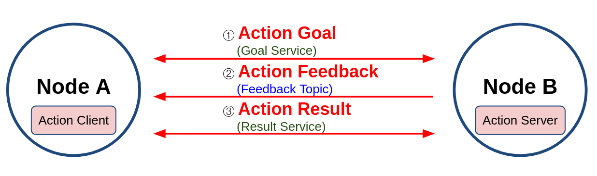
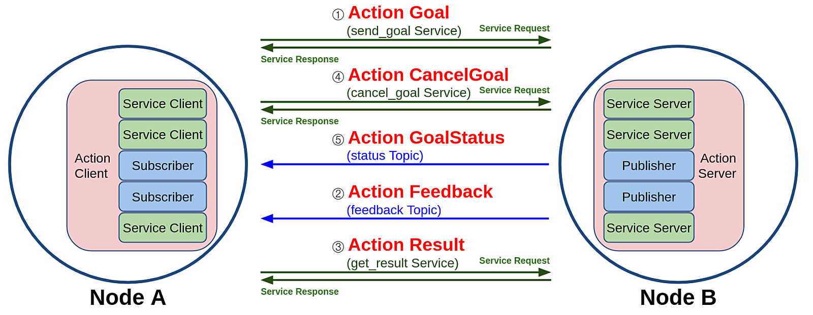
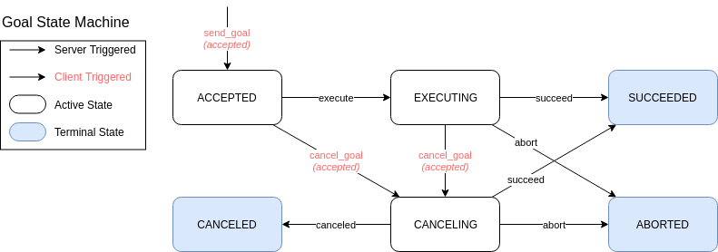
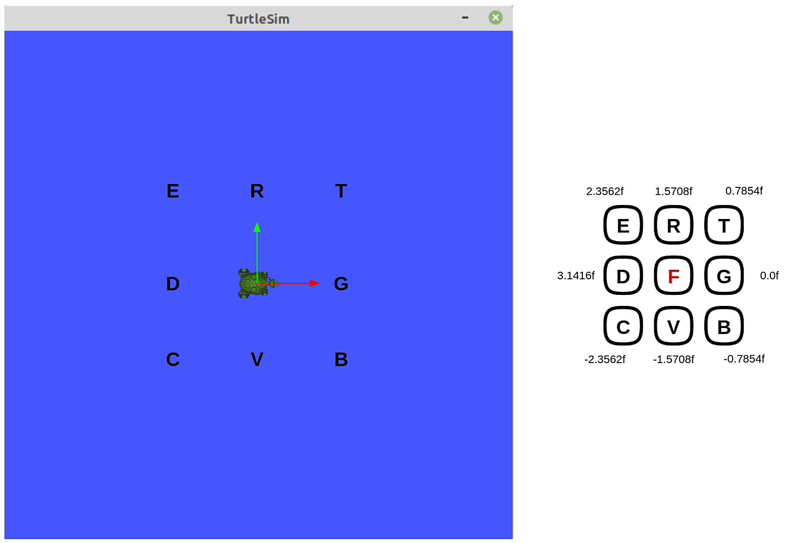
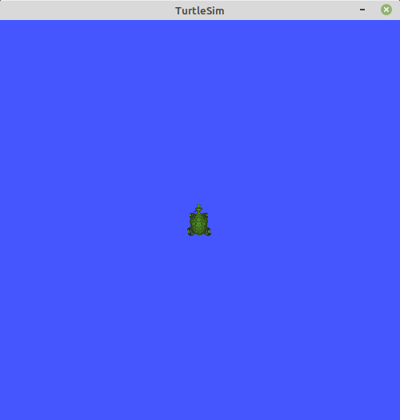
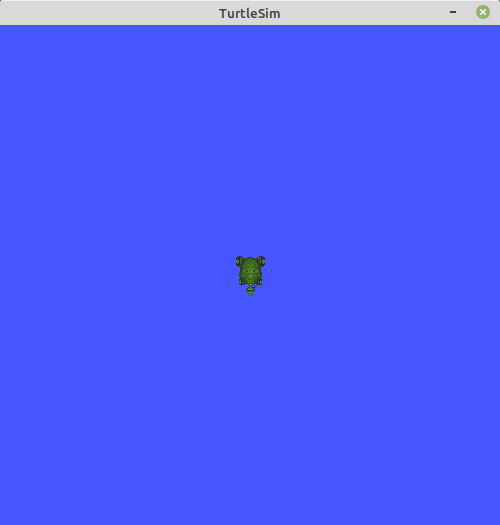

# Chapter 11: ROS 2 액션 (action)
## 01. 약션 (action)
- 액션(action)은 그림의 `Node A - Node B`처럼 비동기식+동기식 양방향 메시지 송수신 방식으로 액션 목표 (goal)를 지정하는 Action Client과 액션 목표를 받아 특정 태스크를 수행하면서 중간 결괏값에 해당되는 액션 피드백(feedback)과 최종 결괏값에 해당되는 액션 결과(result)를 전송하는 Action Server 간의 통신이라고 볼 수 있다.
- 이는 ROS 1의 액션 컨셉과 동일하다.



- 추가로 액션의 구현 방식을 더 자세히 살펴보면 아래 그림과 같이 토픽과 서비스의 혼합이라고 볼 수 있는데 ROS 1이 토픽만을 사용하였다면 ROS 2에서는 액션 목표, 액션 결과, 액션 피드백은 토픽과 서비스가 혼합되어 있다.
- 즉, 그림과 같이 Action Client는 Service Client 3개와 Topic Subscriber 2개로 구성되어있으며, Action Server는 Service Server 3개와 Topic Publisher 2개로 구성된다.
- 액션 목표/피드백/결과(goal/feedback/result) 데이터는 msg 및 srv 인터페이스의 변형으로 action 인터페이스라고 한다.



- ROS 1에서의 액션은 목표, 피드백, 결과 값을 토픽으로만 주고 받았는데 ROS 2에서는 토픽과 서비스 방식을 혼합하여 사용하였다.
- 그 이유로 토픽으로만 액션을 구성하였을 때 토픽의 특징인 비동기식 방식을 사용하게 되어 ROS 2 액션에서 새롭게 선보이는 목표 전달(send_goal), 목표 취소 (cancel_goal), 결과 받기 (get_result)를 동기식인 서비스를 사용하기 위해서이다.
- 이런 비동기 방식을 이용하다보면 원하는 타이밍에 적절한 액션을 수행하기 어려운데 이를 원할히 구현하기 위하여 목표 상태(goal_state)라는 것이 ROS 2에서 새롭게 선보였다.
- 목표 상태는 목표 값을 전달 한 후의 상태 머신을 구동하여 액션의 프로스세를 쫒는 것이다.
- 여기서 말하는 상태머신은 Goal State Machine으로 아래 그림과 같이 액션 목표 전달 이후의 액션의 상태 값을 액션 클라이언트에게 전달할 수 있어서 비동기, 동기 방식이 혼재된 액션의 처리를 원할하게 할 수 있게 되어 있다.



## 02. 액션 서버 및 클라이언트
- 이번 ROS 2 액션 (action) 실습에도 지난 강좌 때와 마찬가지로 turtlesim 노드와 teleop_turtle 노드를 이용하여 테스트해보겠다.
- 아래와 같이 두개의 노드를 각각 실행하자.
```
$ ros2 run turtlesim turtlesim_node
```
```
$ ros2 run turtlesim turtle_teleop_key
Reading from keyboard
---------------------------
Use arrow keys to move the turtle.
Use G|B|V|C|D|E|R|T keys to rotate to absolute orientations. 'F' to cancel a rotation.
'Q' to quit.
```
- 지금까지는 teleop_turtle 노드가 실행된 터미널 창에서 ← ↑ ↓ → 키와 같이 화살표 키를 눌러 turtlesim의 거북이를 움직여봤는데 이번에는 G, B, V, C, D, E, R, T 키를 사용해보겠다.
- 이 키들은 각 거북이들의 rotate_absolute 액션을 수행함에 있어서 액션의 목표 값을 전달하는 목적으로 사용된다.
- F키를 중심으로 주위의 8개의 버튼을 사용하는 것으로 아래 그림과 같이 각 버튼은 거북이를 절대 각도로 회전하도록 목표 값이 설정되어 있다.
- 그리고 F 키를 누르면 전달한 목표 값을 취소하여 동작을 바로 멈추게 된다.
- 여기서 G 키는 시계 방향 3시를 가르키는 theta 값인 0.0 값에 해당되고 rotate_absolute 액션의 기준 각도가 된다.
- 다른 키는 위치별로 0.7854 radian 값씩 정회전 방향(반시계 방향)으로 각 각도 값이 할당되어 있다.
- 예를 들어 R 키를 누르면 1.5708 radian 목표 값이 전달되어 거북이는 12기 방향으로 회전하게 된다.
- 각 키에 할당된 라디안 값은 코드를 확인하면 자세히 살펴볼 수 있다.



- 액션 목표는 도중에 취소할 수도 있는데 turtlesim_node 에도 그 상황을 터미널 창에 표시해준다.
- 예를 들어 액션 목표의 취소 없이 목표 theta 값에 도달하면 아래와 같이 표시된다.
```
[INFO]: Rotation goal completed successfully
```
- 하지만 액션 목표 theta 값에 도달하기 전에 turtle_teleop_key가 실행된 터미널 창에서 F 키를 눌러 액션 목표를 취소하게 되면 turtlesim_node이 실행된 터미널 창에 아래와 같이 목표가 취소 되었음을 알리면서 거북이는 그 자리에서 멈추게된다.
```
[INFO]: Rotation goal canceled
```

## 03. 노드 정보 (ros2 node info)
- 각 실행된 노드의 액션 정보를 확인하기 위해서는 노드 정보 (ros2 node info) 명령어를 사용하는데 Ch08 강좌에서 이미 한번 다루었다.
- 액션 부분만 발췌하면 아래와 같음을 확인할 수 있다.
- 즉, turtlesim 노드는 Action Server 역할을 하며 turtlesim/action/RotateAbsolute 이라는 action 인터페이스를 사용하는 /turtle1/rotate_absolute 이라는 이름의 액션 서버임을 확인할 수 있다.
- teleop_turtle 노드는 /turtle1/rotate_absolute의 액션의 Action Client 역할을 하고있다.
```
$ ros2 node info /turtlesim
/turtlesim
(생략)
  Action Servers:
    /turtle1/rotate_absolute: turtlesim/action/RotateAbsolute
  Action Clients:
```
```
$ ros2 node info /teleop_turtle
/teleop_turtle
(생략)
  Action Servers:

  Action Clients:
    /turtle1/rotate_absolute: turtlesim/action/RotateAbsolute
```
- 여기에 추가로 더 설명하자면 rotate_absolute 액션은 하기와 같이 send_goal, cancel_goal, status, feedback, get_result 의 5가지로 더 세분화되어 있다.
- 이 각 액션 목표, 피드백, 결과에 대한 처리는 프로그래밍시 작성하게 되는데 액션 프로그래밍 방법은 다른 실습 강좌에서 더 자세하게 다루도록 하겠다.
```
/turtle1/rotate_absolute/_action/send_goal: turtlesim/action/RotateAbsolute_SendGoal

/turtle1/rotate_absolute/_action/cancel_goal: action_msgs/srv/CancelGoal

/turtle1/rotate_absolute/_action/status: action_msgs/msg/GoalStatusArray

/turtle1/rotate_absolute/_action/feedback: turtlesim/action/RotateAbsolute_FeedbackMessage

/turtle1/rotate_absolute/_action/get_result: turtlesim/action/RotateAbsolute_GetResult
```

## 04. 액션 목록 (ros2 action list -t)
- 액션 정보를 확인하는 방법으로는 위와 같이 특정 노드의 정보를 확인하는 방법 이외에도 액션 목록 (ros2 action list -t) 명령어를 이용하여 현재 개발 환경에서 실행 중인 액션의 목록을 확인하는 방법도 있다.
```
$ ros2 action list -t
/turtle1/rotate_absolute [turtlesim/action/RotateAbsolute]
```

## 05. 액션 정보 (ros2 action info)
- 검색된 액션 목록의 더 자세한 정보를 확인하기 위해서는 액션 정보 (ros2 action info) 명령어를 이용하면 되는데 그 결과로 사용되는 액션 이름과 해당 액션의 서버 및 클라이언트 노드 이름 및 갯수를 표시해준다.
```
$ ros2 action info /turtle1/rotate_absolute
Action: /turtle1/rotate_absolute
Action clients: 1
    /teleop_turtle
Action servers: 1
    /turtlesim
```

## 06. 액션 목포 (action goal) 전달
- 위 `02. 액션 서버 및 클라이언트`에서는 teleop_turtle를 Action client로 하여 액션 목표(action goal)를 전달해보았다.
- 이번에는 `ros2 action send_goal` 명령어를 통하여 액션 목표(action goal)를 전달해보겠다.
- 이 명령어는 아래와 같이 `ros2 action send_goal` 명령어에 액션 이름, 액션 형태, 목표 값을 차례로 입력하면 된다.
```
ros2 action send_goal <action_name> <action_type> "<values>"
```
- 예를 들어 거북이를 12시 방향인 theta: 1.5708 값을 목표로 주게되면 아래 그림과 같이 이동하게 되며 아래 처럼 전달한 목표 값과 액션 목표의 UID(Unique ID), 결괏값으로 이동 시작 위치로의 변위 값인 delta를 결과로 보여주며 마지막으로 상태를 표시하게 된다.
```
$ ros2 action send_goal /turtle1/rotate_absolute turtlesim/action/RotateAbsolute "{theta: 1.5708}"
Waiting for an action server to become available...
Sending goal:
     theta: 1.5708

Goal accepted with ID: b991078e96324fc994752b01bc896f49

Result:
    delta: -1.5520002841949463

Goal finished with status: SUCCEEDED
```



- 위 명령어에서는 피드백이 포함되어 있지 않았는데 이를 화면에 표시하기 위해서는 아래와 같이 --feedback 옵션을 붙여주면 된다.
- 이를 통해 거북이가 정해진 theta (-1.5708, 시계 6시 방향)으로 회전하며 위에서 언급한 목표 값, UID, 결괏값, 상태 값 이외에도 Feedback 값으로 총 회전 값의 남은 회전 량을 피드백으로 표시하게 된다.
- 이를 수행하면 아래 그림과 같이 시계 6시 방향으로 회전하게 된다.
```
$ ros2 action send_goal /turtle1/rotate_absolute turtlesim/action/RotateAbsolute "{theta: -1.5708}" --feedback
Waiting for an action server to become available...
Sending goal:
     theta: -1.5708

Goal accepted with ID: ad7dc695c07c499782d3ad024fa0f3d2

Feedback:
    remaining: -3.127622127532959

Feedback:
    remaining: -3.111621856689453

Feedback:
    remaining: -3.0956220626831055

(생략)

Feedback:
    remaining: -0.03962135314941406

Feedback:
    remaining: -0.023621320724487305

Feedback:
    remaining: -0.007621288299560547

Result:
    delta: 3.1040005683898926

Goal finished with status: SUCCEEDED
```



## 07. 액션 인터페이스 (action interface, action)
- Ch09 강좌에서는 메시지 인터페이스(message interface, msg), Ch10 강좌에서는 서비스 인터페이스(service interface, srv)에 대해 알아보았다.
- 여기서 다룬 액션 또한 토픽, 서비스와 마찬가지로 별도의 인터페이스를 가지고 있는데 이를 액션 인터페이스라 부르며, 파일로는 action 파일을 가르킨다.
- 액션 인터페이스는 메시지 및 서비스 인터페이스의 확장형이라고 볼 수 있는데 위에서 액션 목표를 전달할 때 실습으로 사용하였던 /turtle1/rotate_absolute 서비스를 예를 들어 설명하겠다.
- /turtle1/rotate_absolute 액션에 사용된 RotateAbsolute.action 인터페이스를 알아보기 위해서는 원본 파일을 참고해도 되고, `ros2 interface show` 명령어를 이용하여 확인할 수 있다.
- 이 명령어를 이용하면 아래의 결괏값과 같이 `turtlesim/action/RotateAbsolute.action`은 float32 형태의 theta, delta, remaining 라는 세개의 데이터가 있음을 알 수 있다.
- 여기서 서비스와 마찬가지로 `---` 이라는 구분자를 사용하여 액션 목표(goal), 액션 결과(result), 액션 피드백(feedback)으로 나누어 사용하게 된다.
- 즉 theta는 액션 목표, delta는 액션 결과, remaining는 액션 피드백에 해당된다.
- 참고로 각 데이터는 각도의 SI 단위인 라디안(radian)을 사용한다.
```
$ ros2 interface show turtlesim/action/RotateAbsolute.action
# The desired heading in radians
float32 theta
---
# The angular displacement in radians to the starting position
float32 delta
---
# The remaining rotation in radians
float32 remaining
```

[출처] 011 ROS 2 액션 (action) (오픈소스 소프트웨어 & 하드웨어: 로봇 기술 공유 카페 (오로카)) | 작성자 표윤석
