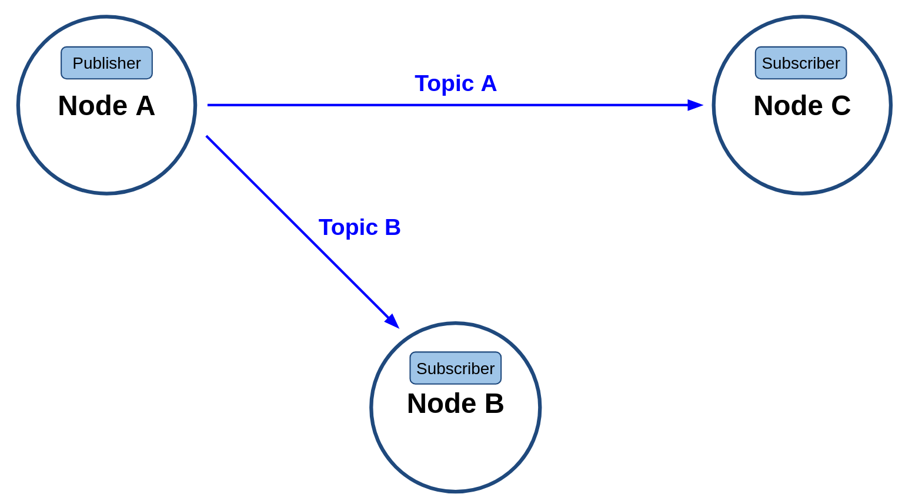
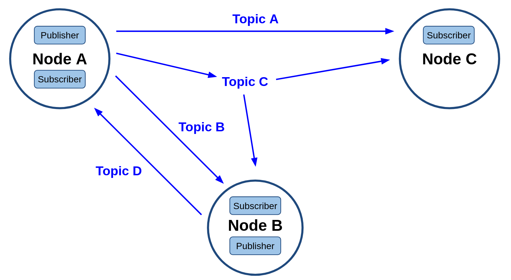
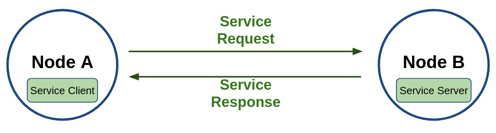
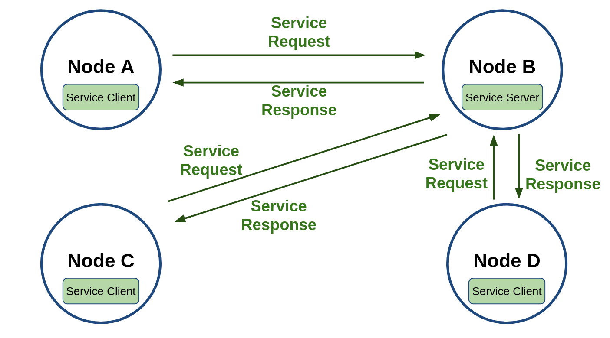
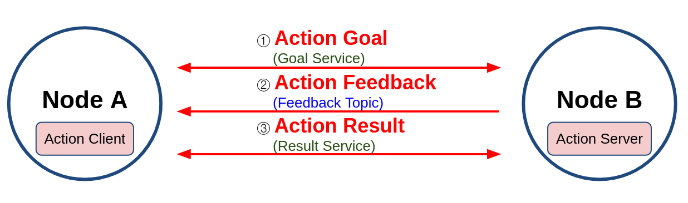
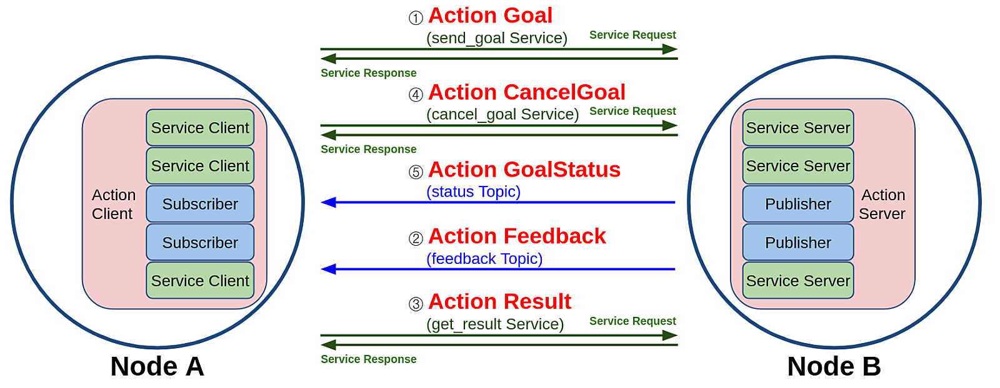
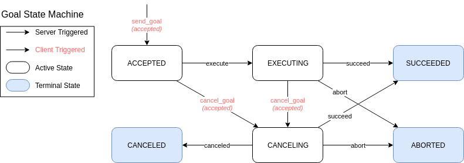

# Chapter 12: ROS 2 토픽/서비스/액션 정리 및 비교
## 01. ROS 2 토픽/서비스/액션
- 이번 강좌는 이전에 걸쳐서 다루었던 토픽/서비스/액션을 모두 모아서 정리하고 비교해서 이해를 더욱 높이기 위함에 있다.
- 이어지는 2~4번 항목은 이전 강좌의 복습편으로 토픽, 서비스, 액션 설명을 답습하는 형태이고 3개의 통신을 비교하는 내용만 참고하려면 5번 항목 부터 참고하길 바란다.

## 02. 토픽 (topic)
- 토픽(topic)은 그림의 `Node A - Node B`처럼 비동기식 단방향 메시지 송수신 방식으로 msg 메시지 형태의 메시지를 발행하는 `Publisher`와 메시지를 구독하는 `Subscriber` 간의 통신이라고 볼 수 있다.
- 이는 1:1 통신을 기본으로 하지만 두번째 그림의 `Node A - Node B`, `Node A - Node C`와 같이 하나의 토픽(예: Topic C)을 송수신하는 1:N도 가능하고 그 구성 방식에 따라 N:1, N:N 통신도 가능하며 ROS 메시지 통신에서 가장 널리 사용되는 통신 방법이다.

- 그리고 아래 그림의 `Node A`처럼 하나의 이상의 토픽을 발행할 수 있을 뿐만이 아니라 `Publisher` 기능과 동시에 토픽(예: Topic D)을 구독하는 `Subscriber` 역할도 동시에 수행할 수 있다.
- 원한다면 자신이 발행한 토픽을 셀프 구독할 수 있게 구성할 수도 있다.
- 이처럼 토픽 기능은 목적에 따라 다양한 방법으로 사용할 수 있는데 이러한 유연성으로 다양한 곳에 사용중에 있다.
- 경험상 ROS 프로그래밍시에 70% 이상이 토픽으로 사용될 정도로 통신 방식 중에 가장 기본이 되며 가장 널리쓰이는 방법이다.
- 기본 특징으로 비동기성과 연속성을 가지기에 센서 값 전송 및 항시 정보를 주고 받아야하는 부분에 주로 사용된다.

## 03. 서비스 (service)
- 서비스(service)는 아래 그림의 `Node A - Node B`처럼 동기식 양방향 메시지 송수신 방식으로 서비스의 요청(Request)을 하는 쪽을 Service Client라고 하며 요청받은 서비스를 수행한 후 서비스의 응답(Response)을 하는 쪽을 Service Server라고 한다.
- 결국 서비스는 특정 요청을 하는 클라이언트 단과 요청받은 일을 수행 후에 결괏값을 전달하는 서버 단과의 통신이라고 볼 수 있다.
- 서비스 요청 및 응답(Request/Response) 또한 위에서 언급한 msg 인터페이스의 변형으로 srv 인터페이스라고 한다.

- 서비스는 아래 그림과 같이 동일 서비스에 대해 복수의 클라이언트를 가질 수 있도록 설계되었다.
- 단, 서비스 응답은 서비스 요청이 있었던 서비스 클라이언트에 대해서만 응답을 하는 형태로 그림의 구성에서 예를 들자면 Node C의 Service Client가 Node B의 Service Server에게 서비스 요청을 하였다면 Node B의 Service Server는 요청받은 서비스를 수행한 후 Node C의 Service Client에게만 서비스 응답을 하게된다.

## 04. 액션 (action)
- 액션(action)은 아래 그림의 `Node A - Node B`처럼 비동기식+동기식 양방향 메시지 송수신 방식으로 액션 목표 (goal)를 지정하는 Action Client과 액션 목표를 받아 특정 태스크를 수행하면서 중간 결괏값에 해당되는 액션 피드백(feedback)과 최종 결괏값에 해당되는 액션 결과(result)를 전송하는 Action Server 간의 통신이라고 볼 수 있다.
- 이는 ROS 1의 액션 컨셉과 동일하다.

- 추가로 액션의 구현 방식을 더 자세히 살펴보면 아래 그림과 같이 토픽과 서비스의 혼합이라고 볼 수 있는데 ROS 1이 토픽만을 사용하였다면 ROS 2에서는 액션 목표, 액션 결과, 액션 피드백은 토픽과 서비스가 혼합되어 있다.
- 즉, 그림과 같이 Action Client는 Service Client 3개와 Topic Subscriber 2개로 구성되어있으며, Action Server는 Service Server 3개와 Topic Publisher 2개로 구성된다.
- 액션 목표/피드백/결과(goal/feedback/result) 데이터는 msg 및 srv 인터페이스의 변형으로 action 인터페이스라고 한다.

- ROS 1에서의 액션은 목표, 피드백, 결과 값을 토픽으로만 주고 받았는데 ROS 2에서는 목표 상태 (goal_state) 및 피드백 (feedback)은 비동기식의 토픽을 사용하고, 목표 전달 (send_goal), 목표 취소 (cancel_goal), 결과 받기(get_result)는 동기식인 서비스를 사용하는 등 토픽과 서비스 방식을 혼합하여 사용하였다.
- 이런 동기식과 비동기 방식의 혼합 사용은 원하는 타이밍에 적절한 액션을 수행하기 어려울 수 있는데 이를 원할히 구현하기 위하여 ROS 2에서는 액션 프로세스 내에 상태 머신(state machine)을 새롭게 선보였다.
- 목표 상태는 목표 값을 전달 한 후의 상태 머신을 구동하여 액션의 프로스세를 쫒는 것이다.
- 여기서 말하는 상태머신은 Goal State Machine으로 아래 그림과 같이 액션 목표 전달 이후의 액션의 상태 값을 액션 클라이언트에게 전달할 수 있어서 동기, 비동기 방식이 혼재된 액션의 처리를 원할하게 할 수 있게 되어 있다.

## 05. 토픽, 서비스, 액션 비교
- 지금까지 강좌에서 다루었던 토픽, 서비스, 액션은 ROS의 중요 컨셉이자 앞으로 강좌에서 다룰 ROS 프로그래밍에 있어서 매우 중요한 부분이기에 다시 한번 비교를 해보도록 하겠다.
- 여기서 비교한 연속성, 방향성, 동기성, 다자간 연결, 노드 역할, 동작 트리거, 인터페이스를 각 토픽, 서비스, 액션의 서로 다른 특징이라고 볼 수 있고 노드간의 데이터 전송에 있어서 특성에 맞게 선택하여 ROS 프로그래밍을 하게 된다. 

|-|토픽 (topic)|서비스 (service)|액션 (action)|
|:---:|:---:|:---:|:---:|
|연속성|연속성|일회성|복합 (토픽 + 서비스)|
|방향성|단방향|양방향|양방향|
|동기성|비동기|동기|동기 + 비동기|
|다자간 연결|1:1, 1:N, N:1, N:N   (publisher:subscriber)|1:1   (server:client)|1:1   (server:client)|
|노드 역할|publisher   subscriber|server   client|server   client|
|동작 트리거|publisher|client|client|
|인터페이스|msg 인터페이스|srv 인터페이스|action 인터페이스|
|CLI 명령어|`ros2 topic`   `ros2 interface`|`ros2 service`   `ros2 interface`|`ros2 action`   `ros2 interface`|
|사용 예|센서 데이터, 로봇 상태, 로봇 좌표 등|LED 제어, 모터 토크, 이동 경로 계산|목적지로 이동, 물건 파지|

- 아래의 표는 토픽, 서비스, 액션에서 사용되는  msg, srv, action 인터페이스를 비교한 내용이다.
- 모든 인터페이스는 msg 인터페이스의 확장형이라고 생각하면 되고 `---` 구분자가 0, 1, 2개로 몇개를 넣어 데이터를 구분했냐의 차이이다.

|-|msg 인터페이스|srv 인터페이스|action 인터페이스|
|:---:|:---:|:---:|:---:|
|확장자|`*.msg`|`*.srv`|`*.action`|
|데이터|토픽 데이터 (data)|서비스 요청 (request)   ---   서비스 응답 (response)|액션 목표 (goal)   ---   액션 결과 (result)   ---   액션 피드백 (feedback)|
|형식|fieldtype1 fieldname1   fieldtype2 fieldname2   fieldtype3 fieldname3|fieldtype1 fieldname1   fieldtype2 fieldname2   ---   fieldtype3 fieldname3   fieldtype4 fieldname4|fieldtype1 fieldname1   fieldtype2 fieldname2   ---   fieldtype3 fieldname3   fieldtype4 fieldname 4   ---   fieldtype5 fieldname5   fieldtype6 fieldname 6|
|사용 예|[geometry_msgs/msg/Twist]|[turtlesim/srv/Spawn.srv]|[turtlesim/action/RotateAbsolute.action]|
|사용 예|Vector3 linear   Vector3 angular|float32 x   float32 y   float32 theta   string name   ---   string name|float32 theta   ---   float32 delta   ---   float32 remaining|

[출처] 012 ROS 2 토픽/서비스/액션 정리 및 비교 (오픈소스 소프트웨어 & 하드웨어: 로봇 기술 공유 카페 (오로카)) | 작성자 표윤석
