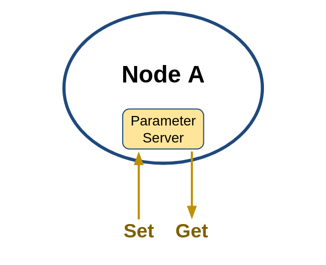
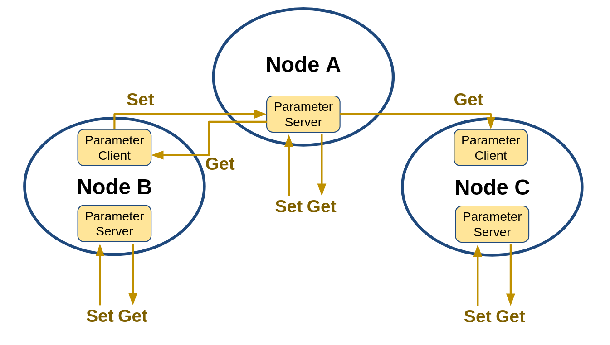

# Chapter 13: ROS 2 파라미터 (parameter)
## 01. 파라미터 (parameter)
- ROS 2에서의 파라미터(parameter)는 아래 그림과 같이 각 노드에서 파라미터 관련 Parameter server를 실행시켜 두번째 그림과 같이 외부의 Parameter client 와 통신으로 파라미터를 변경하는 것으로 Ch10 강좌에서 다루었던 서비스(service)와 동일하다고 볼 수 있다.
- 단 서비스가 서비스 요청과 응답이라는 RPC(remote procedure call)가 목적이었다면 파라미터는 노드 내 매개변수를 서비스 데이터 통신 방법을 사용하여 노드 내부 또는 외부에서 쉽게 지정(Set) 하거나 변경할 수 있고, 쉽게 가져(Get)와서 사용할 수 있게 하는 점에서 그 사용 목적이 다르다고 볼 수 있다.



- 파라미터 관련 기능은 RCL(ROS Client Libraries)의 기본 기능으로 아래 그림과 같이 모든 노드가 자신만의 Parameter server를 가지고 있고, 아래 그림과 같이 각 노드는 Parameter client도 포함시킬 수 있어서 자기 자신의 파라미터 및 다른 노드의 파라미터를 읽고 쓸수 있게 된다.
- 이를 활용하면 각 노드의 다양한 매개변수를 글로벌 매개변수처럼 사용할 수 있게 되어 추가 프로그래밍이나 컴파일 없이 능동적으로 변화 가능한 프로세스를 만들 수 있게 된다.
- 그리고 각 파라미터는 yaml 파일 형태의 파라미터 설정 파일을 만들어 초기 파라미터 값 설정 및 노드 실행시에 파라미터 설정 파일을 불러와서 사용할 수 있기에 ROS 2 프로그래밍에 매우 유용하게 사용할 수 있다.



## 02. 파라미터 목록 확인 (ros2 param list)
- 우선 파라미터 사용 방법 실습에 앞서서 우리 ROS의 친구인 거북이를 불러오도록 하겠다.
- 다음과 같이 2개의 터미널 창에서 각각 turtlesim 노드와 teleop_turtle 노드를 실행시키자.
```
$ ros2 run turtlesim turtlesim_node
```
```
$ ros2 run turtlesim turtle_teleop_key
```
- 그 뒤 아래와 같이 파라미터 목록을 확인할 수 있는 파라미터 목록 확인 (ros2 param list) 명령어를 사용하면 현재 개발 환경에서 실행 중인 노드(2개, turtlesim와 teleop_turtle)의 Parameter server에 접근하여 현재 사용 가능한 파라미터를 노드별로 목록화 하여 표시하게 된다.
- 여기서 `use_sim_time`이라는 파라미터가 공통으로 보이는데 이는 모든 노드의 기본 파라미터로 나중에 다룰 예정인 ROS의 3차원 시뮬레이터 Gazebo 등의 시뮬레이션 때 사용하는 파라미터임을 알아두자.
```
$ ros2 param list
/teleop_turtle:
  scale_angular
  scale_linear
  use_sim_time
/turtlesim:
  background_b
  background_g
  background_r
  use_sim_time
```

## 03. 파라미터 내용 확인 (ros2 param describe)
- 이번에는 파라미터 목록 확인을 통해 알아본 파라미터가 어떤 형태, 목적, 데이터 형태, 최소/최댓값을 가지는지 알아보자.
- 이를 알아보기 위해서는 파라미터 내용 확인 (ros2 param describe) 명령어를 이용하면 되고 실제 사용 방법은 다음 명령어와 같이 `ros2 param describe` 명령어에 노드 이름과 파라미터 이름을 지정하면 된다.
- 아래 예제는 turtlesim 노드의 background_b 파라미터에 대해 알아본 결과로 파라미터 이름은 background_b 이고, 데이터 형태는 integer 이며, 배경 컬러의 파랑 채널이라는 설명과 함께 최소, 최대, 스텝 값을 확인할 수 있다.
```
$ ros2 param describe /turtlesim background_b
Parameter name: background_b
  Type: integer
  Description: Blue channel of the background color
  Constraints:
    Min value: 0
    Max value: 255
    Step: 1
```

## 04. 파라미터 읽기 (ros2 param get)
- 파라미터 읽기 (ros2 param get) 명령어는 아래와 같이 파라미터 읽기 (ros2 param get) 명령어에 노드 이름과 파라미터 이름을 함께 적어주면 된다.
```
ros2 param get <node_name> <parameter_name>
```
- 예를 들어 위에서 사용했던 파라미터 목록 확인 (ros2 param list) 명령어를 통해 확인된 background_r, background_g, background_b 파라미터의 값을 읽어 오면 아래와 같은 결과를 확인할 수 있다.
- 즉, 현재 실행 중인 turtlesim 노드의 배경색은 r = 69, g = 86, b = 255 값의 색상으로 Neon Blue(#4556FF, https://www.htmlcsscolor.com/hex/4556FF)에 해당되게 된다.
- 지금까지 강좌에서 파란색 화면 상의 거북이라고 했었는데 그 파란색이 정확히는 r = 69, g = 86, b = 255 이였던 것이다.
```
$ ros2 param get /turtlesim background_r
Integer value is: 69

$ ros2 param get /turtlesim background_g
Integer value is: 86

$ ros2 param get /turtlesim background_b
Integer value is: 255
```

## 05. 파라미터 쓰기 (ros2 param set)
- 위에서 파라미터 읽기를 해봤으니 다음은 파라미터 쓰기를 해보자.
- 파라미터 쓰기 (ros2 param set) 명령어는 아래와 같이 파라미터 쓰기 (ros2 param set) 명령어에 노드 이름, 파라미터 이름, 변경할 파라미터의 값을 지정하면 된다.
```
ros2 param set <node_name> <parameter_name> <value>
```
- 예를 들어 배경색을 Dark Violet(#9400D3, https://www.htmlcsscolor.com/hex/9400D3)으로 변경하기 위하여 r = 148, g = 0, b = 211 값으로 변경해보자.
```
$ ros2 param set /turtlesim background_r 148
Set parameter successful

$ ros2 param set /turtlesim background_g 0
Set parameter successful

$ ros2 param set /turtlesim background_b 211
Set parameter successful
```
- 이 명령어가 문제없이 실행되었다면 기본 Neon Blue 의 배경색에서 그림의 Dark Violet 배경색으로 변경되었음을 확인할 수 있을 것이다.
- 이렇게 파라미터는 별도의 추가 프로그래밍 작업 없이도 정해놓은 파라미터를 외부에서 읽고, 쓰기를 하여 프로그래밍, 컴파일 과정이 없이도 다양한 기능을 구현할 수 있게 된다.
- 위 예제에서는 파라미터의 외부 접근만 다루었지만 해당 노드의 내부에서도 이 파라미터를 자유롭게 접근 가능하기 때문에 개발자가 원하는 형태로 쓸 수 있는 글로벌 매개변수로 생각하고 이용해도 좋을 것이다.
- 그리고 이 강좌에서는 `ros2 param` 이라는 ROS 2 CLI 툴을 이용하였지만 이 이외에도 GUI 형태의 rqt 플러그인을 이용하면 더욱 편하다.
- 이 부분은 다음 강좌에서 다루기로 하겠다.
- 그리고 파라미터 관련 툴이 아닌 각 연관된 노드들의 코드에 파라미터 클라이언트 형태로 사용할 수 있게 API를 갖추고 있기에 다양한 목적으로, 다양한 프로그래밍 언어로, 다양한 구현 방식으로 사용할 수 있게 되어 있다.

## 06. 파라미터 저장 (ros2 param dump)
- 위 내용에서 파라미터 쓰기 (ros2 param set)를 사용하면 기본 파라미터의 값을 바꾸어 사용할 수 있다는 것을 알았다.
- 이 명령어를 이용하면 파라미터를 변경할 수 있지만 turtlesim 노드를 종료하였다가 다시 시작하면 모든 파라미터는 초깃값으로 다시 설정된다.
- 이에 필요하다면 현재 파라미터를 저장하고 다시 불러와야 하는데 이 때에는 파라미터 저장 (ros2 param dump) 명령어를 이용하면 된다.
- 파라미터 저장 (ros2 param dump)는 아래와 같이 `ros2 param dump` 명령어에 노드 이름을 적어주면 현재 폴더에 해당 노드 이름으로 설정 파일이 yaml 형태로 저장된다.
- 예를 들어 아래 예제에서는 `turtlesim.yaml` 파일로 저장되었다.
```
$ ros2 param dump /turtlesim
Saving to: ./turtlesim.yaml
```
- 이 `turtlesim.yaml` 파일에는 turtlesim 노드가 파라미터 서버로하여 가지고 있는 background_r, background_g, background_b, use_sim_time 과 같이 4개의 파라미터의 현재 값이 저장되게 된다.
```
$ cat ./turtlesim.yaml
turtlesim:
  ros__parameters:
    background_b: 211
    background_g: 0
    background_r: 148
    use_sim_time: false
```
- 노드 실행시 저장된 파라미터 값들을 사용하려면 아래 예제와 같이 --ros-args --params-file 옵션과 함께 지정된 yaml 파일의 위치를 적어주면 된다.
- 이 명령어 처럼 노드 실행시 파라미터 파일을 함께 기재하면 파라미터의 기본 값이 지정된 파일에 기재된 내용으로 초기화하게 된다.
```
$ ros2 run turtlesim turtlesim_node --ros-args --params-file ./turtlesim.yaml
```

## 07. 파라미터 삭제 (ros2 param delete)
- 특정 파라미터 삭제는 아래 예제와 같이 `ros2 param delete` 명령어에 노드 이름과 파라미터 이름을 적어주면 된다.
- 일반적인 경우에는 많이 사용되지는 않는 명령어이다.
```
$ ros2 param delete /turtlesim background_b
Deleted parameter successfully
```
- 파라미터가 삭제된 상태를 확인해보면 아래 예제와 같다.
```
$ ros2 param list /turtlesim
  background_g
  background_r
  use_sim_time
```

[출처] 013 ROS 2 파라미터 (parameter) (오픈소스 소프트웨어 & 하드웨어: 로봇 기술 공유 카페 (오로카)) | 작성자 표윤석
